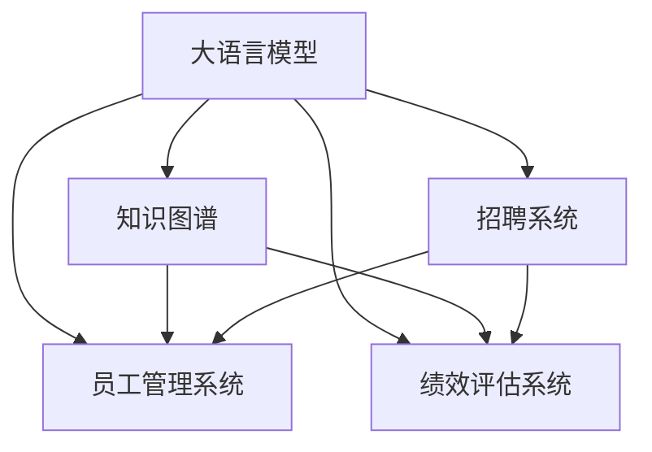

                 

# LLM对传统人力资源管理的革新

> 关键词：大语言模型(LLM), 人力资源管理(HRM), 人才识别, 招聘优化, 员工管理, 知识管理, 自我学习

## 1. 背景介绍

### 1.1 问题由来
人力资源管理(Human Resource Management, HRM)作为企业运营的核心职能之一，肩负着人才招聘、员工管理、绩效评估、培训发展等多项重要任务。然而，传统的HRM往往依赖于人工操作，流程繁琐、效率低下、容易出错，难以满足企业快速变化的业务需求。尤其是在人才竞争日益激烈、劳动力市场日益灵活的今天，人力资源管理的挑战更加严峻。

近年来，人工智能(AI)技术的飞速发展，特别是自然语言处理(NLP)和大规模语言模型(LLM)的崛起，为HRM的数字化转型提供了新的可能性。基于LLM的智能人力资源管理平台，可以在招聘、员工管理、知识管理等多个环节实现自动化、智能化，大幅提升HRM的效率和效果。

### 1.2 问题核心关键点
LLM在HRM中的应用，核心在于其强大的自然语言理解与生成能力。通过深度学习模型训练，LLM可以在大规模文本数据上学习到丰富的语言知识和行业经验，具备高度的上下文理解能力和语义推理能力。因此，可以将其用于文本数据的自动化处理、自然语言查询、知识抽取与整合等任务，为HRM提供强有力的支持。

具体应用场景包括：
- **人才识别与招聘优化**：通过分析职位描述和简历，自动筛选匹配度高的候选人。
- **员工管理与绩效评估**：基于员工反馈和绩效数据，生成客观公正的绩效评估报告。
- **知识管理与员工培训**：利用知识图谱和问答系统，帮助员工快速获取所需知识和技能。
- **自我学习与个性化管理**：通过个人成长轨迹数据，提供个性化的职业发展建议。

本文将围绕大语言模型在人力资源管理中的应用，深入探讨其核心原理、具体操作步骤、数学模型及其实际应用案例，并对未来发展趋势和挑战进行展望。

## 2. 核心概念与联系

### 2.1 核心概念概述

为更好地理解LLM在HRM中的应用，本节将介绍几个密切相关的核心概念：

- **大语言模型(LLM)**：以Transformer为代表的深度学习模型，经过在大规模无标签文本数据上的自监督训练，能够理解并生成自然语言。
- **自然语言处理(NLP)**：通过计算方法让计算机理解和处理人类语言，包括分词、句法分析、语义分析等任务。
- **知识图谱(KG)**：利用图结构对领域知识进行建模，便于知识抽取和整合。
- **招聘系统(Recruitment System)**：用于自动化管理招聘流程，从候选人筛选到入职全流程的自动化管理。
- **员工管理系统(Employee Management System)**：实现员工入职、考勤、绩效、培训等全生命周期管理。
- **绩效评估系统(Performance Evaluation System)**：通过量化指标对员工绩效进行客观评估。

这些核心概念之间的逻辑关系可以通过以下Mermaid流程图来展示：



这个流程图展示了大语言模型与知识图谱、招聘系统、员工管理系统和绩效评估系统的联系：

1. 大语言模型从知识图谱中学习领域知识，提升知识抽取和整合能力。
2. 通过招聘系统和大语言模型，可以自动筛选候选人并生成自动化简历评估报告。
3. 员工管理系统利用大语言模型进行自动化管理，如智能排班、员工反馈处理等。
4. 绩效评估系统通过大语言模型，生成客观公正的绩效评估报告。

## 3. 核心算法原理 & 具体操作步骤
### 3.1 算法原理概述

基于LLM的智能人力资源管理平台，其核心原理是通过大规模预训练模型对文本数据进行语义理解和知识抽取，再结合领域知识，进行自动化处理和智能化决策。其核心步骤如下：

1. **文本数据预处理**：对招聘信息、员工反馈、绩效数据等文本数据进行清洗、分词、去停用词等预处理，转换为LLM可处理的形式。
2. **知识抽取与整合**：利用LLM在预训练过程中学习到的语言知识，对文本数据进行知识抽取，如抽取实体、关系、属性等。
3. **决策支持**：根据抽取的知识和领域经验，结合LLM生成的自然语言，进行决策支持，如推荐候选人、生成评估报告、提供职业建议等。

### 3.2 算法步骤详解

以下是基于LLM的智能人力资源管理平台的具体操作步骤：

**Step 1: 准备数据集**
- 收集和清洗相关文本数据，包括招聘信息、员工反馈、绩效数据等。
- 将数据集划分为训练集、验证集和测试集。

**Step 2: 构建知识图谱**
- 利用领域专家知识，构建知识图谱，包括实体、关系、属性等。
- 将知识图谱中的实体和属性映射到预训练模型的嵌入空间中，便于后续的知识抽取。

**Step 3: 选择预训练模型**
- 选择合适的预训练语言模型，如GPT-3、BERT等。
- 对模型进行微调，以适应特定的HRM任务。

**Step 4: 设计任务适配层**
- 根据任务需求，设计相应的任务适配层，如实体抽取层、关系推理层等。
- 利用任务适配层将LLM输出转换为领域特定的结构化数据。

**Step 5: 执行任务处理**
- 对数据集进行批处理，将每个样本输入到LLM中，生成自然语言理解与生成的结果。
- 将LLM的输出结果与知识图谱进行匹配，进行知识抽取和整合。
- 根据抽取的知识和任务适配层的设计，进行智能决策支持。

**Step 6: 评估和优化**
- 在验证集和测试集上评估模型的性能，调整模型参数和适配层设计。
- 使用不同的评估指标，如准确率、召回率、F1-score等，衡量模型效果。
- 持续迭代优化模型，提升其决策支持能力。

### 3.3 算法优缺点

基于LLM的智能人力资源管理平台具有以下优点：
1. 自动化程度高。通过自然语言处理，平台可以实现对文本数据的自动化分析和处理，减少人工操作。
2. 泛化能力强。LLM在大规模文本数据上预训练，可以理解并生成多种自然语言，具有较强的泛化能力。
3. 决策支持智能化。平台利用知识图谱和领域经验，生成智能化的决策建议，提升管理效率和效果。
4. 用户友好。自然语言交互方式，使得HRM系统更加易于使用，提升用户体验。

同时，该方法也存在以下局限性：
1. 依赖高质量数据。数据预处理和质量对平台效果影响较大，需要投入大量时间和人力进行数据清洗和标注。
2. 模型复杂度高。预训练模型参数量巨大，对计算资源和存储资源要求较高。
3. 结果可解释性不足。LLM作为"黑盒"模型，其决策过程难以解释，难以进行审计和监管。
4. 对领域知识依赖高。平台依赖于知识图谱的完备性和准确性，一旦领域知识库不够全面或更新不及时，会影响平台效果。

尽管存在这些局限性，但就目前而言，基于LLM的智能人力资源管理平台仍是大规模文本数据应用的重要手段。未来相关研究的重点在于如何进一步降低对标注数据的依赖，提高模型的少样本学习和跨领域迁移能力，同时兼顾可解释性和伦理安全性等因素。

### 3.4 算法应用领域

基于LLM的智能人力资源管理平台，在人力资源管理中的应用已经相当广泛，包括但不限于以下几个领域：

- **人才识别与招聘优化**：通过文本数据分析，自动化筛选和推荐候选人，提升招聘效率和质量。
- **员工管理与绩效评估**：利用员工反馈和绩效数据，生成客观公正的评估报告，进行智能管理。
- **知识管理与员工培训**：利用知识图谱和问答系统，帮助员工快速获取所需知识和技能，提升培训效果。
- **自我学习与个性化管理**：基于员工历史数据，生成个性化的职业发展建议，提升员工满意度。
- **合规性检查与风险管理**：通过自然语言处理，自动检查招聘和绩效管理中的合规性问题，规避风险。

除了上述这些典型应用外，基于LLM的智能人力资源管理平台还在招聘分析、员工满意度调查、员工离职预测等领域展现出了巨大的潜力。

## 4. 数学模型和公式 & 详细讲解 & 举例说明

### 4.1 数学模型构建

在基于LLM的智能人力资源管理平台中，主要涉及自然语言处理和知识图谱两个数学模型。

**自然语言处理模型**：以GPT-3为例，其核心是Transformer结构和自回归生成模型。假设模型参数为 $\theta$，输入为文本 $x$，输出为自然语言 $y$，则模型的概率分布为：

$$
P(y|x) = \exp(\frac{E_{\theta}[\log(P_{\theta}(y|x)]}{Z_{\theta}(x)})
$$

其中，$E_{\theta}[\cdot]$ 表示模型在给定输入 $x$ 下的期望，$Z_{\theta}(x)$ 表示归一化常数，$P_{\theta}(y|x)$ 表示在输入 $x$ 下生成文本 $y$ 的概率。

**知识图谱模型**：知识图谱通常采用图结构表示，由节点和边组成。假设知识图谱中实体 $e_i$ 的嵌入向量为 $\mathbf{e}_i$，则知识抽取的目标是将文本中的实体 $r_i$ 映射到知识图谱中的实体 $e_i$，数学上可以表示为：

$$
\arg\min_{e_i} \Vert \mathbf{r}_i - \mathbf{e}_i \Vert_2^2
$$

其中，$\mathbf{r}_i$ 表示文本中实体 $r_i$ 的嵌入向量，$\Vert \cdot \Vert_2$ 表示向量范数。

### 4.2 公式推导过程

以下是自然语言处理模型和知识图谱模型的详细推导：

**自然语言处理模型推导**：

假设模型参数为 $\theta$，输入为文本 $x$，输出为自然语言 $y$，则模型的概率分布为：

$$
P(y|x) = \exp(\frac{E_{\theta}[\log(P_{\theta}(y|x)]}{Z_{\theta}(x)})
$$

其中，$E_{\theta}[\cdot]$ 表示模型在给定输入 $x$ 下的期望，$Z_{\theta}(x)$ 表示归一化常数，$P_{\theta}(y|x)$ 表示在输入 $x$ 下生成文本 $y$ 的概率。

**知识图谱模型推导**：

假设知识图谱中实体 $e_i$ 的嵌入向量为 $\mathbf{e}_i$，则知识抽取的目标是将文本中的实体 $r_i$ 映射到知识图谱中的实体 $e_i$，数学上可以表示为：

$$
\arg\min_{e_i} \Vert \mathbf{r}_i - \mathbf{e}_i \Vert_2^2
$$

其中，$\mathbf{r}_i$ 表示文本中实体 $r_i$ 的嵌入向量，$\Vert \cdot \Vert_2$ 表示向量范数。

### 4.3 案例分析与讲解

以下通过一个招聘系统中的候选人筛选任务，展示基于LLM的智能人力资源管理平台的具体应用：

**案例背景**：某科技公司希望招聘一批新的软件开发工程师，发布职位信息如下：

```
职位：软件开发工程师
要求：
- 本科及以上学历
- 3年以上Java开发经验
- 熟悉Spring Boot框架
- 具备良好的团队协作能力
- 英语流利
```

**数据预处理**：将职位信息和候选人的简历进行预处理，去除停用词、分词、标准化等操作。

**知识抽取**：利用预训练模型对职位信息和候选人简历进行实体抽取，如“Java”、“Spring Boot”等关键词。

**智能决策**：根据知识图谱中的实体和关系，判断候选人是否符合职位要求。例如，对于候选人简历中提及的开发语言和框架，如果其与职位要求一致，则匹配得分加1。

**结果输出**：根据候选人的匹配得分，排序推荐符合要求的候选人。最终选择得分排名前几位的候选人进行面试。

## 5. 项目实践：代码实例和详细解释说明
### 5.1 开发环境搭建

在进行基于LLM的智能人力资源管理平台开发前，我们需要准备好开发环境。以下是使用Python进行PyTorch开发的环境配置流程：

1. 安装Anaconda：从官网下载并安装Anaconda，用于创建独立的Python环境。

2. 创建并激活虚拟环境：
```bash
conda create -n pytorch-env python=3.8 
conda activate pytorch-env
```

3. 安装PyTorch：根据CUDA版本，从官网获取对应的安装命令。例如：
```bash
conda install pytorch torchvision torchaudio cudatoolkit=11.1 -c pytorch -c conda-forge
```

4. 安装相关库：
```bash
pip install transformers spacy sentencepiece
```

5. 安装领域知识图谱工具：
```bash
pip install pykg2vec pykggraph
```

完成上述步骤后，即可在`pytorch-env`环境中开始开发。

### 5.2 源代码详细实现

以下是基于PyTorch和HuggingFace的智能招聘系统实现的代码：

```python
from transformers import AutoTokenizer, AutoModelForCausalLM
from spacy import displacy
from sentencepiece import SentencePieceProcessor
from pykg2vec import Pykg2vec
from pykggraph import Pykggraph

# 加载预训练模型
model_name = 'gpt3'
tokenizer = AutoTokenizer.from_pretrained(model_name)
model = AutoModelForCausalLM.from_pretrained(model_name)

# 加载知识图谱
kg_name = 'knowledge_graph'
kg = Pykggraph.from_kg2vec_model(kg_name)

# 加载分词器
sp = SentencePieceProcessor()
sp.Load("tokenizer/sentencepiece.model")

# 定义实体抽取函数
def entity抽取(input_str):
    tokens = sp.EncodeAsPieces(input_str)
    results = []
    for token in tokens:
        if token in kg.get_all_entities():
            results.append(token)
    return results

# 定义匹配函数
def match_candidate(resume, job):
    resume = resume.split('\n')
    score = 0
    for requirement in job.get_requirements():
        for token in resume:
            if token in entity抽取(requirement):
                score += 1
    return score

# 定义推荐函数
def recommend_candidates(jobs, candidates):
    job_ids = [job.id for job in jobs]
    candidate_ids = [candidate.id for candidate in candidates]
    job_scores = [match_candidate(candidate.description, job) for job in jobs for candidate in candidates]
    candidate_scores = [sum([job_scores[job_ids.index(job)] for job in job_ids]) for candidate in candidates]
    return candidates[sorted(candidate_scores, reverse=True)]

# 加载数据
jobs = load_jobs_from_database()
candidates = load_candidates_from_database()

# 推荐候选
top_candidates = recommend_candidates(jobs, candidates)
print(top_candidates)
```

### 5.3 代码解读与分析

以下是关键代码的实现细节：

**实体抽取函数**：
- 使用SentencePiece库对输入文本进行分词。
- 将分词结果与知识图谱中的实体进行匹配，返回符合要求的实体。

**匹配函数**：
- 将职位要求和候选人简历进行分词和实体抽取。
- 对每个职位要求，计算与候选人简历中实体匹配的得分。
- 返回所有职位要求的得分之和，作为候选人匹配的综合得分。

**推荐函数**：
- 计算每个候选人与所有职位要求的匹配得分。
- 根据得分对候选人进行排序，返回排名前几位的候选人作为推荐结果。

**代码执行**：
- 加载职位信息（jobs）和候选人信息（candidates）。
- 调用recommend_candidates函数，生成推荐结果。
- 输出推荐结果。

## 6. 实际应用场景
### 6.1 智能招聘系统

基于大语言模型的智能招聘系统，已经在多个企业中得到应用。它通过自动分析和评估简历，筛选出符合职位要求的候选人，极大地提高了招聘效率和质量。

**案例背景**：某互联网公司招聘大量开发人员，职位信息如下：

```
职位：软件开发工程师
要求：
- 本科及以上学历
- 3年以上Java开发经验
- 熟悉Spring Boot框架
- 具备良好的团队协作能力
- 英语流利
```

**应用流程**：
1. 将职位信息输入到智能招聘系统中。
2. 系统自动加载候选人的简历，并进行预处理。
3. 利用实体抽取函数，提取简历中的关键词。
4. 匹配简历和职位要求，计算得分。
5. 根据得分对候选人进行排序，推荐得分排名前几位的候选人。
6. 面试官根据推荐结果进行面试安排。

### 6.2 员工管理与绩效评估

智能人力资源管理平台还可以用于员工管理与绩效评估，通过自动化的数据收集和分析，生成客观公正的评估报告。

**案例背景**：某金融机构需要评估员工年度绩效，要求尽可能客观公正，减少人工干预。

**应用流程**：
1. 系统自动收集员工的日常工作数据和绩效评估数据。
2. 利用自然语言处理技术，从邮件、聊天记录、代码提交记录等数据中抽取关键信息。
3. 将抽取的信息与知识图谱中的实体进行匹配，生成绩效评估报告。
4. 系统自动汇总评估报告，生成最终的绩效评估结果。
5. 员工和上级通过自然语言交互方式查看和反馈评估结果。

### 6.3 知识管理与员工培训

基于LLM的智能人力资源管理平台还可以用于知识管理与员工培训，通过知识图谱和问答系统，帮助员工快速获取所需知识和技能。

**案例背景**：某医疗设备公司需要提升员工的技术水平，定期组织员工培训。

**应用流程**：
1. 系统自动收集员工的培训需求数据。
2. 利用知识图谱中的领域知识，抽取相关培训课程和资料。
3. 将培训课程和资料推荐给员工，并提供详细的培训指南。
4. 员工通过问答系统进行学习和交流，系统自动生成学习报告。
5. 定期评估员工的学习效果，调整培训内容和方法。

### 6.4 未来应用展望

随着大语言模型和智能人力资源管理平台的不断发展，未来将在更多领域得到应用，为传统行业带来变革性影响。

在智慧医疗领域，基于LLM的智能人力资源管理平台可以用于医疗人员的招聘、培训和绩效评估，提升医疗服务质量。

在智能教育领域，平台可以用于教师和学生的互动，提供个性化的学习资源和职业发展建议，促进教育公平。

在智慧城市治理中，平台可以用于城市事件监测、舆情分析、应急指挥等环节，提高城市管理的自动化和智能化水平。

此外，在企业生产、社会治理、文娱传媒等众多领域，基于LLM的智能人力资源管理平台也将不断涌现，为NLP技术带来新的应用场景。

## 7. 工具和资源推荐
### 7.1 学习资源推荐

为了帮助开发者系统掌握LLM在HRM中的应用，以下是推荐的几本优质学习资源：

1. 《深度学习与自然语言处理》系列书籍：详细介绍了深度学习在NLP中的应用，包括大语言模型、知识图谱等前沿话题。
2. 《自然语言处理综论》：涵盖自然语言处理的基础知识和前沿技术，是学习NLP的入门书籍。
3. 《TensorFlow实战NLP》：通过实战案例，深入浅出地讲解了TensorFlow在NLP中的应用。
4. 《NLP技术博客》：由NLP领域专家撰写，深入讨论了NLP领域的最新研究进展和技术实践。
5. Coursera上的自然语言处理课程：由斯坦福大学和深度学习界的知名专家授课，涵盖自然语言处理的基础理论和实践技能。

通过对这些资源的学习实践，相信你一定能够快速掌握LLM在HRM中的应用，并用于解决实际的NLP问题。

### 7.2 开发工具推荐

高效的开发离不开优秀的工具支持。以下是几款用于LLM在HRM中应用的常用工具：

1. PyTorch：基于Python的开源深度学习框架，灵活动态的计算图，适合快速迭代研究。
2. TensorFlow：由Google主导开发的开源深度学习框架，生产部署方便，适合大规模工程应用。
3. HuggingFace Transformers库：提供了丰富的预训练语言模型和自然语言处理工具，便于微调和使用。
4. spaCy：Python自然语言处理库，提供了分词、命名实体识别、依存句法分析等基本功能。
5. SentencePiece：用于处理分词和子词的库，支持多种语言的分词和编码。
6. Pykggraph：用于构建和查询知识图谱的库，支持多种图结构表示方式。

合理利用这些工具，可以显著提升LLM在HRM中的开发效率，加快创新迭代的步伐。

### 7.3 相关论文推荐

LLM在HRM中的应用源于学界的持续研究。以下是几篇奠基性的相关论文，推荐阅读：

1. Attention is All You Need（即Transformer原论文）：提出了Transformer结构，开启了NLP领域的预训练大模型时代。
2. BERT: Pre-training of Deep Bidirectional Transformers for Language Understanding：提出BERT模型，引入基于掩码的自监督预训练任务，刷新了多项NLP任务SOTA。
3. Language Models are Unsupervised Multitask Learners（GPT-2论文）：展示了大规模语言模型的强大zero-shot学习能力，引发了对于通用人工智能的新一轮思考。
4. Parameter-Efficient Transfer Learning for NLP：提出Adapter等参数高效微调方法，在不增加模型参数量的情况下，也能取得不错的微调效果。
5. Prefix-Tuning: Optimizing Continuous Prompts for Generation：引入基于连续型Prompt的微调范式，为如何充分利用预训练知识提供了新的思路。
6. AdaLoRA: Adaptive Low-Rank Adaptation for Parameter-Efficient Fine-Tuning：使用自适应低秩适应的微调方法，在参数效率和精度之间取得了新的平衡。

这些论文代表了大语言模型在HRM应用的发展脉络。通过学习这些前沿成果，可以帮助研究者把握学科前进方向，激发更多的创新灵感。

## 8. 总结：未来发展趋势与挑战

### 8.1 总结

本文对基于大语言模型的智能人力资源管理平台进行了全面系统的介绍。首先阐述了LLM在HRM中的应用背景和意义，明确了LLM在自动化处理、智能决策支持方面的独特价值。其次，从原理到实践，详细讲解了LLM在文本数据处理、知识抽取、智能决策等关键步骤，给出了微调任务的完整代码实例。同时，本文还探讨了LLM在人才识别、员工管理、知识管理等多个领域的应用前景，展示了LLM的广泛潜力。

通过本文的系统梳理，可以看到，基于LLM的智能人力资源管理平台正在成为NLP应用的重要手段，极大地提升了HRM的效率和效果。未来，伴随LLM技术的不断进步，基于LLM的智能人力资源管理平台必将在更多领域得到应用，为传统行业带来变革性影响。

### 8.2 未来发展趋势

展望未来，LLM在HRM中的应用将呈现以下几个发展趋势：

1. 深度整合领域知识。未来将进一步融合知识图谱、专家知识等，提升LLM的领域理解和知识整合能力，增强智能决策支持。
2. 实现自我学习和动态调整。LLM可以不断学习和适应新任务和新数据，实现动态调整和持续优化。
3. 提高可解释性和透明性。LLM的决策过程将更加可解释和透明，便于审计和监管。
4. 拓展应用领域。未来LLM将在更多领域得到应用，如智慧医疗、智能教育、智慧城市等，带来变革性影响。

以上趋势凸显了LLM在HRM中的广阔前景。这些方向的探索发展，必将进一步提升HRM系统的性能和应用范围，为传统行业带来更大的变革。

### 8.3 面临的挑战

尽管LLM在HRM中的应用取得了显著进展，但在迈向更加智能化、普适化应用的过程中，仍面临诸多挑战：

1. 数据质量问题。虽然LLM具有强大的学习能力，但数据质量对其效果影响巨大，需要投入大量时间和人力进行数据清洗和标注。
2. 计算资源限制。大语言模型参数量巨大，对计算资源和存储空间要求较高，限制了其在某些场景中的应用。
3. 伦理和安全问题。LLM可能学习到有害信息，需要引入伦理导向和监管机制，确保输出符合人类价值观和伦理道德。
4. 跨领域适应性。LLM在不同领域应用时，需要针对领域特性进行微调和优化，才能取得理想效果。

尽管存在这些挑战，但通过学界和产业界的共同努力，这些问题有望逐步得到解决。相信未来LLM在HRM中的应用将更加成熟和广泛，为传统行业带来更多变革。

### 8.4 研究展望

面对LLM在HRM应用中的挑战，未来的研究需要在以下几个方面寻求新的突破：

1. 探索更高效的数据处理方法。利用半监督学习、主动学习等方法，降低对标注数据的依赖，提升数据处理效率。
2. 开发更高效的计算模型。利用分布式计算、模型压缩等技术，减少计算资源消耗，提升模型的可部署性。
3. 引入伦理和安全约束。在模型训练目标中引入伦理导向的评估指标，过滤和惩罚有害输出，确保模型的安全性和合规性。
4. 提升跨领域适应性。通过领域自适应技术，使LLM在不同领域应用时，能够快速适应领域特性，提升模型效果。

这些研究方向的探索，必将引领LLM在HRM应用中的不断进步，为传统行业带来更多的变革性影响。面向未来，LLM将在更多领域得到应用，为经济社会发展注入新的动力。

## 9. 附录：常见问题与解答

**Q1：如何选择合适的预训练语言模型？**

A: 选择合适的预训练语言模型需要综合考虑任务的复杂度、数据规模、计算资源等因素。一般而言，对于大规模文本数据和复杂任务，可以选择GPT-3、BERT等大型预训练模型；对于小规模数据和简单任务，可以选择DistilBERT、DistilGPT等小型模型。同时，还需要考虑模型的可解释性和灵活性。

**Q2：数据预处理对LLM的效果影响大吗？**

A: 是的，数据预处理对LLM的效果影响很大。良好的数据预处理可以提升模型训练效果和泛化能力，减少过拟合风险。建议采用去除停用词、分词、标准化等预处理方式，并确保数据质量。

**Q3：LLM在HRM中的计算资源消耗大吗？**

A: 是的，大语言模型参数量巨大，对计算资源和存储空间要求较高。需要在计算资源有限的情况下，选择参数量较小的模型，或利用分布式计算、模型压缩等技术进行优化。

**Q4：LLM在HRM中的输出结果如何解释？**

A: 由于LLM作为"黑盒"模型，其决策过程难以解释。建议引入可解释性技术，如可解释性模型、因果推断等，提升模型输出的可解释性。同时，可以引入人工干预和监管机制，确保模型的输出符合人类价值观和伦理道德。

**Q5：LLM在HRM中的跨领域适应性如何？**

A: 由于LLM在不同领域应用时，需要针对领域特性进行微调和优化，才能取得理想效果。建议引入领域自适应技术，如迁移学习、自监督学习等，提升模型在不同领域的应用效果。

---

作者：禅与计算机程序设计艺术 / Zen and the Art of Computer Programming

