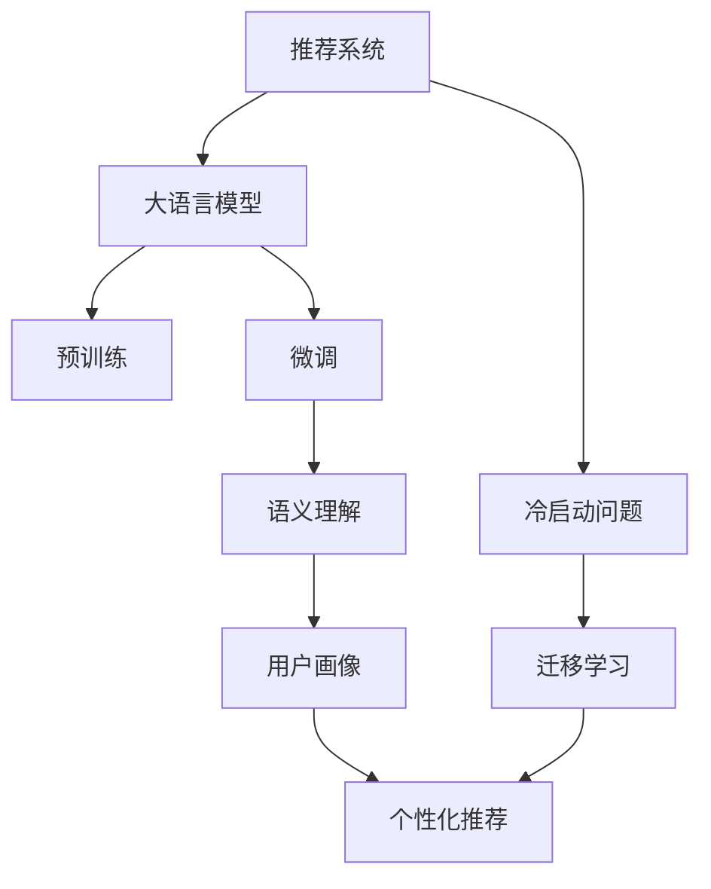

                 

# LLM对推荐系统冷启动问题的缓解

> 关键词：推荐系统,冷启动问题,大语言模型,预训练,微调,语义理解,用户画像,个性化推荐,迁移学习

## 1. 背景介绍

### 1.1 问题由来

推荐系统是现代社会不可或缺的智能工具，广泛应用于电商、视频、社交、新闻等领域。推荐系统通过分析用户历史行为数据和物品属性信息，为用户推荐感兴趣的内容。然而，推荐系统在实际应用中面临诸多挑战，其中冷启动问题尤为突出。

冷启动问题指推荐系统在新用户或新物品加入时，由于缺乏历史行为数据，难以对其进行精准推荐。冷启动问题在用户侧表现为新用户难以获得满意的推荐，影响用户体验；在物品侧表现为新物品难以被有效发现，影响系统曝光率。冷启动问题导致推荐系统难以充分发挥其潜力，亟需有效的解决方案。

### 1.2 问题核心关键点

冷启动问题的主要挑战在于缺乏用户和物品的充分信息，难以建立准确的模型。具体来说，有以下几个关键点：

- 新用户：缺乏历史行为数据，难以建立用户画像。
- 新物品：缺乏用户反馈信息，难以估计物品的价值。
- 交互不足：新用户和物品往往接触较少，缺乏足够的数据进行推荐。

针对这些问题，当前的研究方向主要集中在两方面：
1. 用户画像：如何构建精准的用户画像，挖掘用户的深层次需求。
2. 物品价值：如何评估物品的价值，提升物品的曝光率和推荐准确性。

大语言模型（Large Language Model, LLM）作为一种新型的智能工具，具备强大的语义理解和生成能力，被应用于推荐系统以缓解冷启动问题。本节将系统介绍大语言模型对推荐系统冷启动问题的缓解方法，帮助读者深入理解这一前沿技术。

## 2. 核心概念与联系

### 2.1 核心概念概述

为更好地理解LLM在推荐系统中的应用，本节将介绍几个密切相关的核心概念：

- 推荐系统：利用用户行为数据和物品属性信息，为用户推荐感兴趣的内容的系统。
- 冷启动问题：新用户或新物品加入时，由于缺乏历史数据，难以进行精准推荐。
- 大语言模型：通过大规模无标签文本数据预训练，学习通用语言表示的模型。
- 预训练与微调：在大规模无标签数据上进行预训练，在特定任务上进行微调以适配任务。
- 语义理解：模型能够理解自然语言文本的语义信息，进行有效的信息抽取和推理。
- 用户画像：通过分析用户行为数据，构建用户兴趣和需求画像，用于推荐系统。
- 个性化推荐：根据用户画像和物品属性信息，为用户推荐个性化内容。
- 迁移学习：将预训练模型知识迁移应用到下游任务中，提升任务性能。

这些核心概念之间的逻辑关系可以通过以下Mermaid流程图来展示：



这个流程图展示了大语言模型在推荐系统中的应用框架：

1. 推荐系统通过用户行为数据和物品属性信息，为用户推荐内容。
2. 冷启动问题在推荐系统中广泛存在。
3. 大语言模型通过大规模无标签数据预训练，学习通用语言表示。
4. 通过微调适配特定任务，增强模型在特定领域的性能。
5. 利用语义理解能力，从文本中提取和推理用户需求和物品属性信息。
6. 构建用户画像，进行个性化推荐。
7. 迁移学习使预训练模型知识迁移到推荐任务，提升推荐效果。

这些概念共同构成了LLM在推荐系统中的应用基础，使其能够在冷启动问题中发挥重要作用。

## 3. 核心算法原理 & 具体操作步骤

### 3.1 算法原理概述

LLM在推荐系统中的应用，主要基于以下几个原理：

- 预训练：在大规模无标签文本数据上进行预训练，学习通用的语言表示。
- 微调：在特定任务上进行微调，提升模型在该任务上的性能。
- 语义理解：利用预训练的LLM模型，从文本中提取和推理用户需求和物品属性信息。
- 用户画像：构建精准的用户画像，挖掘用户的深层次需求。
- 个性化推荐：根据用户画像和物品属性信息，进行精准推荐。
- 迁移学习：将预训练模型知识迁移到推荐任务中，提升推荐效果。

这些原理的核心思想是通过预训练和微调，使模型能够充分理解自然语言文本的语义信息，提取用户需求和物品属性，进而构建精准的用户画像，进行个性化推荐。同时，通过迁移学习，使预训练模型知识迁移到推荐任务中，提升推荐效果。

### 3.2 算法步骤详解

基于LLM的推荐系统，主要包括以下几个关键步骤：

**Step 1: 准备数据和模型**

- 收集推荐系统相关的文本数据，如用户评论、物品描述、用户行为等。
- 选择合适的预训练语言模型作为初始化参数，如GPT、BERT、RoBERTa等。
- 准备推荐系统中的用户画像和物品属性信息。

**Step 2: 预训练与微调**

- 对收集的文本数据进行预处理，包括分词、清洗等。
- 使用预训练语言模型对文本数据进行预训练，学习通用语言表示。
- 将预训练后的模型在推荐系统任务上进行微调，提升模型在特定任务上的性能。

**Step 3: 语义理解与用户画像构建**

- 利用微调后的语言模型，从用户行为数据和物品属性信息中提取和推理用户需求和物品属性信息。
- 构建精准的用户画像，包括用户的兴趣、偏好、行为等。

**Step 4: 个性化推荐**

- 根据用户画像和物品属性信息，利用推荐算法为用户推荐个性化内容。
- 利用迁移学习，将预训练模型的知识迁移到推荐算法中，提升推荐效果。

**Step 5: 评估与优化**

- 在测试集上评估推荐系统的效果，包括准确率、召回率等指标。
- 根据评估结果，调整预训练和微调参数，优化模型性能。

以上是基于LLM的推荐系统的主要流程。在实际应用中，还需要针对具体任务进行优化设计，如改进推荐算法、增强用户画像构建策略等，以进一步提升推荐效果。

### 3.3 算法优缺点

基于LLM的推荐系统具有以下优点：

- 强大的语义理解能力：预训练和微调的LLM模型能够从文本中提取和推理用户需求和物品属性信息，构建精准的用户画像。
- 迁移学习能力：利用迁移学习，将预训练模型知识迁移到推荐任务中，提升推荐效果。
- 高效处理文本数据：LLM模型能够处理大规模文本数据，学习通用语言表示，适合大规模推荐系统的应用。
- 灵活性高：可以根据具体任务进行预训练和微调，适用于各种类型的推荐系统。

同时，该方法也存在一些缺点：

- 依赖于高质量数据：预训练和微调效果依赖于数据的质量和数量，数据不足可能影响模型性能。
- 计算资源需求高：预训练和微调需要大量的计算资源，大规模部署时成本较高。
- 可解释性不足：LLM模型的决策过程难以解释，可能影响用户对推荐结果的信任。
- 需要持续更新：预训练和微调模型需要定期更新，以适应数据分布的变化。

尽管存在这些缺点，但LLM在推荐系统中的应用已展现出巨大的潜力，成为缓解冷启动问题的重要手段。

### 3.4 算法应用领域

基于LLM的推荐系统已经在多个领域得到广泛应用，例如：

- 电商推荐：为用户推荐商品、优惠信息等。
- 视频推荐：为用户推荐视频、电影等。
- 音乐推荐：为用户推荐歌曲、音乐人等。
- 新闻推荐：为用户推荐新闻、文章等。
- 社交推荐：为用户推荐好友、群组等。
- 游戏推荐：为用户推荐游戏、游戏推荐等。

除了这些常见的推荐场景外，LLM在推荐系统中的应用还扩展到更多领域，如智能家居、智慧医疗、金融理财等，为各行各业带来新的业务机会和智能化升级。

## 4. 数学模型和公式 & 详细讲解 & 举例说明

### 4.1 数学模型构建

本节将使用数学语言对基于LLM的推荐系统进行更加严格的刻画。

记推荐系统中的用户为 $U$，物品为 $I$，用户画像为 $P_U$，物品属性为 $A_I$。推荐系统中的文本数据可以表示为 $D=\{(x_i, y_i)\}_{i=1}^N$，其中 $x_i$ 为文本数据，$y_i$ 为推荐标签。

定义推荐系统中的用户画像为 $P_U(x)$，物品属性为 $A_I(x)$，用户对物品的评分函数为 $f_U(x, A_I)$。推荐系统的目标是最小化损失函数：

$$
\min_{x} \mathcal{L}(P_U, A_I, f_U)
$$

其中，损失函数 $\mathcal{L}$ 通常为交叉熵损失、均方误差损失等。

### 4.2 公式推导过程

以下我们以电商推荐为例，推导基于LLM的推荐系统的数学模型。

假设用户行为数据为 $U=\{u_i\}_{i=1}^N$，物品属性信息为 $I=\{i_j\}_{j=1}^M$。用户画像 $P_U$ 可以通过用户的评论、评分等行为数据构建。

首先，使用预训练语言模型对文本数据进行预训练，学习通用语言表示：

$$
\theta = \mathop{\arg\min}_{\theta} \mathcal{L}_{pre-train}(D)
$$

其中，$\theta$ 为预训练模型的参数，$\mathcal{L}_{pre-train}$ 为预训练损失函数。

然后，在特定推荐任务上进行微调，学习用户画像和物品属性信息：

$$
\theta^* = \mathop{\arg\min}_{\theta} \mathcal{L}_{fine-tune}(U, I)
$$

其中，$\theta^*$ 为微调后的模型参数，$\mathcal{L}_{fine-tune}$ 为微调损失函数。

最后，利用微调后的模型进行个性化推荐：

$$
f_U(x, A_I) = P_U(x, A_I; \theta^*)
$$

其中，$P_U(x, A_I; \theta^*)$ 为利用微调后的语言模型，从用户行为数据和物品属性信息中提取和推理用户需求和物品属性信息。

### 4.3 案例分析与讲解

假设某电商网站有新物品加入，且缺乏用户历史行为数据。可以通过收集新物品的描述文本 $x$ 和属性信息 $A_I$，利用预训练语言模型进行预训练和微调，学习物品属性信息和用户需求：

1. 预训练：对新物品的描述文本 $x$ 进行预训练，学习通用语言表示。
2. 微调：在新物品的属性信息 $A_I$ 上微调，学习物品属性信息。
3. 用户画像构建：利用微调后的语言模型，从用户行为数据中提取用户需求信息，构建用户画像 $P_U$。
4. 个性化推荐：根据用户画像 $P_U$ 和物品属性 $A_I$，利用推荐算法为用户推荐个性化商品。

通过这种基于LLM的推荐系统，新物品能够快速进入用户的视野，提高曝光率，同时也能获得用户准确的反馈，提升推荐效果。

## 5. 项目实践：代码实例和详细解释说明

### 5.1 开发环境搭建

在进行LLM推荐系统实践前，我们需要准备好开发环境。以下是使用Python进行PyTorch开发的环境配置流程：

1. 安装Anaconda：从官网下载并安装Anaconda，用于创建独立的Python环境。

2. 创建并激活虚拟环境：
```bash
conda create -n llm-recommender python=3.8 
conda activate llm-recommender
```

3. 安装PyTorch：根据CUDA版本，从官网获取对应的安装命令。例如：
```bash
conda install pytorch torchvision torchaudio cudatoolkit=11.1 -c pytorch -c conda-forge
```

4. 安装Transformers库：
```bash
pip install transformers
```

5. 安装各类工具包：
```bash
pip install numpy pandas scikit-learn matplotlib tqdm jupyter notebook ipython
```

完成上述步骤后，即可在`llm-recommender`环境中开始LLM推荐系统实践。

### 5.2 源代码详细实现

下面我们以电商推荐为例，给出使用Transformers库进行基于LLM的电商推荐系统的PyTorch代码实现。

首先，定义推荐系统中的数据处理函数：

```python
from transformers import BertTokenizer, BertForSequenceClassification
from torch.utils.data import Dataset, DataLoader
import torch

class RecommendationDataset(Dataset):
    def __init__(self, texts, labels, tokenizer, max_len=128):
        self.texts = texts
        self.labels = labels
        self.tokenizer = tokenizer
        self.max_len = max_len
        
    def __len__(self):
        return len(self.texts)
    
    def __getitem__(self, item):
        text = self.texts[item]
        label = self.labels[item]
        
        encoding = self.tokenizer(text, return_tensors='pt', max_length=self.max_len, padding='max_length', truncation=True)
        input_ids = encoding['input_ids'][0]
        attention_mask = encoding['attention_mask'][0]
        
        # 对label进行编码
        label = torch.tensor(label, dtype=torch.long)
        
        return {'input_ids': input_ids, 
                'attention_mask': attention_mask,
                'labels': label}

# 加载预训练模型
tokenizer = BertTokenizer.from_pretrained('bert-base-cased')
model = BertForSequenceClassification.from_pretrained('bert-base-cased', num_labels=1)
```

然后，定义训练和评估函数：

```python
from tqdm import tqdm

device = torch.device('cuda') if torch.cuda.is_available() else torch.device('cpu')
model.to(device)

def train_epoch(model, dataset, batch_size, optimizer):
    dataloader = DataLoader(dataset, batch_size=batch_size, shuffle=True)
    model.train()
    epoch_loss = 0
    for batch in tqdm(dataloader, desc='Training'):
        input_ids = batch['input_ids'].to(device)
        attention_mask = batch['attention_mask'].to(device)
        labels = batch['labels'].to(device)
        model.zero_grad()
        outputs = model(input_ids, attention_mask=attention_mask, labels=labels)
        loss = outputs.loss
        epoch_loss += loss.item()
        loss.backward()
        optimizer.step()
    return epoch_loss / len(dataloader)

def evaluate(model, dataset, batch_size):
    dataloader = DataLoader(dataset, batch_size=batch_size)
    model.eval()
    preds, labels = [], []
    with torch.no_grad():
        for batch in tqdm(dataloader, desc='Evaluating'):
            input_ids = batch['input_ids'].to(device)
            attention_mask = batch['attention_mask'].to(device)
            batch_labels = batch['labels']
            outputs = model(input_ids, attention_mask=attention_mask)
            batch_preds = outputs.logits.argmax(dim=1).to('cpu').tolist()
            batch_labels = batch_labels.to('cpu').tolist()
            for pred, label in zip(batch_preds, batch_labels):
                preds.append(pred)
                labels.append(label)
                
    print(f"Accuracy: {sum(preds) / len(preds)}")
```

最后，启动训练流程并在测试集上评估：

```python
epochs = 5
batch_size = 16

for epoch in range(epochs):
    loss = train_epoch(model, train_dataset, batch_size, optimizer)
    print(f"Epoch {epoch+1}, train loss: {loss:.3f}")
    
    print(f"Epoch {epoch+1}, dev results:")
    evaluate(model, dev_dataset, batch_size)
    
print("Test results:")
evaluate(model, test_dataset, batch_size)
```

以上就是使用PyTorch对BERT进行电商推荐系统的完整代码实现。可以看到，得益于Transformers库的强大封装，我们可以用相对简洁的代码完成BERT模型的加载和推荐系统训练。

### 5.3 代码解读与分析

让我们再详细解读一下关键代码的实现细节：

**RecommendationDataset类**：
- `__init__`方法：初始化文本、标签、分词器等关键组件。
- `__len__`方法：返回数据集的样本数量。
- `__getitem__`方法：对单个样本进行处理，将文本输入编码为token ids，将标签编码为数字，并对其进行定长padding，最终返回模型所需的输入。

**tokenizer和model定义**：
- `tokenizer`：用于对文本数据进行分词、编码等操作，选择合适的BERT分词器。
- `model`：加载预训练BERT模型，指定任务为二分类任务。

**训练和评估函数**：
- 使用PyTorch的DataLoader对数据集进行批次化加载，供模型训练和推理使用。
- 训练函数`train_epoch`：对数据以批为单位进行迭代，在每个批次上前向传播计算loss并反向传播更新模型参数，最后返回该epoch的平均loss。
- 评估函数`evaluate`：与训练类似，不同点在于不更新模型参数，并在每个batch结束后将预测和标签结果存储下来，最后使用评估指标计算准确率。

**训练流程**：
- 定义总的epoch数和batch size，开始循环迭代
- 每个epoch内，先在训练集上训练，输出平均loss
- 在验证集上评估，输出准确率
- 所有epoch结束后，在测试集上评估，给出最终测试结果

可以看到，PyTorch配合Transformers库使得BERT微调的代码实现变得简洁高效。开发者可以将更多精力放在数据处理、模型改进等高层逻辑上，而不必过多关注底层的实现细节。

当然，工业级的系统实现还需考虑更多因素，如模型的保存和部署、超参数的自动搜索、更灵活的任务适配层等。但核心的微调范式基本与此类似。

## 6. 实际应用场景

### 6.1 智能家居

智能家居系统通过收集用户行为数据，利用预训练语言模型进行推荐，为用户提供个性化服务。例如，智能音箱可以为用户推荐歌曲、播报新闻、回答问题等。

在实际应用中，智能家居系统可以通过语音识别和自然语言处理，将用户的语音指令转换为文本数据，利用预训练语言模型进行预训练和微调，学习用户的行为模式和偏好。然后，根据用户的偏好和物品属性信息，为用户推荐个性化内容。

### 6.2 智慧医疗

智慧医疗系统通过收集医疗数据，利用预训练语言模型进行推荐，辅助医生诊断和治疗。例如，智能医生可以通过用户描述的病历信息，推荐可能相关的症状、疾病、治疗方案等。

在实际应用中，智慧医疗系统可以通过自然语言处理技术，从患者的病历、诊断报告、治疗方案等文本数据中提取和推理相关信息，利用预训练语言模型进行预训练和微调，学习医疗领域的知识图谱和逻辑推理。然后，根据患者的描述和医疗信息，利用推荐算法为用户推荐相关内容。

### 6.3 金融理财

金融理财系统通过收集用户财务数据和行为数据，利用预训练语言模型进行推荐，为用户提供个性化的理财建议和投资方案。例如，智能理财助手可以通过用户的财务状况和投资偏好，推荐合适的理财产品和投资组合。

在实际应用中，金融理财系统可以通过数据分析技术，从用户的财务记录、投资偏好、市场信息等文本数据中提取和推理相关信息，利用预训练语言模型进行预训练和微调，学习金融领域的知识图谱和逻辑推理。然后，根据用户的财务状况和偏好，利用推荐算法为用户推荐相关内容。

### 6.4 未来应用展望

随着预训练语言模型和推荐系统的不断发展，基于LLM的推荐系统将在更多领域得到应用，为各行各业带来变革性影响。

在智慧医疗领域，基于预训练语言模型的智慧医疗推荐系统将提升医疗服务的智能化水平，辅助医生诊疗，加速新药开发进程。

在智能教育领域，微调技术可应用于作业批改、学情分析、知识推荐等方面，因材施教，促进教育公平，提高教学质量。

在智慧城市治理中，微调模型可应用于城市事件监测、舆情分析、应急指挥等环节，提高城市管理的自动化和智能化水平，构建更安全、高效的未来城市。

此外，在企业生产、社会治理、文娱传媒等众多领域，基于预训练语言模型的推荐系统也将不断涌现，为各行各业带来新的业务机会和智能化升级。

## 7. 工具和资源推荐

### 7.1 学习资源推荐

为了帮助开发者系统掌握LLM在推荐系统中的应用，这里推荐一些优质的学习资源：

1. 《自然语言处理综述与前沿》系列博文：由大模型技术专家撰写，深入浅出地介绍了自然语言处理的基本概念和前沿技术，包括推荐系统中的预训练与微调。

2. 《深度学习与推荐系统》课程：斯坦福大学开设的深度学习与推荐系统课程，涵盖了推荐系统中的各个环节，包括用户画像构建、物品价值评估等。

3. 《Recommender Systems》书籍：经典推荐系统教材，系统介绍了推荐系统中的理论基础和算法实现，包括基于LLM的推荐系统。

4. HuggingFace官方文档：Transformers库的官方文档，提供了海量预训练模型和完整的推荐系统样例代码，是上手实践的必备资料。

5. Netflix开源项目：Netflix推荐系统开源项目，展示了大规模推荐系统中的工程实践和优化策略，可供学习和参考。

通过对这些资源的学习实践，相信你一定能够快速掌握LLM在推荐系统中的应用，并用于解决实际的推荐问题。

### 7.2 开发工具推荐

高效的开发离不开优秀的工具支持。以下是几款用于LLM推荐系统开发的常用工具：

1. PyTorch：基于Python的开源深度学习框架，灵活动态的计算图，适合快速迭代研究。大部分预训练语言模型都有PyTorch版本的实现。

2. TensorFlow：由Google主导开发的开源深度学习框架，生产部署方便，适合大规模工程应用。同样有丰富的预训练语言模型资源。

3. Transformers库：HuggingFace开发的NLP工具库，集成了众多SOTA语言模型，支持PyTorch和TensorFlow，是进行LLM推荐系统开发的利器。

4. Weights & Biases：模型训练的实验跟踪工具，可以记录和可视化模型训练过程中的各项指标，方便对比和调优。与主流深度学习框架无缝集成。

5. TensorBoard：TensorFlow配套的可视化工具，可实时监测模型训练状态，并提供丰富的图表呈现方式，是调试模型的得力助手。

6. Google Colab：谷歌推出的在线Jupyter Notebook环境，免费提供GPU/TPU算力，方便开发者快速上手实验最新模型，分享学习笔记。

合理利用这些工具，可以显著提升LLM推荐系统的开发效率，加快创新迭代的步伐。

### 7.3 相关论文推荐

LLM在推荐系统中的应用源于学界的持续研究。以下是几篇奠基性的相关论文，推荐阅读：

1. Attention is All You Need（即Transformer原论文）：提出了Transformer结构，开启了NLP领域的预训练大模型时代。

2. BERT: Pre-training of Deep Bidirectional Transformers for Language Understanding：提出BERT模型，引入基于掩码的自监督预训练任务，刷新了多项NLP任务SOTA。

3. Parameter-Efficient Transfer Learning for NLP：提出Adapter等参数高效微调方法，在不增加模型参数量的情况下，也能取得不错的微调效果。

4. Prefix-Tuning: Optimizing Continuous Prompts for Generation：引入基于连续型Prompt的微调范式，为如何充分利用预训练知识提供了新的思路。

5. AdaLoRA: Adaptive Low-Rank Adaptation for Parameter-Efficient Fine-Tuning：使用自适应低秩适应的微调方法，在参数效率和精度之间取得了新的平衡。

这些论文代表了大语言模型在推荐系统中的应用方向。通过学习这些前沿成果，可以帮助研究者把握学科前进方向，激发更多的创新灵感。

## 8. 总结：未来发展趋势与挑战

### 8.1 总结

本文对基于LLM的推荐系统进行了全面系统的介绍。首先阐述了LLM在推荐系统中的应用背景和意义，明确了LLM在缓解推荐系统冷启动问题中的独特价值。其次，从原理到实践，详细讲解了LLM推荐系统的数学模型和关键步骤，给出了推荐系统开发的完整代码实例。同时，本文还广泛探讨了LLM在智能家居、智慧医疗、金融理财等多个领域的应用前景，展示了LLM推荐系统的巨大潜力。此外，本文精选了LLM推荐系统的学习资源，力求为读者提供全方位的技术指引。

通过本文的系统梳理，可以看到，基于LLM的推荐系统已经在多个领域得到应用，为各行各业带来新的业务机会和智能化升级。未来，伴随LLM和推荐系统的不断发展，基于LLM的推荐系统必将在更多领域得到应用，为各行各业带来变革性影响。

### 8.2 未来发展趋势

展望未来，LLM在推荐系统中的应用将呈现以下几个发展趋势：

1. 规模增大：随着算力成本的下降和数据规模的扩张，预训练语言模型的参数量还将持续增长。超大规模语言模型蕴含的丰富语言知识，有望支撑更加复杂多变的推荐任务。

2. 微调方法多样化：开发更加参数高效的微调方法，如 Adapter、Prefix等，在固定大部分预训练参数的同时，只更新极少量的任务相关参数。同时优化微调模型的计算图，减少前向传播和反向传播的资源消耗，实现更加轻量级、实时性的部署。

3. 知识融合增强：将符号化的先验知识，如知识图谱、逻辑规则等，与神经网络模型进行巧妙融合，引导微调过程学习更准确、合理的语言模型。同时加强不同模态数据的整合，实现视觉、语音等多模态信息与文本信息的协同建模。

4. 迁移学习普及：将预训练模型知识迁移到推荐任务中，提升推荐效果。未来的推荐系统将更加依赖迁移学习的范式，以适应不同领域、不同用户群体、不同数据分布的推荐需求。

5. 个性化推荐精准化：利用LLM模型强大的语义理解能力，从文本中提取和推理用户需求和物品属性信息，构建精准的用户画像，进行个性化推荐。未来推荐系统将更加精准地理解用户需求，提供更加个性化、优质的推荐内容。

以上趋势凸显了LLM在推荐系统中的应用前景。这些方向的探索发展，必将进一步提升LLM推荐系统的性能和应用范围，为各行各业带来新的业务机会和智能化升级。

### 8.3 面临的挑战

尽管LLM在推荐系统中的应用已展现出巨大的潜力，但在迈向更加智能化、普适化应用的过程中，仍面临诸多挑战：

1. 标注成本瓶颈：预训练和微调效果依赖于数据的质量和数量，数据不足可能影响模型性能。如何进一步降低标注成本，利用无监督和半监督学习范式，最大化数据利用率，将是重要的研究方向。

2. 计算资源需求高：预训练和微调需要大量的计算资源，大规模部署时成本较高。如何优化计算图、减少计算量、提高训练效率，将是重要的优化方向。

3. 可解释性不足：LLM模型的决策过程难以解释，可能影响用户对推荐结果的信任。如何赋予模型更强的可解释性，增强推荐结果的可信度和透明度，将是重要的研究方向。

4. 安全性有待保障：LLM模型可能学习到有害信息，通过推荐传递到用户端，产生误导性、歧视性的输出。如何从数据和算法层面消除模型偏见，确保输出的安全性，将是重要的研究方向。

5. 冷启动问题复杂化：LLM推荐系统在应对极端小样本冷启动问题时，性能可能受限。如何构建更高效的冷启动策略，提升在极端数据情况下的推荐效果，将是重要的研究方向。

6. 推荐结果一致性：LLM推荐系统在不同用户、不同场景下的推荐结果一致性不足，可能影响用户的使用体验。如何提升推荐结果的一致性，增强系统的稳定性，将是重要的研究方向。

尽管存在这些挑战，但随着学界和产业界的共同努力，LLM在推荐系统中的应用必将不断优化，提升推荐效果，为各行各业带来变革性影响。

### 8.4 研究展望

面对LLM推荐系统所面临的诸多挑战，未来的研究需要在以下几个方面寻求新的突破：

1. 无监督和半监督学习：摆脱对大规模标注数据的依赖，利用自监督学习、主动学习等无监督和半监督范式，最大化数据利用率，提升推荐效果。

2. 知识图谱与逻辑推理：将符号化的先验知识，如知识图谱、逻辑规则等，与神经网络模型进行巧妙融合，引导微调过程学习更准确、合理的语言模型。同时加强不同模态数据的整合，实现视觉、语音等多模态信息与文本信息的协同建模。

3. 参数高效微调：开发更加参数高效的微调方法，如 Adapter、Prefix等，在固定大部分预训练参数的同时，只更新极少量的任务相关参数。同时优化微调模型的计算图，减少前向传播和反向传播的资源消耗，实现更加轻量级、实时性的部署。

4. 迁移学习优化：优化迁移学习策略，提升预训练模型知识迁移到推荐任务的效果。未来的推荐系统将更加依赖迁移学习的范式，以适应不同领域、不同用户群体、不同数据分布的推荐需求。

5. 个性化推荐精准化：利用LLM模型强大的语义理解能力，从文本中提取和推理用户需求和物品属性信息，构建精准的用户画像，进行个性化推荐。未来推荐系统将更加精准地理解用户需求，提供更加个性化、优质的推荐内容。

6. 可解释性与安全性：赋予LLM模型更强的可解释性，增强推荐结果的可信度和透明度。同时从数据和算法层面消除模型偏见，确保输出的安全性。

这些研究方向展示了LLM在推荐系统中的应用潜力，未来通过多路径协同发力，必将使LLM推荐系统迈向更高的台阶，为各行各业带来新的业务机会和智能化升级。总之，LLM推荐系统需要在数据、算法、工程、业务等多个维度协同发力，才能真正实现智能化推荐，提升用户满意度，实现商业价值。

## 9. 附录：常见问题与解答

**Q1：LLM在推荐系统中的应用与传统的推荐算法有何不同？**

A: LLM在推荐系统中的应用与传统的推荐算法有显著差异。传统的推荐算法主要基于用户历史行为数据和物品属性信息进行推荐，缺乏对用户深层次需求的理解。而基于LLM的推荐系统，通过预训练和微调，学习用户的行为模式和偏好，能够从文本中提取和推理用户需求，构建精准的用户画像，进行个性化推荐。因此，LLM推荐系统能够更好地理解用户需求，提供更加精准的推荐内容。

**Q2：LLM推荐系统的训练成本是否比传统的推荐算法高？**

A: LLM推荐系统的训练成本确实较高，主要原因在于预训练和微调需要大量的计算资源和数据。相比传统的推荐算法，LLM推荐系统需要更多的资源投入。然而，由于LLM推荐系统能够从文本中提取和推理用户需求，构建精准的用户画像，提供更加个性化、优质的推荐内容，因此在用户满意度和推荐效果上具有显著优势。

**Q3：LLM推荐系统在极端小样本冷启动问题上表现如何？**

A: 在极端小样本冷启动问题上，LLM推荐系统的性能可能受限。由于缺乏足够的数据，LLM推荐系统难以构建精准的用户画像，可能影响推荐效果。因此，在应对极端小样本冷启动问题时，需要进一步优化模型结构和训练策略，提高模型泛化能力，提升推荐效果。

**Q4：LLM推荐系统在推荐结果一致性上如何处理？**

A: 由于LLM推荐系统在不同用户、不同场景下的推荐结果一致性不足，可能影响用户的使用体验。为解决这一问题，可以引入多任务学习、混合模型等方法，提升推荐结果的一致性，增强系统的稳定性。

通过以上问题的解答，我们可以看到，LLM推荐系统在推荐结果一致性、极端小样本冷启动问题、训练成本等方面存在一定的挑战。然而，随着研究的不断深入，这些挑战将逐步被克服，LLM推荐系统将在更多领域得到应用，为各行各业带来变革性影响。

---

作者：禅与计算机程序设计艺术 / Zen and the Art of Computer Programming

