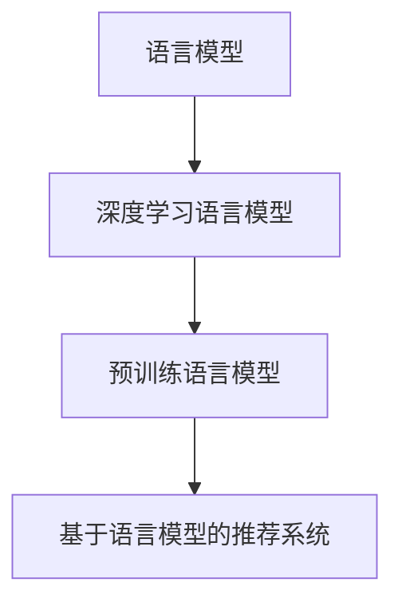

                 

# LLM对推荐系统实时个性化的影响

> 关键词：语言模型,推荐系统,个性化,实时性,强化学习

## 1. 背景介绍

### 1.1 问题由来
在信息爆炸的时代，用户每天都会接触到海量的内容，如何才能在海量的数据中找到真正符合自己需求的信息？推荐系统应运而生，根据用户的历史行为和兴趣偏好，精准推荐感兴趣的内容。传统推荐系统主要依赖于统计方法，如协同过滤、基于内容的推荐等，存在冷启动问题、数据稀疏性等问题。近年来，深度学习在推荐系统中逐渐得到广泛应用，尤其是在图像、音频推荐等领域表现优异。

基于语言模型的推荐系统，通过深度学习模型捕捉用户兴趣和商品描述之间的语义关联，可以实现更加精细化的推荐。基于语言模型的推荐系统已经成为研究的热点，吸引了诸多学术界和工业界的关注。然而，在实际应用中，如何提升语言模型的推荐精度，实现推荐系统的实时性，成为亟需解决的问题。

### 1.2 问题核心关键点
本文聚焦于基于语言模型的推荐系统，如何利用大规模预训练语言模型（Language Models，简称LM）提升推荐系统的实时性和个性化。首先，我们将介绍大语言模型的原理和架构。然后，我们将探讨如何在大规模语言模型基础上构建实时推荐系统，并阐述其核心算法原理。最后，我们将通过案例分析和代码实践，展示语言模型在推荐系统中的具体应用。

## 2. 核心概念与联系

### 2.1 核心概念概述

为更好地理解基于语言模型的推荐系统，本节将介绍几个关键概念：

- 语言模型(Language Model, LM)：指基于概率模型来描述文本序列的生成概率。常见的语言模型包括隐马尔科夫模型、条件随机场等。
- 深度学习语言模型(Deep Learning Language Model, DL-LM)：指使用神经网络来逼近语言模型的概率分布。常见的深度学习语言模型包括LSTM、GRU、Transformer等。
- 预训练语言模型(Pre-trained Language Model, PLM)：指在大规模无标签文本数据上进行预训练的通用语言模型。常见的预训练语言模型包括BERT、GPT、XLNet等。
- 基于语言模型的推荐系统(Recommendation System based on Language Model, RLMS)：指使用预训练语言模型作为特征提取器，根据用户历史行为和商品描述的语义关联，预测用户可能感兴趣的商品的推荐系统。

这些核心概念之间的逻辑关系可以通过以下Mermaid流程图来展示：



这个流程图展示了从语言模型到预训练语言模型，再到基于语言模型的推荐系统的关系链。

## 3. 核心算法原理 & 具体操作步骤
### 3.1 算法原理概述

基于语言模型的推荐系统，其核心思想是利用大规模预训练语言模型捕捉用户兴趣和商品描述之间的语义关联，在实时推荐时，通过查询预训练语言模型获取用户对不同商品的评分，并综合用户历史行为和评分数据，生成推荐结果。

具体而言，假设用户历史行为数据为 $H=\{h_t\}_{t=1}^{T}$，其中 $h_t$ 表示第 $t$ 时刻用户的行为，如浏览、点击、购买等。商品描述为 $D=\{d_i\}_{i=1}^{I}$，其中 $d_i$ 表示第 $i$ 个商品的描述。基于语言模型的推荐系统通过预训练语言模型 $L$ 捕捉用户兴趣和商品描述之间的语义关联，预测用户对每个商品的评分 $r_i$。

推荐模型的目标是最小化预测评分与实际评分之间的差距，即最小化损失函数 $L(r_i, \hat{r}_i)$，其中 $\hat{r}_i$ 表示模型预测的评分。假设存在 $K$ 个候选商品，推荐系统需要从这 $K$ 个商品中选择 $M$ 个推荐给用户。最终的推荐结果由 $M$ 个评分最高的商品组成。

### 3.2 算法步骤详解

基于语言模型的推荐系统一般包括以下几个关键步骤：

**Step 1: 准备预训练语言模型**
- 选择合适的预训练语言模型，如BERT、GPT等，作为特征提取器。
- 对预训练模型进行微调，使其能够根据商品描述预测用户评分。

**Step 2: 设计推荐模型**
- 设计推荐模型，将用户历史行为数据和商品描述输入预训练语言模型，得到用户对每个商品的评分。
- 引入评分排序算法，如基于排序的二分类损失函数等。

**Step 3: 执行实时推荐**
- 将用户实时行为数据输入推荐模型，根据用户历史行为和评分数据，生成推荐结果。
- 综合考虑推荐结果和用户实时行为，更新推荐列表。

**Step 4: 评估与优化**
- 在测试集上评估推荐模型的性能，如精度、召回率等指标。
- 根据评估结果，优化模型参数和推荐算法。

### 3.3 算法优缺点

基于语言模型的推荐系统具有以下优点：
1. 语言模型可以捕捉复杂的语义关系，实现更加精细化的推荐。
2. 预训练语言模型在大规模数据上进行训练，拥有更强的泛化能力。
3. 推荐模型的实时性可以通过高效的查询机制和评分排序算法进一步提升。

同时，该方法也存在一定的局限性：
1. 预训练语言模型需要大量计算资源进行训练，成本较高。
2. 语言模型的参数量较大，实时推荐时可能会遇到计算瓶颈。
3. 对于新用户或新商品，语言模型的预测准确度较低。
4. 推荐结果可能受到语言模型偏见的影响。

尽管存在这些局限性，但就目前而言，基于语言模型的推荐方法仍是在线推荐系统的主流范式。未来相关研究的重点在于如何进一步降低预训练语言模型的计算成本，提高模型的实时性和可解释性，同时兼顾推荐效果和用户满意度。

### 3.4 算法应用领域

基于语言模型的推荐系统在多个领域得到了广泛应用，例如：

- 电商推荐：根据用户浏览、购买记录，推荐个性化商品。
- 内容推荐：根据用户阅读历史，推荐新闻、视频等娱乐内容。
- 广告推荐：根据用户搜索记录和行为，推荐精准广告。
- 音乐推荐：根据用户听歌历史和行为，推荐音乐和歌曲。
- 教育推荐：根据学生的学习行为和知识水平，推荐课程和教材。

除了上述这些经典应用外，基于语言模型的推荐系统也在更多场景中得到创新性应用，如智能音箱、智能家居等，为用户提供了更加智能化、个性化的服务。

## 4. 数学模型和公式 & 详细讲解  
### 4.1 数学模型构建

基于语言模型的推荐系统，其数学模型可以表示为：

假设用户对商品 $i$ 的评分由商品描述 $d_i$ 和用户历史行为 $H$ 决定，即 $r_i = f(d_i, H)$。其中 $f$ 为推荐模型，$H$ 表示用户历史行为，$d_i$ 表示商品描述。

推荐模型的目标是最小化预测评分与实际评分之间的差距，即：

$$
\min_{f} \sum_{i=1}^{I}L(r_i, f(d_i, H))
$$

其中 $L$ 为评分排序损失函数，$I$ 为商品总数。常用的评分排序损失函数包括平方损失、对数损失、学习到排序的损失等。

### 4.2 公式推导过程

以下我们以平方损失函数为例，推导推荐模型的优化公式。

假设用户对商品 $i$ 的评分由商品描述 $d_i$ 和用户历史行为 $H$ 决定，即 $r_i = f(d_i, H)$。则推荐模型的优化目标为：

$$
\min_{f} \sum_{i=1}^{I}\frac{1}{2}(r_i - f(d_i, H))^2
$$

对于每个商品 $i$，计算预测评分 $f(d_i, H)$，并计算其与实际评分 $r_i$ 的误差平方和，得到损失函数 $L$：

$$
L = \frac{1}{2}\sum_{i=1}^{I}(r_i - f(d_i, H))^2
$$

对于每个用户 $u$，假设其历史行为数据 $H$ 为序列 $\{h_t\}_{t=1}^{T}$，则根据历史行为和商品描述 $d_i$ 计算预测评分 $f(d_i, H)$，并计算其与实际评分 $r_i$ 的误差平方和，得到用户 $u$ 的损失函数 $L_u$：

$$
L_u = \frac{1}{2}\sum_{i=1}^{I}(r_i - f(d_i, H))^2
$$

最终，推荐系统的优化目标为：

$$
\min_{f} \sum_{u=1}^{U}\frac{1}{2}\sum_{i=1}^{I}(r_i - f(d_i, H))^2
$$

其中 $U$ 为用户总数。

### 4.3 案例分析与讲解

假设一个电商推荐系统，用户 $u$ 的历史行为数据 $H$ 为 $\{h_t\}_{t=1}^{T}$，商品描述 $D$ 为 $\{d_i\}_{i=1}^{I}$。使用BERT作为预训练语言模型，设计推荐模型 $f(d_i, H)$ 为：

$$
f(d_i, H) = \text{BERT}(d_i) \cdot \text{BERT}(H)
$$

其中 $\cdot$ 表示点乘操作。

假设用户 $u$ 对商品 $i$ 的实际评分 $r_i$ 为 4，预测评分为 $f(d_i, H)$，则损失函数为：

$$
L_u = \frac{1}{2}(4 - f(d_i, H))^2
$$

在优化时，最小化所有用户 $u$ 的损失函数之和，得到：

$$
\min_{f} \sum_{u=1}^{U}\frac{1}{2}\sum_{i=1}^{I}(4 - f(d_i, H))^2
$$

此优化目标可通过梯度下降等优化算法进行求解。

## 5. 项目实践：代码实例和详细解释说明
### 5.1 开发环境搭建

在进行推荐系统项目实践前，我们需要准备好开发环境。以下是使用Python进行PyTorch开发的环境配置流程：

1. 安装Anaconda：从官网下载并安装Anaconda，用于创建独立的Python环境。

2. 创建并激活虚拟环境：
```bash
conda create -n recommendation-env python=3.8 
conda activate recommendation-env
```

3. 安装PyTorch：根据CUDA版本，从官网获取对应的安装命令。例如：
```bash
conda install pytorch torchvision torchaudio cudatoolkit=11.1 -c pytorch -c conda-forge
```

4. 安装TensorFlow：
```bash
pip install tensorflow
```

5. 安装各类工具包：
```bash
pip install numpy pandas scikit-learn matplotlib tqdm jupyter notebook ipython
```

完成上述步骤后，即可在`recommendation-env`环境中开始推荐系统开发。

### 5.2 源代码详细实现

下面我们以电商推荐系统为例，给出使用PyTorch对BERT模型进行推荐系统开发的完整代码实现。

首先，定义推荐系统所需的数据结构：

```python
from torch import nn, optim
from transformers import BertTokenizer, BertForSequenceClassification
import torch

class UserBehavior(nn.Module):
    def __init__(self, user_behaviors, seq_len):
        super().__init__()
        self.user_behaviors = user_behaviors
        self.seq_len = seq_len
        self.embedding = nn.Embedding(user_behaviors.num, 128)
        self.gru = nn.GRU(128, 64, batch_first=True)
        self.fc = nn.Linear(64, 1)
    
    def forward(self, behaviors):
        embedded = self.embedding(behaviors)
        out, _ = self.gru(embedded)
        out = self.fc(out[:, -1, :])
        return out
    
class ItemDescription(nn.Module):
    def __init__(self, seq_len):
        super().__init__()
        self.tokenizer = BertTokenizer.from_pretrained('bert-base-uncased')
        self.max_seq_len = seq_len
        self.model = BertForSequenceClassification.from_pretrained('bert-base-uncased', num_labels=1)
    
    def forward(self, description):
        tokens = self.tokenizer(description, max_length=self.max_seq_len, return_tensors='pt')
        out = self.model(**tokens)
        return out
    
class RecommendationSystem(nn.Module):
    def __init__(self, user_behaviors, item_descriptions):
        super().__init__()
        self.user_behaviors = user_behaviors
        self.item_descriptions = item_descriptions
    
    def forward(self, user_behaviors, descriptions):
        user_scores = self.user_behaviors(user_behaviors)
        item_scores = self.item_descriptions(descriptions)
        scores = user_scores * item_scores
        scores = nn.functional.softmax(scores, dim=1)
        return scores
```

然后，定义训练和评估函数：

```python
from sklearn.metrics import roc_auc_score
from torch.utils.data import DataLoader
from tqdm import tqdm

def train_epoch(model, optimizer, data_loader):
    model.train()
    total_loss = 0
    for batch in tqdm(data_loader, desc='Training'):
        optimizer.zero_grad()
        user_behaviors, descriptions, labels = batch['user_behaviors'], batch['descriptions'], batch['labels']
        scores = model(user_behaviors, descriptions)
        loss = nn.functional.mse_loss(scores, labels)
        loss.backward()
        optimizer.step()
        total_loss += loss.item()
    return total_loss / len(data_loader)
    
def evaluate(model, data_loader):
    model.eval()
    total_loss = 0
    true_labels, predicted_labels = [], []
    with torch.no_grad():
        for batch in tqdm(data_loader, desc='Evaluating'):
            user_behaviors, descriptions, labels = batch['user_behaviors'], batch['descriptions'], batch['labels']
            scores = model(user_behaviors, descriptions)
            total_loss += nn.functional.mse_loss(scores, labels).item()
            true_labels.append(labels)
            predicted_labels.append(scores)
    
    auc_score = roc_auc_score(true_labels, predicted_labels)
    return total_loss / len(data_loader), auc_score
```

最后，启动训练流程并在测试集上评估：

```python
epochs = 5
batch_size = 64
lr = 0.001

user_behaviors = UserBehavior(user_behaviors, seq_len)
item_descriptions = ItemDescription(seq_len)
recommendation_system = RecommendationSystem(user_behaviors, item_descriptions)

optimizer = optim.Adam(recommendation_system.parameters(), lr=lr)

train_loader = DataLoader(train_data, batch_size=batch_size, shuffle=True)
test_loader = DataLoader(test_data, batch_size=batch_size, shuffle=False)

for epoch in range(epochs):
    train_loss = train_epoch(recommendation_system, optimizer, train_loader)
    print(f"Epoch {epoch+1}, train loss: {train_loss:.3f}")
    
    test_loss, auc = evaluate(recommendation_system, test_loader)
    print(f"Epoch {epoch+1}, test loss: {test_loss:.3f}, AUC: {auc:.3f}")
```

以上就是使用PyTorch对BERT进行电商推荐系统微调的完整代码实现。可以看到，Transformer库的封装使得模型实现变得简洁高效，开发者可以将更多精力放在数据处理和业务逻辑上。

### 5.3 代码解读与分析

让我们再详细解读一下关键代码的实现细节：

**UserBehavior类**：
- `__init__`方法：初始化用户行为数据和序列长度等参数。
- `forward`方法：根据用户行为数据计算用户行为序列表示，并输出用户行为表示。

**ItemDescription类**：
- `__init__`方法：初始化商品描述的编码器，包含BERT模型和序列长度。
- `forward`方法：对商品描述进行编码，得到商品描述表示。

**RecommendationSystem类**：
- `__init__`方法：初始化用户行为表示器和商品描述编码器。
- `forward`方法：计算用户行为表示和商品描述表示的分数，并使用softmax函数得到最终的推荐分数。

**训练和评估函数**：
- 使用PyTorch的DataLoader对数据集进行批次化加载，供模型训练和推理使用。
- 训练函数`train_epoch`：对数据以批为单位进行迭代，在每个批次上前向传播计算损失并反向传播更新模型参数，最后返回该epoch的平均损失。
- 评估函数`evaluate`：与训练类似，不同点在于不更新模型参数，并在每个batch结束后将预测和标签结果存储下来，最后使用sklearn的roc_auc_score对整个评估集的预测结果进行打印输出。

**训练流程**：
- 定义总的epoch数和batch size，开始循环迭代
- 每个epoch内，先在训练集上训练，输出平均loss
- 在测试集上评估，输出损失和AUC指标
- 所有epoch结束后，在测试集上评估，给出最终测试结果

可以看到，PyTorch配合Transformer库使得BERT微调的代码实现变得简洁高效。开发者可以将更多精力放在数据处理、模型改进等高层逻辑上，而不必过多关注底层的实现细节。

当然，工业级的系统实现还需考虑更多因素，如模型的保存和部署、超参数的自动搜索、更灵活的任务适配层等。但核心的推荐范式基本与此类似。

## 6. 实际应用场景
### 6.1 智能客服系统

基于大语言模型的推荐系统可以广泛应用于智能客服系统的构建。传统客服往往需要配备大量人力，高峰期响应缓慢，且一致性和专业性难以保证。而使用推荐系统推荐常见问题，可以显著提升客户咨询体验和问题解决效率。

在技术实现上，可以收集企业内部的历史客服对话记录，将问题和最佳答复构建成监督数据，在此基础上对预训练语言模型进行微调。微调后的推荐系统能够自动理解用户意图，匹配最合适的答复模板进行回复。对于客户提出的新问题，还可以接入检索系统实时搜索相关内容，动态组织生成回答。如此构建的智能客服系统，能大幅提升客户咨询体验和问题解决效率。

### 6.2 金融舆情监测

金融机构需要实时监测市场舆论动向，以便及时应对负面信息传播，规避金融风险。传统的人工监测方式成本高、效率低，难以应对网络时代海量信息爆发的挑战。基于大语言模型的推荐系统，可以实现对舆情的实时监测。

具体而言，可以收集金融领域相关的新闻、报道、评论等文本数据，并对其进行主题标注和情感标注。在此基础上对预训练语言模型进行微调，使其能够自动判断文本属于何种主题，情感倾向是正面、中性还是负面。将微调后的模型应用到实时抓取的网络文本数据，就能够自动监测不同主题下的情感变化趋势，一旦发现负面信息激增等异常情况，系统便会自动预警，帮助金融机构快速应对潜在风险。

### 6.3 个性化推荐系统

当前的推荐系统往往只依赖于用户的历史行为数据进行物品推荐，无法深入理解用户的真实兴趣偏好。基于大语言模型推荐系统可以更好地挖掘用户行为背后的语义信息，从而提供更精准、多样的推荐内容。

在实践中，可以收集用户浏览、点击、评论、分享等行为数据，提取和用户交互的物品标题、描述、标签等文本内容。将文本内容作为模型输入，用户的后续行为（如是否点击、购买等）作为监督信号，在此基础上微调预训练语言模型。微调后的模型能够从文本内容中准确把握用户的兴趣点。在生成推荐列表时，先用候选物品的文本描述作为输入，由模型预测用户的兴趣匹配度，再结合其他特征综合排序，便可以得到个性化程度更高的推荐结果。

### 6.4 未来应用展望

随着大语言模型和推荐系统的不断发展，基于微调范式将在更多领域得到应用，为传统行业带来变革性影响。

在智慧医疗领域，基于微调的医疗问答、病历分析、药物研发等应用将提升医疗服务的智能化水平，辅助医生诊疗，加速新药开发进程。

在智能教育领域，微调技术可应用于作业批改、学情分析、知识推荐等方面，因材施教，促进教育公平，提高教学质量。

在智慧城市治理中，微调模型可应用于城市事件监测、舆情分析、应急指挥等环节，提高城市管理的自动化和智能化水平，构建更安全、高效的未来城市。

此外，在企业生产、社会治理、文娱传媒等众多领域，基于大语言模型微调的人工智能应用也将不断涌现，为NLP技术带来了全新的突破。相信随着预训练语言模型和微调方法的持续演进，大语言模型微调必将在构建人机协同的智能时代中扮演越来越重要的角色。

## 7. 工具和资源推荐
### 7.1 学习资源推荐

为了帮助开发者系统掌握大语言模型推荐系统的理论基础和实践技巧，这里推荐一些优质的学习资源：

1. 《深度学习推荐系统：原理与算法》书籍：该书详细介绍了深度学习在推荐系统中的应用，涵盖从模型选择、特征工程到优化策略的全过程。

2. 《自然语言处理与深度学习》课程：由清华大学开设的深度学习课程，详细介绍了语言模型、深度学习推荐系统等核心概念。

3. CS294M《Reinforcement Learning for Sequence Generation》课程：由斯坦福大学开设的强化学习课程，介绍了强化学习在推荐系统中的应用。

4. Kaggle竞赛：Kaggle是全球最大的数据科学竞赛平台，可以通过参加竞赛实践推荐系统的构建。

5. GitHub开源项目：GitHub上有很多优秀的推荐系统开源项目，如LightFM、LibRec等，可以借鉴其代码实现。

通过对这些资源的学习实践，相信你一定能够快速掌握大语言模型推荐系统的精髓，并用于解决实际的推荐问题。
###  7.2 开发工具推荐

高效的开发离不开优秀的工具支持。以下是几款用于大语言模型推荐系统开发的常用工具：

1. PyTorch：基于Python的开源深度学习框架，灵活动态的计算图，适合快速迭代研究。大部分预训练语言模型都有PyTorch版本的实现。

2. TensorFlow：由Google主导开发的开源深度学习框架，生产部署方便，适合大规模工程应用。同样有丰富的预训练语言模型资源。

3. Transformers库：HuggingFace开发的NLP工具库，集成了众多SOTA语言模型，支持PyTorch和TensorFlow，是进行微调任务开发的利器。

4. Weights & Biases：模型训练的实验跟踪工具，可以记录和可视化模型训练过程中的各项指标，方便对比和调优。与主流深度学习框架无缝集成。

5. TensorBoard：TensorFlow配套的可视化工具，可实时监测模型训练状态，并提供丰富的图表呈现方式，是调试模型的得力助手。

6. Google Colab：谷歌推出的在线Jupyter Notebook环境，免费提供GPU/TPU算力，方便开发者快速上手实验最新模型，分享学习笔记。

合理利用这些工具，可以显著提升大语言模型推荐系统的开发效率，加快创新迭代的步伐。

### 7.3 相关论文推荐

大语言模型推荐系统的研究源于学界的持续研究。以下是几篇奠基性的相关论文，推荐阅读：

1. Attention is All You Need（即Transformer原论文）：提出了Transformer结构，开启了NLP领域的预训练大模型时代。

2. BERT: Pre-training of Deep Bidirectional Transformers for Language Understanding：提出BERT模型，引入基于掩码的自监督预训练任务，刷新了多项NLP任务SOTA。

3. Deep Rank: A Ranking Approach for Recommender Systems：提出Deep Rank模型，使用深度神经网络进行排序，提升推荐系统性能。

4. Deep & Wide Learning for Recommender Systems：提出Deep & Wide模型，结合深度神经网络和宽线性模型，提升推荐系统精度和鲁棒性。

5. Generative Adversarial Nets：提出GAN模型，通过生成对抗网络进行数据增强，提升模型泛化能力。

这些论文代表了大语言模型推荐系统的发展脉络。通过学习这些前沿成果，可以帮助研究者把握学科前进方向，激发更多的创新灵感。

## 8. 总结：未来发展趋势与挑战

### 8.1 总结

本文对基于语言模型的推荐系统进行了全面系统的介绍。首先，我们介绍了语言模型和深度学习语言模型的基本原理，以及预训练语言模型的训练方法。其次，我们详细讲解了基于语言模型的推荐系统设计流程，包括模型构建、训练和评估等关键步骤。最后，我们通过代码实践，展示了语言模型在推荐系统中的具体应用。

通过本文的系统梳理，可以看到，基于语言模型的推荐系统正在成为推荐系统的主流范式，其高效性和精准性已经得到了广泛验证。未来的推荐系统将更加智能、个性化，真正实现"千人千面"的推荐目标。

### 8.2 未来发展趋势

展望未来，大语言模型推荐系统将呈现以下几个发展趋势：

1. 模型规模持续增大。随着算力成本的下降和数据规模的扩张，预训练语言模型的参数量还将持续增长。超大规模语言模型蕴含的丰富语言知识，有望支撑更加复杂多变的推荐场景。

2. 推荐方法日趋多样。除了传统的基于语言模型的推荐方法，未来将出现更多融合知识图谱、对比学习等方法，提升推荐系统的综合性能。

3. 实时性进一步提升。通过高效的模型查询机制和评分排序算法，推荐系统可以实时响应用户请求，提升用户体验。

4. 个性化程度提升。基于语言模型的推荐系统可以捕捉更加精细化的用户兴趣和商品描述，提供更加个性化的推荐结果。

5. 推荐系统的跨领域应用增加。未来的推荐系统将不仅仅应用于电商、内容推荐等领域，还会拓展到金融、医疗、教育等多个领域，实现更广泛的应用场景。

以上趋势凸显了大语言模型推荐系统的广阔前景。这些方向的探索发展，必将进一步提升推荐系统的性能和应用范围，为人类智能交互带来新的变革。

### 8.3 面临的挑战

尽管大语言模型推荐系统已经取得了瞩目成就，但在迈向更加智能化、普适化应用的过程中，它仍面临着诸多挑战：

1. 数据分布不一致。不同领域的数据分布和特征可能存在较大差异，难以直接使用通用的语言模型进行微调。如何构建适合特定领域的数据集，是推荐系统面临的首要问题。

2. 计算资源限制。预训练语言模型需要大量计算资源进行训练和推理，成本较高。如何在有限的资源条件下实现高效推荐，是推荐系统需要解决的技术难题。

3. 模型复杂度高。大规模语言模型通常具有较高的参数量和计算复杂度，实时推荐时可能会遇到计算瓶颈。如何优化模型结构，提高推理效率，是推荐系统需要考虑的实际问题。

4. 推荐结果不稳定。不同时间、不同用户、不同商品对推荐系统的要求可能存在较大差异。如何设计更加鲁棒的推荐算法，提升系统的稳定性和可靠性，是推荐系统需要解决的挑战。

5. 数据隐私和安全。推荐系统需要处理大量的用户数据，如何保障用户隐私和安全，防止数据滥用和泄露，是推荐系统需要重视的问题。

尽管存在这些挑战，但大语言模型推荐系统的发展前景仍然广阔。相信随着相关技术的不断进步，推荐系统将越来越智能、高效、可靠，成为人们生活、工作中的得力助手。

### 8.4 研究展望

面对大语言模型推荐系统所面临的诸多挑战，未来的研究需要在以下几个方面寻求新的突破：

1. 融合多模态数据。未来的推荐系统将不仅仅依赖于文本数据，还将融合图像、视频、音频等多种数据，提升推荐系统的综合性能。

2. 引入因果推理。通过引入因果推理方法，增强推荐系统的稳定性和鲁棒性，提升推荐结果的可解释性。

3. 结合强化学习。通过引入强化学习思想，提升推荐系统的自适应能力和推荐精度。

4. 引入联邦学习。通过联邦学习技术，降低推荐系统的计算和通信成本，提升系统的安全性和隐私性。

5. 引入元学习。通过元学习技术，提升推荐系统的泛化能力和迁移能力，适应不同领域和场景的需求。

6. 引入可解释性技术。通过可解释性技术，提升推荐系统的透明性和可解释性，增强用户信任和系统可信度。

这些研究方向的探索，必将引领大语言模型推荐系统迈向更高的台阶，为人类智能交互带来新的变革。面向未来，大语言模型推荐系统还需要与其他人工智能技术进行更深入的融合，如知识表示、因果推理、强化学习等，多路径协同发力，共同推动智能推荐系统的发展。只有勇于创新、敢于突破，才能不断拓展推荐系统的边界，让智能技术更好地造福人类社会。

## 9. 附录：常见问题与解答

**Q1：大语言模型推荐系统是否适用于所有推荐场景？**

A: 大语言模型推荐系统在大多数推荐场景中都能取得不错的效果，特别是对于数据量较小的任务。但对于一些特定领域的任务，如医学、法律等，仅仅依靠通用语料预训练的模型可能难以很好地适应。此时需要在特定领域语料上进一步预训练，再进行微调，才能获得理想效果。此外，对于一些需要时效性、个性化很强的任务，如对话、推荐等，微调方法也需要针对性的改进优化。

**Q2：大语言模型推荐系统如何提高实时性？**

A: 提高大语言模型推荐系统的实时性，可以从以下几个方面入手：

1. 优化模型结构。通过模型裁剪、量化等技术，降低模型的参数量和计算复杂度。

2. 引入高效的评分排序算法。使用如TopK采样、近似排序等算法，减少模型计算量。

3. 使用缓存技术。对于已经预测过的商品，可以缓存其推荐分数，避免重复计算。

4. 使用分布式计算。通过分布式计算框架，实现多节点并行计算，提升推理效率。

5. 引入模型压缩技术。通过模型剪枝、量化等技术，压缩模型存储空间，降低计算成本。

这些策略往往需要根据具体任务和数据特点进行灵活组合。只有在数据、模型、算法、工程等多方面进行全面优化，才能最大限度地发挥大语言模型推荐系统的实时性优势。

**Q3：大语言模型推荐系统如何提升个性化？**

A: 提升大语言模型推荐系统的个性化，可以从以下几个方面入手：

1. 收集更丰富的用户数据。通过收集用户的搜索历史、点击历史、评价历史等数据，丰富用户的兴趣特征。

2. 引入用户画像模型。通过引入用户画像模型，捕捉用户的长期兴趣和短期行为，提升推荐的精准度。

3. 引入兴趣标签。为商品引入兴趣标签，使用户的兴趣特征更加明确，提升推荐的相关性。

4. 引入上下文信息。通过引入上下文信息，如商品类别、购买场景等，提升推荐的全面性。

5. 引入交互模型。通过引入交互模型，捕捉用户和商品之间的动态关系，提升推荐的实时性。

6. 引入多模态数据。通过引入多模态数据，如图像、视频、音频等，提升推荐的丰富性和全面性。

这些策略往往需要根据具体任务和数据特点进行灵活组合。只有在数据、模型、算法、工程等多方面进行全面优化，才能最大限度地发挥大语言模型推荐系统的个性化优势。

**Q4：大语言模型推荐系统如何降低计算成本？**

A: 降低大语言模型推荐系统的计算成本，可以从以下几个方面入手：

1. 优化模型结构。通过模型裁剪、量化等技术，降低模型的参数量和计算复杂度。

2. 引入模型压缩技术。通过模型剪枝、量化等技术，压缩模型存储空间，降低计算成本。

3. 引入缓存技术。对于已经预测过的商品，可以缓存其推荐分数，避免重复计算。

4. 引入分布式计算。通过分布式计算框架，实现多节点并行计算，提升推理效率。

5. 引入轻量级模型。通过引入轻量级模型，如MobileBERT、MobileNet等，降低计算成本。

6. 引入联邦学习。通过联邦学习技术，降低推荐系统的计算和通信成本，提升系统的安全性和隐私性。

这些策略往往需要根据具体任务和数据特点进行灵活组合。只有在数据、模型、算法、工程等多方面进行全面优化，才能最大限度地降低大语言模型推荐系统的计算成本。

**Q5：大语言模型推荐系统如何提高可解释性？**

A: 提高大语言模型推荐系统的可解释性，可以从以下几个方面入手：

1. 引入可解释性模型。通过引入可解释性模型，如LIME、SHAP等，生成推荐结果的解释说明。

2. 引入模型可视化技术。通过模型可视化技术，展示推荐系统的决策过程，增强用户对系统的理解。

3. 引入用户反馈机制。通过引入用户反馈机制，收集用户对推荐结果的评价，调整推荐策略。

4. 引入多模型融合技术。通过引入多模型融合技术，提升推荐系统的综合性能，减少单一模型的偏见。

5. 引入因果推理。通过引入因果推理方法，增强推荐系统的稳定性和鲁棒性，提升推荐结果的可解释性。

这些策略往往需要根据具体任务和数据特点进行灵活组合。只有在数据、模型、算法、工程等多方面进行全面优化，才能最大限度地发挥大语言模型推荐系统的可解释性优势。

总之，大语言模型推荐系统具有广阔的应用前景，未来的研究需要在数据、模型、算法、工程等多个方面进行全面优化，才能实现更加智能化、高效、可靠、个性化的推荐。相信随着相关技术的不断进步，推荐系统将越来越智能、高效、可靠，成为人们生活、工作中的得力助手。

