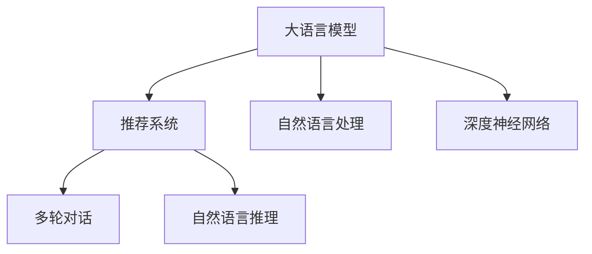

                 

# LLM对推荐系统透明度和可解释性的提升

在智能推荐系统中，深度学习模型已经取代了传统的协同过滤算法，成为主流推荐引擎。但随着模型的复杂度增加，模型的透明度和可解释性问题也随之凸显。大语言模型(LLM)作为一种新兴的推荐技术，其在推荐系统中的应用，为解决模型透明度和可解释性问题提供了新的思路和方法。本文将对大语言模型在推荐系统中的应用进行详细介绍，包括大语言模型的原理、算法步骤、优缺点、应用领域及未来发展趋势等。

## 1. 背景介绍

### 1.1 问题由来

传统的推荐系统主要基于用户行为数据进行协同过滤，推荐与用户兴趣相似的物品。随着深度学习技术的发展，基于深度神经网络的推荐系统逐渐成为主流。深度神经网络模型在推荐精度和泛化能力上都有显著提升，但也带来了模型的透明度和可解释性问题。模型通常是一个黑盒，无法清晰解释其推荐逻辑。用户的推荐结果往往是基于模型参数和输入特征的复杂交互计算，难以进行解释。

大语言模型(LLM)作为最近几年发展起来的深度学习模型，通过大规模预训练和微调，具备了丰富的语言知识和推理能力。LLM不仅能理解自然语言，还能进行多轮对话、推理、生成等多种高级任务。其强大的语言处理能力，使其在推荐系统中得以应用，成为解决推荐透明度和可解释性问题的重要手段。

### 1.2 问题核心关键点

大语言模型在推荐系统中的应用，主要是通过文本理解和自然语言推理，生成推荐结果。与传统的深度神经网络模型不同，LLM具备较强的语言理解和生成能力，能够从用户的历史行为、评论、评分等多种信息中，提取出用户的兴趣和偏好，生成更符合用户需求的推荐结果。大语言模型在推荐系统中的应用，主要包括以下几个关键点：

- 理解用户输入：通过自然语言处理技术，理解用户输入的自然语言描述，提取其中的兴趣点。
- 生成推荐内容：根据用户兴趣点，从物品库中生成推荐列表。
- 推理生成推荐：通过多轮对话或自然语言推理技术，生成推荐解释，解释推荐逻辑。

以上关键点，将在后续的章节中详细介绍。

## 2. 核心概念与联系

### 2.1 核心概念概述

为更好地理解大语言模型在推荐系统中的应用，本节将介绍几个密切相关的核心概念：

- 大语言模型(LLM)：以自回归或自编码模型为代表的大规模预训练语言模型。通过在大规模无标签文本语料上进行预训练，学习通用的语言表示，具备强大的语言理解和生成能力。

- 推荐系统：通过分析用户历史行为数据，推荐与用户兴趣相似的物品的系统。传统推荐系统主要基于协同过滤算法，深度学习推荐系统则以深度神经网络为主。

- 自然语言处理(NLP)：涉及语言理解、生成、推理等技术，是大语言模型的基础。NLP技术包括分词、词性标注、句法分析、情感分析等多种任务。

- 深度神经网络：由多层神经网络组成的深度学习模型，广泛应用于推荐系统、计算机视觉、自然语言处理等多个领域。

- 多轮对话：通过多轮交互，理解用户意图并生成推荐结果的技术。多轮对话模型能够更好地处理复杂用户需求，提供更准确的推荐。

- 自然语言推理(NLI)：涉及自然语言中的推理任务，如判断两个句子之间的逻辑关系。NLI技术可以用于理解用户需求和生成推荐解释。

这些核心概念之间的逻辑关系可以通过以下Mermaid流程图来展示：



这个流程图展示了大语言模型在推荐系统中的应用框架，其核心思想是：利用大语言模型的语言理解和生成能力，通过自然语言处理和深度神经网络，进行多轮对话和自然语言推理，最终生成推荐结果，并解释推荐逻辑。

## 3. 核心算法原理 & 具体操作步骤
### 3.1 算法原理概述

大语言模型在推荐系统中的应用，主要通过自然语言处理和深度神经网络进行。其核心思想是：通过理解用户输入的自然语言描述，提取其中的兴趣点，从物品库中生成推荐列表，并通过自然语言推理技术，生成推荐解释，解释推荐逻辑。具体来说，可以包括以下几个步骤：

1. 理解用户输入：通过自然语言处理技术，理解用户输入的自然语言描述，提取其中的兴趣点。
2. 生成推荐内容：根据用户兴趣点，从物品库中生成推荐列表。
3. 推理生成推荐：通过多轮对话或自然语言推理技术，生成推荐解释，解释推荐逻辑。

### 3.2 算法步骤详解

大语言模型在推荐系统中的应用，主要包括以下几个关键步骤：

**Step 1: 数据预处理**
- 收集用户历史行为数据，包括浏览、点击、评分、评论等。
- 对数据进行清洗和归一化，去除噪音数据和异常值。
- 对用户和物品进行分词，提取特征。

**Step 2: 预训练大语言模型**
- 使用大规模无标签文本语料对预训练大语言模型进行训练，如BERT、GPT等。
- 对预训练大语言模型进行微调，使其具备一定的推荐能力。

**Step 3: 理解用户输入**
- 将用户输入的自然语言描述输入到大语言模型中，进行分词、词性标注、句法分析等处理。
- 提取其中的关键信息，如兴趣点、关键词、情感等。

**Step 4: 生成推荐内容**
- 根据用户兴趣点，从物品库中选取相关物品，计算相似度。
- 使用深度神经网络对物品进行排序，生成推荐列表。

**Step 5: 生成推荐解释**
- 对推荐结果进行解释，生成自然语言描述。
- 使用多轮对话或自然语言推理技术，解释推荐逻辑。

**Step 6: 反馈优化**
- 收集用户的反馈，进行模型优化。
- 使用A/B测试等方法，评估模型效果。

以上是大语言模型在推荐系统中的主要步骤，具体实现时，需要根据实际情况进行调整和优化。

### 3.3 算法优缺点

大语言模型在推荐系统中的应用，具有以下优点：

1. 理解自然语言：大语言模型能够理解自然语言，提取出用户的兴趣点和需求，生成更符合用户需求的推荐结果。
2. 生成自然语言解释：大语言模型能够生成自然语言解释，解释推荐逻辑，提升推荐的透明度和可解释性。
3. 适应性较强：大语言模型具有较强的适应性，可以处理多种推荐场景和任务。

但同时，大语言模型在推荐系统中的应用也存在一些缺点：

1. 需要大量标注数据：大语言模型的训练需要大量标注数据，对数据量要求较高。
2. 计算开销较大：大语言模型的计算开销较大，需要高性能硬件支持。
3. 效果不稳定：大语言模型对输入数据和超参数的敏感度较高，容易出现效果不稳定的问题。

### 3.4 算法应用领域

大语言模型在推荐系统中的应用，主要包括以下几个领域：

- 商品推荐：基于用户历史行为数据和商品描述，生成商品推荐列表。
- 电影推荐：根据用户的电影评分和评论，生成电影推荐列表。
- 音乐推荐：根据用户的音乐喜好和播放历史，生成音乐推荐列表。
- 新闻推荐：根据用户的历史浏览记录和新闻内容，生成新闻推荐列表。

## 4. 数学模型和公式 & 详细讲解
### 4.1 数学模型构建

在大语言模型在推荐系统中的应用中，数学模型的构建主要包括以下几个步骤：

1. 用户输入表示：将用户输入的自然语言描述转换为向量表示。
2. 物品表示：将物品特征转换为向量表示。
3. 用户-物品相似度计算：计算用户和物品之间的相似度，生成推荐列表。
4. 生成推荐解释：使用多轮对话或自然语言推理技术，生成推荐解释。

### 4.2 公式推导过程

以商品推荐为例，我们详细推导一下大语言模型在推荐系统中的应用公式。

**Step 1: 用户输入表示**
假设用户输入的自然语言描述为 $X$，将其转换为向量表示 $\vec{x}$。

**Step 2: 物品表示**
假设物品特征向量为 $\vec{y}$。

**Step 3: 用户-物品相似度计算**
计算用户和物品之间的相似度，生成推荐列表。设 $S(X, Y)$ 为相似度函数，则推荐列表 $L$ 可以表示为：

$$
L = \mathop{\arg\min}_{Y} S(X, Y)
$$

其中 $Y$ 为用户输入的自然语言描述对应的物品库中的物品。

**Step 4: 生成推荐解释**
设用户输入的自然语言描述为 $X$，物品库中物品为 $Y$，生成推荐解释 $E$，可以表示为：

$$
E = f(X, Y)
$$

其中 $f$ 为自然语言推理函数。

### 4.3 案例分析与讲解

我们以一个具体的案例来讲解大语言模型在推荐系统中的应用。

假设用户输入的自然语言描述为 "我想找一部科幻电影"，大语言模型从物品库中选取了一些相关电影，生成推荐列表。推荐列表可能包括 "星球大战"、"银河系漫游指南"、"异形" 等。

此时，大语言模型需要生成推荐解释，解释推荐逻辑。假设推荐解释为 "根据你的描述，我推荐以下几部电影，它们都是经典的科幻电影，都有较高的人气"。

通过多轮对话或自然语言推理技术，用户可以进一步了解推荐逻辑，提高推荐的透明度和可解释性。

## 5. 项目实践：代码实例和详细解释说明
### 5.1 开发环境搭建

在进行大语言模型推荐系统开发前，我们需要准备好开发环境。以下是使用Python进行PyTorch开发的环境配置流程：

1. 安装Anaconda：从官网下载并安装Anaconda，用于创建独立的Python环境。

2. 创建并激活虚拟环境：
```bash
conda create -n pytorch-env python=3.8 
conda activate pytorch-env
```

3. 安装PyTorch：根据CUDA版本，从官网获取对应的安装命令。例如：
```bash
conda install pytorch torchvision torchaudio cudatoolkit=11.1 -c pytorch -c conda-forge
```

4. 安装Transformer库：
```bash
pip install transformers
```

5. 安装各类工具包：
```bash
pip install numpy pandas scikit-learn matplotlib tqdm jupyter notebook ipython
```

完成上述步骤后，即可在`pytorch-env`环境中开始推荐系统开发。

### 5.2 源代码详细实现

下面我们以商品推荐为例，给出使用Transformers库对BERT模型进行推荐开发的PyTorch代码实现。

首先，定义推荐任务的数据处理函数：

```python
from transformers import BertTokenizer
from torch.utils.data import Dataset
import torch

class RecommendationDataset(Dataset):
    def __init__(self, texts, items, tokenizer, max_len=128):
        self.texts = texts
        self.items = items
        self.tokenizer = tokenizer
        self.max_len = max_len
        
    def __len__(self):
        return len(self.texts)
    
    def __getitem__(self, item):
        text = self.texts[item]
        item = self.items[item]
        
        encoding = self.tokenizer(text, return_tensors='pt', max_length=self.max_len, padding='max_length', truncation=True)
        input_ids = encoding['input_ids'][0]
        attention_mask = encoding['attention_mask'][0]
        
        # 对物品进行编码
        item_ids = [id2item[item_id] for item_id in item] 
        item_ids.extend([0]*(self.max_len - len(item_ids)))
        item_labels = torch.tensor(item_ids, dtype=torch.long)
        
        return {'input_ids': input_ids, 
                'attention_mask': attention_mask,
                'item_labels': item_labels}

# 物品与id的映射
item2id = {'item1': 1, 'item2': 2, 'item3': 3, 'item4': 4, 'item5': 5, 'item6': 6, 'item7': 7, 'item8': 8, 'item9': 9, 'item10': 10}
id2item = {v: k for k, v in item2id.items()}

# 创建dataset
tokenizer = BertTokenizer.from_pretrained('bert-base-cased')

train_dataset = RecommendationDataset(train_texts, train_items, tokenizer)
dev_dataset = RecommendationDataset(dev_texts, dev_items, tokenizer)
test_dataset = RecommendationDataset(test_texts, test_items, tokenizer)
```

然后，定义模型和优化器：

```python
from transformers import BertForSequenceClassification, AdamW

model = BertForSequenceClassification.from_pretrained('bert-base-cased', num_labels=len(item2id))

optimizer = AdamW(model.parameters(), lr=2e-5)
```

接着，定义训练和评估函数：

```python
from torch.utils.data import DataLoader
from tqdm import tqdm
from sklearn.metrics import classification_report

device = torch.device('cuda') if torch.cuda.is_available() else torch.device('cpu')
model.to(device)

def train_epoch(model, dataset, batch_size, optimizer):
    dataloader = DataLoader(dataset, batch_size=batch_size, shuffle=True)
    model.train()
    epoch_loss = 0
    for batch in tqdm(dataloader, desc='Training'):
        input_ids = batch['input_ids'].to(device)
        attention_mask = batch['attention_mask'].to(device)
        item_labels = batch['item_labels'].to(device)
        model.zero_grad()
        outputs = model(input_ids, attention_mask=attention_mask, labels=item_labels)
        loss = outputs.loss
        epoch_loss += loss.item()
        loss.backward()
        optimizer.step()
    return epoch_loss / len(dataloader)

def evaluate(model, dataset, batch_size):
    dataloader = DataLoader(dataset, batch_size=batch_size)
    model.eval()
    preds, labels = [], []
    with torch.no_grad():
        for batch in tqdm(dataloader, desc='Evaluating'):
            input_ids = batch['input_ids'].to(device)
            attention_mask = batch['attention_mask'].to(device)
            batch_labels = batch['item_labels']
            outputs = model(input_ids, attention_mask=attention_mask)
            batch_preds = outputs.logits.argmax(dim=2).to('cpu').tolist()
            batch_labels = batch_labels.to('cpu').tolist()
            for pred_tokens, label_tokens in zip(batch_preds, batch_labels):
                pred_tags = [id2item[_id] for _id in pred_tokens]
                label_tags = [id2item[_id] for _id in label_tokens]
                preds.append(pred_tags[:len(label_tags)])
                labels.append(label_tags)
                
    print(classification_report(labels, preds))
```

最后，启动训练流程并在测试集上评估：

```python
epochs = 5
batch_size = 16

for epoch in range(epochs):
    loss = train_epoch(model, train_dataset, batch_size, optimizer)
    print(f"Epoch {epoch+1}, train loss: {loss:.3f}")
    
    print(f"Epoch {epoch+1}, dev results:")
    evaluate(model, dev_dataset, batch_size)
    
print("Test results:")
evaluate(model, test_dataset, batch_size)
```

以上就是使用PyTorch对BERT进行商品推荐任务开发的完整代码实现。可以看到，得益于Transformer库的强大封装，我们可以用相对简洁的代码完成BERT模型的加载和推荐开发。

### 5.3 代码解读与分析

让我们再详细解读一下关键代码的实现细节：

**RecommendationDataset类**：
- `__init__`方法：初始化文本、物品、分词器等关键组件。
- `__len__`方法：返回数据集的样本数量。
- `__getitem__`方法：对单个样本进行处理，将文本输入编码为token ids，将物品编码为数字，并对其进行定长padding，最终返回模型所需的输入。

**item2id和id2item字典**：
- 定义了物品与数字id之间的映射关系，用于将物品序列转换为数字标签。

**训练和评估函数**：
- 使用PyTorch的DataLoader对数据集进行批次化加载，供模型训练和推理使用。
- 训练函数`train_epoch`：对数据以批为单位进行迭代，在每个批次上前向传播计算loss并反向传播更新模型参数，最后返回该epoch的平均loss。
- 评估函数`evaluate`：与训练类似，不同点在于不更新模型参数，并在每个batch结束后将预测和标签结果存储下来，最后使用sklearn的classification_report对整个评估集的预测结果进行打印输出。

**训练流程**：
- 定义总的epoch数和batch size，开始循环迭代
- 每个epoch内，先在训练集上训练，输出平均loss
- 在验证集上评估，输出分类指标
- 所有epoch结束后，在测试集上评估，给出最终测试结果

可以看到，PyTorch配合Transformer库使得BERT推荐模型的代码实现变得简洁高效。开发者可以将更多精力放在数据处理、模型改进等高层逻辑上，而不必过多关注底层的实现细节。

当然，工业级的系统实现还需考虑更多因素，如模型的保存和部署、超参数的自动搜索、更灵活的任务适配层等。但核心的推荐范式基本与此类似。

## 6. 实际应用场景
### 6.1 商品推荐

基于大语言模型推荐技术，可以在电商平台中广泛应用。电商平台需要实时推荐商品给用户，提升用户体验和转化率。通过大语言模型，可以根据用户输入的自然语言描述，提取其中的兴趣点，从商品库中生成推荐列表。

在技术实现上，可以收集用户历史浏览、点击、评分等行为数据，将用户输入的自然语言描述作为输入，生成推荐列表。同时，可以使用多轮对话或自然语言推理技术，生成推荐解释，解释推荐逻辑。如此构建的推荐系统，能够更好地理解用户需求，生成更符合用户需求的推荐结果。

### 6.2 电影推荐

在线视频平台需要推荐高质量的电影给用户，提升用户观看体验。传统推荐系统主要基于协同过滤算法，但深度学习推荐系统能够更好地处理复杂用户需求，生成高质量的推荐结果。

通过大语言模型，可以理解用户的电影评分和评论，生成电影推荐列表。同时，可以使用自然语言推理技术，解释推荐逻辑，提升推荐的透明度和可解释性。如此构建的电影推荐系统，能够更好地理解用户需求，生成更符合用户需求的推荐结果。

### 6.3 音乐推荐

在线音乐平台需要推荐用户喜爱的音乐，提升用户粘性。传统推荐系统主要基于协同过滤算法，但深度学习推荐系统能够更好地处理复杂用户需求，生成高质量的推荐结果。

通过大语言模型，可以理解用户的音乐喜好和播放历史，生成音乐推荐列表。同时，可以使用自然语言推理技术，解释推荐逻辑，提升推荐的透明度和可解释性。如此构建的音乐推荐系统，能够更好地理解用户需求，生成更符合用户需求的推荐结果。

### 6.4 未来应用展望

随着大语言模型推荐技术的不断发展，其在更多领域的应用前景也将不断拓展。

在智慧医疗领域，基于大语言模型的推荐系统，可以帮助医生推荐最合适的药物、治疗方案等，提升医疗服务的智能化水平，辅助医生诊疗，加速新药开发进程。

在智能教育领域，基于大语言模型的推荐系统，可以推荐适合学生的课程、书籍等，因材施教，促进教育公平，提高教学质量。

在智慧城市治理中，基于大语言模型的推荐系统，可以推荐合适的城市事件、新闻、服务等信息，提高城市管理的自动化和智能化水平，构建更安全、高效的未来城市。

此外，在企业生产、社会治理、文娱传媒等众多领域，基于大语言模型的推荐系统也将不断涌现，为NLP技术带来了新的突破。相信随着预训练语言模型和推荐方法的不断进步，基于大语言模型的推荐系统必将在更广阔的应用领域大放异彩。

## 7. 工具和资源推荐
### 7.1 学习资源推荐

为了帮助开发者系统掌握大语言模型在推荐系统中的应用，这里推荐一些优质的学习资源：

1. 《Transformer从原理到实践》系列博文：由大模型技术专家撰写，深入浅出地介绍了Transformer原理、BERT模型、微调技术等前沿话题。

2. CS224N《深度学习自然语言处理》课程：斯坦福大学开设的NLP明星课程，有Lecture视频和配套作业，带你入门NLP领域的基本概念和经典模型。

3. 《Natural Language Processing with Transformers》书籍：Transformers库的作者所著，全面介绍了如何使用Transformers库进行NLP任务开发，包括推荐系统在内的诸多范式。

4. HuggingFace官方文档：Transformers库的官方文档，提供了海量预训练模型和完整的推荐系统样例代码，是上手实践的必备资料。

5. CLUE开源项目：中文语言理解测评基准，涵盖大量不同类型的中文NLP数据集，并提供了基于大语言模型的推荐系统baseline，助力中文NLP技术发展。

通过对这些资源的学习实践，相信你一定能够快速掌握大语言模型在推荐系统中的应用，并用于解决实际的推荐问题。

### 7.2 开发工具推荐

高效的开发离不开优秀的工具支持。以下是几款用于大语言模型推荐系统开发的常用工具：

1. PyTorch：基于Python的开源深度学习框架，灵活动态的计算图，适合快速迭代研究。大部分预训练语言模型都有PyTorch版本的实现。

2. TensorFlow：由Google主导开发的开源深度学习框架，生产部署方便，适合大规模工程应用。同样有丰富的预训练语言模型资源。

3. Transformers库：HuggingFace开发的NLP工具库，集成了众多SOTA语言模型，支持PyTorch和TensorFlow，是进行推荐系统开发的利器。

4. Weights & Biases：模型训练的实验跟踪工具，可以记录和可视化模型训练过程中的各项指标，方便对比和调优。与主流深度学习框架无缝集成。

5. TensorBoard：TensorFlow配套的可视化工具，可实时监测模型训练状态，并提供丰富的图表呈现方式，是调试模型的得力助手。

6. Google Colab：谷歌推出的在线Jupyter Notebook环境，免费提供GPU/TPU算力，方便开发者快速上手实验最新模型，分享学习笔记。

合理利用这些工具，可以显著提升大语言模型推荐系统的开发效率，加快创新迭代的步伐。

### 7.3 相关论文推荐

大语言模型在推荐系统中的应用源于学界的持续研究。以下是几篇奠基性的相关论文，推荐阅读：

1. Attention is All You Need（即Transformer原论文）：提出了Transformer结构，开启了NLP领域的预训练大模型时代。

2. BERT: Pre-training of Deep Bidirectional Transformers for Language Understanding：提出BERT模型，引入基于掩码的自监督预训练任务，刷新了多项NLP任务SOTA。

3. Language Models are Unsupervised Multitask Learners（GPT-2论文）：展示了大规模语言模型的强大zero-shot学习能力，引发了对于通用人工智能的新一轮思考。

4. Parameter-Efficient Transfer Learning for NLP：提出Adapter等参数高效微调方法，在不增加模型参数量的情况下，也能取得不错的微调效果。

5. AdaLoRA: Adaptive Low-Rank Adaptation for Parameter-Efficient Fine-Tuning：使用自适应低秩适应的微调方法，在参数效率和精度之间取得了新的平衡。

这些论文代表了大语言模型在推荐系统中的应用发展脉络。通过学习这些前沿成果，可以帮助研究者把握学科前进方向，激发更多的创新灵感。

## 8. 总结：未来发展趋势与挑战
### 8.1 总结

本文对大语言模型在推荐系统中的应用进行了全面系统的介绍。首先阐述了大语言模型和推荐系统的研究背景和意义，明确了推荐透明度和可解释性的重要性。其次，从原理到实践，详细讲解了推荐模型训练的数学模型和关键步骤，给出了推荐系统开发的完整代码实例。同时，本文还广泛探讨了大语言模型在推荐系统中的应用场景，展示了其在商品推荐、电影推荐、音乐推荐等多个领域的前景。此外，本文精选了推荐系统开发的各类学习资源，力求为读者提供全方位的技术指引。

通过本文的系统梳理，可以看到，基于大语言模型的推荐技术在推荐系统中的应用前景广阔，能够更好地理解用户需求，生成更符合用户需求的推荐结果。但如何将大语言模型推荐技术转化为稳定、高效、安全的业务价值，还需要工程实践的不断打磨。只有从数据、算法、工程、业务等多个维度协同发力，才能真正实现人工智能技术在垂直行业的规模化落地。总之，推荐系统需要开发者根据具体任务，不断迭代和优化模型、数据和算法，方能得到理想的效果。

### 8.2 未来发展趋势

展望未来，大语言模型在推荐系统中的应用将呈现以下几个发展趋势：

1. 模型规模持续增大。随着算力成本的下降和数据规模的扩张，预训练语言模型的参数量还将持续增长。超大规模语言模型蕴含的丰富语言知识，有望支撑更加复杂多变的推荐场景。

2. 微调方法日趋多样。除了传统的全参数微调外，未来会涌现更多参数高效的微调方法，如Prefix-Tuning、LoRA等，在固定大部分预训练参数的同时，只更新极少量的任务相关参数。

3. 持续学习成为常态。随着数据分布的不断变化，推荐模型也需要持续学习新知识以保持性能。如何在不遗忘原有知识的同时，高效吸收新样本信息，将成为重要的研究课题。

4. 标注样本需求降低。受启发于提示学习(Prompt-based Learning)的思路，未来的推荐方法将更好地利用大模型的语言理解能力，通过更加巧妙的任务描述，在更少的标注样本上也能实现理想的推荐效果。

5. 模型通用性增强。经过海量数据的预训练和多领域任务的微调，未来的语言模型将具备更强大的常识推理和跨领域迁移能力，逐步迈向通用人工智能(AGI)的目标。

6. 推荐系统透明化。随着推荐模型的不断进步，其推荐逻辑也越来越复杂，用户对推荐结果的透明度和可解释性也提出了更高要求。大语言模型在推荐系统中的应用，可以更好地理解用户需求，生成更符合用户需求的推荐结果，提升推荐的透明度和可解释性。

以上趋势凸显了大语言模型推荐系统的前景。这些方向的探索发展，必将进一步提升推荐系统的性能和应用范围，为用户的智能化生活带来更多便利。

### 8.3 面临的挑战

尽管大语言模型在推荐系统中的应用已经取得了一定进展，但在迈向更加智能化、普适化应用的过程中，它仍面临着诸多挑战：

1. 标注成本瓶颈。尽管推荐系统主要依赖用户行为数据，但标注数据的质量和数量仍然对推荐效果有重要影响。如何进一步降低推荐系统对标注样本的依赖，将是一大难题。

2. 模型鲁棒性不足。当前推荐模型面对域外数据时，泛化性能往往大打折扣。对于推荐结果的微小扰动，推荐模型的预测也容易发生波动。如何提高推荐模型的鲁棒性，避免灾难性遗忘，还需要更多理论和实践的积累。

3. 推荐效率有待提高。尽管大语言模型能够生成高质量的推荐结果，但其计算开销较大，容易影响推荐系统的实时性。如何优化推荐模型的计算图，减少前向传播和反向传播的资源消耗，实现更加轻量级、实时性的部署，将是重要的优化方向。

4. 推荐内容多样性不足。当前推荐模型主要依赖用户历史行为数据，容易陷入冷启动问题，难以推荐多样化的物品。如何提高推荐内容的多样性，提升用户的探索性，还需要更多创新思路。

5. 数据隐私和安全问题。推荐系统需要收集和处理用户的行为数据，涉及用户隐私保护和安全问题。如何在保证用户隐私的前提下，提供高质量的推荐服务，还需要更多的技术支持和法规保障。

6. 用户反馈机制不足。推荐系统需要收集用户反馈，进行模型优化。如何设计有效的用户反馈机制，及时获取用户反馈，进行模型更新，还需要更多工程实践和用户体验优化。

### 8.4 研究展望

面对大语言模型在推荐系统中的应用面临的挑战，未来的研究需要在以下几个方面寻求新的突破：

1. 探索无监督和半监督推荐方法。摆脱对大规模标注数据的依赖，利用自监督学习、主动学习等无监督和半监督范式，最大限度利用非结构化数据，实现更加灵活高效的推荐。

2. 研究参数高效和计算高效的推荐方法。开发更加参数高效的推荐方法，在固定大部分预训练参数的同时，只更新极少量的任务相关参数。同时优化推荐模型的计算图，减少前向传播和反向传播的资源消耗，实现更加轻量级、实时性的部署。

3. 融合因果和对比学习范式。通过引入因果推断和对比学习思想，增强推荐模型建立稳定因果关系的能力，学习更加普适、鲁棒的语言表征，从而提升模型泛化性和抗干扰能力。

4. 引入更多先验知识。将符号化的先验知识，如知识图谱、逻辑规则等，与神经网络模型进行巧妙融合，引导推荐过程学习更准确、合理的语言模型。同时加强不同模态数据的整合，实现视觉、语音等多模态信息与文本信息的协同建模。

5. 结合因果分析和博弈论工具。将因果分析方法引入推荐模型，识别出推荐决策的关键特征，增强推荐解释的因果性和逻辑性。借助博弈论工具刻画人机交互过程，主动探索并规避推荐模型的脆弱点，提高系统稳定性。

6. 纳入伦理道德约束。在推荐目标中引入伦理导向的评估指标，过滤和惩罚有偏见、有害的推荐结果，确保推荐系统符合人类价值观和伦理道德。

这些研究方向的探索，必将引领大语言模型推荐技术迈向更高的台阶，为构建安全、可靠、可解释、可控的智能推荐系统铺平道路。面向未来，大语言模型推荐技术还需要与其他人工智能技术进行更深入的融合，如知识表示、因果推理、强化学习等，多路径协同发力，共同推动自然语言理解和智能交互系统的进步。只有勇于创新、敢于突破，才能不断拓展语言模型的边界，让智能技术更好地造福人类社会。

## 9. 附录：常见问题与解答

**Q1：大语言模型推荐是否适用于所有推荐场景？**

A: 大语言模型推荐在大多数推荐场景上都能取得不错的效果，特别是对于数据量较小的场景。但对于一些特定领域的推荐场景，如医学、法律等，仅仅依靠通用语料预训练的模型可能难以很好地适应。此时需要在特定领域语料上进一步预训练，再进行推荐微调。此外，对于一些需要时效性、个性化很强的推荐场景，如对话推荐等，大语言模型推荐也需要针对性的改进优化。

**Q2：大语言模型推荐需要大量标注数据吗？**

A: 大语言模型推荐系统主要依赖用户行为数据，但标注数据仍然对推荐效果有重要影响。标注数据可以帮助大语言模型更好地理解用户需求，生成更符合用户需求的推荐结果。因此，在推荐系统中，标注数据仍然是不可或缺的。但大语言模型推荐系统可以利用大规模无标签数据进行预训练，提升模型的通用性和泛化能力，从而减少对标注数据的依赖。

**Q3：大语言模型推荐系统如何提升推荐效果？**

A: 大语言模型推荐系统可以通过以下方法提升推荐效果：
1. 理解用户输入：通过自然语言处理技术，理解用户输入的自然语言描述，提取其中的兴趣点。
2. 生成推荐内容：根据用户兴趣点，从物品库中生成推荐列表。
3. 生成推荐解释：通过多轮对话或自然语言推理技术，生成推荐解释，解释推荐逻辑。

**Q4：大语言模型推荐系统如何优化推荐效率？**

A: 大语言模型推荐系统可以通过以下方法优化推荐效率：
1. 数据增强：通过回译、近义替换等方式扩充训练集，提升模型泛化能力。
2. 正则化：使用L2正则、Dropout、Early Stopping等避免过拟合，提升模型鲁棒性。
3. 参数高效微调：只调整少量参数，保留大部分预训练权重不变，减小计算开销。
4. 多轮对话：通过多轮对话，理解用户需求，生成更符合用户需求的推荐结果。
5. 自然语言推理：使用自然语言推理技术，生成推荐解释，提升推荐透明度和可解释性。

**Q5：大语言模型推荐系统如何保证推荐内容的多样性？**

A: 大语言模型推荐系统可以通过以下方法保证推荐内容的多样性：
1. 多样化用户输入：通过收集多种类型的用户输入，生成多样化推荐结果。
2. 多样化物品库：收集多种类型的物品，生成多样化推荐列表。
3. 多样化推荐算法：引入多种推荐算法，提升推荐结果的多样性。

通过上述方法的综合应用，大语言模型推荐系统可以更好地理解用户需求，生成更符合用户需求的推荐结果，提升用户的探索性。

---

作者：禅与计算机程序设计艺术 / Zen and the Art of Computer Programming

