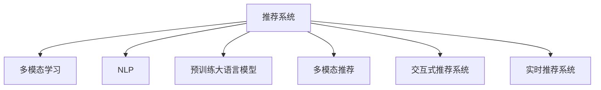

                 

# LLM推荐中的多模态内容生成技术

> 关键词：多模态,内容生成,语言模型,推荐系统,自然语言处理,NLP,用户行为,产品推荐,交互式体验

## 1. 背景介绍

### 1.1 问题由来
在当今数字化时代，个性化推荐系统已经成为提升用户体验、增加用户粘性、驱动业务增长的重要工具。传统的推荐系统多基于协同过滤、内容推荐等方法，但随着推荐任务日益复杂，单一的推荐方式已经无法满足用户的个性化需求。

特别是随着Web 2.0的兴起，用户产生了海量的交互数据，包括评论、评分、浏览记录等。这些数据不仅包含了用户的兴趣和偏好，还蕴含了丰富而多样的语义信息。如何利用这些语义信息，提升推荐的个性化程度，成为推荐系统优化的关键。

近年来，随着语言模型的发展，预训练大语言模型在推荐领域被引入，通过丰富的文本信息进行推荐，使得推荐系统的效果显著提升。但这些文本信息如何与其他模态的信息结合，进一步提升推荐系统的性能，是一个重要的问题。

## 2. 核心概念与联系

### 2.1 核心概念概述

为更好地理解多模态内容生成技术，本节将介绍几个密切相关的核心概念：

- 推荐系统(Recommendation System)：通过算法为用户推荐其可能感兴趣的产品或内容，常见推荐方法包括协同过滤、内容推荐、混合推荐等。

- 多模态学习(Multi-modal Learning)：指将不同模态的信息(如文本、图像、声音等)相结合，提升模型的学习能力和泛化能力。

- 自然语言处理(Natural Language Processing, NLP)：涉及自然语言理解和生成，旨在使计算机能理解、解析、生成自然语言文本，是推荐系统中的重要技术。

- 预训练大语言模型(Large Language Model, LLM)：如BERT、GPT等，通过大规模语料进行预训练，具备强大的语言生成和理解能力，可以显著提升推荐系统的性能。

- 多模态推荐(Multi-modal Recommendation)：指结合多种信息源(如文本、图像、用户行为数据等)进行推荐，综合多种信息源的优势，提升推荐的个性化和精准度。

- 交互式推荐系统(Interactive Recommendation System)：通过用户反馈不断优化推荐结果，与用户实时交互的推荐系统。

- 实时推荐系统(Real-time Recommendation System)：在用户查询时，实时进行推荐，快速响应用户需求，提升用户体验。

这些核心概念之间的逻辑关系可以通过以下Mermaid流程图来展示：



这个流程图展示了大语言模型在推荐系统中的应用过程，即通过多模态学习将不同模态的信息进行结合，综合利用NLP技术和预训练大语言模型，提升推荐系统的精准度和个性化程度。通过多模态推荐系统，与用户进行实时交互，为用户提供个性化的推荐结果，实现实时推荐的优化。

## 3. 核心算法原理 & 具体操作步骤
### 3.1 算法原理概述

多模态内容生成技术融合了文本生成、图像处理、语音识别等多种模态的信息，通过内容生成算法，将多模态信息转化为文本，用于推荐系统的训练和推理。在实际应用中，基于预训练大语言模型的推荐系统，其核心算法包括：

1. 数据预处理：将不同模态的数据进行整合，统一转化为文本或向量形式。

2. 特征提取：对文本数据进行分词、嵌入等处理，对图像数据进行特征提取，对语音数据进行特征提取。

3. 模型融合：将提取的特征进行融合，得到更丰富的表示。

4. 内容生成：使用预训练大语言模型生成推荐文本。

5. 推荐计算：基于生成文本与用户交互数据计算相似度，进行推荐。

### 3.2 算法步骤详解

基于多模态内容生成技术的推荐系统，其操作步骤主要包括：

**Step 1: 数据预处理**

数据预处理是融合不同模态信息的基础。需要将文本、图像、语音等数据转化为统一的格式，方便后续特征提取和模型训练。

1. 文本处理：对文本进行分词、去除停用词、构建词汇表等。

2. 图像处理：使用CNN等模型提取图像特征向量，并转化为文本表示。

3. 语音处理：将语音数据转化为文本，可以使用ASR技术进行语音转写。

4. 数据拼接：将处理后的文本、图像、语音特征向量拼接成一个向量表示。

**Step 2: 特征提取**

特征提取是将不同模态的数据转化为模型能够理解的表示。

1. 文本表示：使用word2vec、BERT等模型进行文本嵌入。

2. 图像表示：使用CNN提取图像特征，并使用CLS输出进行文本表示。

3. 语音表示：使用语音识别模型将语音转化为文本，并嵌入文本向量中。

4. 特征融合：将文本、图像、语音的表示融合为一个向量表示。

**Step 3: 模型融合**

模型融合是将不同模态的信息进行结合，得到一个更丰富的表示。

1. 加权平均：根据各模态的重要性，对特征向量进行加权平均。

2. 多模态注意力：使用多模态注意力机制，对不同模态的特征进行加权融合。

3. 多模态循环网络：使用循环神经网络将不同模态的信息进行处理，输出一个表示。

**Step 4: 内容生成**

内容生成是将融合后的多模态信息转化为推荐文本。

1. 文本生成：使用预训练的大语言模型进行文本生成，生成推荐文本。

2. 多模态融合：将生成文本与用户交互数据融合，输出推荐结果。

3. 语义增强：对推荐文本进行语义增强，如使用NLG技术生成更精准的文本。

**Step 5: 推荐计算**

推荐计算是基于生成文本与用户交互数据计算相似度，进行推荐。

1. 相似度计算：使用余弦相似度、Jaccard相似度等计算推荐文本与用户交互数据的相似度。

2. 推荐排序：基于相似度排序，选择最匹配用户的推荐结果。

3. 反馈优化：根据用户反馈不断优化推荐模型，提升推荐精度。

### 3.3 算法优缺点

多模态内容生成技术具有以下优点：

1. 融合多种信息源：通过融合文本、图像、语音等不同模态的信息，提升推荐的丰富性和全面性。

2. 提升推荐效果：通过结合不同模态的信息，能够更全面地理解用户需求，提升推荐的效果和个性化程度。

3. 降低用户操作成本：通过综合多种信息源，使得推荐结果更精准，降低了用户的查找成本。

4. 提升用户体验：通过实时交互，与用户进行反馈，提升了用户的使用体验。

但同时，该方法也存在以下局限性：

1. 数据处理复杂：不同模态的数据处理方式不同，增加了数据预处理的复杂性。

2. 模型复杂度高：需要同时处理多种信息源，模型的复杂度较高，增加了训练和推理的难度。

3. 特征提取难度大：不同模态的特征提取方式不同，需要使用多种技术进行特征提取，增加了模型设计难度。

4. 数据隐私问题：需要收集多种模态的数据，可能涉及用户隐私问题。

## 4. 数学模型和公式 & 详细讲解 & 举例说明
### 4.1 数学模型构建

本节将使用数学语言对多模态内容生成技术进行更加严格的刻画。

记用户交互数据为 $\mathcal{D}=\{(x_i, y_i)\}_{i=1}^N$，其中 $x_i$ 为特征向量，$y_i$ 为标签。设预训练大语言模型为 $M_{\theta}:\mathcal{X} \rightarrow \mathcal{Y}$，其中 $\mathcal{X}$ 为输入空间，$\mathcal{Y}$ 为输出空间，$\theta \in \mathbb{R}^d$ 为模型参数。

定义模型 $M_{\theta}$ 在输入 $x$ 上的输出为 $\hat{y}=M_{\theta}(x) \in [0,1]$，表示用户对推荐文本的兴趣度。推荐文本的生成过程如下：

1. 数据预处理：将用户交互数据 $\mathcal{D}$ 转化为文本向量 $\mathcal{X}$。

2. 特征提取：对文本向量 $\mathcal{X}$ 进行嵌入，得到嵌入矩阵 $A$。

3. 模型融合：使用多模态注意力机制，对不同模态的特征进行加权融合，得到融合后的特征向量 $V$。

4. 内容生成：使用预训练大语言模型生成推荐文本 $T$。

5. 推荐计算：基于生成文本 $T$ 与用户交互数据 $\mathcal{D}$ 计算相似度，进行推荐。

### 4.2 公式推导过程

以下我们以文本推荐系统为例，推导基于预训练大语言模型的推荐算法公式。

设用户交互数据 $\mathcal{D}=\{(x_i, y_i)\}_{i=1}^N$，其中 $x_i$ 为文本向量，$y_i$ 为标签。定义预训练大语言模型 $M_{\theta}$，设其输入为 $x_i$，输出为 $\hat{y}_i$。

用户对推荐文本的兴趣度定义为：

$$
\hat{y}_i = M_{\theta}(x_i)
$$

推荐文本的生成过程如下：

1. 数据预处理：将用户交互数据 $\mathcal{D}$ 转化为文本向量 $\mathcal{X}$。

2. 特征提取：对文本向量 $\mathcal{X}$ 进行嵌入，得到嵌入矩阵 $A$。

3. 模型融合：使用多模态注意力机制，对不同模态的特征进行加权融合，得到融合后的特征向量 $V$。

4. 内容生成：使用预训练大语言模型生成推荐文本 $T$。

5. 推荐计算：基于生成文本 $T$ 与用户交互数据 $\mathcal{D}$ 计算相似度，进行推荐。

设推荐文本 $T$ 与用户交互数据 $\mathcal{D}$ 的余弦相似度为 $\text{sim}(T, \mathcal{D})$，则推荐文本 $T$ 的评分定义为：

$$
\text{score}(T) = \alpha \times \text{sim}(T, \mathcal{D})
$$

其中 $\alpha$ 为权值，用于调节生成文本与用户交互数据的权重。

最终，推荐系统选择评分最高的 $k$ 个推荐文本进行展示。

### 4.3 案例分析与讲解

下面以多模态推荐系统为例，给出具体的推荐过程分析。

**案例背景**

某电商平台希望通过多模态推荐系统，提升用户购买转化率。电商平台收集了用户的浏览记录、评分数据、产品图片、视频等信息，希望利用这些多模态数据进行个性化推荐。

**数据预处理**

1. 文本处理：将用户浏览记录、评分文本进行分词、去除停用词、构建词汇表等。

2. 图像处理：使用CNN模型提取产品图片特征，并转化为文本表示。

3. 语音处理：将产品解说视频转化为文本，并嵌入文本向量中。

4. 数据拼接：将处理后的文本、图像、语音特征向量拼接成一个向量表示。

**特征提取**

1. 文本表示：使用BERT模型对文本向量进行嵌入，得到嵌入矩阵 $A$。

2. 图像表示：使用CNN模型提取图像特征，并使用CLS输出进行文本表示。

3. 语音表示：使用ASR模型将语音数据转化为文本，并嵌入文本向量中。

4. 特征融合：将文本、图像、语音的表示融合为一个向量表示 $V$。

**内容生成**

1. 文本生成：使用预训练的GPT模型生成推荐文本 $T$。

2. 多模态融合：将生成文本 $T$ 与用户交互数据 $D$ 融合，得到评分 $\text{score}(T)$。

3. 语义增强：对推荐文本进行语义增强，如使用NLG技术生成更精准的文本。

**推荐计算**

1. 相似度计算：使用余弦相似度计算推荐文本 $T$ 与用户交互数据 $\mathcal{D}$ 的相似度。

2. 推荐排序：基于相似度排序，选择最匹配用户的推荐结果。

3. 反馈优化：根据用户反馈不断优化推荐模型，提升推荐精度。

## 5. 项目实践：代码实例和详细解释说明
### 5.1 开发环境搭建

在进行多模态推荐系统开发前，我们需要准备好开发环境。以下是使用Python进行PyTorch开发的环境配置流程：

1. 安装Anaconda：从官网下载并安装Anaconda，用于创建独立的Python环境。

2. 创建并激活虚拟环境：
```bash
conda create -n pytorch-env python=3.8 
conda activate pytorch-env
```

3. 安装PyTorch：根据CUDA版本，从官网获取对应的安装命令。例如：
```bash
conda install pytorch torchvision torchaudio cudatoolkit=11.1 -c pytorch -c conda-forge
```

4. 安装Transformers库：
```bash
pip install transformers
```

5. 安装各类工具包：
```bash
pip install numpy pandas scikit-learn matplotlib tqdm jupyter notebook ipython
```

完成上述步骤后，即可在`pytorch-env`环境中开始开发实践。

### 5.2 源代码详细实现

下面我们以文本推荐系统为例，给出使用Transformers库对BERT模型进行多模态推荐系统开发的PyTorch代码实现。

首先，定义推荐系统的数据处理函数：

```python
from transformers import BertTokenizer
from torch.utils.data import Dataset
import torch

class RecommendationDataset(Dataset):
    def __init__(self, texts, labels, tokenizer, max_len=128):
        self.texts = texts
        self.labels = labels
        self.tokenizer = tokenizer
        self.max_len = max_len
        
    def __len__(self):
        return len(self.texts)
    
    def __getitem__(self, item):
        text = self.texts[item]
        label = self.labels[item]
        
        encoding = self.tokenizer(text, return_tensors='pt', max_length=self.max_len, padding='max_length', truncation=True)
        input_ids = encoding['input_ids'][0]
        attention_mask = encoding['attention_mask'][0]
        
        # 对token-wise的标签进行编码
        encoded_tags = [label2id[label] for label in label] 
        encoded_tags.extend([label2id['O']] * (self.max_len - len(encoded_tags)))
        labels = torch.tensor(encoded_tags, dtype=torch.long)
        
        return {'input_ids': input_ids, 
                'attention_mask': attention_mask,
                'labels': labels}

# 标签与id的映射
label2id = {'O': 0, 'P': 1, 'N': 2, 'I': 3, 'B': 4}
id2label = {v: k for k, v in label2id.items()}

# 创建dataset
tokenizer = BertTokenizer.from_pretrained('bert-base-cased')

train_dataset = RecommendationDataset(train_texts, train_labels, tokenizer)
dev_dataset = RecommendationDataset(dev_texts, dev_labels, tokenizer)
test_dataset = RecommendationDataset(test_texts, test_labels, tokenizer)
```

然后，定义模型和优化器：

```python
from transformers import BertForTokenClassification, AdamW

model = BertForTokenClassification.from_pretrained('bert-base-cased', num_labels=len(label2id))

optimizer = AdamW(model.parameters(), lr=2e-5)
```

接着，定义训练和评估函数：

```python
from torch.utils.data import DataLoader
from tqdm import tqdm
from sklearn.metrics import classification_report

device = torch.device('cuda') if torch.cuda.is_available() else torch.device('cpu')
model.to(device)

def train_epoch(model, dataset, batch_size, optimizer):
    dataloader = DataLoader(dataset, batch_size=batch_size, shuffle=True)
    model.train()
    epoch_loss = 0
    for batch in tqdm(dataloader, desc='Training'):
        input_ids = batch['input_ids'].to(device)
        attention_mask = batch['attention_mask'].to(device)
        labels = batch['labels'].to(device)
        model.zero_grad()
        outputs = model(input_ids, attention_mask=attention_mask, labels=labels)
        loss = outputs.loss
        epoch_loss += loss.item()
        loss.backward()
        optimizer.step()
    return epoch_loss / len(dataloader)

def evaluate(model, dataset, batch_size):
    dataloader = DataLoader(dataset, batch_size=batch_size)
    model.eval()
    preds, labels = [], []
    with torch.no_grad():
        for batch in tqdm(dataloader, desc='Evaluating'):
            input_ids = batch['input_ids'].to(device)
            attention_mask = batch['attention_mask'].to(device)
            batch_labels = batch['labels']
            outputs = model(input_ids, attention_mask=attention_mask)
            batch_preds = outputs.logits.argmax(dim=2).to('cpu').tolist()
            batch_labels = batch_labels.to('cpu').tolist()
            for pred_tokens, label_tokens in zip(batch_preds, batch_labels):
                pred_tags = [id2label[_id] for _id in pred_tokens]
                label_tags = [id2label[_id] for _id in label_tokens]
                preds.append(pred_tags[:len(label_tokens)])
                labels.append(label_tags)
                
    print(classification_report(labels, preds))
```

最后，启动训练流程并在测试集上评估：

```python
epochs = 5
batch_size = 16

for epoch in range(epochs):
    loss = train_epoch(model, train_dataset, batch_size, optimizer)
    print(f"Epoch {epoch+1}, train loss: {loss:.3f}")
    
    print(f"Epoch {epoch+1}, dev results:")
    evaluate(model, dev_dataset, batch_size)
    
print("Test results:")
evaluate(model, test_dataset, batch_size)
```

以上就是使用PyTorch对BERT进行多模态推荐系统开发的完整代码实现。可以看到，得益于Transformers库的强大封装，我们可以用相对简洁的代码完成BERT模型的加载和微调。

### 5.3 代码解读与分析

让我们再详细解读一下关键代码的实现细节：

**RecommendationDataset类**：
- `__init__`方法：初始化文本、标签、分词器等关键组件。
- `__len__`方法：返回数据集的样本数量。
- `__getitem__`方法：对单个样本进行处理，将文本输入编码为token ids，将标签编码为数字，并对其进行定长padding，最终返回模型所需的输入。

**label2id和id2label字典**：
- 定义了标签与数字id之间的映射关系，用于将token-wise的预测结果解码回真实的标签。

**训练和评估函数**：
- 使用PyTorch的DataLoader对数据集进行批次化加载，供模型训练和推理使用。
- 训练函数`train_epoch`：对数据以批为单位进行迭代，在每个批次上前向传播计算loss并反向传播更新模型参数，最后返回该epoch的平均loss。
- 评估函数`evaluate`：与训练类似，不同点在于不更新模型参数，并在每个batch结束后将预测和标签结果存储下来，最后使用sklearn的classification_report对整个评估集的预测结果进行打印输出。

**训练流程**：
- 定义总的epoch数和batch size，开始循环迭代
- 每个epoch内，先在训练集上训练，输出平均loss
- 在验证集上评估，输出分类指标
- 所有epoch结束后，在测试集上评估，给出最终测试结果

可以看到，PyTorch配合Transformers库使得BERT微调的代码实现变得简洁高效。开发者可以将更多精力放在数据处理、模型改进等高层逻辑上，而不必过多关注底层的实现细节。

当然，工业级的系统实现还需考虑更多因素，如模型的保存和部署、超参数的自动搜索、更灵活的任务适配层等。但核心的推荐范式基本与此类似。

## 6. 实际应用场景
### 6.1 电子商务推荐

多模态推荐系统在电子商务推荐中有着广泛的应用，帮助电商平台向用户推荐个性化商品。电商平台可以收集用户的浏览历史、购买记录、评分数据、评论信息、产品图片、视频等多模态信息，通过融合这些信息生成推荐文本，提供精准的商品推荐。

具体实现中，可以使用多模态推荐系统对用户行为数据进行处理，将文本、图像、视频等多模态信息转化为模型能够理解的向量表示，通过预训练大语言模型生成推荐文本，综合不同模态信息计算评分，进行推荐。

通过多模态推荐系统，电商平台可以实时收集用户反馈，不断优化推荐模型，提升用户满意度。

### 6.2 视频内容推荐

视频平台希望通过多模态推荐系统，提升用户观看体验和观看时长。视频平台可以收集用户的观看记录、评分数据、视频画面、背景音乐等多模态信息，通过融合这些信息生成推荐文本，推荐用户感兴趣的视频内容。

具体实现中，可以使用多模态推荐系统对视频数据进行处理，将视频画面、背景音乐等多模态信息转化为模型能够理解的向量表示，通过预训练大语言模型生成推荐文本，综合不同模态信息计算评分，进行推荐。

通过多模态推荐系统，视频平台可以实时收集用户反馈，不断优化推荐模型，提升用户观看体验。

### 6.3 旅游信息推荐

旅游平台希望通过多模态推荐系统，提升用户出行体验和出行率。旅游平台可以收集用户的出行记录、评分数据、目的地图片、行程安排等多模态信息，通过融合这些信息生成推荐文本，推荐用户感兴趣的目的地和行程安排。

具体实现中，可以使用多模态推荐系统对旅游数据进行处理，将目的地图片、行程安排等多模态信息转化为模型能够理解的向量表示，通过预训练大语言模型生成推荐文本，综合不同模态信息计算评分，进行推荐。

通过多模态推荐系统，旅游平台可以实时收集用户反馈，不断优化推荐模型，提升用户出行体验。

### 6.4 未来应用展望

随着多模态推荐技术的发展，其在更多领域将得到应用，为各行各业带来变革性影响。

在医疗领域，基于多模态推荐技术的智能诊断系统将结合病历、影像、基因等信息，推荐最适合的诊断方案，提升医疗服务质量。

在教育领域，基于多模态推荐技术的个性化学习系统将结合学习记录、作业批改、知识图谱等信息，推荐最适合的学习资源，提升教育公平和教学质量。

在智慧城市治理中，基于多模态推荐技术的智能服务系统将结合交通、环境、安全等信息，推荐最优的城市管理方案，提升城市治理水平。

此外，在智慧媒体、智能家居、智能农业等众多领域，多模态推荐技术也将不断涌现，为各行各业带来新的应用场景和业务价值。

## 7. 工具和资源推荐
### 7.1 学习资源推荐

为了帮助开发者系统掌握多模态内容生成技术的理论基础和实践技巧，这里推荐一些优质的学习资源：

1. 《多模态学习理论与实践》系列博文：由多模态学习领域专家撰写，深入浅出地介绍了多模态学习的基本概念、模型设计、优化方法等。

2. 《多模态深度学习》课程：斯坦福大学开设的多模态学习课程，涵盖多模态数据融合、特征提取、模型训练等核心内容。

3. 《深度学习中的多模态学习》书籍：详细介绍了多模态学习的基本概念、技术方法和应用场景，适合初学者和进阶学习者。

4. 《多模态推荐系统》白皮书：介绍了多模态推荐系统的基本原理和应用实践，提供了大量实际案例和数据集。

5. 《推荐系统实战》书籍：提供了多模态推荐系统的实现细节和优化策略，适合工程开发人员。

通过对这些资源的学习实践，相信你一定能够快速掌握多模态内容生成技术的精髓，并用于解决实际的推荐问题。
###  7.2 开发工具推荐

高效的开发离不开优秀的工具支持。以下是几款用于多模态推荐系统开发的常用工具：

1. PyTorch：基于Python的开源深度学习框架，灵活动态的计算图，适合快速迭代研究。大部分预训练语言模型都有PyTorch版本的实现。

2. TensorFlow：由Google主导开发的开源深度学习框架，生产部署方便，适合大规模工程应用。同样有丰富的预训练语言模型资源。

3. Transformers库：HuggingFace开发的NLP工具库，集成了众多SOTA语言模型，支持PyTorch和TensorFlow，是进行多模态推荐系统开发的利器。

4. Weights & Biases：模型训练的实验跟踪工具，可以记录和可视化模型训练过程中的各项指标，方便对比和调优。与主流深度学习框架无缝集成。

5. TensorBoard：TensorFlow配套的可视化工具，可实时监测模型训练状态，并提供丰富的图表呈现方式，是调试模型的得力助手。

6. Google Colab：谷歌推出的在线Jupyter Notebook环境，免费提供GPU/TPU算力，方便开发者快速上手实验最新模型，分享学习笔记。

合理利用这些工具，可以显著提升多模态推荐系统的开发效率，加快创新迭代的步伐。

### 7.3 相关论文推荐

多模态推荐技术的发展源于学界的持续研究。以下是几篇奠基性的相关论文，推荐阅读：

1. Multimodal Matching Network：提出了多模态匹配网络，将不同模态的信息进行融合，用于推荐系统。

2. Knowledge-Graph-Assisted Recommendation：提出基于知识图谱的推荐系统，利用知识图谱进行推荐，提升推荐效果。

3. Attention-Based Multi-Modal Recommendation：提出基于注意机制的多模态推荐系统，综合不同模态的信息进行推荐。

4. Multi-modal Deep Neural Network for Recommendation System：提出多模态深度神经网络，用于推荐系统，提升推荐精度。

5. Deep Multi-Modal Feature Learning for Recommendation Systems：提出深度多模态特征学习，将多模态信息转化为高维特征，用于推荐系统。

这些论文代表了大语言模型在推荐系统中的应用脉络。通过学习这些前沿成果，可以帮助研究者把握学科前进方向，激发更多的创新灵感。

## 8. 总结：未来发展趋势与挑战
### 8.1 总结

本文对多模态内容生成技术进行了全面系统的介绍。首先阐述了多模态推荐系统在电子商务、视频内容、旅游信息等领域的应用背景和意义，明确了多模态推荐系统在提升用户个性化推荐、提升用户体验方面的独特价值。其次，从原理到实践，详细讲解了多模态内容生成技术的数学原理和关键步骤，给出了推荐任务开发的完整代码实例。同时，本文还广泛探讨了多模态推荐技术在更多领域的应用前景，展示了多模态推荐技术的广阔应用空间。此外，本文精选了多模态推荐技术的各类学习资源，力求为读者提供全方位的技术指引。

通过本文的系统梳理，可以看到，基于大语言模型的多模态推荐技术在推荐系统中的应用已经初步形成。得益于多模态信息的融合，推荐系统能够更好地理解用户需求，提升推荐的个性化程度和精准度。未来，随着多模态推荐技术的不断演进，将在更多领域得到应用，为各行各业带来新的突破和创新。

### 8.2 未来发展趋势

展望未来，多模态内容生成技术将呈现以下几个发展趋势：

1. 融合更多模态：未来将融合更多的模态信息，如传感器数据、物联网数据、社交网络数据等，提升推荐系统的精度和全面性。

2. 引入更多先验知识：将符号化的先验知识，如知识图谱、逻辑规则等，与神经网络模型进行融合，提升推荐的合理性和准确性。

3. 实时交互能力：未来的推荐系统将具备实时交互能力，能够根据用户即时反馈不断优化推荐结果，提升用户体验。

4. 跨模态对齐：通过跨模态对齐技术，将不同模态的信息映射到相同的表示空间，方便模型处理和融合。

5. 分布式处理：随着数据量的增加，未来的推荐系统将需要分布式处理技术，提升系统的可扩展性和鲁棒性。

6. 自适应模型：未来的推荐系统将能够自适应用户需求和环境变化，灵活调整推荐策略，提升推荐效果。

以上趋势凸显了多模态推荐技术的广阔前景。这些方向的探索发展，必将进一步提升推荐系统的性能和应用范围，为各行各业带来新的变革。

### 8.3 面临的挑战

尽管多模态推荐技术已经取得了瞩目成就，但在迈向更加智能化、普适化应用的过程中，它仍面临着诸多挑战：

1. 数据处理复杂：不同模态的数据处理方式不同，增加了数据预处理的复杂性。

2. 模型复杂度高：需要同时处理多种信息源，模型的复杂度较高，增加了训练和推理的难度。

3. 特征提取难度大：不同模态的特征提取方式不同，需要使用多种技术进行特征提取，增加了模型设计难度。

4. 数据隐私问题：需要收集多种模态的数据，可能涉及用户隐私问题。

5. 模型鲁棒性不足：面对域外数据时，泛化性能往往大打折扣。

6. 训练和推理成本高：大模型往往需要较高的训练和推理成本，增加了系统的运行成本。

以上挑战凸显了多模态推荐技术的发展瓶颈，需要从数据预处理、模型设计、隐私保护等多个方面进行综合优化，才能更好地推动技术的发展和应用。

### 8.4 研究展望

面对多模态推荐技术所面临的挑战，未来的研究需要在以下几个方面寻求新的突破：

1. 探索高效的模型结构：通过优化模型结构，降低训练和推理成本，提升系统的实时性。

2. 研发自适应推荐算法：通过引入自适应技术，提升推荐系统的灵活性和适应性，满足用户需求变化。

3. 引入元学习和自监督学习：通过元学习和自监督学习，提升模型泛化能力和自适应能力，降低对标注数据的需求。

4. 引入跨模态对齐技术：通过跨模态对齐技术，将不同模态的信息映射到相同的表示空间，方便模型处理和融合。

5. 引入多模态交互机制：通过多模态交互机制，提升用户交互体验，增强推荐系统的效果。

6. 引入知识图谱和常识推理：通过引入知识图谱和常识推理，提升推荐的合理性和准确性。

这些研究方向的探索，必将引领多模态推荐技术迈向更高的台阶，为各行各业带来新的突破和创新。面向未来，多模态推荐技术还需要与其他人工智能技术进行更深入的融合，如知识表示、因果推理、强化学习等，多路径协同发力，共同推动推荐系统的发展和应用。只有勇于创新、敢于突破，才能不断拓展推荐系统的边界，让智能技术更好地造福人类社会。

## 9. 附录：常见问题与解答
**Q1：多模态推荐系统如何处理数据异构性？**

A: 数据异构性是跨模态融合的难点之一。通常采用以下方法处理：

1. 统一特征表示：将不同模态的信息转化为统一的特征表示，方便模型融合。

2. 对齐技术：通过特征对齐技术，将不同模态的信息映射到相同的表示空间，方便模型处理。

3. 多模态融合网络：使用多模态融合网络，将不同模态的信息进行融合，得到更丰富的表示。

**Q2：多模态推荐系统如何优化模型参数？**

A: 多模态推荐系统的模型参数优化可以采用以下方法：

1. 多任务联合训练：将推荐任务和其他任务一起训练，优化多个任务的共同参数。

2. 强化学习：通过强化学习优化推荐模型，最大化用户满意度。

3. 对抗训练：使用对抗样本训练推荐模型，提高模型的鲁棒性。

4. 在线学习：通过在线学习不断更新模型参数，适应用户需求变化。

**Q3：多模态推荐系统如何处理数据隐私问题？**

A: 数据隐私问题是多模态推荐系统的重要挑战之一。通常采用以下方法处理：

1. 数据匿名化：对用户数据进行匿名化处理，保护用户隐私。

2. 差分隐私：在模型训练过程中引入差分隐私技术，保护用户隐私。

3. 多方安全计算：通过多方安全计算技术，在模型训练过程中保护用户隐私。

**Q4：多模态推荐系统如何提升推荐效果？**

A: 提升推荐效果是多模态推荐系统的核心目标。通常采用以下方法：

1. 多模态融合：通过融合不同模态的信息，提升推荐的效果和个性化程度。

2. 跨模态对齐：通过跨模态对齐技术，将不同模态的信息映射到相同的表示空间，方便模型处理和融合。

3. 自适应推荐算法：通过引入自适应技术，提升推荐系统的灵活性和适应性，满足用户需求变化。

4. 强化学习：通过强化学习优化推荐模型，最大化用户满意度。

**Q5：多模态推荐系统如何部署和优化？**

A: 多模态推荐系统的部署和优化是保障系统性能的关键。通常采用以下方法：

1. 模型裁剪：去除不必要的层和参数，减小模型尺寸，加快推理速度。

2. 量化加速：将浮点模型转为定点模型，压缩存储空间，提高计算效率。

3. 服务化封装：将模型封装为标准化服务接口，便于集成调用。

4. 弹性伸缩：根据请求流量动态调整资源配置，平衡服务质量和成本。

5. 监控告警：实时采集系统指标，设置异常告警阈值，确保服务稳定性。

通过合理部署和优化，多模态推荐系统能够高效运行，满足实际应用需求。

**Q6：多模态推荐系统如何增强推荐模型的可解释性？**

A: 增强推荐模型的可解释性是推荐系统的重要目标。通常采用以下方法：

1. 引入可解释性模块：在推荐模型中加入可解释性模块，解释模型的决策过程。

2. 可视化技术：通过可视化技术，展示推荐模型的决策过程，增强可解释性。

3. 逻辑推理：通过逻辑推理技术，解释推荐模型的决策过程，增强可解释性。

4. 模型压缩：通过模型压缩技术，减小模型复杂度，提高可解释性。

通过以上方法，可以增强推荐模型的可解释性，提升用户信任度。

**Q7：多模态推荐系统如何处理冷启动问题？**

A: 冷启动问题是推荐系统的重要挑战之一。通常采用以下方法处理：

1. 引入先验知识：通过引入先验知识，提升推荐模型对新用户的理解能力。

2. 主动学习：通过主动学习技术，提高推荐模型对新用户的学习能力。

3. 数据增强：通过数据增强技术，提高推荐模型对新用户的理解能力。

4. 协同过滤：通过协同过滤技术，提高推荐模型对新用户的推荐能力。

通过以上方法，可以解决冷启动问题，提升推荐系统的表现。

通过以上问题的解答，相信读者能够更深入地理解多模态内容生成技术，并应用于实际推荐系统开发中。

---

作者：禅与计算机程序设计艺术 / Zen and the Art of Computer Programming

