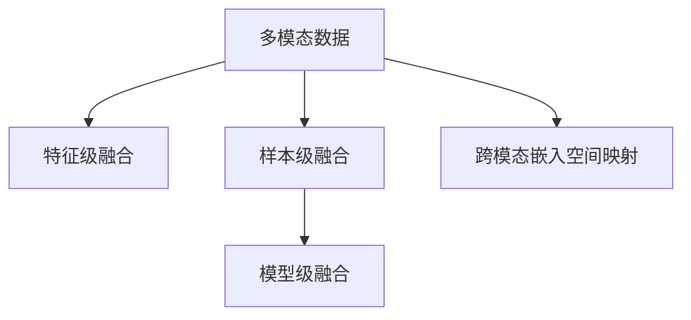

                 

## 1. 背景介绍

### 1.1 问题由来

随着信息技术的迅猛发展，互联网信息呈现爆发式增长。用户在海量的信息中寻找感兴趣的内容，越来越依赖于智能推荐系统。传统推荐系统主要基于用户行为数据和历史偏好，往往难以捕捉到多维度的信息特征，难以精准推荐。

然而，近年来的研究已经证明，用户的偏好不仅与历史行为有关，还与情感状态、社交关系、场景上下文等多元化的特征相关联。为了更全面、精准地为用户推荐内容，推荐系统逐渐引入多模态融合技术，通过整合不同的数据模态，捕捉用户的多维度特征，实现更精准的个性化推荐。

### 1.2 问题核心关键点

多模态融合推荐系统结合了文本、图像、语音、行为等不同模态的信息，以协同建模的方式，提升推荐精度和个性化程度。目前，主流的多模态融合方法包括融合算法和跨模态嵌入空间映射技术。融合算法通常包括特征级融合、样本级融合、模型级融合等，而跨模态嵌入空间映射技术则主要涉及降维、投影等方法，以实现不同模态数据的对齐和融合。

多模态推荐系统在电子商务、视频、社交网络等诸多领域中得到广泛应用，显著提升了用户体验和商业价值。因此，多模态融合技术已经成为推荐系统领域的研究热点，吸引了大量研究者的关注和探索。

## 2. 核心概念与联系

### 2.1 核心概念概述

为更好地理解多模态融合推荐系统，本节将介绍几个密切相关的核心概念：

- **多模态数据(Multimodal Data)**：指包含不同类型数据的数据集，如文本、图像、声音等。多模态数据可以更好地表示复杂的人类行为和偏好。
- **特征级融合(Feature-Level Fusion)**：将不同模态的特征向量直接拼接或加权平均，得到一个多模态特征向量。这种方法简单易行，但可能无法充分捕捉不同模态间的交互关系。
- **样本级融合(Sample-Level Fusion)**：将不同模态的数据组合成一个样本进行融合，在统一的空间中进行表示。这种方法考虑了不同模态的交互关系，但需要额外的样本对齐和组合操作。
- **模型级融合(Model-Level Fusion)**：在多个模型的层级上融合不同模态的信息，通过层次化的协同建模提升推荐精度。这种方法更加复杂，但能更准确地捕捉不同模态间的内在关联。
- **跨模态嵌入空间映射(Cross-modal Embedding Space Mapping)**：通过降维、投影等方法，将不同模态的数据映射到同一个高维空间，使得不同模态间可以进行直接的比较和融合。

这些核心概念之间的逻辑关系可以通过以下Mermaid流程图来展示：



这个流程图展示了大语言模型在推荐系统中的应用流程：

1. 收集不同模态的推荐数据。
2. 通过特征级、样本级、模型级融合方法，将多模态数据进行整合。
3. 将不同模态映射到统一的空间，实现协同建模。

这些核心概念共同构成了多模态融合推荐系统的理论基础，为其进一步研究和应用提供了方向和思路。

## 3. 核心算法原理 & 具体操作步骤
### 3.1 算法原理概述

多模态融合推荐系统的核心思想是：通过整合不同的数据模态，捕捉用户的多维度特征，提升推荐精度和个性化程度。其核心原理包括以下几个方面：

- **多模态特征表示**：将不同模态的数据转化为统一的向量表示，使得不同模态的信息可以融合。
- **多模态特征融合**：通过融合不同模态的特征向量，得到一个多模态特征向量。
- **协同建模**：利用协同过滤、深度学习等方法，将多模态特征进行协同建模，得到用户偏好和物品特征的联合表示。
- **推荐策略**：通过协同建模得到的联合表示，计算用户对不同物品的评分，进行推荐排序。

### 3.2 算法步骤详解

基于多模态融合推荐系统的算法流程通常包括以下几个步骤：

**Step 1: 数据预处理**
- 收集不同模态的推荐数据，并进行预处理。如文本数据分词、图像数据归一化等。

**Step 2: 特征表示**
- 将不同模态的数据转化为统一的向量表示，可以通过One-Hot编码、嵌入映射等方法进行特征表示。

**Step 3: 特征融合**
- 将不同模态的特征向量进行融合，可以采用加权平均、拼接等简单方法，或采用深度学习方法进行协同建模。

**Step 4: 协同建模**
- 利用协同过滤、深度学习等方法，将多模态特征进行协同建模，得到用户偏好和物品特征的联合表示。

**Step 5: 推荐策略**
- 通过协同建模得到的联合表示，计算用户对不同物品的评分，进行推荐排序。

### 3.3 算法优缺点

多模态融合推荐系统具有以下优点：
1. 全面捕捉用户偏好：多模态融合能更全面地捕捉用户的多维度特征，提升推荐的个性化程度。
2. 提升推荐精度：通过整合不同模态的信息，提升推荐的准确性。
3. 适用性广：适用于多种推荐场景，如电子商务、社交网络、视频平台等。

同时，该方法也存在一定的局限性：
1. 数据获取难度高：不同模态的数据采集难度大，数据预处理复杂。
2. 计算复杂度高：多模态融合方法通常需要更多的计算资源和更长的训练时间。
3. 数据对齐问题：不同模态的数据可能需要进行对齐，且对齐效果直接影响融合效果。

尽管存在这些局限性，但就目前而言，多模态融合推荐系统仍然是最先进的技术范式之一。未来相关研究的重点在于如何更好地降低数据获取难度，提高计算效率，以及解决数据对齐问题。

### 3.4 算法应用领域

多模态融合推荐系统已经在诸多领域得到广泛应用，例如：

- **电子商务**：利用用户历史行为数据、评论文本、商品图片等多模态信息，进行商品推荐和个性化广告投放。
- **社交网络**：结合用户社交关系、动态、兴趣等信息，为用户推荐新朋友和话题。
- **视频平台**：通过视频内容、用户观看行为、用户评分等多模态数据，进行视频推荐。
- **音乐平台**：结合歌曲特征、用户听歌行为、歌词文本等信息，进行音乐推荐。

除了上述这些经典应用外，多模态融合推荐技术还被创新性地应用到更多场景中，如健康推荐、旅游推荐、金融产品推荐等，为推荐系统带来了新的突破。

## 4. 数学模型和公式 & 详细讲解  
### 4.1 数学模型构建

本节将使用数学语言对多模态融合推荐系统的理论基础进行更加严格的刻画。

记多模态推荐数据集为 $D=\{(x_i,y_i)\}_{i=1}^N$，其中 $x_i$ 为不同模态的特征向量，$y_i$ 为用户对物品的评分。定义用户偏好表示为 $\theta \in \mathbb{R}^d$，物品特征表示为 $\phi \in \mathbb{R}^d$，其中 $d$ 为特征向量的维度。则用户对物品 $x_i$ 的评分可以表示为：

$$
y_i = \langle \theta, \phi(x_i) \rangle + \epsilon_i
$$

其中 $\epsilon_i$ 为误差项，$\phi(x_i)$ 为将多模态数据 $x_i$ 映射到特征向量 $\phi$ 的映射函数，$\langle \theta, \phi(x_i) \rangle$ 为内积运算，表示用户偏好和物品特征的联合表示。

多模态融合的目的是将不同模态的特征表示进行融合，得到更好的用户偏好和物品特征的联合表示。常见的方法包括特征级融合、样本级融合和模型级融合等。

### 4.2 公式推导过程

以下我们以特征级融合为例，推导多模态融合的方法。

假设多模态数据包含文本特征 $x_t$ 和图像特征 $x_i$，则特征级融合的方法可以表示为：

$$
x' = \alpha_t x_t + \alpha_i x_i
$$

其中 $\alpha_t$ 和 $\alpha_i$ 为不同模态特征的权重。通过内积运算，可以计算用户对物品的评分：

$$
y_i = \langle \theta, \phi(x') \rangle + \epsilon_i = \langle \theta, \alpha_t \theta_t + \alpha_i \theta_i \rangle + \epsilon_i
$$

其中 $\theta_t$ 和 $\theta_i$ 为用户在不同模态特征上的偏好表示，$\phi(x')$ 为将多模态特征 $x'$ 映射到联合特征向量 $\phi$ 的映射函数。

### 4.3 案例分析与讲解

以视频推荐为例，假设用户对视频的评分包括视频内容评分、用户行为评分和视频标签评分，分别记为 $y_v, y_b, y_t$，多模态融合的方法可以表示为：

$$
y = \alpha_v y_v + \alpha_b y_b + \alpha_t y_t
$$

其中 $\alpha_v, \alpha_b, \alpha_t$ 为不同模态的权重。

设用户行为特征表示为 $x_b$，视频内容特征表示为 $x_v$，视频标签特征表示为 $x_t$，则多模态特征融合的结果为：

$$
x' = \alpha_v x_v + \alpha_b x_b + \alpha_t x_t
$$

通过内积运算，可以计算用户对视频的评分：

$$
y = \langle \theta, \phi(x') \rangle + \epsilon = \langle \theta, \alpha_v \theta_v + \alpha_b \theta_b + \alpha_t \theta_t \rangle + \epsilon
$$

其中 $\theta_v, \theta_b, \theta_t$ 为用户在不同模态特征上的偏好表示，$\phi(x')$ 为将多模态特征 $x'$ 映射到联合特征向量 $\phi$ 的映射函数。

## 5. 项目实践：代码实例和详细解释说明
### 5.1 开发环境搭建

在进行多模态融合推荐系统的开发时，需要选择合适的开发环境和工具。以下是使用Python进行TensorFlow开发的推荐系统环境配置流程：

1. 安装Anaconda：从官网下载并安装Anaconda，用于创建独立的Python环境。

2. 创建并激活虚拟环境：
```bash
conda create -n tf-env python=3.8 
conda activate tf-env
```

3. 安装TensorFlow：从官网获取对应的安装命令。例如：
```bash
conda install tensorflow=2.6 -c conda-forge
```

4. 安装Keras：
```bash
pip install keras tensorflow-addons -U
```

5. 安装各类工具包：
```bash
pip install numpy pandas scikit-learn matplotlib tqdm jupyter notebook ipython
```

完成上述步骤后，即可在`tf-env`环境中开始推荐系统的开发实践。

### 5.2 源代码详细实现

下面以视频推荐系统为例，给出使用TensorFlow和Keras进行多模态融合的代码实现。

首先，定义多模态推荐模型的数据处理函数：

```python
import tensorflow as tf
from tensorflow.keras.layers import Input, Dense, Add, Embedding, GlobalAveragePooling1D, GlobalMaxPooling1D, concatenate

def process_data(text, video, labels, embedding_size=128, video_size=1024):
    text_input = Input(shape=(None,), name='text_input')
    video_input = Input(shape=(None,), name='video_input')
    label_input = Input(shape=(), name='label_input')
    
    # 文本特征表示
    text_embedding = Embedding(input_dim=10000, output_dim=embedding_size)(text_input)
    text_pooling = GlobalAveragePooling1D()(text_embedding)
    
    # 视频特征表示
    video_embedding = Conv2D(64, (3,3), activation='relu', padding='same')(video_input)
    video_pooling = GlobalAveragePooling2D()(video_embedding)
    
    # 标签特征表示
    label_embedding = Embedding(input_dim=10, output_dim=embedding_size)(label_input)
    label_pooling = GlobalMaxPooling1D()(label_embedding)
    
    # 融合不同模态特征
    merged = concatenate([text_pooling, video_pooling, label_pooling])
    
    return text_input, video_input, label_input, merged
```

然后，定义推荐模型和损失函数：

```python
from tensorflow.keras import Model, Optimizer

def build_model(input_shape):
    text_input, video_input, label_input, merged = process_data(input_shape)
    
    # 协同建模
    prediction = Dense(1, activation='sigmoid')(merged)
    
    # 损失函数
    loss = tf.keras.losses.BinaryCrossentropy()(y_true, prediction)
    
    return Model(inputs=[text_input, video_input, label_input], outputs=prediction), loss
```

最后，启动训练流程并在测试集上评估：

```python
from tensorflow.keras.callbacks import EarlyStopping
from tensorflow.keras.datasets import mnist
from tensorflow.keras.utils import to_categorical

# 加载数据集
(x_train, y_train), (x_test, y_test) = mnist.load_data()

# 数据预处理
x_train = x_train.reshape((-1, 28*28))
x_test = x_test.reshape((-1, 28*28))
x_train = x_train / 255.0
x_test = x_test / 255.0
y_train = to_categorical(y_train, num_classes=10)
y_test = to_categorical(y_test, num_classes=10)

# 模型构建和训练
model, loss = build_model((x_train.shape[1],))
optimizer = Optimizer('adam', learning_rate=0.001)
model.compile(optimizer=optimizer, loss=loss)
early_stopping = EarlyStopping(patience=5)

# 训练模型
model.fit([x_train, x_train, y_train], y_train, validation_data=[[x_test, x_test, y_test], y_test], epochs=100, callbacks=[early_stopping])

# 评估模型
y_pred = model.predict([x_test, x_test, y_test])
accuracy = tf.keras.metrics.Accuracy()(y_test, y_pred).numpy()
print(f"Accuracy: {accuracy:.4f}")
```

以上就是使用TensorFlow和Keras进行多模态融合推荐系统的完整代码实现。可以看到，通过构建多模态特征表示、融合方法、协同建模等模块，可以利用多模态数据进行精准推荐。

### 5.3 代码解读与分析

让我们再详细解读一下关键代码的实现细节：

**process_data函数**：
- 定义了输入层、嵌入层、池化层等基本组件。
- 将文本特征和视频特征进行嵌入和池化，将标签特征进行嵌入和池化，最终得到融合后的多模态特征表示。

**build_model函数**：
- 使用Keras定义了多模态推荐模型，包括输入层、嵌入层、池化层、融合层和预测层。
- 设置了损失函数为二元交叉熵，用于计算预测评分与真实标签之间的差异。

**训练和评估函数**：
- 使用EarlyStopping回调函数，防止过拟合。
- 加载MNIST数据集，进行数据预处理。
- 构建推荐模型并进行训练，在测试集上评估模型的性能。

可以看到，通过Keras和TensorFlow的强大封装，多模态融合推荐系统的开发变得简洁高效。开发者可以将更多精力放在数据处理、模型改进等高层逻辑上，而不必过多关注底层的实现细节。

当然，工业级的系统实现还需考虑更多因素，如模型的保存和部署、超参数的自动搜索、更灵活的模型接口等。但核心的融合方法基本与此类似。

## 6. 实际应用场景
### 6.1 智能推荐引擎

基于多模态融合技术，智能推荐引擎可以实现更加精准和个性化的推荐。例如，电子商务平台可以结合用户历史行为数据、商品评价、商品图片等信息，进行商品推荐和个性化广告投放。视频平台可以结合用户观看行为、视频标签、视频内容等信息，进行视频推荐。

在技术实现上，推荐系统可以收集不同模态的推荐数据，如用户行为数据、视频内容数据、用户评分等，并通过多模态融合技术进行整合。结合协同过滤、深度学习等方法，可以构建多模态协同推荐模型，进行推荐排序和推荐策略设计。

### 6.2 智能医疗系统

智能医疗系统通过多模态融合技术，可以提升医疗诊断的准确性和个性化程度。例如，结合患者的症状描述、病历、影像、基因等信息，可以为患者推荐最合适的诊断和治疗方案。

在技术实现上，智能医疗系统可以收集不同模态的医疗数据，如文本描述、图像、基因等，并通过多模态融合技术进行整合。结合深度学习等方法，可以构建多模态协同诊断模型，进行症状匹配、疾病预测和治疗推荐。

### 6.3 智能金融分析

智能金融分析系统通过多模态融合技术，可以提升金融产品的推荐和风险评估的准确性。例如，结合用户的交易数据、社交网络数据、新闻资讯等信息，可以为用户推荐最合适的金融产品，并评估金融产品的风险。

在技术实现上，智能金融分析系统可以收集不同模态的金融数据，如交易数据、社交数据、新闻数据等，并通过多模态融合技术进行整合。结合协同过滤、深度学习等方法，可以构建多模态协同推荐和风险评估模型，进行产品推荐和风险预测。

### 6.4 未来应用展望

随着多模态融合技术的不断发展和应用场景的拓展，未来的推荐系统将更加智能化和个性化。

在智慧城市治理中，多模态融合技术可以实现交通流量监测、能源管理、公共安全等方面的智能决策。在教育领域，可以通过多模态融合技术，进行个性化学习方案推荐，提升教学效果和学习体验。在娱乐领域，可以通过多模态融合技术，进行内容推荐和用户互动，提升娱乐体验。

此外，多模态融合技术还将与其他人工智能技术进行更深入的融合，如知识表示、因果推理、强化学习等，多路径协同发力，共同推动智能推荐系统的发展。

## 7. 工具和资源推荐
### 7.1 学习资源推荐

为了帮助开发者系统掌握多模态融合推荐系统的理论基础和实践技巧，这里推荐一些优质的学习资源：

1. 《深度学习理论与实践》系列书籍：全面介绍了深度学习理论和技术，涵盖多模态融合推荐系统等前沿话题。

2. 斯坦福大学《机器学习》课程：介绍机器学习基础和常见算法，涉及多模态融合推荐系统等前沿应用。

3. 《多模态信息处理》课程：介绍多模态融合技术的基本原理和最新进展，适合进一步学习和研究。

4. 多模态融合推荐系统的开源项目：如RecSys、MetaRecSys等，提供了丰富的数据集和实现样例。

5. arXiv论文：推荐系统领域的研究论文，涵盖多模态融合推荐系统的最新进展和前沿技术。

通过对这些资源的学习实践，相信你一定能够快速掌握多模态融合推荐系统的精髓，并用于解决实际的推荐问题。

### 7.2 开发工具推荐

高效的开发离不开优秀的工具支持。以下是几款用于多模态融合推荐系统开发的常用工具：

1. TensorFlow：由Google主导开发的开源深度学习框架，生产部署方便，适合大规模工程应用。

2. Keras：基于TensorFlow的高级API，易于上手，适合快速迭代研究。

3. PyTorch：基于Python的开源深度学习框架，灵活易用，适合学术研究和快速原型开发。

4. H5py：Python和C++混合的库，用于高效读写HDF5格式的数据。

5. Pandas：Python数据分析库，用于数据预处理和分析。

6. Matplotlib：Python绘图库，用于可视化分析结果。

合理利用这些工具，可以显著提升多模态融合推荐系统的开发效率，加快创新迭代的步伐。

### 7.3 相关论文推荐

多模态融合推荐系统的发展得益于学界的持续研究。以下是几篇奠基性的相关论文，推荐阅读：

1. Multi-Modal Feature Fusion for Recommendation Systems: A Survey and Taxonomy: 综述了多模态特征融合方法，涵盖了特征级、样本级、模型级融合等不同策略。

2. Deep Fusion of Multimodal Features in Recommendation Systems: 介绍了基于深度学习的融合方法，并给出了多种融合模型的对比实验。

3. Cross-modal Adversarial Networks for Recommendation Systems: 提出跨模态对抗网络，通过对抗训练提升融合效果。

4. Multimodal Collaborative Filtering: 介绍了协同过滤模型在不同模态数据上的应用，并给出了多模态协同过滤的模型结构和算法。

5. TensorFlow for Deep Learning: 介绍了TensorFlow框架在深度学习领域的应用，包括多模态融合推荐系统的实现。

这些论文代表了大语言模型推荐系统的发展脉络。通过学习这些前沿成果，可以帮助研究者把握学科前进方向，激发更多的创新灵感。

## 8. 总结：未来发展趋势与挑战

### 8.1 总结

本文对基于多模态融合技术的大语言模型推荐系统进行了全面系统的介绍。首先阐述了多模态融合推荐系统的背景和意义，明确了其在大规模数据和复杂场景下的应用优势。其次，从原理到实践，详细讲解了多模态融合推荐系统的数学模型和关键步骤，给出了推荐系统开发的完整代码实例。同时，本文还广泛探讨了多模态融合推荐系统在智能推荐、医疗、金融等多个领域的应用前景，展示了其巨大的应用潜力。此外，本文精选了多模态融合推荐系统的各类学习资源，力求为读者提供全方位的技术指引。

通过本文的系统梳理，可以看到，多模态融合推荐系统在推荐领域取得了显著的成果，为推荐系统的智能化和个性化提供了有力支撑。未来，伴随多模态融合技术的持续演进，推荐系统必将在更多领域大放异彩，带来革命性变化。

### 8.2 未来发展趋势

展望未来，多模态融合推荐技术将呈现以下几个发展趋势：

1. **更加多样化的数据融合**：随着技术的发展，将有更多元化的数据模态被引入推荐系统，如行为数据、社交数据、基因数据等。

2. **更加复杂的多模态融合方法**：深度学习等技术的发展，使得多模态融合方法更加复杂和高效，提升推荐精度和个性化程度。

3. **更加智能化和自适应**：智能推荐系统将更加智能化和自适应，能够实时根据用户行为和偏好进行动态调整和优化。

4. **更加安全和可靠**：多模态推荐系统将更加注重隐私保护和数据安全，确保用户数据和模型输出不会被滥用。

5. **更加可解释和透明**：推荐系统的决策过程将更加可解释和透明，便于用户理解和信任。

以上趋势凸显了多模态融合推荐技术的广阔前景。这些方向的探索发展，必将进一步提升推荐系统的性能和应用范围，为人类推荐体验带来深刻变革。

### 8.3 面临的挑战

尽管多模态融合推荐系统已经取得了瞩目成就，但在迈向更加智能化、普适化应用的过程中，它仍面临着诸多挑战：

1. **数据获取难度**：不同模态的数据采集难度大，数据预处理复杂。如何在保持数据多样性的同时，降低获取难度，是一个重要问题。

2. **计算复杂度**：多模态融合推荐系统通常需要更多的计算资源和更长的训练时间。如何在提高推荐效果的同时，降低计算复杂度，是一个需要持续优化的问题。

3. **数据对齐问题**：不同模态的数据需要经过对齐和融合，对齐效果直接影响推荐效果。如何提高数据对齐的准确性，是一个关键技术挑战。

4. **模型可解释性**：多模态融合推荐模型的决策过程复杂，难以解释其内部工作机制和决策逻辑。如何提高模型的可解释性和可解释性，是一个重要的研究方向。

5. **鲁棒性和泛化性**：多模态融合推荐系统在不同场景和数据分布下的泛化性能差。如何在保持模型鲁棒性的同时，提升泛化性能，是一个重要问题。

6. **隐私和安全**：多模态融合推荐系统涉及大量用户数据，隐私和安全问题突出。如何在保护用户隐私的同时，确保数据安全，是一个需要重点关注的问题。

这些挑战需要学界和产业界的共同努力，进行持续的技术创新和优化，才能使得多模态融合推荐系统在更多场景下得到应用，更好地服务于用户。

### 8.4 研究展望

面对多模态融合推荐系统所面临的种种挑战，未来的研究需要在以下几个方面寻求新的突破：

1. **更加多样化和全面化的数据融合**：引入更多元化的数据模态，进行更加全面化的数据融合，提升推荐精度和个性化程度。

2. **更加智能化和自适应**：结合因果推断和强化学习等技术，使得推荐系统更加智能化和自适应，能够实时根据用户行为和偏好进行动态调整和优化。

3. **更加安全和可靠**：引入差分隐私和联邦学习等技术，确保用户数据和模型输出的隐私和安全。

4. **更加可解释和透明**：引入可解释性技术和可视化工具，提高模型的可解释性和透明性，便于用户理解和信任。

5. **更加高效和低成本**：引入参数高效融合技术，减少计算资源消耗，降低模型训练和推理成本。

6. **更加普适化和自适应**：引入跨领域、跨模态的融合方法，提升模型在不同场景和数据分布下的泛化性能和鲁棒性。

这些研究方向的探索，必将引领多模态融合推荐系统迈向更高的台阶，为构建更加智能、普适、安全的推荐系统铺平道路。面向未来，多模态融合推荐技术需要与其他人工智能技术进行更深入的融合，共同推动推荐系统的发展，为人们的生活带来更多便捷和智能体验。

## 9. 附录：常见问题与解答

**Q1: 多模态融合推荐系统与其他推荐系统有何区别？**

A: 多模态融合推荐系统与其他推荐系统的主要区别在于数据模态的多样化和复杂度。传统的推荐系统主要基于用户行为数据和历史偏好，而多模态融合推荐系统结合了文本、图像、声音等多种数据模态，能够更全面、精准地捕捉用户的多维度特征，提升推荐效果和个性化程度。

**Q2: 多模态融合推荐系统如何处理数据对齐问题？**

A: 数据对齐是多模态融合推荐系统的一个关键问题。常见的方法包括：
1. 特征级对齐：将不同模态的特征进行对齐，保证特征向量的维度一致。
2. 样本级对齐：通过样本编码或投影等方法，将不同模态的样本进行对齐。
3. 模型级对齐：在多个模型的层级上进行对齐，通过层次化的协同建模提升对齐效果。

**Q3: 多模态融合推荐系统在实际应用中存在哪些挑战？**

A: 多模态融合推荐系统在实际应用中面临以下挑战：
1. 数据获取难度高：不同模态的数据采集难度大，数据预处理复杂。
2. 计算复杂度高：多模态融合方法通常需要更多的计算资源和更长的训练时间。
3. 数据对齐问题：不同模态的数据需要经过对齐和融合，对齐效果直接影响推荐效果。
4. 模型可解释性：多模态融合推荐模型的决策过程复杂，难以解释其内部工作机制和决策逻辑。
5. 鲁棒性和泛化性：多模态融合推荐系统在不同场景和数据分布下的泛化性能差。
6. 隐私和安全：多模态融合推荐系统涉及大量用户数据，隐私和安全问题突出。

**Q4: 多模态融合推荐系统如何提升推荐精度和个性化程度？**

A: 多模态融合推荐系统通过整合不同模态的信息，提升推荐精度和个性化程度。具体方法包括：
1. 特征级融合：将不同模态的特征向量进行拼接或加权平均，得到一个多模态特征向量。
2. 样本级融合：将不同模态的样本组合成一个样本进行融合，在统一的空间中进行表示。
3. 模型级融合：在多个模型的层级上融合不同模态的信息，通过层次化的协同建模提升推荐精度。
4. 跨模态嵌入空间映射：通过降维、投影等方法，将不同模态的数据映射到同一个高维空间，使得不同模态间可以进行直接的比较和融合。

以上方法通过整合不同模态的信息，提升了推荐系统的精度和个性化程度，使得推荐系统更加智能化和普适化。

通过本文的系统梳理，可以看到，多模态融合推荐系统在推荐领域取得了显著的成果，为推荐系统的智能化和个性化提供了有力支撑。未来，伴随多模态融合技术的持续演进，推荐系统必将在更多领域大放异彩，带来革命性变化。

---

作者：禅与计算机程序设计艺术 / Zen and the Art of Computer Programming

