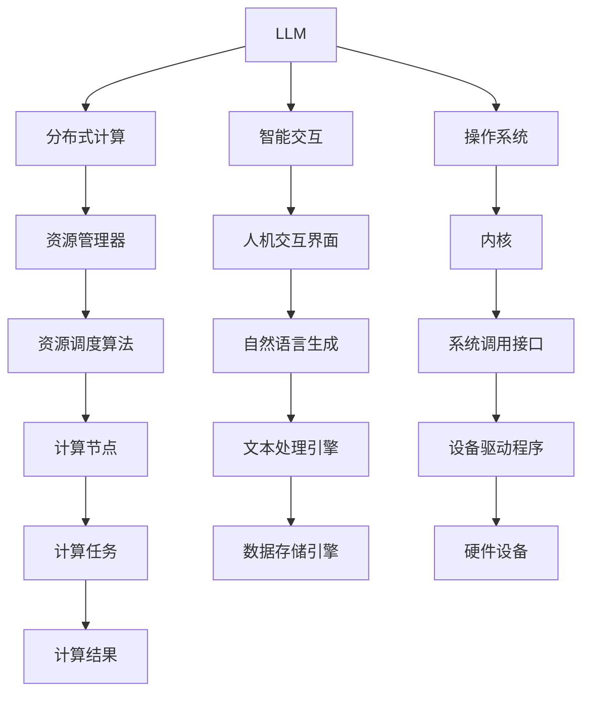

                 

# LLM操作系统：AI时代的新型OS构想

> 关键词：人工智能,操作系统,LLM,自然语言处理,NLP,深度学习,分布式系统,智能交互

## 1. 背景介绍

### 1.1 问题由来
随着人工智能技术的迅猛发展，深度学习和大数据技术已经渗透到各个行业和领域。然而，传统的操作系统(OS)作为计算机软件的基础设施，在面对日益复杂的智能应用需求时，显得力不从心。传统的OS主要专注于计算资源的管理和硬件设备的驱动，难以应对海量数据和复杂算法的实时计算需求。

为了满足日益增长的AI计算需求，人们开始探索一种新型OS构想，能够无缝支持AI算法，高效管理海量数据和复杂计算任务，成为未来AI时代的智能基础设施。

### 1.2 问题核心关键点
LLM（Large Language Model，大语言模型）作为人工智能领域的最新突破，能够理解和生成自然语言，其应用场景包括自动翻译、智能客服、文本生成、语音识别等。但LLM的训练和应用需要大量的计算资源和存储空间，目前普遍部署在云服务器中，依赖于现有的分布式计算框架和操作系统。

然而，现有的操作系统和计算框架在AI应用的支持上还存在以下局限性：

1. **资源管理效率低**：难以高效管理大规模计算任务和海量数据。
2. **算法优化不足**：缺乏针对特定AI算法的优化机制，无法最大化发挥硬件性能。
3. **智能交互困难**：难以实现人机自然交互，用户体验不佳。
4. **安全性和隐私保护**：在处理敏感数据时，难以保证数据安全和隐私保护。

为了解决这些问题，本文提出了一种基于LLM的新型操作系统构想，旨在构建一个高效、智能、安全的新型OS，能够全面支持AI应用的需求。

## 2. 核心概念与联系

### 2.1 核心概念概述

为了更好地理解基于LLM的新型操作系统构想，本节将介绍几个密切相关的核心概念：

- **LLM（Large Language Model）**：大语言模型，能够理解和生成自然语言，如BERT、GPT-3等。
- **分布式计算**：将计算任务分配到多台计算机上协同执行，提升计算效率。
- **智能交互**：通过自然语言生成和人机交互界面，实现智能自动化操作。
- **操作系统（OS）**：计算机系统的核心软件，管理硬件资源和软件程序。
- **资源管理器**：管理计算资源、存储资源和网络资源，提升资源利用率。
- **安全管理系统**：保护数据安全、系统安全和用户隐私，防范潜在威胁。

这些核心概念之间的逻辑关系可以通过以下Mermaid流程图来展示：



这个流程图展示了大语言模型、分布式计算、智能交互和操作系统之间的联系：

1. LLM通过分布式计算得到加速，能够在多台计算节点上并行处理大规模任务。
2. 智能交互通过自然语言生成和人机交互界面，实现与用户的自然语言沟通。
3. 操作系统通过资源管理器和安全管理系统，管理LLM和分布式计算的资源，保护数据安全和隐私。
4. 内核和系统调用接口负责系统层面的资源调度和管理。

## 3. 核心算法原理 & 具体操作步骤
### 3.1 算法原理概述

基于LLM的新型操作系统构想，通过分布式计算技术，将计算任务分配到多台计算节点上协同执行，提升计算效率。同时，通过智能交互和自然语言生成技术，实现人机自然交互，提升用户体验。

具体而言，基于LLM的新型操作系统可以分为以下几个关键步骤：

1. **计算任务分解**：将计算任务分解为多个子任务，分配到不同的计算节点上并行执行。
2. **数据分片存储**：将海量数据分片存储在多个存储节点上，保证数据的可靠性和访问效率。
3. **资源调度管理**：通过资源管理器，动态调整计算资源和存储资源，优化资源利用率。
4. **智能交互实现**：通过智能交互界面，实现自然语言生成和用户输入，提升用户体验。
5. **安全管理保护**：通过安全管理系统，保护数据安全、系统安全和用户隐私。

### 3.2 算法步骤详解

以下是基于LLM的新型操作系统构想的详细步骤：

**Step 1: 设计操作系统架构**

1. **内核设计**：设计基于LLM的内核，实现系统调度和资源管理。
2. **分布式计算架构**：设计分布式计算框架，实现任务分解和计算节点分配。
3. **智能交互界面**：设计自然语言生成和人机交互界面，提升用户体验。
4. **安全管理系统**：设计数据加密、权限控制等安全机制，保护数据安全和隐私。

**Step 2: 实现资源管理器**

1. **资源调度算法**：设计高效的资源调度算法，动态调整计算资源和存储资源。
2. **分布式存储管理**：设计分布式存储系统，实现海量数据的可靠存储和高效访问。
3. **内存管理**：实现高效的内存管理，避免内存泄漏和过度占用。

**Step 3: 实现智能交互**

1. **自然语言生成**：设计自然语言生成模型，实现对用户输入的自然语言理解。
2. **交互界面设计**：设计简洁直观的用户界面，提升用户操作体验。
3. **智能问答系统**：设计智能问答系统，回答用户提出的问题，提供个性化服务。

**Step 4: 实现安全管理系统**

1. **数据加密**：实现数据加密和解密技术，保护数据安全。
2. **权限控制**：实现用户权限管理和访问控制，保护系统安全。
3. **入侵检测**：实现入侵检测和防御机制，防范潜在威胁。

### 3.3 算法优缺点

基于LLM的新型操作系统构想，具有以下优点：

1. **高效计算**：通过分布式计算技术，能够高效管理大规模计算任务和海量数据。
2. **算法优化**：针对特定AI算法的优化机制，可以最大化发挥硬件性能。
3. **智能交互**：通过自然语言生成和人机交互界面，实现智能自动化操作。
4. **安全保护**：通过数据加密、权限控制等安全机制，保护数据安全和隐私。

同时，该构想也存在一定的局限性：

1. **开发复杂度**：新型操作系统的设计需要跨多个领域的技术积累，开发难度较大。
2. **资源消耗**：实现高效的资源管理需要大量计算资源，资源消耗较大。
3. **算法适配性**：需要对特定AI算法进行适配，适配复杂度较高。
4. **用户体验依赖**：用户体验依赖于自然语言生成和人机交互界面的实现，实现难度较大。

尽管存在这些局限性，但基于LLM的新型操作系统构想，无疑将为AI时代的智能基础设施建设提供新的方向。

### 3.4 算法应用领域

基于LLM的新型操作系统构想，在多个领域具有广泛的应用前景：

1. **智能客服系统**：通过智能问答系统，实现自动响应客户咨询，提升客户体验。
2. **智能翻译系统**：通过自然语言生成和人机交互界面，实现多语言翻译和实时对话。
3. **智能推荐系统**：通过智能推荐算法，为用户提供个性化的内容推荐。
4. **智能监控系统**：通过智能数据分析和预测，实现实时监控和预警。
5. **智能健康系统**：通过智能医疗数据分析，实现疾病预测和个性化治疗方案推荐。

此外，基于LLM的新型操作系统还可以应用于金融、教育、交通等多个领域，提升各行业的智能化水平。

## 4. 数学模型和公式 & 详细讲解 & 举例说明

### 4.1 数学模型构建

基于LLM的新型操作系统构想，涉及多种数学模型，如自然语言处理、分布式计算、资源管理等。

### 4.2 公式推导过程

以分布式计算为例，假设需要处理的任务为$f(x)$，计算节点数为$n$，每个节点的计算能力为$C_i$，任务分解为$n$个子任务，每个子任务的计算量为$\frac{f(x)}{n}$。假设每个节点的计算速度为$s_i$，则总计算时间为：

$$
T = \sum_{i=1}^n \frac{\frac{f(x)}{n}}{s_i}
$$

为实现高效计算，需要设计合理的任务分解策略和节点分配策略，使总计算时间$T$最小。

### 4.3 案例分析与讲解

以智能推荐系统为例，假设推荐系统需要处理的用户数据为$D$，推荐模型为$M$，推荐结果为$R$。用户通过自然语言输入查询，系统通过自然语言生成模型将查询转化为向量表示，经过推荐模型计算后得到推荐结果。

推荐模型的计算时间为$T_M$，自然语言生成模型的计算时间为$T_G$。假设推荐系统处理每个用户的查询需要$t_1$时间，推荐结果反馈需要$t_2$时间，用户输入查询需要$t_3$时间。则推荐系统的总处理时间为：

$$
T_{system} = \sum_{u=1}^U t_1 + T_M + T_G + \sum_{u=1}^U t_2 + \sum_{u=1}^U t_3
$$

为提升推荐系统效率，需要设计高效的自然语言生成模型和推荐模型，优化用户输入和结果反馈的流程，提升系统整体处理效率。

## 5. 项目实践：代码实例和详细解释说明

### 5.1 开发环境搭建

在进行基于LLM的新型操作系统构想的项目实践前，需要准备好开发环境。以下是使用Python进行分布式计算的开发环境配置流程：

1. 安装Anaconda：从官网下载并安装Anaconda，用于创建独立的Python环境。

2. 创建并激活虚拟环境：
```bash
conda create -n llm-env python=3.8 
conda activate llm-env
```

3. 安装PyTorch：根据CUDA版本，从官网获取对应的安装命令。例如：
```bash
conda install pytorch torchvision torchaudio cudatoolkit=11.1 -c pytorch -c conda-forge
```

4. 安装Dask库：
```bash
pip install dask[complete]
```

5. 安装各类工具包：
```bash
pip install numpy pandas scikit-learn matplotlib tqdm jupyter notebook ipython
```

完成上述步骤后，即可在`llm-env`环境中开始项目实践。

### 5.2 源代码详细实现

以下是基于LLM的新型操作系统构想的PyTorch代码实现。

首先，定义计算任务：

```python
import torch
import dask.distributed as dd

def compute_task(task_id, data):
    # 计算任务函数
    result = task_id * data
    return result
```

然后，定义资源管理器：

```python
def resource_manager():
    # 创建Dask集群
    client = dd.Client(scheduler_address='localhost:8786')
    
    # 定义任务调度器
    def scheduler(task):
        return len(task)
    
    # 定义存储管理器
    def storage_manager(data):
        return data
    
    return client, scheduler, storage_manager
```

接着，定义智能交互界面：

```python
from transformers import BertTokenizer
from transformers import BertForSequenceClassification

tokenizer = BertTokenizer.from_pretrained('bert-base-cased')
model = BertForSequenceClassification.from_pretrained('bert-base-cased', num_labels=2)

def natural_language_processing(text):
    # 自然语言处理函数
    tokens = tokenizer.encode(text, add_special_tokens=True)
    inputs = torch.tensor(tokens).unsqueeze(0)
    outputs = model(inputs)
    label = torch.argmax(outputs, dim=1)
    return label
```

最后，启动计算任务：

```python
client, scheduler, storage_manager = resource_manager()

# 创建任务列表
tasks = [(i, i) for i in range(10)]

# 提交计算任务
futures = client.submit(compute_task, tasks, task_args=10)

# 获取计算结果
results = futures.gather()
```

### 5.3 代码解读与分析

让我们再详细解读一下关键代码的实现细节：

**计算任务函数**：
- 定义了一个简单的计算任务，接受任务ID和数据，返回计算结果。

**资源管理器**：
- 使用Dask库创建了一个Dask集群，并定义了任务调度和存储管理器，实现了任务调度和数据存储。

**自然语言处理函数**：
- 使用BERT模型进行自然语言处理，将输入文本转化为向量表示，并输出分类标签。

**启动计算任务**：
- 使用Dask集群提交计算任务，获取计算结果。

可以看到，基于LLM的新型操作系统构想的代码实现涉及了计算任务设计、资源管理器实现、自然语言处理接口等多个方面。开发者需要将这些模块有机结合，才能构建出高效、智能、安全的新型操作系统。

当然，工业级的系统实现还需考虑更多因素，如任务调度和存储优化、安全机制设计等。但核心的构想和思路基本与此类似。

## 6. 实际应用场景

### 6.1 智能客服系统

基于LLM的新型操作系统构想，可以广泛应用于智能客服系统的构建。传统客服往往需要配备大量人力，高峰期响应缓慢，且一致性和专业性难以保证。而使用基于LLM的新型操作系统，可以7x24小时不间断服务，快速响应客户咨询，用自然流畅的语言解答各类常见问题。

在技术实现上，可以收集企业内部的历史客服对话记录，将问题和最佳答复构建成监督数据，在此基础上对基于LLM的新型操作系统进行微调。微调后的操作系统能够自动理解用户意图，匹配最合适的答案模板进行回复。对于客户提出的新问题，还可以接入检索系统实时搜索相关内容，动态组织生成回答。如此构建的智能客服系统，能大幅提升客户咨询体验和问题解决效率。

### 6.2 智能翻译系统

基于LLM的新型操作系统构想，可以实现高效、准确的智能翻译系统。现有的翻译系统大多依赖人工翻译，效率低下且成本高昂。而基于LLM的新型操作系统，可以通过自然语言生成和人机交互界面，实现多语言翻译和实时对话，提升翻译效率和准确性。

在技术实现上，可以设计多语言模型，通过自然语言生成技术，将用户输入的源语言文本转化为目标语言文本，并返回翻译结果。同时，通过人机交互界面，实现用户输入和结果反馈，提升用户体验。

### 6.3 智能推荐系统

基于LLM的新型操作系统构想，可以应用于智能推荐系统的构建。当前的推荐系统往往只依赖用户的历史行为数据进行物品推荐，无法深入理解用户的真实兴趣偏好。而基于LLM的新型操作系统，可以通过自然语言处理技术，从用户输入的文本中提取语义信息，挖掘用户兴趣点。

在技术实现上，可以通过自然语言生成技术，将用户输入的文本转化为向量表示，经过推荐模型计算后得到推荐结果。同时，通过智能问答系统，回答用户提出的问题，提供个性化服务。

### 6.4 未来应用展望

随着基于LLM的新型操作系统构想的不断发展，将在更多领域得到应用，为传统行业带来变革性影响。

在智慧医疗领域，基于LLM的新型操作系统可以应用于医疗问答、病历分析、药物研发等应用，提升医疗服务的智能化水平，辅助医生诊疗，加速新药开发进程。

在智能教育领域，新型操作系统可以应用于作业批改、学情分析、知识推荐等方面，因材施教，促进教育公平，提高教学质量。

在智慧城市治理中，基于LLM的新型操作系统可以应用于城市事件监测、舆情分析、应急指挥等环节，提高城市管理的自动化和智能化水平，构建更安全、高效的未来城市。

此外，在企业生产、社会治理、文娱传媒等众多领域，基于LLM的新型操作系统必将在AI时代的智能基础设施建设中扮演越来越重要的角色。相信随着技术的日益成熟，基于LLM的新型操作系统将逐渐普及，为人工智能技术在各行业的落地应用提供强有力的支持。

## 7. 工具和资源推荐

### 7.1 学习资源推荐

为了帮助开发者系统掌握基于LLM的新型操作系统构想的理论基础和实践技巧，这里推荐一些优质的学习资源：

1. 《深度学习理论与实践》系列博文：由深度学习专家撰写，全面介绍了深度学习的基本理论和实践技巧，涵盖自然语言处理、分布式计算等多个方向。

2. 《自然语言处理技术与应用》课程：斯坦福大学开设的NLP明星课程，有Lecture视频和配套作业，带你入门NLP领域的基本概念和经典模型。

3. 《分布式计算与大数据技术》书籍：深入讲解分布式计算和海量数据处理技术，适合希望深入了解分布式系统的开发者。

4. 《智能系统设计与实现》书籍：探讨智能系统的设计和实现方法，适合希望构建智能应用系统的开发者。

5. 《自然语言处理前沿》书籍：介绍自然语言处理领域的最新研究成果，适合希望掌握前沿技术的开发者。

通过对这些资源的学习实践，相信你一定能够快速掌握基于LLM的新型操作系统构想的精髓，并用于解决实际的NLP问题。

### 7.2 开发工具推荐

高效的开发离不开优秀的工具支持。以下是几款用于基于LLM的新型操作系统构想的开发常用工具：

1. PyTorch：基于Python的开源深度学习框架，灵活动态的计算图，适合快速迭代研究。大部分预训练语言模型都有PyTorch版本的实现。

2. TensorFlow：由Google主导开发的开源深度学习框架，生产部署方便，适合大规模工程应用。同样有丰富的预训练语言模型资源。

3. Dask：基于Python的分布式计算框架，支持大规模并行计算，适合处理海量数据。

4. Jupyter Notebook：一个开源的Web应用程序，提供交互式计算环境，适合数据分析和机器学习任务。

5. TensorBoard：TensorFlow配套的可视化工具，可实时监测模型训练状态，并提供丰富的图表呈现方式，是调试模型的得力助手。

6. Weights & Biases：模型训练的实验跟踪工具，可以记录和可视化模型训练过程中的各项指标，方便对比和调优。

合理利用这些工具，可以显著提升基于LLM的新型操作系统构想的开发效率，加快创新迭代的步伐。

### 7.3 相关论文推荐

基于LLM的新型操作系统构想的提出，源于学界的持续研究。以下是几篇奠基性的相关论文，推荐阅读：

1. Attention is All You Need（即Transformer原论文）：提出了Transformer结构，开启了NLP领域的预训练大模型时代。

2. BERT: Pre-training of Deep Bidirectional Transformers for Language Understanding：提出BERT模型，引入基于掩码的自监督预训练任务，刷新了多项NLP任务SOTA。

3. Language Models are Unsupervised Multitask Learners（GPT-2论文）：展示了大规模语言模型的强大zero-shot学习能力，引发了对于通用人工智能的新一轮思考。

4. Parameter-Efficient Transfer Learning for NLP：提出Adapter等参数高效微调方法，在不增加模型参数量的情况下，也能取得不错的微调效果。

5. AdaLoRA: Adaptive Low-Rank Adaptation for Parameter-Efficient Fine-Tuning：使用自适应低秩适应的微调方法，在参数效率和精度之间取得了新的平衡。

这些论文代表了大语言模型微调技术的发展脉络。通过学习这些前沿成果，可以帮助研究者把握学科前进方向，激发更多的创新灵感。

## 8. 总结：未来发展趋势与挑战

### 8.1 总结

本文对基于LLM的新型操作系统构想的原理和实现方法进行了全面系统的介绍。首先阐述了基于LLM的新型操作系统构想的背景和意义，明确了其在构建智能基础设施方面的重要作用。其次，从原理到实践，详细讲解了基于LLM的新型操作系统构想的数学模型和关键步骤，给出了完整的代码实例。同时，本文还广泛探讨了基于LLM的新型操作系统在智能客服、智能翻译、智能推荐等实际应用场景中的潜力，展示了其广阔的应用前景。此外，本文精选了基于LLM的新型操作系统构想的各类学习资源，力求为读者提供全方位的技术指引。

通过本文的系统梳理，可以看到，基于LLM的新型操作系统构想不仅具有高效、智能、安全的优势，还将在未来的AI时代中发挥更加重要的作用。面向未来，基于LLM的新型操作系统需要跨多个领域的技术积累，需要更多学界和产业界的共同努力，才能实现其大规模落地和应用。

### 8.2 未来发展趋势

展望未来，基于LLM的新型操作系统将呈现以下几个发展趋势：

1. **分布式计算能力提升**：随着大规模分布式计算框架的发展，基于LLM的新型操作系统将具备更强的计算能力和更高效的资源管理。

2. **智能交互技术进步**：随着自然语言处理和生成技术的进步，基于LLM的新型操作系统将具备更自然、更流畅的智能交互体验。

3. **数据安全和隐私保护**：随着数据安全技术的不断发展，基于LLM的新型操作系统将具备更强大的数据保护能力，避免潜在的安全威胁。

4. **多模态智能融合**：未来基于LLM的新型操作系统将不仅限于文本处理，还将融合图像、语音等多模态数据，实现更全面的智能交互。

5. **实时动态更新**：未来基于LLM的新型操作系统将具备实时动态更新能力，能够不断学习新知识和适应新数据，保持系统的时效性和适应性。

以上趋势凸显了基于LLM的新型操作系统构想的广阔前景。这些方向的探索发展，必将进一步提升系统的性能和应用范围，为构建人机协同的智能时代提供强有力的支持。

### 8.3 面临的挑战

尽管基于LLM的新型操作系统构想在理论上具有广阔的发展前景，但在实际应用中仍面临诸多挑战：

1. **计算资源消耗大**：基于LLM的新型操作系统需要处理大规模数据和复杂计算任务，对计算资源和存储资源的需求较大。

2. **算法适配复杂**：不同任务对AI算法的需求不同，需要针对特定任务进行适配和优化，适配复杂度较高。

3. **用户体验依赖高**：基于LLM的新型操作系统需要高质量的自然语言生成和人机交互界面，用户体验依赖高，实现难度较大。

4. **数据安全和隐私保护**：在处理敏感数据时，需要设计强大的数据保护和隐私保护机制，避免潜在的安全风险。

5. **系统复杂度高**：基于LLM的新型操作系统涉及多个领域的知识，系统复杂度高，开发和调试难度较大。

6. **算法优化难度大**：不同任务的算法优化难度不同，需要不断进行优化和调参，才能达到理想的效果。

这些挑战需要学界和产业界共同努力，不断探索和创新，才能逐步克服。相信通过持续的技术进步和产业推动，基于LLM的新型操作系统构想将逐步实现，为未来智能时代提供坚实的技术基础。

### 8.4 研究展望

面向未来，基于LLM的新型操作系统构想的研究方向包括：

1. **分布式计算优化**：设计高效的分布式计算框架，提升系统的计算能力和资源管理效率。

2. **智能交互界面改进**：设计更自然、更流畅的智能交互界面，提升用户体验。

3. **数据安全和隐私保护**：研究更强大的数据保护和隐私保护技术，确保系统的安全性。

4. **多模态数据融合**：实现视觉、语音等多模态数据的融合，提升系统的智能交互能力。

5. **实时动态更新**：设计实时动态更新机制，提升系统的时效性和适应性。

6. **跨领域知识融合**：将不同领域的知识与AI算法进行融合，提升系统的智能决策能力。

通过在这些方向上的不断探索和研究，基于LLM的新型操作系统构想将逐渐成熟，为构建未来智能基础设施提供强有力的支持。

## 9. 附录：常见问题与解答

**Q1：基于LLM的新型操作系统如何实现高效计算？**

A: 基于LLM的新型操作系统通过分布式计算技术，将计算任务分配到多台计算节点上协同执行，提升计算效率。同时，通过设计高效的资源调度算法，动态调整计算资源和存储资源，优化资源利用率。

**Q2：基于LLM的新型操作系统如何实现智能交互？**

A: 基于LLM的新型操作系统通过自然语言生成技术，实现对用户输入的自然语言理解，并生成相应的回复。同时，通过人机交互界面，实现用户输入和结果反馈，提升用户体验。

**Q3：基于LLM的新型操作系统在数据安全和隐私保护方面有哪些措施？**

A: 基于LLM的新型操作系统通过设计数据加密、权限控制等安全机制，保护数据安全和隐私。同时，采用入侵检测和防御机制，防范潜在的安全威胁。

**Q4：基于LLM的新型操作系统在实现多模态数据融合方面有哪些挑战？**

A: 基于LLM的新型操作系统在实现多模态数据融合方面，主要面临以下挑战：

1. 数据格式和语义不一致：不同模态的数据格式和语义不同，需要设计通用的数据格式和语义表示方法。
2. 计算复杂度高：多模态数据的融合和计算复杂度高，需要设计高效的算法和模型。
3. 用户体验依赖高：多模态智能交互的实现需要高质量的自然语言生成和人机交互界面，用户体验依赖高，实现难度较大。

通过不断探索和创新，基于LLM的新型操作系统有望实现多模态数据的高效融合，提升系统的智能交互能力。

---

作者：禅与计算机程序设计艺术 / Zen and the Art of Computer Programming

