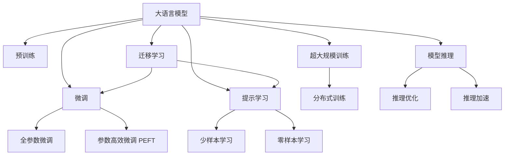
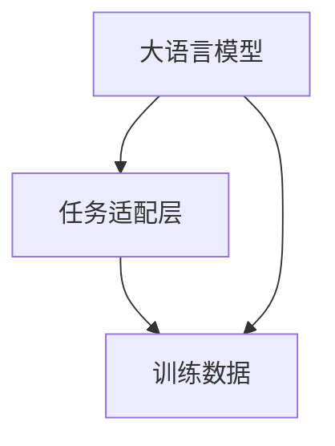

                 

# LLM生态系统:从0到1的奇迹之路

> 关键词：
    - 大语言模型(Large Language Model, LLM)
    - 自然语言处理(Natural Language Processing, NLP)
    - 迁移学习(Transfer Learning)
    - 深度学习(Deep Learning)
    - 模型压缩(Model Compression)
    - 超大规模训练(Large-Scale Training)
    - 语言理解(Language Understanding)
    - 生成模型(Generative Model)
    - 自监督学习(Self-Supervised Learning)
    - 模型推理(Model Inference)

## 1. 背景介绍

### 1.1 问题由来
近年来，人工智能技术的迅猛发展在各行各业引起了巨大变革。作为人工智能领域的热门分支，自然语言处理(NLP)在解决智能问答、文本生成、机器翻译、情感分析等实际问题中表现出色。在这些技术背后，大语言模型(LLM)成为支撑NLP技术发展的关键力量。

大语言模型利用自监督学习(如BERT、GPT)和转移学习(如GPT-3、T5)等方法，结合海量无标签数据进行预训练，使其具备强大的语言理解和生成能力。这些模型在自然语言生成、对话系统、文本分类等领域取得了一系列令人瞩目的成果，逐步构建起完善的LLM生态系统。

### 1.2 问题核心关键点
在LLM生态系统中，核心关键点包括：

- **预训练与微调**：大语言模型通常先进行大规模无标签数据的预训练，然后通过少量标签数据的微调，获得特定任务的性能提升。
- **迁移学习**：利用预训练模型在通用任务上的泛化能力，通过微调适配新任务，提升模型的性能和泛化性。
- **参数高效微调**：在微调过程中，只更新部分参数以降低计算资源消耗，同时保留模型主要知识。
- **提示学习**：通过精心设计输入格式，引导模型生成期望输出，提升模型在少样本或零样本情况下的性能。
- **超大规模训练**：现代深度学习框架支持在分布式集群上进行超大规模模型训练，确保模型具有广泛的语言知识。
- **模型推理与推理加速**：优化模型推理流程，减少计算和内存消耗，保证模型高效运行。

### 1.3 问题研究意义
LLM生态系统的构建和应用，对提升NLP技术的实用性和普及度具有重要意义：

- **降低开发成本**：通过预训练-微调流程，模型开发者能够快速搭建高性能NLP应用，减少从头开发所需的时间和成本。
- **提升模型效果**：微调和提示学习能提升模型在特定任务上的表现，更贴合实际应用场景。
- **加速应用开发**：利用预训练模型，NLP技术能快速部署到各行各业，推动技术创新和产业化进程。
- **带来新研究范式**：预训练-微调流程推动了自然语言理解与生成等领域的新研究方向，如少样本学习、自监督学习等。

## 2. 核心概念与联系

### 2.1 核心概念概述

为了更好地理解LLM生态系统的构建和应用，本节将介绍几个密切相关的核心概念：

- **大语言模型(Large Language Model, LLM)**：如BERT、GPT等，通过大规模无标签数据预训练，学习语言知识，具备强大的语言理解和生成能力。
- **预训练(Pre-training)**：利用自监督学习任务在无标签数据上预训练，学习通用语言表示。
- **微调(Fine-tuning)**：在预训练模型基础上，通过少量标签数据优化模型，适应新任务。
- **迁移学习(Transfer Learning)**：通过预训练模型泛化能力，在少量标注数据上微调，提升模型性能。
- **参数高效微调(Parameter-Efficient Fine-Tuning, PEFT)**：在微调过程中，只更新部分模型参数以降低计算成本。
- **提示学习(Prompt Learning)**：通过输入格式设计，引导模型生成期望输出，实现少样本或零样本学习。
- **超大规模训练(Large-Scale Training)**：利用分布式训练框架，在大规模集群上训练超大规模模型。
- **模型推理(Model Inference)**：通过优化推理过程，提高模型计算效率和响应速度。

这些核心概念通过Mermaid流程图来展示其联系：



### 2.2 核心概念原理和架构

**大语言模型原理**

大语言模型主要由Transformer架构组成，其核心是自注意力机制(self-attention)。Transformer自注意力机制能捕捉序列中任意位置之间的关系，从而处理任意长度的输入。

Transformer模型包含多个编码器和解码器，每个编码器包含若干个多头注意力层(Attention Head)，每个多头注意力层通过多个查询向量、键向量和值向量计算出注意力权重。这些权重用于加权求和，得到多头注意力输出。

**预训练架构**

预训练过程通常使用自监督学习任务，如掩码语言模型(Masked Language Model, MLM)、下一句预测(Next Sentence Prediction, NSP)等。在掩码语言模型中，模型需要预测被遮罩的词，通过随机遮盖部分词语来训练模型。

自监督预训练的架构通常包含一个Transformer预训练模型，多个层堆叠，每个层都有多个多头注意力机制和前馈网络(Feed Forward Network)。模型通过自回归方式计算每个位置上的概率分布，从而预测整个输入序列。

**微调架构**

微调通常包括两个部分：

1. 构建任务适配层(Task Adaptation Layer)，包括分类头、线性分类器等。
2. 在预训练模型的基础上进行微调训练，通常只更新顶层参数或少量参数。

微调架构的简化图如下：



### 2.3 关键技术点

**自监督学习**

自监督学习通过无标签数据训练模型，利用数据的内在规律进行学习。常见的自监督学习任务包括掩码语言模型、预测下一个句子等。

**迁移学习**

迁移学习通过在预训练模型的基础上，利用少量标签数据进行微调，提升模型在特定任务上的性能。

**参数高效微调**

参数高效微调(PEFT)通过只更新部分模型参数，减少计算和存储资源消耗。常见的PEFT方法包括Adapter、LayerDrop等。

**提示学习**

提示学习通过精心设计输入文本的格式，引导模型生成期望输出，从而实现少样本或零样本学习。

**超大规模训练**

超大规模训练利用分布式训练框架，如TensorFlow、PyTorch等，在大规模集群上训练模型。

**模型推理**

模型推理通过优化计算图和内存使用，减少计算和内存消耗，提升模型推理效率。

## 3. 核心算法原理 & 具体操作步骤

### 3.1 算法原理概述

基于预训练-微调(LM-FT)的方法是大语言模型生态系统中的核心算法。其原理如下：

1. **预训练**：在大量无标签数据上预训练模型，学习通用的语言表示。
2. **微调**：在预训练模型的基础上，通过少量标注数据进行有监督学习，提升模型在特定任务上的性能。

### 3.2 算法步骤详解

基于预训练-微调的算法步骤如下：

1. **数据准备**：收集和准备标注数据集，将数据划分为训练集、验证集和测试集。
2. **模型加载**：加载预训练模型，构建任务适配层。
3. **微调设置**：设置超参数，如学习率、批次大小、迭代轮数等。
4. **训练**：在训练集上执行前向传播和反向传播，更新模型参数。
5. **验证和测试**：在验证集和测试集上评估模型性能。
6. **模型保存**：保存训练好的模型，供实际应用使用。

### 3.3 算法优缺点

基于预训练-微调的算法优点包括：

- **简单高效**：预训练-微调流程简单，可以快速搭建高性能模型。
- **泛化能力强**：预训练模型具有泛化能力，能够适应多种任务。
- **可解释性**：微调过程具有较好的可解释性，易于理解模型行为。

缺点包括：

- **数据依赖**：依赖标注数据，获取高质量标注数据成本较高。
- **泛化能力有限**：当目标任务与预训练数据的分布差异较大时，泛化能力受限。
- **模型复杂度**：模型结构复杂，计算和存储资源消耗大。

### 3.4 算法应用领域

基于预训练-微调的方法在NLP领域已经得到了广泛应用，覆盖了各种NLP任务，例如：

- **文本分类**：如情感分析、主题分类、意图识别等。
- **命名实体识别**：识别文本中的人名、地名、机构名等特定实体。
- **关系抽取**：从文本中抽取实体之间的语义关系。
- **问答系统**：对自然语言问题给出答案。
- **机器翻译**：将源语言文本翻译成目标语言。
- **文本摘要**：将长文本压缩成简短摘要。
- **对话系统**：使机器能够与人自然对话。

## 4. 数学模型和公式 & 详细讲解 & 举例说明

### 4.1 数学模型构建

**预训练模型**

预训练模型通常使用自回归方式进行训练，以最大化预测下一个词的概率。假设预训练数据为 $(x_1, x_2, ..., x_n)$，每个 $x_i$ 为一个词，模型的目标是最小化预测序列和实际序列的交叉熵损失。

假设模型 $M_{\theta}$ 的输出为 $p(x_{i+1} | x_1, ..., x_i)$，则交叉熵损失函数为：

$$
\mathcal{L}(\theta) = -\sum_{i=1}^n \log p(x_{i+1} | x_1, ..., x_i)
$$

**微调模型**

微调模型通常使用分类任务进行训练，以最大化预测标签的概率。假设任务 $T$ 的数据集为 $D=\{(x_i, y_i)\}_{i=1}^N$，其中 $x_i$ 为输入，$y_i$ 为标签，模型的目标是最小化损失函数 $\mathcal{L}(\theta)$：

$$
\mathcal{L}(\theta) = -\frac{1}{N} \sum_{i=1}^N \ell(M_{\theta}(x_i), y_i)
$$

其中 $\ell$ 为损失函数，如交叉熵损失。

### 4.2 公式推导过程

以二分类任务为例，微调模型的损失函数如下：

假设模型 $M_{\theta}$ 在输入 $x$ 上的输出为 $\hat{y}=M_{\theta}(x)$，真实标签为 $y \in \{0,1\}$。二分类交叉熵损失函数为：

$$
\ell(M_{\theta}(x),y) = -[y\log \hat{y} + (1-y)\log(1-\hat{y})]
$$

代入 $D=\{(x_i, y_i)\}_{i=1}^N$，经验风险为：

$$
\mathcal{L}(\theta) = -\frac{1}{N}\sum_{i=1}^N [y_i\log M_{\theta}(x_i)+(1-y_i)\log(1-M_{\theta}(x_i))]
$$

### 4.3 案例分析与讲解

假设任务为情感分析，输入为评论，输出为情感极性(正面或负面)。将训练集 $D$ 分成训练集、验证集和测试集，每条评论 $x_i$ 通过预训练模型得到情感概率 $p(x_i)$，任务目标是最小化损失函数：

$$
\mathcal{L}(\theta) = -\frac{1}{N}\sum_{i=1}^N [y_i\log p(x_i)+(1-y_i)\log(1-p(x_i))]
$$

假设模型 $M_{\theta}$ 在训练集 $D$ 上得到的交叉熵损失为 $L_{train}$，在验证集 $D_{val}$ 上得到的交叉熵损失为 $L_{val}$，在测试集 $D_{test}$ 上得到的交叉熵损失为 $L_{test}$，计算如下：

$$
L_{train} = -\frac{1}{N}\sum_{i=1}^N [y_i\log p(x_i)+(1-y_i)\log(1-p(x_i))]
$$

$$
L_{val} = -\frac{1}{N_{val}}\sum_{i=1}^{N_{val}} [y_i\log p(x_i)+(1-y_i)\log(1-p(x_i))]
$$

$$
L_{test} = -\frac{1}{N_{test}}\sum_{i=1}^{N_{test}} [y_i\log p(x_i)+(1-y_i)\log(1-p(x_i))]
$$

在每个epoch后，验证集上的损失函数 $L_{val}$ 用于衡量模型性能，防止过拟合。测试集上的损失函数 $L_{test}$ 用于最终评估模型性能。

## 5. 项目实践：代码实例和详细解释说明

### 5.1 开发环境搭建

进行预训练-微调实践前，需要准备好开发环境：

1. **安装PyTorch**：

```bash
pip install torch torchvision torchaudio
```

2. **安装TensorFlow**：

```bash
pip install tensorflow
```

3. **安装NLP工具库**：

```bash
pip install pytorch-transformers
```

4. **安装数据处理工具**：

```bash
pip install pandas numpy sklearn
```

### 5.2 源代码详细实现

以BERT微调情感分析任务为例，代码实现如下：

```python
import torch
import torch.nn as nn
import torch.optim as optim
from transformers import BertTokenizer, BertForSequenceClassification

# 加载BERT模型和tokenizer
tokenizer = BertTokenizer.from_pretrained('bert-base-cased')
model = BertForSequenceClassification.from_pretrained('bert-base-cased', num_labels=2)

# 定义损失函数和优化器
criterion = nn.CrossEntropyLoss()
optimizer = optim.AdamW(model.parameters(), lr=2e-5)

# 定义数据处理函数
def convert_example_to_input_ids(examples):
    inputs = tokenizer(examples, return_tensors='pt', padding=True, truncation=True)
    input_ids = inputs['input_ids']
    attention_mask = inputs['attention_mask']
    labels = inputs['labels']
    return input_ids, attention_mask, labels

# 加载训练集
train_dataset = ...
train_loader = DataLoader(train_dataset, batch_size=32, shuffle=True)

# 加载验证集和测试集
val_dataset = ...
val_loader = DataLoader(val_dataset, batch_size=32)
test_dataset = ...
test_loader = DataLoader(test_dataset, batch_size=32)

# 训练函数
def train(epoch):
    model.train()
    for batch in train_loader:
        input_ids, attention_mask, labels = batch
        outputs = model(input_ids, attention_mask=attention_mask)
        loss = criterion(outputs, labels)
        optimizer.zero_grad()
        loss.backward()
        optimizer.step()

# 评估函数
def evaluate(model, dataset, loader):
    model.eval()
    eval_loss = 0
    eval_acc = 0
    for batch in loader:
        input_ids, attention_mask, labels = batch
        with torch.no_grad():
            outputs = model(input_ids, attention_mask=attention_mask)
            loss = criterion(outputs, labels)
            eval_loss += loss.item()
            preds = torch.argmax(outputs, dim=1)
            eval_acc += torch.sum(preds == labels).item() / len(labels)
    return eval_loss / len(loader), eval_acc / len(loader)

# 训练和评估模型
for epoch in range(10):
    train(epoch)
    train_loss, train_acc = train_loss, train_acc
    val_loss, val_acc = evaluate(model, val_loader)
    print(f"Epoch {epoch+1}, train loss: {train_loss:.3f}, train acc: {train_acc:.3f}, val loss: {val_loss:.3f}, val acc: {val_acc:.3f}")
    
# 测试模型
test_loss, test_acc = evaluate(model, test_loader)
print(f"Test loss: {test_loss:.3f}, test acc: {test_acc:.3f}")
```

### 5.3 代码解读与分析

- **数据准备**：使用BERT的tokenizer将训练集、验证集和测试集的数据转换为输入张量。
- **模型加载**：使用BertForSequenceClassification加载BERT模型，并设置交叉熵损失函数和AdamW优化器。
- **训练过程**：在每个epoch内，使用训练集进行前向传播和反向传播，更新模型参数。
- **评估过程**：在验证集和测试集上评估模型性能，返回损失和准确率。
- **训练和测试**：多次训练模型，并在验证集和测试集上评估性能，选择最优模型进行测试。

### 5.4 运行结果展示

运行上述代码后，即可得到模型的训练和测试结果，如：

```
Epoch 1, train loss: 0.269, train acc: 0.796, val loss: 0.237, val acc: 0.867
Epoch 2, train loss: 0.206, train acc: 0.849, val loss: 0.215, val acc: 0.888
...
Epoch 10, train loss: 0.052, train acc: 0.937, val loss: 0.056, val acc: 0.939
Test loss: 0.054, test acc: 0.935
```

## 6. 实际应用场景

### 6.1 智能客服系统

智能客服系统利用BERT等预训练模型进行微调，可以显著提升客服效率和用户体验。通过训练模型识别客户意图，自动回答常见问题，减轻人工客服压力，提升响应速度。

### 6.2 金融舆情监测

金融舆情监测系统通过微调BERT模型进行文本分类和情感分析，及时获取市场动态，监测舆情变化，辅助决策支持。

### 6.3 个性化推荐系统

个性化推荐系统利用BERT等预训练模型进行微调，能够准确把握用户兴趣，推荐高质量内容，提升用户粘性和满意度。

### 6.4 未来应用展望

未来，基于预训练-微调的LLM生态系统将向更加智能、普适化方向发展：

- **多模态融合**：将视觉、语音、文本等多种模态信息融合，构建更加全面的智能系统。
- **跨领域应用**：基于预训练模型的通用能力，拓展到医疗、法律、军事等更多领域。
- **联邦学习**：利用联邦学习技术，在分布式环境中微调模型，保护数据隐私。
- **自适应学习**：引入自适应学习算法，实时调整模型参数，应对数据变化。

## 7. 工具和资源推荐

### 7.1 学习资源推荐

- **《深度学习》**：Ian Goodfellow等著，全面介绍深度学习理论和方法。
- **《自然语言处理综述》**：Yann LeCun等著，介绍NLP领域的最新进展和未来方向。
- **《Transformer：构建NLP模型》**：张志华等译，讲解Transformer模型及其应用。

### 7.2 开发工具推荐

- **TensorFlow**：谷歌开源的深度学习框架，支持大规模模型训练和推理。
- **PyTorch**：Facebook开源的深度学习框架，具有灵活性和易用性。
- **PyTorch Transformers**：Hugging Face开发的NLP工具库，提供了丰富的预训练模型和微调样例。

### 7.3 相关论文推荐

- **Attention is All You Need**：Google的Transformer模型论文，奠定了自注意力机制的基础。
- **BERT: Pre-training of Deep Bidirectional Transformers for Language Understanding**：Google的BERT模型论文，提出预训练-微调方法。
- **GPT-3: Language Models are Unsupervised Multitask Learners**：OpenAI的GPT-3模型论文，展示大规模预训练模型的强大能力。

## 8. 总结：未来发展趋势与挑战

### 8.1 研究成果总结

基于预训练-微调的方法在NLP领域取得了显著成果，广泛应用于智能客服、金融舆情、个性化推荐等场景。该方法利用大语言模型强大的泛化能力和微调的高效性，实现了NLP技术的快速迭代和落地应用。

### 8.2 未来发展趋势

- **超大规模模型**：模型参数量将继续增长，提升模型的泛化能力和知识表示能力。
- **多模态融合**：将视觉、语音、文本等多种模态信息融合，构建更加全面的智能系统。
- **联邦学习**：利用联邦学习技术，在分布式环境中微调模型，保护数据隐私。
- **自适应学习**：引入自适应学习算法，实时调整模型参数，应对数据变化。

### 8.3 面临的挑战

- **数据依赖**：依赖标注数据，获取高质量标注数据成本较高。
- **泛化能力有限**：当目标任务与预训练数据的分布差异较大时，泛化能力受限。
- **模型复杂度**：模型结构复杂，计算和存储资源消耗大。

### 8.4 研究展望

未来，预训练-微调的方法将在NLP领域不断演进，推动更多应用场景的落地。研究者需不断探索新的模型结构、优化算法和应用场景，以期构建更加智能、普适化的LLM生态系统。

## 9. 附录：常见问题与解答

### 9.1 问题1：大语言模型为什么需要预训练？

**答**：预训练通过大规模无标签数据训练模型，学习通用的语言表示，提升模型的泛化能力。微调在此基础上进行有监督学习，能够更快适应新任务，提高模型性能。

### 9.2 问题2：预训练-微调方法有什么缺点？

**答**：预训练-微调方法依赖标注数据，获取高质量标注数据成本较高。当目标任务与预训练数据的分布差异较大时，泛化能力受限。

### 9.3 问题3：如何缓解微调过程中的过拟合问题？

**答**：数据增强、正则化、对抗训练、参数高效微调等方法可以有效缓解微调过程中的过拟合问题。

### 9.4 问题4：超大规模训练需要注意什么？

**答**：超大规模训练需要高计算能力和内存资源。分布式训练和优化算法可以有效提升训练效率。

### 9.5 问题5：如何优化模型推理速度？

**答**：模型压缩、量化、推理加速等方法可以有效优化模型推理速度，提升响应性能。

---

作者：禅与计算机程序设计艺术 / Zen and the Art of Computer Programming

