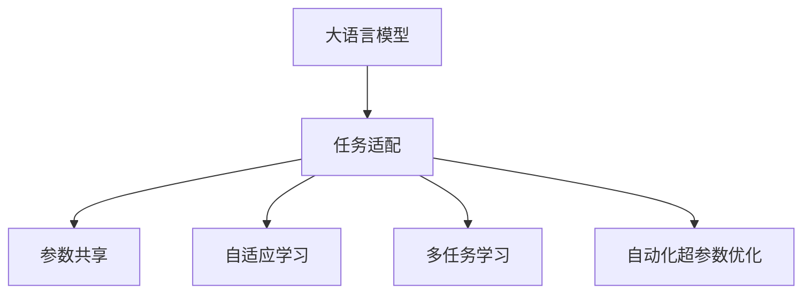

                 

# LLM的任务规划：AI智能的核心机制

> 关键词：

1. **大语言模型（LLM）**
2. **任务规划**
3. **自然语言处理（NLP）**
4. **深度学习**
5. **强化学习**
6. **超参数优化**
7. **跨领域迁移**

## 1. 背景介绍

### 1.1 问题由来
随着人工智能技术的发展，大语言模型（LLM）在自然语言处理（NLP）领域取得了显著进展。这些模型如GPT-3、BERT等，通过在大规模无标签文本上进行预训练，学习到了丰富的语言知识和常识，具备了强大的语言理解和生成能力。然而，要使LLM在特定任务上表现优异，仅凭预训练是不够的。任务规划作为一种重要的机制，通过合理设计模型在特定任务上的结构和行为，使得LLM能够高效、准确地执行各种复杂的任务。

### 1.2 问题核心关键点
任务规划在大语言模型中的应用，主要体现在以下几个方面：

1. **任务适配**：为特定任务设计合适的模型结构，包括输入输出格式、损失函数、优化算法等。
2. **参数共享**：在任务适配的基础上，合理分配参数，避免冗余和过拟合。
3. **自适应学习**：通过动态调整模型参数，提高模型对新任务的适应性。
4. **多任务学习**：在多个相关任务上进行微调，提升模型泛化能力。
5. **自动化超参数优化**：通过自动化工具和算法，优化模型的超参数，如学习率、批大小等，提高模型性能。

这些关键点构成了任务规划的核心内容，使得大语言模型能够在特定任务上取得最佳性能。

## 2. 核心概念与联系

### 2.1 核心概念概述

为更好地理解任务规划在大语言模型中的应用，本节将介绍几个密切相关的核心概念：

- **大语言模型（LLM）**：以自回归（如GPT）或自编码（如BERT）模型为代表的大规模预训练语言模型。通过在大规模无标签文本语料上进行预训练，学习通用的语言表示，具备强大的语言理解和生成能力。

- **任务适配**：根据特定任务的需求，对预训练模型进行结构适配，包括输入输出格式、损失函数、优化算法等。

- **参数共享**：在任务适配的基础上，合理分配参数，避免冗余和过拟合。

- **自适应学习**：通过动态调整模型参数，提高模型对新任务的适应性。

- **多任务学习**：在多个相关任务上进行微调，提升模型泛化能力。

- **自动化超参数优化**：通过自动化工具和算法，优化模型的超参数，如学习率、批大小等，提高模型性能。

这些核心概念之间的逻辑关系可以通过以下Mermaid流程图来展示：



这个流程图展示了大语言模型的核心概念及其之间的关系：

1. 大语言模型通过预训练获得基础能力。
2. 任务适配和参数共享使得模型在特定任务上具备更好的性能。
3. 自适应学习使得模型能够动态适应新任务。
4. 多任务学习提升模型的泛化能力。
5. 自动化超参数优化进一步提升模型性能。

这些概念共同构成了大语言模型的学习和应用框架，使其能够在各种场景下发挥强大的语言理解和生成能力。通过理解这些核心概念，我们可以更好地把握大语言模型的工作原理和优化方向。

## 3. 核心算法原理 & 具体操作步骤
### 3.1 算法原理概述

任务规划在大语言模型中的应用，本质上是一个任务适配、参数共享和自适应学习的过程。其核心思想是：通过合理设计模型结构和行为，使其能够高效、准确地执行特定任务。

形式化地，假设预训练模型为 $M_{\theta}$，其中 $\theta$ 为预训练得到的模型参数。给定一个特定任务 $T$，任务适配的目标是找到新的模型参数 $\hat{\theta}$，使得 $M_{\hat{\theta}}$ 在任务 $T$ 上的性能最大化。

任务适配的方法包括但不限于：

- 调整输入输出格式
- 设计合适的损失函数
- 选择合适的优化算法
- 确定参数共享策略

自适应学习则是通过动态调整模型参数，使其能够适应新任务的输入和输出分布。常见的自适应学习算法包括：

- 梯度下降法
- 随机梯度下降法
- 自适应梯度算法（如Adagrad、Adam等）

多任务学习则是在多个相关任务上进行微调，提升模型泛化能力。例如，在机器翻译和文本摘要等任务上，通过共享预训练模型的某些层，减少参数冗余，提高模型性能。

### 3.2 算法步骤详解

大语言模型的任务规划一般包括以下几个关键步骤：

**Step 1: 准备预训练模型和数据集**
- 选择合适的预训练语言模型 $M_{\theta}$ 作为初始化参数，如 BERT、GPT 等。
- 准备目标任务 $T$ 的标注数据集 $D=\{(x_i, y_i)\}_{i=1}^N$，划分为训练集、验证集和测试集。

**Step 2: 任务适配**
- 根据任务类型，设计合适的输出层和损失函数。
- 对于分类任务，通常在顶层添加线性分类器和交叉熵损失函数。
- 对于生成任务，通常使用语言模型的解码器输出概率分布，并以负对数似然为损失函数。

**Step 3: 参数共享和分配**
- 根据任务需求，决定参数共享策略。
- 保留预训练模型的部分层，只微调顶层。
- 设计合理的参数分配方案，避免冗余和过拟合。

**Step 4: 自适应学习**
- 选择合适的优化算法及其参数，如 AdamW、SGD 等，设置学习率、批大小、迭代轮数等。
- 设置正则化技术及强度，包括权重衰减、Dropout、Early Stopping等。
- 应用动态调整策略，如学习率衰减、批大小调整等。

**Step 5: 多任务学习**
- 选择与目标任务相关的其他任务，设计多任务微调框架。
- 共享预训练模型的某些层，减少参数冗余。
- 在不同任务上进行微调，提升模型泛化能力。

**Step 6: 自动化超参数优化**
- 使用自动化工具和算法，如Bayesian Optimization、Grid Search等，优化模型的超参数。
- 设计合适的超参数搜索空间，确定最优超参数组合。
- 实时监测模型性能，调整超参数以优化模型。

以上是任务规划在大语言模型上的基本流程。在实际应用中，还需要针对具体任务的特点，对任务适配、参数共享、自适应学习等环节进行优化设计，以进一步提升模型性能。

### 3.3 算法优缺点

任务规划在大语言模型中的应用具有以下优点：

1. **高效性**：通过任务适配和参数共享，可以显著减少微调所需的参数量和计算资源，提升模型训练和推理的效率。
2. **泛化能力**：多任务学习提升了模型的泛化能力，使其能够在多个相关任务上表现优异。
3. **稳定性**：自适应学习使得模型能够动态适应新任务，减少过拟合风险。
4. **可扩展性**：自动化超参数优化使得模型能够灵活应对不同规模和复杂度的任务。

同时，任务规划也存在一些局限性：

1. **依赖任务设计**：任务适配和参数共享依赖于任务的复杂度和需求，设计难度较大。
2. **模型复杂性**：复杂的任务适配和自适应学习增加了模型的复杂性，可能导致过拟合。
3. **资源消耗**：尽管参数共享和自适应学习提高了效率，但任务适配和多任务学习可能带来一定的计算开销。
4. **超参数调整复杂**：自动化超参数优化需要选择合适的优化算法和搜索策略，需要一定的技术积累。

尽管存在这些局限性，但就目前而言，任务规划仍是优化大语言模型性能的重要手段。未来相关研究的重点在于如何进一步简化任务适配过程，提高模型的自适应能力和泛化能力，同时兼顾模型的复杂度和计算效率。

### 3.4 算法应用领域

大语言模型任务规划的应用领域非常广泛，主要体现在以下几个方面：

- **自然语言处理（NLP）**：任务规划在NLP领域得到了广泛应用，如文本分类、命名实体识别、关系抽取、问答系统、机器翻译、文本摘要、对话系统等。
- **智能推荐系统**：任务规划在推荐系统中的应用，如用户行为预测、物品推荐、个性化推荐等，提升了推荐系统的精准度和个性化程度。
- **医疗健康**：任务规划在医疗健康领域的应用，如病历分析、诊断支持、知识图谱构建等，提升了医疗服务的智能化水平。
- **金融分析**：任务规划在金融领域的应用，如情感分析、舆情监测、风险预测等，提升了金融分析和决策的准确性和及时性。
- **法律咨询**：任务规划在法律领域的应用，如合同生成、法规分析、法律咨询等，提升了法律服务的智能化和效率。

除了上述这些经典应用外，任务规划还被创新性地应用到更多场景中，如情感分析、知识图谱构建、多模态信息融合等，为人工智能技术的发展提供了新的方向。随着预训练模型和任务规划方法的持续演进，相信人工智能技术将在更多领域得到广泛应用，深刻影响人类的生产生活方式。

## 4. 数学模型和公式 & 详细讲解  
### 4.1 数学模型构建

本节将使用数学语言对大语言模型任务规划过程进行更加严格的刻画。

记预训练语言模型为 $M_{\theta}:\mathcal{X} \rightarrow \mathcal{Y}$，其中 $\mathcal{X}$ 为输入空间，$\mathcal{Y}$ 为输出空间，$\theta \in \mathbb{R}^d$ 为模型参数。假设目标任务 $T$ 的训练集为 $D=\{(x_i,y_i)\}_{i=1}^N, x_i \in \mathcal{X}, y_i \in \mathcal{Y}$。

定义模型 $M_{\theta}$ 在输入 $x$ 上的损失函数为 $\ell(M_{\theta}(x),y)$，则在数据集 $D$ 上的经验风险为：

$$
\mathcal{L}(\theta) = \frac{1}{N} \sum_{i=1}^N \ell(M_{\theta}(x_i),y_i)
$$

任务适配的目标是设计新的模型参数 $\hat{\theta}$，使得 $M_{\hat{\theta}}$ 在任务 $T$ 上的损失最小化：

$$
\hat{\theta} = \mathop{\arg\min}_{\theta} \mathcal{L}(\theta)
$$

在实践中，我们通常使用基于梯度的优化算法（如SGD、Adam等）来近似求解上述最优化问题。设 $\eta$ 为学习率，$\lambda$ 为正则化系数，则参数的更新公式为：

$$
\theta \leftarrow \theta - \eta \nabla_{\theta}\mathcal{L}(\theta) - \eta\lambda\theta
$$

其中 $\nabla_{\theta}\mathcal{L}(\theta)$ 为损失函数对参数 $\theta$ 的梯度，可通过反向传播算法高效计算。

### 4.2 公式推导过程

以下我们以二分类任务为例，推导交叉熵损失函数及其梯度的计算公式。

假设模型 $M_{\theta}$ 在输入 $x$ 上的输出为 $\hat{y}=M_{\theta}(x) \in [0,1]$，表示样本属于正类的概率。真实标签 $y \in \{0,1\}$。则二分类交叉熵损失函数定义为：

$$
\ell(M_{\theta}(x),y) = -[y\log \hat{y} + (1-y)\log (1-\hat{y})]
$$

将其代入经验风险公式，得：

$$
\mathcal{L}(\theta) = -\frac{1}{N}\sum_{i=1}^N [y_i\log M_{\theta}(x_i)+(1-y_i)\log(1-M_{\theta}(x_i))]
$$

根据链式法则，损失函数对参数 $\theta_k$ 的梯度为：

$$
\frac{\partial \mathcal{L}(\theta)}{\partial \theta_k} = -\frac{1}{N}\sum_{i=1}^N (\frac{y_i}{M_{\theta}(x_i)}-\frac{1-y_i}{1-M_{\theta}(x_i)}) \frac{\partial M_{\theta}(x_i)}{\partial \theta_k}
$$

其中 $\frac{\partial M_{\theta}(x_i)}{\partial \theta_k}$ 可进一步递归展开，利用自动微分技术完成计算。

在得到损失函数的梯度后，即可带入参数更新公式，完成模型的迭代优化。重复上述过程直至收敛，最终得到适应目标任务的最优模型参数 $\theta^*$。

## 5. 项目实践：代码实例和详细解释说明
### 5.1 开发环境搭建

在进行任务规划实践前，我们需要准备好开发环境。以下是使用Python进行PyTorch开发的环境配置流程：

1. 安装Anaconda：从官网下载并安装Anaconda，用于创建独立的Python环境。

2. 创建并激活虚拟环境：
```bash
conda create -n pytorch-env python=3.8 
conda activate pytorch-env
```

3. 安装PyTorch：根据CUDA版本，从官网获取对应的安装命令。例如：
```bash
conda install pytorch torchvision torchaudio cudatoolkit=11.1 -c pytorch -c conda-forge
```

4. 安装Transformers库：
```bash
pip install transformers
```

5. 安装各类工具包：
```bash
pip install numpy pandas scikit-learn matplotlib tqdm jupyter notebook ipython
```

完成上述步骤后，即可在`pytorch-env`环境中开始任务规划实践。

### 5.2 源代码详细实现

下面我们以二分类任务为例，给出使用Transformers库对BERT模型进行任务规划的PyTorch代码实现。

首先，定义任务适配函数：

```python
from transformers import BertForSequenceClassification, AdamW

def task_adaptation(task_name, model, optimizer):
    if task_name == 'binary_classification':
        model = BertForSequenceClassification.from_pretrained(model, num_labels=2)
        criterion = torch.nn.BCEWithLogitsLoss()
    elif task_name == 'multi_class_classification':
        model = BertForSequenceClassification.from_pretrained(model, num_labels=3)
        criterion = torch.nn.CrossEntropyLoss()
    # 其他任务的适配代码
    # ...
    
    return model, optimizer, criterion
```

然后，定义训练和评估函数：

```python
from torch.utils.data import DataLoader
from tqdm import tqdm
from sklearn.metrics import accuracy_score

device = torch.device('cuda') if torch.cuda.is_available() else torch.device('cpu')
model, optimizer, criterion = task_adaptation('binary_classification', 'bert-base-cased', AdamW(model.parameters(), lr=2e-5))

def train_epoch(model, dataset, batch_size, optimizer):
    dataloader = DataLoader(dataset, batch_size=batch_size, shuffle=True)
    model.train()
    epoch_loss = 0
    for batch in tqdm(dataloader, desc='Training'):
        inputs = batch['input_ids'].to(device)
        attention_mask = batch['attention_mask'].to(device)
        labels = batch['labels'].to(device)
        model.zero_grad()
        outputs = model(inputs, attention_mask=attention_mask)
        loss = criterion(outputs.logits, labels)
        epoch_loss += loss.item()
        loss.backward()
        optimizer.step()
    return epoch_loss / len(dataloader)

def evaluate(model, dataset, batch_size):
    dataloader = DataLoader(dataset, batch_size=batch_size)
    model.eval()
    preds, labels = [], []
    with torch.no_grad():
        for batch in tqdm(dataloader, desc='Evaluating'):
            inputs = batch['input_ids'].to(device)
            attention_mask = batch['attention_mask'].to(device)
            labels = batch['labels'].to(device)
            outputs = model(inputs, attention_mask=attention_mask)
            batch_preds = outputs.logits.argmax(dim=1).to('cpu').tolist()
            batch_labels = labels.to('cpu').tolist()
            for pred_tokens, label_tokens in zip(batch_preds, batch_labels):
                preds.append(pred_tokens)
                labels.append(label_tokens)
                
    return accuracy_score(labels, preds)
```

最后，启动训练流程并在测试集上评估：

```python
epochs = 5
batch_size = 16

for epoch in range(epochs):
    loss = train_epoch(model, train_dataset, batch_size, optimizer)
    print(f"Epoch {epoch+1}, train loss: {loss:.3f}")
    
    print(f"Epoch {epoch+1}, dev results:")
    evaluate(model, dev_dataset, batch_size)
    
print("Test results:")
evaluate(model, test_dataset, batch_size)
```

以上就是使用PyTorch对BERT进行二分类任务的任务规划的完整代码实现。可以看到，得益于Transformers库的强大封装，我们可以用相对简洁的代码完成BERT模型的适配和微调。

### 5.3 代码解读与分析

让我们再详细解读一下关键代码的实现细节：

**task_adaptation函数**：
- 定义了适配函数，根据任务类型选择合适的输出层和损失函数，并返回适配后的模型、优化器和损失函数。

**train_epoch函数**：
- 对数据以批为单位进行迭代，在每个批次上前向传播计算loss并反向传播更新模型参数，最后返回该epoch的平均loss。

**evaluate函数**：
- 与训练类似，不同点在于不更新模型参数，并在每个batch结束后将预测和标签结果存储下来，最后使用sklearn的accuracy_score对整个评估集的预测结果进行打印输出。

**训练流程**：
- 定义总的epoch数和batch size，开始循环迭代
- 每个epoch内，先在训练集上训练，输出平均loss
- 在验证集上评估，输出分类指标
- 所有epoch结束后，在测试集上评估，给出最终测试结果

可以看到，PyTorch配合Transformers库使得BERT任务规划的代码实现变得简洁高效。开发者可以将更多精力放在数据处理、模型改进等高层逻辑上，而不必过多关注底层的实现细节。

当然，工业级的系统实现还需考虑更多因素，如模型的保存和部署、超参数的自动搜索、更灵活的任务适配层等。但核心的任务规划范式基本与此类似。

## 6. 实际应用场景
### 6.1 智能客服系统

基于大语言模型任务规划的对话技术，可以广泛应用于智能客服系统的构建。传统客服往往需要配备大量人力，高峰期响应缓慢，且一致性和专业性难以保证。而使用任务规划后的对话模型，可以7x24小时不间断服务，快速响应客户咨询，用自然流畅的语言解答各类常见问题。

在技术实现上，可以收集企业内部的历史客服对话记录，将问题和最佳答复构建成监督数据，在此基础上对预训练对话模型进行任务规划。任务规划后的对话模型能够自动理解用户意图，匹配最合适的答案模板进行回复。对于客户提出的新问题，还可以接入检索系统实时搜索相关内容，动态组织生成回答。如此构建的智能客服系统，能大幅提升客户咨询体验和问题解决效率。

### 6.2 金融舆情监测

金融机构需要实时监测市场舆论动向，以便及时应对负面信息传播，规避金融风险。传统的人工监测方式成本高、效率低，难以应对网络时代海量信息爆发的挑战。基于大语言模型任务规划的文本分类和情感分析技术，为金融舆情监测提供了新的解决方案。

具体而言，可以收集金融领域相关的新闻、报道、评论等文本数据，并对其进行主题标注和情感标注。在此基础上对预训练语言模型进行任务规划，使其能够自动判断文本属于何种主题，情感倾向是正面、中性还是负面。将任务规划后的模型应用到实时抓取的网络文本数据，就能够自动监测不同主题下的情感变化趋势，一旦发现负面信息激增等异常情况，系统便会自动预警，帮助金融机构快速应对潜在风险。

### 6.3 个性化推荐系统

当前的推荐系统往往只依赖用户的历史行为数据进行物品推荐，无法深入理解用户的真实兴趣偏好。基于大语言模型任务规划的个性化推荐系统可以更好地挖掘用户行为背后的语义信息，从而提供更精准、多样的推荐内容。

在实践中，可以收集用户浏览、点击、评论、分享等行为数据，提取和用户交互的物品标题、描述、标签等文本内容。将文本内容作为模型输入，用户的后续行为（如是否点击、购买等）作为监督信号，在此基础上对预训练语言模型进行任务规划。任务规划后的模型能够从文本内容中准确把握用户的兴趣点。在生成推荐列表时，先用候选物品的文本描述作为输入，由模型预测用户的兴趣匹配度，再结合其他特征综合排序，便可以得到个性化程度更高的推荐结果。

### 6.4 未来应用展望

随着大语言模型任务规划技术的发展，基于任务规划的大语言模型将逐渐成为NLP领域的标准范式，广泛应用于各类任务中。

在智慧医疗领域，基于任务规划的医疗问答、病历分析、药物研发等应用将提升医疗服务的智能化水平，辅助医生诊疗，加速新药开发进程。

在智能教育领域，任务规划技术可应用于作业批改、学情分析、知识推荐等方面，因材施教，促进教育公平，提高教学质量。

在智慧城市治理中，任务规划模型可应用于城市事件监测、舆情分析、应急指挥等环节，提高城市管理的自动化和智能化水平，构建更安全、高效的未来城市。

此外，在企业生产、社会治理、文娱传媒等众多领域，基于大语言模型任务规划的人工智能应用也将不断涌现，为NLP技术带来全新的突破。随着预训练模型和任务规划方法的不断进步，相信NLP技术将在更广阔的应用领域大放异彩，深刻影响人类的生产生活方式。

## 7. 工具和资源推荐
### 7.1 学习资源推荐

为了帮助开发者系统掌握大语言模型任务规划的理论基础和实践技巧，这里推荐一些优质的学习资源：

1. 《Transformer从原理到实践》系列博文：由大模型技术专家撰写，深入浅出地介绍了Transformer原理、BERT模型、任务规划技术等前沿话题。

2. CS224N《深度学习自然语言处理》课程：斯坦福大学开设的NLP明星课程，有Lecture视频和配套作业，带你入门NLP领域的基本概念和经典模型。

3. 《Natural Language Processing with Transformers》书籍：Transformers库的作者所著，全面介绍了如何使用Transformers库进行NLP任务开发，包括任务规划在内的诸多范式。

4. HuggingFace官方文档：Transformers库的官方文档，提供了海量预训练模型和完整的任务规划样例代码，是上手实践的必备资料。

5. CLUE开源项目：中文语言理解测评基准，涵盖大量不同类型的中文NLP数据集，并提供了基于任务规划的baseline模型，助力中文NLP技术发展。

通过对这些资源的学习实践，相信你一定能够快速掌握大语言模型任务规划的精髓，并用于解决实际的NLP问题。
###  7.2 开发工具推荐

高效的开发离不开优秀的工具支持。以下是几款用于大语言模型任务规划开发的常用工具：

1. PyTorch：基于Python的开源深度学习框架，灵活动态的计算图，适合快速迭代研究。大部分预训练语言模型都有PyTorch版本的实现。

2. TensorFlow：由Google主导开发的开源深度学习框架，生产部署方便，适合大规模工程应用。同样有丰富的预训练语言模型资源。

3. Transformers库：HuggingFace开发的NLP工具库，集成了众多SOTA语言模型，支持PyTorch和TensorFlow，是进行任务规划任务开发的利器。

4. Weights & Biases：模型训练的实验跟踪工具，可以记录和可视化模型训练过程中的各项指标，方便对比和调优。与主流深度学习框架无缝集成。

5. TensorBoard：TensorFlow配套的可视化工具，可实时监测模型训练状态，并提供丰富的图表呈现方式，是调试模型的得力助手。

6. Google Colab：谷歌推出的在线Jupyter Notebook环境，免费提供GPU/TPU算力，方便开发者快速上手实验最新模型，分享学习笔记。

合理利用这些工具，可以显著提升大语言模型任务规划的开发效率，加快创新迭代的步伐。

### 7.3 相关论文推荐

大语言模型任务规划的发展源于学界的持续研究。以下是几篇奠基性的相关论文，推荐阅读：

1. Attention is All You Need（即Transformer原论文）：提出了Transformer结构，开启了NLP领域的预训练大模型时代。

2. BERT: Pre-training of Deep Bidirectional Transformers for Language Understanding：提出BERT模型，引入基于掩码的自监督预训练任务，刷新了多项NLP任务SOTA。

3. Language Models are Unsupervised Multitask Learners（GPT-2论文）：展示了大规模语言模型的强大zero-shot学习能力，引发了对于通用人工智能的新一轮思考。

4. Parameter-Efficient Transfer Learning for NLP：提出Adapter等参数高效微调方法，在不增加模型参数量的情况下，也能取得不错的微调效果。

5. Prefix-Tuning: Optimizing Continuous Prompts for Generation：引入基于连续型Prompt的任务规划范式，为如何充分利用预训练知识提供了新的思路。

6. AdaLoRA: Adaptive Low-Rank Adaptation for Parameter-Efficient Fine-Tuning：使用自适应低秩适应的任务规划方法，在参数效率和精度之间取得了新的平衡。

这些论文代表了大语言模型任务规划的发展脉络。通过学习这些前沿成果，可以帮助研究者把握学科前进方向，激发更多的创新灵感。

## 8. 总结：未来发展趋势与挑战

### 8.1 总结

本文对基于任务规划的大语言模型进行了全面系统的介绍。首先阐述了大语言模型和任务规划的研究背景和意义，明确了任务规划在提升大语言模型性能方面的独特价值。其次，从原理到实践，详细讲解了任务规划的数学原理和关键步骤，给出了任务规划任务开发的完整代码实例。同时，本文还广泛探讨了任务规划方法在智能客服、金融舆情、个性化推荐等多个行业领域的应用前景，展示了任务规划范式的巨大潜力。此外，本文精选了任务规划技术的各类学习资源，力求为读者提供全方位的技术指引。

通过本文的系统梳理，可以看到，基于大语言模型的任务规划方法正在成为NLP领域的重要范式，极大地拓展了预训练语言模型的应用边界，催生了更多的落地场景。得益于大规模语料的预训练和任务规划的巧妙设计，任务规划模型以更低的时间和标注成本，在小样本条件下也能取得理想的效果，有力推动了NLP技术的产业化进程。未来，伴随预训练语言模型和任务规划方法的持续演进，相信NLP技术将在更广阔的应用领域大放异彩，深刻影响人类的生产生活方式。

### 8.2 未来发展趋势

展望未来，大语言模型任务规划技术将呈现以下几个发展趋势：

1. **模型规模持续增大**：随着算力成本的下降和数据规模的扩张，预训练语言模型的参数量还将持续增长。超大规模语言模型蕴含的丰富语言知识，有望支撑更加复杂多变的任务规划。

2. **任务规划方法多样化**：除了传统的任务适配和参数共享外，未来会涌现更多参数高效的任务规划方法，如Prefix-Tuning、LoRA等，在节省计算资源的同时也能保证任务规划精度。

3. **自适应学习成为常态**：随着数据分布的不断变化，任务规划模型也需要持续学习新知识以保持性能。如何在不遗忘原有知识的同时，高效吸收新样本信息，将成为重要的研究课题。

4. **标注样本需求降低**：受启发于提示学习(Prompt-based Learning)的思路，未来的任务规划方法将更好地利用大模型的语言理解能力，通过更加巧妙的任务描述，在更少的标注样本上也能实现理想的任务规划效果。

5. **多模态任务规划崛起**：当前的任务规划主要聚焦于纯文本数据，未来会进一步拓展到图像、视频、语音等多模态数据任务规划。多模态信息的融合，将显著提升语言模型对现实世界的理解和建模能力。

6. **模型通用性增强**：经过海量数据的预训练和多领域任务的任务规划，未来的语言模型将具备更强大的常识推理和跨领域迁移能力，逐步迈向通用人工智能(AGI)的目标。

以上趋势凸显了大语言模型任务规划技术的广阔前景。这些方向的探索发展，必将进一步提升NLP系统的性能和应用范围，为人类认知智能的进化带来深远影响。

### 8.3 面临的挑战

尽管大语言模型任务规划技术已经取得了瞩目成就，但在迈向更加智能化、普适化应用的过程中，它仍面临着诸多挑战：

1. **标注成本瓶颈**：尽管任务规划方法在一定程度上减少了对标注数据的依赖，但对于长尾应用场景，难以获得充足的高质量标注数据，成为制约任务规划性能的瓶颈。如何进一步降低任务规划对标注样本的依赖，将是一大难题。

2. **模型鲁棒性不足**：当前任务规划模型面对域外数据时，泛化性能往往大打折扣。对于测试样本的微小扰动，任务规划模型的预测也容易发生波动。如何提高任务规划模型的鲁棒性，避免灾难性遗忘，还需要更多理论和实践的积累。

3. **推理效率有待提高**：大规模语言模型虽然精度高，但在实际部署时往往面临推理速度慢、内存占用大等效率问题。如何在保证性能的同时，简化模型结构，提升推理速度，优化资源占用，将是重要的优化方向。

4. **可解释性亟需加强**：当前任务规划模型更像是"黑盒"系统，难以解释其内部工作机制和决策逻辑。对于医疗、金融等高风险应用，算法的可解释性和可审计性尤为重要。如何赋予任务规划模型更强的可解释性，将是亟待攻克的难题。

5. **安全性有待保障**：预训练语言模型难免会学习到有偏见、有害的信息，通过任务规划传递到下游任务，产生误导性、歧视性的输出，给实际应用带来安全隐患。如何从数据和算法层面消除模型偏见，避免恶意用途，确保输出的安全性，也将是重要的研究课题。

6. **知识整合能力不足**：现有的任务规划模型往往局限于任务内数据，难以灵活吸收和运用更广泛的先验知识。如何让任务规划过程更好地与外部知识库、规则库等专家知识结合，形成更加全面、准确的信息整合能力，还有很大的想象空间。

正视任务规划面临的这些挑战，积极应对并寻求突破，将是大语言模型任务规划走向成熟的必由之路。相信随着学界和产业界的共同努力，这些挑战终将一一被克服，大语言模型任务规划必将在构建人机协同的智能时代中扮演越来越重要的角色。

### 8.4 未来突破

面对大语言模型任务规划所面临的种种挑战，未来的研究需要在以下几个方面寻求新的突破：

1. **探索无监督和半监督任务规划方法**：摆脱对大规模标注数据的依赖，利用自监督学习、主动学习等无监督和半监督范式，最大限度利用非结构化数据，实现更加灵活高效的任务规划。

2. **研究参数高效和计算高效的规划范式**：开发更加参数高效的任务规划方法，在固定大部分预训练参数的同时，只更新极少量的任务相关参数。同时优化任务规划模型的计算图，减少前向传播和反向传播的资源消耗，实现更加轻量级、实时性的部署。

3. **融合因果和对比学习范式**：通过引入因果推断和对比学习思想，增强任务规划模型建立稳定因果关系的能力，学习更加普适、鲁棒的语言表征，从而提升模型泛化性和抗干扰能力。

4. **引入更多先验知识**：将符号化的先验知识，如知识图谱、逻辑规则等，与神经网络模型进行巧妙融合，引导任务规划过程学习更准确、合理的语言模型。同时加强不同模态数据的整合，实现视觉、语音等多模态信息与文本信息的协同建模。

5. **结合因果分析和博弈论工具**：将因果分析方法引入任务规划模型，识别出模型决策的关键特征，增强输出解释的因果性和逻辑性。借助博弈论工具刻画人机交互过程，主动探索并规避模型的脆弱点，提高系统稳定性。

6. **纳入伦理道德约束**：在模型训练目标中引入伦理导向的评估指标，过滤和惩罚有偏见、有害的输出倾向。同时加强人工干预和审核，建立模型行为的监管机制，确保输出符合人类价值观和伦理道德。

这些研究方向的探索，必将引领大语言模型任务规划技术迈向更高的台阶，为构建安全、可靠、可解释、可控的智能系统铺平道路。面向未来，大语言模型任务规划技术还需要与其他人工智能技术进行更深入的融合，如知识表示、因果推理、强化学习等，多路径协同发力，共同推动自然语言理解和智能交互系统的进步。只有勇于创新、敢于突破，才能不断拓展语言模型的边界，让智能技术更好地造福人类社会。

## 9. 附录：常见问题与解答

**Q1：大语言模型任务规划是否适用于所有NLP任务？**

A: 大语言模型任务规划在大多数NLP任务上都能取得不错的效果，特别是对于数据量较小的任务。但对于一些特定领域的任务，如医学、法律等，仅仅依靠通用语料预训练的模型可能难以很好地适应。此时需要在特定领域语料上进一步预训练，再进行任务规划，才能获得理想效果。此外，对于一些需要时效性、个性化很强的任务，如对话、推荐等，任务规划方法也需要针对性的改进优化。

**Q2：任务规划过程中如何选择合适的学习率？**

A: 任务规划的学习率一般要比预训练时小1-2个数量级，如果使用过大的学习率，容易破坏预训练权重，导致过拟合。一般建议从1e-5开始调参，逐步减小学习率，直至收敛。也可以使用warmup策略，在开始阶段使用较小的学习率，再逐渐过渡到预设值。需要注意的是，不同的优化器(如AdamW、Adafactor等)以及不同的学习率调度策略，可能需要设置不同的学习率阈值。

**Q3：采用大模型任务规划时会面临哪些资源瓶颈？**

A: 目前主流的预训练大模型动辄以亿计的参数规模，对算力、内存、存储都提出了很高的要求。GPU/TPU等高性能设备是必不可少的，但即便如此，超大批次的训练和推理也可能遇到显存不足的问题。因此需要采用一些资源优化技术，如梯度积累、混合精度训练、模型并行等，来突破硬件瓶颈。同时，模型的存储和读取也可能占用大量时间和空间，需要采用模型压缩、稀疏化存储等方法进行优化。

**Q4：如何缓解任务规划过程中的过拟合问题？**

A: 过拟合是任务规划面临的主要挑战，尤其是在标注数据不足的情况下。常见的缓解策略包括：
1. 数据增强：通过回译、近义替换等方式扩充训练集
2. 正则化：使用L2正则、Dropout、Early Stopping等避免过拟合
3. 对抗训练：引入对抗样本，提高模型鲁棒性
4. 参数高效任务规划：只调整少量参数(如Adapter、Prefix等)，减小过拟合风险
5. 多任务学习：在不同任务上进行微调，提升模型泛化能力

这些策略往往需要根据具体任务和数据特点进行灵活组合。只有在数据、模型、训练、推理等各环节进行全面优化，才能最大限度地发挥大语言模型任务规划的威力。

**Q5：任务规划模型在落地部署时需要注意哪些问题？**

A: 将任务规划模型转化为实际应用，还需要考虑以下因素：
1. 模型裁剪：去除不必要的层和参数，减小模型尺寸，加快推理速度
2. 量化加速：将浮点模型转为定点模型，压缩存储空间，提高计算效率
3. 服务化封装：将模型封装为标准化服务接口，便于集成调用
4. 弹性伸缩：根据请求流量动态调整资源配置，平衡服务质量和成本
5. 监控告警：实时采集系统指标，设置异常告警阈值，确保服务稳定性
6. 安全防护：采用访问鉴权、数据脱敏等措施，保障数据和模型安全

大语言模型任务规划为NLP应用开启了广阔的想象空间，但如何将强大的性能转化为稳定、高效、安全的业务价值，还需要工程实践的不断打磨。唯有从数据、算法、工程、业务等多个维度协同发力，才能真正实现人工智能技术在垂直行业的规模化落地。总之，任务规划需要开发者根据具体任务，不断迭代和优化模型、数据和算法，方能得到理想的效果。

---

作者：禅与计算机程序设计艺术 / Zen and the Art of Computer Programming

