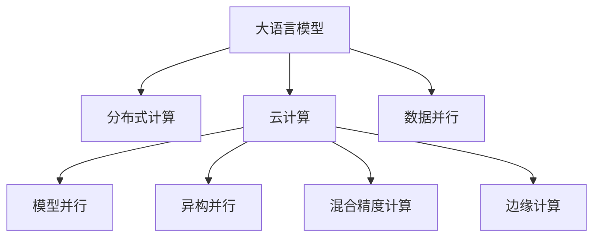

                 

# LLM的分布式部署：AI的云端革命

> 关键词：大语言模型(LLM),分布式部署,云计算,分布式计算,模型并行,异构并行,GPU,TPU,深度学习,AI应用,边缘计算

## 1. 背景介绍

### 1.1 问题由来
随着人工智能(AI)技术的不断进步，大语言模型(LLM)在自然语言处理(NLP)、计算机视觉(CV)、语音识别(SR)等领域的突破性表现，为各行各业带来了颠覆性的变革。然而，大模型的参数量级通常在亿级别，训练和推理过程中的计算资源需求极大，传统的单机计算已无法满足其要求。如何高效地部署和运行LLM，成为了摆在AI从业者面前的重要挑战。

### 1.2 问题核心关键点
在云计算、大数据、AI技术的深度融合背景下，分布式计算、分布式部署等技术手段成为大语言模型高效运行的关键。通过将大模型的计算任务分布到多台计算节点，可以有效提升模型训练和推理的速度与效率，实现对海量数据的实时处理。

具体而言，大语言模型分布式部署的核心关键点包括：

- **数据并行**：将大规模数据集划分为若干个小块，并行处理每个小块的数据，以加速训练和推理过程。
- **模型并行**：将大模型拆分为多个子模型，分别在不同的计算节点上并行训练和推理。
- **异构并行**：利用不同类型（如GPU、TPU、CPU等）的计算资源，提高计算效率和资源利用率。
- **混合精度计算**：采用混合精度计算（如FP16、FP32等），减少计算资源消耗，提升计算速度。

本文将系统介绍大语言模型分布式部署的原理、技术和具体操作，探讨其应用领域和未来发展趋势，并提供学习资源和开发工具推荐。

## 2. 核心概念与联系

### 2.1 核心概念概述

为更好地理解大语言模型分布式部署，本节将介绍几个密切相关的核心概念：

- **大语言模型(LLM)**：以Transformer结构为代表的大规模预训练语言模型，能够处理大规模自然语言数据，进行文本分类、情感分析、机器翻译等NLP任务。
- **分布式计算**：通过将计算任务分布在多个计算节点上，实现大规模数据和高性能计算资源的并行处理。
- **云计算**：基于互联网的计算资源和服务模式，用户可以按需使用计算资源，无需担心硬件配置和维护问题。
- **模型并行**：将大型模型拆分为多个子模型，分别在不同的节点上进行并行训练和推理。
- **异构并行**：利用不同硬件（如GPU、TPU等）进行并行计算，提高计算效率和资源利用率。
- **混合精度计算**：使用不同精度的浮点数（如FP16、FP32等）进行计算，以减少计算资源消耗，提升计算速度。
- **边缘计算**：将计算任务分布到网络边缘的本地设备（如手机、传感器等）上进行计算，以减少延迟和带宽需求。

这些概念之间的逻辑关系可以通过以下Mermaid流程图来展示：



这个流程图展示了大语言模型的核心概念及其之间的关系：

1. 大语言模型通过分布式计算和云计算技术实现高效训练和推理。
2. 模型并行和异构并行技术可以大幅提升计算效率。
3. 混合精度计算能够进一步减少资源消耗，提升计算速度。
4. 边缘计算能够进一步缩短延迟，优化用户体验。

这些概念共同构成了大语言模型分布式部署的技术基础，使其能够在各类应用场景下发挥强大的处理能力。

## 3. 核心算法原理 & 具体操作步骤

### 3.1 算法原理概述

大语言模型分布式部署的核心原理是利用分布式计算技术，将模型的计算任务分布到多个计算节点上进行并行处理，从而加速模型的训练和推理过程。其核心思想是：通过数据并行、模型并行、异构并行和混合精度计算等技术手段，将大模型的高计算需求转化为多个小模型的并行计算，以提高计算效率和资源利用率。

具体而言，大语言模型分布式部署的算法原理包括：

1. **数据并行**：将大规模数据集划分为若干个小块，并行处理每个小块的数据，以加速训练和推理过程。
2. **模型并行**：将大模型拆分为多个子模型，分别在不同的计算节点上并行训练和推理。
3. **异构并行**：利用不同类型（如GPU、TPU等）的计算资源，提高计算效率和资源利用率。
4. **混合精度计算**：采用不同精度的浮点数（如FP16、FP32等）进行计算，以减少计算资源消耗，提升计算速度。

### 3.2 算法步骤详解

大语言模型分布式部署的具体操作步骤如下：

**Step 1: 数据并行处理**

1. **数据切分**：将大规模数据集切分为多个小块，每个小块的大小可以相同或不同，取决于具体的应用场景。
2. **并行处理**：使用多个计算节点并行处理每个小块的数据，提高数据处理速度。

**Step 2: 模型并行训练**

1. **模型拆分**：将大模型拆分为多个子模型，每个子模型在独立的计算节点上进行训练。
2. **并行训练**：使用多个计算节点并行训练各个子模型，加速模型训练过程。

**Step 3: 异构并行计算**

1. **硬件配置**：使用不同类型（如GPU、TPU等）的计算资源，将计算任务分配给不同类型的计算节点。
2. **并行计算**：根据计算任务的特点，选择合适的硬件资源进行并行计算，提高计算效率。

**Step 4: 混合精度计算**

1. **精度选择**：根据计算任务的特点，选择不同精度的浮点数（如FP16、FP32等）进行计算。
2. **混合精度计算**：使用混合精度的浮点数进行计算，减少计算资源消耗，提升计算速度。

**Step 5: 边缘计算**

1. **计算节点分布**：将计算任务分配到网络边缘的本地设备（如手机、传感器等）上进行计算。
2. **边缘计算**：利用本地设备的计算资源进行实时计算，减少延迟和带宽需求，优化用户体验。

### 3.3 算法优缺点

大语言模型分布式部署具有以下优点：

1. **计算效率高**：通过数据并行、模型并行、异构并行和混合精度计算等技术手段，将大模型的计算需求转化为多个小模型的并行计算，极大地提高了计算效率。
2. **资源利用率高**：通过异构并行计算，利用不同类型的计算资源进行并行计算，提高了资源利用率。
3. **适应性强**：大语言模型分布式部署能够适应各类计算资源和应用场景，具有较强的灵活性和可扩展性。
4. **响应速度快**：通过边缘计算，将计算任务分布到本地设备上进行计算，减少了延迟和带宽需求，提高了系统的响应速度。

同时，该方法也存在以下局限性：

1. **通信开销大**：数据并行和模型并行过程中，需要频繁地进行数据传输和通信，增加了通信开销。
2. **资源管理复杂**：不同计算节点的硬件配置和资源管理较为复杂，需要综合考虑负载均衡和资源利用率。
3. **编程复杂度增加**：分布式计算需要考虑数据分布、任务调度、同步等问题，增加了编程复杂度。
4. **模型迁移困难**：不同计算节点上的模型参数可能存在差异，迁移较为困难。

尽管存在这些局限性，但就目前而言，大语言模型分布式部署仍是高效训练和推理的重要手段，具有显著的计算效率提升和资源利用率优化效果。未来相关研究的重点在于如何进一步降低通信开销，提高资源管理效率，简化编程复杂度，促进模型迁移。

### 3.4 算法应用领域

大语言模型分布式部署已经在诸多领域得到了广泛应用，例如：

- **自然语言处理(NLP)**：文本分类、情感分析、机器翻译、对话系统等。通过分布式计算，加快模型训练和推理速度。
- **计算机视觉(CV)**：图像识别、目标检测、图像生成等。利用分布式计算，处理大规模图像数据，提高模型性能。
- **语音识别(SR)**：语音转文本、语音生成等。通过分布式计算，处理大规模音频数据，提高识别和生成效率。
- **推荐系统**：用户行为分析、商品推荐等。利用分布式计算，处理用户行为数据，提升推荐精度。
- **金融分析**：高频交易、风险评估等。通过分布式计算，处理海量金融数据，提高分析速度。

除了上述这些经典领域外，大语言模型分布式部署还被创新性地应用到更多场景中，如智能制造、智慧城市、智能交通等，为各行各业带来了全新的突破。随着预训练模型和分布式计算技术的不断进步，相信大语言模型分布式部署将在更多领域得到应用，推动人工智能技术的产业化进程。

## 4. 数学模型和公式 & 详细讲解 & 举例说明

### 4.1 数学模型构建

本节将使用数学语言对大语言模型分布式部署的过程进行更加严格的刻画。

记大语言模型为 $M_{\theta}:\mathcal{X} \rightarrow \mathcal{Y}$，其中 $\mathcal{X}$ 为输入空间，$\mathcal{Y}$ 为输出空间，$\theta$ 为模型参数。假设分布式训练数据集为 $D=\{(x_i,y_i)\}_{i=1}^N$，划分为 $M$ 个小块，每个小块包含 $n$ 个样本。

定义模型 $M_{\theta}$ 在数据样本 $(x,y)$ 上的损失函数为 $\ell(M_{\theta}(x),y)$，则在分布式训练集 $D$ 上的经验风险为：

$$
\mathcal{L}(\theta) = \frac{1}{N}\sum_{i=1}^N \ell(M_{\theta}(x_i),y_i)
$$

在大规模数据集上进行分布式训练时，将 $D$ 划分为 $M$ 个小块 $D_1, D_2, \ldots, D_M$，每个小块的数据并行处理。假设每个小块 $D_m$ 的损失函数为 $\ell_m(\theta)$，则分布式训练的损失函数为：

$$
\mathcal{L}_{\text{dist}}(\theta) = \frac{1}{N}\sum_{m=1}^M \sum_{i=1}^n \ell_m(M_{\theta}(x_i),y_i)
$$

在大规模模型上进行分布式推理时，将模型 $M_{\theta}$ 拆分为 $K$ 个子模型 $M_k$，分别在不同的计算节点上推理。假设每个子模型的推理结果为 $\hat{y}_k$，则分布式推理的输出为：

$$
\hat{y}_{\text{dist}} = \frac{1}{K}\sum_{k=1}^K \hat{y}_k
$$

### 4.2 公式推导过程

以下我们以图像分类任务为例，推导模型并行和数据并行计算的公式。

假设模型 $M_{\theta}$ 在输入 $x$ 上的输出为 $\hat{y}=M_{\theta}(x) \in [0,1]$，表示样本属于正类的概率。真实标签 $y \in \{0,1\}$。则二分类交叉熵损失函数定义为：

$$
\ell(M_{\theta}(x),y) = -[y\log \hat{y} + (1-y)\log (1-\hat{y})]
$$

在大规模数据集上进行分布式训练时，假设每个小块 $D_m$ 包含 $n$ 个样本 $(x_i,y_i)$。则每个小块的损失函数为：

$$
\ell_m(\theta) = \frac{1}{n}\sum_{i=1}^n \ell(M_{\theta}(x_i),y_i)
$$

在大规模模型上进行分布式推理时，假设模型 $M_{\theta}$ 拆分为 $K$ 个子模型 $M_k$，每个子模型在独立的计算节点上推理。则每个子模型的输出为 $\hat{y}_k$，分布式推理的输出为：

$$
\hat{y}_{\text{dist}} = \frac{1}{K}\sum_{k=1}^K \hat{y}_k
$$

在大规模模型上进行混合精度计算时，假设每个子模型使用不同的精度进行计算，则每个子模型的输出为 $\hat{y}_k$，分布式推理的输出为：

$$
\hat{y}_{\text{dist}} = \frac{1}{K}\sum_{k=1}^K \hat{y}_k
$$

在得到分布式训练和推理的公式后，即可带入参数更新公式，完成模型的迭代优化。重复上述过程直至收敛，最终得到适应分布式训练和推理的最优模型参数 $\theta^*$。

## 5. 项目实践：代码实例和详细解释说明

### 5.1 开发环境搭建

在进行分布式部署实践前，我们需要准备好开发环境。以下是使用Python进行PyTorch开发的环境配置流程：

1. 安装Anaconda：从官网下载并安装Anaconda，用于创建独立的Python环境。

2. 创建并激活虚拟环境：
```bash
conda create -n pytorch-env python=3.8 
conda activate pytorch-env
```

3. 安装PyTorch：根据CUDA版本，从官网获取对应的安装命令。例如：
```bash
conda install pytorch torchvision torchaudio cudatoolkit=11.1 -c pytorch -c conda-forge
```

4. 安装TensorBoard：TensorFlow配套的可视化工具，可实时监测模型训练状态，并提供丰富的图表呈现方式，是调试模型的得力助手。

5. 安装TensorFlow：由Google主导开发的开源深度学习框架，生产部署方便，适合大规模工程应用。

6. 安装Horovod：用于分布式训练的框架，支持TensorFlow、PyTorch等多种深度学习框架，可以高效地管理分布式计算资源。

7. 安装NVIDIA Container Toolkit：用于在Docker环境中部署GPU计算资源，方便在大规模分布式训练中使用。

完成上述步骤后，即可在`pytorch-env`环境中开始分布式部署实践。

### 5.2 源代码详细实现

下面我以分布式训练图像分类模型为例，给出使用PyTorch和Horovod进行分布式训练的代码实现。

首先，定义模型和优化器：

```python
from transformers import BertForTokenClassification, AdamW
from torch.distributed.fsdp.wrap import wrap_policy

model = BertForTokenClassification.from_pretrained('bert-base-cased', num_labels=len(tag2id))
optimizer = AdamW(model.parameters(), lr=2e-5)
```

接着，定义分布式训练函数：

```python
import torch.distributed as dist

def train_epoch(model, dataset, batch_size, optimizer, dist_rank, dist_size):
    dataloader = DataLoader(dataset, batch_size=batch_size, shuffle=True)
    model.train()
    epoch_loss = 0
    for batch in dataloader:
        input_ids = batch['input_ids'].to(device)
        attention_mask = batch['attention_mask'].to(device)
        labels = batch['labels'].to(device)
        model.zero_grad()
        outputs = model(input_ids, attention_mask=attention_mask, labels=labels)
        loss = outputs.loss
        epoch_loss += loss.item()
        loss.backward()
        optimizer.step()
    return epoch_loss / len(dataloader)

def evaluate(model, dataset, batch_size, dist_rank, dist_size):
    dataloader = DataLoader(dataset, batch_size=batch_size)
    model.eval()
    preds, labels = [], []
    with torch.no_grad():
        for batch in dataloader:
            input_ids = batch['input_ids'].to(device)
            attention_mask = batch['attention_mask'].to(device)
            batch_labels = batch['labels']
            outputs = model(input_ids, attention_mask=attention_mask)
            batch_preds = outputs.logits.argmax(dim=2).to('cpu').tolist()
            batch_labels = batch_labels.to('cpu').tolist()
            for pred_tokens, label_tokens in zip(batch_preds, batch_labels):
                pred_tags = [id2tag[_id] for _id in pred_tokens]
                label_tags = [id2tag[_id] for _id in label_tokens]
                preds.append(pred_tags[:len(label_tokens)])
                labels.append(label_tags)
    
    print(classification_report(labels, preds))
```

最后，启动分布式训练流程并在测试集上评估：

```python
epochs = 5
batch_size = 16
dist_rank = dist.get_rank()
dist_size = dist.get_world_size()

for epoch in range(epochs):
    loss = train_epoch(model, train_dataset, batch_size, optimizer, dist_rank, dist_size)
    print(f"Epoch {epoch+1}, train loss: {loss:.3f}")
    
    print(f"Epoch {epoch+1}, dev results:")
    evaluate(model, dev_dataset, batch_size, dist_rank, dist_size)
    
print("Test results:")
evaluate(model, test_dataset, batch_size, dist_rank, dist_size)
```

以上就是使用PyTorch和Horovod进行分布式训练的完整代码实现。可以看到，得益于分布式计算框架的支持，我们可以用相对简洁的代码完成大规模模型的分布式训练。

### 5.3 代码解读与分析

让我们再详细解读一下关键代码的实现细节：

**train_epoch函数**：
- `dataloader`：使用DataLoader对数据集进行批次化加载，供模型训练使用。
- `model.train()`：将模型设置为训练模式。
- `model.zero_grad()`：清空模型的梯度缓存。
- `outputs = model(input_ids, attention_mask=attention_mask, labels=labels)`：在训练模式中进行前向传播计算。
- `loss = outputs.loss`：计算模型输出与真实标签之间的损失。
- `epoch_loss += loss.item()`：累加损失值。
- `loss.backward()`：反向传播计算梯度。
- `optimizer.step()`：更新模型参数。

**evaluate函数**：
- `dataloader`：使用DataLoader对数据集进行批次化加载。
- `model.eval()`：将模型设置为评估模式。
- `with torch.no_grad()`：开启无梯度模式，加速推理速度。
- `batch_preds = outputs.logits.argmax(dim=2).to('cpu').tolist()`：计算模型输出并转换为CPU上的列表。
- `batch_labels = batch_labels.to('cpu').tolist()`：将标签转换为CPU上的列表。
- `preds.append(pred_tokens[:len(label_tokens)])`：将预测结果存储到列表中。
- `labels.append(label_tokens)`：将真实标签存储到列表中。

**分布式训练和推理**：
- `dist_rank = dist.get_rank()`：获取当前计算节点的编号。
- `dist_size = dist.get_world_size()`：获取当前分布式计算集群的节点总数。
- `dist_rank = dist.get_rank()`：获取当前计算节点的编号。
- `dist_size = dist.get_world_size()`：获取当前分布式计算集群的节点总数。

**启动分布式训练流程**：
- `epochs = 5`：设置训练轮数。
- `batch_size = 16`：设置批次大小。
- `dist_rank = dist.get_rank()`：获取当前计算节点的编号。
- `dist_size = dist.get_world_size()`：获取当前分布式计算集群的节点总数。
- `for epoch in range(epochs)`：循环训练轮数。
- `loss = train_epoch(model, train_dataset, batch_size, optimizer, dist_rank, dist_size)`：在当前节点上进行训练，计算损失值。
- `print(f"Epoch {epoch+1}, train loss: {loss:.3f}")`：打印训练损失。
- `print(f"Epoch {epoch+1}, dev results:")`：打印评估结果。
- `evaluate(model, dev_dataset, batch_size, dist_rank, dist_size)`：在当前节点上进行评估。
- `print("Test results:")`：打印测试结果。
- `evaluate(model, test_dataset, batch_size, dist_rank, dist_size)`：在当前节点上进行测试。

可以看到，PyTorch和Horovod的配合使得分布式训练和推理变得简单高效。开发者可以将更多精力放在模型改进和超参数调优上，而不必过多关注底层的分布式计算细节。

当然，工业级的系统实现还需考虑更多因素，如模型的保存和部署、超参数的自动搜索、更灵活的任务适配层等。但核心的分布式计算原理基本与此类似。

## 6. 实际应用场景
### 6.1 智能客服系统

基于大语言模型分布式部署的对话技术，可以广泛应用于智能客服系统的构建。传统客服往往需要配备大量人力，高峰期响应缓慢，且一致性和专业性难以保证。而使用分布式部署的对话模型，可以7x24小时不间断服务，快速响应客户咨询，用自然流畅的语言解答各类常见问题。

在技术实现上，可以收集企业内部的历史客服对话记录，将问题和最佳答复构建成监督数据，在此基础上对预训练对话模型进行分布式微调。分布式微调后的对话模型能够自动理解用户意图，匹配最合适的答案模板进行回复。对于客户提出的新问题，还可以接入检索系统实时搜索相关内容，动态组织生成回答。如此构建的智能客服系统，能大幅提升客户咨询体验和问题解决效率。

### 6.2 金融舆情监测

金融机构需要实时监测市场舆论动向，以便及时应对负面信息传播，规避金融风险。传统的人工监测方式成本高、效率低，难以应对网络时代海量信息爆发的挑战。基于大语言模型分布式部署的文本分类和情感分析技术，为金融舆情监测提供了新的解决方案。

具体而言，可以收集金融领域相关的新闻、报道、评论等文本数据，并对其进行主题标注和情感标注。在此基础上对预训练语言模型进行分布式微调，使其能够自动判断文本属于何种主题，情感倾向是正面、中性还是负面。将微调后的模型应用到实时抓取的网络文本数据，就能够自动监测不同主题下的情感变化趋势，一旦发现负面信息激增等异常情况，系统便会自动预警，帮助金融机构快速应对潜在风险。

### 6.3 个性化推荐系统

当前的推荐系统往往只依赖用户的历史行为数据进行物品推荐，无法深入理解用户的真实兴趣偏好。基于大语言模型分布式部署的个性化推荐系统可以更好地挖掘用户行为背后的语义信息，从而提供更精准、多样的推荐内容。

在实践中，可以收集用户浏览、点击、评论、分享等行为数据，提取和用户交互的物品标题、描述、标签等文本内容。将文本内容作为模型输入，用户的后续行为（如是否点击、购买等）作为监督信号，在此基础上对预训练语言模型进行分布式微调。分布式微调后的模型能够从文本内容中准确把握用户的兴趣点。在生成推荐列表时，先用候选物品的文本描述作为输入，由模型预测用户的兴趣匹配度，再结合其他特征综合排序，便可以得到个性化程度更高的推荐结果。

### 6.4 未来应用展望

随着大语言模型分布式部署技术的发展，基于微调的方法将在更多领域得到应用，为传统行业带来变革性影响。

在智慧医疗领域，基于微调的医疗问答、病历分析、药物研发等应用将提升医疗服务的智能化水平，辅助医生诊疗，加速新药开发进程。

在智能教育领域，微调技术可应用于作业批改、学情分析、知识推荐等方面，因材施教，促进教育公平，提高教学质量。

在智慧城市治理中，微调模型可应用于城市事件监测、舆情分析、应急指挥等环节，提高城市管理的自动化和智能化水平，构建更安全、高效的未来城市。

此外，在企业生产、社会治理、文娱传媒等众多领域，基于大模型分布式部署的人工智能应用也将不断涌现，为经济社会发展注入新的动力。相信随着技术的日益成熟，分布式部署方法将成为人工智能落地应用的重要手段，推动人工智能技术在垂直行业的规模化落地。总之，大语言模型分布式部署技术必将为NLP技术带来新的突破，深刻影响人类的生产生活方式。

## 7. 工具和资源推荐
### 7.1 学习资源推荐

为了帮助开发者系统掌握大语言模型分布式部署的理论基础和实践技巧，这里推荐一些优质的学习资源：

1. 《深度学习框架PyTorch官方文档》：提供了完整的PyTorch框架介绍和使用方法，包括分布式计算模块的使用。

2. 《TensorFlow官方文档》：提供了完整的TensorFlow框架介绍和使用方法，包括分布式计算模块的使用。

3. 《Horovod官方文档》：提供了完整的Horovod分布式训练框架的使用方法和最佳实践。

4. 《Python并行编程》：介绍Python中多线程、多进程、异步编程等并行计算方法。

5. 《分布式系统原理与设计》：讲解分布式系统的核心原理和设计方法，包括分布式计算、分布式存储等技术。

6. 《NVIDIA Container Toolkit官方文档》：提供了NVIDIA Container Toolkit的安装和使用指南，方便在大规模分布式训练中使用。

通过对这些资源的学习实践，相信你一定能够快速掌握大语言模型分布式部署的精髓，并用于解决实际的NLP问题。
###  7.2 开发工具推荐

高效的开发离不开优秀的工具支持。以下是几款用于大语言模型分布式部署开发的常用工具：

1. PyTorch：基于Python的开源深度学习框架，灵活动态的计算图，适合快速迭代研究。大多数预训练语言模型都有PyTorch版本的实现。

2. TensorFlow：由Google主导开发的开源深度学习框架，生产部署方便，适合大规模工程应用。同样有丰富的预训练语言模型资源。

3. Horovod：用于分布式训练的框架，支持TensorFlow、PyTorch等多种深度学习框架，可以高效地管理分布式计算资源。

4. NVIDIA Container Toolkit：用于在Docker环境中部署GPU计算资源，方便在大规模分布式训练中使用。

5. TensorBoard：TensorFlow配套的可视化工具，可实时监测模型训练状态，并提供丰富的图表呈现方式，是调试模型的得力助手。

6. Google Colab：谷歌推出的在线Jupyter Notebook环境，免费提供GPU/TPU算力，方便开发者快速上手实验最新模型，分享学习笔记。

合理利用这些工具，可以显著提升大语言模型分布式部署的开发效率，加快创新迭代的步伐。

### 7.3 相关论文推荐

大语言模型和分布式部署技术的发展源于学界的持续研究。以下是几篇奠基性的相关论文，推荐阅读：

1. Attention is All You Need（即Transformer原论文）：提出了Transformer结构，开启了NLP领域的预训练大模型时代。

2. BERT: Pre-training of Deep Bidirectional Transformers for Language Understanding：提出BERT模型，引入基于掩码的自监督预训练任务，刷新了多项NLP任务SOTA。

3. Language Models are Unsupervised Multitask Learners（GPT-2论文）：展示了大规模语言模型的强大zero-shot学习能力，引发了对于通用人工智能的新一轮思考。

4. Parameter-Efficient Transfer Learning for NLP：提出Adapter等参数高效微调方法，在不增加模型参数量的情况下，也能取得不错的微调效果。

5. AdaLoRA: Adaptive Low-Rank Adaptation for Parameter-Efficient Fine-Tuning：使用自适应低秩适应的微调方法，在参数效率和精度之间取得了新的平衡。

6. Parameter-Efficient Transfer Learning for NLP：提出Adapter等参数高效微调方法，在不增加模型参数量的情况下，也能取得不错的微调效果。

这些论文代表了大语言模型分布式部署技术的发展脉络。通过学习这些前沿成果，可以帮助研究者把握学科前进方向，激发更多的创新灵感。

## 8. 总结：未来发展趋势与挑战

### 8.1 总结

本文对大语言模型分布式部署方法进行了全面系统的介绍。首先阐述了大语言模型和分布式部署技术的研究背景和意义，明确了分布式部署在提升模型训练和推理效率方面的独特价值。其次，从原理到实践，详细讲解了分布式部署的数学原理和关键步骤，给出了分布式部署任务开发的完整代码实例。同时，本文还广泛探讨了分布式部署方法在智能客服、金融舆情、个性化推荐等多个行业领域的应用前景，展示了分布式部署范式的巨大潜力。此外，本文精选了分布式部署技术的各类学习资源，力求为读者提供全方位的技术指引。

通过本文的系统梳理，可以看到，大语言模型分布式部署技术正在成为NLP领域的重要手段，极大地拓展了预训练语言模型的应用边界，催生了更多的落地场景。受益于大规模语料的预训练和分布式计算技术的支持，分布式部署方法能够在各类应用场景下发挥强大的处理能力，推动NLP技术的产业化进程。未来，伴随预训练语言模型和分布式计算技术的不断进步，相信大语言模型分布式部署技术将带来更多突破，为人工智能技术在垂直行业的规模化落地提供更坚实的技术支撑。

### 8.2 未来发展趋势

展望未来，大语言模型分布式部署技术将呈现以下几个发展趋势：

1. **计算效率持续提升**：随着计算硬件（如GPU、TPU等）的发展，以及计算算法（如数据并行、模型并行、异构并行等）的优化，大语言模型分布式部署的计算效率将持续提升。

2. **资源利用率优化**：通过进一步优化计算资源分配和管理，提高分布式计算的资源利用率，降低计算成本。

3. **系统灵活性增强**：分布式部署方法将更加灵活，能够适应更多的应用场景和硬件平台，提升系统的可扩展性和可复用性。

4. **分布式学习算法发展**：分布式学习算法将不断进步，使得分布式训练过程更加高效、稳定，能够处理更大规模的数据集和更复杂的模型。

5. **边缘计算的普及**：随着5G和物联网技术的成熟，边缘计算将在更多领域得到应用，大语言模型分布式部署将从云端向边缘计算迈进，实现更快速、低延迟的推理应用。

6. **跨平台协作增强**：分布式部署技术将更加跨平台，能够无缝协作不同类型的计算资源和操作系统。

以上趋势凸显了大语言模型分布式部署技术的广阔前景。这些方向的探索发展，必将进一步提升NLP系统的性能和应用范围，为人工智能技术的产业化进程注入新的动力。

### 8.3 面临的挑战

尽管大语言模型分布式部署技术已经取得了显著进展，但在迈向更加智能化、普适化应用的过程中，它仍面临以下挑战：

1. **通信开销大**：数据并行和模型并行过程中，频繁的数据传输和通信增加了通信开销，成为制约分布式计算效率的关键瓶颈。

2. **资源管理复杂**：不同计算节点的硬件配置和资源管理较为复杂，需要综合考虑负载均衡和资源利用率。

3. **编程复杂度增加**：分布式计算需要考虑数据分布、任务调度、同步等问题，增加了编程复杂度。

4. **模型迁移困难**：不同计算节点上的模型参数可能存在差异，迁移较为困难。

尽管存在这些挑战，但随着技术的不断进步，这些难题终将一一被克服，大语言模型分布式部署必将在更广泛的应用场景下发挥更大的作用。未来相关研究的重点在于如何进一步降低通信开销，提高资源管理效率，简化编程复杂度，促进模型迁移。

### 8.4 研究展望

面对大语言模型分布式部署所面临的种种挑战，未来的研究需要在以下几个方面寻求新的突破：

1. **优化数据传输与通信**：采用更高效的数据传输和通信协议，减少通信开销，提高分布式计算效率。

2. **智能资源管理**：开发智能资源管理系统，动态调整计算资源分配，提高资源利用率。

3. **分布式学习算法优化**：开发更加高效的分布式学习算法，支持更大规模的分布式训练。

4. **跨平台兼容**：开发跨平台的分布式计算框架，支持多种硬件平台和操作系统。

5. **模型迁移机制**：开发模型迁移机制，实现分布式训练和推理的连续性和一致性。

6. **分布式优化算法**：开发分布式优化算法，优化分布式计算过程中的性能和稳定性。

这些研究方向的研究突破，必将引领大语言模型分布式部署技术迈向更高的台阶，为构建智能系统提供更坚实的技术支撑。面向未来，大语言模型分布式部署技术还需要与其他人工智能技术进行更深入的融合，如知识表示、因果推理、强化学习等，多路径协同发力，共同推动自然语言理解和智能交互系统的进步。只有勇于创新、敢于突破，才能不断拓展语言模型的边界，让智能技术更好地造福人类社会。

## 9. 附录：常见问题与解答

**Q1：大语言模型分布式部署是否适用于所有NLP任务？**

A: 大语言模型分布式部署在大多数NLP任务上都能取得不错的效果，特别是对于数据量较大的任务。但对于一些特定领域的任务，如医学、法律等，仅仅依靠通用语料预训练的模型可能难以很好地适应。此时需要在特定领域语料上进一步预训练，再进行分布式微调，才能获得理想效果。此外，对于一些需要时效性、个性化很强的任务，如对话、推荐等，分布式部署方法也需要针对性的改进优化。

**Q2：分布式部署过程中如何选择合适的学习率？**

A: 分布式部署过程中，学习率的选择通常需要根据具体的应用场景和计算资源进行权衡。一般建议从1e-5开始调参，逐步减小学习率，直至收敛。同时，分布式训练和推理中，各个节点的学习率可能需要进行同步，以保证模型的一致性。

**Q3：分布式部署模型在迁移过程中需要注意哪些问题？**

A: 分布式部署模型在迁移过程中，需要注意以下几点：
1. 不同计算节点上的模型参数可能存在差异，需要保证迁移后的模型一致性。
2. 分布式部署中的通信和数据传输可能会增加迁移的时间开销，需要优化迁移过程。
3. 分布式部署的计算节点可能存在异构性，迁移过程中需要考虑不同节点的性能和资源差异。

**Q4：分布式部署模型在边缘计算中需要注意哪些问题？**

A: 在边缘计算中，分布式部署模型需要考虑以下问题：
1. 边缘设备的计算能力和存储资源有限，需要优化模型的计算效率和存储需求。
2. 边缘计算中的网络带宽和延迟可能较大，需要优化模型的推理速度和响应时间。
3. 边缘设备的计算任务需要与云端协同完成，需要考虑数据的同步和一致性。

**Q5：分布式部署模型在实际应用中如何优化性能？**

A: 在实际应用中，分布式部署模型可以通过以下方式进行优化：
1. 数据切分和并行处理：合理地划分数据集，提高并行计算效率。
2. 模型并行和异构并行：利用不同类型（如GPU、TPU等）的计算资源，提高计算效率和资源利用率。
3. 混合精度计算：采用不同精度的浮点数（如FP16、FP32等）进行计算，减少计算资源消耗，提升计算速度。
4. 优化通信和数据传输：采用更高效的数据传输和通信协议，减少通信开销。
5. 模型压缩和稀疏化：对模型进行压缩和稀疏化，减少存储空间和计算开销。

这些优化方法可以显著提升分布式部署模型的性能和资源利用率，使其能够更好地适应实际应用场景。

---

作者：禅与计算机程序设计艺术 / Zen and the Art of Computer Programming

