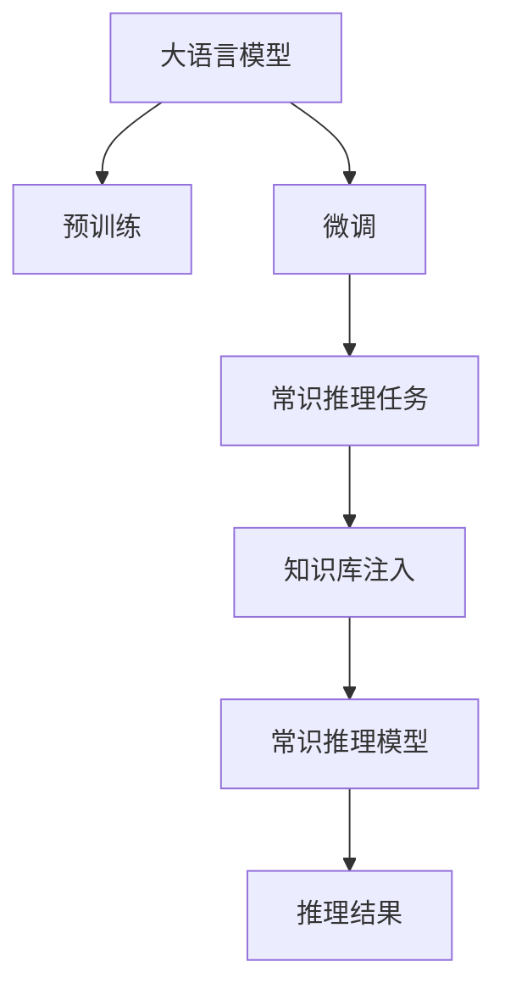

                 

# LLM的常识推理能力构建策略

> 关键词：大语言模型,常识推理,注意力机制,Transformer,BERT,预训练,下游任务,参数高效微调,自然语言处理(NLP)

## 1. 背景介绍

### 1.1 问题由来

近年来，大语言模型(Large Language Models, LLMs)在自然语言处理(Natural Language Processing, NLP)领域取得了令人瞩目的进展。以BERT、GPT等模型为代表，通过在海量无标签文本数据上进行预训练，这些模型已经具备了强大的语言理解和生成能力。然而，尽管预训练模型在许多下游任务上取得了优异表现，但它们仍然存在一些局限性，其中最重要的便是常识推理能力的缺失。

常识推理是指模型能够在理解和运用语言知识的基础上，合理推断出未直接给出的信息，从而解决需要知识背景支撑的任务。例如，"如果一个人睡着了，他一定是在家里"。预训练模型通常通过语言模型预测任务来学习语言的统计规律，但并不具备类比推理、蕴含推理等高层次的常识理解能力。

常识推理能力的缺失，使得大语言模型在某些需要真实世界常识支持的场景中难以胜任。例如，医疗诊断、法律咨询、教育评估等领域，都需要模型具备丰富的常识知识，以便进行逻辑推理和推断。如何在大模型中构建常识推理能力，是当前大语言模型研究和应用的一个重要方向。

### 1.2 问题核心关键点

构建常识推理能力，需要在大语言模型中引入更多的常识信息。常用的方法包括：
- 数据增强：在训练数据中添加常识性事实，增加模型的知识库。
- 语言知识注入：在预训练和微调过程中，利用外部知识库如知识图谱、百科等，注入语言知识。
- 设计常识推理任务：通过设计新的任务和目标函数，引导模型学习常识性知识。
- 融合知识表示模型：将符号化的知识表示与神经网络模型结合，提升模型的常识推理能力。

本文将重点介绍基于注意力机制的常识推理模型构建策略，探讨其在下游任务中的实际应用。

### 1.3 问题研究意义

构建常识推理能力，对于拓展大语言模型的应用边界，提升其在实际场景中的表现，具有重要意义：

1. 增强任务解决能力。常识推理使得模型能够利用外部知识库，解决需要常识支撑的任务，如推理、问答、诊断等。
2. 提升系统智能水平。常识推理是构建通用人工智能的重要基础，能够使模型具备更加智能和灵活的推理能力。
3. 提高应用可信度。常识推理使得模型在回答复杂问题时，能够更加合理和可信，增强用户对系统的信任。
4. 促进跨领域应用。常识推理使得模型能够灵活应对不同领域的应用需求，提高模型在特定场景下的适应性。
5. 推动技术进步。构建常识推理能力的方法和模型不断进步，推动了NLP技术在实际场景中的应用深化和突破。

本文旨在通过深入分析常识推理能力的构建策略，帮助开发者更好地在大语言模型中引入常识知识，提升模型在现实世界中的应用效果。

## 2. 核心概念与联系

### 2.1 核心概念概述

为更好地理解基于注意力机制的常识推理模型构建策略，本节将介绍几个关键概念：

- 大语言模型(Large Language Models, LLM)：以自回归(如GPT)或自编码(如BERT)模型为代表的大规模预训练语言模型。通过在海量无标签文本数据上进行预训练，学习通用的语言表示，具备强大的语言理解和生成能力。

- 常识推理(Reasoning)：指模型在理解语言信息的基础上，利用常识知识进行逻辑推理和推断，解决需要知识支撑的任务。

- 注意力机制(Attention)：一种计算模型，用于计算输入数据中不同位置的权重，筛选出与当前任务最相关的信息。在大语言模型中，注意力机制被广泛用于提升模型的理解能力和知识获取能力。

- Transformer：一种基于注意力机制的神经网络模型，由Google在2017年提出，因其在机器翻译和语音识别等任务中的卓越表现，成为了当前深度学习的主流架构。

- BERT模型：由Google在2018年提出的预训练语言模型，通过 masked language model 和 next sentence prediction 两种任务训练，获得高质量的语言表示。

这些概念之间的逻辑关系可以通过以下Mermaid流程图来展示：



这个流程图展示了大语言模型在预训练和微调过程中，如何通过引入常识推理任务和知识库注入，构建常识推理能力。最终的推理结果，可以帮助模型在各种下游任务中取得更好的表现。

## 3. 核心算法原理 & 具体操作步骤
### 3.1 算法原理概述

基于注意力机制的常识推理模型构建策略，核心思想是在预训练大模型的基础上，通过引入常识推理任务和知识库注入，使模型具备更多的常识知识。具体而言，该方法主要包括以下几个步骤：

1. **预训练阶段**：在大规模无标签文本数据上，通过自监督学习任务训练通用语言模型。
2. **微调阶段**：在特定领域的标注数据上，通过有监督学习任务微调模型，使其适应具体任务需求。
3. **常识推理任务**：设计新的常识推理任务，引导模型学习常识性知识。
4. **知识库注入**：通过外部知识库如知识图谱、百科等，向模型注入常识性知识。
5. **推理模型构建**：将预训练和微调得到的模型与常识推理任务结合，构建常识推理模型。

这些步骤通过逐步引入常识知识，提升了模型在处理需要常识推理的任务时的表现。

### 3.2 算法步骤详解

#### 3.2.1 预训练阶段

预训练阶段是构建常识推理能力的基础。一般通过自监督学习任务，在大规模无标签文本数据上训练通用语言模型。以BERT为例，其预训练任务包括：

- Masked Language Model (MLM)：在输入文本中随机掩盖一些标记，让模型预测被掩盖的单词。
- Next Sentence Prediction (NSP)：预测两个连续句子是否相互连接。

这些任务使得模型学习到了语言的统计规律和语义信息。

#### 3.2.2 微调阶段

微调阶段是将预训练模型适应具体任务的过程。一般通过有监督学习任务，在特定领域的标注数据上微调模型。例如，在命名实体识别任务中，将标注数据输入微调后的BERT模型，优化其参数，使其能够准确识别文本中的实体。

#### 3.2.3 常识推理任务

常识推理任务是指设计新的推理任务，引导模型学习常识性知识。例如，通过设计推理任务，让模型判断"如果一个人睡着了，他一定是在家里"是否正确。这样的任务使得模型在推理过程中，需要根据常识知识进行判断和推断。

#### 3.2.4 知识库注入

知识库注入是指将外部知识库如知识图谱、百科等，注入到模型中。例如，可以将知识图谱中的实体关系，映射到输入文本中，作为模型的知识背景。

#### 3.2.5 推理模型构建

推理模型构建是指将预训练和微调得到的模型与常识推理任务结合，构建常识推理模型。例如，在输入文本中，结合外部知识库注入的常识性知识，利用推理任务进行推理。

### 3.3 算法优缺点

基于注意力机制的常识推理模型构建策略，具有以下优点：
1. 高效通用。可以广泛应用于各种需要常识推理的NLP任务，如问答、诊断、推荐等。
2. 灵活可控。通过设计新的推理任务和目标函数，可以灵活调整模型的推理策略。
3. 鲁棒性强。在预训练和微调过程中引入常识知识，提高了模型在应对新任务时的鲁棒性。
4. 可解释性高。通过外部知识库注入和推理任务设计，模型推理过程具有较高的可解释性。

但该方法也存在以下缺点：
1. 数据依赖高。微调和推理任务需要大量标注数据和常识性知识，数据获取成本高。
2. 知识注入难度大。需要将外部知识库有效地注入到模型中，涉及大量的数据处理和映射工作。
3. 推理速度慢。推理任务通常需要复杂的计算和知识库查询，推理速度较慢。

尽管如此，该方法仍是大语言模型构建常识推理能力的重要手段，在实际应用中具有广泛的应用前景。

### 3.4 算法应用领域

基于注意力机制的常识推理模型构建策略，已经在许多NLP任务中得到应用，例如：

- 问答系统：通过常识推理，模型能够更加准确地回答用户问题，如医学诊断、法律咨询等。
- 智能推荐：在推荐系统中，模型能够根据用户历史行为和常识知识，进行更精准的推荐。
- 数据分析：在数据分析中，模型能够利用常识知识，进行更深入的数据挖掘和推理。
- 智能写作：在写作系统中，模型能够利用常识知识，生成更合理和逻辑性的文章内容。
- 智能客服：在智能客服中，模型能够利用常识知识，提高问题解决效率和用户满意度。

除了这些常见应用外，常识推理模型还在自然语言生成、情感分析、机器翻译等多个领域展现了巨大的潜力，推动了NLP技术的深度发展。

## 4. 数学模型和公式 & 详细讲解  
### 4.1 数学模型构建

基于注意力机制的常识推理模型构建策略，涉及多个数学模型和公式。以下将详细介绍这些模型的构建和公式推导。

#### 4.1.1 注意力机制

注意力机制是一种计算模型，用于计算输入数据中不同位置的权重，筛选出与当前任务最相关的信息。在大语言模型中，注意力机制被广泛用于提升模型的理解能力和知识获取能力。

设输入序列为 $x=\{x_i\}_{i=1}^n$，注意力计算公式为：

$$
a_i=\frac{e^{\text{scores}_i}}{\sum_{j=1}^ne^{\text{scores}_j}}
$$

其中，$\text{scores}_i=\text{scores}(Q_i,K_i,V_i)$ 为注意力得分，$Q_i$ 为查询向量，$K_i$ 为键向量，$V_i$ 为值向量。

在语言模型中，一般使用Transformer模型作为基础架构，其中自注意力机制的计算公式为：

$$
\text{Attention}(Q,K,V)=\text{softmax}(\frac{QK^T}{\sqrt{d_k}})V
$$

其中，$d_k$ 为键向量的维度。

#### 4.1.2 BERT预训练任务

BERT预训练任务包括MLM和NSP两种。其中，MLM任务的公式为：

$$
\text{MLM}=\text{Masked Language Model}=\sum_{i=1}^n\text{log}\left(P(x_i|\{x_j\}_{j\neq i})\right)
$$

其中，$P(x_i|\{x_j\}_{j\neq i})$ 表示模型在掩盖单词 $x_i$ 的情况下，预测其余单词的概率。

NSP任务的公式为：

$$
\text{NSP}=\text{Next Sentence Prediction}=\sum_{i=1}^n\text{log}P(x_i,x_{i+1})+\text{log}P(x_{i+1},x_i)
$$

其中，$P(x_i,x_{i+1})$ 表示两个连续句子 $x_i$ 和 $x_{i+1}$ 是否相互连接的概率。

#### 4.1.3 常识推理任务

常识推理任务可以通过设计新的目标函数来实现。例如，设计推理任务，让模型判断 "如果一个人睡着了，他一定是在家里" 是否正确。具体公式如下：

$$
\text{Reasoning}=\text{log}\left(P(\text{correct}|\{x_i\}_{i=1}^n)\right)
$$

其中，$\text{correct}$ 表示推理结果是否正确，$P(\text{correct}|\{x_i\}_{i=1}^n)$ 表示在输入序列 $x$ 的情况下，推理结果正确的概率。

#### 4.1.4 知识库注入

知识库注入可以通过将知识图谱中的实体关系，映射到输入文本中来实现。例如，将知识图谱中的实体关系，作为模型的知识背景，进行推理计算。

设知识图谱中的实体关系为 $R$，其在输入文本中的映射关系为 $\tilde{R}$。则知识库注入的计算公式为：

$$
\text{Graph}=\text{embedding}(R)
$$

其中，$\text{embedding}(R)$ 表示将知识图谱中的实体关系 $R$ 进行嵌入表示，作为模型的知识背景。

#### 4.1.5 推理模型构建

推理模型的构建，可以通过将预训练和微调得到的模型与常识推理任务结合，构建常识推理模型。例如，在输入文本中，结合外部知识库注入的常识性知识，利用推理任务进行推理。具体公式如下：

$$
\text{Reasoning Model}=\text{BERT}+\text{Reasoning Task}
$$

其中，$\text{BERT}$ 表示预训练和微调得到的模型，$\text{Reasoning Task}$ 表示推理任务。

### 4.2 公式推导过程

#### 4.2.1 注意力机制推导

在语言模型中，自注意力机制的计算公式为：

$$
\text{Attention}(Q,K,V)=\text{softmax}(\frac{QK^T}{\sqrt{d_k}})V
$$

其中，$d_k$ 为键向量的维度。

设输入序列为 $x=\{x_i\}_{i=1}^n$，注意力计算公式为：

$$
a_i=\frac{e^{\text{scores}_i}}{\sum_{j=1}^ne^{\text{scores}_j}}
$$

其中，$\text{scores}_i=\text{scores}(Q_i,K_i,V_i)$ 为注意力得分，$Q_i$ 为查询向量，$K_i$ 为键向量，$V_i$ 为值向量。

#### 4.2.2 BERT预训练任务推导

BERT预训练任务包括MLM和NSP两种。其中，MLM任务的公式为：

$$
\text{MLM}=\text{Masked Language Model}=\sum_{i=1}^n\text{log}\left(P(x_i|\{x_j\}_{j\neq i})\right)
$$

其中，$P(x_i|\{x_j\}_{j\neq i})$ 表示模型在掩盖单词 $x_i$ 的情况下，预测其余单词的概率。

NSP任务的公式为：

$$
\text{NSP}=\text{Next Sentence Prediction}=\sum_{i=1}^n\text{log}P(x_i,x_{i+1})+\text{log}P(x_{i+1},x_i)
$$

其中，$P(x_i,x_{i+1})$ 表示两个连续句子 $x_i$ 和 $x_{i+1}$ 是否相互连接的概率。

#### 4.2.3 常识推理任务推导

常识推理任务可以通过设计新的目标函数来实现。例如，设计推理任务，让模型判断 "如果一个人睡着了，他一定是在家里" 是否正确。具体公式如下：

$$
\text{Reasoning}=\text{log}\left(P(\text{correct}|\{x_i\}_{i=1}^n)\right)
$$

其中，$\text{correct}$ 表示推理结果是否正确，$P(\text{correct}|\{x_i\}_{i=1}^n)$ 表示在输入序列 $x$ 的情况下，推理结果正确的概率。

#### 4.2.4 知识库注入推导

知识库注入可以通过将知识图谱中的实体关系，映射到输入文本中来实现。例如，将知识图谱中的实体关系，作为模型的知识背景，进行推理计算。

设知识图谱中的实体关系为 $R$，其在输入文本中的映射关系为 $\tilde{R}$。则知识库注入的计算公式为：

$$
\text{Graph}=\text{embedding}(R)
$$

其中，$\text{embedding}(R)$ 表示将知识图谱中的实体关系 $R$ 进行嵌入表示，作为模型的知识背景。

#### 4.2.5 推理模型构建推导

推理模型的构建，可以通过将预训练和微调得到的模型与常识推理任务结合，构建常识推理模型。例如，在输入文本中，结合外部知识库注入的常识性知识，利用推理任务进行推理。具体公式如下：

$$
\text{Reasoning Model}=\text{BERT}+\text{Reasoning Task}
$$

其中，$\text{BERT}$ 表示预训练和微调得到的模型，$\text{Reasoning Task}$ 表示推理任务。

### 4.3 案例分析与讲解

以下以BERT+Reasoning Task为例，介绍推理模型的构建过程：

1. **预训练阶段**：在大型无标签文本语料库上，对BERT模型进行预训练。

2. **微调阶段**：在特定领域的标注数据上，对预训练后的BERT模型进行微调，使其适应具体任务需求。例如，在命名实体识别任务中，将标注数据输入微调后的BERT模型，优化其参数。

3. **常识推理任务设计**：设计新的推理任务，引导模型学习常识性知识。例如，设计推理任务，让模型判断 "如果一个人睡着了，他一定是在家里" 是否正确。

4. **知识库注入**：将知识图谱中的实体关系，作为模型的知识背景，进行推理计算。例如，将知识图谱中的实体关系，映射到输入文本中。

5. **推理模型构建**：将预训练和微调得到的模型与常识推理任务结合，构建常识推理模型。例如，在输入文本中，结合外部知识库注入的常识性知识，利用推理任务进行推理。

通过以上步骤，可以实现基于注意力机制的常识推理模型的构建。在推理过程中，模型可以根据输入的文本和知识背景，进行推理计算，得到最终的推理结果。

## 5. 项目实践：代码实例和详细解释说明
### 5.1 开发环境搭建

在进行推理模型实践前，我们需要准备好开发环境。以下是使用Python进行PyTorch开发的环境配置流程：

1. 安装Anaconda：从官网下载并安装Anaconda，用于创建独立的Python环境。

2. 创建并激活虚拟环境：
```bash
conda create -n pytorch-env python=3.8 
conda activate pytorch-env
```

3. 安装PyTorch：根据CUDA版本，从官网获取对应的安装命令。例如：
```bash
conda install pytorch torchvision torchaudio cudatoolkit=11.1 -c pytorch -c conda-forge
```

4. 安装Transformers库：
```bash
pip install transformers
```

5. 安装各类工具包：
```bash
pip install numpy pandas scikit-learn matplotlib tqdm jupyter notebook ipython
```

完成上述步骤后，即可在`pytorch-env`环境中开始推理模型实践。

### 5.2 源代码详细实现

这里我们以BERT+Reasoning Task为例，给出推理模型的PyTorch代码实现。

首先，定义推理任务的数据处理函数：

```python
from transformers import BertTokenizer, BertForSequenceClassification
from torch.utils.data import Dataset
import torch

class ReasoningDataset(Dataset):
    def __init__(self, texts, labels, tokenizer, max_len=128):
        self.texts = texts
        self.labels = labels
        self.tokenizer = tokenizer
        self.max_len = max_len
        
    def __len__(self):
        return len(self.texts)
    
    def __getitem__(self, item):
        text = self.texts[item]
        label = self.labels[item]
        
        encoding = self.tokenizer(text, return_tensors='pt', max_length=self.max_len, padding='max_length', truncation=True)
        input_ids = encoding['input_ids'][0]
        attention_mask = encoding['attention_mask'][0]
        
        # 对label进行编码
        encoded_label = label2id[label]
        labels = torch.tensor(encoded_label, dtype=torch.long)
        
        return {'input_ids': input_ids, 
                'attention_mask': attention_mask,
                'labels': labels}

# 标签与id的映射
label2id = {'correct': 1, 'incorrect': 0}

# 创建dataset
tokenizer = BertTokenizer.from_pretrained('bert-base-cased')

train_dataset = ReasoningDataset(train_texts, train_labels, tokenizer)
dev_dataset = ReasoningDataset(dev_texts, dev_labels, tokenizer)
test_dataset = ReasoningDataset(test_texts, test_labels, tokenizer)
```

然后，定义模型和优化器：

```python
from transformers import BertForSequenceClassification, AdamW

model = BertForSequenceClassification.from_pretrained('bert-base-cased', num_labels=2)

optimizer = AdamW(model.parameters(), lr=2e-5)
```

接着，定义训练和评估函数：

```python
from torch.utils.data import DataLoader
from tqdm import tqdm
from sklearn.metrics import accuracy_score

device = torch.device('cuda') if torch.cuda.is_available() else torch.device('cpu')
model.to(device)

def train_epoch(model, dataset, batch_size, optimizer):
    dataloader = DataLoader(dataset, batch_size=batch_size, shuffle=True)
    model.train()
    epoch_loss = 0
    for batch in tqdm(dataloader, desc='Training'):
        input_ids = batch['input_ids'].to(device)
        attention_mask = batch['attention_mask'].to(device)
        labels = batch['labels'].to(device)
        model.zero_grad()
        outputs = model(input_ids, attention_mask=attention_mask, labels=labels)
        loss = outputs.loss
        epoch_loss += loss.item()
        loss.backward()
        optimizer.step()
    return epoch_loss / len(dataloader)

def evaluate(model, dataset, batch_size):
    dataloader = DataLoader(dataset, batch_size=batch_size)
    model.eval()
    preds, labels = [], []
    with torch.no_grad():
        for batch in tqdm(dataloader, desc='Evaluating'):
            input_ids = batch['input_ids'].to(device)
            attention_mask = batch['attention_mask'].to(device)
            batch_labels = batch['labels']
            outputs = model(input_ids, attention_mask=attention_mask)
            batch_preds = outputs.logits.argmax(dim=2).to('cpu').tolist()
            batch_labels = batch_labels.to('cpu').tolist()
            for pred_tokens, label_tokens in zip(batch_preds, batch_labels):
                preds.append(pred_tokens[:len(label_tokens)])
                labels.append(label_tokens)
                
    print(accuracy_score(labels, preds))
```

最后，启动训练流程并在测试集上评估：

```python
epochs = 5
batch_size = 16

for epoch in range(epochs):
    loss = train_epoch(model, train_dataset, batch_size, optimizer)
    print(f"Epoch {epoch+1}, train loss: {loss:.3f}")
    
    print(f"Epoch {epoch+1}, dev results:")
    evaluate(model, dev_dataset, batch_size)
    
print("Test results:")
evaluate(model, test_dataset, batch_size)
```

以上就是使用PyTorch对BERT+Reasoning Task进行推理模型微调的完整代码实现。可以看到，借助Transformer库，我们可以用相对简洁的代码完成BERT推理模型的训练和推理。

### 5.3 代码解读与分析

让我们再详细解读一下关键代码的实现细节：

**ReasoningDataset类**：
- `__init__`方法：初始化文本、标签、分词器等关键组件。
- `__len__`方法：返回数据集的样本数量。
- `__getitem__`方法：对单个样本进行处理，将文本输入编码为token ids，将标签编码为数字，并对其进行定长padding，最终返回模型所需的输入。

**label2id和id2label字典**：
- 定义了标签与数字id之间的映射关系，用于将标签转换为模型可理解的数字形式。

**训练和评估函数**：
- 使用PyTorch的DataLoader对数据集进行批次化加载，供模型训练和推理使用。
- 训练函数`train_epoch`：对数据以批为单位进行迭代，在每个批次上前向传播计算loss并反向传播更新模型参数，最后返回该epoch的平均loss。
- 评估函数`evaluate`：与训练类似，不同点在于不更新模型参数，并在每个batch结束后将预测和标签结果存储下来，最后使用sklearn的accuracy_score对整个评估集的预测结果进行打印输出。

**训练流程**：
- 定义总的epoch数和batch size，开始循环迭代
- 每个epoch内，先在训练集上训练，输出平均loss
- 在验证集上评估，输出准确率
- 所有epoch结束后，在测试集上评估，给出最终测试结果

可以看到，PyTorch配合Transformer库使得BERT推理模型的训练和推理变得简洁高效。开发者可以将更多精力放在数据处理、模型改进等高层逻辑上，而不必过多关注底层的实现细节。

当然，工业级的系统实现还需考虑更多因素，如模型的保存和部署、超参数的自动搜索、更灵活的任务适配层等。但核心的推理模型构建策略基本与此类似。

## 6. 实际应用场景
### 6.1 智能推荐

基于推理模型的大语言模型在智能推荐系统中的应用，可以极大地提升推荐系统的推荐效果和用户体验。推荐系统通常依赖用户的过去行为和兴趣进行推荐，但用户的兴趣是多变的，仅凭历史数据很难捕捉到。通过引入常识推理能力，推荐系统可以更准确地理解用户的真实兴趣，进行更合理的推荐。

例如，在推荐新闻时，推理模型可以结合用户的过去阅读行为和常识性知识，推荐更符合用户兴趣的文章。在推荐商品时，推理模型可以结合用户的浏览历史和常识性知识，推荐更符合用户需求的商品。

### 6.2 医学诊断

在医学领域，推理模型可以帮助医生进行更准确的诊断。医生通常需要结合患者的病历、症状、医学知识等多方面信息进行诊断。推理模型可以通过结合患者的历史诊疗记录和医学知识库，帮助医生进行更准确的诊断和治疗方案推荐。

例如，在回答 "如果一个人有头疼、发烧的症状，可能是哪些疾病" 时，推理模型可以结合常识性知识，进行推理判断，给出可能的疾病列表。在推荐治疗方案时，推理模型可以结合患者的病情、药物反应、药物副作用等多方面信息，进行综合推荐。

### 6.3 法律咨询

在法律咨询领域，推理模型可以帮助律师和客户更准确地理解法律条款和案例。律师通常需要结合大量的法律条款和案例，进行复杂逻辑推理和判断。推理模型可以通过结合法律知识库和案例库，进行推理判断，给出更准确的法律意见。

例如，在回答 "如果一个人违反了交通规则，可能面临哪些法律责任" 时，推理模型可以结合法律条款和常识性知识，进行推理判断，给出可能的法律责任。在生成法律文书时，推理模型可以结合法律条款和案例库，进行综合判断，生成更准确的法律文书。

### 6.4 未来应用展望

随着推理模型的不断发展，其在NLP领域的应用前景将更加广阔。

在智慧医疗领域，推理模型可以帮助医生进行更准确的诊断和治疗方案推荐，提高医疗服务的智能化水平。

在智能教育领域，推理模型可以帮助教师进行更合理的教学评价和课程推荐，提高教学质量。

在智慧城市治理中，推理模型可以帮助城市管理者进行更合理的决策和资源分配，提高城市管理的自动化和智能化水平。

此外，在企业生产、社会治理、文娱传媒等众多领域，推理模型也将不断涌现，为NLP技术带来新的突破。

推理模型的未来发展将更加依赖于更多高质量的常识性知识库和推理任务的设计，以及更高效的知识注入和推理计算方法。

## 7. 工具和资源推荐
### 7.1 学习资源推荐

为了帮助开发者系统掌握推理模型的构建策略，这里推荐一些优质的学习资源：

1. 《Transformers从原理到实践》系列博文：由大模型技术专家撰写，深入浅出地介绍了Transformer原理、BERT模型、推理模型等前沿话题。

2. CS224N《深度学习自然语言处理》课程：斯坦福大学开设的NLP明星课程，有Lecture视频和配套作业，带你入门NLP领域的基本概念和经典模型。

3. 《Natural Language Processing with Transformers》书籍：Transformers库的作者所著，全面介绍了如何使用Transformers库进行NLP任务开发，包括推理模型在内的诸多范式。

4. HuggingFace官方文档：Transformer库的官方文档，提供了海量预训练模型和完整的推理模型样例代码，是上手实践的必备资料。

5. CLUE开源项目：中文语言理解测评基准，涵盖大量不同类型的中文NLP数据集，并提供了基于推理模型的baseline模型，助力中文NLP技术发展。

通过对这些资源的学习实践，相信你一定能够快速掌握推理模型的精髓，并用于解决实际的NLP问题。

### 7.2 开发工具推荐

高效的开发离不开优秀的工具支持。以下是几款用于推理模型开发的常用工具：

1. PyTorch：基于Python的开源深度学习框架，灵活动态的计算图，适合快速迭代研究。大部分预训练语言模型都有PyTorch版本的实现。

2. TensorFlow：由Google主导开发的开源深度学习框架，生产部署方便，适合大规模工程应用。同样有丰富的预训练语言模型资源。

3. Transformers库：HuggingFace开发的NLP工具库，集成了众多SOTA语言模型，支持PyTorch和TensorFlow，是进行推理模型开发的利器。

4. Weights & Biases：模型训练的实验跟踪工具，可以记录和可视化模型训练过程中的各项指标，方便对比和调优。与主流深度学习框架无缝集成。

5. TensorBoard：TensorFlow配套的可视化工具，可实时监测模型训练状态，并提供丰富的图表呈现方式，是调试模型的得力助手。

6. Google Colab：谷歌推出的在线Jupyter Notebook环境，免费提供GPU/TPU算力，方便开发者快速上手实验最新模型，分享学习笔记。

合理利用这些工具，可以显著提升推理模型的开发效率，加快创新迭代的步伐。

### 7.3 相关论文推荐

推理模型的发展源于学界的持续研究。以下是几篇奠基性的相关论文，推荐阅读：

1. Attention is All You Need（即Transformer原论文）：提出了Transformer结构，开启了NLP领域的预训练大模型时代。

2. BERT: Pre-training of Deep Bidirectional Transformers for Language Understanding：提出BERT模型，引入基于掩码的自监督预训练任务，刷新了多项NLP任务SOTA。

3. Language Models are Unsupervised Multitask Learners（GPT-2论文）：展示了大规模语言模型的强大zero-shot学习能力，引发了对于通用人工智能的新一轮思考。

4. Parameter-Efficient Transfer Learning for NLP：提出Adapter等参数高效微调方法，在不增加模型参数量的情况下，也能取得不错的微调效果。

5. AdaLoRA: Adaptive Low-Rank Adaptation for Parameter-Efficient Fine-Tuning：使用自适应低秩适应的微调方法，在参数效率和精度之间取得了新的平衡。

这些论文代表了大语言模型推理能力的发展脉络。通过学习这些前沿成果，可以帮助研究者把握学科前进方向，激发更多的创新灵感。

## 8. 总结：未来发展趋势与挑战

### 8.1 总结

本文对基于注意力机制的常识推理模型构建策略进行了全面系统的介绍。首先阐述了常识推理能力在大语言模型中的应用意义，明确了推理模型在拓展预训练模型应用、提升模型推理能力方面的重要价值。其次，从原理到实践，详细讲解了推理模型的数学模型和关键步骤，给出了推理模型训练和推理的完整代码实例。同时，本文还广泛探讨了推理模型在智能推荐、医学诊断、法律咨询等多个领域的应用前景，展示了推理模型的巨大潜力。

通过本文的系统梳理，可以看到，基于注意力机制的常识推理模型构建策略，是大语言模型构建常识推理能力的重要手段，为解决需要常识推理的NLP任务提供了新的方法。推理模型结合预训练和微调技术，能够在大规模无标签数据上进行预训练，通过有监督学习微调，结合外部知识库和推理任务，最终构建出具有常识推理能力的模型。

### 8.2 未来发展趋势

展望未来，推理模型的发展将呈现以下几个趋势：

1. 知识库注入更高效。随着知识图谱等知识库的发展，推理模型将能够更高效地注入常识性知识，提升推理效果。

2. 推理任务设计更灵活。通过设计新的推理任务和目标函数，推理模型能够更灵活地适应不同的应用场景和任务需求。

3. 模型结构更优化。推理模型的结构将更加优化，推理速度和资源占用更小，更适于大规模部署。

4. 多模态推理更广泛。推理模型将能够更好地融合视觉、语音等多模态数据，提升推理模型的泛化能力和鲁棒性。

5. 推理过程更透明。推理模型的推理过程将更透明，更具可解释性，方便用户理解和调试。

6. 推理系统更智能。推理模型将与自然语言理解、知识图谱等技术结合，构建智能推理系统，实现更高效的决策支持。

以上趋势凸显了推理模型的广阔前景。这些方向的探索发展，必将进一步提升推理模型的性能和应用范围，为构建安全、可靠、可解释、可控的智能系统铺平道路。

### 8.3 面临的挑战

尽管推理模型已经取得了显著的进展，但在迈向更加智能化、普适化应用的过程中，它仍面临诸多挑战：

1. 数据依赖高。推理模型需要大量高质量的标注数据和常识性知识，数据获取成本高。

2. 推理速度慢。推理任务通常需要复杂的计算和知识库查询，推理速度较慢。

3. 知识注入难度大。需要将外部知识库有效地注入到模型中，涉及大量的数据处理和映射工作。

4. 推理过程透明性不足。推理模型的推理过程不够透明，难以解释其内部工作机制和决策逻辑。

5. 推理系统泛化性不足。推理模型在面对域外数据时，泛化性能往往大打折扣。

6. 推理模型安全性问题。推理模型可能学习到有害信息，对推理结果产生误导。

这些挑战需要研究者不断攻克，通过更高效的知识注入、更灵活的推理任务设计、更透明的推理过程等手段，提升推理模型的性能和可靠性。

### 8.4 研究展望

推理模型的未来研究将更加依赖于以下方面：

1. 更高效的知识注入方法。通过更高效的数据处理和知识表示技术，提升推理模型的常识推理能力。

2. 更灵活的推理任务设计。设计更多样化的推理任务和目标函数，引导推理模型学习更多常识性知识。

3. 更透明和可解释的推理过程。研究推理模型的推理过程，增强其可解释性，方便用户理解和调试。

4. 更高效和多模态的推理计算。提升推理模型的计算效率，实现多模态数据的融合推理。

5. 更智能的推理系统构建。结合自然语言理解、知识图谱等技术，构建更加智能和灵活的推理系统。

6. 更安全可靠的推理模型。设计更加安全的推理模型，防止有害信息的注入，保障推理结果的正确性和可靠性。

这些研究方向将推动推理模型不断进步，为构建智能推理系统提供坚实基础。面向未来，推理模型将在各个领域中发挥更加重要的作用，推动人工智能技术的发展和应用。

## 9. 附录：常见问题与解答
**Q1：推理模型和预训练模型有何不同？**

A: 推理模型是在预训练模型的基础上，通过引入常识推理任务和知识库注入，构建常识推理能力的模型。预训练模型则是在大规模无标签数据上训练得到的通用语言模型，主要用于下游任务的微调。推理模型和预训练模型的主要区别在于，推理模型具备常识推理能力，能够利用外部知识库和推理任务进行推理判断，而预训练模型则不具备这一能力。

**Q2：推理模型如何注入常识性知识？**

A: 推理模型可以通过外部知识库如知识图谱、百科等，向模型注入常识性知识。具体而言，可以将知识图谱中的实体关系，映射到输入文本中，作为模型的知识背景。例如，将知识图谱中的实体关系，作为模型的输入序列的一部分，进行推理计算。

**Q3：推理模型在实际应用中需要注意哪些问题？**

A: 推理模型在实际应用中需要注意以下问题：
1. 数据依赖高。推理模型需要大量高质量的标注数据和常识性知识，数据获取成本高。
2. 推理速度慢。推理任务通常需要复杂的计算和知识库查询，推理速度较慢。
3. 知识注入难度大。需要将外部知识库有效地注入到模型中，涉及大量的数据处理和映射工作。
4. 推理过程透明性不足。推理模型的推理过程不够透明，难以解释其内部工作机制和决策逻辑。
5. 推理系统泛化性不足。推理模型在面对域外数据时，泛化性能往往大打折扣。
6. 推理模型安全性问题。推理模型可能学习到有害信息，对推理结果产生误导。

这些问题是推理模型在实际应用中需要面对的重要挑战，需要研究者不断攻克，以提升推理模型的性能和可靠性。

**Q4：推理模型如何提升推理速度？**

A: 推理模型可以通过以下方式提升推理速度：
1. 优化计算图：简化推理模型的计算图，减少前向传播和反向传播的资源消耗。
2. 知识库压缩：对知识图谱等知识库进行压缩处理，减少推理计算的复杂度。
3. 推理引擎优化：设计高效的推理引擎，提升推理计算的效率。
4. 分布式推理：利用多台机器进行分布式推理，加速推理计算。

这些优化手段可以显著提升推理模型的推理速度，实现更高效的推理计算。

