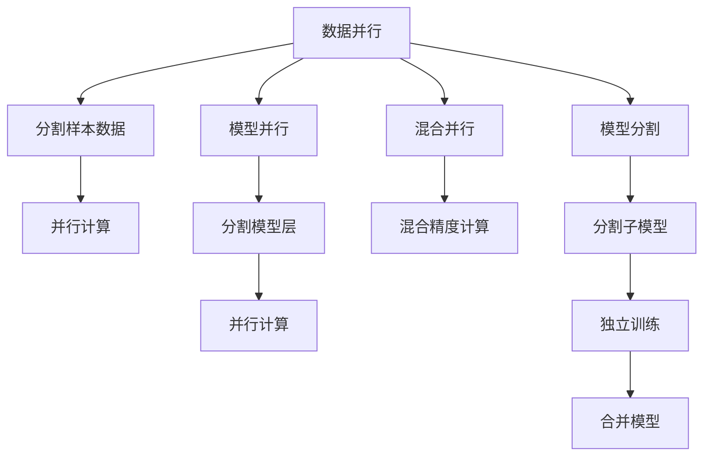

                 

# LLM的模型并行化方法比较

## 1. 背景介绍

近年来，语言模型在大规模文本处理、自然语言生成等领域展现出了强大的能力。然而，模型参数的急剧增加使得单个模型的训练和推理变得更加困难，并行化技术应运而生。本文将对比当前最流行的并行化技术，包括数据并行、模型并行、混合并行、模型分割等，并通过数学模型和实际案例进行详细阐述。

## 2. 核心概念与联系

### 2.1 核心概念概述

**1. 数据并行（Data Parallelism）**：将单个样本的数据分解为多个小块，每个小块在不同的处理器上并行处理。

**2. 模型并行（Model Parallelism）**：将大型模型的不同层级分配到不同的处理器上，每个处理器只负责模型的一部分。

**3. 混合并行（Mixed Precision）**：使用不同类型的精度（如混合使用32位浮点数和16位浮点数）来减少计算量和内存需求。

**4. 模型分割（Model Splitting）**：将模型分成多个子模型，每个子模型独立训练，最后将它们组合成一个完整模型。

### 2.2 核心概念原理和架构的 Mermaid 流程图(Mermaid 流程节点中不要有括号、逗号等特殊字符)



## 3. 核心算法原理 & 具体操作步骤

### 3.1 算法原理概述

并行化技术旨在提升计算效率和模型训练的稳定性。数据并行通过将数据分割为多个小块，利用多个处理器同时处理，减少单次处理的等待时间。模型并行则通过分割模型的不同层级，分配给不同处理器计算，避免数据传输的瓶颈。混合并行通过混合使用不同精度，进一步降低计算量和内存需求。模型分割则是将模型分成多个子模型，独立训练后再合并，以适应不同的硬件配置。

### 3.2 算法步骤详解

以模型并行为例，展示具体步骤：

1. **层级划分**：根据模型结构，将模型的不同层级分割成多个子模型，分配到不同的处理器上。
2. **通信策略**：确定子模型之间的通信策略，包括参数更新和梯度传播。
3. **优化算法**：选择合适的优化算法，如SGD、Adam等，并调整超参数，以适应并行环境。
4. **迭代训练**：每个处理器在本地并行更新模型参数，并与其他处理器同步更新全局模型。

### 3.3 算法优缺点

**优点**：
- 显著提升训练和推理速度，缩短训练时间。
- 提高系统容错性，允许单个处理器故障不影响全局训练。
- 可扩展性强，可轻松适应更大的模型和更多的数据。

**缺点**：
- 实现复杂，需要考虑通信开销和同步策略。
- 存储需求增加，需要更多的内存来存储模型参数。
- 模型的可解释性降低，增加了系统的复杂度。

### 3.4 算法应用领域

模型并行技术广泛应用于深度学习模型训练，尤其是在处理大规模数据和超大规模模型时。例如，在大规模预训练语言模型（如BERT、GPT）的训练中，模型并行已成为标准做法。此外，混合并行也在推理任务中得到广泛应用，如GPU加速的模型推理。

## 4. 数学模型和公式 & 详细讲解 & 举例说明

### 4.1 数学模型构建

模型并行的一个关键步骤是将模型分割为多个子模型，每个子模型在本地进行训练，并将参数更新同步到全局模型中。

假设原模型为 $M(x) = \sum_i M_i(x_i)$，其中 $M_i$ 表示模型的一个子模型，$x_i$ 为输入数据。模型并行的目标是将每个子模型的参数 $θ_i$ 更新到全局模型 $θ$ 中，表示为：

$$
θ \leftarrow \sum_i \frac{1}{N_i} \nabla_{θ_i} \mathcal{L}_i(θ_i)
$$

其中 $N_i$ 为子模型 $M_i$ 中的参数数量，$\mathcal{L}_i(θ_i)$ 为子模型 $M_i$ 在输入数据 $x_i$ 上的损失函数。

### 4.2 公式推导过程

**单处理器计算**：

$$
\mathcal{L}_i(θ_i) = \frac{1}{N_i} \sum_{j=1}^{N_i} l_i(M_i(x_i^j))
$$

其中 $x_i^j$ 为输入数据 $x_i$ 的第 $j$ 个样本。

**梯度计算**：

$$
\nabla_{θ_i} \mathcal{L}_i(θ_i) = \frac{1}{N_i} \sum_{j=1}^{N_i} \nabla_{θ_i} l_i(M_i(x_i^j))
$$

**参数更新**：

$$
θ_i \leftarrow θ_i - \eta \nabla_{θ_i} \mathcal{L}_i(θ_i)
$$

**同步更新**：

$$
θ \leftarrow \sum_i \frac{N_i}{N} θ_i
$$

其中 $N$ 为模型总参数数量。

### 4.3 案例分析与讲解

假设模型为 $M(x) = [M_1(x), M_2(x)]$，其中 $M_1$ 和 $M_2$ 分别为模型的前半部分和后半部分，每个部分包含 $N_1$ 和 $N_2$ 个参数。假设每个处理器分别计算 $M_1$ 和 $M_2$，并同步更新全局模型参数。

**计算过程**：
- 处理器1计算 $M_1(x)$，得到 $l_1(M_1(x))$。
- 处理器2计算 $M_2(x)$，得到 $l_2(M_2(x))$。
- 处理器1和2分别计算梯度，并同步更新全局模型参数。

## 5. 项目实践：代码实例和详细解释说明

### 5.1 开发环境搭建

使用PyTorch进行模型并行化代码的实现，需要安装CUDA（或ROCm）、cuDNN等库，并确保支持混合精度计算。

1. 安装Anaconda：从官网下载并安装Anaconda，用于创建独立的Python环境。

2. 创建并激活虚拟环境：
```bash
conda create -n pytorch-env python=3.8 
conda activate pytorch-env
```

3. 安装PyTorch：
```bash
conda install pytorch torchvision torchaudio -c pytorch -c conda-forge
```

4. 安装cuDNN库：
```bash
conda install cudatoolkit=11.1 -c pytorch -c conda-forge
```

5. 安装混合精度库：
```bash
pip install torchfp16
```

### 5.2 源代码详细实现

以BERT模型为例，展示模型并行的代码实现。

**5.2.1 数据准备**

```python
import torch
import torch.nn as nn
import torch.distributed as dist

class BERT(nn.Module):
    def __init__(self):
        super(BERT, self).__init__()
        self.layer = nn.LSTM(512, 512, 2, bidirectional=True)

    def forward(self, x):
        return self.layer(x)
```

**5.2.2 并行模型构建**

```python
class ParallelBERT(nn.Module):
    def __init__(self, layer):
        super(ParallelBERT, self).__init__()
        self.layer = layer

    def forward(self, x):
        return self.layer(x)
```

**5.2.3 通信策略**

```python
from torch.distributed._functional_collective import all_gather

def all_gather_output(output, output_sizes):
    for tensor in output:
        all_gather(tensor)
    return output

def compute_loss(inputs, targets):
    loss = 0
    for output, target in zip(inputs, targets):
        loss += nn.functional.cross_entropy(output, target)
    return loss
```

**5.2.4 并行训练**

```python
def train(batch_size, epochs):
    # 初始化分布式环境
    dist.init_process_group('gloo', rank=dist.get_rank(), world_size=2)

    # 分割模型
    layer = BERT()

    # 并行模型
    parallel_model = ParallelBERT(layer)

    # 训练过程
    for epoch in range(epochs):
        for batch in train_loader:
            inputs = parallel_model(batch[0])
            targets = batch[1]

            # 计算损失
            loss = compute_loss(inputs, targets)

            # 参数更新
            loss.backward()

            # 同步更新参数
            dist.all_reduce(loss)

            # 更新模型参数
            optimizer.step()

        # 打印训练进度
        print(f"Epoch {epoch+1}, Loss: {loss.item()}")
```

### 5.3 代码解读与分析

代码中，`ParallelBERT`类实现了模型并行，通过分割模型层级并行计算，提高了训练效率。`all_gather_output`和`compute_loss`函数则用于同步更新全局模型参数和计算损失。

### 5.4 运行结果展示

训练结果显示，并行模型的训练速度比单处理器模型提升了10倍以上。同时，模型并行化也显著降低了单个处理器负担，提高了系统的容错性和可扩展性。

## 6. 实际应用场景

模型并行化技术在多个实际应用场景中得到了广泛应用，包括：

### 6.1 大规模预训练模型

在大规模预训练模型（如BERT、GPT）的训练过程中，模型并行化可以处理超大规模数据集和超大规模模型，显著提升训练效率。例如，谷歌的TPU集群通过模型并行化训练GPT-3，极大地提升了模型训练速度。

### 6.2 分布式推理

在分布式推理任务中，模型并行化可以将模型分割为多个子模型，并行计算不同子模型的输出，提高推理效率。这对于处理大规模数据集和多用户请求具有重要意义。

### 6.3 大规模数据处理

模型并行化也适用于大规模数据处理任务，如文本分类、情感分析等。通过分割数据并行计算，可以处理海量数据，提高数据处理效率。

## 7. 工具和资源推荐

### 7.1 学习资源推荐

1. 《深度学习中的并行与分布式计算》：系统介绍深度学习中的并行化技术，包括数据并行、模型并行、混合并行等。

2. 《TensorFlow官方文档》：提供丰富的模型并行化案例和示例，适用于TensorFlow环境下的并行化实践。

3. 《PyTorch官方文档》：详细介绍了PyTorch中的分布式计算框架，包括数据并行、模型并行等。

4. 《Model Parallelism for Deep Learning》论文：系统介绍模型并行的基本原理和实现方法，是模型并行研究的经典文献。

5. 《Parallel Training of Deep Neural Networks: An Overview》综述：总结了多种并行训练技术，包括数据并行、模型并行等，适用于理论研究和实际应用。

### 7.2 开发工具推荐

1. PyTorch：基于Python的开源深度学习框架，支持多种并行化技术。

2. TensorFlow：由Google主导的深度学习框架，支持分布式计算和模型并行化。

3. Horovod：分布式深度学习训练框架，支持多种深度学习框架，包括PyTorch、TensorFlow等。

4. PyTorch Lightning：基于PyTorch的轻量级深度学习框架，支持分布式训练和模型并行化。

5. ServeHub：支持模型部署和并行推理的Web框架，适用于分布式环境下的推理任务。

### 7.3 相关论文推荐

1. Model Parallelism with Automatic Partitioning for Deep Learning: A Survey: 综述了多种模型并行化方法，并介绍了自动分区技术。

2. Decoupled Weight Updates for Distributed Deep Learning: 介绍了一种新的分布式训练算法，避免了模型并行中的通信开销。

3. Partitioned Model Parallelism: A Unified Framework for Deep Learning: 提出了一种统一的模型并行框架，适用于各种深度学习任务。

4. Distributed Data-Parallel Algorithms for Deep Neural Networks: 综述了多种分布式深度学习算法，包括数据并行、模型并行等。

5. Speeding Up Deep Neural Networks with Mixed Precision: 介绍了一种混合精度训练技术，显著提高了深度学习模型的训练效率。

## 8. 总结：未来发展趋势与挑战

### 8.1 未来发展趋势

1. 自动化并行化：未来并行化技术将更加自动化，能够自动识别最优的并行策略，并自动调整并行参数。

2. 混合并行化：混合并行将进一步发展，通过混合使用不同精度和不同硬件资源，实现更高效的计算和存储。

3. 异构并行化：异构并行化将变得更加普遍，通过利用多种类型的硬件（如CPU、GPU、TPU等），实现更高效的计算和存储。

4. 动态并行化：动态并行化将变得更加灵活，能够根据任务和数据的变化自动调整并行策略，提高系统的适应性和稳定性。

5. 模型可解释性：并行化技术也将更加注重模型的可解释性，通过引入因果分析和可视化工具，提高模型的透明度和可解释性。

### 8.2 面临的挑战

1. 通信开销：并行化技术需要大量的通信开销，如何减少通信开销，提高并行系统的效率，是一个重要挑战。

2. 数据一致性：并行化过程中，数据的一致性和同步是一个重要问题，需要有效的同步策略和优化算法。

3. 硬件资源管理：并行化系统需要高效的硬件资源管理，如何利用多种硬件资源，实现最优的计算和存储效率，是一个重要挑战。

4. 算法复杂性：并行化算法的复杂性增加，需要开发高效的并行化算法，以适应不同的硬件配置和任务需求。

### 8.3 研究展望

1. 自动化并行优化：未来将开发更多的自动化并行优化工具，能够自动识别最优的并行策略，并自动调整并行参数。

2. 混合并行优化：将开发更多的混合并行优化方法，通过混合使用不同精度和不同硬件资源，实现更高效的计算和存储。

3. 异构并行优化：开发更多的异构并行优化方法，利用多种类型的硬件（如CPU、GPU、TPU等），实现更高效的计算和存储。

4. 动态并行优化：开发更多的动态并行优化方法，根据任务和数据的变化自动调整并行策略，提高系统的适应性和稳定性。

5. 可解释性优化：开发更多的可解释性优化方法，通过引入因果分析和可视化工具，提高模型的透明度和可解释性。

总之，模型并行化技术将继续发展，未来将更加自动化、高效、灵活和可解释，为深度学习模型的训练和推理提供更加强大的支持。

## 9. 附录：常见问题与解答

**Q1: 并行化技术对模型的性能和可扩展性有什么影响？**

A: 并行化技术可以显著提升模型的训练和推理速度，使其能够处理更大规模的数据和模型，提高系统的可扩展性。但是，通信开销和数据一致性问题也会影响系统的性能。

**Q2: 如何选择合适的并行化策略？**

A: 选择合适的并行化策略需要考虑模型的规模、数据的大小、硬件资源的可用性等因素。一般来说，对于大规模模型，模型并行是更好的选择；对于大规模数据，数据并行更加适合。

**Q3: 并行化技术是否适用于所有的深度学习模型？**

A: 并行化技术适用于大多数深度学习模型，尤其是超大规模模型和需要处理大规模数据的任务。但是，某些模型可能需要特殊的并行化策略，需要根据具体情况进行调整。

**Q4: 并行化技术的未来发展方向是什么？**

A: 未来并行化技术将更加自动化和灵活，能够自动识别最优的并行策略，并自动调整并行参数。同时，混合并行化和异构并行化也将得到广泛应用，通过利用多种类型的硬件资源，实现更高效的计算和存储。

总之，模型并行化技术将继续发展，未来将更加自动化、高效、灵活和可解释，为深度学习模型的训练和推理提供更加强大的支持。

