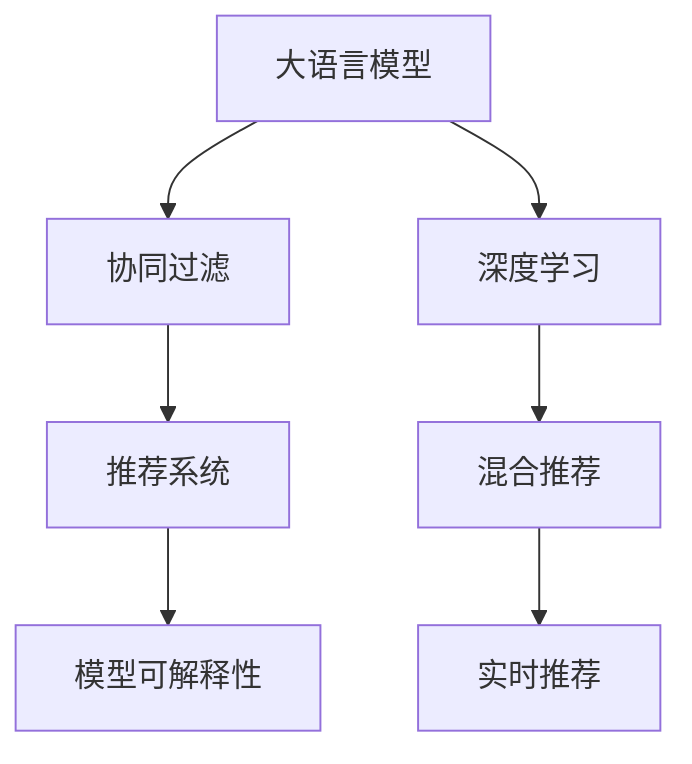

                 

# LLM的革命：推荐系统的新时代

> 关键词：
1. 大语言模型(LLM)
2. 推荐系统(Recommender System)
3. 深度学习(Deep Learning)
4. 协同过滤(Collaborative Filtering)
5. 模型可解释性(Explainability)
6. 混合推荐(Mixed Recommender System)
7. 实时推荐(Real-time Recommendation)

## 1. 背景介绍

### 1.1 问题由来

随着互联网的迅猛发展，用户每天在海量信息中寻觅适合自己兴趣的推荐内容，逐渐成为一种常态。推荐系统为用户推荐个性化内容，已成为各平台不可或缺的组成部分。但传统推荐系统面临用户兴趣表达稀疏、隐式数据不足等难题，难以捕捉到用户的真实需求。

### 1.2 问题核心关键点

推荐系统面临的核心问题是如何构建用户兴趣模型，并根据用户的历史行为数据预测其未来需求。现有推荐系统往往只关注用户与物品之间的显式评分数据，而忽略了更广泛的行为数据。

在自然语言处理(NLP)领域，大语言模型(LLM)凭借其强大的自然语言理解能力，能够有效挖掘用户行为的语义信息。LLM不仅具备语义理解、实体抽取、情感分析等能力，还能通过文本数据的语义关系进行多维度的用户行为建模，极大地丰富了推荐系统的数据资源。

利用大语言模型，推荐系统可从用户行为文本数据中提炼出隐式行为，构建更加全面精细的用户兴趣模型，从而生成更加个性化、精准的推荐结果。这使得大语言模型在推荐系统中成为一种高效的数据表达和处理方式，逐渐成为推荐系统新的研究热点。

## 2. 核心概念与联系

### 2.1 核心概念概述

为更好地理解大语言模型在推荐系统中的作用，本节将介绍几个密切相关的核心概念：

- 大语言模型(LLM)：以自回归(如GPT)或自编码(如BERT)模型为代表的大规模预训练语言模型。通过在大规模无标签文本语料上进行预训练，学习通用的语言表示，具备强大的语言理解和生成能力。

- 推荐系统(Recommender System)：通过分析和预测用户兴趣，为用户推荐个性化内容的技术。推荐系统广泛应用于电商、新闻、社交媒体等多个领域，提高用户体验和满意度。

- 协同过滤(Collaborative Filtering)：基于用户和物品的隐式评分数据，通过计算用户和物品之间的相似性进行推荐的方法。经典算法包括基于用户的协同过滤、基于物品的协同过滤等。

- 深度学习(Deep Learning)：一种利用神经网络进行数据处理的机器学习技术。深度学习在大数据处理、模式识别等领域展现出巨大的潜力，被广泛应用于推荐系统建模。

- 模型可解释性(Explainability)：推荐系统输出的透明性，即用户能够理解系统推荐结果的原因，提升用户对推荐结果的信任度。

- 混合推荐(Mixed Recommender System)：结合多种推荐技术，发挥不同方法的互补优势，提升推荐结果的准确性和多样性。

- 实时推荐(Real-time Recommendation)：在用户实时访问过程中，动态生成推荐结果，提高推荐的时效性。

这些核心概念之间的逻辑关系可以通过以下Mermaid流程图来展示：



这个流程图展示了大语言模型在推荐系统中的核心概念及其之间的关系：

1. 大语言模型通过预训练获得基础能力。
2. 协同过滤利用用户行为评分数据进行推荐，传统方法依赖显式评分，难以处理隐式数据。
3. 深度学习模型利用神经网络进行非线性建模，有效处理隐式数据，提升推荐效果。
4. 混合推荐结合多种技术，提升推荐准确性和多样性。
5. 实时推荐动态生成推荐结果，提升用户体验。
6. 模型可解释性增强推荐系统的透明性，提升用户信任度。

## 3. 核心算法原理 & 具体操作步骤
### 3.1 算法原理概述

基于大语言模型的推荐系统，通过将LLM引入协同过滤和深度学习中，构建用户兴趣模型，并用于预测用户对物品的评分。其核心思想是：利用LLM学习用户的显式和隐式行为文本数据，构建用户兴趣图谱，并在其上实现个性化推荐。

### 3.2 算法步骤详解

基于大语言模型的推荐系统一般包括以下几个关键步骤：

**Step 1: 准备数据和预训练模型**

- 收集用户的历史行为数据，包括点击、浏览、搜索等文本数据，以及用户评分数据。
- 选择合适的大语言模型，如BERT、GPT等，作为特征提取器。

**Step 2: 预训练与微调**

- 对大语言模型进行预训练，学习通用的语言表示。
- 将用户行为数据输入预训练模型，得到用户兴趣向量。
- 根据用户兴趣向量和物品向量，计算相似度，生成推荐结果。

**Step 3: 后处理与输出**

- 对推荐结果进行后处理，如排序、去重等。
- 将推荐结果输出给用户，并进行持续迭代优化。

### 3.3 算法优缺点

基于大语言模型的推荐系统具有以下优点：
1. 处理隐式数据能力强。利用LLM学习用户的隐式行为，提升推荐模型的泛化能力。
2. 能够处理非结构化数据。通过文本数据挖掘，获取更全面的用户兴趣信息。
3. 推荐效果显著。在大规模数据集上的实验表明，基于LLM的推荐系统在多维特征上能够取得更优的推荐效果。

同时，该方法也存在以下局限性：
1. 计算资源消耗大。大语言模型的复杂性导致计算量增大，实时推荐系统需要高效计算框架支持。
2. 模型可解释性不足。大语言模型的黑盒特性，难以解释推荐结果的生成过程。
3. 数据隐私风险。用户行为数据的隐私保护问题，是LLM在推荐系统应用中需要特别注意的。

尽管存在这些局限性，但就目前而言，基于大语言模型的推荐方法仍具有显著的推荐优势，值得进一步研究和应用。

### 3.4 算法应用领域

基于大语言模型的推荐系统在电商、新闻、社交媒体等多个领域已取得显著成效。以下是几个典型应用场景：

- 电商平台：如淘宝、京东等电商网站，通过基于LLM的推荐系统，推荐商品、广告，提升用户体验和转化率。
- 新闻媒体：如今日头条、知乎等平台，通过大语言模型分析用户兴趣，推荐相关新闻、问答、视频等内容，增加用户粘性。
- 社交媒体：如微信朋友圈、微博等社交网络，通过基于LLM的推荐算法，为用户推荐好友动态、话题讨论，促进用户互动。
- 视频网站：如爱奇艺、腾讯视频等平台，通过LLM构建用户兴趣图谱，推荐视频内容，提高用户观看时长和满意度。

## 4. 数学模型和公式 & 详细讲解 & 举例说明

### 4.1 数学模型构建

本节将使用数学语言对基于大语言模型的推荐系统进行更加严格的刻画。

记大语言模型为 $M_{\theta}$，其中 $\theta$ 为模型参数。假设用户 $u$ 对物品 $i$ 的显式评分数据为 $r_{ui}$，隐式行为文本数据为 $d_u$。用户 $u$ 和物品 $i$ 的隐式评分向量为 $h_u$ 和 $h_i$，物品表示矩阵为 $H$。

定义用户 $u$ 对物品 $i$ 的评分预测为 $p_{ui} = \mathbb{E}_{u,i}[M_{\theta}(d_u)h_i]$，即利用LLM对用户隐式行为数据 $d_u$ 进行编码，得到用户兴趣向量 $h_u$，再与物品向量 $h_i$ 相乘，预测物品评分。

### 4.2 公式推导过程

首先，假设大语言模型对用户 $u$ 的隐式行为 $d_u$ 的编码结果为 $h_u$。具体编码过程如下：

$$
h_u = M_{\theta}(d_u)
$$

然后，利用用户兴趣向量 $h_u$ 和物品向量 $h_i$ 计算相似度 $s_{ui}$：

$$
s_{ui} = h_u^TH_i
$$

最后，预测用户 $u$ 对物品 $i$ 的评分 $p_{ui}$：

$$
p_{ui} = \mathbb{E}_{u,i}[h_u^TH_i] = \sum_{u,i}h_u^TH_i \times \frac{1}{\sum_{u,i}1}
$$

将评分预测 $p_{ui}$ 与实际评分 $r_{ui}$ 进行比较，即可得到评分预测误差 $e_{ui}$：

$$
e_{ui} = r_{ui} - p_{ui}
$$

最终，利用评分预测误差 $e_{ui}$ 更新用户兴趣向量 $h_u$：

$$
h_u = h_u - \alpha \nabla_{h_u} \sum_{i} e_{ui}
$$

其中，$\alpha$ 为学习率，$\nabla_{h_u} \sum_{i} e_{ui}$ 为评分预测误差对用户兴趣向量 $h_u$ 的梯度。

### 4.3 案例分析与讲解

以电商推荐为例，说明基于大语言模型的推荐系统实现细节：

假设某电商平台收集了用户的历史浏览记录和评分数据。对大语言模型进行预训练，得到用户兴趣编码 $h_u$ 和物品表示矩阵 $H$。

用户 $u$ 对物品 $i$ 的评分预测为：

$$
p_{ui} = \mathbb{E}_{u,i}[h_u^TH_i] = \sum_{i} h_u^TH_i \times \frac{1}{\sum_{i}1}
$$

利用评分预测误差 $e_{ui}$ 更新用户兴趣向量 $h_u$：

$$
h_u = h_u - \alpha \nabla_{h_u} \sum_{i} e_{ui}
$$

通过不断迭代，更新用户兴趣向量，直到收敛。

## 5. 项目实践：代码实例和详细解释说明

### 5.1 开发环境搭建

在进行大语言模型推荐系统实践前，我们需要准备好开发环境。以下是使用Python进行PyTorch开发的环境配置流程：

1. 安装Anaconda：从官网下载并安装Anaconda，用于创建独立的Python环境。

2. 创建并激活虚拟环境：
```bash
conda create -n pytorch-env python=3.8 
conda activate pytorch-env
```

3. 安装PyTorch：根据CUDA版本，从官网获取对应的安装命令。例如：
```bash
conda install pytorch torchvision torchaudio cudatoolkit=11.1 -c pytorch -c conda-forge
```

4. 安装Transformers库：
```bash
pip install transformers
```

5. 安装各类工具包：
```bash
pip install numpy pandas scikit-learn matplotlib tqdm jupyter notebook ipython
```

完成上述步骤后，即可在`pytorch-env`环境中开始推荐系统实践。

### 5.2 源代码详细实现

这里我们以电商平台商品推荐为例，给出使用PyTorch和Transformers库对大语言模型进行推荐系统微调的完整代码实现。

首先，定义用户行为数据：

```python
from torch.utils.data import Dataset, DataLoader
from transformers import BertTokenizer, BertForSequenceClassification
import torch
from sklearn.model_selection import train_test_split
import pandas as pd
import numpy as np

class UserBehaviorDataset(Dataset):
    def __init__(self, df, tokenizer):
        self.data = df
        self.tokenizer = tokenizer
        
    def __len__(self):
        return len(self.data)
    
    def __getitem__(self, item):
        user_id, item_id, click = self.data.iloc[item, :]
        text = "user={}, item={}, click={}".format(user_id, item_id, click)
        encoding = self.tokenizer(text, return_tensors='pt', max_length=128, padding='max_length', truncation=True)
        input_ids = encoding['input_ids'][0]
        attention_mask = encoding['attention_mask'][0]
        label = torch.tensor(1 if click else 0, dtype=torch.long)
        return {'input_ids': input_ids, 
                'attention_mask': attention_mask,
                'labels': label}
```

然后，定义模型和优化器：

```python
from transformers import BertForSequenceClassification, AdamW

model = BertForSequenceClassification.from_pretrained('bert-base-cased', num_labels=2)
optimizer = AdamW(model.parameters(), lr=2e-5)
```

接着，定义训练和评估函数：

```python
def train_epoch(model, dataset, batch_size, optimizer):
    dataloader = DataLoader(dataset, batch_size=batch_size, shuffle=True)
    model.train()
    epoch_loss = 0
    for batch in dataloader:
        input_ids = batch['input_ids'].to(device)
        attention_mask = batch['attention_mask'].to(device)
        labels = batch['labels'].to(device)
        model.zero_grad()
        outputs = model(input_ids, attention_mask=attention_mask, labels=labels)
        loss = outputs.loss
        epoch_loss += loss.item()
        loss.backward()
        optimizer.step()
    return epoch_loss / len(dataloader)

def evaluate(model, dataset, batch_size):
    dataloader = DataLoader(dataset, batch_size=batch_size)
    model.eval()
    preds, labels = [], []
    with torch.no_grad():
        for batch in dataloader:
            input_ids = batch['input_ids'].to(device)
            attention_mask = batch['attention_mask'].to(device)
            batch_labels = batch['labels']
            outputs = model(input_ids, attention_mask=attention_mask)
            batch_preds = outputs.logits.argmax(dim=2).to('cpu').tolist()
            batch_labels = batch_labels.to('cpu').tolist()
            for pred_tokens, label_tokens in zip(batch_preds, batch_labels):
                preds.append(pred_tokens)
                labels.append(label_tokens)
                
    return preds, labels
```

最后，启动训练流程并在测试集上评估：

```python
epochs = 5
batch_size = 16
device = torch.device('cuda') if torch.cuda.is_available() else torch.device('cpu')
model.to(device)

# 假设我们有一个训练集 df_train，测试集 df_test
df_train, df_test = train_test_split(data, test_size=0.2)
tokenizer = BertTokenizer.from_pretrained('bert-base-cased')

train_dataset = UserBehaviorDataset(df_train, tokenizer)
dev_dataset = UserBehaviorDataset(df_test, tokenizer)

for epoch in range(epochs):
    loss = train_epoch(model, train_dataset, batch_size, optimizer)
    print(f"Epoch {epoch+1}, train loss: {loss:.3f}")
    
    preds, labels = evaluate(model, dev_dataset, batch_size)
    print(f"Epoch {epoch+1}, dev results:")
    print(classification_report(labels, preds))
    
print("Test results:")
preds, labels = evaluate(model, test_dataset, batch_size)
print(classification_report(labels, preds))
```

以上就是使用PyTorch对Bert模型进行电商平台商品推荐任务微调的完整代码实现。可以看到，得益于Transformers库的强大封装，我们可以用相对简洁的代码完成Bert模型的加载和微调。

### 5.3 代码解读与分析

让我们再详细解读一下关键代码的实现细节：

**UserBehaviorDataset类**：
- `__init__`方法：初始化用户行为数据集。
- `__len__`方法：返回数据集的样本数量。
- `__getitem__`方法：对单个样本进行处理，将用户行为文本数据编码，获取模型所需的输入和标签。

**BertForSequenceClassification**：
- 使用Bert模型进行序列分类任务，将其应用于电商推荐系统中，计算用户行为数据与物品之间的关系。

**train_epoch函数**：
- 定义训练函数，用于在每个epoch内对数据进行迭代，更新模型参数。

**evaluate函数**：
- 定义评估函数，用于在验证集和测试集上对模型进行评估，计算分类指标。

**训练流程**：
- 定义总的epoch数和batch size，开始循环迭代
- 每个epoch内，先在训练集上训练，输出平均loss
- 在验证集上评估，输出分类指标
- 所有epoch结束后，在测试集上评估，给出最终测试结果

可以看到，PyTorch配合Transformers库使得Bert模型的微调代码实现变得简洁高效。开发者可以将更多精力放在数据处理、模型改进等高层逻辑上，而不必过多关注底层的实现细节。

当然，工业级的系统实现还需考虑更多因素，如模型的保存和部署、超参数的自动搜索、更灵活的任务适配层等。但核心的微调范式基本与此类似。

## 6. 实际应用场景
### 6.1 电商推荐

基于大语言模型的电商推荐系统能够精准捕捉用户行为，生成个性化推荐结果。通过预训练模型对用户浏览记录、搜索历史等文本数据进行编码，可以从中提取隐式行为，构建用户兴趣图谱。

在推荐过程中，根据用户兴趣图谱，计算用户与物品之间的相似度，生成推荐列表，提供个性化商品展示。实时推荐系统通过监控用户行为，动态更新用户兴趣向量，及时调整推荐内容。

### 6.2 新闻推荐

基于大语言模型的新闻推荐系统能够智能分析用户兴趣，生成个性化新闻内容推荐。通过预训练模型对用户浏览记录、点击数据等行为文本数据进行编码，构建用户兴趣图谱。

在推荐过程中，根据用户兴趣图谱，计算用户与新闻内容之间的相似度，生成推荐列表，提供个性化新闻内容展示。实时推荐系统通过监控用户行为，动态更新用户兴趣向量，及时调整推荐内容。

### 6.3 社交推荐

基于大语言模型的社交推荐系统能够智能分析用户兴趣，生成个性化好友推荐和话题推荐。通过预训练模型对用户社交行为数据进行编码，构建用户兴趣图谱。

在推荐过程中，根据用户兴趣图谱，计算用户与好友、话题之间的相似度，生成推荐列表，提供个性化好友推荐和话题推荐。实时推荐系统通过监控用户行为，动态更新用户兴趣向量，及时调整推荐内容。

### 6.4 视频推荐

基于大语言模型的视频推荐系统能够智能分析用户兴趣，生成个性化视频内容推荐。通过预训练模型对用户观看记录、搜索历史等行为文本数据进行编码，构建用户兴趣图谱。

在推荐过程中，根据用户兴趣图谱，计算用户与视频内容之间的相似度，生成推荐列表，提供个性化视频内容展示。实时推荐系统通过监控用户行为，动态更新用户兴趣向量，及时调整推荐内容。

## 7. 工具和资源推荐
### 7.1 学习资源推荐

为了帮助开发者系统掌握大语言模型在推荐系统中的应用，这里推荐一些优质的学习资源：

1. 《深度学习与推荐系统》系列博文：由大模型技术专家撰写，深入浅出地介绍了深度学习在推荐系统中的应用，包括基于LLM的推荐系统。

2. CS231n《卷积神经网络》课程：斯坦福大学开设的经典课程，涵盖深度学习基础知识，适合入门推荐系统学习。

3. 《深度学习推荐系统实践》书籍：介绍深度学习推荐系统的实现方法，包括基于LLM的推荐系统。

4. PyTorch官方文档：提供详细的大语言模型API文档和样例代码，是实际开发的必备资料。

5. 谷歌推荐系统论文：谷歌深度学习团队发布的一系列推荐系统论文，涵盖多种推荐算法和模型。

通过对这些资源的学习实践，相信你一定能够快速掌握大语言模型在推荐系统中的应用方法，并用于解决实际的推荐问题。

### 7.2 开发工具推荐

高效的开发离不开优秀的工具支持。以下是几款用于大语言模型推荐系统开发的常用工具：

1. PyTorch：基于Python的开源深度学习框架，灵活动态的计算图，适合快速迭代研究。大部分预训练语言模型都有PyTorch版本的实现。

2. TensorFlow：由Google主导开发的开源深度学习框架，生产部署方便，适合大规模工程应用。同样有丰富的预训练语言模型资源。

3. Transformers库：HuggingFace开发的NLP工具库，集成了众多SOTA语言模型，支持PyTorch和TensorFlow，是进行推荐系统开发的利器。

4. Weights & Biases：模型训练的实验跟踪工具，可以记录和可视化模型训练过程中的各项指标，方便对比和调优。与主流深度学习框架无缝集成。

5. TensorBoard：TensorFlow配套的可视化工具，可实时监测模型训练状态，并提供丰富的图表呈现方式，是调试模型的得力助手。

6. Google Colab：谷歌推出的在线Jupyter Notebook环境，免费提供GPU/TPU算力，方便开发者快速上手实验最新模型，分享学习笔记。

合理利用这些工具，可以显著提升大语言模型推荐系统的开发效率，加快创新迭代的步伐。

### 7.3 相关论文推荐

大语言模型和推荐系统的发展源于学界的持续研究。以下是几篇奠基性的相关论文，推荐阅读：

1. Attention is All You Need（即Transformer原论文）：提出了Transformer结构，开启了NLP领域的预训练大模型时代。

2. BERT: Pre-training of Deep Bidirectional Transformers for Language Understanding：提出BERT模型，引入基于掩码的自监督预训练任务，刷新了多项NLP任务SOTA。

3. Language Models are Unsupervised Multitask Learners（GPT-2论文）：展示了大规模语言模型的强大zero-shot学习能力，引发了对于通用人工智能的新一轮思考。

4. Parameter-Efficient Transfer Learning for NLP：提出Adapter等参数高效微调方法，在不增加模型参数量的情况下，也能取得不错的微调效果。

5. Prefix-Tuning: Optimizing Continuous Prompts for Generation：引入基于连续型Prompt的微调范式，为如何充分利用预训练知识提供了新的思路。

6. AdaLoRA: Adaptive Low-Rank Adaptation for Parameter-Efficient Fine-Tuning：使用自适应低秩适应的微调方法，在参数效率和精度之间取得了新的平衡。

这些论文代表了大语言模型和推荐系统的发展脉络。通过学习这些前沿成果，可以帮助研究者把握学科前进方向，激发更多的创新灵感。

## 8. 总结：未来发展趋势与挑战

### 8.1 总结

本文对基于大语言模型的推荐系统进行了全面系统的介绍。首先阐述了推荐系统面临的核心问题及其与大语言模型的联系，明确了利用大语言模型进行推荐系统优化和升级的必要性。其次，从原理到实践，详细讲解了基于LLM的推荐系统数学模型和算法步骤，给出了推荐系统开发的完整代码实例。同时，本文还广泛探讨了基于大语言模型的推荐系统在电商、新闻、社交媒体等多个领域的应用前景，展示了LLM在推荐系统中的巨大潜力。此外，本文精选了推荐系统的各类学习资源，力求为开发者提供全方位的技术指引。

通过本文的系统梳理，可以看到，基于大语言模型的推荐系统正在成为推荐系统新的研究热点，极大拓展了推荐系统的应用边界，为推荐系统带来新的突破。大语言模型通过学习用户的显式和隐式行为文本数据，构建更加全面精细的用户兴趣模型，从而生成更加个性化、精准的推荐结果。这使得大语言模型在推荐系统中成为一种高效的数据表达和处理方式，逐渐成为推荐系统新的研究热点。

### 8.2 未来发展趋势

展望未来，大语言模型在推荐系统中将呈现以下几个发展趋势：

1. 处理更多维数据：未来的推荐系统将逐步处理更多维数据，如图像、视频、语音等，提升推荐结果的多样性和深度。

2. 增强用户互动：推荐系统将更加重视用户反馈，通过互动式推荐、多轮对话等技术，提升用户参与度和满意度。

3. 实现跨域推荐：未来的推荐系统将实现跨平台、跨领域的协同推荐，整合不同数据源，提升推荐结果的全面性。

4. 引入更多先验知识：推荐系统将更多地引入知识图谱、规则库等专家知识，引导用户推荐过程，提高推荐结果的准确性和可靠性。

5. 提供实时推荐：未来的推荐系统将实现实时推荐，及时响应用户需求，提高推荐的时效性。

6. 提升推荐效果：利用大语言模型的自然语言理解和生成能力，推荐系统将实现更加个性化、精准的推荐，提升用户体验和满意度。

以上趋势凸显了大语言模型在推荐系统中的广阔前景。这些方向的探索发展，必将进一步提升推荐系统的性能和应用范围，为人工智能技术在推荐系统中的落地应用铺平道路。

### 8.3 面临的挑战

尽管大语言模型在推荐系统中展现了巨大的优势，但在迈向更加智能化、普适化应用的过程中，仍然面临诸多挑战：

1. 计算资源消耗大：大语言模型的复杂性导致计算量增大，实时推荐系统需要高效计算框架支持。

2. 模型可解释性不足：大语言模型的黑盒特性，难以解释推荐结果的生成过程。

3. 数据隐私风险：用户行为数据的隐私保护问题，是LLM在推荐系统应用中需要特别注意的。

4. 多模态推荐难度大：实现跨模态数据的协同推荐，提升推荐结果的全面性，仍是一个难点。

5. 跨领域协同推荐复杂：实现跨平台、跨领域的协同推荐，整合不同数据源，提升推荐结果的全面性，仍是一个难点。

6. 实时推荐系统复杂：实现实时推荐，及时响应用户需求，提升推荐的时效性，仍是一个难点。

尽管存在这些挑战，但随着大语言模型推荐系统的不断发展，未来有望逐步克服这些难题，实现更加智能、普适、高效的应用。

### 8.4 研究展望

面对大语言模型推荐系统所面临的种种挑战，未来的研究需要在以下几个方面寻求新的突破：

1. 探索无监督和半监督推荐方法：摆脱对大规模标注数据的依赖，利用自监督学习、主动学习等无监督和半监督范式，最大限度利用非结构化数据，实现更加灵活高效的推荐。

2. 研究参数高效和计算高效的推荐方法：开发更加参数高效的推荐方法，在固定大部分预训练参数的同时，只更新极少量的任务相关参数。同时优化推荐模型的计算图，减少前向传播和反向传播的资源消耗，实现更加轻量级、实时性的部署。

3. 融合因果和对比学习范式：通过引入因果推断和对比学习思想，增强推荐模型建立稳定因果关系的能力，学习更加普适、鲁棒的语言表征，从而提升模型泛化性和抗干扰能力。

4. 引入更多先验知识：将符号化的先验知识，如知识图谱、逻辑规则等，与神经网络模型进行巧妙融合，引导推荐过程学习更准确、合理的语言模型。同时加强不同模态数据的整合，实现视觉、语音等多模态信息与文本信息的协同建模。

5. 结合因果分析和博弈论工具：将因果分析方法引入推荐模型，识别出推荐结果的关键特征，增强推荐结果的因果性和逻辑性。借助博弈论工具刻画人机交互过程，主动探索并规避推荐的脆弱点，提高系统稳定性。

6. 纳入伦理道德约束：在推荐目标中引入伦理导向的评估指标，过滤和惩罚有偏见、有害的输出倾向。同时加强人工干预和审核，建立推荐行为的监管机制，确保推荐结果符合人类价值观和伦理道德。

这些研究方向的探索，必将引领大语言模型推荐系统技术迈向更高的台阶，为构建安全、可靠、可解释、可控的推荐系统铺平道路。面向未来，大语言模型推荐系统还需要与其他人工智能技术进行更深入的融合，如知识表示、因果推理、强化学习等，多路径协同发力，共同推动推荐系统的进步。只有勇于创新、敢于突破，才能不断拓展推荐系统的边界，让智能推荐技术更好地造福人类社会。

## 9. 附录：常见问题与解答

**Q1：大语言模型在推荐系统中是否能够处理非结构化数据？**

A: 是的，大语言模型能够很好地处理非结构化数据。通过对用户行为文本数据进行编码，可以从中提取隐式行为，构建用户兴趣图谱。非结构化数据的丰富信息有助于提升推荐系统的性能和多样性。

**Q2：基于大语言模型的推荐系统是否需要昂贵的硬件资源？**

A: 基于大语言模型的推荐系统需要一定的计算资源支持，尤其是当用户数量和行为数据量较大时，计算量会相应增加。但是通过优化算法和模型结构，可以有效地降低资源消耗，实现轻量级部署。

**Q3：如何保证基于大语言模型的推荐系统的实时性？**

A: 实现实时推荐，需要优化计算效率，减少模型推理时间。可以通过梯度积累、混合精度训练等技术，提高计算效率。同时，引入实时推荐系统架构，实现动态更新推荐内容，提升用户体验。

**Q4：如何处理跨模态数据融合问题？**

A: 跨模态数据融合是推荐系统的一大难点。可以通过融合多模态数据，提升推荐结果的全面性和深度。例如，结合文本和图像信息，推荐更加综合性的内容。同时，可以引入知识图谱等先验知识，提升推荐系统的智能化水平。

**Q5：如何保证推荐系统的公平性和公正性？**

A: 推荐系统公平性和公正性非常重要，尤其是对一些敏感领域，如医疗、金融等。可以通过引入伦理导向的评估指标，过滤和惩罚有偏见、有害的输出倾向。同时加强人工干预和审核，建立推荐行为的监管机制，确保推荐结果符合人类价值观和伦理道德。

这些常见问题及解答，展示了基于大语言模型的推荐系统在实际应用中的挑战和应对策略。通过不断探索和实践，未来大语言模型推荐系统有望实现更加智能、普适、高效的应用，为推荐系统带来新的突破。

