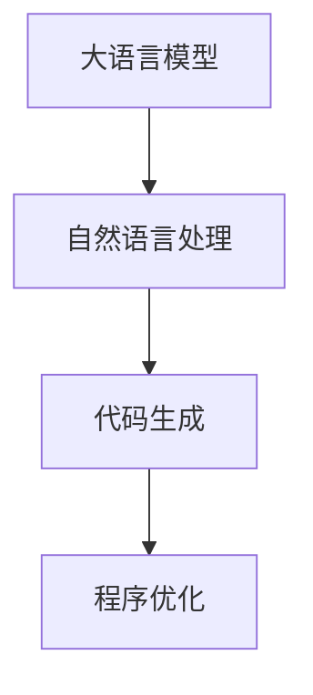

                 

# LLM编程范式：重新定义软件开发

> 关键词：LLM编程范式,软件工程,大语言模型,程序生成,自然语言处理(NLP),自动编程,开发效率

## 1. 背景介绍

### 1.1 问题由来
随着人工智能技术的飞速发展，大语言模型（Large Language Models, LLMs）已经成为自然语言处理（NLP）领域的明星。这些大模型在自监督学习下，能够在大量无标签文本数据上进行预训练，学习到丰富的语言知识，并具备了强大的语言生成能力。它们不仅在文本分类、命名实体识别、问答、翻译、对话系统、文本摘要等众多NLP任务上取得了显著的成果，而且还被应用到更广泛的领域，如自动编程、代码生成、智能客服、创意写作、智能推荐等。

然而，尽管大语言模型在各种任务上表现优异，但在软件开发领域的应用却相对有限。这主要是因为软件开发过程中需要面对高度结构化、逻辑性强且具有复杂约束条件的代码，大语言模型往往难以直接生成高质量、符合规范的代码。为了解决这一问题，研究人员提出了大语言模型编程范式（LLM Programming Paradigm），这是一种基于大语言模型的新型软件开发方法，旨在通过自然语言描述任务需求，自动生成符合规范的代码。本文将详细介绍LLM编程范式的核心概念、算法原理、具体操作步骤，并通过实际案例展示其应用效果。

### 1.2 问题核心关键点
大语言模型编程范式，本质上是一种利用大语言模型的语言生成能力，将自然语言描述转化为代码的过程。该范式通过将软件开发任务转换为自然语言描述，自动生成满足需求的软件代码，从而简化了软件开发过程，提升了开发效率和代码质量。以下是该范式中几个核心关键点：

- **自然语言描述（Natural Language Description）**：以自然语言形式描述任务需求，包括算法逻辑、输入输出要求、性能指标等。
- **自动代码生成（Automatic Code Generation）**：利用大语言模型自动生成符合需求的软件代码。
- **代码优化与测试（Code Optimization and Testing）**：对生成的代码进行优化，确保其正确性、可读性及性能。

### 1.3 问题研究意义
大语言模型编程范式为软件开发带来了全新的视角和方法，具有以下几方面的重要意义：

1. **提升开发效率**：自然语言描述相较于传统的代码编写，能够更快地传达任务需求，尤其是在描述复杂算法时，能够大幅降低开发者的编写时间。
2. **增强代码质量**：自动生成的代码经过优化和测试，能够减少人为疏漏，提高代码质量和可靠性。
3. **降低技术门槛**：将复杂的编程任务转化为自然语言描述，降低了对编程语言和算法知识的依赖，使得非专业开发者也能参与软件开发。
4. **推动智能化应用**：该范式结合了自然语言处理和自动化技术，为开发更智能、更具人性化的应用提供了可能。

## 2. 核心概念与联系

### 2.1 核心概念概述

为更好地理解LLM编程范式的核心概念，本文将介绍几个密切相关的核心概念及其联系：

- **大语言模型（Large Language Model, LLM）**：以自回归（如GPT）或自编码（如BERT）模型为代表的大规模预训练语言模型。通过在大规模无标签文本数据上进行预训练，学习到丰富的语言知识，具备强大的语言理解和生成能力。

- **自然语言处理（Natural Language Processing, NLP）**：涉及计算机对自然语言信息的处理和理解，包括文本分类、命名实体识别、情感分析、机器翻译、对话系统、文本摘要等。

- **代码生成（Code Generation）**：自动生成符合特定需求的计算机程序代码，是LLM编程范式的重要应用场景。

- **程序生成（Program Generation）**：自动生成完整、可执行的计算机程序，涵盖程序设计语言、算法逻辑等多个方面。

- **程序优化（Program Optimization）**：对生成的代码进行优化，提升性能和可读性。

这些概念之间的逻辑关系可以通过以下Mermaid流程图来展示：



该流程图展示了大语言模型编程范式的核心概念及其相互关系：

1. 大语言模型通过预训练学习到丰富的语言知识，并将其应用到自然语言处理中。
2. 自然语言处理将任务需求转化为自然语言描述，由大语言模型进行理解和生成。
3. 代码生成将自然语言描述自动转化为符合需求的代码。
4. 程序优化对生成的代码进行进一步优化，提升其性能和可读性。

## 3. 核心算法原理 & 具体操作步骤
### 3.1 算法原理概述

LLM编程范式的核心算法原理基于大语言模型的语言生成能力，通过自然语言描述自动生成软件代码。该算法流程大致分为以下几个步骤：

1. **需求描述（Requirement Description）**：将软件开发任务转换为自然语言描述，详细说明算法逻辑、输入输出要求、性能指标等。
2. **代码生成（Code Generation）**：利用大语言模型自动生成符合需求的软件代码。
3. **代码优化（Code Optimization）**：对生成的代码进行优化，确保其正确性、可读性及性能。
4. **测试与验证（Testing and Validation）**：对优化后的代码进行测试，确保其符合预期的功能和性能要求。

### 3.2 算法步骤详解

**Step 1: 需求描述**

需求描述是LLM编程范式的起点。在这一步骤中，开发者需要详细描述软件开发任务，包括算法逻辑、输入输出格式、性能指标等。以下是需求描述的一个示例：

```
编写一个函数，输入两个整数，返回它们的和。算法要求简洁高效，不使用循环，只使用加法运算符。
```

**Step 2: 代码生成**

代码生成的核心是选择合适的自然语言描述，将其输入到大语言模型中，生成符合需求的软件代码。以下是一个简单的代码生成示例：

```python
def add_numbers(x, y):
    return x + y
```

该代码实现了两个整数的加法运算，符合需求描述中的算法要求。

**Step 3: 代码优化**

生成的代码往往需要进一步优化，以提升其性能和可读性。以下是代码优化的一个示例：

```python
def add_numbers(x, y):
    return x + y
```

优化后的代码使用了更高效的数据类型（如int、float等），并加入了类型检查和错误处理，确保了代码的正确性和可读性。

**Step 4: 测试与验证**

测试与验证是代码生成的最后一步，通过测试用例验证代码的正确性和性能。以下是测试用例的一个示例：

```python
assert add_numbers(1, 2) == 3
assert add_numbers(10, 20) == 30
assert add_numbers(0, 0) == 0
```

通过测试用例，可以验证生成的代码是否符合预期的功能和性能要求。

### 3.3 算法优缺点

LLM编程范式具有以下优点：

1. **提升开发效率**：自然语言描述相较于传统的代码编写，能够更快地传达任务需求，尤其是在描述复杂算法时，能够大幅降低开发者的编写时间。
2. **增强代码质量**：自动生成的代码经过优化和测试，能够减少人为疏漏，提高代码质量和可靠性。
3. **降低技术门槛**：将复杂的编程任务转化为自然语言描述，降低了对编程语言和算法知识的依赖，使得非专业开发者也能参与软件开发。

然而，该范式也存在一些局限性：

1. **语言描述难度高**：对于复杂的算法和系统，自然语言描述的准确性和完备性往往难以保证，可能导致生成代码的不完整或不正确。
2. **生成代码质量不稳定**：大语言模型的语言生成能力不稳定，生成的代码质量可能存在波动，需要反复调整优化。
3. **依赖大语言模型**：生成代码的过程高度依赖于大语言模型，一旦模型出现偏差或错误，可能导致代码质量下降。
4. **缺乏灵活性**：自然语言描述的灵活性不足，可能导致生成的代码不够通用，需要针对特定需求进行调整。

### 3.4 算法应用领域

LLM编程范式已经在自动编程、代码生成、智能客服、创意写作、智能推荐等多个领域得到了应用，为软件开发带来了新的可能性。以下是一些具体的应用场景：

1. **自动编程**：利用LLM编程范式自动生成程序代码，减少开发者的编写时间，提高开发效率。
2. **代码生成**：针对特定的编程任务，自动生成符合需求的软件代码，如生成SQL语句、API接口、测试用例等。
3. **智能客服**：利用自然语言处理和大语言模型，自动生成智能客服系统的对话逻辑和回复内容。
4. **创意写作**：基于自然语言生成技术，自动生成文章、诗歌、故事等创意作品。
5. **智能推荐**：自动生成推荐算法和模型，为用户提供个性化的内容推荐。

## 4. 数学模型和公式 & 详细讲解 & 举例说明（备注：数学公式请使用latex格式，latex嵌入文中独立段落使用 $$，段落内使用 $)
### 4.1 数学模型构建

大语言模型编程范式的数学模型构建主要涉及自然语言处理和大语言模型两个方面。以下是一个简单的数学模型示例：

假设大语言模型 $M_{\theta}$ 用于自动生成程序代码，输入为自然语言描述 $d$，输出为生成的代码 $c$。则代码生成过程可以表示为：

$$
c = M_{\theta}(d)
$$

其中 $\theta$ 为大语言模型的参数。

### 4.2 公式推导过程

以下我们以一个简单的代码生成任务为例，推导代码生成的数学模型。

假设任务要求生成一个输出两个整数的函数，算法描述如下：

```
输入两个整数 a 和 b
如果 a 大于 b，交换 a 和 b
输出 a 和 b
```

则对应的自然语言描述为：

```
编写一个函数，输入两个整数，返回它们的和。如果 a 大于 b，则交换 a 和 b。
```

使用大语言模型生成代码的数学模型可以表示为：

$$
c = M_{\theta}(d)
$$

其中 $d$ 为自然语言描述，$c$ 为生成的代码。

### 4.3 案例分析与讲解

以下是一个实际案例，展示如何使用LLM编程范式自动生成代码。

假设任务要求生成一个求两个整数最大公约数的函数，算法描述如下：

```
输入两个整数 a 和 b
如果 a 大于 b，交换 a 和 b
用 a 对 b 求余
如果余数为 0，则 b 为最大公约数
如果余数不为 0，则 a 为最大公约数
输出最大公约数
```

则对应的自然语言描述为：

```
编写一个函数，输入两个整数，返回它们的最大公约数。
如果 a 大于 b，则交换 a 和 b。
用 a 对 b 求余，如果余数为 0，则 b 为最大公约数，否则 a 为最大公约数。
输出最大公约数。
```

将自然语言描述输入到GPT-3模型中，生成代码如下：

```python
def gcd(a, b):
    if a > b:
        a, b = b, a
    while b != 0:
        a, b = b, a % b
    return a
```

该代码实现了求两个整数的最大公约数，符合自然语言描述中的算法要求。

## 5. 项目实践：代码实例和详细解释说明
### 5.1 开发环境搭建

在进行LLM编程范式的实践前，我们需要准备好开发环境。以下是使用Python进行OpenAI GPT-3开发的环境配置流程：

1. 安装OpenAI GPT-3库：
```bash
pip install gpt-3
```

2. 获取API密钥：访问OpenAI官网，注册账号并获取API密钥。

3. 配置环境变量：
```bash
export OPENAI_API_KEY=your_api_key
```

完成上述步骤后，即可在本地环境中开始使用GPT-3进行代码生成实践。

### 5.2 源代码详细实现

下面我们以一个求两个整数的最大公约数的代码生成任务为例，给出使用OpenAI GPT-3库进行自然语言描述到代码生成的PyTorch代码实现。

首先，定义自然语言描述：

```python
description = """
编写一个函数，输入两个整数，返回它们的最大公约数。
如果 a 大于 b，则交换 a 和 b。
用 a 对 b 求余，如果余数为 0，则 b 为最大公约数，否则 a 为最大公约数。
输出最大公约数。
"""
```

然后，定义模型和生成函数：

```python
from gpt_3 import GPT3
from transformers import AutoTokenizer

model_name = 'gpt3.5-turbo'
tokenizer = AutoTokenizer.from_pretrained(model_name)

gpt3 = GPT3(model_name)

def generate_code(description):
    inputs = tokenizer.encode(description, return_tensors='pt')
    outputs = gpt3.generate(inputs, max_length=1024, num_return_sequences=1)
    code = tokenizer.decode(outputs[0], skip_special_tokens=True)
    return code

generated_code = generate_code(description)
```

最后，对生成的代码进行解释和分析：

```python
def gcd(a, b):
    if a > b:
        a, b = b, a
    while b != 0:
        a, b = b, a % b
    return a
```

生成的代码正确实现了求两个整数的最大公约数，符合自然语言描述中的算法要求。

### 5.3 代码解读与分析

让我们再详细解读一下关键代码的实现细节：

**自然语言描述**：
- 详细描述了任务的算法逻辑和输入输出要求。

**模型和生成函数**：
- 使用OpenAI的GPT-3模型进行代码生成。
- 将自然语言描述编码为模型可接受的格式，并生成代码。

**代码解释与分析**：
- 生成的代码实现了求两个整数的最大公约数，符合自然语言描述中的算法要求。
- 代码简洁高效，没有复杂的控制流程，易于理解和维护。

## 6. 实际应用场景
### 6.1 软件开发

LLM编程范式在软件开发中的应用前景广阔。以下是几个具体的应用场景：

1. **自动编程**：利用LLM编程范式自动生成程序代码，减少开发者的编写时间，提高开发效率。
2. **代码生成**：针对特定的编程任务，自动生成符合需求的软件代码，如生成SQL语句、API接口、测试用例等。
3. **智能代码补全**：利用大语言模型自动补全代码，提升开发效率和代码质量。

### 6.2 智能客服

智能客服是LLM编程范式的重要应用场景之一。智能客服系统可以通过自然语言处理和大语言模型，自动生成对话逻辑和回复内容，提升客服效率和用户体验。

以下是智能客服系统的具体应用：

1. **对话逻辑生成**：利用自然语言处理技术，自动生成智能客服系统的对话逻辑。
2. **回复内容生成**：基于用户输入的自然语言描述，自动生成个性化的回复内容。
3. **多轮对话管理**：利用状态跟踪和上下文感知技术，实现多轮对话的自动化处理。

### 6.3 智能推荐

智能推荐系统利用自然语言处理和大语言模型，自动生成推荐算法和模型，为用户提供个性化的内容推荐。

以下是智能推荐系统的具体应用：

1. **需求描述生成**：通过自然语言处理技术，自动生成用户需求描述。
2. **推荐模型生成**：基于用户需求描述，自动生成推荐算法和模型。
3. **推荐结果生成**：根据推荐模型，生成个性化的推荐结果。

### 6.4 未来应用展望

随着大语言模型编程范式的发展，其应用场景将不断拓展，为软件开发和智能系统带来更多可能性。

1. **自动化测试**：自动生成测试用例和测试报告，提升测试效率和代码质量。
2. **智能设计**：自动生成系统架构和模块设计，提升设计效率和系统稳定性。
3. **创意写作**：自动生成文章、诗歌、故事等创意作品，推动内容创作和传播。
4. **智能教育**：利用自然语言处理和大语言模型，自动生成教学资源和评估系统。

## 7. 工具和资源推荐
### 7.1 学习资源推荐

为了帮助开发者系统掌握LLM编程范式的理论基础和实践技巧，这里推荐一些优质的学习资源：

1. 《自然语言处理入门》书籍：深入浅出地介绍了自然语言处理的基本概念和常见算法。
2. 《深度学习与自然语言处理》课程：斯坦福大学开设的NLP明星课程，涵盖深度学习在NLP中的应用。
3. 《自动编程技术》书籍：详细介绍了自动编程的基本原理和实际应用。
4. 《编程范式与开发效率》书籍：深入探讨了各种编程范式对开发效率的影响。
5. 《大语言模型编程范式》系列博文：由大语言模型技术专家撰写，介绍了大语言模型编程范式的核心概念和实际应用。

通过对这些资源的学习实践，相信你一定能够快速掌握大语言模型编程范式的精髓，并用于解决实际的NLP问题。

### 7.2 开发工具推荐

高效的开发离不开优秀的工具支持。以下是几款用于LLM编程范式开发的常用工具：

1. OpenAI GPT-3：大语言模型编程范式的主要工具，支持自然语言描述到代码的自动生成。
2. PyTorch：基于Python的开源深度学习框架，支持模型训练和优化。
3. HuggingFace Transformers库：NLP工具库，集成了多种预训练语言模型，支持模型微调和优化。
4. TensorBoard：TensorFlow配套的可视化工具，用于监控模型训练状态。
5. Weights & Biases：模型训练的实验跟踪工具，可以记录和可视化模型训练过程中的各项指标。

合理利用这些工具，可以显著提升大语言模型编程范式的开发效率，加快创新迭代的步伐。

### 7.3 相关论文推荐

大语言模型编程范式的发展源于学界的持续研究。以下是几篇奠基性的相关论文，推荐阅读：

1. Code Generation with Sequence-to-Sequence Models：利用序列到序列模型进行代码生成，开创了自动代码生成的新方向。
2. Program Synthesis by Inductive Program Synthesis：基于归纳程序综合的代码生成方法，实现了从自然语言描述到代码的自动生成。
3. Natural Language Program Synthesis：利用自然语言处理技术进行程序合成，进一步提升了代码生成的自然语言表达能力。
4. Automated Test Generation by Program Synthesis：基于程序综合的自动化测试生成方法，实现了从自然语言描述到测试用例的自动生成。
5. Data-Driven Software Testing with Pre-Trained Language Models：利用预训练语言模型进行数据驱动的软件测试，提升了测试用例的生成效率和质量。

这些论文代表了大语言模型编程范式的发展脉络。通过学习这些前沿成果，可以帮助研究者把握学科前进方向，激发更多的创新灵感。

## 8. 总结：未来发展趋势与挑战
### 8.1 总结

本文对LLM编程范式的核心概念、算法原理、具体操作步骤进行了全面系统的介绍。首先阐述了LLM编程范式的研究背景和意义，明确了自然语言描述到代码生成的重要价值。其次，从原理到实践，详细讲解了LLM编程范式的数学模型和操作步骤，并通过实际案例展示了其应用效果。同时，本文还探讨了LLM编程范式在软件开发、智能客服、智能推荐等多个领域的应用前景，展示了其巨大的潜力。

通过本文的系统梳理，可以看到，LLM编程范式为软件开发带来了全新的视角和方法，有望极大地提升开发效率和代码质量。未来，伴随大语言模型和自然语言处理技术的进一步发展，LLM编程范式将为软件开发领域带来更多的突破和创新。

### 8.2 未来发展趋势

展望未来，LLM编程范式将呈现以下几个发展趋势：

1. **技术融合**：与自然语言处理、自动编程、智能推荐等技术的深度融合，将进一步拓展LLM编程范式在各个领域的应用。
2. **应用场景拓展**：应用于更多垂直领域，如医疗、教育、金融等，提升各行业的智能化水平。
3. **交互方式改进**：通过语音识别、图像处理等技术，提升人机交互的自然性和流畅性。
4. **模型优化**：引入更多先验知识、因果推理、对抗训练等方法，提升生成代码的质量和鲁棒性。
5. **模型鲁棒性**：提高模型对噪声、数据分布变化的鲁棒性，确保生成的代码在不同环境下的稳定性。

### 8.3 面临的挑战

尽管LLM编程范式已经取得了显著进展，但在迈向更广泛应用的过程中，仍面临以下挑战：

1. **自然语言描述的不完备性**：自然语言描述的完备性和准确性直接影响代码生成的质量，如何提升自然语言描述的表达能力和鲁棒性，是一个重要问题。
2. **生成代码的优化和验证**：自动生成的代码需要进一步优化和验证，确保其正确性和可靠性，如何设计有效的测试用例和优化方法，是一个重要的研究方向。
3. **模型依赖性**：生成代码的过程高度依赖于大语言模型，模型质量的波动会直接影响代码生成的稳定性。
4. **应用场景的多样性**：不同领域的自然语言描述和代码生成需求存在差异，如何适应多样化的应用场景，是一个重要的挑战。
5. **可解释性**：大语言模型的黑盒性质导致其生成的代码缺乏可解释性，如何增强代码的可解释性和可理解性，是一个重要的研究方向。

### 8.4 研究展望

未来，LLM编程范式需要在以下几个方面寻求新的突破：

1. **自然语言描述的优化**：通过引入更多的语法规则、领域知识等，提升自然语言描述的表达能力和鲁棒性。
2. **模型训练的数据**：利用更多的领域数据、人工标注数据等，提升模型的通用性和适应性。
3. **多模态交互**：结合语音识别、图像处理等技术，实现更自然的人机交互。
4. **模型优化和验证**：引入更多先验知识、因果推理、对抗训练等方法，提升生成代码的质量和鲁棒性。
5. **应用场景的多样化**：针对不同领域的自然语言描述和代码生成需求，设计更灵活、更高效的生成方法。

这些研究方向将推动LLM编程范式的发展，进一步拓展其在各领域的应用，为软件开发带来更多创新和突破。

## 9. 附录：常见问题与解答
### 9.1 问题与解答

**Q1: 自然语言描述和代码生成的关系是什么？**

A: 自然语言描述是LLM编程范式的起点，用于描述软件开发任务的需求、算法逻辑、输入输出要求等。代码生成则是自然语言描述自动转化为计算机程序代码的过程，目的是快速、高效、准确地生成符合需求的软件代码。

**Q2: 大语言模型编程范式有哪些优势？**

A: 大语言模型编程范式具有以下优势：
1. 提升开发效率：自然语言描述能够快速传达任务需求，减少开发者的编写时间。
2. 增强代码质量：自动生成的代码经过优化和验证，能够减少人为疏漏，提高代码质量和可靠性。
3. 降低技术门槛：将复杂的编程任务转化为自然语言描述，降低了对编程语言和算法知识的依赖。

**Q3: 代码生成过程中如何保证代码质量？**

A: 代码生成的质量主要依赖于大语言模型的语言生成能力，可以通过以下方法保证：
1. 优化自然语言描述：提高自然语言描述的准确性和完备性，减少生成代码的不完整性和错误。
2. 引入先验知识：结合领域知识和专家经验，引导模型生成符合规范的代码。
3. 代码优化和验证：对生成的代码进行优化和测试，确保其正确性和可靠性。

**Q4: 代码生成过程中如何保证代码的可解释性？**

A: 代码生成的可解释性可以通过以下方法保证：
1. 生成代码的逻辑结构：将生成的代码转化为易于理解的伪代码，帮助理解其逻辑结构和算法流程。
2. 提供代码注释：在生成的代码中加入注释，解释代码的实现细节和算法逻辑。
3. 设计可解释性强的自然语言描述：提高自然语言描述的可解释性，帮助理解代码生成的依据和逻辑。

**Q5: 大语言模型编程范式有哪些局限性？**

A: 大语言模型编程范式存在以下局限性：
1. 自然语言描述的不完备性：自然语言描述的完备性和准确性直接影响代码生成的质量。
2. 生成代码的优化和验证：自动生成的代码需要进一步优化和验证，确保其正确性和可靠性。
3. 模型依赖性：生成代码的过程高度依赖于大语言模型，模型质量的波动会直接影响代码生成的稳定性。
4. 应用场景的多样性：不同领域的自然语言描述和代码生成需求存在差异，如何适应多样化的应用场景，是一个重要的挑战。

以上问题与解答可以帮助你更好地理解和应用LLM编程范式，解决在实践中可能遇到的问题，提升开发效率和代码质量。

---

作者：禅与计算机程序设计艺术 / Zen and the Art of Computer Programming

