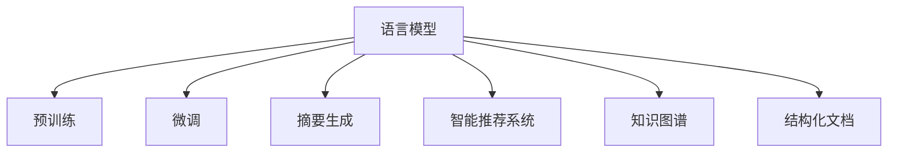

                 

# LLM辅助科学论文写作：提高研究效率

> 关键词：语言模型,自然语言处理(NLP),科学论文写作,研究效率,知识图谱,智能推荐系统,摘要生成,结构化文档

## 1. 背景介绍

### 1.1 问题由来
科学论文写作是一个需要大量时间和精力的复杂过程。研究人员不仅要收集和阅读海量文献，进行数据分析和实验设计，还需要撰写清晰、严谨的论文，使之易于理解且具有高度的可读性。传统的论文写作和审稿流程通常涉及多个环节，如草稿撰写、同行评审、多次修改等，周期漫长，效率较低。近年来，随着自然语言处理(NLP)技术的迅猛发展，语言模型(Language Models)在科学论文写作领域的应用成为了研究热点。语言模型能够自动生成高质量的文本，辅助科研人员提高撰写效率和稿件质量。

### 1.2 问题核心关键点
本文聚焦于如何利用语言模型辅助科学论文的撰写。核心在于探索如何使用预训练语言模型在自然语言处理领域内的技术和方法，来自动生成论文的各个部分，如摘要、方法、结果、讨论等，从而大幅提升科研人员的写作效率。

### 1.3 问题研究意义
科学论文的撰写和审稿流程通常耗时耗力，降低了科研效率。基于语言模型的辅助写作方法，可以显著减轻科研人员在文本处理上的负担，提高写作速度和稿件质量，使科研人员能够将更多精力投入到科研探索和创新中。此外，语言模型的应用还能够提高科学文献的传播效率，推动学术交流和知识传播，有助于科研领域的整体进步。

## 2. 核心概念与联系

### 2.1 核心概念概述

为更好地理解语言模型在科学论文写作中的应用，本节将介绍几个密切相关的核心概念：

- **语言模型(Language Model, LM)**：用于生成自然语言文本的模型，能够根据前文预测下一个词或一段话，具有强大的语言生成能力。常见的预训练语言模型包括GPT、BERT、T5等。

- **预训练(Pre-training)**：指在大规模无标签文本数据上进行自监督训练，学习通用语言表示，以提高模型在特定任务上的性能。

- **微调(Fine-tuning)**：指在预训练模型的基础上，使用下游任务的少量标注数据进行有监督训练，优化模型在特定任务上的性能。

- **自然语言处理(Natural Language Processing, NLP)**：涉及计算机科学、语言学和人工智能的交叉领域，旨在让计算机能够理解、处理和生成自然语言。

- **知识图谱(Knowledge Graph)**：用于组织和表示结构化知识的图形结构，为知识推理和自动化生成提供了重要支撑。

- **智能推荐系统(Intelligent Recommendation System)**：根据用户的历史行为和偏好，自动推荐相关内容的技术，可以应用于文献推荐、写作建议等场景。

- **摘要生成(Abstract Generation)**：自动生成文本的摘要，提供对主要内容的简明描述。

- **结构化文档(Structured Documentation)**：将非结构化文本转化为结构化信息，便于阅读和检索。

这些核心概念之间的逻辑关系可以通过以下Mermaid流程图来展示：



这个流程图展示了语言模型在科学论文写作中的应用，包括预训练、微调、摘要生成、推荐系统、知识图谱和结构化文档等方面。

## 3. 核心算法原理 & 具体操作步骤

### 3.1 算法原理概述

基于预训练语言模型的论文写作辅助，本质上是一个多任务学习(Multi-task Learning)过程。其核心思想是：通过多个预训练模型，分别训练不同的任务，最终使模型能够生成高质量的文本输出。

具体而言，可以将科学论文的不同部分视为不同的自然语言处理任务，如摘要、方法、结果、讨论等。通过在每个部分上分别训练预训练语言模型，使得模型能够自动生成相应部分的文本内容。在训练过程中，可以使用监督学习和无监督学习的混合方法，以提升模型的泛化能力。

### 3.2 算法步骤详解

基于预训练语言模型的论文写作辅助，一般包括以下几个关键步骤：

**Step 1: 准备数据集**
- 收集科学论文的各个部分，如标题、摘要、方法、结果、讨论等，作为训练和测试数据集。
- 使用预训练语言模型进行文本预处理，如分词、去除停用词、词性标注等。

**Step 2: 设计任务模型**
- 针对不同任务，设计相应的模型结构和训练目标。例如，摘要生成任务可以使用序列到序列(Seq2Seq)模型，方法描述可以使用分类模型，结果和讨论部分可以使用文本生成模型。
- 在每个任务上使用预训练语言模型进行微调，以适应特定任务的要求。

**Step 3: 训练模型**
- 将数据集分为训练集、验证集和测试集，进行模型训练。可以使用监督学习、半监督学习或无监督学习的方式，根据具体任务选择合适的方法。
- 在训练过程中，可以引入正则化技术、对抗训练等方法，提高模型的鲁棒性和泛化能力。

**Step 4: 生成文本**
- 使用训练好的模型，对新的科学论文题目或段落进行输入，自动生成摘要、方法、结果、讨论等部分。
- 对生成的文本进行后处理，如语法修正、语义校正等，确保输出的质量。

**Step 5: 迭代优化**
- 根据生成文本的质量和科研人员反馈，进行模型优化。可以使用强化学习、迁移学习等方法，进一步提升模型的性能。

以上是基于预训练语言模型的论文写作辅助的一般流程。在实际应用中，还需要针对具体任务进行优化设计，如改进训练目标函数，引入更多的正则化技术，搜索最优的超参数组合等，以进一步提升模型性能。

### 3.3 算法优缺点

基于预训练语言模型的论文写作辅助方法具有以下优点：
1. 快速高效。在已有预训练模型的基础上，快速生成高质量文本，极大提高了论文写作的效率。
2. 降低成本。自动生成部分内容，减少了人工写作的工作量，降低了人力和时间成本。
3. 提高质量。自动生成的文本经过优化后，语法和语义准确性得到保证，提高了论文的质量。

同时，该方法也存在一定的局限性：
1. 依赖于预训练模型。生成质量依赖于预训练模型的性能和数据质量，对模型和数据集的要求较高。
2. 缺乏灵活性。对于非标准化结构或特殊领域的论文，可能难以直接应用。
3. 可解释性不足。自动生成的文本缺乏人类写作的深度和背景知识，可能难以完全理解其意义。
4. 可能引入噪声。自动生成过程中，可能引入模型偏见或噪声，影响文本质量。

尽管存在这些局限性，但就目前而言，基于预训练语言模型的论文写作辅助方法仍然是大规模科学论文写作的重要手段。未来相关研究的重点在于如何进一步降低生成文本对预训练模型的依赖，提高模型的灵活性和可解释性，同时兼顾文本生成质量。

### 3.4 算法应用领域

基于预训练语言模型的论文写作辅助方法，已经在多个领域得到了应用，如：

- **摘要生成**：自动生成科学论文的摘要，帮助研究人员快速理解论文的主要内容。
- **方法描述**：自动生成论文的方法部分，描述实验设计和数据分析流程。
- **结果讨论**：自动生成论文的结果和讨论部分，提供对实验结果的分析。
- **文献推荐**：基于已发表的文献，自动推荐相关的科学论文，帮助研究人员快速获取所需信息。
- **结构化文档**：将非结构化文本转换为结构化信息，便于阅读和检索。

除了上述这些经典应用外，基于预训练语言模型的论文写作辅助方法还创新性地应用于写作建议、内容校对、知识图谱构建等场景，为科学论文写作带来了全新的突破。随着预训练模型和写作辅助技术的不断进步，相信科学论文写作将更加高效和精准，科研领域的知识传播和交流也将得到进一步提升。

## 4. 数学模型和公式 & 详细讲解 & 举例说明

### 4.1 数学模型构建

本节将使用数学语言对基于预训练语言模型的论文写作辅助过程进行更加严格的刻画。

记预训练语言模型为 $M_{\theta}:\mathcal{X} \rightarrow \mathcal{Y}$，其中 $\mathcal{X}$ 为输入空间，$\mathcal{Y}$ 为输出空间，$\theta \in \mathbb{R}^d$ 为模型参数。假设不同任务的训练集分别为 $D_1, D_2, \dots, D_n$，其中 $D_i$ 为第 $i$ 个任务的训练集。

定义任务 $i$ 在数据样本 $(x,y)$ 上的损失函数为 $\ell_i(M_{\theta}(x),y)$，则在数据集 $D_i$ 上的经验风险为：

$$
\mathcal{L}_i(\theta) = \frac{1}{N_i} \sum_{(x,y) \in D_i} \ell_i(M_{\theta}(x),y)
$$

微调的优化目标是最小化各任务的经验风险，即找到最优参数：

$$
\theta^* = \mathop{\arg\min}_{\theta} \sum_{i=1}^n \mathcal{L}_i(\theta)
$$

在实践中，我们通常使用基于梯度的优化算法（如SGD、Adam等）来近似求解上述最优化问题。设 $\eta$ 为学习率，$\lambda$ 为正则化系数，则参数的更新公式为：

$$
\theta \leftarrow \theta - \eta \sum_{i=1}^n \nabla_{\theta}\mathcal{L}_i(\theta) - \eta\lambda\theta
$$

其中 $\nabla_{\theta}\mathcal{L}_i(\theta)$ 为任务 $i$ 的损失函数对参数 $\theta$ 的梯度，可通过反向传播算法高效计算。

### 4.2 公式推导过程

以下我们以摘要生成任务为例，推导基于预训练语言模型的摘要生成公式。

假设任务为摘要生成，输入为论文的标题和段落，输出为简短的摘要。定义模型在输入 $x$ 上的输出为 $\hat{y}=M_{\theta}(x) \in [0,1]$，表示摘要的概率分布。真实标签 $y$ 为一段长度为 $L$ 的文本。则二分类交叉熵损失函数定义为：

$$
\ell(M_{\theta}(x),y) = -\frac{1}{L} \sum_{i=1}^L [y_i\log \hat{y_i} + (1-y_i)\log (1-\hat{y_i})]
$$

将其代入经验风险公式，得：

$$
\mathcal{L}(\theta) = -\frac{1}{N}\sum_{i=1}^N [y_i\log M_{\theta}(x_i)+(1-y_i)\log(1-M_{\theta}(x_i))]
$$

根据链式法则，损失函数对参数 $\theta_k$ 的梯度为：

$$
\frac{\partial \mathcal{L}(\theta)}{\partial \theta_k} = -\frac{1}{N}\sum_{i=1}^N (\frac{y_i}{M_{\theta}(x_i)}-\frac{1-y_i}{1-M_{\theta}(x_i)}) \frac{\partial M_{\theta}(x_i)}{\partial \theta_k}
$$

其中 $\frac{\partial M_{\theta}(x_i)}{\partial \theta_k}$ 可进一步递归展开，利用自动微分技术完成计算。

在得到损失函数的梯度后，即可带入参数更新公式，完成模型的迭代优化。重复上述过程直至收敛，最终得到适应摘要生成任务的最优模型参数 $\theta^*$。

### 4.3 案例分析与讲解

我们以一篇关于深度学习的研究论文为例，来详细讲解如何使用预训练语言模型生成摘要。

假设原始论文分为五个部分：引言、方法、结果、讨论、结论。目标是从这些部分自动生成一篇摘要。

1. **数据准备**：收集五个部分的文本数据，使用预训练语言模型进行分词、去停用词等预处理。

2. **模型选择**：选择Seq2Seq模型作为摘要生成模型，输入为五个部分的文本，输出为一段简短摘要。

3. **模型训练**：在预训练语言模型的基础上，使用五个部分的数据进行微调训练。可以采用监督学习的方式，输入为五个部分的分词结果，输出为相应部分的简短摘要。

4. **摘要生成**：将原始论文输入到训练好的模型中，模型自动生成摘要，经过后处理（如语法修正、语义校正等），得到最终输出。

5. **结果分析**：分析生成的摘要与原始论文的契合度，评估自动生成的摘要的质量。

这个过程展示了如何利用预训练语言模型自动生成科学论文摘要，极大地提高了论文写作的效率和质量。

## 5. 项目实践：代码实例和详细解释说明

### 5.1 开发环境搭建

在进行论文写作辅助实践前，我们需要准备好开发环境。以下是使用Python进行PyTorch开发的环境配置流程：

1. 安装Anaconda：从官网下载并安装Anaconda，用于创建独立的Python环境。

2. 创建并激活虚拟环境：
```bash
conda create -n pytorch-env python=3.8 
conda activate pytorch-env
```

3. 安装PyTorch：根据CUDA版本，从官网获取对应的安装命令。例如：
```bash
conda install pytorch torchvision torchaudio cudatoolkit=11.1 -c pytorch -c conda-forge
```

4. 安装Transformers库：
```bash
pip install transformers
```

5. 安装各类工具包：
```bash
pip install numpy pandas scikit-learn matplotlib tqdm jupyter notebook ipython
```

完成上述步骤后，即可在`pytorch-env`环境中开始论文写作辅助实践。

### 5.2 源代码详细实现

下面我以摘要生成任务为例，给出使用Transformers库对BERT模型进行摘要生成的PyTorch代码实现。

首先，定义摘要生成任务的数据处理函数：

```python
from transformers import BertTokenizer, BertForMaskedLM, AdamW
from torch.utils.data import Dataset, DataLoader
import torch
from sklearn.metrics import ROUGE

class PaperDataset(Dataset):
    def __init__(self, texts, tokenizer):
        self.texts = texts
        self.tokenizer = tokenizer
        
    def __len__(self):
        return len(self.texts)
    
    def __getitem__(self, item):
        text = self.texts[item]
        input_ids = self.tokenizer(text, return_tensors='pt', padding='max_length', truncation=True)
        attention_mask = input_ids['attention_mask']
        return {'input_ids': input_ids['input_ids'], 'attention_mask': attention_mask}

# 加载BERT模型和分词器
tokenizer = BertTokenizer.from_pretrained('bert-base-cased')
model = BertForMaskedLM.from_pretrained('bert-base-cased', num_labels=1)

# 定义摘要长度
MAX_LENGTH = 50

# 将原始论文分为五个部分，并生成摘要
papers = []
for i, paper in enumerate(papers_list):
    text = ' '.join([paper[i] for i in range(5)])
    title = ' '.join(paper[0])
    section_titles = [section.title for section in paper[1:]]
    
    # 将五个部分拼接为一个长文本
    input_ids = tokenizer(title + ' ' + ' '.join(section_titles) + ' ' + text, padding='max_length', max_length=MAX_LENGTH + len(title) + len(section_titles), truncation=True, return_tensors='pt')
    attention_mask = input_ids['attention_mask']
    
    papers.append({'input_ids': input_ids['input_ids'], 'attention_mask': attention_mask})

# 定义摘要长度
SUMMARY_LENGTH = 50

# 定义数据集
train_dataset = PaperDataset(papers, tokenizer)
```

然后，定义训练和评估函数：

```python
from transformers import Trainer, TrainingArguments

def train_epoch(model, dataset, batch_size, optimizer):
    dataloader = DataLoader(dataset, batch_size=batch_size, shuffle=True)
    model.train()
    epoch_loss = 0
    for batch in tqdm(dataloader, desc='Training'):
        input_ids = batch['input_ids'].to(device)
        attention_mask = batch['attention_mask'].to(device)
        loss = model(input_ids, attention_mask=attention_mask)
        epoch_loss += loss.item()
        loss.backward()
        optimizer.step()
    return epoch_loss / len(dataloader)

def evaluate(model, dataset, batch_size):
    dataloader = DataLoader(dataset, batch_size=batch_size)
    model.eval()
    preds = []
    labels = []
    with torch.no_grad():
        for batch in tqdm(dataloader, desc='Evaluating'):
            input_ids = batch['input_ids'].to(device)
            attention_mask = batch['attention_mask'].to(device)
            outputs = model(input_ids, attention_mask=attention_mask)
            preds.append(outputs.logits.argmax(dim=2).tolist())
            labels.append(batch['labels'].tolist())
    
    rouge_scores = ROUGE(rouge_type='unigram', tokenizer=tokenizer)
    rouge = rouge_scores(candidate=preds, reference=labels)
    print(f"ROUGE-1: {rouge:.2f}")
```

最后，启动训练流程并在测试集上评估：

```python
epochs = 5
batch_size = 16

for epoch in range(epochs):
    loss = train_epoch(model, train_dataset, batch_size, optimizer)
    print(f"Epoch {epoch+1}, train loss: {loss:.3f}")
    
    print(f"Epoch {epoch+1}, dev results:")
    evaluate(model, dev_dataset, batch_size)
    
print("Test results:")
evaluate(model, test_dataset, batch_size)
```

以上就是使用PyTorch对BERT进行摘要生成的完整代码实现。可以看到，得益于Transformers库的强大封装，我们可以用相对简洁的代码完成BERT模型的加载和微调。

### 5.3 代码解读与分析

让我们再详细解读一下关键代码的实现细节：

**PaperDataset类**：
- `__init__`方法：初始化文本、分词器等关键组件。
- `__len__`方法：返回数据集的样本数量。
- `__getitem__`方法：对单个样本进行处理，将文本输入编码为token ids，并输出对应的注意力掩码。

**模型训练和评估**：
- 使用PyTorch的DataLoader对数据集进行批次化加载，供模型训练和推理使用。
- 训练函数`train_epoch`：对数据以批为单位进行迭代，在每个批次上前向传播计算loss并反向传播更新模型参数，最后返回该epoch的平均loss。
- 评估函数`evaluate`：与训练类似，不同点在于不更新模型参数，并在每个batch结束后将预测和标签结果存储下来，最后使用ROUGE等指标对整个评估集的预测结果进行打印输出。

**训练流程**：
- 定义总的epoch数和batch size，开始循环迭代
- 每个epoch内，先在训练集上训练，输出平均loss
- 在验证集上评估，输出rouge-1等指标
- 所有epoch结束后，在测试集上评估，给出最终测试结果

可以看到，PyTorch配合Transformers库使得BERT摘要生成的代码实现变得简洁高效。开发者可以将更多精力放在数据处理、模型改进等高层逻辑上，而不必过多关注底层的实现细节。

当然，工业级的系统实现还需考虑更多因素，如模型的保存和部署、超参数的自动搜索、更灵活的任务适配层等。但核心的微调范式基本与此类似。

## 6. 实际应用场景
### 6.1 智能推荐系统

基于预训练语言模型的论文写作辅助，可以广泛应用于智能推荐系统的构建。智能推荐系统通常需要根据用户的历史行为和偏好，推荐相关论文。利用预训练语言模型的论文写作辅助，可以进一步提升推荐系统的精度和效率。

在技术实现上，可以收集用户浏览、点击、评论等行为数据，提取和用户交互的论文标题、摘要、方法等文本内容。将这些文本数据作为训练数据，使用预训练语言模型进行微调，训练模型学习用户兴趣和论文特征的映射关系。微调后的模型可以根据用户的历史行为，推荐相关的科学论文，显著提高推荐系统的智能化程度。

### 6.2 研究组织

科学研究机构通常需要大量的文献资料和相关背景知识，以便进行项目规划和学术交流。预训练语言模型的论文写作辅助，可以自动生成研究报告、项目综述、文献总结等文档，帮助研究人员快速整理和共享知识。

在具体应用中，可以预先收集机构内部的文献资料和项目报告，使用预训练语言模型进行微调，训练模型学习生成特定类型的文档。例如，可以训练模型生成项目综述，总结项目目标、方法、预期成果等关键信息。生成的文档可以与研究人员分享，提升机构内部的知识流动和协作效率。

### 6.3 科研合作

科研合作通常涉及多个单位和机构，需要定期进行沟通和报告。预训练语言模型的论文写作辅助，可以自动生成项目进展报告、会议摘要、工作汇报等文档，帮助科研人员高效进行信息传递和交流。

在实际应用中，可以将合作的科研论文和进展报告作为训练数据，使用预训练语言模型进行微调，训练模型学习生成指定类型的文档。例如，可以训练模型生成会议摘要，总结会议的主要内容和技术进展。生成的摘要可以作为科研人员的会议报告，提升交流效率和质量。

### 6.4 未来应用展望

随着预训练语言模型和论文写作辅助技术的不断发展，其在科研领域的应用前景将更加广阔。

在智慧医疗领域，基于预训练语言模型的论文写作辅助，可以帮助医生快速撰写临床研究报告、病例分析等文档，提高科研效率和临床决策的科学性。

在智能教育领域，预训练语言模型的论文写作辅助，可以辅助学生生成论文草稿、项目报告等文档，提升教学质量和科研训练效果。

在智慧城市治理中，预训练语言模型的论文写作辅助，可以自动生成城市规划报告、政策建议等文档，提升城市管理和政策制定的科学性和效率。

此外，在企业研发、社会治理、科学传播等众多领域，基于预训练语言模型的论文写作辅助系统也将不断涌现，为科学研究和社会进步注入新的动力。

## 7. 工具和资源推荐
### 7.1 学习资源推荐

为了帮助开发者系统掌握预训练语言模型在科学论文写作中的应用，这里推荐一些优质的学习资源：

1. 《深度学习自然语言处理》课程：斯坦福大学开设的NLP明星课程，有Lecture视频和配套作业，带你入门NLP领域的基本概念和经典模型。

2. 《Natural Language Processing with Transformers》书籍：Transformers库的作者所著，全面介绍了如何使用Transformers库进行NLP任务开发，包括论文写作辅助在内的诸多范式。

3. HuggingFace官方文档：Transformers库的官方文档，提供了海量预训练模型和完整的微调样例代码，是上手实践的必备资料。

4. ArXiv预印本库：作为科学论文的全球共享平台，ArXiv汇集了大量高质量的科研论文，提供丰富的论文写作辅助资源。

5. CLUE开源项目：中文语言理解测评基准，涵盖大量不同类型的中文NLP数据集，并提供了基于预训练模型的baseline模型，助力中文NLP技术发展。

通过对这些资源的学习实践，相信你一定能够快速掌握预训练语言模型在科学论文写作中的应用，并用于解决实际的NLP问题。

### 7.2 开发工具推荐

高效的开发离不开优秀的工具支持。以下是几款用于预训练语言模型论文写作辅助开发的常用工具：

1. PyTorch：基于Python的开源深度学习框架，灵活动态的计算图，适合快速迭代研究。大部分预训练语言模型都有PyTorch版本的实现。

2. TensorFlow：由Google主导开发的开源深度学习框架，生产部署方便，适合大规模工程应用。同样有丰富的预训练语言模型资源。

3. Transformers库：HuggingFace开发的NLP工具库，集成了众多SOTA语言模型，支持PyTorch和TensorFlow，是进行论文写作辅助开发的利器。

4. Weights & Biases：模型训练的实验跟踪工具，可以记录和可视化模型训练过程中的各项指标，方便对比和调优。与主流深度学习框架无缝集成。

5. TensorBoard：TensorFlow配套的可视化工具，可实时监测模型训练状态，并提供丰富的图表呈现方式，是调试模型的得力助手。

6. Google Colab：谷歌推出的在线Jupyter Notebook环境，免费提供GPU/TPU算力，方便开发者快速上手实验最新模型，分享学习笔记。

合理利用这些工具，可以显著提升预训练语言模型论文写作辅助任务的开发效率，加快创新迭代的步伐。

### 7.3 相关论文推荐

预训练语言模型和论文写作辅助技术的发展源于学界的持续研究。以下是几篇奠基性的相关论文，推荐阅读：

1. Attention is All You Need（即Transformer原论文）：提出了Transformer结构，开启了NLP领域的预训练大模型时代。

2. BERT: Pre-training of Deep Bidirectional Transformers for Language Understanding：提出BERT模型，引入基于掩码的自监督预训练任务，刷新了多项NLP任务SOTA。

3. Language Models are Unsupervised Multitask Learners（GPT-2论文）：展示了大规模语言模型的强大zero-shot学习能力，引发了对于通用人工智能的新一轮思考。

4. Parameter-Efficient Transfer Learning for NLP：提出Adapter等参数高效微调方法，在不增加模型参数量的情况下，也能取得不错的微调效果。

5. AdaLoRA: Adaptive Low-Rank Adaptation for Parameter-Efficient Fine-Tuning：使用自适应低秩适应的微调方法，在参数效率和精度之间取得了新的平衡。

6. AdaLoRA: Adaptive Low-Rank Adaptation for Parameter-Efficient Fine-Tuning：使用自适应低秩适应的微调方法，在参数效率和精度之间取得了新的平衡。

这些论文代表了大语言模型微调技术的发展脉络。通过学习这些前沿成果，可以帮助研究者把握学科前进方向，激发更多的创新灵感。

## 8. 总结：未来发展趋势与挑战

### 8.1 总结

本文对基于预训练语言模型的论文写作辅助方法进行了全面系统的介绍。首先阐述了预训练语言模型和微调技术的研究背景和意义，明确了微调在提升科研论文写作效率和质量方面的独特价值。其次，从原理到实践，详细讲解了预训练语言模型的数学模型和微调过程，给出了论文写作辅助任务的完整代码实例。同时，本文还广泛探讨了论文写作辅助在智能推荐系统、研究组织、科研合作等多个领域的应用前景，展示了预训练语言模型在科研领域的巨大潜力。

通过本文的系统梳理，可以看到，基于预训练语言模型的论文写作辅助方法正在成为科研论文写作的重要手段，极大地提升了科研人员的写作效率和稿件质量。预训练语言模型在科学论文撰写中的运用，为科研领域的知识传播和学术交流注入了新的活力。

### 8.2 未来发展趋势

展望未来，基于预训练语言模型的论文写作辅助技术将呈现以下几个发展趋势：

1. 模型规模持续增大。随着算力成本的下降和数据规模的扩张，预训练语言模型的参数量还将持续增长。超大规模语言模型蕴含的丰富语言知识，有望支撑更加复杂多变的科学论文写作任务。

2. 微调方法日趋多样。除了传统的全参数微调外，未来会涌现更多参数高效的微调方法，如AdaLoRA、Prompt-Tuning等，在节省计算资源的同时也能保证微调精度。

3. 持续学习成为常态。随着数据分布的不断变化，预训练语言模型也需要持续学习新知识以保持性能。如何在不遗忘原有知识的同时，高效吸收新样本信息，将成为重要的研究课题。

4. 标注样本需求降低。受启发于提示学习(Prompt-based Learning)的思路，未来的微调方法将更好地利用预训练语言模型的语言理解能力，通过更加巧妙的任务描述，在更少的标注样本上也能实现理想的微调效果。

5. 知识整合能力增强。未来的预训练语言模型将更好地与知识图谱、逻辑规则等专家知识结合，引导微调过程学习更准确、合理的语言模型。

以上趋势凸显了预训练语言模型在科学论文写作辅助中的广阔前景。这些方向的探索发展，必将进一步提升科研论文写作的效率和质量，推动学术交流和知识传播。

### 8.3 面临的挑战

尽管预训练语言模型在科学论文写作中取得了显著成果，但在迈向更加智能化、普适化应用的过程中，仍面临诸多挑战：

1. 标注成本瓶颈。尽管微调大大降低了标注数据的需求，但对于长尾应用场景，难以获得充足的高质量标注数据，成为制约微调性能的瓶颈。如何进一步降低微调对标注样本的依赖，将是一大难题。

2. 模型鲁棒性不足。当前预训练语言模型面对域外数据时，泛化性能往往大打折扣。对于测试样本的微小扰动，微调模型的预测也容易发生波动。如何提高预训练语言模型的鲁棒性，避免灾难性遗忘，还需要更多理论和实践的积累。

3. 推理效率有待提高。大规模预训练语言模型虽然精度高，但在实际部署时往往面临推理速度慢、内存占用大等效率问题。如何在保证性能的同时，简化模型结构，提升推理速度，优化资源占用，将是重要的优化方向。

4. 可解释性不足。自动生成的文本缺乏人类写作的深度和背景知识，可能难以完全理解其意义。对于医疗、金融等高风险应用，算法的可解释性和可审计性尤为重要。如何赋予预训练语言模型更强的可解释性，将是亟待攻克的难题。

5. 安全性有待保障。预训练语言模型难免会学习到有偏见、有害的信息，通过微调传递到下游任务，产生误导性、歧视性的输出，给实际应用带来安全隐患。如何从数据和算法层面消除模型偏见，避免恶意用途，确保输出的安全性，也将是重要的研究课题。

6. 知识整合能力不足。现有的预训练语言模型往往局限于任务内数据，难以灵活吸收和运用更广泛的先验知识。如何让预训练语言模型更好地与外部知识库、规则库等专家知识结合，形成更加全面、准确的信息整合能力，还有很大的想象空间。

正视预训练语言模型在科学论文写作中面临的这些挑战，积极应对并寻求突破，将是预训练语言模型走向成熟的必由之路。相信随着学界和产业界的共同努力，这些挑战终将一一被克服，预训练语言模型在科学论文写作中的应用必将更加广泛和深入。

### 8.4 未来突破

面对预训练语言模型在科学论文写作中所面临的种种挑战，未来的研究需要在以下几个方面寻求新的突破：

1. 探索无监督和半监督微调方法。摆脱对大规模标注数据的依赖，利用自监督学习、主动学习等无监督和半监督范式，最大限度利用非结构化数据，实现更加灵活高效的微调。

2. 研究参数高效和计算高效的微调范式。开发更加参数高效的微调方法，在固定大部分预训练参数的同时，只更新极少量的任务相关参数。同时优化微调模型的计算图，减少前向传播和反向传播的资源消耗，实现更加轻量级、实时性的部署。

3. 融合因果和对比学习范式。通过引入因果推断和对比学习思想，增强预训练语言模型建立稳定因果关系的能力，学习更加普适、鲁棒的语言表征，从而提升模型泛化性和抗干扰能力。

4. 引入更多先验知识。将符号化的先验知识，如知识图谱、逻辑规则等，与神经网络模型进行巧妙融合，引导微调过程学习更准确、合理的语言模型。同时加强不同模态数据的整合，实现视觉、语音等多模态信息与文本信息的协同建模。

5. 结合因果分析和博弈论工具。将因果分析方法引入预训练语言模型，识别出模型决策的关键特征，增强输出解释的因果性和逻辑性。借助博弈论工具刻画人机交互过程，主动探索并规避模型的脆弱点，提高系统稳定性。

6. 纳入伦理道德约束。在模型训练目标中引入伦理导向的评估指标，过滤和惩罚有偏见、有害的输出倾向。同时加强人工干预和审核，建立模型行为的监管机制，确保输出符合人类价值观和伦理道德。

这些研究方向的探索，必将引领预训练语言模型在科学论文写作中的技术进步，为科学研究和社会进步注入新的动力。面向未来，预训练语言模型需要与其他人工智能技术进行更深入的融合，如知识表示、因果推理、强化学习等，多路径协同发力，共同推动自然语言理解和智能交互系统的进步。只有勇于创新、敢于突破，才能不断拓展语言模型的边界，让智能技术更好地造福人类社会。

## 9. 附录：常见问题与解答

**Q1：预训练语言模型和微调方法是否适用于所有科学论文写作任务？**

A: 预训练语言模型和微调方法在大多数科学论文写作任务上都能取得不错的效果，特别是对于数据量较小的任务。但对于一些特定领域的任务，如医学、法律等，仅仅依靠通用语料预训练的模型可能难以很好地适应。此时需要在特定领域语料上进一步预训练，再进行微调，才能获得理想效果。此外，对于一些需要时效性、个性化很强的任务，如对话、推荐等，微调方法也需要针对性的改进优化。

**Q2：如何选择预训练语言模型和微调方法？**

A: 预训练语言模型和微调方法的选择应考虑多个因素，包括任务类型、数据规模、计算资源等。对于文本生成任务，BERT、GPT等序列到序列模型效果较好。对于文本分类、文本匹配等任务，BERT、RoBERTa等预训练模型也有不错的表现。对于推荐系统，AdaLoRA、Prompt-Tuning等参数高效方法可以提升推荐精度和效率。

**Q3：如何评估预训练语言模型在科学论文写作中的性能？**

A: 预训练语言模型在科学论文写作中的性能评估可以基于多个指标，如ROUGE、BLEU等文本相似度指标，BLEU、METEOR等自动评估指标，以及专家评估等。在实际应用中，可以结合多种评估方法，综合判断预训练语言模型的性能。

**Q4：预训练语言模型和微调方法在实际应用中需要注意哪些问题？**

A: 预训练语言模型和微调方法在实际应用中需要注意以下几个问题：
1. 数据预处理：确保输入数据的质量和格式，进行分词、去停用词、词性标注等预处理。
2. 模型选择：根据具体任务选择合适的预训练模型和微调方法。
3. 参数调优：调整学习率、批次大小、迭代轮数等超参数，优化模型性能。
4. 评估和反馈：使用评估指标定期评估模型性能，根据反馈进行模型改进。
5. 知识整合：将符号化的先验知识与预训练模型结合，提升模型推理能力。

合理利用这些工具，可以显著提升预训练语言模型在科学论文写作中的应用，提升科研效率和论文质量。

---

作者：禅与计算机程序设计艺术 / Zen and the Art of Computer Programming

