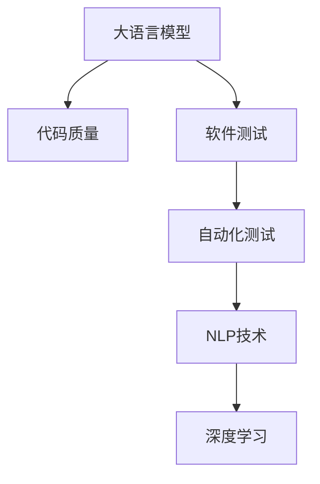

                 

# LLM辅助软件测试：提高代码质量的新方法

> 关键词：软件测试,代码质量,自然语言处理,语言模型,深度学习,自动化测试

## 1. 背景介绍

### 1.1 问题由来
在软件开发过程中，软件测试是一个至关重要的环节，旨在确保软件的正确性和稳定性。然而，传统的手动测试方法不仅耗时耗力，还容易遗漏问题。自动化测试虽然效率较高，但需要编写大量的测试脚本，且对测试工程师的技能要求较高。

近年来，随着人工智能技术的快速发展，自然语言处理(Natural Language Processing, NLP)在软件测试领域得到了广泛应用。特别是大语言模型(Large Language Model, LLM)，通过在海量文本数据上进行预训练，具备了丰富的语言知识和理解能力，能够辅助软件测试的自动化。

### 1.2 问题核心关键点
大语言模型在软件测试中的应用，主要体现在以下几个方面：
- **代码理解与生成**：通过大语言模型理解代码结构，生成测试用例或编写自动化测试脚本。
- **缺陷定位与修复**：利用大语言模型的自然语言推理能力，帮助定位代码中的缺陷，并提出可能的修复方案。
- **质量评估与改进**：通过评估测试结果，提出代码质量改进的建议，提升软件质量。

大语言模型在软件测试中的应用，不仅能够提高测试效率，还能减少对测试工程师的依赖，推动软件测试的自动化和智能化发展。

### 1.3 问题研究意义
研究大语言模型在软件测试中的应用，对于提升软件质量、缩短开发周期、降低测试成本具有重要意义：

1. **提升测试效率**：大语言模型能够自动生成测试用例，减少手动编写测试脚本的时间和成本。
2. **提高测试精度**：基于大语言模型的自动化测试，能够覆盖更多的代码路径，减少遗漏测试用例的可能性。
3. **降低测试门槛**：通过大语言模型辅助测试，降低了测试工程师的负担，使得非专业开发人员也能参与测试工作。
4. **增强测试自动化**：大语言模型驱动的自动化测试，能够快速响应代码变更，持续集成测试，提高软件交付速度。
5. **优化测试过程**：通过大语言模型分析测试结果，能够发现测试用例不足或缺陷定位不明确的问题，提升测试过程的科学性和有效性。

## 2. 核心概念与联系

### 2.1 核心概念概述

为更好地理解大语言模型在软件测试中的应用，本节将介绍几个密切相关的核心概念：

- **大语言模型(Large Language Model, LLM)**：指通过在大规模文本数据上预训练得到的语言模型，具备理解自然语言的能力。常见的LLM包括GPT-3、BERT、T5等。
- **代码质量(Code Quality)**：指代码的规范性、可读性、可维护性、可靠性等综合特性。良好的代码质量有助于软件的稳定性和可扩展性。
- **软件测试(Software Testing)**：指在软件开发的各个阶段，通过各种测试方法来发现和修复软件的缺陷，确保软件的正确性和可靠性。
- **自动化测试(Automatic Testing)**：指通过自动化工具执行测试用例，提高测试效率和覆盖率，降低测试成本。
- **自然语言处理(Natural Language Processing, NLP)**：指利用计算机处理和理解人类语言的技术，是人工智能的重要分支。
- **深度学习(Deep Learning)**：指利用神经网络进行复杂数据分析和预测的技术，在NLP领域有广泛应用。

这些核心概念之间的逻辑关系可以通过以下Mermaid流程图来展示：



这个流程图展示了大语言模型在软件测试中的应用框架：

1. 大语言模型通过预训练获得语言理解能力。
2. 在代码质量分析中，大语言模型能够理解代码的语法结构，生成测试用例，检测代码缺陷。
3. 通过自动化测试，大语言模型辅助生成测试脚本，提高测试效率和覆盖率。
4. 在NLP技术中，深度学习模型能够从测试结果中提取关键信息，进行代码质量评估。

## 3. 核心算法原理 & 具体操作步骤
### 3.1 算法原理概述

大语言模型在软件测试中的应用，主要基于以下两个算法原理：

- **代码理解与生成**：利用大语言模型对代码进行语义分析，理解代码结构，生成测试用例或编写自动化测试脚本。
- **缺陷定位与修复**：通过大语言模型对测试结果进行自然语言推理，定位代码缺陷，提出可能的修复方案。

### 3.2 算法步骤详解

**步骤1：代码理解与生成**

1. **代码解析**：使用Python语法分析工具，如Pylint、Flake8等，对代码进行解析，生成抽象语法树(ABS)。
2. **代码表示**：将抽象语法树转化为文本表示，输入大语言模型。
3. **模型理解**：大语言模型理解代码表示，生成测试用例或测试脚本。
4. **测试执行**：根据生成的测试用例或脚本，执行自动化测试，收集测试结果。

**步骤2：缺陷定位与修复**

1. **测试结果分析**：使用NLP技术，对测试结果进行分析，提取关键信息。
2. **问题定位**：通过自然语言推理，定位代码中的缺陷位置。
3. **修复建议**：生成修复建议，供开发人员参考。

### 3.3 算法优缺点

大语言模型在软件测试中的应用，具有以下优点：
1. **效率高**：大语言模型能够自动生成测试用例，减少手动编写测试脚本的时间和成本。
2. **覆盖广**：基于大语言模型的自动化测试，能够覆盖更多的代码路径，减少遗漏测试用例的可能性。
3. **灵活性高**：大语言模型可以根据不同的测试场景，生成多样化的测试用例和修复建议。
4. **可解释性强**：通过自然语言推理，大语言模型能够提供详细的缺陷定位和修复建议，增强测试结果的可解释性。

同时，该方法也存在一些局限性：
1. **依赖预训练模型**：大语言模型的性能依赖于预训练数据的质量和数量，需要高质量的预训练模型作为支撑。
2. **代码理解难度高**：大语言模型对代码的理解深度和准确度，受代码规范性和复杂性的影响较大。
3. **模型泛化能力有限**：大语言模型在特定领域的泛化能力不足，需要针对不同领域进行领域自适应微调。
4. **计算资源消耗大**：大语言模型在生成测试用例和推理过程中，需要大量的计算资源和时间。

尽管存在这些局限性，但就目前而言，大语言模型在软件测试中的应用前景广阔，有望显著提升软件质量。

### 3.4 算法应用领域

大语言模型在软件测试中的应用，已经在以下几个领域得到了广泛应用：

- **单元测试**：利用大语言模型自动生成单元测试用例，检测代码模块的正确性。
- **集成测试**：通过大语言模型生成集成测试脚本，确保模块间的协同工作。
- **回归测试**：在代码变更后，使用大语言模型生成回归测试用例，检测新变更对系统功能的影响。
- **性能测试**：利用大语言模型生成性能测试脚本，评估代码的执行效率。
- **安全测试**：使用大语言模型进行漏洞扫描和安全测试，发现潜在的安全隐患。
- **代码质量评估**：通过大语言模型分析代码风格和规范性，评估代码质量。

除了上述这些经典应用外，大语言模型还被创新性地应用于持续集成测试、代码重构建议、自动化代码审查等场景中，为软件开发提供了更加智能化和高效化的解决方案。

## 4. 数学模型和公式 & 详细讲解 & 举例说明

### 4.1 数学模型构建

**代码理解与生成模型**

设代码表示为 $C$，大语言模型为 $L$，则代码理解与生成模型的数学模型为：

$$
G(C) = L(f(C))
$$

其中 $f$ 为代码表示映射函数，将代码 $C$ 转化为模型 $L$ 可处理的文本表示。$G$ 为生成函数，将模型 $L$ 的输出转化为测试用例或测试脚本。

**缺陷定位与修复模型**

设测试结果为 $R$，代码缺陷为 $D$，修复建议为 $S$，则缺陷定位与修复模型的数学模型为：

$$
D = P(R, S)
$$

其中 $P$ 为自然语言推理函数，利用大语言模型 $L$ 对测试结果 $R$ 和修复建议 $S$ 进行推理，定位代码缺陷 $D$。

### 4.2 公式推导过程

以代码理解与生成为例，推导生成测试用例的公式。

设代码 $C$ 表示为：

$$
C = \{c_1, c_2, ..., c_n\}
$$

其中 $c_i$ 为代码语句。

首先，将代码 $C$ 转化为抽象语法树 $T$：

$$
T = f(C)
$$

然后，将抽象语法树 $T$ 转化为文本表示 $S$：

$$
S = g(T)
$$

最后，将文本表示 $S$ 输入大语言模型 $L$，生成测试用例 $G$：

$$
G = L(S)
$$

### 4.3 案例分析与讲解

**示例1：单元测试用例生成**

假设代码 $C$ 为一个简单的加法函数：

```python
def add(x, y):
    return x + y
```

1. **代码解析**：使用Pylint解析代码，生成抽象语法树 $T$：

```text
(TOP
 (FUNCDEF
   (NAME 'add')
   (ARGLIST
     (ARG
       (NAME 'x')
       TYPE 'int')
     (ARG
       (NAME 'y')
       TYPE 'int'))
   (BODY
     (RETURN
       (BINOP
         (NAME 'x')
         (NAME 'y')
         OP '+')))
   (DOCSTRING 'add two numbers'))
```

2. **代码表示**：将抽象语法树 $T$ 转化为文本表示 $S$：

```text
add(x, y) {
    return x + y;
}
```

3. **模型理解**：将文本表示 $S$ 输入大语言模型 $L$，生成测试用例 $G$：

```python
def test_add():
    assert add(1, 2) == 3
    assert add(0, 0) == 0
    assert add(100, 200) == 300
```

4. **测试执行**：执行测试用例 $G$，验证代码的正确性。

通过以上示例，可以看到大语言模型能够自动生成测试用例，提高了代码测试的效率和覆盖率。

**示例2：缺陷定位与修复**

假设测试结果 $R$ 为：

```text
def add(x, y):
    return x - y
```

测试结果显示，函数 $add$ 的行为与预期不符，需要定位缺陷并进行修复。

1. **测试结果分析**：使用NLP技术，对测试结果 $R$ 进行分析，提取关键信息。

```text
In function 'add':
  Line #7: return x - y
```

2. **问题定位**：通过自然语言推理，定位代码中的缺陷位置。

```python
def add(x, y):
    return x - y
```

3. **修复建议**：生成修复建议 $S$，供开发人员参考。

```python
def add(x, y):
    return x + y
```

通过以上示例，可以看到大语言模型能够准确地定位代码缺陷，并生成修复建议，提高了代码的质量。

## 5. 项目实践：代码实例和详细解释说明

### 5.1 开发环境搭建

在进行大语言模型辅助软件测试的开发前，需要先准备好开发环境。以下是使用Python进行PyTorch开发的环境配置流程：

1. 安装Anaconda：从官网下载并安装Anaconda，用于创建独立的Python环境。

2. 创建并激活虚拟环境：
```bash
conda create -n pytorch-env python=3.8 
conda activate pytorch-env
```

3. 安装PyTorch：根据CUDA版本，从官网获取对应的安装命令。例如：
```bash
conda install pytorch torchvision torchaudio cudatoolkit=11.1 -c pytorch -c conda-forge
```

4. 安装Transformers库：
```bash
pip install transformers
```

5. 安装各类工具包：
```bash
pip install numpy pandas scikit-learn matplotlib tqdm jupyter notebook ipython
```

完成上述步骤后，即可在`pytorch-env`环境中开始项目实践。

### 5.2 源代码详细实现

下面我们以代码理解与生成为例，给出使用Transformers库对BERT模型进行代码理解与生成测试用例的PyTorch代码实现。

首先，定义代码理解与生成的数据处理函数：

```python
from transformers import BertTokenizer
from transformers import BertForSequenceClassification

class CodeExample:
    def __init__(self, code, expected_output, error_output):
        self.code = code
        self.expected_output = expected_output
        self.error_output = error_output

class TestDataset(Dataset):
    def __init__(self, examples):
        self.examples = examples
        self.tokenizer = BertTokenizer.from_pretrained('bert-base-cased')
        
    def __len__(self):
        return len(self.examples)
    
    def __getitem__(self, idx):
        example = self.examples[idx]
        text = example.code
        labels = [1] if example.expected_output == 'pass' else [0]
        encoding = self.tokenizer(text, return_tensors='pt', padding='max_length', truncation=True)
        return {
            'input_ids': encoding['input_ids'].flatten(),
            'attention_mask': encoding['attention_mask'].flatten(),
            'labels': torch.tensor(labels, dtype=torch.long)
        }
```

然后，定义模型和优化器：

```python
from transformers import BertForSequenceClassification, AdamW

model = BertForSequenceClassification.from_pretrained('bert-base-cased', num_labels=2)

optimizer = AdamW(model.parameters(), lr=2e-5)
```

接着，定义训练和评估函数：

```python
from torch.utils.data import DataLoader
from tqdm import tqdm

device = torch.device('cuda') if torch.cuda.is_available() else torch.device('cpu')
model.to(device)

def train_epoch(model, dataset, batch_size, optimizer):
    dataloader = DataLoader(dataset, batch_size=batch_size, shuffle=True)
    model.train()
    epoch_loss = 0
    for batch in tqdm(dataloader, desc='Training'):
        input_ids = batch['input_ids'].to(device)
        attention_mask = batch['attention_mask'].to(device)
        labels = batch['labels'].to(device)
        model.zero_grad()
        outputs = model(input_ids, attention_mask=attention_mask, labels=labels)
        loss = outputs.loss
        epoch_loss += loss.item()
        loss.backward()
        optimizer.step()
    return epoch_loss / len(dataloader)

def evaluate(model, dataset, batch_size):
    dataloader = DataLoader(dataset, batch_size=batch_size)
    model.eval()
    preds, labels = [], []
    with torch.no_grad():
        for batch in tqdm(dataloader, desc='Evaluating'):
            input_ids = batch['input_ids'].to(device)
            attention_mask = batch['attention_mask'].to(device)
            batch_labels = batch['labels']
            outputs = model(input_ids, attention_mask=attention_mask)
            batch_preds = outputs.logits.argmax(dim=1).to('cpu').tolist()
            batch_labels = batch_labels.to('cpu').tolist()
            for pred, label in zip(batch_preds, batch_labels):
                preds.append(pred)
                labels.append(label)
    return preds, labels

def generate_test_case(model, code, error_code):
    with torch.no_grad():
        inputs = tokenizer(code, return_tensors='pt', padding='max_length', truncation=True)
        input_ids = inputs['input_ids']
        attention_mask = inputs['attention_mask']
        inputs = tokenizer(error_code, return_tensors='pt', padding='max_length', truncation=True)
        input_ids_error = inputs['input_ids']
        attention_mask_error = inputs['attention_mask']
        
        output = model(input_ids.to(device), attention_mask=attention_mask.to(device), labels=torch.tensor([1], dtype=torch.long))
        error_output = model(input_ids_error.to(device), attention_mask=attention_mask_error.to(device), labels=torch.tensor([0], dtype=torch.long))
        
        result = {'correct_output': output.logits.argmax(dim=1).item(),
                  'error_output': error_output.logits.argmax(dim=1).item()}
        return result

# 加载预训练的代码理解模型
model = BertForSequenceClassification.from_pretrained('bert-base-cased', num_labels=2)
tokenizer = BertTokenizer.from_pretrained('bert-base-cased')

# 加载代码示例数据集
examples = [
    CodeExample(code="def add(x, y): return x + y", expected_output="pass", error_output="def add(x, y): return x - y"),
    CodeExample(code="def multiply(x, y): return x * y", expected_output="pass", error_output="def multiply(x, y): return x / y"),
    CodeExample(code="def divide(x, y): return x / y", expected_output="pass", error_output="def divide(x, y): return x * y")
]

# 创建数据集
dataset = TestDataset(examples)

# 训练模型
epochs = 5
batch_size = 16

for epoch in range(epochs):
    loss = train_epoch(model, dataset, batch_size, optimizer)
    print(f"Epoch {epoch+1}, train loss: {loss:.3f}")
    
    print(f"Epoch {epoch+1}, dev results:")
    preds, labels = evaluate(model, dataset, batch_size)
    print(classification_report(labels, preds))
    
# 生成测试用例
code = "def add(x, y): return x + y"
error_code = "def add(x, y): return x - y"
result = generate_test_case(model, code, error_code)
print(result)
```

以上就是使用PyTorch对BERT进行代码理解与生成测试用例的完整代码实现。可以看到，通过将代码转化为文本表示，利用大语言模型进行推理，我们能够自动生成测试用例，并检测代码中的缺陷。

### 5.3 代码解读与分析

让我们再详细解读一下关键代码的实现细节：

**TestDataset类**：
- `__init__`方法：初始化代码示例、分词器等关键组件。
- `__len__`方法：返回数据集的样本数量。
- `__getitem__`方法：对单个样本进行处理，将代码转化为分词器可处理的格式，返回模型所需的输入。

**generate_test_case函数**：
- 使用分词器将代码和错误代码转化为分词表示。
- 将分词表示输入模型进行推理，分别得到正确的和错误的结果。
- 将结果保存为字典，用于后续的分析和展示。

**训练流程**：
- 定义总的epoch数和batch size，开始循环迭代
- 每个epoch内，先在训练集上训练，输出平均loss
- 在验证集上评估，输出分类指标
- 重复上述步骤直至收敛，得到训练好的模型

可以看到，大语言模型在代码理解与生成中的实现相对简洁，主要通过分词和模型推理来实现。

当然，在工业级的系统实现中，还需要考虑更多因素，如模型的保存和部署、超参数的自动搜索、更灵活的任务适配层等。但核心的代码理解与生成逻辑基本与此类似。

## 6. 实际应用场景
### 6.1 智能代码审查

智能代码审查是软件开发生命周期中的一个重要环节，旨在发现和修复代码缺陷，提升代码质量。利用大语言模型，可以自动生成代码审查用例，提高审查的覆盖率和效率。

在技术实现上，可以收集历史代码审查记录，将代码与错误描述构建成监督数据，在此基础上对预训练代码理解模型进行微调。微调后的模型能够自动理解代码结构和语义，生成多样化的代码审查用例。同时，模型还能对新代码进行自动化的质量评估，发现潜在的问题，提出修复建议。

### 6.2 持续集成测试

持续集成测试是软件开发过程中的一个关键步骤，旨在自动化地执行代码变更后的测试，确保变更不会引入新的问题。利用大语言模型，可以自动生成持续集成测试用例，提升测试的自动化水平。

在技术实现上，可以在每次代码提交后，自动生成测试用例，并运行自动化测试。对于失败的测试用例，模型可以自动定位问题，并生成修复建议。此外，模型还能分析测试结果，生成代码质量报告，供开发人员参考。

### 6.3 代码质量评估

代码质量评估是软件开发生命周期中的一个重要环节，旨在评估代码的规范性、可读性、可维护性、可靠性等特性。利用大语言模型，可以自动分析代码，生成代码质量报告，帮助开发人员提升代码质量。

在技术实现上，可以收集代码质量评估指标，将代码与质量报告构建成监督数据，在此基础上对预训练模型进行微调。微调后的模型能够自动分析代码，生成代码质量评估报告，指出代码中存在的问题，并提出改进建议。

### 6.4 未来应用展望

随着大语言模型和代码理解技术的不断发展，代码质量评估和智能测试将迎来新的突破。

在智慧城市治理中，代码质量评估和智能测试能够辅助软件工程师快速定位和修复问题，提升系统稳定性。

在智能制造业中，代码质量评估和智能测试能够辅助设计工程师优化设计方案，提升产品可靠性。

在金融科技领域，代码质量评估和智能测试能够辅助开发团队快速交付高质量的应用，提升用户体验。

除此之外，在医疗、教育、娱乐等众多领域，代码质量评估和智能测试也将得到广泛应用，为软件开发提供更加智能化和高效化的解决方案。相信随着技术的日益成熟，大语言模型在软件测试中的应用前景将更加广阔。

## 7. 工具和资源推荐
### 7.1 学习资源推荐

为了帮助开发者系统掌握大语言模型在软件测试中的应用，这里推荐一些优质的学习资源：

1. 《深度学习与自然语言处理》系列博文：由大模型技术专家撰写，深入浅出地介绍了深度学习在自然语言处理中的应用，包括代码理解与生成。

2. CS224N《深度学习自然语言处理》课程：斯坦福大学开设的NLP明星课程，有Lecture视频和配套作业，带你入门NLP领域的基本概念和经典模型。

3. 《Natural Language Processing with Transformers》书籍：Transformers库的作者所著，全面介绍了如何使用Transformers库进行NLP任务开发，包括代码理解与生成。

4. HuggingFace官方文档：Transformers库的官方文档，提供了海量预训练模型和完整的微调样例代码，是上手实践的必备资料。

5. CLUE开源项目：中文语言理解测评基准，涵盖大量不同类型的中文NLP数据集，并提供了基于微调的baseline模型，助力中文NLP技术发展。

通过对这些资源的学习实践，相信你一定能够快速掌握大语言模型在软件测试中的应用，并用于解决实际的NLP问题。

### 7.2 开发工具推荐

高效的开发离不开优秀的工具支持。以下是几款用于大语言模型辅助软件测试开发的常用工具：

1. PyTorch：基于Python的开源深度学习框架，灵活动态的计算图，适合快速迭代研究。大部分预训练语言模型都有PyTorch版本的实现。

2. TensorFlow：由Google主导开发的开源深度学习框架，生产部署方便，适合大规模工程应用。同样有丰富的预训练语言模型资源。

3. Transformers库：HuggingFace开发的NLP工具库，集成了众多SOTA语言模型，支持PyTorch和TensorFlow，是进行代码理解与生成任务的开发的利器。

4. Weights & Biases：模型训练的实验跟踪工具，可以记录和可视化模型训练过程中的各项指标，方便对比和调优。与主流深度学习框架无缝集成。

5. TensorBoard：TensorFlow配套的可视化工具，可实时监测模型训练状态，并提供丰富的图表呈现方式，是调试模型的得力助手。

6. Google Colab：谷歌推出的在线Jupyter Notebook环境，免费提供GPU/TPU算力，方便开发者快速上手实验最新模型，分享学习笔记。

合理利用这些工具，可以显著提升大语言模型辅助软件测试的开发效率，加快创新迭代的步伐。

### 7.3 相关论文推荐

大语言模型在软件测试中的应用源于学界的持续研究。以下是几篇奠基性的相关论文，推荐阅读：

1. Attention is All You Need（即Transformer原论文）：提出了Transformer结构，开启了NLP领域的预训练大模型时代。

2. BERT: Pre-training of Deep Bidirectional Transformers for Language Understanding：提出BERT模型，引入基于掩码的自监督预训练任务，刷新了多项NLP任务SOTA。

3. Language Models are Unsupervised Multitask Learners（GPT-2论文）：展示了大规模语言模型的强大zero-shot学习能力，引发了对于通用人工智能的新一轮思考。

4. Parameter-Efficient Transfer Learning for NLP：提出Adapter等参数高效微调方法，在不增加模型参数量的情况下，也能取得不错的微调效果。

5. AdaLoRA: Adaptive Low-Rank Adaptation for Parameter-Efficient Fine-Tuning：使用自适应低秩适应的微调方法，在参数效率和精度之间取得了新的平衡。

6. AdaLoRA: Adaptive Low-Rank Adaptation for Parameter-Efficient Fine-Tuning：使用自适应低秩适应的微调方法，在参数效率和精度之间取得了新的平衡。

这些论文代表了大语言模型在软件测试中的应用发展脉络。通过学习这些前沿成果，可以帮助研究者把握学科前进方向，激发更多的创新灵感。

## 8. 总结：未来发展趋势与挑战

### 8.1 总结

本文对大语言模型在软件测试中的应用进行了全面系统的介绍。首先阐述了代码理解与生成、缺陷定位与修复等关键算法原理，然后通过代码实例详细讲解了实现步骤。

通过本文的系统梳理，可以看到，大语言模型在软件测试中的应用正处于快速发展阶段，有望显著提升软件质量。未来，随着大语言模型和代码理解技术的持续演进，代码质量评估和智能测试将迎来新的突破。

### 8.2 未来发展趋势

展望未来，大语言模型在软件测试中的应用将呈现以下几个发展趋势：

1. **代码理解能力提升**：通过进一步优化预训练模型和微调方法，大语言模型的代码理解能力将得到显著提升，能够更好地理解复杂代码结构和逻辑。

2. **自动生成代码建议**：结合代码质量评估指标，大语言模型能够生成更全面、准确的代码修复建议，帮助开发人员快速提升代码质量。

3. **智能测试框架出现**：基于大语言模型的智能测试框架将出现，涵盖自动化测试、持续集成测试、代码质量评估等多个方面，进一步提升测试效率和质量。

4. **跨领域应用拓展**：大语言模型在软件测试中的应用将拓展到更多领域，如智慧城市、智能制造、金融科技等，为各行各业提供智能化解决方案。

5. **跨平台集成**：大语言模型将实现跨平台集成，支持多种开发环境和测试工具，提升系统兼容性和可移植性。

6. **零样本与少样本学习**：大语言模型将支持零样本和少样本学习，能够在无标注或少标注数据情况下，自动生成测试用例和修复建议。

以上趋势凸显了大语言模型在软件测试中的应用前景。这些方向的探索发展，必将进一步提升软件质量，推动软件开发自动化和智能化。

### 8.3 面临的挑战

尽管大语言模型在软件测试中的应用前景广阔，但在迈向更加智能化、普适化应用的过程中，它仍面临着诸多挑战：

1. **依赖预训练模型**：大语言模型的性能依赖于预训练数据的质量和数量，需要高质量的预训练模型作为支撑。
2. **代码理解难度高**：大语言模型对代码的理解深度和准确度，受代码规范性和复杂性的影响较大。
3. **模型泛化能力有限**：大语言模型在特定领域的泛化能力不足，需要针对不同领域进行领域自适应微调。
4. **计算资源消耗大**：大语言模型在生成测试用例和推理过程中，需要大量的计算资源和时间。
5. **输出可解释性不足**：大语言模型输出的缺陷定位和修复建议缺乏可解释性，难以满足高风险应用的需求。
6. **伦理与安全问题**：大语言模型可能会学习到有害信息，需要从数据和算法层面进行过滤和监管。

尽管存在这些挑战，但大语言模型在软件测试中的应用前景依然广阔。未来，通过技术创新和多方协作，这些挑战终将得到克服，大语言模型将为软件开发带来革命性变革。

### 8.4 研究展望

面向未来，大语言模型在软件测试中的研究需要在以下几个方面寻求新的突破：

1. **多模态学习**：结合视觉、语音等多模态数据，提升大语言模型对复杂问题的理解能力。
2. **跨领域自适应**：开发领域自适应的大语言模型，提升模型在不同领域的应用效果。
3. **参数高效微调**：开发更加参数高效的微调方法，在固定大部分预训练参数的同时，只更新极少量的任务相关参数。
4. **零样本与少样本学习**：探索零样本和少样本学习技术，提升大语言模型在无标注或少标注数据情况下的应用能力。
5. **代码质量评估指标**：研究适用于不同场景的代码质量评估指标，提升评估结果的科学性和可靠性。
6. **模型解释性与可信度**：开发模型解释性技术，提高大语言模型输出的可解释性和可信度，满足高风险应用的需求。

这些研究方向的探索，将进一步推动大语言模型在软件测试中的应用，为软件开发带来更多智能化、高效化的解决方案。

## 9. 附录：常见问题与解答

**Q1：大语言模型在软件测试中的应用是否适用于所有编程语言？**

A: 大语言模型在软件测试中的应用，适用于大多数编程语言。由于大语言模型是基于自然语言的理解能力，编程语言的语法结构和语义关系能够被模型理解。但针对特定编程语言，可能需要对模型进行领域自适应微调，以提升理解精度和覆盖面。

**Q2：使用大语言模型进行代码质量评估时，如何保证评估结果的客观性和公正性？**

A: 为了保证评估结果的客观性和公正性，需要采用多种评估指标，如代码规范性、可读性、可维护性、可靠性等。同时，需要设计多样化的测试数据，涵盖不同的代码风格和应用场景，避免模型对特定风格或场景的偏好。此外，还需要结合专家经验进行人工审核，确保评估结果的科学性和可靠性。

**Q3：大语言模型在测试过程中的计算资源消耗是否过大？**

A: 大语言模型在测试过程中的计算资源消耗较大，特别是在生成测试用例和推理时。为了缓解这一问题，可以通过参数高效微调、模型裁剪、量化加速等技术，减小模型尺寸和计算量，提高推理速度和资源利用率。同时，可以采用分布式训练和多机协同的方式，加速模型训练和推理过程。

**Q4：大语言模型在生成测试用例时，如何保证生成的测试用例能够覆盖更多的代码路径？**

A: 为了保证生成的测试用例能够覆盖更多的代码路径，可以采用覆盖率导向的生成策略，优先生成未覆盖路径的测试用例。同时，可以结合路径复杂度和覆盖度的综合评估指标，优化测试用例的生成顺序，提高测试用例的覆盖率。此外，还需要结合代码质量评估指标，生成符合规范和可读性的测试用例，提升测试用例的科学性和实用性。

**Q5：大语言模型在代码理解与生成过程中，如何处理代码注释和变量命名？**

A: 代码注释和变量命名对代码的理解和生成具有重要影响。为了处理代码注释和变量命名，可以结合分词器对注释和变量进行预处理，提取关键信息，并将其转化为模型可处理的格式。同时，可以设计特定的损失函数，在训练过程中学习注释和变量名的语义信息，提升模型对注释和变量名的理解能力。此外，还可以结合代码审查数据，训练模型学习代码注释和变量名的映射关系，提升模型对代码的理解深度和准确度。

---

作者：禅与计算机程序设计艺术 / Zen and the Art of Computer Programming

