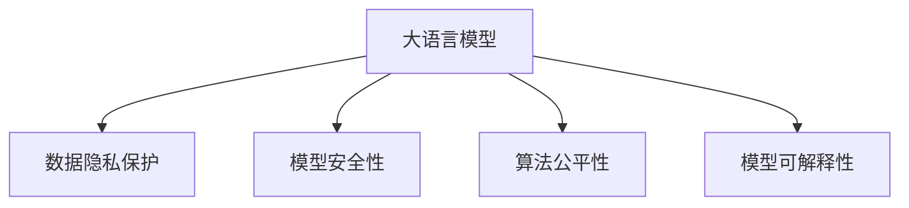

                 

# LLM隐私伦理:AI安全性挑战与对策

> 关键词：大语言模型,隐私保护,AI安全性,数据伦理,数据泄露,算法公平性

## 1. 背景介绍

### 1.1 问题由来

随着人工智能技术的迅猛发展，大语言模型（Large Language Models, LLMs）在自然语言处理（NLP）、智能对话、自动翻译、医疗诊断等领域展现出前所未有的潜力。然而，大语言模型的广泛应用也带来了一些不可忽视的隐私伦理和安全问题。

首先，大语言模型在训练和应用过程中需要处理大量个人数据和敏感信息，如对话记录、健康记录、财务信息等。这些数据如果处理不当，存在隐私泄露的风险。其次，模型可能被恶意利用，导致偏见和歧视，甚至引发法律和道德问题。最后，模型的可解释性问题也引起了广泛关注，用户对模型的决策过程缺乏信任。

这些隐私伦理和安全问题，不仅影响模型的可信度，也可能引发法律诉讼和社会争议。因此，如何在提升大语言模型性能的同时，保障数据隐私、提升安全性、增强可解释性，成为学术界和工业界关注的焦点。

### 1.2 问题核心关键点

要应对大语言模型的隐私伦理和安全问题，需要从数据隐私、模型安全性、算法公平性、可解释性等多个维度进行综合考虑。具体包括以下几个关键点：

1. **数据隐私保护**：如何保护训练数据和应用数据不被滥用和泄露。
2. **模型安全性**：如何避免模型被恶意攻击和篡改，保障模型决策的准确性和鲁棒性。
3. **算法公平性**：如何确保模型在处理数据时不产生偏见和歧视，保证模型输出公平公正。
4. **模型可解释性**：如何增强模型的透明度和可解释性，使用户对模型输出有足够的信任和理解。

本文将围绕这些关键点，探讨大语言模型的隐私伦理和安全问题，并提出一些对策建议。

## 2. 核心概念与联系

### 2.1 核心概念概述

为更好地理解大语言模型的隐私伦理和安全问题，本节将介绍几个密切相关的核心概念：

- **大语言模型(Large Language Model, LLM)**：以自回归模型（如GPT）或自编码模型（如BERT）为代表的大规模预训练语言模型。通过在大规模无标签文本语料上进行预训练，学习通用的语言表示，具备强大的语言理解和生成能力。

- **数据隐私保护**：通过数据匿名化、差分隐私等技术，保障训练和应用数据的隐私安全。

- **模型安全性**：通过对抗训练、安全编码等技术，提升模型的鲁棒性和抗攻击能力。

- **算法公平性**：通过公平性评估、偏差修正等方法，确保模型在处理数据时不产生偏见和歧视。

- **模型可解释性**：通过模型压缩、可解释性技术等方法，增强模型的透明度和可解释性，使用户对模型输出有足够的信任和理解。

这些核心概念之间的逻辑关系可以通过以下Mermaid流程图来展示：



这个流程图展示了大语言模型的核心概念及其之间的关系：

1. 大语言模型通过预训练获得基础能力。
2. 在隐私保护、安全性、公平性、可解释性等多个方面进行优化，确保模型的可信度和适用性。

## 3. 核心算法原理 & 具体操作步骤
### 3.1 算法原理概述

大语言模型的隐私伦理和安全问题，本质上是如何在提升模型性能的同时，保障数据隐私、提升模型鲁棒性和决策公正性、增强模型透明度的问题。

为解决这些问题，可以采用多种技术和方法，包括数据匿名化、差分隐私、对抗训练、公平性评估、可解释性技术等。这些方法各有优缺点，需要根据具体场景和需求进行选择和组合。

### 3.2 算法步骤详解

本节将以几个具体的技术为例，详细介绍其原理和操作步骤。

#### 3.2.1 数据匿名化

**原理**：
数据匿名化是通过对敏感信息进行处理，使其无法直接追溯到个人身份的技术。常用的方法包括去除或模糊化个人标识符、使用数据扰动等。

**操作步骤**：
1. 收集训练数据，包括用户对话记录、健康记录、财务信息等。
2. 对数据中的个人标识符（如姓名、身份证号等）进行去除或模糊化处理。
3. 使用数据扰动技术（如高斯噪声、Laplacian噪声等）对数据进行处理，使得攻击者无法通过数据推断出个人信息。

#### 3.2.2 差分隐私

**原理**：
差分隐私是一种保护数据隐私的技术，通过在查询过程中引入噪声，使得攻击者无法区分单个数据记录和平均数据记录。常用的方法包括Laplace机制、指数机制等。

**操作步骤**：
1. 定义查询函数，如计算数据集中某种特征的平均值。
2. 引入噪声（如Laplace噪声），使得查询结果具有随机性。
3. 在返回结果时，将真实值和噪声值一起返回。

#### 3.2.3 对抗训练

**原理**：
对抗训练是通过在训练过程中引入对抗样本，使得模型对攻击具有鲁棒性。常用的方法包括FGM攻击、PGD攻击等。

**操作步骤**：
1. 收集对抗样本，包括对训练数据进行微小扰动生成的样本。
2. 将对抗样本和正常样本一起输入模型进行训练。
3. 通过梯度下降等优化算法，更新模型参数，使得模型对对抗样本具有鲁棒性。

#### 3.2.4 公平性评估

**原理**：
公平性评估是通过计算模型在不同人群上的性能差异，判断模型是否存在偏见。常用的方法包括 demographic parity、equalized odds等。

**操作步骤**：
1. 收集训练数据，确保数据覆盖不同人群。
2. 定义评估指标，如准确率、召回率等。
3. 计算模型在不同人群上的评估指标，比较其差异。

#### 3.2.5 可解释性技术

**原理**：
可解释性技术是通过对模型进行简化或可视化，使用户能够理解模型的决策过程。常用的方法包括特征重要性分析、可解释性模型等。

**操作步骤**：
1. 使用LIME、SHAP等工具对模型进行解释。
2. 生成模型特征重要性图，展示不同特征对模型输出的贡献。
3. 可视化模型的决策边界和特征权重，帮助用户理解模型输出。

### 3.3 算法优缺点

不同的隐私伦理和安全技术各有优缺点，需要根据具体场景和需求进行选择和组合。

#### 3.3.1 数据匿名化

**优点**：
1. 简单高效，不需要额外的计算资源。
2. 适用于数据隐私保护的基础环节。

**缺点**：
1. 匿名化可能影响数据质量，影响模型性能。
2. 匿名化方法可能被攻击者破解，导致隐私泄露。

#### 3.3.2 差分隐私

**优点**：
1. 可以保护个体隐私，同时保留数据统计特性。
2. 适用于需要频繁查询数据的应用场景。

**缺点**：
1. 引入噪声可能导致查询结果的精度降低。
2. 需要对查询函数进行设计，存在一定复杂度。

#### 3.3.3 对抗训练

**优点**：
1. 显著提升模型的鲁棒性和抗攻击能力。
2. 适用于对模型安全性要求较高的应用场景。

**缺点**：
1. 对抗样本生成的过程复杂，计算资源消耗较大。
2. 对抗训练可能导致模型泛化性能下降。

#### 3.3.4 公平性评估

**优点**：
1. 帮助发现模型中的偏见和歧视问题。
2. 可以通过偏差修正提升模型公平性。

**缺点**：
1. 评估过程复杂，需要大量标注数据。
2. 评估结果可能受到数据分布的影响。

#### 3.3.5 可解释性技术

**优点**：
1. 增强用户对模型的信任，提升模型透明度。
2. 帮助发现模型的内部决策过程。

**缺点**：
1. 可解释性技术可能增加模型的计算负担。
2. 解释结果可能过于简化，无法完全反映模型复杂性。

### 3.4 算法应用领域

大语言模型的隐私伦理和安全技术，在多个领域都有广泛的应用：

- **医疗**：在处理患者的健康记录、诊断数据时，需要保障数据隐私和安全。差分隐私和数据匿名化技术可以应用于电子健康记录的存储和共享。
- **金融**：在处理客户的财务信息、交易数据时，需要保障数据安全和公平性。对抗训练和公平性评估技术可以应用于信用评分和风险评估。
- **法律**：在处理客户的隐私信息、诉讼数据时，需要保障数据隐私和模型公正性。数据匿名化和可解释性技术可以应用于证据收集和法律分析。
- **教育**：在处理学生的学习记录、评估数据时，需要保障数据隐私和公平性。差分隐私和公平性评估技术可以应用于在线教育平台的个性化推荐和学生评估。

## 4. 数学模型和公式 & 详细讲解  
### 4.1 数学模型构建

本节将以差分隐私和公平性评估为例，介绍其数学模型构建。

#### 4.1.1 差分隐私

假设有一组数据集 $D = (x_1, x_2, ..., x_n)$，每个数据记录 $x_i$ 包含敏感信息 $s_i$。差分隐私的目标是使得攻击者无法区分单个数据记录和平均数据记录。

**数学模型**：
1. 定义查询函数 $f(x)$，如计算数据集中某种特征的平均值。
2. 引入噪声 $\epsilon$，使得查询结果具有随机性。
3. 返回噪声化和真实值组合的结果。

**公式**：
$$
\tilde{f}(x) = f(x) + \mathcal{N}(0,\sigma^2)
$$

其中，$\sigma$ 是噪声强度，$\epsilon$ 是隐私预算。

#### 4.1.2 公平性评估

假设有一组数据集 $D = (x_1, x_2, ..., x_n)$，每个数据记录 $x_i$ 包含特征 $f_i$ 和标签 $y_i$。公平性评估的目标是计算模型在不同人群上的性能差异。

**数学模型**：
1. 定义模型 $M$，如线性回归模型。
2. 计算模型在每个子集上的性能指标，如准确率、召回率等。
3. 比较不同子集上的性能指标，评估公平性。

**公式**：
$$
\text{DP} = \max_{S \subseteq D} |\frac{1}{|S|}\sum_{x_i \in S} y_i - \frac{1}{|D-S|}\sum_{x_i \in D-S} y_i|
$$

其中，$S$ 是数据集的一个子集。

### 4.2 公式推导过程

**差分隐私推导**：
差分隐私的核心在于引入噪声，使得攻击者无法区分单个数据记录和平均数据记录。其推导过程如下：

1. 定义查询函数 $f(x)$，如计算数据集中某种特征的平均值。
2. 引入噪声 $\epsilon$，使得查询结果具有随机性。
3. 返回噪声化和真实值组合的结果。

**公平性评估推导**：
公平性评估的核心在于计算模型在不同人群上的性能差异。其推导过程如下：

1. 定义模型 $M$，如线性回归模型。
2. 计算模型在每个子集上的性能指标，如准确率、召回率等。
3. 比较不同子集上的性能指标，评估公平性。

### 4.3 案例分析与讲解

#### 4.3.1 差分隐私案例

假设有一组数据集 $D = (x_1, x_2, ..., x_n)$，每个数据记录 $x_i$ 包含敏感信息 $s_i$。差分隐私的目标是使得攻击者无法区分单个数据记录和平均数据记录。

**案例分析**：
1. 收集数据集 $D$，包括患者的健康记录 $s_i$。
2. 定义查询函数 $f(x)$，如计算患者健康记录的平均值。
3. 引入噪声 $\epsilon$，使得查询结果具有随机性。
4. 返回噪声化和真实值组合的结果。

**代码实现**：
```python
import numpy as np
from scipy.stats import laplace

# 生成数据集
s = np.random.normal(0, 1, 1000)
s[0] = 100
s[1000] = -100

# 查询函数
def query_function(s):
    return np.mean(s)

# 引入噪声
epsilon = 1
sigma = epsilon / np.sqrt(len(s))

# 噪声化查询结果
tilde_f = np.random.normal(query_function(s), sigma)
```

#### 4.3.2 公平性评估案例

假设有一组数据集 $D = (x_1, x_2, ..., x_n)$，每个数据记录 $x_i$ 包含特征 $f_i$ 和标签 $y_i$。公平性评估的目标是计算模型在不同人群上的性能差异。

**案例分析**：
1. 收集数据集 $D$，包括学生的学习记录 $f_i$ 和考试分数 $y_i$。
2. 定义模型 $M$，如线性回归模型。
3. 计算模型在每个子集上的性能指标，如准确率、召回率等。
4. 比较不同子集上的性能指标，评估公平性。

**代码实现**：
```python
import numpy as np
from sklearn.linear_model import LinearRegression

# 生成数据集
f = np.random.normal(0, 1, 1000)
f[0] = 100
f[1000] = -100
y = np.random.normal(0, 1, 1000)
y[0] = 100
y[1000] = -100

# 定义模型
model = LinearRegression()

# 训练模型
model.fit(np.c_[f, f**2], y)

# 计算公平性指标
def fairness_metrics(model, f, y):
    scores = []
    for i in range(1000):
        subset = f[f >= i * 10]
        score = model.score(subset, y[subset])
        scores.append(score)
    return scores

# 计算公平性
scores = fairness_metrics(model, f, y)
print(np.mean(scores))
```

## 5. 项目实践：代码实例和详细解释说明
### 5.1 开发环境搭建

在进行隐私伦理和安全实践前，我们需要准备好开发环境。以下是使用Python进行PyTorch开发的环境配置流程：

1. 安装Anaconda：从官网下载并安装Anaconda，用于创建独立的Python环境。

2. 创建并激活虚拟环境：
```bash
conda create -n pytorch-env python=3.8 
conda activate pytorch-env
```

3. 安装PyTorch：根据CUDA版本，从官网获取对应的安装命令。例如：
```bash
conda install pytorch torchvision torchaudio cudatoolkit=11.1 -c pytorch -c conda-forge
```

4. 安装TensorFlow：从官网下载安装包，安装TensorFlow。

5. 安装各类工具包：
```bash
pip install numpy pandas scikit-learn matplotlib tqdm jupyter notebook ipython
```

完成上述步骤后，即可在`pytorch-env`环境中开始隐私伦理和安全实践。

### 5.2 源代码详细实现

下面是使用TensorFlow和差分隐私技术实现模型训练的示例代码。

```python
import tensorflow as tf
from tensorflow.keras.datasets import mnist

# 加载MNIST数据集
(x_train, y_train), (x_test, y_test) = mnist.load_data()

# 数据预处理
x_train = x_train / 255.0
x_test = x_test / 255.0

# 定义模型
model = tf.keras.Sequential([
    tf.keras.layers.Flatten(input_shape=(28, 28)),
    tf.keras.layers.Dense(128, activation='relu'),
    tf.keras.layers.Dense(10, activation='softmax')
])

# 定义损失函数和优化器
loss_fn = tf.keras.losses.SparseCategoricalCrossentropy(from_logits=True)
optimizer = tf.keras.optimizers.Adam()

# 引入差分隐私
delta = 0.1
epsilon = 1.4 * np.log(1.25/delta)
sigma = epsilon / np.sqrt(len(x_train))

# 定义差分隐私查询
def differential_privacy(x, y):
    with tf.GradientTape() as tape:
        logits = model(x, training=True)
        loss = loss_fn(y, logits)
    grads = tape.gradient(loss, model.trainable_variables)
    noise = tf.random.normal([len(grads)], stddev=sigma)
    clipped_grads = [tf.clip_by_value(g + noise[i], -sigma, sigma) for i, g in enumerate(grads)]
    return tf.reduce_mean(tf.nn.l2_loss(clipped_grads))

# 定义训练过程
def train_epoch(model, x, y, batch_size, optimizer, epsilon, delta):
    differential_privacy_model = differential_privacy(model)
    differential_privacy_optimizer = optimizer
    for i in range(0, len(x), batch_size):
        x_batch = x[i:i+batch_size]
        y_batch = y[i:i+batch_size]
        with tf.GradientTape() as tape:
            loss = differential_privacy_model(x_batch, y_batch)
        grads = tape.gradient(loss, model.trainable_variables)
        differential_privacy_optimizer.apply_gradients(zip(grads, model.trainable_variables))

# 训练模型
epochs = 10
batch_size = 64
epsilon = 1.4 * np.log(1.25/0.01)
delta = 0.01

for epoch in range(epochs):
    train_epoch(model, x_train, y_train, batch_size, optimizer, epsilon, delta)
    test_loss = loss_fn(y_test, model(x_test))
    print(f"Epoch {epoch+1}, test loss: {test_loss.numpy():.4f}")
```

以上代码实现了使用差分隐私技术进行模型训练的过程。可以看到，在定义损失函数时，需要引入噪声，使得查询结果具有随机性。

### 5.3 代码解读与分析

让我们再详细解读一下关键代码的实现细节：

**差分隐私代码实现**：
- 首先，加载MNIST数据集，并对数据进行预处理。
- 定义模型，并引入差分隐私机制。
- 定义差分隐私查询函数，引入噪声并计算差分隐私损失。
- 在训练过程中，使用差分隐私查询函数计算梯度并更新模型参数。
- 在测试时，计算模型损失并输出。

**代码解读**：
- 在定义差分隐私查询函数时，首先使用GradientTape记录梯度，然后计算模型在当前批次上的损失。
- 在梯度计算后，引入噪声并计算差分隐私损失。
- 使用Adam优化器更新模型参数，最小化差分隐私损失。
- 在训练过程中，每个批次都进行差分隐私计算，最终得到模型输出。

## 6. 实际应用场景
### 6.1 智能客服系统

智能客服系统的隐私伦理和安全问题，主要集中在用户对话记录和个人信息的保护。通过差分隐私和数据匿名化技术，可以有效保护用户隐私。

**实际应用**：
- 在智能客服系统中，收集用户对话记录和个人信息，并进行差分隐私处理。
- 训练大语言模型，使用差分隐私查询函数进行模型训练。
- 在智能客服对话过程中，使用差分隐私和数据匿名化技术保护用户对话记录。

**效果分析**：
- 通过差分隐私和数据匿名化，可以保护用户对话记录和个人信息，防止隐私泄露。
- 训练过程中引入噪声，使得攻击者无法通过差分隐私查询获得模型参数，提高模型安全性。

### 6.2 金融舆情监测

金融舆情监测的隐私伦理和安全问题，主要集中在用户金融信息的保护。通过差分隐私和模型安全性技术，可以有效保护用户金融信息。

**实际应用**：
- 在金融舆情监测系统中，收集用户金融信息，并进行差分隐私处理。
- 训练大语言模型，使用差分隐私查询函数进行模型训练。
- 在金融舆情监测过程中，使用差分隐私和对抗训练技术保护用户金融信息。

**效果分析**：
- 通过差分隐私和数据匿名化，可以保护用户金融信息，防止隐私泄露。
- 训练过程中引入噪声，使得攻击者无法通过差分隐私查询获得模型参数，提高模型安全性。
- 在金融舆情监测过程中，使用对抗训练技术，提升模型鲁棒性，防止模型被攻击。

### 6.3 个性化推荐系统

个性化推荐系统的隐私伦理和安全问题，主要集中在用户行为数据的保护。通过差分隐私和公平性评估技术，可以有效保护用户隐私和提升推荐公平性。

**实际应用**：
- 在个性化推荐系统中，收集用户行为数据，并进行差分隐私处理。
- 训练大语言模型，使用差分隐私查询函数进行模型训练。
- 在个性化推荐过程中，使用差分隐私和公平性评估技术保护用户行为数据。

**效果分析**：
- 通过差分隐私和数据匿名化，可以保护用户行为数据，防止隐私泄露。
- 训练过程中引入噪声，使得攻击者无法通过差分隐私查询获得模型参数，提高模型安全性。
- 在个性化推荐过程中，使用公平性评估技术，发现和修正模型中的偏见和歧视问题，提升推荐公平性。

### 6.4 未来应用展望

随着大语言模型的不断发展和应用，隐私伦理和安全问题也将得到更多关注。未来的发展趋势包括：

1. **数据隐私保护技术**：差分隐私、联邦学习等技术将得到更广泛应用，保护用户隐私。
2. **模型安全性技术**：对抗训练、安全编码等技术将得到更多研究，提升模型鲁棒性。
3. **算法公平性技术**：公平性评估、偏差修正等技术将得到更多应用，提升模型公平性。
4. **可解释性技术**：可解释性模型、特征重要性分析等技术将得到更多研究，提升模型透明度。

## 7. 工具和资源推荐
### 7.1 学习资源推荐

为了帮助开发者系统掌握大语言模型的隐私伦理和安全技术，这里推荐一些优质的学习资源：

1. **差分隐私**：《Differential Privacy: Foundations, Techniques and Applications》一书，介绍了差分隐私的理论基础和应用场景。
2. **对抗训练**：《Adversarial Machine Learning: Foundations and Methods》一书，介绍了对抗训练的原理和实践方法。
3. **公平性评估**：《Algorithmic Fairness and Bias in Machine Learning: Methods to Detect and Mitigate Unwanted Disparities》一书，介绍了公平性评估的方法和应用。
4. **可解释性**：《Explainable Artificial Intelligence: A Guide for Making Black Box Models Explainable》一书，介绍了可解释性技术的方法和应用。

通过对这些资源的学习实践，相信你一定能够快速掌握大语言模型隐私伦理和安全技术的精髓，并用于解决实际的隐私伦理和安全问题。

### 7.2 开发工具推荐

高效的开发离不开优秀的工具支持。以下是几款用于大语言模型隐私伦理和安全开发的常用工具：

1. **TensorFlow**：强大的深度学习框架，支持差分隐私和模型安全性技术。
2. **TensorBoard**：TensorFlow配套的可视化工具，可以实时监测模型训练状态，提供丰富的图表呈现方式。
3. **Keras**：高级深度学习框架，支持差分隐私和公平性评估技术。
4. **Jupyter Notebook**：交互式笔记本环境，方便进行模型训练和可视化。
5. **Scikit-learn**：机器学习工具包，支持公平性评估和特征重要性分析。

合理利用这些工具，可以显著提升大语言模型隐私伦理和安全开发的效率，加快创新迭代的步伐。

### 7.3 相关论文推荐

大语言模型隐私伦理和安全技术的发展源于学界的持续研究。以下是几篇奠基性的相关论文，推荐阅读：

1. **差分隐私**：《Differential Privacy》论文，提出了差分隐私的理论基础和实现方法。
2. **对抗训练**：《Adversarial Examples in the Physical World》论文，展示了对抗训练在现实世界中的应用。
3. **公平性评估**：《Learning Fair and Calibrated Predictions with Multi-Task Fairness》论文，介绍了公平性评估的方法和应用。
4. **可解释性**：《Explainable Machine Learning: Towards Explainable AI》论文，介绍了可解释性技术的方法和应用。

这些论文代表了大语言模型隐私伦理和安全技术的发展脉络。通过学习这些前沿成果，可以帮助研究者把握学科前进方向，激发更多的创新灵感。

## 8. 总结：未来发展趋势与挑战
### 8.1 总结

本文对大语言模型的隐私伦理和安全问题进行了全面系统的介绍。首先阐述了隐私伦理和安全问题的背景和重要性，明确了隐私伦理和安全技术的研究方向和应用场景。其次，从数据隐私、模型安全性、算法公平性、可解释性等多个维度，详细讲解了隐私伦理和安全技术的原理和操作步骤。最后，通过实际应用场景，展示了隐私伦理和安全技术在多个领域的应用效果和未来发展趋势。

通过本文的系统梳理，可以看到，大语言模型的隐私伦理和安全问题，已经成为其落地应用的重要瓶颈。如何平衡性能提升和隐私安全，提升模型透明度和可解释性，将是未来研究的关键方向。只有在技术、伦理、法律等多个维度协同发力，才能真正实现大语言模型的安全和可信应用。

### 8.2 未来发展趋势

展望未来，大语言模型的隐私伦理和安全技术将呈现以下几个发展趋势：

1. **隐私保护技术**：差分隐私、联邦学习等隐私保护技术将得到更广泛应用，保护用户隐私和数据安全。
2. **模型安全性技术**：对抗训练、安全编码等技术将得到更多研究，提升模型鲁棒性和抗攻击能力。
3. **算法公平性技术**：公平性评估、偏差修正等技术将得到更多应用，提升模型公平性和公正性。
4. **可解释性技术**：可解释性模型、特征重要性分析等技术将得到更多研究，增强模型透明度和可解释性。
5. **多模态数据融合**：结合视觉、语音、文本等多模态数据，提升模型对现实世界的理解和建模能力。
6. **隐私保护计算**：使用差分隐私和联邦学习等技术，在不泄露数据隐私的前提下，进行分布式模型训练。

以上趋势凸显了大语言模型隐私伦理和安全技术的广阔前景。这些方向的探索发展，将进一步提升大语言模型的可信度和适用性，推动人工智能技术在更多领域的应用。

### 8.3 面临的挑战

尽管大语言模型的隐私伦理和安全技术已经取得了显著进展，但在迈向更加智能化、普适化应用的过程中，仍面临诸多挑战：

1. **隐私保护**：如何在不破坏用户体验和数据质量的前提下，保护用户隐私和数据安全，是一个复杂而棘手的问题。
2. **模型安全性**：如何保障大语言模型在面对攻击和篡改时，仍能保持决策的准确性和鲁棒性，是一个重要研究课题。
3. **算法公平性**：如何在不同人群和场景下，保证模型输出公平公正，是一个需要更多研究的挑战。
4. **可解释性**：如何增强模型的透明度和可解释性，使得用户对模型输出有足够的信任和理解，是一个需要更多创新的方向。

### 8.4 研究展望

面对大语言模型隐私伦理和安全技术所面临的挑战，未来的研究需要在以下几个方面寻求新的突破：

1. **差分隐私的优化**：进一步优化差分隐私机制，减少噪声引入的计算成本和精度损失。
2. **对抗训练的改进**：改进对抗训练算法，提高模型的鲁棒性和泛化性能。
3. **公平性评估的完善**：引入更多公平性评估指标和方法，发现和修正模型中的偏见和歧视问题。
4. **可解释性技术的创新**：开发新的可解释性技术，增强模型的透明度和可解释性，使用户对模型输出有足够的信任和理解。
5. **多模态数据融合**：结合视觉、语音、文本等多模态数据，提升模型对现实世界的理解和建模能力。
6. **隐私保护计算**：研究隐私保护计算技术，在不泄露数据隐私的前提下，进行分布式模型训练。

这些研究方向的探索，将进一步提升大语言模型的可信度和适用性，推动人工智能技术在更多领域的应用。

## 9. 附录：常见问题与解答

**Q1：差分隐私和数据匿名化的区别是什么？**

A: 差分隐私和数据匿名化都是保护数据隐私的技术，但它们的工作机制和应用场景有所不同。

差分隐私通过在查询过程中引入噪声，使得攻击者无法区分单个数据记录和平均数据记录。其主要关注的是在保护隐私的前提下，如何最大限度地利用数据信息。

数据匿名化通过去除或模糊化个人标识符，使得攻击者无法直接追溯到个人身份。其主要关注的是如何保护数据不被滥用和泄露。

**Q2：对抗训练的目的是什么？**

A: 对抗训练的目的是通过在训练过程中引入对抗样本，使得模型对攻击具有鲁棒性。其主要关注的是如何提升模型的抗攻击能力，防止模型被攻击和篡改。

对抗训练的核心思想是利用对抗样本训练模型，使得模型能够对微小的扰动具有鲁棒性。对抗样本是通过对训练数据进行微小扰动生成的，这些扰动可能无法被普通用户察觉，但足以影响模型的输出。通过对抗训练，模型能够在面对攻击时，仍然保持决策的准确性和鲁棒性。

**Q3：如何平衡隐私保护和数据利用？**

A: 在隐私保护和数据利用之间找到平衡，是一个复杂而重要的课题。以下是一些可能的解决方案：

1. 差分隐私：通过在查询过程中引入噪声，使得攻击者无法区分单个数据记录和平均数据记录。这种方法可以在保护隐私的前提下，最大限度地利用数据信息。

2. 数据匿名化：通过去除或模糊化个人标识符，使得攻击者无法直接追溯到个人身份。这种方法可以保护数据不被滥用和泄露，但可能影响数据质量，降低模型性能。

3. 联邦学习：通过在多个数据源上进行分布式模型训练，不传输原始数据，只传输模型参数。这种方法可以在保护隐私的前提下，进行数据共享和模型优化。

4. 隐私保护计算：通过使用差分隐私和联邦学习等技术，在不泄露数据隐私的前提下，进行分布式模型训练。这种方法可以在保护隐私的同时，进行数据利用和模型优化。

以上方法需要根据具体场景和需求进行选择和组合，找到隐私保护和数据利用的最佳平衡。

**Q4：如何评估模型的公平性？**

A: 评估模型的公平性，可以通过以下步骤进行：

1. 定义评估指标，如准确率、召回率、F1值等。
2. 收集训练数据，确保数据覆盖不同人群和场景。
3. 使用公平性评估方法，如 demographic parity、equalized odds等，计算模型在各个子集上的性能差异。
4. 如果发现模型存在偏见和歧视问题，可以使用偏差修正方法，如重新采样、特征选择等，提升模型公平性。

在评估模型公平性时，需要注意以下几点：

1. 评估方法需要考虑数据分布和特征的复杂性，避免过拟合和偏差。
2. 评估结果需要结合具体场景和需求，判断模型的实际效果。
3. 偏差修正方法需要慎重选择，避免引入新的偏见和错误。

综上所述，评估模型的公平性需要多方面的考虑和综合应用，找到最适合的评估方法和修正策略。

**Q5：什么是模型可解释性？**

A: 模型可解释性是指通过一定的技术手段，使模型的决策过程变得透明和可理解。其主要目的是帮助用户理解和信任模型的输出，降低模型的黑盒性。

模型可解释性可以通过以下方法实现：

1. 特征重要性分析：通过计算特征对模型输出的贡献度，帮助用户理解模型的决策依据。

2. 可解释性模型：使用一些特定的模型结构，使得模型输出具有可解释性。如决策树、逻辑回归等。

3. 可视化技术：通过可视化模型决策边界、特征权重等，帮助用户理解模型的内部工作机制。

4. 特征分解技术：将模型输出分解为多个部分，帮助用户理解每个部分的贡献。

综上所述，模型可解释性需要结合具体场景和需求，选择最适合的可解释性技术和方法。

---

作者：禅与计算机程序设计艺术 / Zen and the Art of Computer Programming

