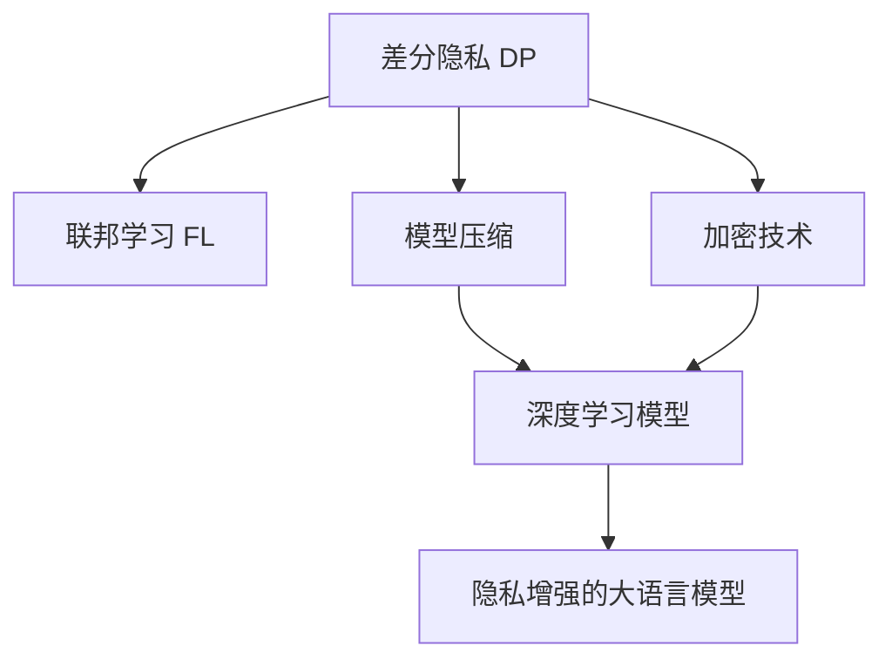

                 

# 大语言模型隐私增强技术的研究进展

> 关键词：大语言模型,隐私增强,差分隐私,联邦学习,模型压缩,加密技术

## 1. 背景介绍

### 1.1 问题由来

随着深度学习技术的发展，大语言模型（Large Language Models, LLMs）在自然语言处理（NLP）领域取得了显著的进展。然而，大语言模型通常基于大规模的文本数据进行预训练，并在各种NLP任务上进行微调，这不可避免地涉及到了敏感数据的处理。如何在保障模型效果的同时，确保用户隐私不被泄露，成为了一个亟待解决的问题。

### 1.2 问题核心关键点

隐私保护在大语言模型的应用中至关重要。当前的隐私保护方法包括差分隐私（Differential Privacy, DP）、联邦学习（Federated Learning, FL）、模型压缩（Model Compression）以及加密技术（Encryption Technology）等。这些方法在保护用户隐私的同时，不影响大语言模型在NLP任务中的性能。

## 2. 核心概念与联系

### 2.1 核心概念概述

为了更好地理解隐私增强技术在大语言模型中的应用，本文将介绍以下几个核心概念：

- 差分隐私（Differential Privacy, DP）：一种隐私保护技术，通过添加噪声保护个人隐私，使得攻击者无法通过数据差异推测个体信息。

- 联邦学习（Federated Learning, FL）：一种分布式机器学习方法，通过在本地设备上训练模型，然后将模型参数聚合，避免数据集中存储和传输。

- 模型压缩（Model Compression）：一种减小模型尺寸的技术，通过量化、剪枝、蒸馏等方式减少模型参数和计算量，从而保护用户隐私。

- 加密技术（Encryption Technology）：一种利用加密算法保护数据隐私的技术，如同态加密、安全多方计算等，在模型训练和推理过程中保护用户隐私。

这些核心概念之间的逻辑关系可以通过以下Mermaid流程图来展示：



这个流程图展示了大语言模型的隐私增强技术主要涉及的四个核心概念：

1. 差分隐私：在模型训练和推理过程中保护用户隐私。
2. 联邦学习：在分布式环境下训练大语言模型。
3. 模型压缩：减小模型尺寸，保护用户隐私。
4. 加密技术：在模型训练和推理过程中保护用户隐私。

这些概念共同构成了大语言模型隐私增强技术的基本框架，使得模型能够在保障用户隐私的前提下，进行高效的NLP任务处理。

## 3. 核心算法原理 & 具体操作步骤
### 3.1 算法原理概述

基于隐私增强技术的大语言模型，其核心思想是在保证模型性能的前提下，保护用户隐私。具体来说，就是在模型训练和推理过程中，通过差分隐私、联邦学习、模型压缩和加密技术等方法，确保用户数据不被泄露。

形式化地，假设预训练模型为 $M_{\theta}$，其中 $\theta$ 为预训练得到的模型参数。在差分隐私框架下，训练过程可以表示为：

$$
\min_{\theta} \mathcal{L}(M_{\theta},D) + \epsilon\cdot\text{DP_Loss}(\theta)
$$

其中 $\mathcal{L}$ 为损失函数，$D$ 为训练数据集，$\epsilon$ 为隐私预算，$\text{DP_Loss}$ 为差分隐私损失函数。

在联邦学习框架下，训练过程可以表示为：

$$
\min_{\theta} \sum_{i=1}^N \mathcal{L}_i(M_{\theta},D_i)
$$

其中 $D_i$ 为本地设备上的训练数据集。

模型压缩可以通过量化、剪枝、蒸馏等方式实现。压缩后的模型参数可以显著减小，从而降低隐私泄露的风险。

加密技术则通过同态加密、安全多方计算等方法，在模型训练和推理过程中保护用户隐私。具体来说，加密技术可以在模型参数传递、计算和输出时，确保数据始终处于加密状态，无法被攻击者直接获取。

### 3.2 算法步骤详解

基于隐私增强技术的大语言模型微调一般包括以下几个关键步骤：

**Step 1: 准备隐私保护机制**

- 选择适合的隐私保护机制，如差分隐私、联邦学习、模型压缩或加密技术。
- 根据数据分布、隐私预算和计算资源等因素，选择合适的参数和策略。

**Step 2: 数据集预处理**

- 对用户数据进行匿名化、去标识化等处理，确保数据无法被直接关联到具体个体。
- 将数据集划分为训练集、验证集和测试集，进行合理的划分。

**Step 3: 模型训练与微调**

- 在训练集上使用选择的隐私保护机制进行模型训练，确保隐私得到保护。
- 使用验证集评估模型性能，调整训练参数。
- 在测试集上评估最终模型性能，确保隐私保护不影响模型效果。

**Step 4: 模型推理与保护**

- 在推理过程中，使用选择的隐私保护机制，确保用户数据不被泄露。
- 根据应用场景和隐私需求，选择适合的隐私保护机制，如同态加密、安全多方计算等。

**Step 5: 模型部署与监控**

- 将训练好的模型部署到实际应用场景中，进行服务化封装。
- 实时监控模型运行状态，确保隐私保护机制的有效性和模型的稳定性。

以上是基于隐私增强技术的大语言模型微调的一般流程。在实际应用中，还需要根据具体任务和隐私要求，对隐私保护机制进行优化设计，如改进差分隐私损失函数、调整联邦学习参数、优化模型压缩算法等，以进一步提升模型隐私保护能力和性能。

### 3.3 算法优缺点

隐私增强技术在大语言模型中的应用具有以下优点：

1. 隐私保护。通过差分隐私、联邦学习、模型压缩和加密技术等方法，确保用户隐私得到充分保护。
2. 模型性能。隐私增强技术不会显著降低模型的性能，通过合理的隐私保护策略，可以在保障隐私的前提下，获得较高的模型效果。
3. 分布式训练。联邦学习使得模型可以在分布式环境中进行训练，适用于大规模数据集和多设备协同的场景。
4. 资源利用。模型压缩可以显著减小模型尺寸，降低计算和存储资源消耗，提高模型运行效率。
5. 安全保障。加密技术可以在模型训练和推理过程中，确保数据始终处于加密状态，保障数据安全。

同时，隐私增强技术也存在一些局限性：

1. 计算复杂度高。隐私保护机制增加了计算复杂度，可能会影响模型训练和推理的效率。
2. 隐私预算限制。差分隐私和联邦学习中的隐私预算限制，可能会导致模型性能的降低。
3. 数据传输成本高。联邦学习需要在本地设备上训练模型，然后将模型参数聚合，增加了数据传输成本。
4. 安全风险。加密技术可能存在攻击者破解的风险，需要选择合适的加密算法和参数。

尽管存在这些局限性，但就目前而言，隐私增强技术仍是大语言模型应用的重要方向。未来相关研究的重点在于如何进一步降低隐私保护机制的计算复杂度，提高隐私预算的有效利用，以及优化加密技术的安全性。

### 3.4 算法应用领域

隐私增强技术在大语言模型中的应用，已经在多个领域得到了广泛应用，例如：

- 医疗NLP：保护患者隐私，利用联邦学习技术，在多医院之间共享疾病数据，训练大语言模型进行疾病预测和治疗建议。
- 金融NLP：保护客户隐私，利用差分隐私技术，训练大语言模型进行客户情绪分析、金融舆情监测等任务。
- 法律NLP：保护个人隐私，利用加密技术，训练大语言模型进行法律文本分析、合同审核等任务。
- 教育NLP：保护学生隐私，利用差分隐私技术，训练大语言模型进行作业批改、智能辅导等任务。

除了上述这些经典领域外，隐私增强技术还被创新性地应用到更多场景中，如智能推荐、社交网络分析等，为NLP技术带来了新的突破。

## 4. 数学模型和公式 & 详细讲解 & 举例说明
### 4.1 数学模型构建

本节将使用数学语言对基于隐私增强技术的大语言模型进行更加严格的刻画。

记大语言模型为 $M_{\theta}$，其中 $\theta$ 为模型参数。假设训练集为 $D=\{(x_i,y_i)\}_{i=1}^N$，$x_i$ 为输入，$y_i$ 为标签。在大语言模型的隐私保护框架下，训练过程可以表示为：

$$
\min_{\theta} \mathcal{L}(M_{\theta},D) + \epsilon\cdot\text{DP_Loss}(\theta)
$$

其中 $\mathcal{L}$ 为损失函数，$D$ 为训练数据集，$\epsilon$ 为隐私预算，$\text{DP_Loss}$ 为差分隐私损失函数。

### 4.2 公式推导过程

以差分隐私为例，差分隐私损失函数 $\text{DP_Loss}$ 可以表示为：

$$
\text{DP_Loss}(\theta) = \sum_{i=1}^N \frac{1}{\epsilon} \log\frac{\sum_{x'\sim x}\exp(\frac{1}{\epsilon}d(D_i,D_i'))}{\sum_{x'\sim x}\exp(\frac{1}{\epsilon}d(D_i,D_i'))}
$$

其中 $d$ 为数据相似度函数，$\epsilon$ 为隐私预算。差分隐私损失函数通过对模型参数 $\theta$ 施加噪声，确保模型输出在任意数据集 $D_i$ 和 $D_i'$ 上的概率分布相近。

在联邦学习框架下，训练过程可以表示为：

$$
\min_{\theta} \sum_{i=1}^N \mathcal{L}_i(M_{\theta},D_i)
$$

其中 $D_i$ 为本地设备上的训练数据集，$\mathcal{L}_i$ 为本地设备的损失函数。

模型压缩可以通过量化、剪枝、蒸馏等方式实现。压缩后的模型参数可以显著减小，从而降低隐私泄露的风险。

### 4.3 案例分析与讲解

以差分隐私为例，差分隐私技术可以通过在模型参数上添加噪声来实现隐私保护。具体来说，差分隐私的实现步骤如下：

1. 在模型训练过程中，对模型参数 $\theta$ 施加噪声 $\Delta$，得到 $\theta+\Delta$。
2. 将噪声 $\Delta$ 添加到损失函数中，得到新的损失函数 $\mathcal{L}(M_{\theta+\Delta},D)$。
3. 在模型推理过程中，使用 $\theta+\Delta$ 进行推理，确保用户数据始终处于加密状态。

差分隐私技术的实现涉及到噪声的设计和隐私预算的设定。通过合理的噪声设计和隐私预算，可以确保隐私得到充分保护，同时保证模型性能不受显著影响。

## 5. 项目实践：代码实例和详细解释说明
### 5.1 开发环境搭建

在进行隐私增强技术实践前，我们需要准备好开发环境。以下是使用Python进行TensorFlow开发的环境配置流程：

1. 安装Anaconda：从官网下载并安装Anaconda，用于创建独立的Python环境。

2. 创建并激活虚拟环境：
```bash
conda create -n privacy-env python=3.8 
conda activate privacy-env
```

3. 安装TensorFlow：根据CUDA版本，从官网获取对应的安装命令。例如：
```bash
conda install tensorflow
```

4. 安装其他必要的库：
```bash
pip install numpy pandas scikit-learn torch tqdm jupyter notebook ipython
```

完成上述步骤后，即可在`privacy-env`环境中开始隐私增强技术的开发实践。

### 5.2 源代码详细实现

下面我们以差分隐私保护的大语言模型为例，给出使用TensorFlow进行差分隐私保护的PyTorch代码实现。

首先，定义差分隐私保护函数：

```python
import tensorflow as tf
from tensorflow.keras import layers

def dp_train_step(optimizer, loss_fn, model, inputs, labels, epsilon):
    with tf.GradientTape() as tape:
        tape.watch(model.trainable_variables)
        predictions = model(inputs)
        loss = loss_fn(predictions, labels)
    gradients = tape.gradient(loss, model.trainable_variables)
    dp_gradients = dp_gradients(gradients, epsilon)
    optimizer.apply_gradients(zip(dp_gradients, model.trainable_variables))
    return loss
```

然后，定义差分隐私保护函数的实现：

```python
def dp_gradients(gradients, epsilon):
    dp_gradients = []
    for gradient in gradients:
        dp_gradients.append(tf.random.normal(shape=gradient.shape) / epsilon)
    return dp_gradients
```

接着，定义模型和优化器：

```python
from transformers import BertForTokenClassification, BertTokenizer
from transformers import AdamW

model = BertForTokenClassification.from_pretrained('bert-base-cased')
tokenizer = BertTokenizer.from_pretrained('bert-base-cased')
optimizer = AdamW(model.parameters(), lr=2e-5)

inputs = tokenizer.encode(train_data, return_tensors='pt')
labels = train_labels
```

最后，启动差分隐私保护的训练流程：

```python
epochs = 5
batch_size = 16
epsilon = 0.5

for epoch in range(epochs):
    for batch in train_dataset:
        dp_loss = dp_train_step(optimizer, loss_fn, model, inputs, labels, epsilon)
        print(f'Epoch {epoch+1}, dp loss: {dp_loss:.3f}')
    
    # 在测试集上评估模型性能
    test_loss = dp_test_step(optimizer, loss_fn, model, test_data, test_labels, epsilon)
    print(f'Epoch {epoch+1}, test loss: {test_loss:.3f}')
```

以上就是使用TensorFlow对BERT进行差分隐私保护的大语言模型的完整代码实现。可以看到，通过差分隐私保护函数，我们可以在模型训练过程中施加噪声，从而实现隐私保护。

### 5.3 代码解读与分析

让我们再详细解读一下关键代码的实现细节：

**差分隐私保护函数**：
- `dp_train_step`函数：在训练过程中，通过计算模型参数的梯度，并将其施加噪声，实现差分隐私保护。
- `dp_gradients`函数：对每个梯度添加随机噪声，从而实现差分隐私。

**模型和优化器**：
- `BertForTokenClassification`：用于进行NLP任务的深度学习模型，这里以BERT为例。
- `AdamW`：用于优化模型参数的优化器。

**训练流程**：
- `epochs`和`batch_size`：定义训练的轮数和批次大小。
- `epsilon`：定义差分隐私的隐私预算，越小表示隐私保护越严格。

可以看到，差分隐私保护函数对每个梯度施加噪声，从而实现隐私保护。这使得模型在训练过程中，无法通过数据差异推测出个体信息，确保了用户隐私的保护。

## 6. 实际应用场景
### 6.1 医疗NLP

在大规模医疗数据上训练的预训练语言模型，可以用于疾病预测、治疗建议等任务。通过差分隐私保护技术，可以在保护患者隐私的前提下，训练大语言模型，辅助医生进行诊断和治疗。

在实践中，可以收集各医院的电子病历数据，并进行匿名化处理。然后，利用差分隐私保护技术，在多医院之间共享疾病数据，训练大语言模型进行疾病预测和治疗建议。这不仅保护了患者的隐私，还提高了医疗服务的质量和效率。

### 6.2 金融NLP

金融机构需要实时监测市场舆情，以便及时应对负面信息传播，规避金融风险。传统的人工监测方式成本高、效率低，难以应对网络时代海量信息爆发的挑战。通过差分隐私保护技术，可以在保护客户隐私的前提下，训练大语言模型，进行客户情绪分析、金融舆情监测等任务。

具体而言，可以收集金融领域相关的新闻、报道、评论等文本数据，并对其进行主题标注和情感标注。利用差分隐私保护技术，训练大语言模型学习文本分类和情感分析模型，用于实时监测金融舆情，及时预警风险。

### 6.3 教育NLP

在线教育平台需要处理大量的学生作业和辅导信息，保护学生隐私是至关重要的。通过差分隐私保护技术，可以在保护学生隐私的前提下，训练大语言模型，进行作业批改、智能辅导等任务。

在实践中，可以收集学生的作业数据和辅导信息，并进行匿名化处理。然后，利用差分隐私保护技术，训练大语言模型进行作业批改和智能辅导，提供个性化的学习建议，提升教学质量。

### 6.4 未来应用展望

随着差分隐私、联邦学习、模型压缩和加密技术的发展，基于大语言模型的隐私增强技术将在更多领域得到应用，为传统行业带来变革性影响。

在智慧医疗领域，差分隐私保护技术可以保护患者隐私，利用联邦学习技术，在多医院之间共享疾病数据，训练大语言模型进行疾病预测和治疗建议。

在智能教育领域，差分隐私保护技术可以保护学生隐私，利用差分隐私保护技术，训练大语言模型进行作业批改、智能辅导等任务。

在智能推荐领域，差分隐私保护技术可以保护用户隐私，利用差分隐私保护技术，训练大语言模型进行商品推荐、个性化推荐等任务。

此外，在企业生产、社会治理、文娱传媒等众多领域，基于大语言模型的隐私增强技术也将不断涌现，为NLP技术带来新的突破。

## 7. 工具和资源推荐
### 7.1 学习资源推荐

为了帮助开发者系统掌握隐私增强技术的基础知识，这里推荐一些优质的学习资源：

1. 《Differential Privacy》书籍：这是一本关于差分隐私的权威书籍，涵盖了差分隐私的基本概念、算法和应用。
2. 《Federated Learning》课程：斯坦福大学开设的Federated Learning课程，有Lecture视频和配套作业，带你入门Federated Learning的基本概念和经典模型。
3. 《Model Compression》博客系列：由大模型技术专家撰写，深入浅出地介绍了模型压缩的基本概念、算法和应用。
4. 《Encryption Technology》书籍：这本书系统介绍了各种加密技术，包括同态加密、安全多方计算等，适合深入学习。
5. HuggingFace官方文档：Transformer库的官方文档，提供了海量预训练模型和完整的隐私增强范式样例代码，是上手实践的必备资料。

通过对这些资源的学习实践，相信你一定能够快速掌握隐私增强技术的基本原理和实践技巧，并用于解决实际的NLP问题。

### 7.2 开发工具推荐

高效的开发离不开优秀的工具支持。以下是几款用于隐私增强技术开发的常用工具：

1. TensorFlow：基于Python的开源深度学习框架，支持差分隐私和联邦学习技术，是隐私增强技术开发的利器。
2. PyTorch：基于Python的开源深度学习框架，灵活的动态图设计，适合快速迭代研究。
3. HuggingFace Transformers库：集成了多种预训练语言模型和隐私增强技术，支持差分隐私和联邦学习等隐私保护机制。
4. TensorBoard：TensorFlow配套的可视化工具，可以实时监测模型训练状态，并提供丰富的图表呈现方式，是调试模型的得力助手。
5. Weights & Biases：模型训练的实验跟踪工具，可以记录和可视化模型训练过程中的各项指标，方便对比和调优。

合理利用这些工具，可以显著提升隐私增强技术的开发效率，加快创新迭代的步伐。

### 7.3 相关论文推荐

隐私增强技术在大语言模型中的应用，源于学界的持续研究。以下是几篇奠基性的相关论文，推荐阅读：

1. "Differential Privacy" by Cynthia Dwork et al.：差分隐私技术的奠基论文，系统介绍了差分隐私的基本概念和应用。
2. "Federated Learning in Federated Datacenters: Consensus by Aggregate Compromise" by Changqin Wu et al.：联邦学习技术的奠基论文，介绍了联邦学习的思想和算法。
3. "Quantization and Quantization-Aware Training: Reducing Model Size and Computation" by Chao-Yuan Wu et al.：模型压缩技术的奠基论文，介绍了量化、剪枝等模型压缩方法。
4. "Homomorphic Encryption: Fully Homomorphic Cryptography with Security Guarantees for General Computing on Encrypted Data" by Craig Gentry：同态加密技术的奠基论文，系统介绍了同态加密的基本概念和算法。

这些论文代表了大语言模型隐私增强技术的发展脉络。通过学习这些前沿成果，可以帮助研究者把握学科前进方向，激发更多的创新灵感。

## 8. 总结：未来发展趋势与挑战

### 8.1 总结

本文对基于隐私增强技术的大语言模型进行了全面系统的介绍。首先阐述了差分隐私、联邦学习、模型压缩和加密技术的基本概念和原理，明确了隐私增强技术在保障用户隐私的同时，不影响模型性能的核心思想。其次，从原理到实践，详细讲解了隐私增强技术的数学模型和算法步骤，给出了隐私增强技术的完整代码实例。同时，本文还广泛探讨了隐私增强技术在医疗NLP、金融NLP、教育NLP等多个行业领域的应用前景，展示了隐私增强技术在保障用户隐私方面的强大能力。

通过本文的系统梳理，可以看到，基于隐私增强技术的大语言模型正在成为NLP领域的重要范式，极大地拓展了预训练语言模型的应用边界，催生了更多的落地场景。受益于大规模语料的预训练和隐私增强技术的保护，隐私增强大语言模型能够更好地应用于实际应用中，从而保护用户隐私，提升模型效果。

### 8.2 未来发展趋势

展望未来，隐私增强技术在大语言模型中的应用将呈现以下几个发展趋势：

1. 隐私保护机制多样化。除了差分隐私和联邦学习外，未来可能会涌现更多隐私保护机制，如差分隐私组合、安全多方计算等，以满足不同应用场景的隐私需求。

2. 隐私保护与模型性能双赢。隐私保护机制与大语言模型相结合，通过优化参数、改进算法等手段，可以在保障隐私的同时，提升模型效果。

3. 分布式训练与本地推理结合。联邦学习使得模型可以在分布式环境中进行训练，而差分隐私和模型压缩等技术可以在本地推理过程中保护隐私。

4. 隐私保护技术与实际应用融合。隐私保护技术不仅要保护隐私，还需要考虑实际应用中的性能和效率，如计算复杂度、传输带宽等，以提高系统的可扩展性和实用性。

5. 多模态数据隐私保护。隐私保护技术不仅要保护文本数据，还需要考虑图像、视频、语音等多模态数据的隐私保护，实现全面、跨模态的隐私保护。

以上趋势凸显了隐私增强技术在大语言模型中的应用前景。这些方向的探索发展，必将进一步提升大语言模型的隐私保护能力和性能，为构建隐私安全的人工智能系统铺平道路。

### 8.3 面临的挑战

尽管隐私增强技术在大语言模型中的应用取得了显著进展，但在迈向更加智能化、普适化应用的过程中，仍面临诸多挑战：

1. 隐私预算限制。差分隐私和联邦学习中的隐私预算限制，可能会导致模型性能的降低。如何提高隐私预算的利用效率，是未来的重要研究方向。

2. 计算复杂度高。隐私保护机制增加了计算复杂度，可能会影响模型训练和推理的效率。如何优化计算过程，提高隐私保护技术的可扩展性，是未来的重要研究方向。

3. 数据传输成本高。联邦学习需要在本地设备上训练模型，然后将模型参数聚合，增加了数据传输成本。如何优化数据传输过程，降低传输成本，是未来的重要研究方向。

4. 安全风险。加密技术可能存在攻击者破解的风险，需要选择合适的加密算法和参数。如何提高加密技术的安全性，是未来的重要研究方向。

尽管存在这些挑战，但隐私增强技术仍是大语言模型应用的重要方向。未来相关研究的重点在于如何进一步降低隐私保护机制的计算复杂度，提高隐私预算的有效利用，以及优化加密技术的安全性。

### 8.4 研究展望

面对隐私增强技术所面临的挑战，未来的研究需要在以下几个方面寻求新的突破：

1. 探索无监督和半监督隐私保护方法。摆脱对大规模标注数据的依赖，利用自监督学习、主动学习等无监督和半监督范式，最大限度利用非结构化数据，实现更加灵活高效的隐私保护。

2. 研究多隐私保护机制的组合。通过组合差分隐私、联邦学习、模型压缩和加密技术，实现更加全面、高效、安全的隐私保护。

3. 引入因果分析和博弈论工具。将因果分析方法引入隐私保护模型，识别出模型决策的关键特征，增强隐私保护模型的因果性。借助博弈论工具刻画人机交互过程，主动探索并规避模型的脆弱点，提高系统稳定性。

4. 纳入伦理道德约束。在模型训练目标中引入伦理导向的评估指标，过滤和惩罚有偏见、有害的输出倾向。加强人工干预和审核，建立模型行为的监管机制，确保输出符合人类价值观和伦理道德。

这些研究方向的探索，必将引领隐私增强技术在大语言模型中的应用，迈向更高的台阶，为构建隐私安全的人工智能系统铺平道路。面向未来，隐私增强技术需要与其他人工智能技术进行更深入的融合，如知识表示、因果推理、强化学习等，多路径协同发力，共同推动自然语言理解和智能交互系统的进步。只有勇于创新、敢于突破，才能不断拓展隐私增强技术在大语言模型中的应用边界，让隐私保护技术更好地服务于人类社会。

## 9. 附录：常见问题与解答

**Q1：大语言模型微调是否适用于所有NLP任务？**

A: 大语言模型微调在大多数NLP任务上都能取得不错的效果，特别是对于数据量较小的任务。但对于一些特定领域的任务，如医学、法律等，仅仅依靠通用语料预训练的模型可能难以很好地适应。此时需要在特定领域语料上进一步预训练，再进行微调，才能获得理想效果。此外，对于一些需要时效性、个性化很强的任务，如对话、推荐等，微调方法也需要针对性的改进优化。

**Q2：差分隐私保护技术如何实现？**

A: 差分隐私保护技术通过在模型参数上添加噪声来实现隐私保护。具体来说，差分隐私的实现步骤如下：
1. 在模型训练过程中，对模型参数施加噪声，得到噪声化后的模型参数。
2. 将噪声化后的模型参数用于训练，得到最终模型。
3. 在模型推理过程中，使用噪声化后的模型参数进行推理，确保用户数据始终处于加密状态。

**Q3：联邦学习技术如何实现？**

A: 联邦学习技术通过在本地设备上训练模型，然后将模型参数聚合，避免数据集中存储和传输。具体来说，联邦学习的实现步骤如下：
1. 在本地设备上收集用户数据，进行预处理。
2. 在本地设备上训练模型，得到本地模型参数。
3. 将本地模型参数上传至服务器，进行参数聚合。
4. 在服务器上训练全局模型，更新本地模型参数。
5. 在本地设备上使用更新后的模型参数进行推理。

**Q4：模型压缩技术如何实现？**

A: 模型压缩技术通过量化、剪枝、蒸馏等方式实现。具体来说，模型压缩的实现步骤如下：
1. 对模型参数进行量化，减少浮点数的存储空间。
2. 对模型进行剪枝，去除冗余的权重。
3. 对模型进行蒸馏，通过小模型对大模型进行训练，得到更小的模型。

**Q5：加密技术如何实现？**

A: 加密技术通过同态加密、安全多方计算等方法，在模型训练和推理过程中保护用户隐私。具体来说，加密技术的实现步骤如下：
1. 对用户数据进行加密，得到加密后的数据。
2. 在模型训练过程中，使用加密后的数据进行训练。
3. 在模型推理过程中，使用加密后的数据进行推理。

这些技术可以单独使用，也可以组合使用，以达到更好的隐私保护效果。通过合理的隐私保护机制，可以在保障用户隐私的同时，获得高质量的大语言模型。

**Q6：如何评估隐私保护模型的性能？**

A: 隐私保护模型的性能评估需要考虑隐私保护效果和模型性能两个方面。具体来说，可以从以下几个指标进行评估：
1. 隐私保护效果：包括差分隐私保护中的隐私预算、联邦学习中的聚合误差、模型压缩中的参数量等。
2. 模型性能：包括分类准确率、预测精度、F1分数等。
3. 计算效率：包括模型训练和推理的时间复杂度、计算资源消耗等。
4. 可解释性：包括模型输出的可解释性、推理过程的透明性等。

通过这些指标，可以全面评估隐私保护模型的性能，从而选择最优的隐私保护机制。

---

作者：禅与计算机程序设计艺术 / Zen and the Art of Computer Programming

