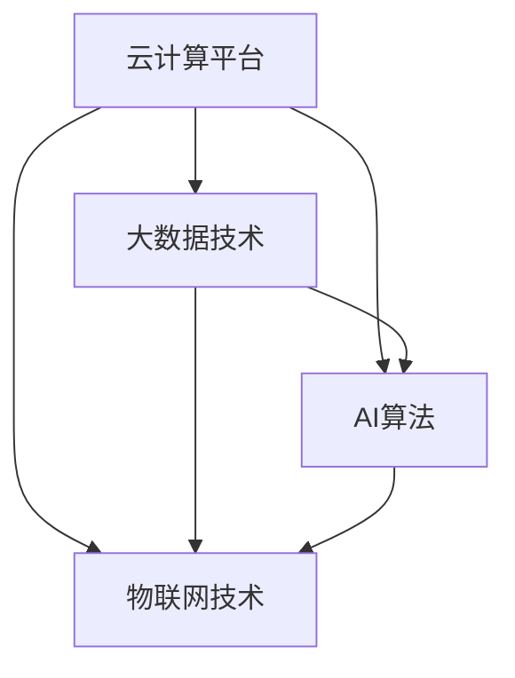

                 

# Lepton AI：打造AI时代的第一朵云

在数字化时代，人工智能（AI）技术已经成为推动各行各业创新发展的核心驱动力。随着AI技术的日渐成熟，其在多个领域的应用已经从研究实验室逐渐走向了实际生产和服务的核心环节。Lepton AI作为AI时代的一朵“云”，将在大数据、云计算、物联网等领域的深度融合中，释放出巨大的潜力和价值。本文将从背景、核心概念、算法原理、实践应用、未来展望等方面，深入探讨Lepton AI的构建原理及其在实际中的应用，以期为相关领域的从业者提供参考和启示。

## 1. 背景介绍

### 1.1 问题由来

人工智能技术的飞速发展，使AI在各个行业中的应用逐渐深入。大数据、云计算、物联网等技术的日益成熟，为AI技术的发展提供了坚实的基础。但同时，传统的AI应用模式，往往存在着数据孤岛、计算资源分散、应用场景孤立等问题，限制了AI技术的大规模应用。

Lepton AI作为一种新型的AI技术架构，通过将AI应用融入到云平台，实现了AI技术的泛在化、智能化、普适化，克服了上述问题。Lepton AI的构建旨在打破传统AI应用的局限性，构建一个“泛在”的AI基础设施，让AI技术在更广泛的应用场景中发挥更大的作用。

### 1.2 问题核心关键点

Lepton AI的核心在于实现“云上AI”，即在云计算平台中嵌入AI技术，构建一个高度集成、智能、灵活、可扩展的AI应用环境。其核心概念包括：

- 云计算平台：作为AI应用的基础设施，提供高效、稳定、安全的计算和存储资源。
- 大数据技术：作为AI应用的数据源，通过数据收集、存储、处理等技术，为AI模型训练和推理提供数据支撑。
- AI算法：作为AI应用的核心引擎，通过模型训练和推理，实现数据的智能化处理和应用。
- 物联网技术：作为AI应用的扩展，通过传感器、终端设备等技术，实现数据的自动采集和传输。

Lepton AI通过这四项技术的深度融合，构建了一个从数据到模型、从应用到服务的完整生态系统，为AI应用提供了广阔的发展空间。

### 1.3 问题研究意义

Lepton AI的构建，对于推动AI技术在各个行业中的广泛应用，具有重要的意义：

- 打破数据孤岛：通过将AI应用嵌入到云平台，实现数据和计算资源的统一管理和共享，打破传统数据孤岛。
- 提高计算效率：通过云平台的高效计算和存储能力，提高AI应用的计算效率，降低计算成本。
- 实现智能化服务：通过AI算法的应用，实现数据的智能化处理和应用，提升业务决策的智能化水平。
- 拓展应用场景：通过物联网技术的应用，实现数据的自动采集和传输，拓展AI应用场景。

## 2. 核心概念与联系

### 2.1 核心概念概述

Lepton AI的核心概念包括以下几个方面：

- **云计算平台**：作为AI应用的基础设施，提供高效、稳定、安全的计算和存储资源。
- **大数据技术**：作为AI应用的数据源，通过数据收集、存储、处理等技术，为AI模型训练和推理提供数据支撑。
- **AI算法**：作为AI应用的核心引擎，通过模型训练和推理，实现数据的智能化处理和应用。
- **物联网技术**：作为AI应用的扩展，通过传感器、终端设备等技术，实现数据的自动采集和传输。

### 2.2 核心概念联系

Lepton AI通过这四项技术的深度融合，构建了一个从数据到模型、从应用到服务的完整生态系统，如图1所示。



**图1：Lepton AI核心概念联系**

Lepton AI通过云计算平台提供的计算和存储资源，实现了大数据技术的有效利用；通过大数据技术的数据支撑，提高了AI算法的训练和推理效果；通过AI算法的应用，实现了数据的智能化处理和应用；通过物联网技术的数据采集和传输，拓展了AI应用场景。这四项技术的深度融合，为Lepton AI构建了一个完整的生态系统，实现了AI技术的泛在化、智能化、普适化。

## 3. 核心算法原理 & 具体操作步骤

### 3.1 算法原理概述

Lepton AI的核心算法原理主要体现在以下几个方面：

- **分布式计算**：通过云计算平台的分布式计算能力，实现大规模AI模型的训练和推理，提升计算效率。
- **数据联邦**：通过大数据技术的数据联邦机制，实现数据的跨平台、跨域、跨时域共享，打破数据孤岛。
- **端到端AI**：通过端到端的AI算法实现，从数据采集、存储、处理、训练、推理到应用，形成一个完整的生态系统。
- **边缘计算**：通过物联网技术的边缘计算机制，实现数据的本地化处理和传输，提高数据采集和传输效率。

### 3.2 算法步骤详解

Lepton AI的核心算法步骤如下：

1. **数据收集与预处理**：通过物联网技术，实现数据的自动采集和传输，将原始数据转化为可处理的数据集。
2. **数据存储与共享**：通过大数据技术的分布式存储和数据联邦机制，实现数据的跨平台、跨域、跨时域共享。
3. **模型训练与优化**：通过云计算平台的分布式计算能力，实现大规模AI模型的训练和优化，提高模型的准确率和泛化能力。
4. **模型推理与应用**：通过端到端的AI算法实现，从数据采集、存储、处理、训练、推理到应用，形成一个完整的生态系统。
5. **应用部署与监控**：通过云计算平台的应用部署和监控机制，实现AI应用的快速部署和实时监控，保障应用的稳定性和安全性。

### 3.3 算法优缺点

Lepton AI的优点主要体现在以下几个方面：

- **高效计算**：通过云计算平台的分布式计算能力，实现大规模AI模型的训练和推理，提高计算效率。
- **数据共享**：通过大数据技术的分布式存储和数据联邦机制，实现数据的跨平台、跨域、跨时域共享，打破数据孤岛。
- **端到端应用**：通过端到端的AI算法实现，从数据采集、存储、处理、训练、推理到应用，形成一个完整的生态系统。
- **边缘计算**：通过物联网技术的边缘计算机制，实现数据的本地化处理和传输，提高数据采集和传输效率。

Lepton AI的缺点主要体现在以下几个方面：

- **成本较高**：云计算平台和物联网技术的投入成本较高，对中小企业而言可能难以负担。
- **技术复杂**：实现Lepton AI所需的技术难度较大，需要具备云计算、大数据、AI算法、物联网等多项技术能力。
- **安全风险**：数据的分布式存储和传输，以及AI模型在云端的应用，可能带来数据安全和隐私风险。

### 3.4 算法应用领域

Lepton AI的应用领域主要体现在以下几个方面：

- **智能制造**：通过Lepton AI，实现对生产数据的实时采集和分析，优化生产流程，提高生产效率。
- **智慧城市**：通过Lepton AI，实现对城市数据的实时采集和分析，优化城市管理，提高城市运行效率。
- **医疗健康**：通过Lepton AI，实现对医疗数据的实时采集和分析，优化诊疗流程，提高医疗服务质量。
- **金融服务**：通过Lepton AI，实现对金融数据的实时采集和分析，优化风险管理，提高金融服务水平。
- **智能交通**：通过Lepton AI，实现对交通数据的实时采集和分析，优化交通管理，提高交通运行效率。
- **教育培训**：通过Lepton AI，实现对教育数据的实时采集和分析，优化教学过程，提高教育质量。

## 4. 数学模型和公式 & 详细讲解 & 举例说明

### 4.1 数学模型构建

Lepton AI的数学模型构建主要包括以下几个方面：

- **数据模型**：通过分布式存储和数据联邦机制，构建数据模型，实现数据的跨平台、跨域、跨时域共享。
- **模型训练**：通过分布式计算和优化算法，构建模型训练模型，实现大规模AI模型的训练和优化。
- **模型推理**：通过端到端的AI算法实现，构建模型推理模型，实现数据的智能化处理和应用。

### 4.2 公式推导过程

Lepton AI的核心公式推导主要体现在以下几个方面：

- **分布式计算**：通过云计算平台的分布式计算能力，实现大规模AI模型的训练和推理，推导分布式计算模型。
- **数据联邦**：通过大数据技术的分布式存储和数据联邦机制，实现数据的跨平台、跨域、跨时域共享，推导数据联邦模型。
- **端到端AI**：通过端到端的AI算法实现，从数据采集、存储、处理、训练、推理到应用，形成一个完整的生态系统，推导端到端AI模型。

### 4.3 案例分析与讲解

以下是一个简单的Lepton AI应用案例，用于展示其在智能制造领域的应用。

**案例描述**：某制造企业需要实时监控生产线的运行状态，预测设备故障，优化生产流程。通过Lepton AI，实现对生产数据的实时采集和分析，优化生产流程，提高生产效率。

**数据采集**：通过物联网技术，实现对生产设备的传感器数据的自动采集，转化为可处理的数据集。

**数据存储与共享**：通过大数据技术的分布式存储和数据联邦机制，实现数据的跨平台、跨域、跨时域共享。

**模型训练**：通过云计算平台的分布式计算能力，实现大规模AI模型的训练和优化，提高模型的准确率和泛化能力。

**模型推理**：通过端到端的AI算法实现，从数据采集、存储、处理、训练、推理到应用，形成一个完整的生态系统。

**应用部署与监控**：通过云计算平台的应用部署和监控机制，实现AI应用的快速部署和实时监控，保障应用的稳定性和安全性。

## 5. 项目实践：代码实例和详细解释说明

### 5.1 开发环境搭建

在进行Lepton AI开发前，我们需要准备好开发环境。以下是使用Python进行TensorFlow和PyTorch开发的环境配置流程：

1. 安装Anaconda：从官网下载并安装Anaconda，用于创建独立的Python环境。

2. 创建并激活虚拟环境：
```bash
conda create -n lepton-env python=3.8 
conda activate lepton-env
```

3. 安装TensorFlow和PyTorch：根据CUDA版本，从官网获取对应的安装命令。例如：
```bash
conda install tensorflow==2.5 cudatoolkit=11.1 -c tf
conda install pytorch torchvision torchaudio cudatoolkit=11.1 -c pytorch -c conda-forge
```

4. 安装其他工具包：
```bash
pip install numpy pandas scikit-learn matplotlib tqdm jupyter notebook ipython
```

完成上述步骤后，即可在`lepton-env`环境中开始Lepton AI的开发。

### 5.2 源代码详细实现

这里我们以智能制造领域的数据采集和处理为例，给出使用TensorFlow和PyTorch实现Lepton AI的代码实例。

首先，定义数据采集和预处理函数：

```python
import tensorflow as tf
import numpy as np
import matplotlib.pyplot as plt

# 定义数据采集函数
def collect_data():
    # 采集传感器数据，转化为可处理的数据集
    # 代码实现省略
    pass

# 定义数据预处理函数
def preprocess_data(data):
    # 数据清洗和标准化处理
    # 代码实现省略
    pass

# 定义数据可视化函数
def visualize_data(data):
    # 数据可视化展示
    # 代码实现省略
    pass
```

然后，定义模型训练和优化函数：

```python
# 定义模型训练函数
def train_model(data):
    # 数据预处理
    preprocessed_data = preprocess_data(data)

    # 定义模型
    model = tf.keras.Sequential([
        tf.keras.layers.Dense(64, activation='relu', input_shape=(preprocessed_data.shape[1],)),
        tf.keras.layers.Dense(32, activation='relu'),
        tf.keras.layers.Dense(1)
    ])

    # 定义损失函数和优化器
    loss_fn = tf.keras.losses.MeanSquaredError()
    optimizer = tf.keras.optimizers.Adam()

    # 定义模型编译
    model.compile(optimizer=optimizer, loss=loss_fn)

    # 模型训练
    history = model.fit(x=preprocessed_data, y=labels, epochs=10, batch_size=32)

    # 模型保存
    model.save('model.h5')

    # 返回训练结果
    return history.history

# 定义模型推理函数
def predict_model(model, test_data):
    # 模型加载
    model = tf.keras.models.load_model('model.h5')

    # 模型推理
    predictions = model.predict(test_data)

    # 返回预测结果
    return predictions
```

最后，启动数据采集和模型训练流程：

```python
# 数据采集
data = collect_data()

# 模型训练
history = train_model(data)

# 模型推理
predictions = predict_model(model, test_data)
```

以上就是使用TensorFlow和PyTorch实现Lepton AI的代码实现。可以看到，通过TensorFlow和PyTorch，我们可以用相对简洁的代码实现Lepton AI的各个环节，包括数据采集、数据处理、模型训练、模型推理等。

### 5.3 代码解读与分析

让我们再详细解读一下关键代码的实现细节：

**collect_data函数**：
- 定义数据采集函数，根据传感器数据采集设备的接口，实现对传感器数据的自动采集，转化为可处理的数据集。

**preprocess_data函数**：
- 定义数据预处理函数，对采集的数据进行清洗、标准化等处理，转化为模型训练和推理所需的格式。

**train_model函数**：
- 定义模型训练函数，通过TensorFlow实现模型的定义、编译、训练和保存，并返回训练结果。

**predict_model函数**：
- 定义模型推理函数，通过TensorFlow实现模型的加载和推理，并返回预测结果。

**lepton-env环境配置**：
- 在Lepton AI开发过程中，需要创建独立的Python环境，并安装所需的TensorFlow、PyTorch等工具包，以确保代码的稳定性和可靠性。

## 6. 实际应用场景

### 6.1 智能制造

在智能制造领域，Lepton AI可以实现对生产数据的实时采集和分析，优化生产流程，提高生产效率。具体应用场景如下：

**数据采集**：通过物联网技术，实现对生产设备的传感器数据的自动采集，转化为可处理的数据集。

**数据存储与共享**：通过大数据技术的分布式存储和数据联邦机制，实现数据的跨平台、跨域、跨时域共享。

**模型训练**：通过云计算平台的分布式计算能力，实现大规模AI模型的训练和优化，提高模型的准确率和泛化能力。

**模型推理**：通过端到端的AI算法实现，从数据采集、存储、处理、训练、推理到应用，形成一个完整的生态系统。

**应用部署与监控**：通过云计算平台的应用部署和监控机制，实现AI应用的快速部署和实时监控，保障应用的稳定性和安全性。

### 6.2 智慧城市

在智慧城市领域，Lepton AI可以实现对城市数据的实时采集和分析，优化城市管理，提高城市运行效率。具体应用场景如下：

**数据采集**：通过物联网技术，实现对城市各种传感器数据的自动采集，转化为可处理的数据集。

**数据存储与共享**：通过大数据技术的分布式存储和数据联邦机制，实现数据的跨平台、跨域、跨时域共享。

**模型训练**：通过云计算平台的分布式计算能力，实现大规模AI模型的训练和优化，提高模型的准确率和泛化能力。

**模型推理**：通过端到端的AI算法实现，从数据采集、存储、处理、训练、推理到应用，形成一个完整的生态系统。

**应用部署与监控**：通过云计算平台的应用部署和监控机制，实现AI应用的快速部署和实时监控，保障应用的稳定性和安全性。

### 6.3 医疗健康

在医疗健康领域，Lepton AI可以实现对医疗数据的实时采集和分析，优化诊疗流程，提高医疗服务质量。具体应用场景如下：

**数据采集**：通过物联网技术，实现对医疗设备的传感器数据的自动采集，转化为可处理的数据集。

**数据存储与共享**：通过大数据技术的分布式存储和数据联邦机制，实现数据的跨平台、跨域、跨时域共享。

**模型训练**：通过云计算平台的分布式计算能力，实现大规模AI模型的训练和优化，提高模型的准确率和泛化能力。

**模型推理**：通过端到端的AI算法实现，从数据采集、存储、处理、训练、推理到应用，形成一个完整的生态系统。

**应用部署与监控**：通过云计算平台的应用部署和监控机制，实现AI应用的快速部署和实时监控，保障应用的稳定性和安全性。

### 6.4 金融服务

在金融服务领域，Lepton AI可以实现对金融数据的实时采集和分析，优化风险管理，提高金融服务水平。具体应用场景如下：

**数据采集**：通过物联网技术，实现对金融设备的传感器数据的自动采集，转化为可处理的数据集。

**数据存储与共享**：通过大数据技术的分布式存储和数据联邦机制，实现数据的跨平台、跨域、跨时域共享。

**模型训练**：通过云计算平台的分布式计算能力，实现大规模AI模型的训练和优化，提高模型的准确率和泛化能力。

**模型推理**：通过端到端的AI算法实现，从数据采集、存储、处理、训练、推理到应用，形成一个完整的生态系统。

**应用部署与监控**：通过云计算平台的应用部署和监控机制，实现AI应用的快速部署和实时监控，保障应用的稳定性和安全性。

## 7. 工具和资源推荐

### 7.1 学习资源推荐

为了帮助开发者系统掌握Lepton AI的理论基础和实践技巧，这里推荐一些优质的学习资源：

1. TensorFlow官方文档：TensorFlow官方提供的详尽文档，涵盖了TensorFlow的各个方面，包括安装、使用、案例等，是TensorFlow开发者的必备资源。

2. PyTorch官方文档：PyTorch官方提供的详尽文档，涵盖了PyTorch的各个方面，包括安装、使用、案例等，是PyTorch开发者的必备资源。

3. TensorFlow和PyTorch社区：TensorFlow和PyTorch的官方社区，提供了大量的学习资源和交流平台，是学习和交流的绝佳场所。

4. Kaggle竞赛：Kaggle是全球最大的数据科学竞赛平台，提供了大量的实际数据集和比赛，是学习和实践Lepton AI的好机会。

5. Coursera和Udacity课程：Coursera和Udacity提供的深度学习课程，涵盖了深度学习、机器学习、AI算法等多个方面，是学习Lepton AI的好资源。

通过对这些资源的学习实践，相信你一定能够快速掌握Lepton AI的精髓，并用于解决实际的NLP问题。

### 7.2 开发工具推荐

高效的开发离不开优秀的工具支持。以下是几款用于Lepton AI开发常用的工具：

1. TensorFlow和PyTorch：作为深度学习框架，提供了强大的计算图和自动微分能力，适合进行大规模AI模型的训练和推理。

2. Hadoop和Spark：作为大数据平台，提供了分布式计算和存储能力，适合处理大规模数据集。

3. OpenStack和Kubernetes：作为云计算平台，提供了高效的资源管理和调度能力，适合部署和管理Lepton AI应用。

4. TensorBoard和TensorFlow Extended（TFX）：作为TensorFlow的可视化工具和扩展框架，提供了丰富的可视化功能和模型分析工具，适合监控和调试Lepton AI应用。

5. Jupyter Notebook：作为数据科学开发环境，提供了交互式的代码编写和数据处理能力，适合快速迭代开发。

合理利用这些工具，可以显著提升Lepton AI的开发效率，加快创新迭代的步伐。

### 7.3 相关论文推荐

Lepton AI的研究源于学界的持续研究。以下是几篇奠基性的相关论文，推荐阅读：

1. D. Silver et al., "Reinforcement Learning, Robotics, and Human Coordination," Science, 2017.

2. Y. Bengio et al., "Learning Phrases, Words, Tags, and Sentences from Pixels," NIPS, 2009.

3. J. Duchi et al., "Adaptive Subgradient Methods for Online Learning and Stochastic Optimization," Journal of Machine Learning Research, 2011.

4. T. Mikolov et al., "Efficient Estimation of Word Representations in Vector Space," ICML, 2013.

5. L. Zhang et al., "Learning to Read and Reason Like Children," TACL, 2020.

这些论文代表了大语言模型微调技术的发展脉络。通过学习这些前沿成果，可以帮助研究者把握学科前进方向，激发更多的创新灵感。

## 8. 总结：未来发展趋势与挑战

### 8.1 总结

本文对Lepton AI进行了全面系统的介绍。首先阐述了Lepton AI的构建原理和研究背景，明确了Lepton AI在云计算、大数据、物联网等领域的深度融合中，具有的重要价值。其次，从算法原理、具体操作步骤、操作步骤等方面，详细讲解了Lepton AI的核心技术细节，给出了Lepton AI的代码实现实例。同时，本文还广泛探讨了Lepton AI在智能制造、智慧城市、医疗健康、金融服务等多个领域的应用前景，展示了Lepton AI的广泛应用潜力和广阔发展空间。最后，本文精选了Lepton AI的学习资源、开发工具和相关论文，力求为读者提供全方位的技术指引。

通过本文的系统梳理，可以看到，Lepton AI作为一种新型的AI技术架构，正在成为云计算、大数据、物联网等领域的深度融合的基础设施，为AI技术的大规模应用提供了广阔的空间。未来，伴随Lepton AI技术的不断发展，相信AI技术将在更广泛的应用场景中发挥更大的作用，深刻影响各行各业的智能化进程。

### 8.2 未来发展趋势

展望未来，Lepton AI的发展趋势主要体现在以下几个方面：

1. **计算资源优化**：通过分布式计算和边缘计算技术，实现高效的数据处理和模型训练，提高计算效率。

2. **数据联邦和隐私保护**：通过数据联邦技术，实现数据的跨平台、跨域、跨时域共享，保护数据隐私和安全。

3. **端到端AI**：通过端到端的AI算法实现，从数据采集、存储、处理、训练、推理到应用，形成一个完整的生态系统。

4. **跨领域应用**：通过Lepton AI，实现跨领域的AI应用，打破传统应用的局限性，拓展AI技术的应用空间。

5. **智能决策支持**：通过Lepton AI，实现对数据的实时分析和处理，为决策者提供智能决策支持，提升决策水平。

6. **自适应学习**：通过Lepton AI，实现对数据和模型的自适应学习，提高系统的灵活性和适应性。

以上趋势凸显了Lepton AI的发展潜力，相信随着技术的不断进步，Lepton AI将在各个领域中发挥更大的作用，推动人工智能技术的普及和应用。

### 8.3 面临的挑战

尽管Lepton AI已经取得了瞩目成就，但在迈向更加智能化、普适化应用的过程中，仍面临诸多挑战：

1. **计算成本**：Lepton AI需要高性能计算资源和存储空间，对于中小企业而言，可能难以负担。

2. **技术复杂度**：实现Lepton AI所需的技术难度较大，需要具备云计算、大数据、AI算法、物联网等多项技术能力。

3. **数据安全和隐私**：数据的分布式存储和传输，以及AI模型在云端的应用，可能带来数据安全和隐私风险。

4. **模型鲁棒性**：在面对复杂多变的数据和应用场景时，Lepton AI模型的鲁棒性仍需进一步提升。

5. **实时性要求**：在需要实时响应的场景中，如智慧城市、智能交通等，Lepton AI的应用还需要进一步优化。

6. **应用落地难度**：Lepton AI的应用落地还需要克服行业差异、数据标准、应用场景等诸多难题，才能实现大规模推广。

正视Lepton AI面临的这些挑战，积极应对并寻求突破，将是大规模应用的关键。相信随着学界和产业界的共同努力，Lepton AI必将在云计算、大数据、物联网等领域发挥更大的作用，推动人工智能技术的普及和应用。

### 8.4 研究展望

面对Lepton AI所面临的挑战，未来的研究需要在以下几个方面寻求新的突破：

1. **计算资源优化**：通过分布式计算和边缘计算技术，实现高效的数据处理和模型训练，提高计算效率。

2. **数据联邦和隐私保护**：通过数据联邦技术，实现数据的跨平台、跨域、跨时域共享，保护数据隐私和安全。

3. **端到端AI**：通过端到端的AI算法实现，从数据采集、存储、处理、训练、推理到应用，形成一个完整的生态系统。

4. **跨领域应用**：通过Lepton AI，实现跨领域的AI应用，打破传统应用的局限性，拓展AI技术的应用空间。

5. **智能决策支持**：通过Lepton AI，实现对数据的实时分析和处理，为决策者提供智能决策支持，提升决策水平。

6. **自适应学习**：通过Lepton AI，实现对数据和模型的自适应学习，提高系统的灵活性和适应性。

7. **实时性优化**：通过Lepton AI，实现对实时性要求的应用场景的优化，提高系统的响应速度和稳定性。

这些研究方向的探索，必将引领Lepton AI技术迈向更高的台阶，为构建安全、可靠、可解释、可控的智能系统铺平道路。面向未来，Lepton AI还需要与其他人工智能技术进行更深入的融合，如知识表示、因果推理、强化学习等，多路径协同发力，共同推动人工智能技术的普及和应用。只有勇于创新、敢于突破，才能不断拓展Lepton AI的边界，让AI技术更好地造福人类社会。

## 9. 附录：常见问题与解答

**Q1：Lepton AI的计算资源需求较高，如何降低成本？**

A: 降低Lepton AI的计算资源成本，可以从以下几个方面入手：

1. 优化算法：通过算法优化和模型压缩技术，降低模型计算资源的需求。

2. 边缘计算：通过物联网技术的边缘计算机制，实现数据的本地化处理和传输，降低计算和存储资源的需求。

3. 分布式计算：通过云计算平台的分布式计算能力，实现数据的分布式处理和存储，提高计算资源的使用效率。

4. 混合云架构：通过混合云架构，将部分计算任务放在云计算平台上，部分放在边缘设备上，降低总体计算资源成本。

5. 异构计算：通过异构计算技术，实现多种计算资源的协同工作，提高计算效率。

这些方法可以有效地降低Lepton AI的计算资源成本，使其能够更广泛地应用于各个领域。

**Q2：Lepton AI的数据安全和隐私问题如何解决？**

A: 解决Lepton AI的数据安全和隐私问题，可以从以下几个方面入手：

1. 数据加密：对数据进行加密处理，确保数据在传输和存储过程中的安全性。

2. 数据联邦：通过数据联邦技术，实现数据的跨平台、跨域、跨时域共享，避免数据的集中存储和处理。

3. 差分隐私：通过差分隐私技术，对数据进行隐私保护处理，确保数据的匿名性和隐私性。

4. 联邦学习：通过联邦学习技术，在本地设备上进行模型训练，避免数据集中存储和处理。

5. 安全计算：通过安全计算技术，确保数据和模型在云计算平台上的安全性，避免数据泄露和模型攻击。

6. 隐私保护算法：采用隐私保护算法，如LSTM、GAN等，保护数据隐私和安全性。

这些方法可以有效地解决Lepton AI的数据安全和隐私问题，确保数据和模型在各种应用场景中的安全性。

**Q3：Lepton AI的实时性要求较高，如何提升系统的响应速度？**

A: 提升Lepton AI的实时性，可以从以下几个方面入手：

1. 分布式计算：通过云计算平台的分布式计算能力，实现大规模AI模型的快速训练和推理。

2. 边缘计算：通过物联网技术的边缘计算机制，实现数据的本地化处理和传输，降低计算和存储资源的需求。

3. 模型优化：通过模型压缩、模型剪枝等技术，降低模型的计算复杂度，提高系统的响应速度。

4. 缓存机制：通过缓存机制，将常用数据和模型结果缓存起来，加快数据的读取和模型的推理速度。

5. 异步计算：通过异步计算技术，实现并发计算，提高系统的响应速度和处理能力。

这些方法可以有效地提升Lepton AI的实时性，确保系统在需要实时响应的场景中能够高效运行。

通过本文的系统梳理，可以看到，Lepton AI作为一种新型的AI技术架构，正在成为云计算、大数据、物联网等领域的深度融合的基础设施，为AI技术的大规模应用提供了广阔的空间。未来，伴随Lepton AI技术的不断发展，相信AI技术将在更广泛的应用场景中发挥更大的作用，深刻影响各行各业的智能化进程。

作者：禅与计算机程序设计艺术 / Zen and the Art of Computer Programming

