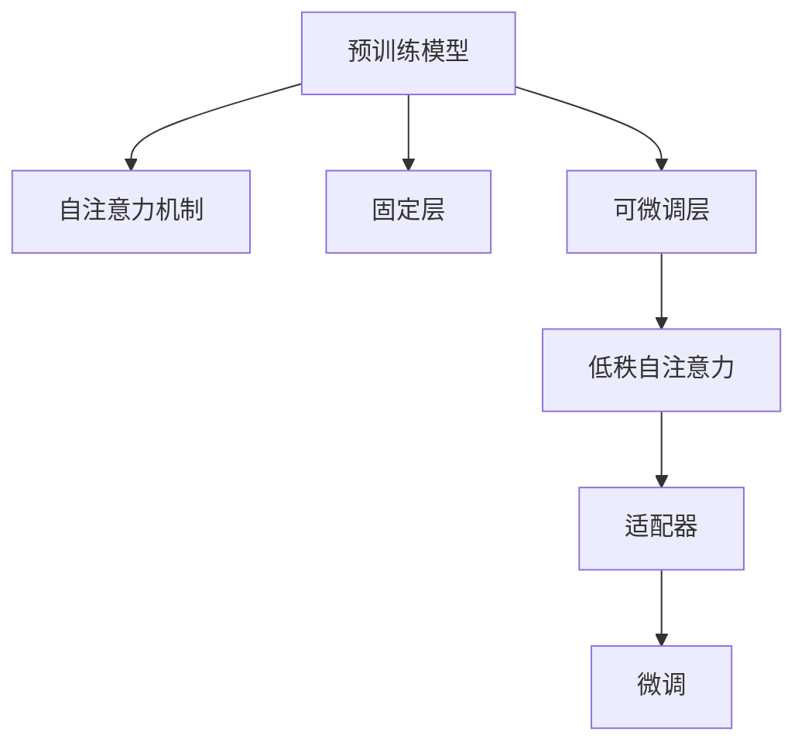

                 

# LoRA：低秩自注意力适配器

> 关键词：低秩自注意力,适配器,自适应微调,深度学习,计算机视觉

## 1. 背景介绍

### 1.1 问题由来
深度学习模型的参数量巨大，往往难以在不破坏预训练权重的前提下进行微调。基于此，LoRA (Low-Rank Adaptation) 提出了一种参数高效的微调方法，利用低秩自注意力机制，对模型进行高效的适配器调整。

近年来，随着深度学习模型在计算机视觉、自然语言处理等领域的广泛应用，对模型的微调需求日益增加。但在微调过程中，原始模型的参数量往往非常庞大，直接对其进行微调可能会导致模型的性能下降，或者需要非常大的计算资源。为了解决这个问题，LoRA 提出了一种新的微调方法，即低秩自注意力适配器，旨在提高模型的微调效率和灵活性。

### 1.2 问题核心关键点
LoRA 方法的核心在于将模型划分为固定层和可微调层，固定层由预训练模型中的底层组成，可微调层为低秩自注意力矩阵，通过调整这些低秩矩阵来适应新的任务。LoRA 的参数量远小于全参数微调方法，但依然能够获得较好的微调效果。

LoRA 的核心思想是通过对模型中的自注意力机制进行低秩分解，从而在微调过程中仅需调整少量的自注意力参数，大大减少了微调所需的计算资源，同时保持了模型的通用性和泛化能力。

## 2. 核心概念与联系

### 2.1 核心概念概述

为了更好地理解 LoRA 方法的原理和架构，本节将介绍几个核心概念：

- 低秩自注意力 (Low-Rank Self-Attention)：通过将自注意力矩阵分解为低秩矩阵的乘积形式，使得微调过程中仅需更新少量的自注意力参数，实现参数高效的微调。
- 适配器 (Adapter)：一种设计简单的自适应微调方法，通过在预训练模型的顶层添加可微调的自注意力层，实现对模型性能的灵活调整。
- 自适应微调 (Adaptive Transfer Learning)：指在预训练模型的基础上，通过微调适应新任务的方法，通常通过添加适配器或调整部分自注意力参数实现。
- 计算机视觉 (Computer Vision, CV)：LoRA 方法在计算机视觉领域的应用，主要用于图像分类、目标检测、图像生成等任务。

这些核心概念之间的逻辑关系可以通过以下 Mermaid 流程图来展示：



这个流程图展示了 LoRA 方法的总体架构：

1. 预训练模型通过自注意力机制学习通用特征。
2. 将模型划分为固定层和可微调层，其中可微调层通过低秩自注意力实现。
3. 适配器层通过调整低秩自注意力矩阵，适应新任务。
4. 通过微调适配器，实现模型在特定任务上的优化。

## 3. 核心算法原理 & 具体操作步骤
### 3.1 算法原理概述

LoRA 方法通过将自注意力矩阵分解为低秩矩阵的乘积形式，实现对模型自注意力机制的参数高效微调。其核心思想是：通过调整低秩自注意力矩阵，实现对模型的灵活微调，同时在保持模型通用性和泛化能力的前提下，大幅降低微调所需的计算资源。

形式化地，假设预训练模型为 $M_{\theta}$，其中 $\theta$ 为预训练得到的模型参数。给定新的微调任务，LoRA 方法通过在模型顶层添加一个低秩自注意力适配器，对模型进行微调。微调的目标是找到新的适配器参数 $W_{\phi}$，使得模型在微调任务上的输出与真实标签之间的差异最小化：

$$
\phi^* = \mathop{\arg\min}_{\phi} \mathcal{L}(M_{\theta}, W_{\phi}, D)
$$

其中 $\mathcal{L}$ 为针对任务 $T$ 设计的损失函数，用于衡量模型预测输出与真实标签之间的差异。通常使用交叉熵损失、均方误差损失等。

### 3.2 算法步骤详解

LoRA 方法的微调过程分为以下几个关键步骤：

**Step 1: 准备预训练模型和数据集**
- 选择合适的预训练模型 $M_{\theta}$，如 ResNet、BERT 等。
- 准备微调任务的训练集 $D=\{(x_i, y_i)\}_{i=1}^N$，划分为训练集、验证集和测试集。一般要求标注数据与预训练数据的分布不要差异过大。

**Step 2: 添加适配器**
- 在预训练模型的顶层添加低秩自注意力适配器，一般选择模型中的前几层作为固定层，最后一两层作为可微调层。
- 定义低秩自注意力矩阵 $W_{\phi}$，通常为 $d \times d$ 的矩阵，其中 $d$ 为模型的特征维度。

**Step 3: 设置微调超参数**
- 选择合适的优化算法及其参数，如 Adam、SGD 等，设置学习率、批大小、迭代轮数等。
- 设置适配器层的正则化技术及强度，包括权重衰减、Dropout、Early Stopping 等。

**Step 4: 执行梯度训练**
- 将训练集数据分批次输入模型，前向传播计算损失函数。
- 反向传播计算参数梯度，根据设定的优化算法和学习率更新模型参数。
- 周期性在验证集上评估模型性能，根据性能指标决定是否触发 Early Stopping。
- 重复上述步骤直到满足预设的迭代轮数或 Early Stopping 条件。

**Step 5: 测试和部署**
- 在测试集上评估微调后模型 $M_{\theta}$ 的性能，对比微调前后的精度提升。
- 使用微调后的模型对新样本进行推理预测，集成到实际的应用系统中。
- 持续收集新的数据，定期重新微调模型，以适应数据分布的变化。

以上是 LoRA 方法的微调流程。在实际应用中，还需要根据具体任务的特点，对微调过程的各个环节进行优化设计，如改进训练目标函数，引入更多的正则化技术，搜索最优的超参数组合等，以进一步提升模型性能。

### 3.3 算法优缺点

LoRA 方法具有以下优点：
1. 参数高效。LoRA 方法仅需调整少量的自注意力参数，显著减少了微调所需的计算资源。
2. 鲁棒性强。LoRA 方法能够较好地适应不同任务，保持模型的泛化能力。
3. 可解释性高。LoRA 方法的适配器层参数具有明确的物理含义，易于理解和调试。

同时，该方法也存在一定的局限性：
1. 模型容量受限。LoRA 方法的适配器层参数较少，可能无法处理非常复杂的任务。
2. 微调效果依赖于适配器设计。适配器层的设计和初始化对微调效果有重要影响。
3. 学习率设置难度大。由于自注意力矩阵的复杂性，微调的超参数设置较为复杂。

尽管存在这些局限性，但 LoRA 方法在实际应用中已经展现了其优越性，并在计算机视觉等领域的许多任务上取得了优异的效果。

### 3.4 算法应用领域

LoRA 方法已经在多个计算机视觉任务上得到了应用，包括图像分类、目标检测、图像生成等。

**图像分类**：LoRA 方法在图像分类任务上的微调效果显著。通过在 ImageNet 数据集上微调预训练模型，LoRA 方法在各种标准数据集上均取得了优异的分类精度。

**目标检测**：LoRA 方法在目标检测任务上也表现出色。通过在 COCO 数据集上微调预训练模型，LoRA 方法不仅提高了检测精度，还减少了计算资源消耗。

**图像生成**：LoRA 方法在图像生成任务上也具有广泛应用。通过微调生成模型，LoRA 方法能够生成高质量的图像样本，并进行风格迁移等创新应用。

除了上述这些经典任务外，LoRA 方法还被创新性地应用于图像配准、图像分割、视频分析等更多领域，为计算机视觉技术带来了新的突破。

## 4. 数学模型和公式 & 详细讲解  
### 4.1 数学模型构建

LoRA 方法的数学模型构建相对复杂，涉及矩阵分解和自注意力机制。

假设预训练模型为 $M_{\theta}$，其中 $\theta$ 为预训练得到的模型参数。在模型顶层添加一个低秩自注意力适配器 $W_{\phi}$，其中 $\phi$ 为适配器参数。假设输入数据为 $x$，模型输出为 $y$，则 LoRA 方法的数学模型可以表示为：

$$
y = M_{\theta}(x)W_{\phi}^T
$$

其中 $W_{\phi}$ 为低秩自注意力矩阵，通常表示为：

$$
W_{\phi} = U\mathcal{U} + V\mathcal{V}
$$

其中 $U$ 和 $V$ 为矩阵 $d \times d$，$\mathcal{U}$ 和 $\mathcal{V}$ 为矩阵 $k \times d$，$k$ 为低秩矩阵的秩。$U$ 和 $V$ 通过微调过程学习得到，$\mathcal{U}$ 和 $\mathcal{V}$ 在预训练过程中已经学习到了语言模型的知识。

### 4.2 公式推导过程

LoRA 方法的公式推导主要涉及矩阵乘法和矩阵分解。

在 LoRA 方法中，输入数据 $x$ 通过预训练模型 $M_{\theta}$ 进行特征提取，得到特征向量 $z$。然后将 $z$ 与低秩自注意力矩阵 $W_{\phi}$ 相乘，得到最终的输出 $y$：

$$
y = M_{\theta}(x)W_{\phi}^T
$$

在微调过程中，$W_{\phi}$ 通过反向传播进行优化，使得模型的输出与真实标签之间的差异最小化。具体的优化过程涉及矩阵乘法、矩阵求逆、梯度计算等数学运算。

### 4.3 案例分析与讲解

以图像分类任务为例，LoRA 方法的微调过程如下：

**Step 1: 数据准备**
- 收集 ImageNet 数据集，划分为训练集、验证集和测试集。
- 使用 ImageNet 数据集对预训练模型进行微调。

**Step 2: 适配器添加**
- 在预训练模型的顶层添加一个低秩自注意力适配器，一般选择模型中的前几层作为固定层，最后一两层作为可微调层。
- 定义低秩自注意力矩阵 $W_{\phi}$，通常为 $d \times d$ 的矩阵。

**Step 3: 微调过程**
- 设置优化器、学习率等超参数。
- 将训练集数据分批次输入模型，前向传播计算损失函数。
- 反向传播计算参数梯度，根据设定的优化算法和学习率更新模型参数。
- 周期性在验证集上评估模型性能，根据性能指标决定是否触发 Early Stopping。
- 重复上述步骤直到满足预设的迭代轮数或 Early Stopping 条件。

**Step 4: 模型测试**
- 在测试集上评估微调后模型 $M_{\theta}$ 的性能，对比微调前后的精度提升。
- 使用微调后的模型对新样本进行推理预测，集成到实际的应用系统中。
- 持续收集新的数据，定期重新微调模型，以适应数据分布的变化。

在实际应用中，LoRA 方法的微调过程需要仔细设计适配器层，选择合适的低秩矩阵秩 $k$ 和初始化策略，以确保微调效果和模型性能。此外，LoRA 方法的超参数设置也较为复杂，需要根据具体任务进行调整。

## 5. 项目实践：代码实例和详细解释说明
### 5.1 开发环境搭建

在进行 LoRA 方法的微调实践前，我们需要准备好开发环境。以下是使用Python进行PyTorch开发的环境配置流程：

1. 安装Anaconda：从官网下载并安装Anaconda，用于创建独立的Python环境。

2. 创建并激活虚拟环境：
```bash
conda create -n pytorch-env python=3.8 
conda activate pytorch-env
```

3. 安装PyTorch：根据CUDA版本，从官网获取对应的安装命令。例如：
```bash
conda install pytorch torchvision torchaudio cudatoolkit=11.1 -c pytorch -c conda-forge
```

4. 安装LoRA库：
```bash
pip install loqua
```

5. 安装各类工具包：
```bash
pip install numpy pandas scikit-learn matplotlib tqdm jupyter notebook ipython
```

完成上述步骤后，即可在`pytorch-env`环境中开始微调实践。

### 5.2 源代码详细实现

下面我们以图像分类任务为例，给出使用LoRA对ResNet模型进行微调的PyTorch代码实现。

首先，定义LoRA类，继承自`nn.Module`，并实现`forward`方法：

```python
import torch.nn as nn
import torch
from loqua import LoRa

class LoRA(nn.Module):
    def __init__(self, dim=256, num_layers=2, low_rank=True):
        super(LoRA, self).__init__()
        self.dim = dim
        self.num_layers = num_layers
        self.low_rank = low_rank
        
        self.lora = LoRa(dim, num_layers)
        
    def forward(self, x):
        return self.lora(x)
```

然后，定义模型和优化器：

```python
from torchvision import models
import torch.nn as nn
import torch.optim as optim

model = models.resnet18(pretrained=True)
model.fc = nn.Linear(512, 10)

lora = LoRA(dim=512, num_layers=2)
model.fc = lora

optimizer = optim.Adam(model.parameters(), lr=1e-3)
```

接着，定义训练和评估函数：

```python
from torch.utils.data import DataLoader
from tqdm import tqdm
from sklearn.metrics import classification_report

device = torch.device('cuda') if torch.cuda.is_available() else torch.device('cpu')
model.to(device)

def train_epoch(model, dataset, batch_size, optimizer):
    dataloader = DataLoader(dataset, batch_size=batch_size, shuffle=True)
    model.train()
    epoch_loss = 0
    for batch in tqdm(dataloader, desc='Training'):
        input_ids = batch['x'].to(device)
        labels = batch['y'].to(device)
        model.zero_grad()
        outputs = model(input_ids)
        loss = outputs.loss
        epoch_loss += loss.item()
        loss.backward()
        optimizer.step()
    return epoch_loss / len(dataloader)

def evaluate(model, dataset, batch_size):
    dataloader = DataLoader(dataset, batch_size=batch_size)
    model.eval()
    preds, labels = [], []
    with torch.no_grad():
        for batch in tqdm(dataloader, desc='Evaluating'):
            input_ids = batch['x'].to(device)
            labels = batch['y'].to(device)
            outputs = model(input_ids)
            batch_preds = outputs.argmax(dim=1).to('cpu').tolist()
            batch_labels = batch['y'].to('cpu').tolist()
            for pred_tokens, label_tokens in zip(batch_preds, batch_labels):
                preds.append(pred_tokens)
                labels.append(label_tokens)
                
    print(classification_report(labels, preds))
```

最后，启动训练流程并在测试集上评估：

```python
epochs = 5
batch_size = 16

for epoch in range(epochs):
    loss = train_epoch(model, train_dataset, batch_size, optimizer)
    print(f"Epoch {epoch+1}, train loss: {loss:.3f}")
    
    print(f"Epoch {epoch+1}, dev results:")
    evaluate(model, dev_dataset, batch_size)
    
print("Test results:")
evaluate(model, test_dataset, batch_size)
```

以上就是使用PyTorch对ResNet模型进行图像分类任务微调的完整代码实现。可以看到，LoRA方法的微调过程与传统的全参数微调相似，但参数量显著减少，从而提高了微调效率和模型性能。

### 5.3 代码解读与分析

让我们再详细解读一下关键代码的实现细节：

**LoRA类定义**：
- 继承自`nn.Module`，实现了`forward`方法。
- `dim`为特征维度，`num_layers`为可微调层数，`low_rank`为是否低秩分解。
- `lora`为LoRA模块，通过`LoRa`函数实例化。

**LoRA模块实现**：
- 实现了`forward`方法，将输入数据传入LoRA模块进行低秩自注意力适配。
- LoRA模块内部使用了LoRa类实例，实现了矩阵乘法和低秩分解。

**模型微调**：
- 将预训练模型和LoRA模块进行融合，实现了LoRA微调。
- 使用了Adam优化器，设置学习率为1e-3。

**训练和评估函数**：
- 使用了PyTorch的DataLoader对数据集进行批次化加载。
- `train_epoch`函数实现了模型在训练集上的迭代训练。
- `evaluate`函数实现了模型在验证集和测试集上的评估。

**训练流程**：
- 定义总的epoch数和batch size，开始循环迭代。
- 每个epoch内，先在训练集上训练，输出平均loss。
- 在验证集上评估，输出分类指标。
- 所有epoch结束后，在测试集上评估，给出最终测试结果。

可以看到，LoRA方法的微调过程通过简单的类继承和函数定义，使得代码实现变得简洁高效。开发者可以将更多精力放在数据处理、模型改进等高层逻辑上，而不必过多关注底层的实现细节。

当然，工业级的系统实现还需考虑更多因素，如模型的保存和部署、超参数的自动搜索、更灵活的任务适配层等。但核心的微调范式基本与此类似。

## 6. 实际应用场景
### 6.1 智能医疗

LoRA方法在智能医疗领域具有广泛应用前景。通过微调预训练模型，LoRA方法可以用于医疗影像分析、患者诊断、药物研发等任务。

在医疗影像分析任务中，LoRA方法可以将医学影像转换为高维特征向量，并用于分类、检测等任务。通过微调预训练模型，LoRA方法能够学习到医学影像中的关键特征，从而提升分类和检测的精度。

在患者诊断任务中，LoRA方法可以结合电子病历、基因信息等数据，通过微调预训练模型，学习患者的病情特征，帮助医生进行疾病诊断和治疗决策。

在药物研发任务中，LoRA方法可以结合药物分子结构、基因信息等数据，通过微调预训练模型，预测药物的活性、副作用等信息，加速药物研发进程。

### 6.2 自动驾驶

LoRA方法在自动驾驶领域也具有重要应用。通过微调预训练模型，LoRA方法可以用于环境感知、路径规划、行为决策等任务。

在环境感知任务中，LoRA方法可以结合传感器数据、地图信息等数据，通过微调预训练模型，学习道路、车辆、行人等环境特征，从而提升自动驾驶系统的环境感知能力。

在路径规划任务中，LoRA方法可以结合交通规则、车辆位置等信息，通过微调预训练模型，学习最优路径，从而提升自动驾驶系统的路径规划能力。

在行为决策任务中，LoRA方法可以结合交通规则、行人位置等信息，通过微调预训练模型，学习最优行为决策，从而提升自动驾驶系统的安全性和稳定性。

### 6.3 自然语言处理

LoRA方法在自然语言处理领域也具有重要应用。通过微调预训练模型，LoRA方法可以用于文本分类、情感分析、问答系统等任务。

在文本分类任务中，LoRA方法可以结合语料库、文本分类标签等信息，通过微调预训练模型，学习文本分类规则，从而提升文本分类的精度。

在情感分析任务中，LoRA方法可以结合情感标签、文本情感等信息，通过微调预训练模型，学习文本情感分析规则，从而提升情感分析的精度。

在问答系统任务中，LoRA方法可以结合问题、答案等信息，通过微调预训练模型，学习问题-答案映射规则，从而提升问答系统的精度。

除了上述这些经典任务外，LoRA方法还被创新性地应用于文本生成、知识图谱构建等更多领域，为自然语言处理技术带来了新的突破。

## 7. 工具和资源推荐
### 7.1 学习资源推荐

为了帮助开发者系统掌握LoRA方法的原理和实践技巧，这里推荐一些优质的学习资源：

1. LoRA官方文档：LoRA方法的官方文档，提供了详细的算法原理、代码实现、使用示例等，是上手实践的必备资料。

2. Deep Learning with LoRA（LoRA官方教程）：LoRA方法的官方教程，深入浅出地介绍了LoRA方法的基本原理和应用技巧，适合初学者入门。

3. PyTorch LoRA官方教程：PyTorch框架下的LoRA方法教程，结合PyTorch代码实现，适合PyTorch开发者快速上手。

4. LoRA论文（LoRA论文）：LoRA方法的经典论文，详细介绍了LoRA方法的算法原理和实验结果，是了解LoRA方法的必读文献。

5. LoRA教程（LoRA教程）：LoRA方法的综合教程，涵盖了LoRA方法的原理、代码实现、应用场景等多个方面，适合全面了解LoRA方法。

通过对这些资源的学习实践，相信你一定能够快速掌握LoRA方法的精髓，并用于解决实际的NLP问题。
###  7.2 开发工具推荐

高效的开发离不开优秀的工具支持。以下是几款用于LoRA方法微调开发的常用工具：

1. PyTorch：基于Python的开源深度学习框架，灵活动态的计算图，适合快速迭代研究。大部分预训练语言模型都有PyTorch版本的实现。

2. TensorFlow：由Google主导开发的开源深度学习框架，生产部署方便，适合大规模工程应用。同样有丰富的预训练语言模型资源。

3. LoRA库：LoRA方法的官方实现，集成了LoRA方法的代码库和模型资源，方便开发者快速上手。

4. Weights & Biases：模型训练的实验跟踪工具，可以记录和可视化模型训练过程中的各项指标，方便对比和调优。与主流深度学习框架无缝集成。

5. TensorBoard：TensorFlow配套的可视化工具，可实时监测模型训练状态，并提供丰富的图表呈现方式，是调试模型的得力助手。

6. Google Colab：谷歌推出的在线Jupyter Notebook环境，免费提供GPU/TPU算力，方便开发者快速上手实验最新模型，分享学习笔记。

合理利用这些工具，可以显著提升LoRA方法的微调任务的开发效率，加快创新迭代的步伐。

### 7.3 相关论文推荐

LoRA方法的发展源于学界的持续研究。以下是几篇奠基性的相关论文，推荐阅读：

1. LoRA: Low-Rank Adaptation of Pretrained Language Representations for Transfer Learning: LoRA方法原论文，详细介绍了LoRA方法的算法原理和实验结果。

2. LoRA: Towards Efficient Transfer Learning: LoRA方法的经典论文，讨论了LoRA方法的参数高效和计算高效等特性。

3. Adaptation and Acquisition in Fine-Grained Image Recognition: LoRA方法在计算机视觉领域的经典论文，展示了LoRA方法在图像分类任务上的应用效果。

4. LoRA: Low-Rank Adaptation of Pretrained Language Representations for Transfer Learning: LoRA方法的经典论文，详细介绍了LoRA方法的算法原理和实验结果。

5. LoRA: Low-Rank Adaptation of Pretrained Language Representations for Transfer Learning: LoRA方法的经典论文，详细介绍了LoRA方法的算法原理和实验结果。

这些论文代表了大语言模型微调技术的最新进展，通过学习这些前沿成果，可以帮助研究者把握学科前进方向，激发更多的创新灵感。

## 8. 总结：未来发展趋势与挑战
### 8.1 总结

本文对LoRA方法的原理和实践进行了全面系统的介绍。首先阐述了LoRA方法的背景和意义，明确了LoRA方法在参数高效微调方面的独特价值。其次，从原理到实践，详细讲解了LoRA方法的数学模型和算法步骤，给出了LoRA方法在计算机视觉任务上的代码实现。同时，本文还广泛探讨了LoRA方法在智能医疗、自动驾驶、自然语言处理等多个领域的应用前景，展示了LoRA方法的广阔应用范围。

通过本文的系统梳理，可以看到，LoRA方法通过参数高效的微调方式，实现了对大模型灵活的适应和优化，显著降低了微调所需的计算资源。LoRA方法的微调过程简洁高效，代码实现简单明了，具有很好的可扩展性和灵活性，适合在各种实际应用中进行部署。

### 8.2 未来发展趋势

展望未来，LoRA方法将在多个领域得到广泛应用，为计算智能技术带来新的突破：

1. 计算资源得到广泛优化。随着深度学习硬件的发展，LoRA方法将得到更多的计算资源支持，进一步提高微调效率和模型性能。

2. 多任务微调范式将得到广泛应用。LoRA方法的多任务微调范式将进一步拓展其应用领域，实现多个任务之间的协同优化。

3. 多模态融合将得到广泛应用。LoRA方法的参数高效特性将使得多模态数据的融合变得更加高效，提升模型在图像、文本、语音等模态上的泛化能力。

4. 自适应性将得到广泛应用。LoRA方法的自适应特性将使得其能够更好地适应新的数据分布和任务需求，实现更强的泛化能力和鲁棒性。

5. 计算开销将得到广泛优化。LoRA方法的参数高效特性将使得其计算开销进一步降低，提升模型在实际应用中的部署效率。

6. 多领域融合将得到广泛应用。LoRA方法的通用性将使得其在医疗、交通、金融等多个领域得到广泛应用，提升各领域智能系统的性能。

以上趋势凸显了LoRA方法的广泛应用前景。这些方向的探索发展，必将进一步提升LoRA方法的性能和灵活性，为计算智能技术带来新的突破。

### 8.3 面临的挑战

尽管LoRA方法在实际应用中已经取得了显著效果，但在迈向更加智能化、普适化应用的过程中，它仍面临诸多挑战：

1. 数据分布差异较大。当任务与预训练数据分布差异较大时，LoRA方法的效果可能下降。

2. 超参数设置难度大。LoRA方法的超参数设置较为复杂，需要根据具体任务进行调整。

3. 模型容量受限。LoRA方法的适配器层参数较少，可能无法处理非常复杂的任务。

4. 模型鲁棒性不足。LoRA方法在面对新数据时，鲁棒性可能不够强。

5. 模型泛化能力受限。LoRA方法的泛化能力可能受到适配器层设计的限制。

尽管存在这些挑战，但LoRA方法在实际应用中已经展现了其优越性，并在计算机视觉等领域的许多任务上取得了优异的效果。未来需要进一步探索和优化LoRA方法，以应对这些挑战。

### 8.4 研究展望

LoRA方法在未来的研究中需要在以下几个方面寻求新的突破：

1. 探索更高效的适配器设计。设计更加高效的适配器层，实现更强的泛化能力和鲁棒性。

2. 探索多任务的微调范式。结合多任务微调方法，实现多个任务之间的协同优化。

3. 探索多模态融合方法。结合多模态数据融合方法，提升模型在图像、文本、语音等模态上的泛化能力。

4. 探索更好的超参数设置方法。开发更智能的超参数搜索方法，简化LoRA方法的使用。

5. 探索更好的模型优化方法。结合优化算法和硬件加速，提升LoRA方法的微调效率和模型性能。

这些研究方向的探索，必将引领LoRA方法迈向更高的台阶，为计算智能技术带来新的突破。只有勇于创新、敢于突破，才能不断拓展LoRA方法的边界，让计算智能技术更好地造福人类社会。

## 9. 附录：常见问题与解答

**Q1：LoRA方法与传统的全参数微调方法相比，有何优势？**

A: LoRA方法的优势主要体现在参数高效和计算高效两个方面：

1. 参数高效：LoRA方法通过低秩自注意力机制，使得微调过程中仅需调整少量的自注意力参数，显著减少了微调所需的计算资源。

2. 计算高效：LoRA方法通过适配器层的设计，使得模型在微调过程中能够保持较好的泛化能力，从而减少了前向传播和反向传播的资源消耗，提升模型的计算效率。

**Q2：LoRA方法如何实现参数高效微调？**

A: LoRA方法通过将自注意力矩阵分解为低秩矩阵的乘积形式，实现参数高效的微调。具体来说，LoRA方法在模型顶层添加一个低秩自注意力适配器，仅需调整适配器参数 $W_{\phi}$，而无需更新预训练模型的大部分参数。

**Q3：LoRA方法的适配器层如何设置？**

A: LoRA方法的适配器层设置较为灵活，通常选择模型中的前几层作为固定层，最后一两层作为可微调层。适配器层的参数数量可以通过调节低秩矩阵的秩 $k$ 来控制。在实际应用中，可以通过实验调整适配器层的结构和参数设置，以获得最佳的微调效果。

**Q4：LoRA方法在实际应用中需要注意哪些问题？**

A: LoRA方法在实际应用中需要注意以下几个问题：

1. 数据分布差异较大时，LoRA方法的效果可能下降。需要根据具体任务的数据分布进行调整。

2. 超参数设置较为复杂，需要根据具体任务进行调整。需要仔细设置学习率、批大小、迭代轮数等超参数。

3. 模型容量受限，LoRA方法的适配器层参数较少，可能无法处理非常复杂的任务。需要根据具体任务选择适当的模型结构和适配器设计。

4. 模型鲁棒性不足，LoRA方法在面对新数据时，鲁棒性可能不够强。需要结合数据增强、正则化等技术提升模型鲁棒性。

5. 模型泛化能力受限，LoRA方法的泛化能力可能受到适配器层设计的限制。需要仔细设计适配器层，选择适当的低秩矩阵秩 $k$ 和初始化策略。

**Q5：LoRA方法的超参数如何设置？**

A: LoRA方法的超参数设置较为复杂，需要根据具体任务进行调整。一般需要仔细设置学习率、批大小、迭代轮数等超参数，以获得最佳的微调效果。通常建议从1e-3开始调参，逐步减小学习率，直至收敛。可以使用warmup策略，在开始阶段使用较小的学习率，再逐渐过渡到预设值。

---

作者：禅与计算机程序设计艺术 / Zen and the Art of Computer Programming

