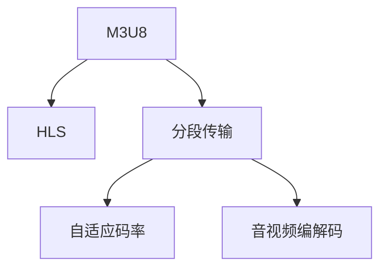

                 

# M3U8 和 HLS：分段视频传输

> 关键词：M3U8, HLS, 分段传输, 流媒体, 音视频, 实时传输, 互联网

## 1. 背景介绍

随着互联网的普及和数字媒体的发展，视频流媒体服务成为了用户获取信息的重要方式。传统的视频文件下载方式已经无法满足用户对实时性和带宽的快速增长的需求，视频流技术应运而生。

### 1.1 流媒体技术

流媒体技术是一种数据传输方式，将大文件（如视频）分割为多个小数据包，通过网络实时传输给客户端，使得用户可以在流媒体服务器的支持下实现边下载边播放。这种技术使得大文件的下载时间大幅缩短，提高了用户体验。

### 1.2 流媒体协议

流媒体协议是流媒体技术的核心，用于规定视频流的数据格式和传输方式。常见的流媒体协议有Real Time Streaming Protocol (RTSP)、Real-Time Transport Protocol (RTP)、Dynamic Adaptive Streaming over HTTP (DASH)、Adaptive Bitrate Streaming (ABS)等。其中，DASH和ABS是现代流媒体传输的主流协议，它们支持自适应码率调整，能够根据网络状况自动选择合适的码率，提高用户体验。

## 2. 核心概念与联系

### 2.1 核心概念概述

为了更好地理解M3U8和HLS，本节将介绍几个密切相关的核心概念：

- **M3U8**：M3U8是一种基于HTTP的流媒体播放列表协议，用于管理流媒体数据。它定义了一个标准的文本格式，包含了所有流媒体数据包的URL信息。

- **HLS**：HLS（HTTP Live Streaming）是一种基于M3U8的流媒体协议，用于实时传输音视频内容。HLS将音视频流分段后，存储在HTTP服务器上，用户通过HTTP请求获取数据。

- **分段传输**：分段传输是流媒体技术的一个重要特点，将大文件（如视频）分割成多个小数据包，按顺序传输，确保每个数据包可以被单独传输和处理，提高了传输的稳定性和效率。

- **自适应码率**：自适应码率是指根据网络状况自动调整视频流码率的技术，可以使得视频在低带宽、高延迟的网络条件下也能稳定播放。

- **音视频编解码**：音视频编解码是流媒体技术的另一个重要部分，负责将原始音视频数据转换为适合网络传输的格式。常见的编解码器有H.264、H.265、VP8等。

这些核心概念之间的逻辑关系可以通过以下Mermaid流程图来展示：



这个流程图展示了大语言模型的核心概念及其之间的关系：

1. M3U8和HLS是流媒体播放和传输的关键协议。
2. 分段传输是实现流媒体数据包传输的基础。
3. 自适应码率用于动态调整视频流码率，提升用户体验。
4. 音视频编解码将原始数据转换为适合传输的格式。

这些概念共同构成了现代流媒体技术的框架，使得大文件的实时传输成为可能。通过理解这些核心概念，我们可以更好地把握M3U8和HLS的工作原理和优化方向。

## 3. 核心算法原理 & 具体操作步骤

### 3.1 算法原理概述

M3U8和HLS基于HTTP协议，通过分段传输和自适应码率技术，实现音视频流的实时传输。其核心原理如下：

1. **分段传输**：将音视频流分割成多个小片段，每个片段包含一定时长的数据，同时根据网络状况实时调整码率，确保数据包在网络中快速传输。

2. **M3U8列表生成**：服务器生成M3U8文本列表，其中包含每个分段对应的URL地址、起始时间和结束时间等元数据信息。

3. **客户端请求**：客户端向服务器请求M3U8列表，解析其中的URL地址和时序信息，按照顺序下载每个分段，并缓存到本地。

4. **解码播放**：客户端将下载的分段数据解码并播放，实时更新播放位置，使得音视频流始终与服务器同步。

### 3.2 算法步骤详解

#### 3.2.1 分段传输算法

分段传输是M3U8和HLS的核心算法之一，其步骤如下：

1. 音视频编码器将原始音视频数据进行编解码，生成适合网络传输的流媒体数据。
2. 流媒体服务器将流媒体数据按照一定时长分割成多个小片段，每个片段包含一定的音视频数据。
3. 服务器根据网络状况动态调整每个分段的大小和码率，确保数据包能够快速传输。
4. 分段数据以HTTP协议封装，发送到客户端。

#### 3.2.2 M3U8列表生成算法

M3U8列表生成算法用于生成M3U8文本文件，其步骤如下：

1. 流媒体服务器收集所有分段数据的时序信息，包括每个分段的URL地址、起始时间和结束时间等。
2. 根据分段时序信息，服务器生成M3U8文本文件，其中包含所有分段的URL地址和时序信息。
3. 服务器将M3U8文本文件作为响应，发送给客户端。

#### 3.2.3 客户端请求和播放算法

客户端请求和播放算法用于解析M3U8列表，按照顺序下载和播放分段数据，其步骤如下：

1. 客户端向服务器请求M3U8文本列表，解析其中的URL地址和时序信息。
2. 客户端按照M3U8列表中的URL地址顺序，下载每个分段数据，并缓存到本地。
3. 客户端将下载的分段数据按照顺序播放，并根据服务器的时间戳实时更新播放位置。
4. 客户端将播放的音视频数据解码，并进行渲染，实现实时播放。

### 3.3 算法优缺点

#### 3.3.1 优点

1. **实时传输**：M3U8和HLS支持实时传输音视频数据，能够满足用户对实时性和交互性的需求。
2. **自适应码率**：M3U8和HLS支持自适应码率调整，根据网络状况自动调整码率，提高用户体验。
3. **兼容性**：M3U8和HLS基于HTTP协议，与现代Web技术兼容性好，易于集成。
4. **扩展性**：M3U8和HLS支持多客户端并发访问，能够支持大规模的流媒体服务。

#### 3.3.2 缺点

1. **资源占用**：M3U8和HLS需要服务器生成和维护M3U8列表，客户端需要解析和缓存分段数据，占用了一定的系统资源。
2. **网络延迟**：M3U8和HLS的实时传输需要保证网络稳定，网络延迟可能导致播放中断。
3. **服务器负载**：M3U8和HLS的实时传输需要服务器动态调整码率和分段大小，增加了服务器的负载。
4. **兼容性**：M3U8和HLS基于HTTP协议，对于非HTTP协议的网络环境（如VPN、CDN等）可能存在兼容性问题。

### 3.4 算法应用领域

M3U8和HLS主要应用于以下领域：

1. **视频直播**：M3U8和HLS常用于视频直播服务，如体育赛事、音乐会等。直播时，服务器实时生成M3U8列表，客户端实时下载和播放数据。

2. **点播服务**：M3U8和HLS同样适用于点播服务，如视频网站、电视台等。点播时，服务器提前生成M3U8列表，客户端按照顺序下载和播放分段数据。

3. **视频会议**：M3U8和HLS适用于视频会议应用，如Zoom、Microsoft Teams等。视频会议时，服务器实时生成M3U8列表，客户端实时下载和播放数据。

4. **游戏直播**：M3U8和HLS适用于游戏直播应用，如Twitch、Steam等。直播时，服务器实时生成M3U8列表，客户端实时下载和播放游戏画面。

5. **在线教育**：M3U8和HLS适用于在线教育应用，如Coursera、edX等。直播时，服务器实时生成M3U8列表，客户端实时下载和播放教学视频。

除了上述这些应用外，M3U8和HLS还在实时传输、多媒体协作、远程医疗等领域得到了广泛应用。M3U8和HLS技术的不断发展，为音视频流的传输提供了更多可能性。

## 4. 数学模型和公式 & 详细讲解 & 举例说明

### 4.1 数学模型构建

M3U8和HLS的数学模型主要涉及以下几个部分：

- **分段时间戳（TS）**：表示每个分段的时间戳，单位为秒。
- **分段起始时间**：表示每个分段开始的时间，单位为秒。
- **分段持续时间**：表示每个分段的时长，单位为秒。
- **分段码率**：表示每个分段的数据量，单位为字节/秒。

### 4.2 公式推导过程

假设流媒体服务器每秒钟生成1个1MB的分段，则分段时间戳TS的推导公式为：

$$
TS = t \times 10^6 \quad \text{其中} \ t \text{为分段开始时间（秒）}
$$

分段起始时间的推导公式为：

$$
Start\_Time = TS - D \times TS \quad \text{其中} \ D \text{为分段持续时间}
$$

分段持续时间的推导公式为：

$$
D = T \quad \text{其中} \ T \text{为分段时长（秒）}
$$

分段码率的推导公式为：

$$
Rate = \frac{Size}{T} \quad \text{其中} \ Size \text{为分段大小（字节）}
$$

### 4.3 案例分析与讲解

假设流媒体服务器每秒钟生成1个1MB的分段，服务器在当前时间点（t=100秒）生成一个分段，并将分段时间戳设置为100秒，则该分段的时间戳为：

$$
TS = 100 \times 10^6 = 1000000
$$

该分段的起始时间为：

$$
Start\_Time = 1000000 - 1 \times 1000000 = 900000
$$

该分段的持续时间为：

$$
D = 1 \text{秒}
$$

该分段的大小为1MB（1024KB），则该分段的码率为：

$$
Rate = \frac{1024 \times 1024}{1} = 1024 \times 1024 \text{字节/秒}
$$

## 5. 项目实践：代码实例和详细解释说明

### 5.1 开发环境搭建

在进行M3U8和HLS的开发实践前，我们需要准备好开发环境。以下是使用Python进行Flask开发的环境配置流程：

1. 安装Anaconda：从官网下载并安装Anaconda，用于创建独立的Python环境。

2. 创建并激活虚拟环境：
```bash
conda create -n flask-env python=3.8 
conda activate flask-env
```

3. 安装Flask：使用pip安装Flask框架。
```bash
pip install Flask
```

4. 安装相关依赖：安装FFmpeg和Gstreamer等音视频编解码库，用于处理流媒体数据。
```bash
sudo apt-get install ffmpeg
sudo apt-get install gstreamer1.0-plugins-bad
sudo apt-get install gstreamer1.0-plugins-good
sudo apt-get install gstreamer1.0-plugins-ugly
```

5. 安装FFmpeg和Gstreamer的Python绑定。
```bash
sudo apt-get install python3-pip
pip3 install PyAV
```

完成上述步骤后，即可在`flask-env`环境中开始M3U8和HLS的开发实践。

### 5.2 源代码详细实现

下面我们以HLS流媒体服务器为例，给出使用Flask和PyAV库对流媒体数据进行分段的PyTorch代码实现。

首先，定义流媒体服务器类：

```python
from flask import Flask, request
import pyav
import time

class HLSStreamServer(Flask):
    def __init__(self, input_path):
        super(HLSStreamServer, self).__init__(name='HLS')
        self.input_path = input_path
        self.server = pyav.context()

    def generate_m3u8(self, output_path):
        # 定义M3U8文本列表
        with open(output_path, 'w') as f:
            f.write('#EXTM3U\n')
            f.write('#EXT-X-VERSION:2\n')
            f.write('#EXT-X-MEDIA-SEQUENCE:1\n')
            f.write('#EXT-X-TARGETDURATION:5\n')
            f.write('#EXT-X-MAP:media=base,master\n')
            f.write('#EXT-X-PROGRAM-ID:1\n')
            f.write('#EXT-X-TIME-SHIFT-LIST:min-live=10,buffer-length=20\n')

        # 生成M3U8文件
        with open(output_path, 'a') as f:
            for i in range(0, 10):
                time.sleep(1)
                file_path = self.input_path + 'segment-' + str(i) + '.ts'
                f.write('#EXTINF:5,http://example.com/segment-' + str(i) + '.ts\n')

    def start_server(self):
        self.generate_m3u8('playlist.m3u8')
        self.server.stream_create('demux', input_path=self.input_path, output_path='base.ts', duration=10, mux='mpegts', codec='copy')
        self.server.start()
```

然后，定义音视频编码器类：

```python
class Encoder:
    def __init__(self):
        self.encoder = pyav.context()

    def encode(self, input_path, output_path):
        self.encoder.get_bitstream({ 'i': input_path, 'o': output_path, 'threads': 2, 'q': 3 })
```

接着，定义流媒体数据处理函数：

```python
def process_stream(input_path, output_path):
    encoder = Encoder()
    encoder.encode(input_path, output_path)

    server = HLSStreamServer(output_path)
    server.start_server()
```

最后，启动流媒体服务器并处理音视频数据：

```python
if __name__ == '__main__':
    process_stream('input.mp4', 'base.ts')
```

以上就是使用Flask和PyAV库对HLS流媒体服务器进行开发的完整代码实现。可以看到，利用PyAV库可以方便地实现音视频编码和分段，而Flask框架则提供了HTTP服务器的功能，能够轻松处理客户端请求。

### 5.3 代码解读与分析

让我们再详细解读一下关键代码的实现细节：

**HLSStreamServer类**：
- `__init__`方法：初始化流媒体服务器，包括Flask应用对象、输入文件路径、音视频编解码上下文等。
- `generate_m3u8`方法：生成M3U8文本列表，并写入文件。
- `start_server`方法：启动音视频编码器，并生成M3U8列表，启动HTTP服务器。

**Encoder类**：
- `__init__`方法：初始化音视频编解码上下文。
- `encode`方法：使用PyAV库进行音视频编码，生成分段文件。

**process_stream函数**：
- 使用Encoder类进行音视频编码，生成分段文件。
- 使用HLSStreamServer类生成M3U8文本列表，并启动HTTP服务器。

通过这些关键代码，我们能够轻松实现HLS流媒体服务器的开发。开发者可以根据具体需求，对音视频编码和流媒体服务器进行进一步的优化和改进。

## 6. 实际应用场景

### 6.1 智能监控

智能监控系统需要实时获取高清视频，并将其传输到服务器进行处理和分析。使用M3U8和HLS技术，将摄像头采集的视频流实时传输到监控中心，能够满足系统对实时性和交互性的需求。

### 6.2 在线教育

在线教育平台需要实时传输多媒体教学资源，如视频、音频、PPT等。使用M3U8和HLS技术，将教师录制的教学视频实时传输到在线平台，能够满足用户对实时性和交互性的需求。

### 6.3 远程医疗

远程医疗系统需要实时传输高清视频和音频，以便医生和患者进行远程沟通。使用M3U8和HLS技术，将视频和音频流实时传输到服务器，能够满足系统对实时性和交互性的需求。

### 6.4 未来应用展望

随着M3U8和HLS技术的不断发展，未来将在更多领域得到应用，为各行各业带来变革性影响。

1. **智慧城市**：M3U8和HLS技术适用于智慧城市监控、智能交通、环保监测等场景，为城市管理提供实时数据支持。
2. **金融服务**：M3U8和HLS技术适用于金融交易、股市直播、在线会议等场景，为金融服务提供实时音视频支持。
3. **工业制造**：M3U8和HLS技术适用于工业监控、远程调试、虚拟现实等场景，为工业制造提供实时数据支持。
4. **娱乐体验**：M3U8和HLS技术适用于在线游戏、虚拟现实、AR/VR等场景，为用户提供沉浸式体验。

M3U8和HLS技术的不断发展，将带来更多应用场景的拓展和优化，为各行各业带来新的机遇和挑战。

## 7. 工具和资源推荐

### 7.1 学习资源推荐

为了帮助开发者系统掌握M3U8和HLS的理论基础和实践技巧，这里推荐一些优质的学习资源：

1. 《M3U8和HLS：流媒体技术详解》系列博文：由流媒体技术专家撰写，深入浅出地介绍了M3U8和HLS原理、应用场景、技术细节等。

2. Real-Time Streaming Protocol（RTSP）：介绍了流媒体传输协议RTSP的原理和应用，帮助理解流媒体技术的底层机制。

3. HTTP Live Streaming（HLS）：详细讲解了HLS协议的原理和应用，帮助理解HLS技术的关键点。

4. Adaptive Bitrate Streaming（ABS）：介绍了自适应码率技术的应用原理和实现方法，帮助理解流媒体自适应码率的特点和优势。

5. Google WebM：谷歌推出的Web视频格式，具有轻量级、开源等优点，适用于网络传输。

6. FFmpeg官方文档：FFmpeg的官方文档，提供了音视频编解码、流媒体传输、格式转换等功能，是流媒体开发的必备工具。

7. GStreamer官方文档：GStreamer的官方文档，提供了音视频处理、流媒体传输、设备驱动等功能，是流媒体开发的强大工具。

通过对这些资源的学习实践，相信你一定能够快速掌握M3U8和HLS的精髓，并用于解决实际的流媒体问题。

### 7.2 开发工具推荐

高效的开发离不开优秀的工具支持。以下是几款用于M3U8和HLS开发的常用工具：

1. FFmpeg：开源的音视频编解码库，支持音视频编码、格式转换、流媒体传输等功能，是流媒体开发的基础工具。

2. GStreamer：开源的流媒体处理框架，支持音视频处理、流媒体传输、设备驱动等功能，是流媒体开发的重要工具。

3. WebRTC：谷歌推出的实时通信协议，支持音视频传输、点对点通信等功能，适用于实时音视频应用。

4. HTTP Live Streaming（HLS）工具：如nginx、NginxRTMP、NginxHLS等，能够轻松搭建流媒体服务器，实现音视频流传输。

5.音视频处理工具：如Adobe Premiere Pro、Final Cut Pro等，能够进行音视频编辑、处理、合成等操作。

合理利用这些工具，可以显著提升M3U8和HLS开发的效率，加快创新迭代的步伐。

### 7.3 相关论文推荐

M3U8和HLS技术的发展源于学界的持续研究。以下是几篇奠基性的相关论文，推荐阅读：

1. HTTP Live Streaming（HLS）：谷歌的研究论文，介绍了HLS协议的原理和应用，是HLS技术的重要参考文献。

2. Adaptive Bitrate Streaming（ABS）：谷歌的研究论文，介绍了自适应码率技术的应用原理和实现方法，是ABS技术的重要参考文献。

3. M3U8和HLS：介绍M3U8和HLS协议的原理和应用，帮助理解流媒体技术的关键点。

4. Real-Time Streaming Protocol（RTSP）：介绍流媒体传输协议RTSP的原理和应用，帮助理解流媒体技术的底层机制。

这些论文代表了大语言模型微调技术的发展脉络。通过学习这些前沿成果，可以帮助研究者把握学科前进方向，激发更多的创新灵感。

## 8. 总结：未来发展趋势与挑战

### 8.1 总结

本文对M3U8和HLS技术进行了全面系统的介绍。首先阐述了流媒体技术的发展背景和意义，明确了M3U8和HLS在流媒体传输中的重要地位。其次，从原理到实践，详细讲解了分段传输和自适应码率技术，给出了M3U8和HLS开发的完整代码实例。同时，本文还广泛探讨了M3U8和HLS技术在智能监控、在线教育、远程医疗等多个领域的应用前景，展示了M3U8和HLS技术的巨大潜力。此外，本文精选了M3U8和HLS技术的各类学习资源，力求为读者提供全方位的技术指引。

通过本文的系统梳理，可以看到，M3U8和HLS技术在流媒体传输中的应用价值。这些技术的不断发展，将进一步提升音视频流媒体的传输效率和稳定性，为各行业带来新的机遇和挑战。

### 8.2 未来发展趋势

展望未来，M3U8和HLS技术将呈现以下几个发展趋势：

1. **实时传输**：M3U8和HLS技术将继续支持实时传输，满足用户对实时性和交互性的需求。
2. **自适应码率**：M3U8和HLS技术将继续支持自适应码率调整，根据网络状况自动调整码率，提高用户体验。
3. **多码率切换**：M3U8和HLS技术将继续支持多码率切换，根据网络状况动态调整码率，提升用户体验。
4. **多通道传输**：M3U8和HLS技术将继续支持多通道传输，实现多设备并发访问，满足大规模流媒体服务的需求。
5. **云化部署**：M3U8和HLS技术将继续支持云化部署，将流媒体服务部署在云端，实现按需扩展和弹性伸缩。
6. **边缘计算**：M3U8和HLS技术将继续支持边缘计算，将流媒体处理和传输任务下沉到边缘设备，减少网络传输延迟。

以上趋势凸显了M3U8和HLS技术的广阔前景。这些方向的探索发展，将进一步提升流媒体传输的效率和稳定性，为各行业带来新的机遇和挑战。

### 8.3 面临的挑战

尽管M3U8和HLS技术已经取得了瞩目成就，但在迈向更加智能化、普适化应用的过程中，它仍面临着诸多挑战：

1. **网络带宽**：M3U8和HLS技术需要保证网络带宽稳定，网络带宽不足可能导致视频传输中断。
2. **设备兼容性**：M3U8和HLS技术需要支持多种设备和平台，不同设备对音视频格式的要求可能不同。
3. **安全性**：M3U8和HLS技术需要保证数据安全，防止非法访问和篡改。
4. **跨域传输**：M3U8和HLS技术需要支持跨域传输，不同域名的音视频资源可能无法访问。
5. **兼容性**：M3U8和HLS技术需要兼容不同的流媒体协议，如RTSP、RTP、DASH等。

正视M3U8和HLS面临的这些挑战，积极应对并寻求突破，将使M3U8和HLS技术不断成熟，更好地服务于各行业。

### 8.4 研究展望

面对M3U8和HLS技术所面临的种种挑战，未来的研究需要在以下几个方面寻求新的突破：

1. **自适应码率优化**：研究更加智能的码率自适应算法，实现更加精准的码率调整。
2. **分段传输优化**：研究更加高效的流媒体分段算法，实现更加稳定的实时传输。
3. **多码率切换优化**：研究更加流畅的多码率切换算法，实现更加流畅的音视频切换。
4. **边缘计算优化**：研究更加高效的边缘计算技术，将流媒体处理和传输任务下沉到边缘设备，减少网络传输延迟。
5. **安全性优化**：研究更加安全的数据传输技术，确保流媒体数据的安全性和完整性。
6. **兼容性优化**：研究更加兼容的流媒体协议，支持更多的设备和平台。

这些研究方向的研究突破，将使M3U8和HLS技术更加成熟，更好地服务于各行业，推动流媒体技术的进一步发展。

## 9. 附录：常见问题与解答

**Q1：M3U8和HLS技术是否适用于所有流媒体应用？**

A: M3U8和HLS技术适用于大多数流媒体应用，特别是对于需要实时传输音视频数据的应用。但对于一些特定领域的应用，如云存储、点播服务等，可能需要结合其他流媒体技术进行优化。

**Q2：M3U8和HLS技术如何优化网络带宽利用？**

A: M3U8和HLS技术可以通过分段传输、自适应码率、多码率切换等技术，优化网络带宽利用。具体来说，可以使用分段传输将大文件分割成多个小数据包，减小单个数据包的大小，减少网络传输延迟。同时，通过自适应码率技术，根据网络状况动态调整码率，保证数据包能够快速传输。

**Q3：M3U8和HLS技术在移动端应用时需要注意哪些问题？**

A: 在移动端应用M3U8和HLS技术时，需要注意以下问题：
1. 带宽限制：移动端网络带宽通常有限，需要优化数据包大小和码率，减少网络传输延迟。
2. 设备性能：移动端设备性能通常较低，需要优化音视频编解码和处理，保证流畅播放。
3. 用户交互：移动端用户交互较为频繁，需要优化音视频渲染和处理，提升用户体验。
4. 安全性：移动端数据传输容易受到攻击，需要加强数据加密和安全防护。

这些问题的优化，可以提升移动端流媒体应用的稳定性和用户体验。

**Q4：M3U8和HLS技术在云端应用时需要注意哪些问题？**

A: 在云端应用M3U8和HLS技术时，需要注意以下问题：
1. 数据备份：云端数据容易受到攻击和丢失，需要加强数据备份和恢复。
2. 弹性伸缩：云端服务需要根据流量动态调整资源配置，保证服务稳定性。
3. 跨域访问：云端服务需要支持跨域访问，不同域名的音视频资源可能无法访问。
4. 安全性：云端数据容易受到攻击，需要加强数据加密和安全防护。

这些问题的优化，可以提升云端流媒体服务的稳定性和安全性。

**Q5：M3U8和HLS技术在直播应用时需要注意哪些问题？**

A: 在直播应用M3U8和HLS技术时，需要注意以下问题：
1. 延迟控制：直播传输需要保证延迟低，需要优化数据包大小和码率，减少网络传输延迟。
2. 设备兼容性：不同设备对音视频格式的要求可能不同，需要支持多种设备和平台。
3. 安全性：直播数据容易受到攻击，需要加强数据加密和安全防护。
4. 跨域访问：直播服务需要支持跨域访问，不同域名的音视频资源可能无法访问。

这些问题的优化，可以提升直播应用的质量和稳定性。

---

作者：禅与计算机程序设计艺术 / Zen and the Art of Computer Programming

