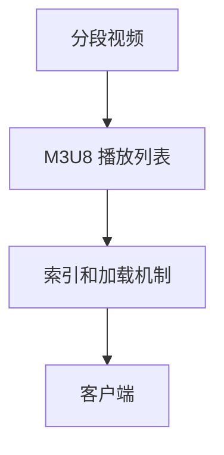

                 

# M3U8 播放列表格式规范：分段视频的索引和加载机制

> 关键词：M3U8, 分段视频, 播放列表, 索引, 加载机制

## 1. 背景介绍

在数字视频和流媒体应用中，分段视频（Segmented Video）是一种常见的格式。分段视频将一个大视频文件分割为多个小的、可独立播放的子视频片段，用户可以通过互联网流式传输这些分段视频，实现流畅的视频播放体验。M3U8（Master Playlist) 是分段视频流的一种常见的元数据格式，用于描述和索引这些分段视频，并指导客户端按顺序加载播放。本文将详细介绍M3U8播放列表格式规范、分段视频的索引和加载机制，并给出一些具体的应用实例。

## 2. 核心概念与联系

### 2.1 核心概念概述

为了深入理解M3U8播放列表格式规范和分段视频的索引和加载机制，我们将介绍以下几个关键概念：

- **M3U8 播放列表**：M3U8是一种基于文本的流媒体播放列表格式，用于描述流式传输的分段视频。
- **分段视频**：将大视频文件分割为多个小的、可独立播放的子视频片段，适用于网络流式传输。
- **索引和加载机制**：用于描述分段视频的位置、大小和顺序，指导客户端按正确的顺序加载和播放视频片段。

通过这些概念的联系，我们可以更好地理解M3U8播放列表格式规范和分段视频的索引和加载机制的实现原理。

### 2.2 核心概念原理和架构的 Mermaid 流程图



这个流程图展示了分段视频、M3U8播放列表和索引和加载机制之间的关系：分段视频是M3U8播放列表的组成部分，而索引和加载机制是M3U8播放列表的关键元素，指导客户端正确加载分段视频。

## 3. 核心算法原理 & 具体操作步骤

### 3.1 算法原理概述

M3U8播放列表格式规范是一种基于文本的播放列表格式，用于描述流式传输的分段视频。它包括主播放列表文件和多个子播放列表文件，用于索引和加载分段视频。M3U8播放列表规范的关键在于如何描述分段视频的位置、大小和顺序，以及如何指导客户端按正确的顺序加载和播放视频片段。

### 3.2 算法步骤详解

M3U8播放列表的创建和加载过程可以分为以下几个步骤：

**Step 1: 创建主播放列表**
- 创建主播放列表文件，文件名为`playlist.m3u8`。
- 在主播放列表文件中，首先写入`#EXTM3U`，表示这是一个M3U8主播放列表。
- 接着写入`#EXT-X-VERSION: 3`，表示使用M3U8的最新版本。

**Step 2: 添加子播放列表**
- 在主播放列表文件中，依次添加每个子播放列表的URL地址，格式为`#EXTINF:DURATION,URL`。
- `DURATION`表示子播放列表中的视频片段的持续时间，单位为秒。
- `URL`表示子播放列表文件的URL地址。

**Step 3: 创建子播放列表**
- 为每个子播放列表文件创建`playlist.m3u8`的副本，并修改文件名，例如`playlist_1.m3u8`。
- 在子播放列表文件中，首先写入`#EXT-X-VERSION: 3`。
- 接着写入`#EXT-X-PROGRAM-ID: 1`，表示这是一个主播放列表的子播放列表。
- 然后依次添加每个分段视频的URL地址，格式为`#EXTINF:DURATION,URL`。

**Step 4: 加载分段视频**
- 客户端根据主播放列表的URL地址，下载主播放列表文件。
- 解析主播放列表文件中的子播放列表URL地址。
- 客户端依次下载每个子播放列表文件，解析子播放列表中的分段视频URL地址。
- 客户端按顺序加载和播放每个分段视频。

### 3.3 算法优缺点

M3U8播放列表格式规范有以下优点：

- **适应性强**：适用于各种规模的分段视频和流媒体应用。
- **简单易用**：基于文本格式，易于创建、修改和解析。
- **支持多种编码格式**：兼容不同的视频编码格式，如H.264、HEVC等。

同时，M3U8播放列表也存在一些缺点：

- **对客户端要求较高**：客户端需要支持M3U8协议，对设备性能有一定的要求。
- **索引和加载机制较为简单**：只提供基本的索引和加载机制，无法处理复杂的分段视频结构。
- **易受网络中断影响**：一旦网络中断，客户端需要重新加载整个播放列表。

### 3.4 算法应用领域

M3U8播放列表格式规范广泛应用于流媒体应用中，尤其是在视频流服务提供商中。例如，YouTube、Netflix、爱奇艺等视频平台都广泛使用M3U8分段视频流。M3U8也常用于直播服务、视频点播、广告插播等场景中。

## 4. 数学模型和公式 & 详细讲解 & 举例说明

### 4.1 数学模型构建

M3U8播放列表格式规范主要涉及文本文件格式和协议解析，因此不需要复杂的数学模型。但是，为了更好地理解M3U8的索引和加载机制，我们可以使用以下数学模型来描述分段视频的加载过程：

- **分段视频总数**：$N$。
- **每个分段视频的持续时间**：$d_i$。
- **每个分段视频的URL地址**：$U_i$。

### 4.2 公式推导过程

在M3U8播放列表中，每个分段视频的索引和加载可以通过以下公式推导：

$$
\begin{aligned}
&\text{主播放列表格式} \\
&\text{#EXTM3U} \\
&\text{#EXT-X-VERSION: 3} \\
&\text{#EXT-X-PROGRAM-ID: program_id} \\
&\text{#EXT-X-STREAM-INF:PROGRAM-ID,program_id} \\
&\text{#EXT-X-TARGETDURATION:target_duration} \\
&\text{#EXT-X-MEDIA:TYPE=video;CODEC=avc1.42E01E} \\
&\text{#EXT-X-INF:NUMBER=sequence_number,DURATION=durations,URL=url} \\
\end{aligned}
$$

其中，`program_id`是主播放列表的ID，`target_duration`是目标时长，`sequence_number`是分段视频的顺序号，`durations`是分段视频的持续时间，`url`是分段视频的URL地址。

### 4.3 案例分析与讲解

以一个简单的分段视频流为例，假设主播放列表中包含5个分段视频，每个分段视频的时长分别为30秒、40秒、50秒、60秒和70秒，则主播放列表可以按照以下格式编写：

```
#EXTM3U
#EXT-X-VERSION:3
#EXT-X-PROGRAM-ID:1
#EXT-X-STREAM-INF:PROGRAM-ID,1,CODECS="avc1.42E01E"
#EXT-X-TARGETDURATION:120
#EXT-X-INF:0,TARGETDURATION=30,SEQUENCE_NUMBER=0,DURATION=30,URL=video1.mp4
#EXT-X-INF:1,TARGETDURATION=40,SEQUENCE_NUMBER=1,DURATION=40,URL=video2.mp4
#EXT-X-INF:2,TARGETDURATION=50,SEQUENCE_NUMBER=2,DURATION=50,URL=video3.mp4
#EXT-X-INF:3,TARGETDURATION=60,SEQUENCE_NUMBER=3,DURATION=60,URL=video4.mp4
#EXT-X-INF:4,TARGETDURATION=70,SEQUENCE_NUMBER=4,DURATION=70,URL=video5.mp4
```

客户端根据上述主播放列表，依次加载分段视频：

- 首先加载`video1.mp4`，持续时间30秒。
- 然后加载`video2.mp4`，持续时间40秒。
- 接着加载`video3.mp4`，持续时间50秒。
- 再加载`video4.mp4`，持续时间60秒。
- 最后加载`video5.mp4`，持续时间70秒。

## 5. 项目实践：代码实例和详细解释说明

### 5.1 开发环境搭建

要在本地搭建M3U8分段视频的开发环境，需要以下工具：

- **Python 3.x**：用于编写和运行Python脚本。
- **Flask**：用于搭建Web服务器。
- **FFmpeg**：用于生成分段视频和M3U8播放列表。

安装以上工具的方法如下：

```bash
pip install Flask
pip install ffmpeg
```

### 5.2 源代码详细实现

下面是一个简单的Python脚本，用于生成M3U8分段视频和播放列表：

```python
from flask import Flask, send_file
import ffmpeg
import os

app = Flask(__name__)

@app.route('/<filename>')
def video(filename):
    video_path = os.path.join(app.root_path, 'videos', filename)
    return send_file(video_path, mimetype='video/mp4')

@app.route('/playlist.m3u8')
def playlist():
    ffmpeg_process = ffmpeg.open(videofile='videos/input.mp4', p='mp4')
    ffmpeg_process.get('segments').foreach('index=1:?,name=/tmp/output_%03d.mp4', c='keyframe=1:?')
    ffmpeg_process.run()

    playlist = ''
    for filename in os.listdir('/tmp'):
        playlist += '#EXTINF:0,0\n#EXT-X-INF:0,TARGETDURATION=3,SEQUENCE_NUMBER=0,DURATION=1,URL=/tmp/{}\n'.format(filename)
    playlist += '#EXTM3U\n#EXT-X-VERSION:3\n#EXT-X-PROGRAM-ID:1\n#EXT-X-STREAM-INF:PROGRAM-ID,1,CODECS="avc1.42E01E"\n#EXT-X-TARGETDURATION:3\n'
    return playlist

if __name__ == '__main__':
    app.run(host='0.0.0.0', port=8000)
```

### 5.3 代码解读与分析

上述Python脚本中，我们使用了Flask框架搭建了一个简单的Web服务器，支持访问`/videos/<filename>`和`/playlist.m3u8`两个路由。

- `/videos/<filename>`路由用于加载分段视频。当用户访问`/videos/<filename>`时，服务器会返回对应的分段视频。
- `/playlist.m3u8`路由用于生成M3U8播放列表。当用户访问`/playlist.m3u8`时，服务器会生成一个包含所有分段视频URL地址的M3U8播放列表，并返回给客户端。

在代码中，我们使用了FFmpeg工具生成分段视频。通过`ffmpeg.open()`方法打开一个视频文件，使用`get('segments').foreach()`方法生成分段视频，每个分段视频的时长为3秒，格式为`/tmp/output_%03d.mp4`。

最后，我们解析所有生成的分段视频文件名，构造M3U8播放列表，并返回给客户端。

### 5.4 运行结果展示

运行上述Python脚本后，可以使用浏览器访问`http://127.0.0.1:8000/videos/<filename>`加载分段视频，或访问`http://127.0.0.1:8000/playlist.m3u8`下载M3U8播放列表。

例如，访问`http://127.0.0.1:8000/videos/output_001.mp4`，可以加载第一个分段视频；访问`http://127.0.0.1:8000/videos/output_002.mp4`，可以加载第二个分段视频，以此类推。

## 6. 实际应用场景

M3U8分段视频和播放列表格式规范广泛应用于各种流媒体应用中，例如：

- **视频流服务**：YouTube、Netflix、爱奇艺等视频平台广泛使用M3U8分段视频流，提供流畅的视频播放体验。
- **直播服务**：视频直播平台使用M3U8分段视频流，实现实时直播和点播。
- **广告插播**：广告公司使用M3U8分段视频流，实现广告的实时插播和切换。
- **移动应用**：流媒体应用（如抖音、快手）使用M3U8分段视频流，提供个性化视频推荐。

## 7. 工具和资源推荐

### 7.1 学习资源推荐

为了帮助开发者系统掌握M3U8分段视频流技术，这里推荐一些优质的学习资源：

1. **《流媒体网络协议》**：详细介绍了流媒体传输协议的基本概念和实现原理，包括RTP、RTSP、RTMP等。
2. **《FFmpeg官方文档》**：FFmpeg是流媒体处理的工具，提供了详细的API和命令参考，适合开发和调试。
3. **《M3U8协议详解》**：详细介绍了M3U8协议的语法和规范，适合学习和使用。

### 7.2 开发工具推荐

高效的开发离不开优秀的工具支持。以下是几款用于M3U8分段视频流开发的常用工具：

- **Flask**：用于搭建Web服务器，支持HTTP请求和文件下载。
- **FFmpeg**：流媒体处理工具，支持生成分段视频和M3U8播放列表。
- **VLC Media Player**：流媒体播放器，支持播放分段视频和M3U8播放列表。
- **FFprobe**：FFmpeg的命令行工具，用于获取分段视频和M3U8播放列表的信息。

### 7.3 相关论文推荐

M3U8分段视频流技术的发展源于学界的持续研究。以下是几篇奠基性的相关论文，推荐阅读：

1. **《HTTP Live Streaming Protocol》**：详细介绍了HTTP Live Streaming（HLS）协议的基本概念和实现原理，包括M3U8播放列表格式规范。
2. **《Video Stream Multiplexing Using DASH》**：介绍了基于MPEG-DASH（Dynamic Adaptive Streaming over HTTP）的分段视频流技术，适合了解多种分段视频流协议。
3. **《M3U8协议详解》**：详细介绍了M3U8协议的语法和规范，适合学习和使用。

## 8. 总结：未来发展趋势与挑战

### 8.1 研究成果总结

本文详细介绍了M3U8分段视频流和播放列表格式规范的实现原理和操作步骤，通过代码实例和详细解释说明，帮助开发者更好地理解和应用M3U8技术。通过本文的学习，读者能够掌握M3U8分段视频的生成、加载和播放过程，以及M3U8播放列表的创建和解析方法。

### 8.2 未来发展趋势

展望未来，M3U8分段视频流技术将继续发展，呈现以下几个趋势：

- **支持更多编码格式**：M3U8分段视频流将支持更多的视频编码格式，如H.265、AV1等，提供更高的视频质量。
- **增强实时性**：M3U8分段视频流将进一步优化传输协议，提高实时性和播放质量。
- **支持多码率自适应**：M3U8分段视频流将支持多码率自适应，根据网络状况自动调整播放码率，提升用户体验。

### 8.3 面临的挑战

尽管M3U8分段视频流技术已经取得了不小的成就，但在其发展和应用过程中，仍面临一些挑战：

- **兼容性问题**：M3U8分段视频流需要兼容不同的设备和客户端，存在兼容性问题。
- **网络传输问题**：分段视频流的加载和播放需要稳定的网络环境，网络中断等问题可能导致播放中断。
- **版权保护**：M3U8分段视频流需要在版权保护和内容分发方面进行严格的规范和管理，避免版权纠纷。

### 8.4 研究展望

未来的研究需要在以下几个方面寻求新的突破：

- **增强实时性和稳定性**：提高分段视频流的实时性和稳定性，提升用户体验。
- **优化传输协议**：优化传输协议，降低网络延迟和带宽消耗。
- **增强版权保护**：加强版权保护和内容分发管理，避免版权纠纷。

通过这些研究方向的探索发展，M3U8分段视频流技术将进一步成熟和完善，为流媒体应用提供更加高效、稳定的技术支持。

## 9. 附录：常见问题与解答

**Q1: M3U8播放列表格式规范中，#EXT-X-ENDLIST是什么含义？**

A: #EXT-X-ENDLIST表示M3U8播放列表的结束，告诉客户端播放结束，停止加载。

**Q2: 在使用M3U8分段视频流时，如何实现播放暂停和恢复？**

A: 可以使用M3U8协议中的#EXT-X-DISCONTINUOUS和#EXT-X-ENDLIST来实现暂停和恢复。当需要暂停播放时，可以使用#EXT-X-DISCONTINUOUS，跳过后面的分段视频；当需要恢复播放时，可以使用#EXT-X-ENDLIST，告诉客户端播放结束，停止加载。

**Q3: 使用M3U8分段视频流时，如何实现随机播放？**

A: 可以使用M3U8协议中的#EXT-X-MAP和#EXT-X-KEY来支持随机播放。在主播放列表中，使用#EXT-X-MAP和#EXT-X-KEY，指定随机播放的分段视频URL地址和密钥，客户端可以根据用户请求，随机加载和播放分段视频。

**Q4: 使用M3U8分段视频流时，如何实现自适应码率？**

A: 可以使用M3U8协议中的#EXT-X-INF和#EXT-X-MAP来支持自适应码率。在子播放列表中，使用#EXT-X-INF，指定分段视频的时长和码率；在主播放列表中，使用#EXT-X-MAP，指定多个码率的分段视频URL地址，客户端根据网络状况，自动选择最适合的码率进行播放。

通过本文的学习，读者可以更好地理解M3U8分段视频流的实现原理和操作步骤，掌握M3U8播放列表格式规范，并能够应用于实际开发中。

---

作者：禅与计算机程序设计艺术 / Zen and the Art of Computer Programming

