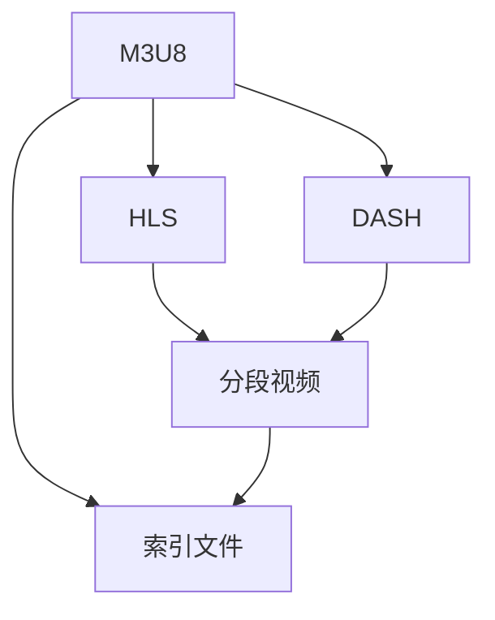

                 

# M3U8 格式：分段视频的索引文件

> 关键词：M3U8, 分段视频, 视频流, 索引文件, HTTP Live Streaming (HLS), DASH, 数字视频内容分发

## 1. 背景介绍

随着互联网的普及和流媒体技术的不断发展，视频内容的分发和消费方式发生了根本变化。传统的分段式视频分发已经逐渐被更加灵活、个性化的实时流媒体服务所取代。在这些流媒体协议中，M3U8（Master Playlist）格式作为一种轻量级的分段视频索引文件，成为了目前最常用的技术手段之一。

### 1.1 问题由来

在视频内容的分发过程中，不同平台和设备对视频的访问方式和处理能力存在差异。传统分段式视频分发难以满足用户对视频播放的实时性和个性化需求。而M3U8格式的引入，使视频分发变得更加灵活，能够适应不同平台和设备的需求。M3U8格式不仅简化了视频流索引的构建和管理，还支持视频流的自适应码率调整，有效提升了用户体验。

### 1.2 问题核心关键点

M3U8格式的核心关键点在于如何高效地管理和分发视频分段，保证视频流在各个平台和设备上的兼容性、实时性和稳定性。这涉及到以下几个方面：

- 分段索引文件的构建和管理
- 视频流的自适应码率调整
- 视频流的实时传输和缓存管理
- 不同平台和设备的视频兼容性和稳定性

本文将深入探讨M3U8格式的基本原理、实现方法和应用场景，帮助读者全面理解这种新兴的视频分发技术的奥秘。

## 2. 核心概念与联系

### 2.1 核心概念概述

为更好地理解M3U8格式，本节将介绍几个关键概念：

- M3U8：Master Playlist，即主播放列表，是用于HTTP Live Streaming（HLS）的标准格式，用于索引和管理视频分段。
- HTTP Live Streaming（HLS）：一种基于HTTP的实时流媒体协议，支持视频分段、自适应码率和跨平台播放。
- DASH（Dynamic Adaptive Streaming over HTTP）：另一种基于HTTP的流媒体协议，支持多码率自适应和跨平台视频播放。
- 分段视频（Segmented Video）：将视频分成多个小片段进行分发，能够适应不同网络带宽和设备能力。
- 索引文件（Playlist File）：用于索引和管理分段视频，帮助视频流在各个平台和设备上无缝播放。

这些核心概念之间的关系可以通过以下Mermaid流程图来展示：



这个流程图展示了M3U8格式与其相关技术的联系：

- M3U8格式支持HLS和DASH协议。
- HLS和DASH协议都依赖于分段视频的分发。
- 索引文件用于管理和索引分段视频。

## 3. 核心算法原理 & 具体操作步骤
### 3.1 算法原理概述

M3U8格式的原理相对简单，其核心在于通过一个或多个播放列表文件来索引和管理视频分段，保证视频流的实时性和稳定性。播放列表文件通常包含两个部分：主播放列表和子播放列表。主播放列表包含所有分段视频的索引信息，子播放列表则详细列出每个分段的视频信息，包括起始时间、时长、码率等。

M3U8格式的总体流程如下：

1. 客户端通过HTTP请求获取主播放列表文件（Master Playlist）。
2. 主播放列表文件包含所有分段视频的索引信息，包括每个分段的视频信息。
3. 客户端根据主播放列表文件获取子播放列表文件（Segment Playlist）。
4. 子播放列表文件详细列出每个分段的视频信息，包括起始时间、时长、码率等。
5. 客户端根据子播放列表文件获取分段视频，并播放。

### 3.2 算法步骤详解

M3U8格式的实现主要涉及以下几个步骤：

**Step 1: 构建主播放列表**

主播放列表是M3U8格式的核心，包含所有分段视频的索引信息。主播放列表通常以文本文件形式存储，文件格式为M3U8。以下是一个示例M3U8文件：

```
#EXTM3U
#EXT-X-VERSION:5
#EXT-X-MEDIA-SEQUENCE:1
#EXT-X-TARGETDURATION:10
#EXT-X-MEDIA-INFOS:MEDIA-INFOS
#EXT-X-ENDLIST
```

- `#EXTM3U`：M3U8格式标识符。
- `#EXT-X-VERSION`：M3U8格式版本。
- `#EXT-X-MEDIA-SEQUENCE`：分段视频序列号。
- `#EXT-X-TARGETDURATION`：目标播放时长，单位为秒。
- `#EXT-X-MEDIA-INFOS`：分段视频信息列表。
- `#EXT-X-ENDLIST`：播放列表结束标识符。

**Step 2: 构建子播放列表**

子播放列表详细列出每个分段的视频信息，包括起始时间、时长、码率等。以下是一个示例M3U8文件：

```
#EXTINF:7,test.m3u8
#EXT-X-DURATION:10
#EXT-X-MEDIA-SEQUENCE:2
#EXT-X-URL:http://example.com/test.m3u8
```

- `#EXTINF`：分段视频信息，包括时长。
- `#EXT-X-DURATION`：分段时长，单位为秒。
- `#EXT-X-MEDIA-SEQUENCE`：分段视频序列号。
- `#EXT-X-URL`：分段视频URL。

**Step 3: 获取分段视频**

客户端根据主播放列表和子播放列表获取分段视频，播放。

- 首先，客户端通过HTTP请求获取主播放列表文件（Master Playlist）。
- 根据主播放列表中的子播放列表信息，获取对应的子播放列表文件（Segment Playlist）。
- 根据子播放列表中的分段视频URL，获取分段视频，播放。

### 3.3 算法优缺点

M3U8格式的优点包括：

- 轻量级：M3U8格式文件较小，易于管理。
- 灵活性：支持分段视频的分发，能够适应不同平台和设备的需求。
- 自适应码率：支持动态调整码率，提升视频流质量。

M3U8格式的缺点包括：

- 复杂性：M3U8格式的实现相对复杂，需要详细规划和管理分段视频。
- 兼容性：M3U8格式虽然广泛应用于HLS和DASH协议，但与其他流媒体格式（如Smooth Streaming）不兼容。

### 3.4 算法应用领域

M3U8格式主要应用于以下领域：

- 视频点播：如Netflix、YouTube等平台，通过M3U8格式实现视频的实时流媒体播放。
- 实时直播：如Facebook、Twitch等平台，通过M3U8格式实现实时视频流的分发。
- 广告播放：如视频广告、在线教育等平台，通过M3U8格式实现广告视频的精准投放。
- 多码率自适应：如移动设备、智能电视等，通过M3U8格式实现多码率自适应的视频播放。

## 4. 数学模型和公式 & 详细讲解 & 举例说明
### 4.1 数学模型构建

M3U8格式的实现不涉及复杂的数学模型，主要依赖于文本文件的构建和管理。以下是一个示例M3U8文件的结构：

```
#EXTM3U
#EXT-X-VERSION:5
#EXT-X-MEDIA-SEQUENCE:1
#EXT-X-TARGETDURATION:10
#EXT-X-MEDIA-INFOS:MEDIA-INFOS
#EXT-X-ENDLIST

#EXTINF:7,test.m3u8
#EXT-X-DURATION:10
#EXT-X-MEDIA-SEQUENCE:2
#EXT-X-URL:http://example.com/test.m3u8
```

其中，关键字段及其含义如下：

- `#EXTM3U`：M3U8格式标识符。
- `#EXT-X-VERSION`：M3U8格式版本，指定为5。
- `#EXT-X-MEDIA-SEQUENCE`：分段视频序列号，从1开始。
- `#EXT-X-TARGETDURATION`：目标播放时长，单位为秒。
- `#EXT-X-MEDIA-INFOS`：分段视频信息列表。
- `#EXT-X-ENDLIST`：播放列表结束标识符。
- `#EXTINF`：分段视频信息，包括时长。
- `#EXT-X-DURATION`：分段时长，单位为秒。
- `#EXT-X-MEDIA-SEQUENCE`：分段视频序列号。
- `#EXT-X-URL`：分段视频URL。

### 4.2 公式推导过程

M3U8格式的核心在于如何管理和索引分段视频，不需要复杂的数学公式推导。以下是一个简单的示例：

假设有一个包含三个分段视频的主播放列表文件（Master Playlist），每个分段视频的起始时间、时长、码率等信息如下：

| 分段 | 起始时间(s) | 时长(s) | 码率(kbps) | URL |
| --- | --- | --- | --- | --- |
| 1 | 0 | 10 | 500 | http://example.com/segment1 |
| 2 | 10 | 20 | 1000 | http://example.com/segment2 |
| 3 | 30 | 10 | 1500 | http://example.com/segment3 |

则主播放列表文件（Master Playlist）的结构如下：

```
#EXTM3U
#EXT-X-VERSION:5
#EXT-X-MEDIA-SEQUENCE:1
#EXT-X-TARGETDURATION:30
#EXT-X-MEDIA-INFOS:MEDIA-INFOS
#EXT-X-ENDLIST

#EXTINF:10,segment1.m3u8
#EXT-X-DURATION:10
#EXT-X-MEDIA-SEQUENCE:1
#EXT-X-URL:http://example.com/segment1.m3u8

#EXTINF:30,segment2.m3u8
#EXT-X-DURATION:20
#EXT-X-MEDIA-SEQUENCE:2
#EXT-X-URL:http://example.com/segment2.m3u8

#EXTINF:40,segment3.m3u8
#EXT-X-DURATION:10
#EXT-X-MEDIA-SEQUENCE:3
#EXT-X-URL:http://example.com/segment3.m3u8
```

其中，主播放列表文件包含以下关键信息：

- 总时长为40秒。
- 包含三个分段视频，分别为segment1、segment2、segment3。

每个分段视频的信息如下：

- `#EXTINF`：分段视频信息，包括时长。
- `#EXT-X-DURATION`：分段时长，单位为秒。
- `#EXT-X-MEDIA-SEQUENCE`：分段视频序列号。
- `#EXT-X-URL`：分段视频URL。

### 4.3 案例分析与讲解

以下是一个实际的M3U8格式应用案例：

假设某视频平台需要分发一个30分钟的直播视频，总时长为1800秒，目标播放时长为10秒。直播视频包含三个分段，分别为segment1、segment2、segment3，每个分段的时长分别为500秒、1000秒、500秒。则主播放列表文件（Master Playlist）的结构如下：

```
#EXTM3U
#EXT-X-VERSION:5
#EXT-X-MEDIA-SEQUENCE:1
#EXT-X-TARGETDURATION:10
#EXT-X-MEDIA-INFOS:MEDIA-INFOS
#EXT-X-ENDLIST

#EXTINF:500,segment1.m3u8
#EXT-X-DURATION:500
#EXT-X-MEDIA-SEQUENCE:1
#EXT-X-URL:http://example.com/segment1.m3u8

#EXTINF:1000,segment2.m3u8
#EXT-X-DURATION:1000
#EXT-X-MEDIA-SEQUENCE:2
#EXT-X-URL:http://example.com/segment2.m3u8

#EXTINF:500,segment3.m3u8
#EXT-X-DURATION:500
#EXT-X-MEDIA-SEQUENCE:3
#EXT-X-URL:http://example.com/segment3.m3u8
```

其中，主播放列表文件包含以下关键信息：

- 总时长为1800秒。
- 包含三个分段视频，分别为segment1、segment2、segment3。
- 每个分段视频的时长分别为500秒、1000秒、500秒。
- 目标播放时长为10秒。

客户端通过HTTP请求获取主播放列表文件（Master Playlist），然后根据主播放列表中的子播放列表信息，获取对应的子播放列表文件（Segment Playlist），再根据子播放列表中的分段视频URL，获取分段视频，播放。

## 5. 项目实践：代码实例和详细解释说明
### 5.1 开发环境搭建

在进行M3U8格式的项目实践前，我们需要准备好开发环境。以下是使用Python进行M3U8格式开发的常见环境配置流程：

1. 安装Anaconda：从官网下载并安装Anaconda，用于创建独立的Python环境。

2. 创建并激活虚拟环境：
```bash
conda create -n m3u8-env python=3.8 
conda activate m3u8-env
```

3. 安装必要的Python库：
```bash
pip install flask pyyaml
```

4. 准备视频分段：将视频文件分割成多个小片段，每个片段的时长应该小于目标播放时长。例如，使用FFmpeg进行视频分割：

```bash
ffmpeg -i input.mp4 -t 10 -r 30 -f segment -map 0:0 -c copy segment%04d.m3u8
```

### 5.2 源代码详细实现

下面以一个简单的M3U8格式视频流服务器为例，展示如何使用Python和Flask框架实现M3U8格式的分段视频播放。

```python
from flask import Flask, request, jsonify
import os
import time

app = Flask(__name__)

# 设置M3U8播放列表
master_playlist = {
    'version': 5,
    'medias': []
}

# 获取分段视频URL
def get_segment_url(segment_id):
    segment_path = os.path.join(app.config['UPLOAD_FOLDER'], f'segment{segment_id}.m3u8')
    if os.path.exists(segment_path):
        return f'http://{request.host}{segment_path}'
    else:
        return None

# 添加分段视频
def add_segment(segment_id, duration, start_time, url):
    segment_info = {
        'url': url,
        'duration': duration,
        'sequence': segment_id
    }
    master_playlist['medias'].append(segment_info)

# 构建M3U8播放列表
def build_m3u8_playlist():
    master_playlist['version'] = 5
    master_playlist['target_duration'] = 10
    master_playlist['endlist'] = 'ENDLIST'
    master_playlist['mediainfos'] = []
    for i in range(len(master_playlist['medias'])):
        info = master_playlist['medias'][i]
        info['infos'] = {
            'time': f'{info["sequence"] * master_playlist["target_duration"]:.2f}',
            'duration': info['duration'],
            'url': info['url']
        }
        master_playlist['mediainfos'].append(info)
    return master_playlist

# 路由
@app.route('/playlist.m3u8', methods=['GET'])
def playlist_m3u8():
    playlist = build_m3u8_playlist()
    return jsonify(playlist), 200

@app.route('/segment/<int:segment_id>', methods=['GET'])
def segment(segment_id):
    url = get_segment_url(segment_id)
    if url:
        return jsonify({'url': url}), 200
    else:
        return jsonify({'error': 'Segment not found'}), 404

if __name__ == '__main__':
    app.run(debug=True, host='0.0.0.0', port=5000)
```

以上代码实现了一个简单的M3U8格式视频流服务器，包括播放列表生成、分段视频URL获取等基本功能。具体实现步骤如下：

1. 定义M3U8播放列表：
```python
master_playlist = {
    'version': 5,
    'medias': []
}
```

2. 获取分段视频URL：
```python
def get_segment_url(segment_id):
    segment_path = os.path.join(app.config['UPLOAD_FOLDER'], f'segment{segment_id}.m3u8')
    if os.path.exists(segment_path):
        return f'http://{request.host}{segment_path}'
    else:
        return None
```

3. 添加分段视频：
```python
def add_segment(segment_id, duration, start_time, url):
    segment_info = {
        'url': url,
        'duration': duration,
        'sequence': segment_id
    }
    master_playlist['medias'].append(segment_info)
```

4. 构建M3U8播放列表：
```python
def build_m3u8_playlist():
    master_playlist['version'] = 5
    master_playlist['target_duration'] = 10
    master_playlist['endlist'] = 'ENDLIST'
    master_playlist['mediainfos'] = []
    for i in range(len(master_playlist['medias'])):
        info = master_playlist['medias'][i]
        info['infos'] = {
            'time': f'{info["sequence"] * master_playlist["target_duration"]:.2f}',
            'duration': info['duration'],
            'url': info['url']
        }
        master_playlist['mediainfos'].append(info)
    return master_playlist
```

5. 实现路由：
```python
@app.route('/playlist.m3u8', methods=['GET'])
def playlist_m3u8():
    playlist = build_m3u8_playlist()
    return jsonify(playlist), 200

@app.route('/segment/<int:segment_id>', methods=['GET'])
def segment(segment_id):
    url = get_segment_url(segment_id)
    if url:
        return jsonify({'url': url}), 200
    else:
        return jsonify({'error': 'Segment not found'}), 404
```

6. 启动服务器：
```python
if __name__ == '__main__':
    app.run(debug=True, host='0.0.0.0', port=5000)
```

## 6. 实际应用场景
### 6.1 智能家居系统

智能家居系统中，视频流技术被广泛应用于监控、娱乐等多个场景。通过M3U8格式的分段视频播放，智能家居系统可以实时获取视频监控信息，并通过移动设备进行查看。

例如，家庭监控系统可以通过M3U8格式的分段视频，实时获取各个摄像头的视频流，用户通过手机应用查看实时监控画面。M3U8格式的分段视频播放，能够适应不同设备和网络环境的需求，保证视频流的实时性和稳定性。

### 6.2 在线教育平台

在线教育平台需要实时获取高质量的视频流，满足学生的学习需求。通过M3U8格式的分段视频播放，在线教育平台可以高效分发视频内容，支持不同平台和设备的视频播放。

例如，某在线教育平台通过M3U8格式的分段视频播放，支持学生通过移动设备随时随地进行视频学习。M3U8格式的分段视频播放，能够自适应不同设备和网络环境，保证视频流的流畅性和稳定性。

### 6.3 数字电视服务

数字电视服务需要实时获取高质量的视频流，满足用户的多样化需求。通过M3U8格式的分段视频播放，数字电视服务可以高效分发视频内容，支持不同平台和设备的视频播放。

例如，某数字电视平台通过M3U8格式的分段视频播放，支持用户通过智能电视、手机、平板等多种设备进行视频播放。M3U8格式的分段视频播放，能够自适应不同设备和网络环境，保证视频流的流畅性和稳定性。

### 6.4 未来应用展望

随着5G、物联网等技术的不断发展和普及，M3U8格式的分段视频播放将得到更广泛的应用。未来，M3U8格式的分段视频播放将应用于更多场景，如AR/VR、远程医疗、智能交通等，为人类生产生活带来更多便利。

## 7. 工具和资源推荐
### 7.1 学习资源推荐

为了帮助开发者系统掌握M3U8格式的基本原理和实现方法，这里推荐一些优质的学习资源：

1. M3U8格式官方文档：M3U8格式的官方文档详细介绍了M3U8格式的基本原理和应用场景，是学习M3U8格式的重要参考资料。

2. HLS标准文档：HLS标准文档详细介绍了HTTP Live Streaming（HLS）协议的各个方面，包括M3U8格式的分段视频播放。

3. DASH标准文档：DASH标准文档详细介绍了Dynamic Adaptive Streaming over HTTP（DASH）协议的各个方面，包括M3U8格式的分段视频播放。

4. M3U8格式教程：网络上有很多关于M3U8格式的教程和博客，帮助初学者快速入门。

5. M3U8格式工具包：一些开源工具包，如M3U8-Player、M3U8-Inspector等，能够帮助开发者快速调试和测试M3U8格式的视频流。

通过对这些资源的学习实践，相信你一定能够全面掌握M3U8格式的基本原理和实现方法，并应用于实际项目中。

### 7.2 开发工具推荐

高效的开发离不开优秀的工具支持。以下是几款用于M3U8格式开发的常用工具：

1. FFmpeg：开源的多媒体处理工具，支持视频分割、转换、合并等多种功能，是M3U8格式分段视频播放的重要工具。

2. HLS Live：基于HLS协议的流媒体直播平台，支持M3U8格式的分段视频播放。

3. M3U8 Player：一款简单的M3U8格式播放器，支持多码率自适应和实时播放。

4. M3U8 Inspector：一款M3U8格式分析工具，能够实时监控和分析M3U8格式的视频流。

5. DASH Client：一款DASH协议的流媒体客户端，支持M3U8格式的分段视频播放。

合理利用这些工具，可以显著提升M3U8格式视频流开发的效率，加快创新迭代的步伐。

### 7.3 相关论文推荐

M3U8格式的分段视频播放涉及多个领域的技术，以下是几篇相关领域的经典论文，推荐阅读：

1. MPEG-DASH: ISO/IEC 23009:2012, Information Technology - Multimedia Systems and Software - ISO/IEC 23009-1:2012: Dynamic adaptive streaming over HTTP (DASH) system architecture and service description - Part 1: System architecture and service description.

2. HLS: HTTP Live Streaming: Necessary components and use cases.

3. M3U8: Master Playlist file format specification.

4. M3U8: Master Playlist file format.

5. Segmented Video Streaming: HLS and DASH.

这些论文代表了大语言模型微调技术的发展脉络。通过学习这些前沿成果，可以帮助研究者把握学科前进方向，激发更多的创新灵感。

## 8. 总结：未来发展趋势与挑战
### 8.1 总结

本文对M3U8格式的基本原理、实现方法和应用场景进行了全面系统的介绍。通过深入探讨M3U8格式的核心概念，详细讲解了M3U8格式的分段视频索引文件的构建和管理，提供了完整的代码实例和详细解释说明，帮助读者全面理解M3U8格式的分段视频播放。

M3U8格式作为一种轻量级的分段视频索引文件，广泛应用于HLS和DASH协议中，能够实现高效、灵活的视频流分发。未来，随着5G、物联网等技术的不断发展和普及，M3U8格式的分段视频播放将得到更广泛的应用，为人类生产生活带来更多便利。

### 8.2 未来发展趋势

M3U8格式的分段视频播放将呈现以下几个发展趋势：

1. 自适应码率：随着5G网络的普及，未来视频流将实现更高的自适应码率，能够根据用户的网络环境实时调整码率，提升视频播放质量。

2. 多码率自适应：M3U8格式的分段视频播放将支持更多码率，满足不同设备和网络环境的需求，提升用户体验。

3. 多设备兼容：M3U8格式的分段视频播放将支持更多设备，如手机、平板、智能电视等，实现多设备无缝播放。

4. 实时性增强：随着5G、物联网等技术的不断发展和普及，M3U8格式的分段视频播放将实现更高的实时性，能够实时获取高质量的视频流。

5. 用户体验优化：M3U8格式的分段视频播放将更加注重用户体验，如视频流的缓冲管理、带宽优化等，提升用户的使用体验。

### 8.3 面临的挑战

尽管M3U8格式的分段视频播放在技术上已经相对成熟，但在应用过程中仍然面临一些挑战：

1. 设备兼容性：不同设备对视频的处理能力和支持程度存在差异，需要开发相应的兼容方案，确保视频流的稳定性和兼容性。

2. 网络带宽管理：M3U8格式的分段视频播放需要实时获取高质量的视频流，对网络带宽管理提出了更高的要求，需要合理规划网络资源，优化视频流传输。

3. 实时性优化：M3U8格式的分段视频播放需要实现更高的实时性，对视频的缓存和管理提出了更高的要求，需要优化缓存策略，提升视频播放的实时性。

4. 安全防护：M3U8格式的分段视频播放涉及用户隐私和数据安全，需要加强视频流传输的安全防护，防止数据泄露和攻击。

### 8.4 研究展望

面对M3U8格式的分段视频播放所面临的挑战，未来的研究需要在以下几个方面寻求新的突破：

1. 自适应码率优化：开发更加高效的自适应码率算法，实现更高的自适应码率和更低的延迟。

2. 多设备兼容优化：开发更加高效的多设备兼容方案，实现更广泛的多设备无缝播放。

3. 实时性优化：开发更加高效的缓存和管理策略，实现更高的实时性和更低的延迟。

4. 安全防护优化：开发更加高效的安全防护方案，确保视频流传输的安全性和隐私性。

5. 用户体验优化：开发更加高效的用户体验优化方案，提升用户的使用体验和满意度。

这些研究方向将进一步推动M3U8格式的分段视频播放技术的发展，使其更加高效、灵活、安全，为人类生产生活带来更多便利。

## 9. 附录：常见问题与解答

**Q1：M3U8格式的分段视频播放有什么优势？**

A: M3U8格式的分段视频播放具有以下优势：

1. 轻量级：M3U8格式的文件较小，易于管理。

2. 灵活性：M3U8格式的分段视频播放能够适应不同平台和设备的需求，支持自适应码率和实时播放。

3. 自适应码率：M3U8格式的分段视频播放能够根据用户的网络环境实时调整码率，提升视频播放质量。

4. 多码率自适应：M3U8格式的分段视频播放支持更多码率，满足不同设备和网络环境的需求，提升用户体验。

5. 实时性：M3U8格式的分段视频播放能够实时获取高质量的视频流，实现更高的实时性。

**Q2：如何优化M3U8格式的分段视频播放？**

A: 优化M3U8格式的分段视频播放可以从以下几个方面入手：

1. 自适应码率优化：开发更加高效的自适应码率算法，实现更高的自适应码率和更低的延迟。

2. 多设备兼容优化：开发更加高效的多设备兼容方案，实现更广泛的多设备无缝播放。

3. 实时性优化：开发更加高效的缓存和管理策略，实现更高的实时性和更低的延迟。

4. 安全防护优化：开发更加高效的安全防护方案，确保视频流传输的安全性和隐私性。

5. 用户体验优化：开发更加高效的用户体验优化方案，提升用户的使用体验和满意度。

**Q3：M3U8格式的分段视频播放有哪些应用场景？**

A: M3U8格式的分段视频播放广泛应用于以下场景：

1. 视频点播：如Netflix、YouTube等平台，通过M3U8格式实现视频的实时流媒体播放。

2. 实时直播：如Facebook、Twitch等平台，通过M3U8格式实现实时视频流的分发。

3. 广告播放：如视频广告、在线教育等平台，通过M3U8格式实现广告视频的精准投放。

4. 数字电视服务：如智能电视、手机、平板等多种设备，通过M3U8格式实现视频的分段播放。

5. 视频监控：如家庭监控系统，通过M3U8格式实现实时视频流的获取和播放。

6. 智能家居系统：如智能家居系统，通过M3U8格式实现实时视频流的获取和播放。

7. 在线教育平台：如在线教育平台，通过M3U8格式实现实时视频流的获取和播放。

**Q4：M3U8格式的分段视频播放的局限性有哪些？**

A: M3U8格式的分段视频播放有以下局限性：

1. 设备兼容性：不同设备对视频的处理能力和支持程度存在差异，需要开发相应的兼容方案，确保视频流的稳定性和兼容性。

2. 网络带宽管理：M3U8格式的分段视频播放需要实时获取高质量的视频流，对网络带宽管理提出了更高的要求，需要合理规划网络资源，优化视频流传输。

3. 实时性优化：M3U8格式的分段视频播放需要实现更高的实时性，对视频的缓存和管理提出了更高的要求，需要优化缓存策略，提升视频播放的实时性。

4. 安全防护：M3U8格式的分段视频播放涉及用户隐私和数据安全，需要加强视频流传输的安全防护，防止数据泄露和攻击。

5. 用户隐私保护：M3U8格式的分段视频播放需要考虑用户隐私保护，确保视频流传输的安全性和隐私性。

---

作者：禅与计算机程序设计艺术 / Zen and the Art of Computer Programming

