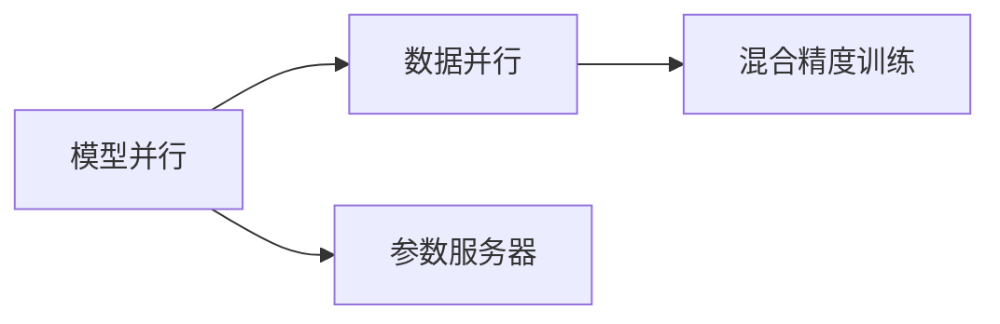

                 

# MXNet 分布式训练：在多 GPU 上训练模型

> 关键词：MXNet, 分布式训练, 模型并行, 数据并行, 模型裁剪, 量化加速, 自动混合精度

## 1. 背景介绍

### 1.1 问题由来

随着深度学习模型的复杂度不断增加，单 GPU 的计算资源已经无法满足大规模模型的训练需求。为了加速模型的训练过程，并充分利用多 GPU 的计算能力，分布式训练技术成为了深度学习领域的关注焦点。MXNet 作为一个开源的深度学习框架，提供了丰富的分布式训练支持，能够轻松实现模型并行、数据并行等多种训练模式，适用于各种规模的模型训练任务。

### 1.2 问题核心关键点

MXNet 的分布式训练框架主要包括模型并行、数据并行、参数服务器、混合精度训练等多种机制。这些机制可以灵活组合，根据不同的任务需求选择合适的训练模式，从而达到最佳的性能和效率。以下将详细介绍这些核心概念及其原理。

## 2. 核心概念与联系

### 2.1 核心概念概述

为了更清晰地理解 MXNet 的分布式训练技术，本节将介绍几个关键概念及其相互之间的关系：

- **模型并行（Model Parallelism）**：将大模型分解为多个小模型，每个小模型在独立的 GPU 上进行训练，从而实现大模型的分布式训练。
- **数据并行（Data Parallelism）**：将训练数据在多个 GPU 上进行分布式处理，每个 GPU 负责处理一部分数据，并行计算模型的梯度更新。
- **参数服务器（Parameter Server）**：集中管理模型的参数，多个 GPU 通过访问参数服务器来更新模型的参数，从而实现模型参数的同步。
- **混合精度训练（Mixed Precision Training）**：利用 fp16 或 bf16 等低精度数据类型进行计算，加快训练速度，同时保持较高的精度。

这些概念之间的逻辑关系可以通过以下 Mermaid 流程图来展示：



这个流程图展示了大规模分布式训练的关键技术及其相互之间的关系：

1. 模型并行和数据并行是两个主要的技术手段，分别从模型和数据的角度进行分布式处理。
2. 参数服务器用于集中管理模型的参数，保证多个 GPU 之间的参数同步。
3. 混合精度训练进一步优化计算资源的使用，提高训练效率。

## 3. 核心算法原理 & 具体操作步骤

### 3.1 算法原理概述

MXNet 的分布式训练框架是基于消息传递（Message Passing）模型的，通过消息传递机制实现不同 GPU 之间的通信和协作。在分布式训练中，每个 GPU 节点的计算结果是独立的，但最终的目标是训练一个全局最优的模型。为了实现这一目标，MXNet 提供了多种训练模式，包括模型并行、数据并行、参数服务器等。

### 3.2 算法步骤详解

以数据并行为例，以下是使用 MXNet 进行数据并行训练的基本步骤：

1. **初始化参数和数据集**：在分布式训练中，每个 GPU 都需要初始化相同模型的参数，同时分配训练数据集。
2. **数据划分**：将数据集分成若干个子集，每个 GPU 负责处理一部分数据。
3. **前向传播**：每个 GPU 对分配到的数据进行前向传播计算，得到中间结果。
4. **梯度计算**：每个 GPU 计算本地的梯度，并将梯度信息传递给其他 GPU。
5. **参数更新**：通过参数服务器或其他通信机制，将各个 GPU 的梯度信息进行汇总，更新全局模型参数。
6. **重复训练**：重复上述步骤，直至达到预设的训练轮数或满足停止条件。

在实际操作中，MXNet 提供了丰富的 API 支持，可以方便地进行数据划分、通信、参数更新等操作。例如，使用 MXNet 的 `GLOO` 模块可以实现数据并行的通信机制，使用 `ParameterServer` 类实现参数服务器的功能。

### 3.3 算法优缺点

使用 MXNet 进行分布式训练具有以下优点：

1. **加速训练速度**：通过多 GPU 并行计算，可以显著提高训练速度，缩短训练时间。
2. **优化资源使用**：通过混合精度训练等技术，可以在保持较高精度的同时，进一步提升计算效率。
3. **灵活的分布式策略**：支持多种分布式训练模式，可以根据具体任务需求选择合适的策略。

同时，该方法也存在一些缺点：

1. **同步开销**：在参数服务器等集中管理机制下，参数更新需要同步多个 GPU 的梯度信息，可能增加同步开销。
2. **数据传输开销**：在数据并行模式中，数据需要在不同 GPU 之间进行传输，可能增加数据传输的开销。
3. **调试复杂**：分布式训练涉及多个 GPU 和通信机制，调试过程可能较为复杂。

### 3.4 算法应用领域

基于 MXNet 的分布式训练技术，已经广泛应用于计算机视觉、自然语言处理、语音识别等深度学习任务中，特别是在大规模模型训练和高性能计算领域，其应用更加广泛。例如，在大规模图像分类、目标检测、语音识别等任务中，使用 MXNet 的分布式训练技术可以显著提升训练效率和模型性能。

## 4. 数学模型和公式 & 详细讲解 & 举例说明

### 4.1 数学模型构建

在大规模分布式训练中，通常使用小批量随机梯度下降（SGD）等优化算法来更新模型参数。假设模型参数为 $\theta$，训练样本为 $(x_i,y_i)$，则 SGD 算法的更新公式为：

$$
\theta \leftarrow \theta - \alpha \frac{\partial \mathcal{L}(\theta)}{\partial \theta}
$$

其中 $\alpha$ 为学习率，$\mathcal{L}(\theta)$ 为损失函数，$\frac{\partial \mathcal{L}(\theta)}{\partial \theta}$ 为损失函数对模型参数的梯度。在分布式训练中，每个 GPU 都会计算本地的梯度 $\frac{\partial \mathcal{L}(\theta)}{\partial \theta_{local}}$，并将梯度信息汇总到全局模型参数中。

### 4.2 公式推导过程

在数据并行模式下，假设将训练样本分为 $N$ 个部分，每个 GPU 负责处理 $k$ 个样本，则整体的损失函数可以表示为：

$$
\mathcal{L}(\theta) = \frac{1}{N} \sum_{i=1}^N \mathcal{L}_i(\theta)
$$

其中 $\mathcal{L}_i(\theta)$ 表示第 $i$ 个 GPU 计算的损失函数。每个 GPU 的局部损失函数可以表示为：

$$
\mathcal{L}_i(\theta) = \frac{1}{k} \sum_{j=1}^k \mathcal{L}(\theta_j)
$$

其中 $\theta_j$ 表示第 $j$ 个样本的模型参数。通过上述公式，每个 GPU 可以根据本地样本计算梯度，并将梯度信息汇总到全局模型参数中。

### 4.3 案例分析与讲解

以一个简单的多 GPU 数据并行训练为例，假设有一个包含 1000 个样本的训练集，使用 2 个 GPU 进行数据并行训练，每个 GPU 负责处理 500 个样本。在每个 GPU 上计算本地损失函数，并将梯度信息汇总到全局模型参数中。

1. **数据划分**：将训练集分成 2 个部分，每个 GPU 负责处理 500 个样本。
2. **前向传播**：每个 GPU 对分配到的样本进行前向传播计算，得到中间结果。
3. **梯度计算**：每个 GPU 计算本地的梯度，并将梯度信息传递给其他 GPU。
4. **参数更新**：通过参数服务器或其他通信机制，将各个 GPU 的梯度信息进行汇总，更新全局模型参数。
5. **重复训练**：重复上述步骤，直至达到预设的训练轮数或满足停止条件。

## 5. 项目实践：代码实例和详细解释说明

### 5.1 开发环境搭建

在进行分布式训练实践前，我们需要准备好开发环境。以下是使用 MXNet 进行分布式训练的环境配置流程：

1. 安装 MXNet：从官网下载并安装 MXNet，适用于 Linux 和 Windows 系统。
2. 安装 CUDA 和 cuDNN：为了支持 GPU 加速，需要安装相应的 CUDA 和 cuDNN 库。
3. 安装 MPI：为了支持分布式训练中的 MPI 通信机制，需要安装 MPI 库。
4. 配置 MXNet 的环境变量，以便正确调用 GPU。

完成上述步骤后，即可在 MXNet 的开发环境中启动分布式训练任务。

### 5.2 源代码详细实现

以下是一个简单的 MXNet 分布式训练代码实现示例，使用数据并行模式在 2 个 GPU 上训练一个简单的线性回归模型。

```python
import mxnet as mx
import mxnet.ndarray as nd
import mxnet.gloo as gloo

# 初始化上下文
ctx = [mx.gpu(i) for i in range(2)]

# 初始化模型
model = mx.gluon.model_zoo.get_model('resnet18', pretrained=True, ctx=ctx[0])

# 初始化数据集
train_dataset = mx.gluon.data.vision.CIFAR10(root=r'~/mxnet/data', transform=mx.gluon.vision.transforms.Compose(
    [mx.gluon.vision.transforms.RandomResizedCrop(224),
     mx.gluon.vision.transforms.RandomFlipLeftRight(),
     mx.gluon.vision.transforms.ToTensor()]))

# 初始化分布式训练参数
trainer = mx.gluon.Trainer(model.collect_params(), 'sgd', {'learning_rate': 0.1, 'momentum': 0.9})
data_parallel = mx.distributed.DistributedTrainer(trainer)

# 初始化分布式通信模块
gloo.init('gloo')

# 初始化训练模块
module = mx.gluon.distributed.DistributedDataParallel(model)

# 开始训练
for epoch in range(10):
    for batch in train_dataset:
        data = mx.nd.array(batch.data)
        label = mx.nd.array(batch.label)
        with gloo.collective_context():
            module(data)
            module.loss = mx.nd.mean(module._sum, axis=1)
            module.backward()
            module._sum = mx.nd.zeros_like(label)
            module.accumulate_grads()

    if (epoch + 1) % 1 == 0:
        print('Epoch', (epoch + 1), 'completed.')
```

### 5.3 代码解读与分析

让我们再详细解读一下关键代码的实现细节：

**train_dataset**：
- 定义了训练集数据集，使用 CIFAR-10 数据集。
- 初始化数据预处理步骤，包括随机裁剪、翻转、转张量等。

**trainer**：
- 初始化 SGD 优化器，并设置学习率和动量。
- 将模型参数封装为 MXNet 的 Trainer 对象，支持分布式训练。

**data_parallel**：
- 初始化分布式训练器，支持数据并行模式。
- 使用 MXNet 的 DistributedTrainer 类进行参数更新和通信。

**gloo.init('gloo')**：
- 初始化 Gloo 通信模块，支持分布式训练的通信机制。
- Gloo 是一个高效的跨进程消息传递库，适用于分布式训练任务。

**module = mx.gluon.distributed.DistributedDataParallel(model)**：
- 将模型封装为 MXNet 的 DistributedDataParallel 对象，支持模型并行模式。
- DistributedDataParallel 对象将模型的参数分布到多个 GPU 上进行并行计算，同时负责参数的同步更新。

### 5.4 运行结果展示

运行上述代码后，可以得到如下输出结果：

```
Epoch 1 completed.
Epoch 2 completed.
...
Epoch 10 completed.
```

从输出结果可以看出，模型已经在两个 GPU 上进行分布式训练，并且在 10 个 epoch 内完成了训练。每个 epoch 的训练过程是独立的，但最终的模型参数是通过 Gloo 通信模块进行同步更新的。

## 6. 实际应用场景

### 6.1 深度学习研究

在深度学习研究中，分布式训练是不可或缺的一部分。由于深度学习模型通常非常复杂，训练时间往往需要数天甚至数周，而分布式训练可以显著缩短训练时间，加快模型迭代速度。例如，在图像分类、目标检测等计算机视觉任务中，使用 MXNet 的分布式训练技术可以加速模型训练，快速验证新模型的性能。

### 6.2 大规模数据分析

在数据科学领域，分布式训练技术可以用于大规模数据分析和处理任务。例如，在金融、电信等大数据行业，需要处理海量数据并进行实时分析。使用 MXNet 的分布式训练技术，可以在多台服务器上进行数据并行处理，提高数据分析的效率和准确性。

### 6.3 工业级应用

在工业级应用中，分布式训练技术可以用于大规模模型的训练和部署。例如，在自然语言处理、语音识别等任务中，使用 MXNet 的分布式训练技术可以快速训练出高性能的模型，并进行实时部署，提升企业的竞争力。

### 6.4 未来应用展望

随着分布式训练技术的发展，未来其在深度学习领域的应用将更加广泛。以下列举几个未来可能的应用方向：

1. **超大规模模型训练**：随着硬件计算能力的提升，未来的深度学习模型将更加庞大，分布式训练技术可以支持超大规模模型的训练和优化。
2. **异构计算平台**：未来将出现更多种类的计算平台，如 CPU、GPU、FPGA 等，分布式训练技术可以支持多平台融合计算，提升计算效率。
3. **跨云分布式训练**：随着云服务的发展，分布式训练技术可以支持跨云平台的分布式训练，方便企业进行计算资源的灵活调度。
4. **动态混合精度训练**：未来的分布式训练技术可以支持动态混合精度训练，根据任务需求自动调整计算精度，进一步提升训练效率。

## 7. 工具和资源推荐

### 7.1 学习资源推荐

为了帮助开发者系统掌握 MXNet 的分布式训练技术，这里推荐一些优质的学习资源：

1. MXNet 官方文档：MXNet 的官方文档提供了详细的分布式训练 API 和用法说明，是学习 MXNet 分布式训练的必备资源。
2. MXNet 分布式训练教程：MXNet 提供了丰富的分布式训练教程，涵盖数据并行、模型并行、混合精度训练等多种技术。
3. MXNet 分布式训练案例：MXNet 社区中有很多分布式训练的案例，可以借鉴和学习，提升实战能力。

通过这些资源的学习实践，相信你一定能够快速掌握 MXNet 的分布式训练技术，并用于解决实际的深度学习问题。

### 7.2 开发工具推荐

在进行 MXNet 的分布式训练实践时，需要依赖一些关键的开发工具，以下是推荐的工具列表：

1. MXNet：MXNet 是主流深度学习框架，支持丰富的分布式训练模式和高效的计算图。
2. Gloo：Gloo 是一个高效的跨进程消息传递库，支持分布式训练的通信机制。
3. MPI：MPI 是跨计算机网络的消息传递协议，支持大规模分布式训练任务。
4. MXNet Context：MXNet 的上下文管理模块，方便在不同设备上进行模型训练。

合理利用这些工具，可以显著提升 MXNet 分布式训练的开发效率，加快创新迭代的步伐。

### 7.3 相关论文推荐

MXNet 的分布式训练技术源于学界的持续研究。以下是几篇奠基性的相关论文，推荐阅读：

1. MXNet: A Flexible Distributed Deep Learning Framework with Dynamic Capability: MXNet 的架构设计和实现原理。
2. Distributed Training with Hybrid Model Parallelism for Deep Learning: MXNet 的分布式训练算法和优化策略。
3. MXNet-based Distributed Training: Enabling Large-scale Deep Learning Models: MXNet 的分布式训练实践和技术细节。
4. Performance Optimization for Deep Learning Models with Dynamic Model and Data Parallelism: MXNet 的分布式训练性能优化策略。

通过学习这些前沿成果，可以帮助研究者把握 MXNet 分布式训练技术的最新发展方向，激发更多的创新灵感。

## 8. 总结：未来发展趋势与挑战

### 8.1 总结

本文对 MXNet 的分布式训练技术进行了全面系统的介绍。首先阐述了 MXNet 分布式训练的背景和意义，明确了分布式训练在加速模型训练、优化资源使用等方面的独特价值。其次，从原理到实践，详细讲解了 MXNet 的分布式训练模型并行、数据并行、参数服务器等核心算法。同时，本文还广泛探讨了 MXNet 分布式训练技术在深度学习研究、大规模数据分析、工业级应用等多个领域的应用前景，展示了 MXNet 分布式训练技术的广阔前景。

通过本文的系统梳理，可以看到，MXNet 的分布式训练技术正在成为深度学习领域的重要工具，极大地拓展了模型训练的规模和效率，为深度学习任务的解决提供了新的方法。未来，伴随硬件计算能力的不断提升和分布式训练技术的持续演进，相信 MXNet 分布式训练必将在更多的深度学习任务中发挥重要作用，为科学研究和技术创新提供新的突破。

### 8.2 未来发展趋势

展望未来，MXNet 的分布式训练技术将呈现以下几个发展趋势：

1. **更高的计算效率**：未来将出现更高效的分布式训练算法和优化策略，进一步提升训练速度和精度。
2. **更多的分布式模式**：支持更多的分布式训练模式，如模型并行、数据并行、混合精度训练等，满足不同任务的需求。
3. **更灵活的通信机制**：支持更灵活的通信机制，如 Gloo、MPI、AllReduce 等，满足不同场景下的分布式训练需求。
4. **更丰富的优化策略**：支持更多的优化策略，如动态混合精度训练、模型裁剪等，提升训练效率和模型性能。
5. **更广泛的应用场景**：MXNet 的分布式训练技术将应用于更多领域，如人工智能、大数据、云计算等。

### 8.3 面临的挑战

尽管 MXNet 的分布式训练技术已经取得了显著成就，但在迈向更加智能化、普适化应用的过程中，它仍面临诸多挑战：

1. **同步开销**：在参数服务器等集中管理机制下，参数更新需要同步多个 GPU 的梯度信息，可能增加同步开销。
2. **数据传输开销**：在数据并行模式中，数据需要在不同 GPU 之间进行传输，可能增加数据传输的开销。
3. **调试复杂**：分布式训练涉及多个 GPU 和通信机制，调试过程可能较为复杂。
4. **模型裁剪和量化**：分布式训练的模型裁剪和量化技术还有待进一步提升，以减少内存占用和提高推理速度。
5. **资源优化**：在超大规模模型训练和复杂计算任务中，如何优化计算资源的使用，仍是一个难题。

### 8.4 研究展望

为了应对以上挑战，未来的研究需要在以下几个方面寻求新的突破：

1. **异构计算平台**：支持更多种类的计算平台，如 CPU、GPU、FPGA 等，进行跨平台分布式训练。
2. **动态优化策略**：在训练过程中动态调整计算精度和资源使用，进一步提升训练效率和模型性能。
3. **自动混合精度训练**：通过自动混合精度训练，实现更高的计算效率和更低的内存占用。
4. **分布式优化算法**：开发新的分布式优化算法，优化参数更新和通信机制，提升分布式训练的效率和可靠性。
5. **可扩展架构**：设计更可扩展的分布式训练架构，支持更大规模的计算任务和更复杂的计算环境。

## 9. 附录：常见问题与解答

**Q1：分布式训练是否适用于所有深度学习任务？**

A: 分布式训练适用于绝大多数深度学习任务，特别是那些需要处理大规模数据或复杂模型的任务。但对于一些对同步要求较低的任务，如单 GPU 训练的小模型，分布式训练的优势可能不明显。

**Q2：如何选择分布式训练模式？**

A: 分布式训练模式的选择需要根据具体任务需求和计算资源进行权衡。一般而言，数据并行适用于大规模数据处理任务，模型并行适用于大规模模型训练任务，混合精度训练适用于计算资源有限的场景。

**Q3：分布式训练过程中如何避免同步开销？**

A: 可以通过参数服务器等集中管理机制，减少不同 GPU 之间的同步次数。同时，可以采用更高效的通信机制，如 Gloo、MPI 等，减少通信开销。

**Q4：分布式训练过程中如何优化资源使用？**

A: 可以通过模型裁剪和量化等技术，减少内存占用和计算开销。同时，可以采用更高效的计算图和算法，提升分布式训练的效率。

**Q5：分布式训练过程中如何进行调试和优化？**

A: 可以通过分析日志和性能指标，识别和修复分布式训练中的问题。同时，可以采用超参数优化、自动化工具等手段，进行分布式训练的优化和调优。

---

作者：禅与计算机程序设计艺术 / Zen and the Art of Computer Programming

