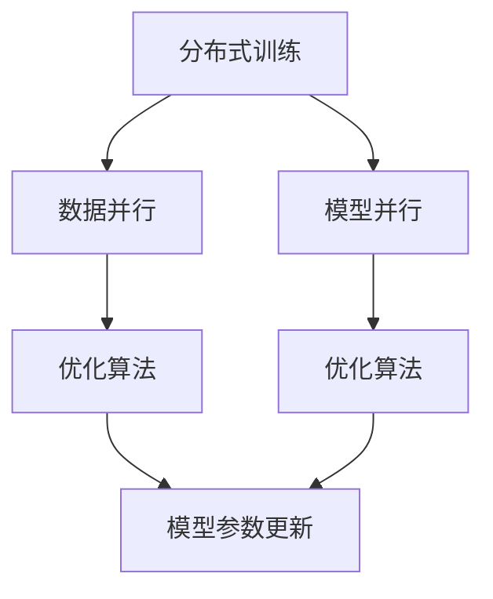

                 

# MXNet 深度学习框架特性：大规模分布式训练和优化

> 关键词：MXNet,深度学习框架,分布式训练,优化算法,深度神经网络,模型并行

## 1. 背景介绍

随着深度学习技术的迅猛发展，深度神经网络在计算机视觉、自然语言处理、语音识别等领域取得了显著成果。然而，大规模深度神经网络的训练和优化是一个极其耗时和资源密集的过程。传统单节点训练无法满足计算需求，分布式训练成为大势所趋。MXNet作为当前最流行的深度学习框架之一，提供了丰富的分布式训练和优化特性，支持大规模模型的高效训练。

本文将系统介绍MXNet框架在分布式训练和优化方面的特性和实践，从理论到代码层面详细剖析其核心算法和技术实现，并结合实际应用案例，展示MXNet在大规模深度学习训练中的卓越性能和灵活性。

## 2. 核心概念与联系

### 2.1 核心概念概述

在探讨MXNet的分布式训练和优化特性之前，首先明确几个核心概念：

- **分布式训练(Distributed Training)**：指通过多台计算机或多个处理器同时对深度学习模型进行训练，加速模型收敛速度，提高训练效率。
- **优化算法(Optimization Algorithms)**：用于更新模型参数，最小化损失函数，提升模型性能。常见的优化算法包括梯度下降法、Adam、Adagrad等。
- **模型并行(Model Parallelism)**：指将深度神经网络模型分为多个子模型，分别分布在不同的计算节点上进行并行训练，从而充分利用计算资源。
- **数据并行(Data Parallelism)**：指将训练数据分为多个子集，同时在多个计算节点上并行训练模型的多个副本，以加速训练过程。

### 2.2 核心概念联系

分布式训练、优化算法、模型并行和数据并行是深度学习框架中密不可分的重要概念，其内在联系可以通过以下Mermaid流程图进行展示：



此图表示：分布式训练通过数据并行和模型并行，将训练任务分发到不同的计算节点上进行并行化处理；而优化算法则用于更新模型参数，以最小化损失函数。在分布式训练中，数据并行和模型并行互为补充，共同提升训练效率和模型性能。

## 3. 核心算法原理 & 具体操作步骤

### 3.1 算法原理概述

MXNet框架通过以下几个核心算法实现其在大规模分布式训练和优化方面的特性：

- **数据并行**：将训练数据划分为多个子集，同时在多个计算节点上并行训练模型的多个副本，加速训练过程。
- **模型并行**：将深度神经网络模型分为多个子模型，分布在不同的计算节点上进行并行训练，充分利用计算资源。
- **混合并行(Mixed Precision)**：采用16位和32位浮点数混合精度训练，以降低计算资源消耗和提高训练速度。
- **分布式优化算法**：包括混合精度梯度下降、分布式Adam、弹性分布式优化(EDO)等，以优化模型参数更新，提升训练效率。
- **模型通信与同步**：通过异步全同步和异步分布式优化，减少模型通信和同步开销，提升训练速度。

### 3.2 算法步骤详解

以下详细介绍MXNet在分布式训练和优化方面的具体操作步骤：

1. **环境配置**：
   - 安装MXNet框架和相关依赖。
   - 设置计算节点和分布式训练环境，如设置节点间的通信协议和参数服务器。

2. **模型定义**：
   - 使用MXNet定义深度神经网络模型，如卷积神经网络(CNN)、循环神经网络(RNN)、变换器(Transformer)等。
   - 选择适合的并行策略，如数据并行、模型并行或混合并行。

3. **数据准备**：
   - 将训练数据划分为多个子集，分布到不同的计算节点上。
   - 对数据进行预处理和标准化，确保各节点数据格式一致。

4. **模型分割与部署**：
   - 将大模型分割为多个子模型，分布到不同的计算节点上。
   - 在每个节点上启动模型训练进程，使用分布式优化算法进行参数更新。

5. **参数同步与通信**：
   - 在每个训练周期结束时，进行模型参数的同步和通信。
   - 使用异步全同步或异步分布式优化算法，减少通信和同步开销。

6. **模型评估与调优**：
   - 在训练过程中，定期评估模型性能，调整优化算法和超参数。
   - 使用MXNet的分布式评估工具，对模型进行同步评估。

### 3.3 算法优缺点

MXNet在大规模分布式训练和优化方面具有以下优点：

- **高效的并行能力**：支持数据并行、模型并行和混合并行，能够充分利用计算资源，加速模型训练。
- **灵活的分布式算法**：提供多种优化算法和分布式优化策略，适应不同场景和需求。
- **低通信开销**：通过异步全同步和异步分布式优化算法，减少模型通信和同步开销，提高训练速度。
- **可扩展性强**：能够灵活扩展到任意数量的计算节点，适应大规模训练需求。

同时，MXNet也存在以下缺点：

- **复杂度高**：分布式训练和优化的实现较为复杂，需要仔细配置和调试。
- **资源消耗大**：多节点并行训练需要大量计算资源，对硬件设备要求较高。
- **调试困难**：分布式训练涉及多个节点，调试和优化难度较大。

### 3.4 算法应用领域

MXNet的分布式训练和优化特性广泛应用于以下几个领域：

- **计算机视觉**：在大规模图像分类、目标检测、图像分割等任务中使用，如ImageNet数据集上的训练。
- **自然语言处理**：在机器翻译、文本分类、情感分析等任务中使用，如BERT模型的分布式训练。
- **语音识别**：在语音信号处理、自动语音识别(ASR)、语音合成(TTS)等任务中使用。
- **推荐系统**：在用户行为数据挖掘、个性化推荐等任务中使用。
- **生物信息学**：在蛋白质结构预测、基因组分析等任务中使用。

## 4. 数学模型和公式 & 详细讲解 & 举例说明

### 4.1 数学模型构建

在MXNet中，分布式训练和优化通常采用以下数学模型进行描述：

- **损失函数**：定义模型的损失函数，如交叉熵损失、均方误差损失等。
- **优化目标**：定义模型的优化目标，即最小化损失函数。
- **参数更新**：定义模型的参数更新方式，如梯度下降、Adam等。

### 4.2 公式推导过程

以下以单节点梯度下降法为例，介绍MXNet中分布式训练和优化的公式推导过程。

设模型参数为 $\theta$，损失函数为 $L(\theta)$，当前参数值为 $\theta_t$，目标参数值为 $\theta_{t+1}$，则梯度下降法的更新公式为：

$$
\theta_{t+1} = \theta_t - \alpha \nabla L(\theta_t)
$$

其中 $\alpha$ 为学习率，$\nabla L(\theta_t)$ 为损失函数对模型参数的梯度。在分布式训练中，该公式在多个计算节点上并行执行，每个节点更新局部参数 $\theta_{t+1}^{(i)}$，全局参数 $\theta_{t+1}$ 通过同步或通信操作进行更新。

### 4.3 案例分析与讲解

以ImageNet数据集上的大规模深度学习模型训练为例，展示MXNet的分布式训练和优化特性。

- **数据并行**：将ImageNet数据集划分为多个子集，每个子集分布在不同的计算节点上，每个节点分别训练模型的多个副本，以加速训练。
- **模型并行**：将大型卷积神经网络模型分为多个子模型，分别分布在不同的计算节点上，同时在每个节点上训练模型的一个子集。
- **混合并行**：使用16位和32位混合精度训练，降低计算资源消耗，提高训练速度。
- **分布式优化**：采用分布式Adam算法，在每个节点上独立计算梯度，使用参数服务器同步全局参数，减少通信开销。

## 5. 项目实践：代码实例和详细解释说明

### 5.1 开发环境搭建

在开始项目实践之前，需要先搭建好MXNet的开发环境。以下是详细的搭建步骤：

1. **安装MXNet**：
   ```
   pip install mxnet
   ```

2. **配置分布式训练环境**：
   - 安装MPI或AllReduce库，如Horovod、Joblib等。
   - 配置计算节点和参数服务器，设置节点间的通信协议。

3. **编写代码**：
   - 使用MXNet定义深度神经网络模型。
   - 使用MXNet的分布式训练API，如MXNet.Gluon模块，进行模型训练和优化。

### 5.2 源代码详细实现

以下是使用MXNet进行图像分类任务的代码实现：

```python
import mxnet as mx
from mxnet import gluon
from mxnet import autograd
from mxnet import nd

# 定义模型
net = gluon.nn.Sequential()
net.add(gluon.nn.Conv2D(channels=64, kernel_size=3, activation='relu'))
net.add(gluon.nn.MaxPool2D(pool_size=2))
net.add(gluon.nn.Conv2D(channels=128, kernel_size=3, activation='relu'))
net.add(gluon.nn.MaxPool2D(pool_size=2))
net.add(gluon.nn.Flatten())
net.add(gluon.nn.Dense(10))

# 定义损失函数和优化器
loss = gluon.loss.SoftmaxCrossEntropyLoss()
trainer = gluon.Trainer(net.collect_params(), 'adam', {'learning_rate': 0.01})

# 加载数据集
train_dataset = mx.image.ImageFolderDataset(...)
test_dataset = mx.image.ImageFolderDataset(...)

# 定义数据加载器
train_loader = mx.io.DataLoader(train_dataset, batch_size=32, shuffle=True)
test_loader = mx.io.DataLoader(test_dataset, batch_size=32)

# 定义分布式训练器
ctx = mx.cpu(0)
num_gpus = mx.test_utils.list_gpus()[0]  # 获取可用GPU数量
distributed_ctx = [mx.gpu(i) for i in range(num_gpus)]  # 创建分布式上下文
net = net.bind(for_training=True, ctx=distributed_ctx)
trainer.set_params(train_params=net.collect_params())

# 训练模型
for epoch in range(10):
    train_loss = 0
    train_acc = 0
    for batch in train_loader:
        inputs = batch.data[0].as_in_context(ctx)
        labels = batch.label[0].as_in_context(ctx)
        with autograd.record():
            outputs = net(inputs)
            loss = loss(outputs, labels)
        loss.backward()
        trainer.step(batch_size)
        train_loss += loss.mean().asscalar()
        train_acc += (nd.argmax(outputs, axis=1) == labels).mean().asscalar()
    print('Epoch %d, train loss %.4f, train acc %.4f' % (epoch, train_loss, train_acc))

# 评估模型
test_loss = 0
test_acc = 0
for batch in test_loader:
    inputs = batch.data[0].as_in_context(ctx)
    labels = batch.label[0].as_in_context(ctx)
    outputs = net(inputs)
    loss = loss(outputs, labels)
    test_loss += loss.mean().asscalar()
    test_acc += (nd.argmax(outputs, axis=1) == labels).mean().asscalar()
print('Test loss %.4f, test acc %.4f' % (test_loss, test_acc))
```

### 5.3 代码解读与分析

以上代码展示了MXNet在分布式训练中的实现细节：

- **模型定义**：使用Gluon模块定义深度神经网络模型。
- **损失函数和优化器**：定义交叉熵损失函数和Adam优化器。
- **数据加载器**：使用MXNet的DataLoader模块，对训练和测试数据集进行加载和批处理。
- **分布式训练器**：使用MXNet的GpuArray模块，在多个GPU上并行训练模型，使用分布式优化器进行参数更新。
- **训练和评估**：在每个训练周期结束时，计算损失和准确率，并在测试集上进行评估。

## 6. 实际应用场景

### 6.1 计算机视觉

在计算机视觉领域，大规模深度学习模型的训练和优化是实现高性能视觉识别的基础。MXNet在ImageNet等大规模图像分类任务上取得了显著成果，提升了模型的准确率和训练速度。

- **大规模图像分类**：使用数据并行和模型并行技术，将图像数据和模型子集分布在多个计算节点上进行并行训练，显著加速训练过程。
- **目标检测**：采用分布式优化算法，如Faster R-CNN、YOLO等，加速目标检测模型的训练和推理。

### 6.2 自然语言处理

在自然语言处理领域，大规模深度学习模型同样面临着计算资源的需求。MXNet在机器翻译、文本分类、情感分析等任务上展示了其分布式训练和优化的优势。

- **机器翻译**：使用分布式Adam优化器，加速神经机器翻译模型的训练。
- **文本分类**：采用混合精度训练，降低计算资源消耗，提高模型训练速度。

### 6.3 语音识别

在语音识别领域，大规模深度学习模型的训练和优化同样是关键。MXNet在自动语音识别(ASR)、语音合成(TTS)等任务上展示了其强大的计算能力和优化算法。

- **自动语音识别**：使用分布式优化算法，加速声学模型的训练和推理。
- **语音合成**：采用混合精度训练和分布式优化算法，提升语音合成系统的性能。

### 6.4 推荐系统

在推荐系统领域，大规模深度学习模型的训练和优化是实现个性化推荐的关键。MXNet在用户行为数据挖掘、个性化推荐等任务上展示了其灵活性和高效性。

- **用户行为数据挖掘**：使用数据并行和模型并行技术，加速用户行为数据的分析和建模。
- **个性化推荐**：采用分布式优化算法，优化推荐模型的训练过程，提升推荐精度。

## 7. 工具和资源推荐

### 7.1 学习资源推荐

为了帮助开发者系统掌握MXNet框架的分布式训练和优化特性，以下是一些优质的学习资源：

1. **MXNet官方文档**：
   - MXNet官网提供了详细的框架文档和代码示例，帮助开发者快速上手。

2. **MXNet社区**：
   - MXNet社区拥有活跃的开发者和用户群体，提供了丰富的教程和讨论资源。

3. **MXNet教程**：
   - MXNet官网和第三方平台提供了多种MXNet教程，涵盖从基础到高级的内容。

4. **深度学习课程**：
   - 斯坦福大学、Coursera等平台提供了深度学习相关课程，介绍了MXNet及其应用。

### 7.2 开发工具推荐

以下是几款用于MXNet框架开发和优化的常用工具：

1. **MXNet**：
   - MXNet框架本身提供了丰富的分布式训练和优化特性，支持多种模型和优化算法。

2. **Horovod**：
   - 分布式深度学习框架，支持多种深度学习框架和分布式训练模式。

3. **TensorBoard**：
   - 可视化工具，用于监控模型训练过程中的各项指标，帮助调试和优化。

4. **Github**：
   - 代码托管平台，提供了MXNet项目和社区资源的托管和分享。

5. **AWS SageMaker**：
   - 亚马逊提供的深度学习服务，支持MXNet和其他深度学习框架的分布式训练和优化。

### 7.3 相关论文推荐

为了深入理解MXNet的分布式训练和优化特性，以下是几篇具有代表性的相关论文：

1. **Deep Learning with MXNet**：
   - MXNet的创始人之一，Ian Goodfellow撰写的论文，介绍了MXNet的核心特性和分布式训练算法。

2. **Distributed Deep Learning with MXNet**：
   - MXNet社区撰写的论文，介绍了MXNet在分布式训练和优化方面的具体实现和应用案例。

3. **Efficient Deep Learning with MXNet**：
   - MXNet社区撰写的论文，介绍了MXNet在高效计算和优化方面的技术实现和优化策略。

## 8. 总结：未来发展趋势与挑战

### 8.1 研究成果总结

MXNet作为当前最流行的深度学习框架之一，其分布式训练和优化特性在多个领域得到了广泛应用，取得了显著成果。通过数据并行、模型并行和混合并行，MXNet能够高效地利用计算资源，加速模型训练。同时，MXNet提供了多种优化算法和分布式优化策略，适应不同场景和需求。

### 8.2 未来发展趋势

未来，MXNet的分布式训练和优化特性将朝着以下方向发展：

1. **更高效的并行算法**：开发更高效的分布式训练算法，减少通信和同步开销，提升训练速度。
2. **更灵活的分布式优化器**：提供更多优化算法和分布式优化策略，适应不同的训练需求。
3. **更强大的资源管理**：开发更强大的资源管理工具，支持动态资源调整和优化。
4. **更广泛的应用场景**：将分布式训练和优化特性应用于更多领域，如生物信息学、医疗健康等。

### 8.3 面临的挑战

尽管MXNet在分布式训练和优化方面取得了显著进展，但仍面临以下挑战：

1. **分布式调试困难**：分布式训练涉及多个节点，调试和优化难度较大。
2. **资源消耗大**：多节点并行训练需要大量计算资源，对硬件设备要求较高。
3. **模型通信开销大**：分布式训练中的模型通信和同步开销较大，影响训练速度。

### 8.4 研究展望

为应对这些挑战，未来的研究需要在以下几个方面寻求新的突破：

1. **分布式调试工具**：开发更高效的分布式调试工具，简化调试过程，提升开发效率。
2. **资源优化技术**：研究更有效的资源优化技术，降低计算资源消耗，提升训练速度。
3. **模型通信优化**：采用更高效的模型通信协议和算法，减少通信开销，提升训练效率。

## 9. 附录：常见问题与解答

**Q1: MXNet分布式训练与单节点训练的性能差异**

A: MXNet的分布式训练通过数据并行和模型并行，能够充分利用计算资源，加速模型训练。相较于单节点训练，分布式训练可以显著提高训练速度和性能。但在资源配置和调优方面，需要更多的技术细节和调试工作。

**Q2: MXNet在分布式训练中如何进行参数同步**

A: MXNet支持多种参数同步策略，包括全同步和异步全同步。全同步策略在每个训练周期结束时同步所有节点的参数，适用于数据集较小、模型参数较少的场景。异步全同步策略在每个节点独立计算梯度后，使用参数服务器同步全局参数，适用于数据集较大、模型参数较多的场景。

**Q3: MXNet在分布式训练中如何进行模型通信**

A: MXNet支持多种模型通信协议，如异步通信、同步通信等。异步通信通过异步全同步算法减少通信开销，适用于数据集较大、模型参数较多的场景。同步通信通过同步全同步算法确保参数一致性，适用于数据集较小、模型参数较少的场景。

**Q4: MXNet在分布式训练中的优化器如何选择**

A: MXNet提供了多种优化器，如SGD、Adam、Adagrad等。选择合适的优化器需要考虑任务的特性和数据集的大小。例如，在模型参数较大的任务中，Adam通常表现更好；在模型参数较小且数据集较少的任务中，SGD可能更合适。

**Q5: MXNet在分布式训练中如何进行调试和优化**

A: 在分布式训练中，调试和优化是一个复杂的过程。MXNet提供了多种工具和API，如TensorBoard、Horovod等，帮助开发者监控模型训练过程中的各项指标，进行调试和优化。同时，开发者需要仔细配置和调试分布式训练环境，确保模型能够高效、稳定地运行。

通过以上详细探讨，可以看出MXNet框架在分布式训练和优化方面的强大能力和灵活性，其未来的发展方向和面临的挑战也得到了深入分析。希望本文能够为MXNet社区的开发者和研究者提供有益的参考和指导，共同推动深度学习技术的发展和应用。

---

作者：禅与计算机程序设计艺术 / Zen and the Art of Computer Programming

