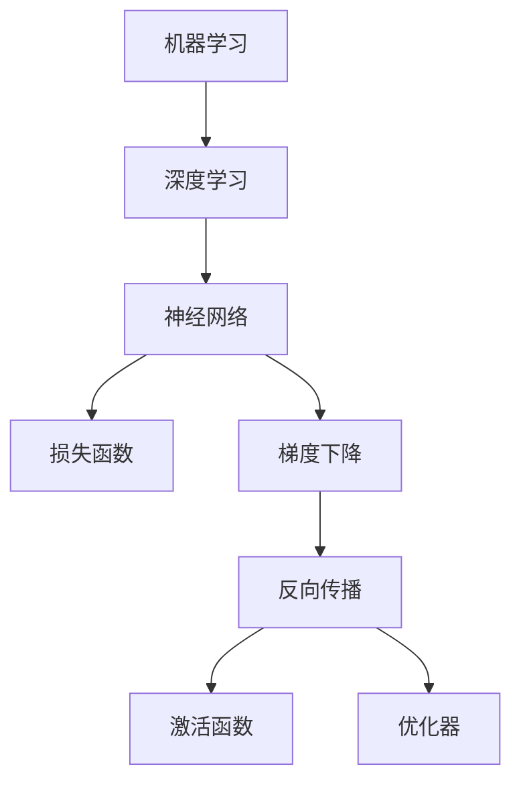

                 

# Micrograd：深入理解机器学习和反向传播

> 关键词：机器学习,反向传播,梯度下降,损失函数,微积分,神经网络,优化算法,深度学习,PyTorch

## 1. 背景介绍

### 1.1 问题由来
机器学习(ML)与深度学习(Deep Learning)已成为现代科技的核心驱动力之一，应用领域广泛，涵盖自然语言处理、计算机视觉、推荐系统、自动驾驶等多个高价值产业。在诸多学习范式中，基于梯度的反向传播算法是构建神经网络模型的基石，几乎所有高水平模型都依赖于其进行参数优化。

然而，尽管反向传播算法已广泛应用，但业界对其工作原理和数学推导的深入理解并不多。许多开发者往往将优化过程视为"黑盒"，对梯度传播、参数更新等关键细节一知半解。本文旨在深入浅出地介绍机器学习中的核心概念和关键算法，帮助你全面理解反向传播的本质，从而提升模型调优的效率和效果。

### 1.2 问题核心关键点
机器学习模型的训练过程，本质上是一系列线性或非线性变换的堆叠。通过不断迭代优化，模型的输出逼近真实标签。反向传播算法通过链式法则计算梯度，指导模型参数更新，使得模型在训练数据上的损失最小化。其核心思想在于：通过计算损失函数对每个模型参数的偏导数，调整参数以减少模型误差。

该算法的具体实现过程包括：

1. 正向传播：将输入数据通过模型计算输出，同时计算中间层的输出。
2. 反向传播：从输出层开始，计算每个参数的梯度，并传递给上一层。
3. 梯度下降：根据梯度信息，调整模型参数，最小化损失函数。

本节将重点介绍反向传播算法的原理和数学基础，结合实例帮助理解其具体实现细节，并分析其优缺点及应用领域。

## 2. 核心概念与联系

### 2.1 核心概念概述

为更好地理解反向传播算法，本节将介绍几个密切相关的核心概念：

- 机器学习(ML)：通过算法训练模型，使其能够从数据中学习并做出预测或分类。
- 深度学习(Deep Learning)：一种特殊形式的ML，通过多层次的神经网络实现高复杂度、高精度的预测或分类。
- 神经网络(Neural Network)：由多个神经元组成的计算图，用于表示复杂非线性关系。
- 损失函数(Loss Function)：用于衡量模型输出与真实标签之间的差异，是梯度下降优化的目标。
- 梯度下降(Gradient Descent)：通过迭代调整模型参数，最小化损失函数的优化算法。
- 反向传播(Backpropagation)：一种高效的梯度计算方法，通过链式法则计算梯度。
- 激活函数(Activation Function)：为神经元引入非线性变换，增强模型的表达能力。
- 优化器(Optimizer)：控制梯度下降过程中的参数更新策略，如Adam、SGD等。

这些核心概念之间的逻辑关系可以通过以下Mermaid流程图来展示：



这个流程图展示了这个领域的核心概念及其之间的关系：

1. 机器学习通过算法训练模型，深度学习是其中一种高级形式。
2. 神经网络是深度学习中的核心组件。
3. 损失函数衡量模型输出与真实标签的差距，是优化目标。
4. 梯度下降通过反向传播算法计算梯度，调整模型参数。
5. 激活函数为神经网络引入非线性变换，优化器控制梯度下降过程。

这些概念共同构成了深度学习模型的训练框架，使得模型能够从数据中学习并获得预测能力。

## 3. 核心算法原理 & 具体操作步骤
### 3.1 算法原理概述

反向传播算法是一种高效计算神经网络参数梯度的方法，其实质是通过链式法则计算每个参数对损失函数的偏导数。其核心思想是：通过从输出层向输入层逐层计算梯度，并将每个参数的梯度反向传递到输入层，以指导模型参数的更新。

在深度学习中，每个神经元都会将输出传递给下一层，因此反向传播算法可以高效地计算出每个参数的梯度，而无需从头开始计算每个神经元的输出。这使得深度神经网络的训练成为可能。

### 3.2 算法步骤详解

以下是反向传播算法的基本步骤：

**Step 1: 定义模型结构**

- 确定输入层、隐藏层、输出层的神经元数量和激活函数。
- 定义网络的结构，包括层与层之间的连接关系。
- 定义损失函数，如交叉熵、均方误差等。

**Step 2: 正向传播**

- 输入数据通过模型进行前向传播，计算每个神经元的输出。
- 记录中间层的输出，用于后续梯度计算。

**Step 3: 反向传播**

- 从输出层开始，计算每个神经元对损失函数的梯度，并将梯度传递给上一层的每个神经元。
- 利用链式法则，计算每个参数的梯度。
- 逐步将梯度传递回输入层。

**Step 4: 梯度下降**

- 根据计算出的梯度，更新每个参数的值。
- 重复上述步骤，直到模型收敛或达到预设迭代次数。

### 3.3 算法优缺点

反向传播算法具有以下优点：

1. 高效性：通过链式法则计算梯度，计算量大大减小，使得训练大型神经网络成为可能。
2. 准确性：通过逐层计算梯度，可以精确地更新每个参数，使得模型逼近真实标签。
3. 可扩展性：可以用于各种类型的神经网络结构，如全连接、卷积、循环等。

同时，该算法也存在一些局限性：

1. 梯度消失问题：在深层网络中，梯度可能逐渐消失，使得某些参数无法更新。
2. 梯度爆炸问题：在深层网络中，梯度可能逐渐增大，导致参数更新过大，甚至溢出。
3. 对初始值敏感：梯度下降的收敛速度和方向依赖于初始参数值。
4. 计算量较大：正向和反向传播都需要计算多个矩阵乘法，计算量较大。

尽管存在这些局限性，反向传播算法仍然是深度学习模型训练的核心，广泛应用于各类神经网络结构的训练中。

### 3.4 算法应用领域

反向传播算法在深度学习中具有广泛的应用，覆盖了几乎所有常见模型，例如：

- 全连接神经网络：用于图像分类、文本分类、推荐系统等任务。
- 卷积神经网络(CNN)：用于图像识别、视频分类、物体检测等任务。
- 循环神经网络(RNN)：用于序列建模、时间序列预测、自然语言处理等任务。
- 自编码器(Autoencoder)：用于数据压缩、去噪、特征提取等任务。
- 生成对抗网络(GAN)：用于生成图像、视频、音乐等任务。
- 强化学习模型：用于自动控制、游戏智能、机器人学习等任务。

除了上述这些经典模型外，反向传播算法还被创新性地应用于更多场景中，如图神经网络、自监督学习、元学习等，为深度学习技术的发展提供了新的思路。

## 4. 数学模型和公式 & 详细讲解 & 举例说明
### 4.1 数学模型构建

在介绍反向传播算法的数学原理之前，需要先回顾一些基础的数学知识。

记神经网络的输入为 $x$，参数为 $\theta$，激活函数为 $\sigma$。神经元的输出为：

$$
z = \theta^T x + b
$$

其中 $b$ 为偏置项，$\theta$ 为权重矩阵。神经元的激活值为：

$$
y = \sigma(z)
$$

其中 $\sigma$ 为激活函数。

定义损失函数 $J(\theta)$ 为模型输出与真实标签之间的差异。在训练过程中，我们希望通过梯度下降算法最小化损失函数 $J(\theta)$，即：

$$
\min_{\theta} J(\theta)
$$

### 4.2 公式推导过程

以下是反向传播算法的基本公式推导过程：

**Step 1: 正向传播**

假设神经网络的输出层有 $n$ 个神经元，则输出为：

$$
y = [y_1, y_2, ..., y_n]
$$

其中每个神经元的输出 $y_i$ 由隐藏层输出 $h_i$ 和偏置 $b_i$ 决定：

$$
y_i = \sigma(z_i) = \sigma(\theta_i^T h_i + b_i)
$$

其中 $\theta_i$ 为输出层的第 $i$ 个神经元的权重向量，$h_i$ 为隐藏层输出，$b_i$ 为偏置。

隐藏层的输出 $h_i$ 由下层神经元的输出 $h_{i-1}$ 和权重矩阵 $\theta_{i-1}$ 决定：

$$
h_i = \sigma(z_i) = \sigma(\theta_i^T h_{i-1} + b_i)
$$

通过迭代计算，可以得到所有神经元的输出，即：

$$
y = [y_1, y_2, ..., y_n]
$$

**Step 2: 反向传播**

从输出层开始，计算每个神经元对损失函数的梯度，并将梯度传递给上一层的每个神经元。

假设输出层的损失函数为 $J(y)$，则每个神经元的梯度为：

$$
\frac{\partial J}{\partial y_i} = \frac{\partial J}{\partial z_i} \frac{\partial z_i}{\partial y_i} = \frac{\partial J}{\partial z_i} \sigma'(z_i)
$$

其中 $\sigma'(z_i)$ 为激活函数的导数。

将梯度传递给隐藏层，每个隐藏神经元的梯度为：

$$
\frac{\partial J}{\partial h_i} = \frac{\partial J}{\partial z_i} \frac{\partial z_i}{\partial h_i} = \frac{\partial J}{\partial z_i} \theta_i^T \sigma'(z_i)
$$

通过链式法则，可以得到每个参数的梯度。

输出层的参数 $\theta_i$ 的梯度为：

$$
\frac{\partial J}{\partial \theta_i} = \frac{\partial J}{\partial z_i} \frac{\partial z_i}{\partial h_i} \frac{\partial h_i}{\partial \theta_i} = \frac{\partial J}{\partial z_i} \frac{\partial z_i}{\partial h_i} \theta_i^T \sigma'(z_i) h_{i-1}^T
$$

隐藏层的权重矩阵 $\theta_{i-1}$ 的梯度为：

$$
\frac{\partial J}{\partial \theta_{i-1}} = \frac{\partial J}{\partial z_i} \frac{\partial z_i}{\partial h_i} \frac{\partial h_i}{\partial z_{i-1}} \theta_{i-1}^T \sigma'(z_{i-1}) h_{i-2}^T
$$

其中 $\theta_{i-1}$ 为隐藏层 $i-1$ 层的权重矩阵，$z_{i-1}$ 为该层的输出。

### 4.3 案例分析与讲解

以一个简单的二分类任务为例，说明反向传播算法的具体应用。

假设输入为二元向量 $x=[x_1, x_2]$，模型输出为 $y=[y_1, y_2]$，其中 $y_i$ 为神经元 $i$ 的激活值，$z_i = \theta_i^T x + b_i$ 为线性变换后的输出。定义二元交叉熵损失函数 $J$：

$$
J = -(y_1 \log y_1 + y_2 \log y_2)
$$

在训练过程中，我们希望通过梯度下降算法最小化损失函数 $J$。

**Step 1: 正向传播**

假设模型有两层隐藏神经元，每个神经元的激活函数为 sigmoid。则输出层的激活值 $y_1, y_2$ 分别为：

$$
y_1 = \sigma(z_1) = \sigma(\theta_1^T h_1 + b_1)
$$

$$
y_2 = \sigma(z_2) = \sigma(\theta_2^T h_2 + b_2)
$$

其中 $h_1, h_2$ 为隐藏层的输出，$\theta_1, \theta_2$ 为输出层的权重矩阵，$b_1, b_2$ 为偏置。

**Step 2: 反向传播**

输出层的损失函数 $J$ 对 $y_1, y_2$ 的梯度分别为：

$$
\frac{\partial J}{\partial y_1} = -\frac{y_1}{y_1} = -1
$$

$$
\frac{\partial J}{\partial y_2} = -\frac{y_2}{y_2} = -1
$$

将梯度传递给隐藏层，得到每个隐藏神经元的梯度：

$$
\frac{\partial J}{\partial h_1} = \frac{\partial J}{\partial y_1} \frac{\partial y_1}{\partial z_1} \theta_1^T \sigma'(z_1) = -1 \times 1 \times \theta_1^T \sigma'(z_1)
$$

$$
\frac{\partial J}{\partial h_2} = \frac{\partial J}{\partial y_2} \frac{\partial y_2}{\partial z_2} \theta_2^T \sigma'(z_2) = -1 \times 1 \times \theta_2^T \sigma'(z_2)
$$

将梯度传递给输入层，得到每个参数的梯度：

$$
\frac{\partial J}{\partial \theta_1} = \frac{\partial J}{\partial z_1} \frac{\partial z_1}{\partial h_1} \frac{\partial h_1}{\partial \theta_1} = \frac{\partial J}{\partial y_1} \frac{\partial y_1}{\partial z_1} \theta_1^T \sigma'(z_1) h_1^T = -1 \times 1 \times \theta_1^T \sigma'(z_1) h_1^T
$$

$$
\frac{\partial J}{\partial \theta_2} = \frac{\partial J}{\partial z_2} \frac{\partial z_2}{\partial h_2} \frac{\partial h_2}{\partial \theta_2} = \frac{\partial J}{\partial y_2} \frac{\partial y_2}{\partial z_2} \theta_2^T \sigma'(z_2) h_2^T = -1 \times 1 \times \theta_2^T \sigma'(z_2) h_2^T
$$

**Step 3: 梯度下降**

根据计算出的梯度，更新每个参数的值，使得损失函数 $J$ 最小化。

在实践中，反向传播算法通过链式法则计算每个参数的梯度，从而指导参数的更新。这个过程虽然计算量大，但在深度学习模型中极为高效。

## 5. 项目实践：代码实例和详细解释说明
### 5.1 开发环境搭建

在进行反向传播算法的实践前，我们需要准备好开发环境。以下是使用Python进行PyTorch开发的环境配置流程：

1. 安装Anaconda：从官网下载并安装Anaconda，用于创建独立的Python环境。

2. 创建并激活虚拟环境：
```bash
conda create -n pytorch-env python=3.8 
conda activate pytorch-env
```

3. 安装PyTorch：根据CUDA版本，从官网获取对应的安装命令。例如：
```bash
conda install pytorch torchvision torchaudio cudatoolkit=11.1 -c pytorch -c conda-forge
```

4. 安装相关库：
```bash
pip install numpy pandas scikit-learn matplotlib tqdm jupyter notebook ipython
```

完成上述步骤后，即可在`pytorch-env`环境中开始实践。

### 5.2 源代码详细实现

下面我们以一个简单的线性回归为例，给出使用PyTorch实现反向传播的完整代码。

```python
import torch
import torch.nn as nn
import torch.optim as optim

# 定义模型结构
class LinearRegression(nn.Module):
    def __init__(self, input_size, output_size):
        super(LinearRegression, self).__init__()
        self.linear = nn.Linear(input_size, output_size)

    def forward(self, x):
        out = self.linear(x)
        return out

# 定义训练数据
x_train = torch.tensor([[1.0, 2.0, 3.0], [4.0, 5.0, 6.0]])
y_train = torch.tensor([[10.0], [20.0]])

# 定义损失函数
criterion = nn.MSELoss()

# 定义优化器
learning_rate = 0.01
optimizer = optim.SGD(model.parameters(), lr=learning_rate)

# 训练模型
for epoch in range(100):
    optimizer.zero_grad()
    outputs = model(x_train)
    loss = criterion(outputs, y_train)
    loss.backward()
    optimizer.step()
    if (epoch+1) % 10 == 0:
        print('Epoch [%d], Loss: %.4f' % (epoch+1, loss.item()))

# 输出模型参数
print('Model Parameters:')
for name, param in model.named_parameters():
    print(name, param.data.numpy())
```

### 5.3 代码解读与分析

让我们再详细解读一下关键代码的实现细节：

**LinearRegression类**：
- `__init__`方法：定义模型结构，包括线性层。
- `forward`方法：实现前向传播计算。

**训练数据**：
- 定义训练集数据，使用PyTorch的tensor表示。

**损失函数**：
- 使用均方误差损失函数。

**优化器**：
- 定义学习率，使用随机梯度下降优化器。

**训练过程**：
- 在每个epoch内，先清空梯度，然后前向传播计算输出，计算损失函数，反向传播计算梯度，更新模型参数。
- 定期输出训练误差。
- 输出模型参数。

通过PyTorch实现反向传播算法的代码实现相对简洁。但实际应用中，还需考虑模型裁剪、混合精度训练、模型并行等优化措施，以提高训练效率和模型性能。

## 6. 实际应用场景
### 6.1 智能推荐系统

基于反向传播算法的机器学习模型，在智能推荐系统中得到了广泛应用。推荐系统通过学习用户的历史行为数据，预测用户对商品的偏好，从而实现个性化推荐。

在技术实现上，可以收集用户的浏览、点击、购买等行为数据，构建推荐模型。通过反向传播算法优化模型参数，使得推荐模型能够更好地理解用户的兴趣点。在推荐过程中，将用户的历史行为数据作为输入，由模型预测其可能感兴趣的商品，从而提升推荐效果。

### 6.2 自然语言处理

反向传播算法在自然语言处理(NLP)领域也有着广泛应用。NLP的任务包括文本分类、命名实体识别、情感分析、机器翻译等。通过构建基于神经网络的模型，并通过反向传播算法优化模型参数，可以显著提升模型在特定任务上的性能。

以情感分析为例，可以使用RNN或LSTM模型，将文本输入作为输入，输出预测的情感标签。通过反向传播算法优化模型参数，使得模型能够更好地理解文本的语义信息，从而实现更准确的情感分析。

### 6.3 计算机视觉

计算机视觉领域也广泛应用反向传播算法。常见的任务包括图像分类、物体检测、人脸识别等。通过构建卷积神经网络模型，并通过反向传播算法优化模型参数，可以显著提升模型的分类和检测能力。

以图像分类为例，可以使用卷积神经网络模型，将图像输入作为输入，输出预测的类别。通过反向传播算法优化模型参数，使得模型能够更好地识别图像中的特征，从而实现更高的分类精度。

### 6.4 未来应用展望

随着反向传播算法的发展，其在深度学习中的应用也将更加广泛。未来，反向传播算法有望在更多领域发挥重要作用，如自动驾驶、医疗诊断、金融预测等。

在自动驾驶中，反向传播算法可以用于构建感知模型，提高自动驾驶系统的识别能力和决策能力。在医疗诊断中，反向传播算法可以用于构建诊断模型，提高医疗诊断的准确性和可靠性。在金融预测中，反向传播算法可以用于构建预测模型，提高金融预测的精确性和实时性。

总之，反向传播算法是大数据时代的重要技术工具，为深度学习模型的训练提供了有力的支持。随着技术的不断发展，反向传播算法也将不断进步，推动人工智能技术的应用场景不断拓展。

## 7. 工具和资源推荐
### 7.1 学习资源推荐

为了帮助开发者系统掌握反向传播算法的原理和实践技巧，这里推荐一些优质的学习资源：

1. 《深度学习》书籍：Ian Goodfellow所著，全面介绍了深度学习的基本概念和核心算法。

2. 《神经网络与深度学习》书籍：Michael Nielsen所著，深入浅出地介绍了神经网络的构建和训练过程。

3. CS231n《卷积神经网络》课程：斯坦福大学开设的计算机视觉课程，有Lecture视频和配套作业，带你入门深度学习的基础知识。

4. Coursera《机器学习》课程：Andrew Ng教授的入门级机器学习课程，详细介绍了机器学习的基本算法和应用。

5. DeepLearning.ai《深度学习专业证书》课程：通过五个课程体系，系统掌握深度学习的核心技术。

通过对这些资源的学习实践，相信你一定能够快速掌握反向传播算法的精髓，并用于解决实际的机器学习问题。
### 7.2 开发工具推荐

高效的开发离不开优秀的工具支持。以下是几款用于反向传播算法开发的常用工具：

1. PyTorch：基于Python的开源深度学习框架，支持动态计算图，灵活动态的模型构建。

2. TensorFlow：由Google主导开发的开源深度学习框架，生产部署方便，支持静态计算图。

3. MXNet：由亚马逊主导开发的深度学习框架，支持多种编程语言和分布式训练。

4. Keras：高层次深度学习框架，简单易用，适合快速原型开发。

5. TensorBoard：TensorFlow配套的可视化工具，实时监测模型训练状态，提供丰富的图表呈现方式。

6. Weights & Biases：模型训练的实验跟踪工具，可以记录和可视化模型训练过程中的各项指标，方便对比和调优。

7. Jupyter Notebook：交互式开发环境，支持多种语言，方便代码编写和实验调试。

合理利用这些工具，可以显著提升反向传播算法的开发效率，加快创新迭代的步伐。

### 7.3 相关论文推荐

反向传播算法的发展源于学界的持续研究。以下是几篇奠基性的相关论文，推荐阅读：

1. 《Backpropagation: Application to feed-forward networks and problems with hidden layers》：Rumelhart等人在1986年发表的经典论文，首次提出反向传播算法。

2. 《Understanding the difficulty of training deep feedforward neural networks》：Hinton等人在1989年发表的论文，讨论了深层神经网络训练中的梯度消失问题。

3. 《Improving networks with cross-channel transfer learning》：LeCun等人在1990年发表的论文，提出了跨层传递梯度的思想。

4. 《On the importance of initialization and momentum in deep learning》：Sutskever等人在2013年发表的论文，讨论了深度学习模型训练中的初始化和动量优化问题。

5. 《Delving deep into rectifiers: Surpassing human-level performance on imagenet classification》：He等人在2015年发表的论文，提出ResNet模型，进一步提高了深度神经网络的训练效果。

这些论文代表了大数据时代深度学习的发展脉络。通过学习这些前沿成果，可以帮助研究者把握学科前进方向，激发更多的创新灵感。

## 8. 总结：未来发展趋势与挑战
### 8.1 研究成果总结

本文对反向传播算法的核心概念、数学原理和具体实现进行了全面系统的介绍。通过详细讲解反向传播算法的原理和数学推导，我们系统地回答了如何构建神经网络模型、如何计算梯度、如何更新参数等问题。同时，我们也介绍了反向传播算法在多个领域的实际应用，展示了其在深度学习中的广泛适用性。

通过本文的系统梳理，可以看到，反向传播算法是大数据时代的重要技术工具，为深度学习模型的训练提供了有力的支持。深度学习模型的构建和训练，离不开反向传播算法的应用。未来，反向传播算法还将持续进步，推动深度学习技术的发展。

### 8.2 未来发展趋势

展望未来，反向传播算法将呈现以下几个发展趋势：

1. 深度学习模型的规模将继续扩大。随着算力成本的下降和数据规模的扩张，深度学习模型的参数量还将持续增长。超大规模模型蕴含的丰富知识，有望支撑更加复杂多变的任务训练。

2. 反向传播算法将与更多的前沿技术结合。例如，引入强化学习、因果推理等思想，优化神经网络模型的训练过程，提升模型的泛化性和鲁棒性。

3. 反向传播算法将与多模态信息融合。除了文本数据，反向传播算法还将应用于图像、视频、语音等多模态数据的处理，增强模型的表达能力。

4. 反向传播算法将与分布式训练结合。随着大规模深度学习模型的训练，分布式训练技术将变得更加成熟，反向传播算法将在大规模分布式计算环境中得到广泛应用。

5. 反向传播算法将与新兴硬件平台结合。随着AI芯片等新兴硬件平台的出现，反向传播算法将在大规模深度学习训练中获得更好的性能和效率。

以上趋势凸显了反向传播算法在大数据时代的强大生命力。这些方向的探索发展，必将进一步提升深度学习模型的训练效果，推动深度学习技术的应用场景不断拓展。

### 8.3 面临的挑战

尽管反向传播算法在深度学习中取得了巨大成功，但在迈向更加智能化、普适化应用的过程中，它仍面临着诸多挑战：

1. 深度学习模型训练的高成本。大规模深度学习模型的训练需要大量GPU/TPU等高性能设备，算力成本较高。如何降低训练成本，是未来的重要研究方向。

2. 深度学习模型训练的高难度。深度学习模型的训练需要大量的数据、复杂的算法和高效的优化器。如何简化训练过程，使得模型训练更加高效和稳定，是未来的研究重点。

3. 深度学习模型的高复杂性。深度学习模型结构复杂，难以理解和调试。如何提高模型的可解释性和可解释性，是未来的研究难点。

4. 深度学习模型的高风险性。深度学习模型容易学习到有害信息，导致模型产生误导性或歧视性的输出。如何增强模型的鲁棒性和安全性，是未来的重要课题。

5. 深度学习模型的低可靠性。深度学习模型在面对极端数据时，容易出现鲁棒性不足、泛化性能差等问题。如何提高模型的泛化能力和鲁棒性，是未来的研究方向。

这些挑战凸显了深度学习技术在实际应用中仍需面对的诸多困难。唯有不断创新和优化，才能确保深度学习技术的可持续发展。

### 8.4 研究展望

面向未来，深度学习研究需要在以下几个方面寻求新的突破：

1. 优化反向传播算法本身。引入更多的优化策略和改进措施，如自适应学习率、动量优化、参数更新等，使得深度学习模型训练更加高效和稳定。

2. 构建更加复杂、更加通用化的深度学习模型。通过引入更多的神经元、更多的层、更多的神经元间连接关系，增强模型的表达能力和泛化能力。

3. 结合更多前沿技术，优化深度学习模型训练过程。例如，结合强化学习、因果推理等思想，优化神经网络模型的训练过程，提升模型的泛化性和鲁棒性。

4. 发展更加灵活、更加可解释的深度学习模型。通过引入更多先验知识、更多可解释性技术，使得深度学习模型更具可解释性和可控性。

5. 增强深度学习模型的安全性、鲁棒性和泛化能力。通过引入更多鲁棒性训练技术、更多对抗攻击技术，使得深度学习模型更加安全和稳定。

这些研究方向的探索，必将引领深度学习技术的进一步进步，为构建更加强大、更加可靠的人工智能系统提供技术支持。

## 9. 附录：常见问题与解答

**Q1：反向传播算法是否适用于所有深度学习模型？**

A: 反向传播算法适用于绝大多数深度学习模型，特别是基于前向传播和链式法则构建的模型。但对于一些特殊的模型结构，如残差网络、门控循环单元等，可能需要特殊处理。

**Q2：反向传播算法如何处理深层网络的梯度消失和梯度爆炸问题？**

A: 梯度消失和梯度爆炸问题在深层网络中常见。可以通过一些技术手段来解决，如引入批标准化、残差连接、梯度裁剪等。同时，使用更先进的优化器，如Adam、Adafactor等，也能有效缓解这些问题。

**Q3：反向传播算法如何处理过拟合问题？**

A: 过拟合是深度学习模型训练中的常见问题。可以通过一些技术手段来解决，如正则化、dropout、early stopping等。同时，使用数据增强、模型裁剪等技术，也能有效缓解这些问题。

**Q4：反向传播算法如何处理模型参数的初始化？**

A: 模型参数的初始化对深度学习模型的训练效果有重要影响。常见的初始化方法有随机初始化、Xavier初始化、He初始化等。合理选择初始化方法，可以有效提升模型训练效果。

**Q5：反向传播算法如何处理多任务学习问题？**

A: 多任务学习是深度学习中的重要方向。可以通过共享层、联合训练、任务对齐等技术，将多个任务关联起来，提升模型的多任务泛化能力。

通过以上系统性的介绍和实践指导，相信你对反向传播算法有了更深入的理解。掌握反向传播算法的原理和实现细节，可以更好地构建深度学习模型，提升模型训练效果，加速技术创新。希望本文能为你提供有价值的参考，助力你的深度学习研究之旅。

---

作者：禅与计算机程序设计艺术 / Zen and the Art of Computer Programming

