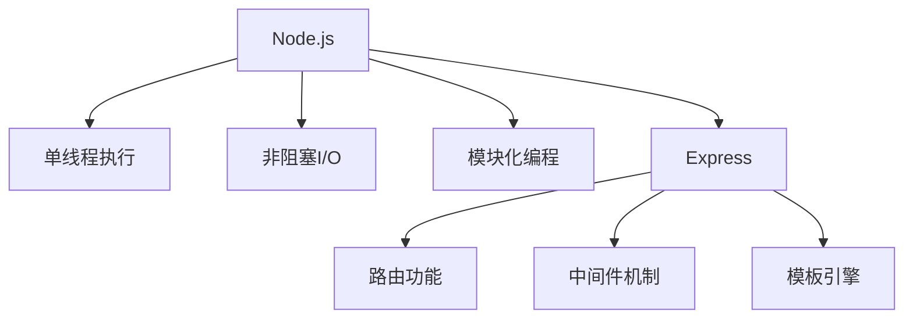

                 

# Node.js 和 Express：构建服务器端 JavaScript 应用程序

## 1. 背景介绍

### 1.1 问题由来

随着Web技术的发展，Web开发工具和框架层出不穷。传统的Web开发主要依赖于服务器端语言如Java、PHP、C#等，而随着Node.js的诞生，JavaScript语言一跃成为服务器端编程的主力军。Node.js的出现，不仅简化了Web开发流程，也大幅提高了Web应用的开发效率。

### 1.2 问题核心关键点

Node.js是一个基于Chrome V8引擎的JavaScript运行环境，它允许开发者使用JavaScript编写跨平台的服务器端程序。而Express是一个基于Node.js的开源Web框架，它提供了路由、中间件、模板引擎等核心功能，极大地简化了Web应用的开发。

Node.js和Express是当前最流行的Web开发工具，其核心优势包括：
1. 开发效率高：使用JavaScript编写的代码能够直接在浏览器中运行，无需编译。
2. 零学习曲线：Node.js与JavaScript语言高度一致，入门门槛低。
3. 社区支持好：Node.js和Express拥有庞大的社区，提供了丰富的第三方插件和文档。
4. 非阻塞I/O：Node.js使用事件驱动的异步I/O模型，能够高效处理高并发请求。

本博客将详细讲解Node.js和Express的基础知识，并结合实例帮助读者掌握其核心使用方法。通过理解Node.js和Express的原理和应用，读者将能够快速构建高效、可扩展的服务器端JavaScript应用程序。

## 2. 核心概念与联系

### 2.1 核心概念概述

#### 2.1.1 Node.js

Node.js是一个基于Chrome V8引擎的JavaScript运行环境，它允许开发者使用JavaScript编写跨平台的服务器端程序。Node.js的核心特点包括：
- 单线程执行：Node.js使用单线程执行JavaScript代码，通过事件循环模型实现高效的异步I/O处理。
- 非阻塞I/O：Node.js采用非阻塞I/O模型，能够高效处理大量并发请求。
- 模块化编程：Node.js采用模块化编程模式，便于代码组织和维护。

#### 2.1.2 Express

Express是一个基于Node.js的开源Web框架，它提供了路由、中间件、模板引擎等核心功能，极大地简化了Web应用的开发。Express的核心特点包括：
- 路由功能：Express支持RESTful路由，能够灵活定义API接口。
- 中间件机制：Express通过中间件机制，可以方便地处理请求和响应。
- 模板引擎：Express内置了多种模板引擎，支持HTML、Pug、EJS等模板语言。

### 2.2 核心概念原理和架构的 Mermaid 流程图



## 3. 核心算法原理 & 具体操作步骤

### 3.1 算法原理概述

Node.js和Express的核心算法原理包括单线程执行、非阻塞I/O和模块化编程。

#### 3.1.1 单线程执行

Node.js采用单线程执行JavaScript代码，通过事件循环模型实现高效的异步I/O处理。Node.js的事件循环模型分为5个阶段：timers、I/O callbacks、idle、prepare和poll。每个阶段执行完毕后，Node.js会进入下一个阶段，直到所有阶段都执行完毕。

#### 3.1.2 非阻塞I/O

Node.js采用非阻塞I/O模型，能够高效处理大量并发请求。通过回调函数，Node.js可以在I/O操作完成后执行回调函数，从而避免阻塞主线程。

#### 3.1.3 模块化编程

Node.js采用模块化编程模式，便于代码组织和维护。通过模块化编程，开发者可以将代码分成多个模块，每个模块负责特定功能，使得代码更加清晰和易于维护。

### 3.2 算法步骤详解

#### 3.2.1 安装Node.js

1. 从Node.js官网下载最新版本的Node.js安装包。
2. 解压安装包，运行`node -v`命令检查Node.js是否安装成功。
3. 安装npm（Node.js包管理器），运行`npm -v`命令检查npm是否安装成功。

#### 3.2.2 创建Express项目

1. 创建一个新的文件夹作为项目目录。
2. 在项目目录下运行`npm init`命令，按照提示填写项目信息，创建`package.json`文件。
3. 安装Express框架，运行`npm install express`命令。

#### 3.2.3 编写Express代码

1. 创建一个新的JavaScript文件，例如`app.js`。
2. 在`app.js`文件中引入Express模块，编写路由和中间件代码。
3. 启动Express应用，运行`node app.js`命令。

### 3.3 算法优缺点

#### 3.3.1 优点

1. 开发效率高：使用JavaScript编写的代码能够直接在浏览器中运行，无需编译。
2. 零学习曲线：Node.js与JavaScript语言高度一致，入门门槛低。
3. 非阻塞I/O：Node.js使用事件驱动的异步I/O模型，能够高效处理高并发请求。
4. 社区支持好：Node.js和Express拥有庞大的社区，提供了丰富的第三方插件和文档。

#### 3.3.2 缺点

1. 单线程执行：Node.js采用单线程执行JavaScript代码，可能无法处理复杂的计算任务。
2. 模块管理复杂：Node.js的模块化编程模式，需要开发者自行管理依赖关系，容易出现版本冲突。
3. 安全性问题：Node.js采用非阻塞I/O模型，需要开发者自行处理安全问题。

### 3.4 算法应用领域

Node.js和Express被广泛应用于Web开发、API开发、实时应用、数据处理等场景。以下是几个具体的应用领域：

1. Web开发：使用Express框架可以快速构建Web应用，支持路由、中间件、模板引擎等核心功能。
2. API开发：使用Express框架可以轻松构建RESTful API接口，支持HTTP请求、JSON数据格式等。
3. 实时应用：Node.js的异步I/O模型，支持WebSocket协议，能够高效处理实时通信。
4. 数据处理：Node.js的高效I/O处理能力，支持处理大量并发数据请求，适用于大数据处理和实时数据采集。

## 4. 数学模型和公式 & 详细讲解 & 举例说明

### 4.1 数学模型构建

#### 4.1.1 路由模型

Express的路由模型可以通过`app.get()`、`app.post()`等方法定义。路由模型基于URL路径匹配，能够灵活定义API接口。

例如，定义一个路由处理函数：

```javascript
app.get('/api/user/:id', function(req, res) {
  var id = req.params.id;
  // 处理逻辑
  res.json({data: 'data from server'});
});
```

该路由模型表示，当请求URL为`/api/user/:id`时，调用处理函数，返回JSON格式的数据。

### 4.2 公式推导过程

#### 4.2.1 请求处理流程

Express请求处理流程包括4个步骤：
1. 解析URL路径：Express根据URL路径匹配路由模型，找到对应的处理函数。
2. 调用中间件：Express调用中间件处理请求，例如身份验证、日志记录等。
3. 处理请求：Express调用处理函数处理请求，返回响应数据。
4. 发送响应：Express发送响应数据给客户端。

使用以下伪代码表示：

```javascript
app.get('/api/user/:id', function(req, res) {
  var id = req.params.id;
  // 处理逻辑
  res.json({data: 'data from server'});
});
```

### 4.3 案例分析与讲解

#### 4.3.1 请求参数解析

Express的路由模型支持URL参数、查询参数、POST请求体等。例如，定义一个处理查询参数的路由模型：

```javascript
app.get('/api/user', function(req, res) {
  var name = req.query.name;
  var age = req.query.age;
  // 处理逻辑
  res.json({name: name, age: age});
});
```

该路由模型表示，当请求URL为`/api/user`时，解析查询参数，并调用处理函数返回JSON格式的数据。

## 5. 项目实践：代码实例和详细解释说明

### 5.1 开发环境搭建

1. 从Node.js官网下载最新版本的Node.js安装包，解压并运行`node -v`命令检查是否安装成功。
2. 安装npm，运行`npm -v`命令检查是否安装成功。
3. 创建一个新的文件夹作为项目目录。

### 5.2 源代码详细实现

#### 5.2.1 创建Express应用

在项目目录中创建`app.js`文件，编写以下代码：

```javascript
const express = require('express');
const app = express();
const port = 3000;

app.get('/', function(req, res) {
  res.send('Hello World!');
});

app.listen(port, function() {
  console.log(`Server listening on port ${port}`);
});
```

该代码创建了一个Express应用，监听3000端口，并在根路径返回`Hello World!`的响应。

#### 5.2.2 添加中间件

在`app.js`文件中添加以下代码：

```javascript
const express = require('express');
const app = express();
const port = 3000;

app.use(express.json()); // 解析请求体
app.use(express.urlencoded({ extended: true })); // 解析表单数据

app.get('/', function(req, res) {
  res.send('Hello World!');
});

app.listen(port, function() {
  console.log(`Server listening on port ${port}`);
});
```

该代码添加了中间件，用于解析请求体和表单数据。

#### 5.2.3 处理POST请求

在`app.js`文件中添加以下代码：

```javascript
const express = require('express');
const app = express();
const port = 3000;

app.use(express.json());

app.get('/', function(req, res) {
  res.send('Hello World!');
});

app.post('/api/user', function(req, res) {
  var name = req.body.name;
  var age = req.body.age;
  // 处理逻辑
  res.json({name: name, age: age});
});

app.listen(port, function() {
  console.log(`Server listening on port ${port}`);
});
```

该代码处理POST请求，解析请求体，并返回JSON格式的数据。

### 5.3 代码解读与分析

#### 5.3.1 中间件使用

Express的中间件机制可以方便地处理请求和响应。中间件可以按照顺序执行，对请求进行预处理、修改或记录。例如，使用`express.json()`中间件解析请求体，使用`express.urlencoded()`中间件解析表单数据。

#### 5.3.2 路由处理函数

路由处理函数接收两个参数：`req`和`res`。`req`表示请求对象，包含请求方法和URL路径等信息；`res`表示响应对象，用于发送响应数据。

## 6. 实际应用场景

### 6.1 Web应用开发

使用Express框架可以轻松构建Web应用，支持路由、中间件、模板引擎等核心功能。例如，使用Express构建一个简单的博客系统，实现用户注册、文章发布、文章评论等功能。

### 6.2 API开发

使用Express框架可以轻松构建RESTful API接口，支持HTTP请求、JSON数据格式等。例如，使用Express构建一个简单的用户管理系统，实现用户注册、登录、修改密码等功能。

### 6.3 实时应用

Node.js的异步I/O模型，支持WebSocket协议，能够高效处理实时通信。例如，使用Express构建一个简单的聊天室应用，支持实时消息推送和广播。

### 6.4 未来应用展望

Node.js和Express将在大数据处理、实时应用、API开发等领域发挥越来越重要的作用。未来的发展方向包括：

1. 支持WebAssembly：通过WebAssembly技术，Node.js可以运行在Web浏览器中，进一步提升Web应用的性能。
2. 支持分布式架构：Node.js和Express可以与其他分布式框架如Docker、Kubernetes等结合，构建高效、可扩展的分布式应用。
3. 支持微服务架构：Node.js和Express可以与其他微服务框架如Meteor、Meteorite等结合，构建高效、可维护的微服务应用。

## 7. 工具和资源推荐

### 7.1 学习资源推荐

1. 《JavaScript高级程序设计》：JavaScript经典教程，帮助读者深入理解JavaScript语言。
2. 《Node.js实战》：Node.js入门教程，介绍Node.js的核心功能和应用场景。
3. 《Express实战》：Express入门教程，介绍Express框架的核心功能和应用场景。
4. 《JavaScript模块化开发》：介绍JavaScript模块化编程模式，帮助读者掌握模块化编程技巧。
5. 《JavaScript框架和库》：介绍JavaScript常用框架和库，帮助读者选择适合自己的框架。

### 7.2 开发工具推荐

1. Visual Studio Code：跨平台的IDE，支持JavaScript和Node.js开发。
2. Atom：开源的文本编辑器，支持JavaScript和Node.js开发。
3. WebStorm：专业的JavaScript和Node.js IDE，提供丰富的开发工具和插件。

### 7.3 相关论文推荐

1. 《JavaScript语言规范》：介绍JavaScript语言规范和核心特性，帮助读者深入理解JavaScript语言。
2. 《Node.js设计模式》：介绍Node.js的核心设计和最佳实践，帮助读者掌握Node.js的编程技巧。
3. 《Express框架设计》：介绍Express框架的设计原理和核心功能，帮助读者深入理解Express框架。
4. 《WebAssembly规范》：介绍WebAssembly技术，帮助读者了解WebAssembly的发展方向和应用场景。
5. 《JavaScript模块化编程》：介绍JavaScript模块化编程模式，帮助读者掌握模块化编程技巧。

## 8. 总结：未来发展趋势与挑战

### 8.1 总结

Node.js和Express是当前最流行的Web开发工具，其核心优势包括开发效率高、零学习曲线、非阻塞I/O等。通过理解Node.js和Express的原理和应用，读者将能够快速构建高效、可扩展的服务器端JavaScript应用程序。

### 8.2 未来发展趋势

Node.js和Express将在大数据处理、实时应用、API开发等领域发挥越来越重要的作用。未来的发展方向包括支持WebAssembly、分布式架构、微服务架构等。

### 8.3 面临的挑战

Node.js和Express在发展过程中也面临一些挑战，包括单线程执行、模块管理复杂、安全性问题等。未来的研究需要解决这些问题，进一步提升Node.js和Express的性能和可靠性。

### 8.4 研究展望

未来的研究将在以下几个方向寻求新的突破：
1. 支持WebAssembly：通过WebAssembly技术，Node.js可以运行在Web浏览器中，进一步提升Web应用的性能。
2. 支持分布式架构：Node.js和Express可以与其他分布式框架如Docker、Kubernetes等结合，构建高效、可扩展的分布式应用。
3. 支持微服务架构：Node.js和Express可以与其他微服务框架如Meteor、Meteorite等结合，构建高效、可维护的微服务应用。

## 9. 附录：常见问题与解答

### 9.1 Q1：如何安装Node.js和npm？

A: 从Node.js官网下载最新版本的Node.js安装包，解压并运行`node -v`命令检查是否安装成功。安装npm，运行`npm -v`命令检查是否安装成功。

### 9.2 Q2：如何创建Express应用？

A: 创建一个新的JavaScript文件，例如`app.js`。在`app.js`文件中引入Express模块，编写路由和中间件代码。启动Express应用，运行`node app.js`命令。

### 9.3 Q3：如何处理POST请求？

A: 使用`express.json()`中间件解析请求体，使用`express.urlencoded()`中间件解析表单数据。在路由处理函数中处理POST请求，并返回JSON格式的数据。

---

作者：禅与计算机程序设计艺术 / Zen and the Art of Computer Programming

