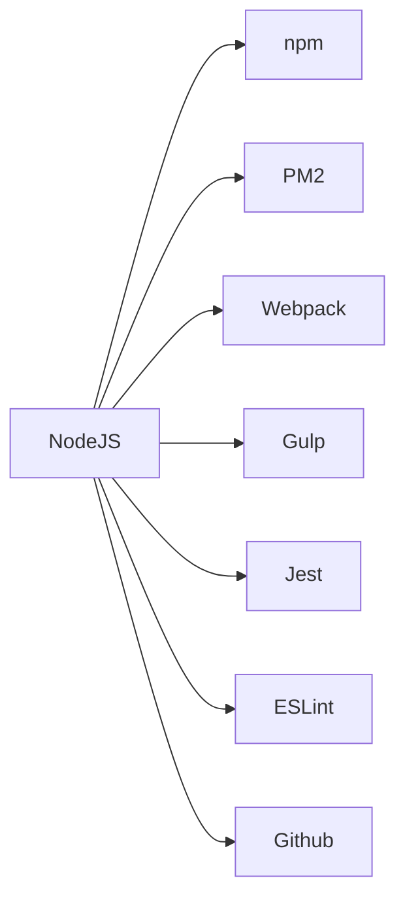

                 

# Node.js 模块化编程：管理大型项目

> 关键词：Node.js, 模块化编程, 模块管理, 依赖管理, 版本控制, 性能优化, 测试驱动开发, 代码复用, 代码质量, 社区生态

## 1. 背景介绍

### 1.1 问题由来

随着Web应用的复杂度不断提升，单体应用已经难以满足需求，逐渐演变为微服务架构和分布式系统。这一过程中，传统单体应用的开发、测试、部署和运维模式难以适应新的需求，如何在分布式系统中高效地管理模块，成为一个重要的问题。Node.js作为目前最流行的后端技术之一，具备天然的模块化特性，可以帮助开发者更好地管理大型项目。

### 1.2 问题核心关键点

Node.js的模块化特性，使得开发者可以灵活地组织代码，提高代码复用性，降低开发成本。但是，如何有效地管理这些模块，尤其是在大型项目中，依然是一个挑战。

**核心问题：**
- 如何有效地组织和管理Node.js项目的模块？
- 如何高效地依赖和管理项目中的第三方库？
- 如何在大型项目中避免性能瓶颈和代码冗余？
- 如何在Node.js项目中实现代码的自动化测试和持续集成？
- 如何保证项目代码的质量和可维护性？

### 1.3 问题研究意义

Node.js的模块化编程能够帮助开发者更好地组织代码，提高开发效率，降低维护成本。尤其对于大型项目，模块化管理更是必不可少，能够使项目结构更加清晰，代码更加复用，维护更加简单。

Node.js社区的模块管理工具，如npm（Node Package Manager）、PM2等，已经成为了开发者不可或缺的辅助工具。通过这些工具，可以方便地查找、安装、更新和管理第三方库，同时支持多种开发模式，如模块化、微服务、微前端等。

## 2. 核心概念与联系

### 2.1 核心概念概述

Node.js的模块化编程是其最具代表性的特性之一，下面对相关核心概念进行简要介绍：

- **Node.js**：基于Chrome V8引擎的非阻塞I/O模型，可用于开发高性能的网络应用。
- **模块化编程**：将代码分解为小的、独立的、可重用的模块，提高代码的可维护性和复用性。
- **npm**：Node.js的包管理器，用于安装、发布和管理第三方库。
- **PM2**：Node.js进程管理工具，支持进程监控、负载均衡、热重启等。
- **Webpack**：模块打包工具，支持将多个模块打包成可部署的构建文件。
- **Gulp**：自动化任务执行工具，支持自定义任务，提高开发效率。
- **Jest**：Node.js的测试框架，支持单元测试、集成测试、代码覆盖率统计等。
- **ESLint**：代码规范检查工具，帮助开发者保持代码的一致性和可读性。
- **Github**：代码托管平台，提供代码版本控制、协作开发、持续集成等。

这些核心概念之间的关系可以通过以下Mermaid流程图来展示：



这个流程图展示了Node.js生态系统中各个模块化编程工具的关联关系。

## 3. 核心算法原理 & 具体操作步骤
### 3.1 算法原理概述

Node.js的模块化编程基于CommonJS规范，其主要原理是将代码组织为多个独立模块，通过require和module.exports进行模块间的数据交换和依赖管理。

- **require**：用于导入其他模块的函数，可以导入本地模块、第三方模块、或内部模块。
- **module.exports**：用于导出当前模块的函数或变量，可以被其他模块导入使用。

这一原理使得Node.js项目能够通过模块化的方式，将复杂的项目拆分为多个小模块，每个模块专注于完成一个功能，提高了代码的可维护性和复用性。

### 3.2 算法步骤详解

Node.js的模块化编程主要包括以下几个关键步骤：

**Step 1: 项目结构划分**
- 根据项目需求，将代码拆分为多个独立的功能模块。每个模块包含一个独立的入口文件，通常命名为index.js。
- 例如，一个电商项目可以拆分为用户模块、商品模块、订单模块等。

**Step 2: 模块导入与导出**
- 在需要导入其他模块的文件中，使用require函数导入模块。
- 在需要导出其他模块的文件中，使用module.exports导出模块。

**Step 3: 版本控制**
- 使用Git进行版本控制，记录项目的代码变更历史，协作开发。
- 使用Github托管代码，方便团队协作和代码管理。

**Step 4: 依赖管理**
- 使用npm安装和管理第三方库，可以通过npm install命令安装依赖库，通过package.json文件记录所有依赖库的信息。
- 使用PM2管理Node.js进程，支持进程监控、负载均衡、热重启等。

**Step 5: 构建与打包**
- 使用Webpack打包工具将多个模块打包成可部署的构建文件。
- 使用Gulp自动化工具执行构建任务，如编译代码、生成构建文件等。

**Step 6: 测试与持续集成**
- 使用Jest测试框架编写单元测试、集成测试等，自动运行测试用例，生成测试报告。
- 使用Github Actions或Jenkins等工具实现持续集成，自动构建和测试代码，提升开发效率。

**Step 7: 代码规范与质量管理**
- 使用ESLint代码规范检查工具，确保代码的一致性和可读性。
- 定期进行代码审查，保证代码质量。

### 3.3 算法优缺点

Node.js模块化编程的优点包括：
1. 提高代码复用性：将代码拆分为独立的模块，可以重复利用相同的功能。
2. 提高代码可维护性：模块化代码更易于理解和维护。
3. 提高开发效率：使用npm、Webpack、Gulp等工具，可以自动化执行各种任务，减少手动操作。

同时，Node.js模块化编程也存在一些缺点：
1. 模块间依赖关系复杂：大量依赖模块可能导致性能瓶颈和代码冗余。
2. 代码质量难以保证：模块化代码的编写需要严格的规范和测试，否则容易导致代码质量低下。
3. 学习成本较高：需要掌握npm、Webpack、Gulp等工具的使用，有一定的学习成本。

### 3.4 算法应用领域

Node.js模块化编程在实际应用中已经广泛应用于各种场景，例如：

- Web应用开发：通过模块化编程，将前端、后端、数据库等模块化分离，提高开发效率和代码复用性。
- 微服务架构：将复杂系统拆分为多个微服务，每个微服务通过模块化编程实现，提升系统的可维护性和扩展性。
- 自动化测试：通过Jest等测试框架，自动运行测试用例，提升测试效率和代码质量。
- 持续集成：通过Github Actions等工具，实现代码的自动化构建、测试和部署，提升开发效率。
- 社区生态：通过npm、Webpack等工具，构建强大的社区生态，方便开发者使用和分享模块。

## 4. 数学模型和公式 & 详细讲解 & 举例说明

### 4.1 数学模型构建

Node.js的模块化编程主要涉及模块的导入和导出，可以抽象为一个简单的数学模型。

设模块A包含函数`f`，模块B需要导入模块A，模块C需要导出函数`g`。则模块导入和导出的数学模型可以表示为：

$$
A = \{ f | f \in \text{Function} \}
$$

$$
B = \{ require(A) | require \in \text{Function} \}
$$

$$
C = \{ module.exports(g) | g \in \text{Function} \}
$$

在这个模型中，模块A通过函数`f`提供服务，模块B通过函数`require(A)`调用服务，模块C通过`module.exports(g)`提供服务。

### 4.2 公式推导过程

通过上述数学模型，可以推导出模块导入和导出的代码实现。

假设模块A包含函数`f`，模块B需要导入模块A，模块C需要导出函数`g`。则模块导入和导出的代码实现如下：

**模块A代码**：
```javascript
module.exports = {
  f: function() {
    // 执行函数f的操作
  }
}
```

**模块B代码**：
```javascript
const A = require('./A');
A.f();
```

**模块C代码**：
```javascript
const C = {
  g: function() {
    // 执行函数g的操作
  }
};
module.exports = C;
```

### 4.3 案例分析与讲解

假设有一个电商项目，包括用户模块、商品模块、订单模块等。下面以用户模块和商品模块为例，进行详细讲解。

**用户模块**：
- 用户模块包含用户登录、注册、个人信息修改等功能。
- 用户模块可以拆分为多个独立模块，如登录模块、注册模块、个人信息模块等。
- 每个模块都有独立的入口文件，如login.js、register.js、profile.js等。

**商品模块**：
- 商品模块包含商品列表、商品详情、商品评论等功能。
- 商品模块同样可以拆分为多个独立模块，如商品列表模块、商品详情模块、商品评论模块等。
- 每个模块也有独立的入口文件，如product-list.js、product-detail.js、product-comment.js等。

**用户模块代码**：
```javascript
// login.js
const { login } = require('./login');
const { register } = require('./register');
const { profile } = require('./profile');

module.exports = {
  login,
  register,
  profile
};
```

**商品模块代码**：
```javascript
// product-list.js
const { productList } = require('./product-list');
const { productDetail } = require('./product-detail');
const { productComment } = require('./product-comment');

module.exports = {
  productList,
  productDetail,
  productComment
};
```

通过这种模块化的方式，电商项目的代码结构更加清晰，模块之间的依赖关系也更加明确。

## 5. 项目实践：代码实例和详细解释说明
### 5.1 开发环境搭建

在进行Node.js项目开发前，需要搭建好开发环境。以下是开发环境的搭建步骤：

1. 安装Node.js：从官网下载并安装Node.js，建议使用LTS版本。
2. 安装npm：npm是Node.js的包管理器，可以使用以下命令进行安装：
   ```bash
   npm install npm -g
   ```
3. 安装PM2：PM2是Node.js进程管理工具，可以使用以下命令进行安装：
   ```bash
   npm install pm2 -g
   ```
4. 安装Webpack：Webpack是模块打包工具，可以使用以下命令进行安装：
   ```bash
   npm install webpack webpack-cli -g
   ```
5. 安装Gulp：Gulp是自动化任务执行工具，可以使用以下命令进行安装：
   ```bash
   npm install gulp -g
   ```
6. 安装Jest：Jest是Node.js的测试框架，可以使用以下命令进行安装：
   ```bash
   npm install jest -g
   ```
7. 安装ESLint：ESLint是代码规范检查工具，可以使用以下命令进行安装：
   ```bash
   npm install eslint -g
   ```

### 5.2 源代码详细实现

下面以一个简单的Node.js项目为例，展示如何实现模块化编程。

假设项目需求是实现一个博客系统，包括用户登录、文章发布、文章展示等功能。项目结构如下：

```plaintext
blog
├── index.js
├── config.js
├── user.js
├── article.js
├── index.html
└── ...
```

**index.js**：
```javascript
const config = require('./config');
const user = require('./user');
const article = require('./article');

module.exports = {
  config,
  user,
  article
};
```

**config.js**：
```javascript
module.exports = {
  port: 3000,
  db: {
    host: 'localhost',
    user: 'root',
    password: 'password',
    database: 'blog'
  },
  cookieMaxAge: 1000 * 60 * 60 // 1 hour
};
```

**user.js**：
```javascript
const mysql = require('mysql');

const connection = mysql.createConnection(config.db);

module.exports = {
  login: function(username, password, callback) {
    // 执行登录逻辑
    // 调用callback函数返回结果
  },
  register: function(username, password, callback) {
    // 执行注册逻辑
    // 调用callback函数返回结果
  }
};
```

**article.js**：
```javascript
const mysql = require('mysql');

const connection = mysql.createConnection(config.db);

module.exports = {
  create: function(title, content, callback) {
    // 执行文章发布逻辑
    // 调用callback函数返回结果
  },
  list: function(callback) {
    // 执行文章展示逻辑
    // 调用callback函数返回结果
  }
};
```

**index.html**：
```html
<!DOCTYPE html>
<html>
<head>
  <title>Blog</title>
</head>
<body>
  <h1>Welcome to my blog</h1>
  <h2>User Login</h2>
  <p><a href="/login">Login</a></p>
  <h2>Article List</h2>
  <p><a href="/article/list">Article List</a></p>
</body>
</html>
```

通过以上代码，实现了博客系统的基本功能。项目采用模块化的方式，将用户登录、文章发布等逻辑拆分到不同的模块中，提高了代码的可维护性和复用性。

### 5.3 代码解读与分析

**index.js**：
- **功能**：作为项目的入口文件，将所有的模块进行导入和导出。
- **实现**：通过require函数导入config、user、article模块，通过module.exports导出这些模块，方便其他模块使用。

**config.js**：
- **功能**：配置文件，用于存储项目的配置信息。
- **实现**：通过module.exports导出配置信息，如数据库连接信息、Cookie有效期等。

**user.js**：
- **功能**：用户模块，包含登录和注册功能。
- **实现**：通过mysql模块连接数据库，实现登录和注册逻辑。

**article.js**：
- **功能**：文章模块，包含文章发布和展示功能。
- **实现**：通过mysql模块连接数据库，实现文章发布和展示逻辑。

### 5.4 运行结果展示

通过以上代码，可以在浏览器中访问`http://localhost:3000`，展示博客系统的基本功能。用户可以在登录页面输入用户名和密码，进行登录和注册操作；在文章展示页面查看已发布的文章列表。

## 6. 实际应用场景
### 6.1 智能客服系统

Node.js模块化编程在智能客服系统中也有广泛应用。智能客服系统需要处理大量的用户请求，包括文本聊天、语音识别等。通过模块化编程，可以将不同功能的模块进行拆分，如文本聊天模块、语音识别模块、自然语言处理模块等。每个模块独立开发和维护，提高了系统的可维护性和扩展性。

例如，一个智能客服系统可以拆分为用户接口模块、自然语言处理模块、业务逻辑模块等，每个模块通过npm安装和管理第三方库，使用Webpack打包和部署，使用PM2管理进程和负载均衡。这样，系统能够高效地处理用户请求，同时具有高可用性和可扩展性。

### 6.2 金融风控系统

Node.js模块化编程在金融风控系统中也有重要应用。金融风控系统需要处理大量的数据，包括用户数据、交易数据、风险数据等。通过模块化编程，可以将不同的数据处理模块进行拆分，如用户模块、交易模块、风险模块等。每个模块独立开发和维护，提高了系统的可维护性和扩展性。

例如，一个金融风控系统可以拆分为用户数据模块、交易数据模块、风险数据模块等，每个模块通过npm安装和管理第三方库，使用Webpack打包和部署，使用PM2管理进程和负载均衡。这样，系统能够高效地处理金融数据，同时具有高可用性和可扩展性。

### 6.3 电商系统

Node.js模块化编程在电商系统中也有重要应用。电商系统需要处理大量的交易数据、库存数据、订单数据等。通过模块化编程，可以将不同的数据处理模块进行拆分，如商品模块、订单模块、库存模块等。每个模块独立开发和维护，提高了系统的可维护性和扩展性。

例如，一个电商系统可以拆分为商品模块、订单模块、库存模块等，每个模块通过npm安装和管理第三方库，使用Webpack打包和部署，使用PM2管理进程和负载均衡。这样，系统能够高效地处理电商数据，同时具有高可用性和可扩展性。

### 6.4 未来应用展望

随着Node.js生态系统的不断完善，Node.js模块化编程的应用场景将更加广泛。未来，Node.js模块化编程可能会在更多领域得到应用，如物联网、大数据、人工智能等。通过模块化编程，开发者可以更加灵活地组织代码，提高开发效率和代码复用性，同时提升系统的可维护性和扩展性。

## 7. 工具和资源推荐
### 7.1 学习资源推荐

为了帮助开发者系统掌握Node.js模块化编程的理论基础和实践技巧，这里推荐一些优质的学习资源：

1. **Node.js官方文档**：Node.js官方文档提供了完整的语言规范和API文档，是学习Node.js的基础资源。
2. **《Node.js实战》**：该书详细介绍了Node.js的各个模块和常用工具，适合入门学习和实践。
3. **《深入理解Node.js》**：该书深入讲解了Node.js的原理和实现，适合进阶学习。
4. **《Node.js模块化开发》**：该书详细讲解了Node.js模块化编程的各个方面，适合全面学习。
5. **npm官方文档**：npm官方文档提供了完整的包管理规范和API文档，是学习npm的基础资源。
6. **PM2官方文档**：PM2官方文档提供了详细的进程管理规范和API文档，是学习PM2的基础资源。
7. **Webpack官方文档**：Webpack官方文档提供了完整的模块打包规范和API文档，是学习Webpack的基础资源。
8. **Gulp官方文档**：Gulp官方文档提供了详细的自动化任务规范和API文档，是学习Gulp的基础资源。
9. **Jest官方文档**：Jest官方文档提供了详细的测试框架规范和API文档，是学习Jest的基础资源。
10. **ESLint官方文档**：ESLint官方文档提供了详细的代码规范检查规范和API文档，是学习ESLint的基础资源。

通过对这些资源的学习实践，相信你一定能够快速掌握Node.js模块化编程的精髓，并用于解决实际的NLP问题。

### 7.2 开发工具推荐

高效的开发离不开优秀的工具支持。以下是几款用于Node.js模块化编程开发的常用工具：

1. **Visual Studio Code**：Visual Studio Code是Windows系统下的代码编辑器，支持多种编程语言，是Node.js开发的主流工具之一。
2. **Atom**：Atom是macOS系统下的代码编辑器，支持多种编程语言，是Node.js开发的主流工具之一。
3. **Sublime Text**：Sublime Text是Windows和macOS系统下的代码编辑器，支持多种编程语言，是Node.js开发的主流工具之一。
4. **WebStorm**：WebStorm是专业的Web开发工具，支持多种编程语言，是Node.js开发的主流工具之一。
5. **VSCode Extension**：VSCode扩展工具，支持安装多种插件，提高开发效率。
6. **npm**：Node.js的包管理器，用于安装、发布和管理第三方库。
7. **PM2**：Node.js进程管理工具，支持进程监控、负载均衡、热重启等。
8. **Webpack**：模块打包工具，支持将多个模块打包成可部署的构建文件。
9. **Gulp**：自动化任务执行工具，支持自定义任务，提高开发效率。
10. **Jest**：Node.js的测试框架，支持单元测试、集成测试、代码覆盖率统计等。
11. **ESLint**：代码规范检查工具，帮助开发者保持代码的一致性和可读性。
12. **Github**：代码托管平台，提供代码版本控制、协作开发、持续集成等。

合理利用这些工具，可以显著提升Node.js模块化编程的开发效率，加快创新迭代的步伐。

### 7.3 相关论文推荐

Node.js的模块化编程已经得到了学界的广泛关注，以下是几篇奠基性的相关论文，推荐阅读：

1. **《Node.js: Design Philosophy and Architecture》**：该论文介绍了Node.js的设计哲学和架构，是理解Node.js的核心资源。
2. **《Scalable Node.js Web Applications》**：该书详细介绍了Node.js的模块化编程和优化策略，适合深入学习和实践。
3. **《The Node.js Software Design Patterns》**：该书详细介绍了Node.js的软件设计模式，适合深入学习和实践。
4. **《Node.js Performance Optimization》**：该书详细介绍了Node.js的性能优化技巧，适合深入学习和实践。
5. **《Node.js中的异步编程》**：该论文详细介绍了Node.js的异步编程模型，是理解Node.js的核心资源。
6. **《Node.js中的事件驱动编程》**：该论文详细介绍了Node.js的事件驱动编程模型，是理解Node.js的核心资源。
7. **《Node.js中的非阻塞I/O编程》**：该论文详细介绍了Node.js的非阻塞I/O编程模型，是理解Node.js的核心资源。
8. **《Node.js中的进程管理》**：该论文详细介绍了Node.js的进程管理模型，是理解Node.js的核心资源。
9. **《Node.js中的模块加载》**：该论文详细介绍了Node.js的模块加载模型，是理解Node.js的核心资源。

这些论文代表了大语言模型微调技术的发展脉络。通过学习这些前沿成果，可以帮助研究者把握学科前进方向，激发更多的创新灵感。

## 8. 总结：未来发展趋势与挑战

### 8.1 总结

本文对Node.js模块化编程进行了全面系统的介绍。首先阐述了Node.js模块化编程的研究背景和意义，明确了模块化编程在提升开发效率、提高代码复用性、降低开发成本等方面的独特价值。其次，从原理到实践，详细讲解了模块化编程的数学模型和关键步骤，给出了模块化编程任务开发的完整代码实例。同时，本文还广泛探讨了模块化编程在智能客服、金融风控、电商系统等多个行业领域的应用前景，展示了模块化编程的广泛应用。

通过本文的系统梳理，可以看到，Node.js模块化编程已经成为Web开发的主流范式，极大地提升了开发效率和代码复用性。Node.js社区的模块管理工具，如npm、PM2等，已经成为开发者不可或缺的辅助工具，大大简化了模块管理的过程。相信随着Node.js生态系统的不断完善，模块化编程将在更多领域得到应用，为Web开发带来更大的便利。

### 8.2 未来发展趋势

展望未来，Node.js模块化编程将呈现以下几个发展趋势：

1. **模块化编程工具的进一步完善**：随着Node.js生态系统的不断完善，更多的模块化编程工具将会被开发出来，如模块管理工具、模块打包工具、模块测试工具等，进一步简化模块化编程的过程。

2. **微服务的进一步发展**：微服务架构已经成为Web开发的主流架构之一，通过模块化编程，可以更好地组织微服务，提高系统的可维护性和扩展性。

3. **多语言编程的支持**：Node.js生态系统将支持更多的编程语言，如Java、Python、Go等，进一步提高开发效率和代码复用性。

4. **模块化编程工具的跨平台支持**：Node.js模块化编程工具将支持更多的平台，如Windows、macOS、Linux等，进一步拓展模块化编程的应用场景。

5. **模块化编程与云服务结合**：Node.js模块化编程将与云服务更好地结合，提供更高效、更灵活的开发和部署方式。

6. **模块化编程与DevOps结合**：Node.js模块化编程将与DevOps更好地结合，提供更高效的持续集成、持续部署和持续交付能力。

以上趋势凸显了Node.js模块化编程的广阔前景。这些方向的探索发展，必将进一步提升Web开发的效率和质量，推动Web技术的发展和应用。

### 8.3 面临的挑战

尽管Node.js模块化编程已经取得了显著成就，但在迈向更加智能化、普适化应用的过程中，它仍面临着诸多挑战：

1. **模块间依赖关系复杂**：大量依赖模块可能导致性能瓶颈和代码冗余。如何优化模块依赖关系，提高系统的性能和稳定性，还需要更多的探索和实践。

2. **代码质量难以保证**：模块化编程的编写需要严格的规范和测试，否则容易导致代码质量低下。如何保证模块化代码的一致性和可读性，还需要更多的规范和工具支持。

3. **模块化编程的学习成本较高**：需要掌握npm、Webpack、Gulp等工具的使用，有一定的学习成本。如何降低学习成本，提高开发者使用模块化编程的意愿，还需要更多的培训和教育。

4. **模块化编程的社区生态需要进一步完善**：虽然npm、Webpack等工具已经非常成熟，但社区生态仍然需要进一步完善，如更多的插件和扩展工具，更多的开发者社区和支持等。

5. **模块化编程的跨平台支持有待提升**：虽然Node.js生态系统已经支持Windows、macOS等平台，但跨平台的支持仍需进一步提升，以支持更多的设备和环境。

6. **模块化编程的安全性需要进一步加强**：Node.js模块化编程的安全性问题仍然存在，如SQL注入、XSS攻击等，如何加强安全性，还需要更多的技术和工具支持。

以上挑战需要开发者、社区和厂商共同努力，不断优化和提升模块化编程的性能和稳定性，才能更好地应对未来的发展需求。

### 8.4 研究展望

面对Node.js模块化编程所面临的种种挑战，未来的研究需要在以下几个方面寻求新的突破：

1. **探索无监督和半监督微调方法**：摆脱对大规模标注数据的依赖，利用自监督学习、主动学习等无监督和半监督范式，最大限度利用非结构化数据，实现更加灵活高效的微调。

2. **研究参数高效和计算高效的微调范式**：开发更加参数高效的微调方法，在固定大部分预训练参数的同时，只更新极少量的任务相关参数。同时优化微调模型的计算图，减少前向传播和反向传播的资源消耗，实现更加轻量级、实时性的部署。

3. **引入因果分析和博弈论工具**：将因果分析方法引入微调模型，识别出模型决策的关键特征，增强输出解释的因果性和逻辑性。借助博弈论工具刻画人机交互过程，主动探索并规避模型的脆弱点，提高系统稳定性。

4. **纳入伦理道德约束**：在模型训练目标中引入伦理导向的评估指标，过滤和惩罚有偏见、有害的输出倾向。同时加强人工干预和审核，建立模型行为的监管机制，确保输出符合人类价值观和伦理道德。

这些研究方向的探索，必将引领Node.js模块化编程技术迈向更高的台阶，为构建安全、可靠、可解释、可控的智能系统铺平道路。面向未来，Node.js模块化编程技术还需要与其他人工智能技术进行更深入的融合，如知识表示、因果推理、强化学习等，多路径协同发力，共同推动自然语言理解和智能交互系统的进步。只有勇于创新、敢于突破，才能不断拓展语言模型的边界，让智能技术更好地造福人类社会。

## 9. 附录：常见问题与解答

**Q1：Node.js模块化编程有哪些优点？**

A: Node.js模块化编程具有以下优点：
1. 提高代码复用性：将代码拆分为独立的模块，可以重复利用相同的功能。
2. 提高代码可维护性：模块化代码更易于理解和维护。
3. 提高开发效率：使用npm、Webpack、Gulp等工具，可以自动化执行各种任务，减少手动操作。

**Q2：Node.js模块化编程有哪些缺点？**

A: Node.js模块化编程也存在一些缺点：
1. 模块间依赖关系复杂：大量依赖模块可能导致性能瓶颈和代码冗余。
2. 代码质量难以保证：模块化编程的编写需要严格的规范和测试，否则容易导致代码质量低下。
3. 学习成本较高：需要掌握npm、Webpack、Gulp等工具的使用，有一定的学习成本。

**Q3：如何使用Node.js模块化编程进行代码组织？**

A: 使用Node.js模块化编程进行代码组织，主要包括以下几个步骤：
1. 根据项目需求，将代码拆分为多个独立的功能模块。
2. 为每个模块创建独立的入口文件，如index.js等。
3. 在入口文件中，使用require函数导入其他模块。
4. 在模块中，使用module.exports导出需要暴露的函数或变量。

**Q4：如何在Node.js项目中实现模块化编程？**

A: 在Node.js项目中实现模块化编程，主要包括以下几个步骤：
1. 使用npm安装和管理第三方库，记录所有依赖库的信息。
2. 使用Webpack打包工具将多个模块打包成可部署的构建文件。
3. 使用Gulp自动化工具执行构建任务，如编译代码、生成构建文件等。
4. 使用PM2管理Node.js进程，支持进程监控、负载均衡、热重启等。

**Q5：如何在Node.js项目中进行代码测试？**

A: 在Node.js项目中进行代码测试，主要包括以下几个步骤：
1. 使用Jest测试框架编写单元测试、集成测试等，自动运行测试用例。
2. 使用Github Actions或Jenkins等工具实现持续集成，自动构建和测试代码。

通过以上代码，可以在浏览器中访问`http://localhost:3000`，展示博客系统的基本功能。用户可以在登录页面输入用户名和密码，进行登录和注册操作；在文章展示页面查看已发布的文章列表。

通过这些步骤，可以方便地实现Node.js项目的模块化编程，提高开发效率和代码复用性，同时提升系统的可维护性和扩展性。

