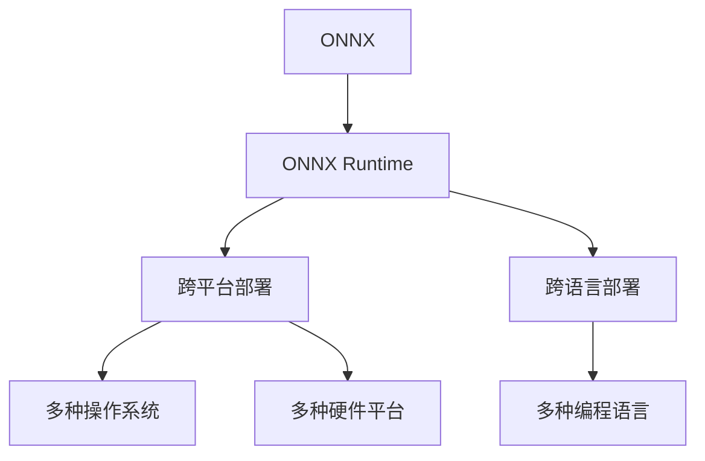

                 

## 1. 背景介绍

在人工智能（AI）和机器学习（ML）领域，部署是一个至关重要的环节，它确保了模型能够被有效地应用到生产环境中，从而实现实际的业务价值。随着AI技术的不断发展，模型复杂度和性能要求越来越高，对于模型部署的效率和灵活性也提出了更高的要求。

### 1.1 问题由来

在传统的AI模型部署中，开发人员需要手动编写代码，将模型加载到特定的硬件平台上，并进行优化和测试，以确保模型能够稳定地运行。这个过程繁琐且容易出错，尤其是在处理多种不同的硬件平台和操作系统时，更是增加了部署的复杂性。

为了应对这一挑战，ONNX（Open Neural Network Exchange）应运而生。ONNX是一个模型格式标准，旨在提供一种跨平台、跨语言的模型交换格式，使得开发者能够更加灵活地部署AI模型。然而，尽管ONNX解决了模型格式统一的问题，模型的部署仍然存在诸多挑战。

### 1.2 问题核心关键点

对于模型部署的挑战，核心在于如何实现跨平台、跨语言的模型推理，同时保证模型的性能和稳定性。为了解决这一问题，ONNX Runtime应运而生。ONNX Runtime是一个高性能的模型推理引擎，支持多种硬件平台和操作系统，能够显著简化模型的部署过程，并提高推理效率。

## 2. 核心概念与联系

### 2.1 核心概念概述

为更好地理解ONNX Runtime部署，本节将介绍几个密切相关的核心概念：

- **ONNX**：一种模型交换标准，提供了一种通用的模型描述语言，支持多种深度学习框架（如TensorFlow、PyTorch等）到ONNX的转换。
- **ONNX Runtime**：ONNX Runtime是一个高性能的模型推理引擎，支持多种硬件平台和操作系统，能够实现跨平台、跨语言的模型推理。
- **模型部署**：将训练好的模型从开发环境部署到生产环境的过程，确保模型能够稳定、高效地运行。
- **跨平台**：指模型能够在不同的操作系统、硬件平台（如CPU、GPU、FPGA等）上正常工作。
- **跨语言**：指模型能够在多种编程语言（如Python、C++、Java等）之间进行无缝交换和调用。

这些核心概念之间的逻辑关系可以通过以下Mermaid流程图来展示：



这个流程图展示了大语言模型的核心概念及其之间的关系：

1. ONNX定义了统一的模型描述语言，是实现跨平台、跨语言模型推理的基础。
2. ONNX Runtime基于ONNX标准，提供了跨平台、跨语言的模型推理能力。
3. 跨平台部署和跨语言部署是ONNX Runtime的主要应用场景。
4. 跨平台和跨语言部署支持多种操作系统和硬件平台，使模型能够在不同的环境中运行。

## 3. 核心算法原理 & 具体操作步骤

### 3.1 算法原理概述

ONNX Runtime的部署过程主要涉及以下几个关键步骤：

1. **模型转换**：将不同深度学习框架的模型转换为ONNX格式。
2. **模型加载**：将ONNX模型加载到ONNX Runtime引擎中。
3. **模型推理**：通过ONNX Runtime引擎对模型进行推理计算，生成推理结果。
4. **结果输出**：将推理结果以多种形式（如Tensor、数组、文件等）输出到目标平台。

### 3.2 算法步骤详解

以下是ONNX Runtime部署的具体步骤：

1. **选择目标平台和环境**：根据实际应用需求，选择目标操作系统和硬件平台。
2. **准备ONNX模型**：将训练好的模型转换为ONNX格式，使用支持ONNX的深度学习框架（如TensorFlow、PyTorch等）进行模型转换。
3. **安装ONNX Runtime**：根据目标平台，从官网下载并安装ONNX Runtime。
4. **模型加载与推理**：使用ONNX Runtime提供的API，将ONNX模型加载到引擎中，进行推理计算。
5. **结果处理与输出**：根据具体应用场景，处理并输出推理结果。

### 3.3 算法优缺点

ONNX Runtime部署的优点包括：

- **跨平台**：支持多种操作系统和硬件平台，降低了部署的复杂性和成本。
- **跨语言**：支持多种编程语言，提高了开发效率和灵活性。
- **性能优化**：基于ONNX的标准化，提供了高效的推理引擎，提升了模型性能。
- **兼容性强**：支持多种深度学习框架，减少了模型转换的难度。

其缺点在于：

- **学习曲线**：需要开发者掌握ONNX和ONNX Runtime的使用，有一定学习成本。
- **性能损耗**：在模型转换过程中，可能存在一定的性能损耗。
- **资源需求**：对于大规模模型，可能需要较高的计算资源。

### 3.4 算法应用领域

ONNX Runtime部署在多个领域中得到了广泛应用，例如：

- **自动驾驶**：支持多种传感器数据处理和模型推理，实现车辆自主驾驶。
- **医疗影像**：支持医学影像的快速处理和分析，提升诊断效率。
- **金融风控**：支持海量交易数据的实时分析，提供风险预警。
- **智能客服**：支持自然语言处理和模型推理，提升客户服务质量。
- **安防监控**：支持实时视频处理和目标检测，提高安全监控能力。

## 4. 数学模型和公式 & 详细讲解

### 4.1 数学模型构建

在ONNX Runtime部署中，主要涉及以下数学模型和公式：

1. **模型表示**：将深度学习模型转换为ONNX表示，定义模型输入和输出，并使用ONNX的模型操作和算子。
2. **数据流图**：将模型的前向传播过程表示为数据流图，每个节点表示一个操作或算子，数据在节点间流动。

### 4.2 公式推导过程

以下是一个简单的公式推导示例，假设我们要对一个线性模型进行ONNX表示：

\[
y = wx + b
\]

其中，\(w\)为权重矩阵，\(b\)为偏置向量，\(x\)为输入向量，\(y\)为输出向量。

1. **模型转换为ONNX格式**：
   \[
   \text{graph} {
     %0 = Constant[value={w},dtype=1:T{1x2}] : Tensor
     %1 = Constant[value={b},dtype=1:T{1}] : Tensor
     %2 = MatMul[input=%0,other=%1] : Tensor
     %3 = Add[input=%2,other=%1] : Tensor
     output = %3 : Tensor
   }
   \]

2. **数据流图表示**：
   \[
   \begin{array}{l}
   \text{input} \rightarrow \text{MatMul} \rightarrow \text{Add} \rightarrow \text{output} \\
   \text{weight} \rightarrow \text{MatMul} \rightarrow \text{Add} \rightarrow \text{output} \\
   \text{bias} \rightarrow \text{Add} \rightarrow \text{output} \\
   \end{array}
   \]

### 4.3 案例分析与讲解

以一个简单的图像分类模型为例，进行ONNX部署的详细分析：

1. **模型转换**：使用ONNX工具将TensorFlow模型转换为ONNX格式。
2. **加载模型**：在ONNX Runtime引擎中加载ONNX模型，并设置输入输出节点。
3. **推理计算**：输入图像数据，通过ONNX Runtime引擎进行推理计算，生成分类结果。
4. **结果输出**：将推理结果输出为分类标签，并可视化为图像。

## 5. 项目实践：代码实例和详细解释说明

### 5.1 开发环境搭建

为了进行ONNX Runtime部署，我们需要以下开发环境：

1. **安装Python**：从官网下载并安装Python 3.x版本。
2. **安装ONNX**：使用pip安装ONNX库。
3. **安装ONNX Runtime**：根据目标平台，从官网下载并安装ONNX Runtime。
4. **安装依赖库**：安装必要的依赖库，如TensorFlow、PyTorch等。

### 5.2 源代码详细实现

以下是一个简单的图像分类模型ONNX部署的代码示例：

```python
import onnxruntime as ort
import numpy as np
import cv2

# 加载ONNX模型
sess = ort.InferenceSession('model.onnx')

# 准备输入图像数据
img = cv2.imread('image.jpg')
img = cv2.resize(img, (224, 224))
img = img.transpose((2, 0, 1)).astype(np.float32) / 255.0
img = np.expand_dims(img, axis=0)

# 进行推理计算
output = sess.run(None, {'input_0': img})

# 输出结果
print(output[0][0])
```

### 5.3 代码解读与分析

让我们详细解读一下关键代码的实现细节：

**ONNX Runtime加载**：使用`ort.InferenceSession`加载ONNX模型，并创建推理会话。

**输入图像处理**：使用OpenCV加载图像数据，并进行预处理，包括尺寸调整、通道转换和归一化。

**推理计算**：使用`sess.run`进行模型推理，将处理后的图像数据作为输入。

**结果输出**：将推理结果打印输出，通常需要根据具体任务进行后处理和可视化。

## 6. 实际应用场景

### 6.1 智能安防监控

ONNX Runtime部署在智能安防监控中，可以实现实时视频处理和目标检测，提高监控系统的智能性和安全性。具体应用包括：

- **人脸识别**：通过深度学习模型，实现人脸检测和识别，提升监控效率。
- **行为分析**：分析视频中的人物行为，识别异常行为并进行预警。
- **车牌识别**：识别视频中的车牌信息，提供实时交通管理数据。

### 6.2 自动驾驶

在自动驾驶领域，ONNX Runtime部署可以支持多种传感器数据处理和模型推理，实现车辆自主驾驶。具体应用包括：

- **激光雷达数据处理**：处理激光雷达数据，提取关键特征，用于路径规划和避障。
- **摄像头数据处理**：处理摄像头数据，进行目标检测和行为预测，提升驾驶安全性。
- **深度学习模型推理**：通过深度学习模型进行决策和控制，实现车辆自主导航。

### 6.3 医疗影像分析

在医疗影像分析中，ONNX Runtime部署可以实现医学影像的快速处理和分析，提升诊断效率。具体应用包括：

- **图像分割**：使用深度学习模型，实现医学影像的自动分割，提取关键区域。
- **病灶检测**：检测影像中的病灶，提供诊断支持。
- **三维重建**：对医学影像进行三维重建，提升影像的可视化和理解能力。

### 6.4 未来应用展望

未来，ONNX Runtime部署将在更多领域得到应用，为各行各业带来变革性影响：

- **智能制造**：支持智能生产线的优化和监控，提升生产效率和质量。
- **智慧城市**：支持智能交通、智能能源、智能环保等多个方面，提升城市管理智能化水平。
- **教育培训**：支持在线教育、智能考试、个性化学习等多个应用，提升教育效果和体验。

## 7. 工具和资源推荐

### 7.1 学习资源推荐

为了帮助开发者掌握ONNX Runtime部署的理论基础和实践技巧，以下是一些优质的学习资源：

1. **ONNX官方文档**：ONNX官网提供详细的文档，包括ONNX和ONNX Runtime的使用指南和API参考。
2. **TensorFlow onnx教程**：TensorFlow官网提供详细的ONNX转换教程，介绍如何将TensorFlow模型转换为ONNX格式。
3. **PyTorch onnx教程**：PyTorch官网提供详细的ONNX转换教程，介绍如何将PyTorch模型转换为ONNX格式。
4. **ONNX Runtime官方博客**：ONNX Runtime官网提供丰富的博客和案例，介绍ONNX Runtime部署的最佳实践和性能优化技巧。
5. **ONNX Runtime用户手册**：ONNX Runtime提供详细的用户手册，涵盖部署、调优、监控等多个方面。

通过对这些资源的学习实践，相信你一定能够快速掌握ONNX Runtime部署的精髓，并用于解决实际的AI模型部署问题。

### 7.2 开发工具推荐

高效的开发离不开优秀的工具支持。以下是几款用于ONNX Runtime部署开发的常用工具：

1. **ONNX**：用于模型转换和验证的工具，支持多种深度学习框架到ONNX的转换。
2. **ONNX Runtime**：ONNX Runtime引擎，支持跨平台、跨语言的模型推理。
3. **TensorBoard**：用于模型监控和可视化的工具，支持ONNX Runtime模型的调试和分析。
4. **Jupyter Notebook**：用于开发和测试的Jupyter Notebook环境，支持Python代码和图像数据处理。
5. **AWS SageMaker**：Amazon提供的云端AI平台，支持ONNX Runtime模型的部署和调优。

合理利用这些工具，可以显著提升ONNX Runtime部署的开发效率，加快创新迭代的步伐。

### 7.3 相关论文推荐

ONNX Runtime部署在AI领域已经得到了广泛的研究和应用。以下是几篇奠基性的相关论文，推荐阅读：

1. **ONNX: A Format for Machine Learning Models**：介绍ONNX模型格式的标准化及其应用。
2. **ONNX Runtime: A Portable Deep Learning Inference Engine**：介绍ONNX Runtime引擎及其部署和优化技术。
3. **ONNX-TensorRT: Deploy Deep Learning Models with TensorRT**：介绍ONNX和TensorRT的结合，提升模型的推理性能。
4. **ONNXifi: Portable Deep Learning Inference on Embedded Devices**：介绍ONNXi，提升ONNX Runtime在嵌入式设备上的性能。
5. **TensorRT onnx-tensorrt: A Deep Learning Inference Acceleration Solution**：介绍TensorRT在ONNX上的应用，提升模型推理性能。

这些论文代表了大语言模型微调技术的发展脉络。通过学习这些前沿成果，可以帮助研究者把握学科前进方向，激发更多的创新灵感。

## 8. 总结：未来发展趋势与挑战

### 8.1 总结

本文对ONNX Runtime部署进行了全面系统的介绍。首先阐述了ONNX Runtime部署的背景和意义，明确了其在跨平台、跨语言模型推理中的重要地位。其次，从原理到实践，详细讲解了ONNX Runtime部署的数学原理和关键步骤，给出了ONNX部署任务开发的完整代码实例。同时，本文还广泛探讨了ONNX Runtime部署在智能安防、自动驾驶、医疗影像等多个领域的应用前景，展示了ONNX Runtime部署的巨大潜力。此外，本文精选了ONNX Runtime部署的各类学习资源，力求为读者提供全方位的技术指引。

通过本文的系统梳理，可以看到，ONNX Runtime部署在实现跨平台、跨语言模型推理中具有显著优势，为AI模型落地应用提供了重要的技术支撑。未来，伴随ONNX Runtime部署的持续演进，相信AI技术将在更多领域大放异彩，深刻影响人类的生产生活方式。

### 8.2 未来发展趋势

展望未来，ONNX Runtime部署将呈现以下几个发展趋势：

1. **性能优化**：随着硬件和算法的不断进步，ONNX Runtime的推理性能将进一步提升，支持更大规模、更复杂的模型。
2. **边缘计算支持**：支持在边缘设备（如手机、物联网设备等）上进行推理计算，提升计算效率和隐私保护。
3. **自动化部署**：引入自动化部署工具，简化模型的部署过程，降低开发门槛。
4. **跨平台兼容性**：支持更多硬件平台和操作系统，提升模型的部署灵活性。
5. **跨语言支持**：支持更多编程语言，提升模型的开发效率。

这些趋势凸显了ONNX Runtime部署的广阔前景。这些方向的探索发展，必将进一步提升AI技术的部署效率和性能，为构建人机协同的智能时代提供新的技术支撑。

### 8.3 面临的挑战

尽管ONNX Runtime部署已经取得了一定的进展，但在迈向更加智能化、普适化应用的过程中，它仍面临着诸多挑战：

1. **性能瓶颈**：对于大规模模型，推理性能可能成为瓶颈，需要进一步优化推理引擎和计算图。
2. **兼容性问题**：不同深度学习框架和硬件平台的兼容性问题，需要进一步解决。
3. **资源消耗**：对于复杂模型，推理过程中可能存在较大的资源消耗，需要进一步优化模型和推理算法。
4. **可解释性不足**：部分模型推理过程缺乏可解释性，难以满足特定领域的需求。
5. **安全性问题**：模型可能存在安全漏洞，需要进一步提升模型的安全性。

### 8.4 研究展望

面对ONNX Runtime部署所面临的挑战，未来的研究需要在以下几个方面寻求新的突破：

1. **模型压缩与优化**：开发更加高效、轻量级的推理引擎，支持更大规模的模型。
2. **自动化部署工具**：开发自动化部署工具，简化模型的部署过程，降低开发门槛。
3. **跨平台兼容性**：进一步提升ONNX Runtime在多种硬件平台和操作系统上的兼容性。
4. **可解释性增强**：引入可解释性技术，提升模型的可解释性和可审计性。
5. **安全保障**：开发安全保障机制，提升模型的安全性。

这些研究方向的探索，必将引领ONNX Runtime部署技术迈向更高的台阶，为构建安全、可靠、可解释、可控的智能系统铺平道路。面向未来，ONNX Runtime部署技术还需要与其他人工智能技术进行更深入的融合，如知识表示、因果推理、强化学习等，多路径协同发力，共同推动AI技术的发展。只有勇于创新、敢于突破，才能不断拓展AI模型的边界，让智能技术更好地造福人类社会。

## 9. 附录：常见问题与解答

**Q1: ONNX Runtime支持哪些深度学习框架？**

A: ONNX Runtime支持多种深度学习框架，包括TensorFlow、PyTorch、Caffe2等。使用相应的转换工具，可以将这些框架的模型转换为ONNX格式，并在ONNX Runtime中加载和使用。

**Q2: 如何使用ONNX Runtime进行边缘计算？**

A: 可以使用ONNX Runtime的Edge inferencing service，将模型部署到边缘设备上，如手机、物联网设备等，以实现低延迟、高效率的推理计算。

**Q3: 如何优化ONNX Runtime的推理性能？**

A: 可以采用模型压缩、优化推理图、使用硬件加速等方法，提升ONNX Runtime的推理性能。同时，需要根据具体的硬件平台和推理任务，进行针对性的优化和调优。

**Q4: 如何增强ONNX Runtime模型的可解释性？**

A: 可以使用可解释性技术，如LIME、SHAP等，对ONNX Runtime模型进行解释和分析，提升模型的可解释性和可审计性。

**Q5: 如何提升ONNX Runtime模型的安全性？**

A: 可以使用安全保护技术，如模型水印、访问控制等，提升模型的安全性。同时，需要定期进行安全审计和风险评估，确保模型的安全性和合规性。

---

作者：禅与计算机程序设计艺术 / Zen and the Art of Computer Programming

