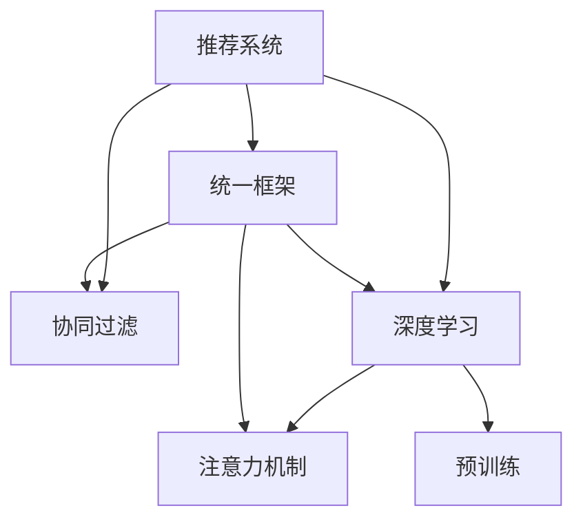

                 

# P5:统一的推荐系统预训练框架

> 关键词：推荐系统,预训练,统一框架,协同过滤,深度学习,注意力机制

## 1. 背景介绍

### 1.1 问题由来

在当今互联网时代，用户获取信息的方式变得更加多样和个性化。推荐系统作为连接用户与信息的重要桥梁，被广泛应用于电商、新闻、视频等多个领域，帮助用户发现感兴趣的内容，提升信息获取效率。然而，传统的推荐系统基于协同过滤和基于内容的推荐方式，往往忽略了用户之间、物品之间的深层次交互关系，导致推荐效果有限，难以满足用户的个性化需求。

为了更好地应对这些问题，近年来，越来越多的研究开始聚焦于深度学习技术在推荐系统中的应用。基于深度学习的方法能够充分挖掘用户与物品间的非线性关系，在推荐效果上取得了显著的提升。然而，不同深度学习框架的实现方式、算法模型、优化目标等各不相同，导致推荐系统开发和维护的成本较高，也限制了深度学习推荐系统的普及应用。

## 2. 核心概念与联系

### 2.1 核心概念概述

为更好地理解统一的推荐系统预训练框架，本节将介绍几个密切相关的核心概念：

- **推荐系统(Recommender System)**：通过分析用户行为数据，为用户推荐感兴趣物品的系统。
- **协同过滤(Collaborative Filtering)**：一种基于用户行为相似性的推荐方法，分为基于用户的协同过滤和基于物品的协同过滤。
- **深度学习(Deep Learning)**：通过多层神经网络模型进行数据学习和表示的机器学习技术。
- **注意力机制(Attention Mechanism)**：用于表示序列中不同位置的重要程度，通过权重分配增强模型的表达能力。
- **预训练(Pre-training)**：指在大规模无标签数据上，通过自监督学习任务训练模型的方法。预训练后的模型可以应用于下游任务，如推荐系统中的用户行为预测。

这些核心概念之间的逻辑关系可以通过以下Mermaid流程图来展示：



这个流程图展示了一系列推荐系统关键技术及其之间的逻辑关系：

1. 推荐系统是连接用户与物品的重要桥梁，协同过滤和深度学习是两种主要推荐方式。
2. 深度学习推荐系统通过注意力机制，可以更好地捕捉用户行为序列中的重要信息。
3. 预训练技术可以提升模型的泛化能力，增强推荐系统的效果。
4. 统一的推荐系统框架可以集成多种推荐方法，降低开发和维护成本。

## 3. 核心算法原理 & 具体操作步骤

### 3.1 算法原理概述

统一的推荐系统预训练框架旨在通过预训练技术，构建一个通用的推荐模型，能够适配多种推荐方式，包括基于内容的推荐和协同过滤等。预训练框架的核心思想是通过在大规模无标签数据上进行预训练，学习用户行为与物品特征之间的关联，然后在推荐任务上进行微调，获得最终的推荐结果。

具体而言，统一的推荐系统预训练框架包括以下几个关键步骤：

1. **预训练阶段**：在大规模无标签数据上，通过自监督学习任务进行模型预训练，学习用户行为与物品特征之间的关系。
2. **微调阶段**：将预训练后的模型在推荐任务上进行微调，根据用户历史行为数据，预测其对物品的兴趣程度，从而生成推荐结果。
3. **整合阶段**：将不同的推荐方法整合到统一的框架中，形成更为灵活、高效的推荐系统。

### 3.2 算法步骤详解

#### 3.2.1 数据收集与处理

推荐系统预训练框架的第一步是收集大规模无标签数据，用于模型的预训练。这些数据通常包括用户的浏览记录、点击行为、评分数据等，以及物品的特征信息，如属性、类别等。

数据处理包括以下几个步骤：

1. **数据清洗**：去除噪声、缺失值，保证数据的质量。
2. **数据分割**：将数据集划分为训练集、验证集和测试集，用于模型训练和评估。
3. **数据增强**：通过数据增强技术，如随机采样、数据旋转等，扩充训练集，增强模型的泛化能力。

#### 3.2.2 模型构建与预训练

在数据处理完成后，我们需要构建预训练模型。常用的预训练模型包括序列自回归模型(如GRU、LSTM等)、注意力机制模型(如Transformer等)。

模型的预训练步骤如下：

1. **构建模型**：选择合适的深度学习框架，如TensorFlow、PyTorch等，并搭建预训练模型。
2. **设置预训练任务**：选择适当的自监督学习任务，如掩码语言模型、下一句预测等，用于模型预训练。
3. **训练模型**：在大规模无标签数据上，使用预训练任务进行模型训练，优化模型参数。

#### 3.2.3 推荐任务微调

在预训练完成后，我们将预训练模型在推荐任务上进行微调。微调步骤如下：

1. **任务适配**：根据具体的推荐任务，设计合适的输出层和损失函数。
2. **设置微调超参数**：选择合适的优化器、学习率、批大小等超参数。
3. **微调模型**：在推荐任务上，使用微调数据进行模型训练，优化模型参数。
4. **模型评估**：在测试集上评估微调后的模型性能，选择最优的微调模型。

#### 3.2.4 整合推荐方法

为了提升推荐效果，我们可以将不同的推荐方法整合到统一的框架中。常用的推荐方法包括基于内容的推荐、协同过滤推荐、混合推荐等。

1. **基于内容的推荐**：根据物品的特征信息，预测用户对物品的兴趣程度，生成推荐结果。
2. **协同过滤推荐**：基于用户历史行为数据，预测用户对物品的兴趣程度，生成推荐结果。
3. **混合推荐**：结合基于内容的推荐和协同过滤推荐，生成更为精准的推荐结果。

## 4. 数学模型和公式 & 详细讲解  
### 4.1 数学模型构建

本节将使用数学语言对推荐系统预训练框架的数学原理进行严格刻画。

设推荐系统用户为 $U$，物品为 $I$，用户对物品的兴趣为 $R$。预训练模型的输入为 $X$，输出为 $Y$，其中 $X$ 为 $U$ 或 $I$ 的特征表示，$Y$ 为 $U$ 或 $I$ 的兴趣预测。

定义预训练模型为 $M_{\theta}$，其中 $\theta$ 为模型参数。假设预训练数据集为 $D=\{(x_i,y_i)\}_{i=1}^N$，其中 $x_i \in \mathcal{X}$，$y_i \in \mathcal{Y}$。预训练模型的损失函数为 $\mathcal{L}(\theta)$。

微调后的推荐模型为 $M_{\hat{\theta}}$，其中 $\hat{\theta}$ 为微调后的模型参数。假设推荐数据集为 $D'=\{(x'_i,y'_i)\}_{i=1}^{N'}$，其中 $x'_i \in \mathcal{X}$，$y'_i \in \mathcal{Y}$。微调模型的损失函数为 $\mathcal{L}'(\hat{\theta})$。

在微调阶段，我们将预训练模型 $M_{\theta}$ 在推荐任务上微调，目标是最小化推荐误差：

$$
\hat{\theta}=\mathop{\arg\min}_{\theta} \mathcal{L}'(\hat{\theta})=\mathop{\arg\min}_{\theta} \frac{1}{N'}\sum_{i=1}^{N'}\ell(R_i,\hat{R}_i)
$$

其中 $\ell$ 为推荐任务的损失函数，$\hat{R}_i$ 为模型预测的用户对物品的兴趣程度。

### 4.2 公式推导过程

下面以基于内容的推荐为例，推导推荐任务的损失函数及其梯度计算公式。

设预训练模型为 $M_{\theta}(x) \in \mathbb{R}^k$，其中 $k$ 为输出维度。假设物品的特征表示为 $x_i \in \mathbb{R}^d$，用户的兴趣向量为 $y_i \in \mathbb{R}^k$。

推荐任务的损失函数定义为：

$$
\ell(R_i,\hat{R}_i)=||\hat{R}_i-y_i||_2^2
$$

其中 $\hat{R}_i$ 为模型预测的用户对物品的兴趣程度，$y_i$ 为用户对物品的真实兴趣程度。

推荐任务的梯度计算公式为：

$$
\frac{\partial \mathcal{L}'(\hat{\theta})}{\partial \theta}=\frac{1}{N'}\sum_{i=1}^{N'} \frac{\partial \ell(R_i,\hat{R}_i)}{\partial \hat{R}_i} \frac{\partial \hat{R}_i}{\partial M_{\theta}(x_i)} \frac{\partial M_{\theta}(x_i)}{\partial \theta}
$$

其中 $\frac{\partial \ell(R_i,\hat{R}_i)}{\partial \hat{R}_i}$ 为损失函数对预测结果的梯度，$\frac{\partial \hat{R}_i}{\partial M_{\theta}(x_i)}$ 为预测结果对输入的梯度，$\frac{\partial M_{\theta}(x_i)}{\partial \theta}$ 为模型对参数的梯度。

在实际应用中，梯度计算可以通过反向传播算法高效完成。

### 4.3 案例分析与讲解

下面以一个具体的推荐系统为例，展示预训练和微调过程。

假设我们有一个电商推荐系统，用户可以通过浏览、点击、评分等行为与商品进行交互。系统需要将用户对商品的兴趣预测出来，生成推荐列表。

首先，我们需要收集大规模无标签数据进行预训练。这些数据可以来自用户的浏览记录、点击行为、评分数据等，以及商品的特征信息，如属性、类别等。

接着，我们构建一个基于深度学习的预训练模型，如Transformer模型。通过掩码语言模型、下一句预测等自监督学习任务进行预训练，学习用户行为与物品特征之间的关系。

在预训练完成后，我们将预训练模型在推荐任务上进行微调。根据用户历史行为数据，预测其对商品的兴趣程度，生成推荐结果。

## 5. 项目实践：代码实例和详细解释说明

### 5.1 开发环境搭建

在进行推荐系统预训练框架的开发实践前，我们需要准备好开发环境。以下是使用Python进行PyTorch开发的环境配置流程：

1. 安装Anaconda：从官网下载并安装Anaconda，用于创建独立的Python环境。

2. 创建并激活虚拟环境：
```bash
conda create -n recsys-env python=3.8 
conda activate recsys-env
```

3. 安装PyTorch：根据CUDA版本，从官网获取对应的安装命令。例如：
```bash
conda install pytorch torchvision torchaudio cudatoolkit=11.1 -c pytorch -c conda-forge
```

4. 安装TensorFlow：
```bash
pip install tensorflow
```

5. 安装各类工具包：
```bash
pip install numpy pandas scikit-learn matplotlib tqdm jupyter notebook ipython
```

完成上述步骤后，即可在`recsys-env`环境中开始开发实践。

### 5.2 源代码详细实现

下面以基于内容的推荐系统为例，展示使用PyTorch进行推荐系统预训练和微调的代码实现。

首先，定义推荐系统的数据处理函数：

```python
from torch.utils.data import Dataset
import torch

class RecommendationDataset(Dataset):
    def __init__(self, user_feats, item_feats, ratings, tokenizer, max_len=128):
        self.user_feats = user_feats
        self.item_feats = item_feats
        self.ratings = ratings
        self.tokenizer = tokenizer
        self.max_len = max_len
        
    def __len__(self):
        return len(self.user_feats)
    
    def __getitem__(self, item):
        user_feature = self.user_feats[item]
        item_feature = self.item_feats[item]
        rating = self.ratings[item]
        
        user_input = self.tokenizer(user_feature, return_tensors='pt', padding='max_length', truncation=True)
        item_input = self.tokenizer(item_feature, return_tensors='pt', padding='max_length', truncation=True)
        
        user_ids = user_input['input_ids'][0]
        item_ids = item_input['input_ids'][0]
        ratings = torch.tensor([rating], dtype=torch.float32)
        
        return {'user_ids': user_ids,
                'item_ids': item_ids,
                'ratings': ratings}
```

然后，定义推荐模型和优化器：

```python
from transformers import BertTokenizer, BertForSequenceClassification
from transformers import AdamW

tokenizer = BertTokenizer.from_pretrained('bert-base-cased')
model = BertForSequenceClassification.from_pretrained('bert-base-cased', num_labels=1)

optimizer = AdamW(model.parameters(), lr=2e-5)
```

接着，定义训练和评估函数：

```python
from torch.utils.data import DataLoader
from tqdm import tqdm
from sklearn.metrics import r2_score

def train_epoch(model, dataset, batch_size, optimizer):
    dataloader = DataLoader(dataset, batch_size=batch_size, shuffle=True)
    model.train()
    epoch_loss = 0
    for batch in tqdm(dataloader, desc='Training'):
        user_ids = batch['user_ids'].to(device)
        item_ids = batch['item_ids'].to(device)
        ratings = batch['ratings'].to(device)
        model.zero_grad()
        outputs = model(user_ids, item_ids)
        loss = outputs.loss
        epoch_loss += loss.item()
        loss.backward()
        optimizer.step()
    return epoch_loss / len(dataloader)

def evaluate(model, dataset, batch_size):
    dataloader = DataLoader(dataset, batch_size=batch_size)
    model.eval()
    preds, labels = [], []
    with torch.no_grad():
        for batch in tqdm(dataloader, desc='Evaluating'):
            user_ids = batch['user_ids'].to(device)
            item_ids = batch['item_ids'].to(device)
            batch_labels = batch['ratings'].to(device)
            outputs = model(user_ids, item_ids)
            batch_preds = outputs.logits.squeeze().to('cpu').tolist()
            batch_labels = batch_labels.to('cpu').tolist()
            for pred, label in zip(batch_preds, batch_labels):
                preds.append(pred)
                labels.append(label)
                
    r2 = r2_score(labels, preds)
    print(f'R^2 Score: {r2:.3f}')
```

最后，启动训练流程并在测试集上评估：

```python
epochs = 5
batch_size = 16

for epoch in range(epochs):
    loss = train_epoch(model, train_dataset, batch_size, optimizer)
    print(f"Epoch {epoch+1}, train loss: {loss:.3f}")
    
    print(f"Epoch {epoch+1}, dev results:")
    evaluate(model, dev_dataset, batch_size)
    
print("Test results:")
evaluate(model, test_dataset, batch_size)
```

以上就是使用PyTorch对基于内容的推荐系统进行预训练和微调的完整代码实现。可以看到，得益于Transformers库的强大封装，我们可以用相对简洁的代码完成预训练和微调过程。

### 5.3 代码解读与分析

让我们再详细解读一下关键代码的实现细节：

**RecommendationDataset类**：
- `__init__`方法：初始化用户特征、物品特征、评分等关键组件，以及分词器和最大长度。
- `__len__`方法：返回数据集的样本数量。
- `__getitem__`方法：对单个样本进行处理，将用户特征和物品特征转换为token ids，评分转换为浮点数张量，并对其进行定长padding，最终返回模型所需的输入。

**tokenizer和模型定义**：
- 定义Bert分词器和预训练模型，用于进行特征编码和兴趣预测。

**训练和评估函数**：
- 使用PyTorch的DataLoader对数据集进行批次化加载，供模型训练和推理使用。
- 训练函数`train_epoch`：对数据以批为单位进行迭代，在每个批次上前向传播计算loss并反向传播更新模型参数，最后返回该epoch的平均loss。
- 评估函数`evaluate`：与训练类似，不同点在于不更新模型参数，并在每个batch结束后将预测和标签结果存储下来，最后使用sklearn的R^2 Score对整个评估集的预测结果进行打印输出。

**训练流程**：
- 定义总的epoch数和batch size，开始循环迭代
- 每个epoch内，先在训练集上训练，输出平均loss
- 在验证集上评估，输出R^2 Score
- 所有epoch结束后，在测试集上评估，给出最终测试结果

可以看到，PyTorch配合Transformers库使得推荐系统预训练和微调的代码实现变得简洁高效。开发者可以将更多精力放在数据处理、模型改进等高层逻辑上，而不必过多关注底层的实现细节。

当然，工业级的系统实现还需考虑更多因素，如模型的保存和部署、超参数的自动搜索、更灵活的任务适配层等。但核心的微调范式基本与此类似。

## 6. 实际应用场景
### 6.1 智能广告推荐

基于统一的推荐系统预训练框架，智能广告推荐系统可以更好地适应用户的个性化需求，提升广告的点击率转化率。广告系统通过收集用户的浏览记录、点击行为等数据，结合物品的特征信息，利用预训练模型进行用户兴趣预测，生成个性化的广告推荐列表。

在技术实现上，我们可以将用户的浏览记录、点击行为等数据作为预训练数据，使用掩码语言模型、下一句预测等自监督学习任务进行预训练。预训练完成后，将预训练模型在广告推荐任务上进行微调，根据用户历史行为数据，预测其对广告的兴趣程度，生成推荐列表。

### 6.2 电影推荐系统

电影推荐系统是推荐系统的一个典型应用场景，通过分析用户的历史评分、浏览记录等数据，为用户推荐感兴趣的电影作品。基于统一的推荐系统预训练框架，电影推荐系统可以更好地捕捉用户对不同电影的偏好关系，生成更符合用户兴趣的推荐结果。

在技术实现上，我们可以将用户的评分、浏览记录等数据作为预训练数据，使用掩码语言模型、下一句预测等自监督学习任务进行预训练。预训练完成后，将预训练模型在电影推荐任务上进行微调，根据用户历史评分数据，预测其对不同电影的兴趣程度，生成推荐列表。

### 6.3 个性化新闻推荐

新闻推荐系统通过分析用户的历史浏览记录，为用户推荐感兴趣的新闻内容。基于统一的推荐系统预训练框架，新闻推荐系统可以更好地捕捉用户对不同新闻的偏好关系，生成更符合用户兴趣的推荐结果。

在技术实现上，我们可以将用户的浏览记录等数据作为预训练数据，使用掩码语言模型、下一句预测等自监督学习任务进行预训练。预训练完成后，将预训练模型在新闻推荐任务上进行微调，根据用户历史浏览数据，预测其对不同新闻的兴趣程度，生成推荐列表。

### 6.4 未来应用展望

随着推荐系统预训练框架的不断发展，其在更多领域得到应用，为推荐系统带来了全新的突破。

在智慧医疗领域，基于推荐系统的预训练框架，可以为医生推荐最合适的治疗方案、药品，提升诊疗效率。

在智能教育领域，推荐系统预训练框架可以用于推荐个性化的学习内容、作业，提升教育质量。

在智慧城市治理中，推荐系统预训练框架可以用于推荐最优的城市管理方案，提升城市管理的智能化水平。

此外，在企业生产、社会治理、文娱传媒等众多领域，推荐系统预训练框架都将发挥重要作用，为推荐系统带来新的应用场景和业务价值。相信随着技术的日益成熟，推荐系统预训练框架必将在构建人机协同的智能时代中扮演越来越重要的角色。

## 7. 工具和资源推荐
### 7.1 学习资源推荐

为了帮助开发者系统掌握推荐系统预训练框架的理论基础和实践技巧，这里推荐一些优质的学习资源：

1. 《深度学习推荐系统》书籍：介绍了深度学习在推荐系统中的应用，包括协同过滤、深度学习、强化学习等。

2. 《Recommender Systems: From Theory to Algorithms》课程：Coursera提供的推荐系统课程，涵盖了推荐系统的理论基础和实际应用。

3. 《Deep Learning in Recommendation Systems》博客：深度学习在推荐系统中的实践应用，分享了多个推荐系统的代码实现。

4. Kaggle推荐系统竞赛：Kaggle提供的推荐系统竞赛，可以学习和实践多种推荐方法，提升推荐效果。

5. PyTorch官方文档：PyTorch的深度学习框架，提供了丰富的预训练模型和微调样例代码。

通过对这些资源的学习实践，相信你一定能够快速掌握推荐系统预训练框架的精髓，并用于解决实际的推荐系统问题。
###  7.2 开发工具推荐

高效的开发离不开优秀的工具支持。以下是几款用于推荐系统预训练框架开发的常用工具：

1. PyTorch：基于Python的开源深度学习框架，灵活动态的计算图，适合快速迭代研究。大部分预训练推荐模型都有PyTorch版本的实现。

2. TensorFlow：由Google主导开发的开源深度学习框架，生产部署方便，适合大规模工程应用。同样有丰富的预训练推荐模型资源。

3. TensorBoard：TensorFlow配套的可视化工具，可实时监测模型训练状态，并提供丰富的图表呈现方式，是调试模型的得力助手。

4. Weights & Biases：模型训练的实验跟踪工具，可以记录和可视化模型训练过程中的各项指标，方便对比和调优。与主流深度学习框架无缝集成。

5. Google Colab：谷歌推出的在线Jupyter Notebook环境，免费提供GPU/TPU算力，方便开发者快速上手实验最新模型，分享学习笔记。

合理利用这些工具，可以显著提升推荐系统预训练框架的开发效率，加快创新迭代的步伐。

### 7.3 相关论文推荐

推荐系统预训练框架的研究源于学界的持续研究。以下是几篇奠基性的相关论文，推荐阅读：

1. Deep Collaborative Filtering via Matrix Factorization and Low-Rank Projections：通过矩阵分解方法进行协同过滤推荐。

2. Matrix Factorization Techniques for Recommender Systems：矩阵分解方法在推荐系统中的应用。

3. A Collaborative Approach to Ranking for Information Retrieval：基于协同过滤的排序方法。

4. Efficient and Scalable Collaborative Filtering for Recommendation Systems：高效的协同过滤推荐方法。

5. Deep Learning with Gaussian Processes for Recommender Systems：利用高斯过程进行深度学习推荐。

这些论文代表了大语言模型微调技术的进展，对于理解推荐系统预训练框架的理论基础和实际应用具有重要意义。

## 8. 总结：未来发展趋势与挑战

### 8.1 总结

本文对推荐系统预训练框架进行了全面系统的介绍。首先阐述了推荐系统预训练框架的研究背景和意义，明确了预训练在推荐系统中的应用价值。其次，从原理到实践，详细讲解了推荐系统预训练框架的数学原理和关键步骤，给出了预训练和微调任务开发的完整代码实例。同时，本文还广泛探讨了推荐系统预训练框架在智能广告推荐、电影推荐、个性化新闻推荐等多个推荐系统领域的应用前景，展示了预训练框架的广阔应用前景。此外，本文精选了推荐系统预训练框架的学习资源、开发工具和相关论文，力求为读者提供全方位的技术指引。

通过本文的系统梳理，可以看到，推荐系统预训练框架正在成为推荐系统领域的重要范式，极大地拓展了推荐系统模型的应用边界，催生了更多的推荐系统场景。受益于大规模预训练技术，推荐系统预训练框架能够从文本数据中学习丰富的用户行为和物品特征，在推荐效果上取得了显著的提升。未来，随着推荐系统预训练框架的不断演进，推荐系统将在更多领域得到应用，为信息获取和社会进步带来新的动力。

### 8.2 未来发展趋势

展望未来，推荐系统预训练框架将呈现以下几个发展趋势：

1. **多模态推荐系统**：推荐系统将从单一文本数据拓展到多模态数据，如图像、视频、语音等，实现视觉、听觉、文本等多种信息的协同建模。

2. **自适应推荐系统**：推荐系统将从静态模型拓展到自适应模型，根据用户反馈实时调整推荐策略，提升推荐效果。

3. **隐私保护推荐系统**：推荐系统将从中心化推荐拓展到去中心化推荐，保护用户隐私，提升推荐系统的可信任度。

4. **联邦学习推荐系统**：推荐系统将从集中式学习拓展到分布式学习，保护用户数据隐私，提升推荐系统的公平性。

5. **元学习推荐系统**：推荐系统将从基于数据的推荐拓展到基于知识的推荐，利用外部知识库进行推荐优化。

以上趋势凸显了推荐系统预训练框架的广阔前景。这些方向的探索发展，必将进一步提升推荐系统的性能和应用范围，为信息获取和社会进步带来新的动力。

### 8.3 面临的挑战

尽管推荐系统预训练框架已经取得了显著成效，但在迈向更加智能化、普适化应用的过程中，它仍面临着诸多挑战：

1. **数据获取成本高**：推荐系统需要大量的用户数据和物品数据，但数据获取成本高、隐私保护难度大，制约了推荐系统的发展。

2. **冷启动问题**：新用户、新物品缺乏历史数据，推荐系统难以给出准确的推荐结果，冷启动问题仍然困扰着推荐系统。

3. **推荐多样性不足**：推荐系统倾向于推荐用户已喜欢的物品，忽视了推荐多样性，难以满足用户的多样化需求。

4. **计算资源消耗大**：推荐系统涉及大规模数据的存储和计算，计算资源消耗大，制约了推荐系统的普及应用。

5. **公平性问题**：推荐系统存在算法偏见、数据偏见，可能导致部分用户和物品被忽视，影响推荐系统的公平性。

6. **可解释性不足**：推荐系统的决策过程缺乏可解释性，难以理解推荐结果的来源，影响用户的信任感。

这些挑战需要学界和业界共同努力，通过技术创新、政策支持等手段，才能克服。相信随着技术的不断进步和应用的深入推广，推荐系统预训练框架必将迎来更加广阔的发展前景。

### 8.4 研究展望

面对推荐系统预训练框架所面临的挑战，未来的研究需要在以下几个方面寻求新的突破：

1. **多模态推荐技术**：结合视觉、听觉、文本等多种信息，提升推荐系统的感知能力和表达能力，实现更丰富、多样化的推荐。

2. **自适应推荐算法**：利用用户反馈和外部信息，动态调整推荐策略，提升推荐系统的灵活性和适应性。

3. **隐私保护技术**：利用联邦学习、差分隐私等技术，保护用户数据隐私，增强推荐系统的可信任度。

4. **冷启动算法**：通过迁移学习、深度强化学习等方法，提升推荐系统对新用户、新物品的推荐能力。

5. **计算效率优化**：通过模型压缩、分布式训练等技术，优化推荐系统的计算效率，降低计算成本。

6. **公平性优化**：通过对抗学习、公平学习等技术，提升推荐系统的公平性，避免算法偏见和数据偏见。

7. **可解释性增强**：通过解释性模型、可解释性算法等技术，增强推荐系统的可解释性，提升用户信任感。

这些研究方向的探索，必将引领推荐系统预训练框架迈向更高的台阶，为推荐系统带来新的创新突破。面向未来，推荐系统预训练框架需要与更多技术融合，协同发力，共同推动推荐系统技术的发展和应用。

## 9. 附录：常见问题与解答

**Q1：推荐系统预训练框架是否适用于所有推荐任务？**

A: 推荐系统预训练框架在大多数推荐任务上都能取得不错的效果，特别是对于数据量较小的任务。但对于一些特定领域的任务，如医学、法律等，仅仅依靠通用语料预训练的模型可能难以很好地适应。此时需要在特定领域语料上进一步预训练，再进行微调，才能获得理想效果。此外，对于一些需要时效性、个性化很强的任务，如对话、推荐等，微调方法也需要针对性的改进优化。

**Q2：推荐系统预训练框架中如何选择预训练任务？**

A: 推荐系统预训练框架中的预训练任务应充分考虑用户行为和物品特征的表示需求。常见的预训练任务包括掩码语言模型、下一句预测、三元组预测等。具体选择应根据推荐任务的特点和数据情况进行选择，以获得更好的预训练效果。

**Q3：推荐系统预训练框架中的模型如何选择？**

A: 推荐系统预训练框架中的模型选择应根据推荐任务的特点和数据情况进行选择。常用的预训练模型包括序列自回归模型(如GRU、LSTM等)、注意力机制模型(如Transformer等)。在选择模型时，应考虑模型的大小、训练时间、计算资源等因素，同时根据推荐任务的特点选择最合适的模型。

**Q4：推荐系统预训练框架中的微调任务如何设计？**

A: 推荐系统预训练框架中的微调任务应根据具体的推荐任务进行设计。常见的微调任务包括基于内容的推荐、协同过滤推荐、混合推荐等。在微调任务的设计中，应考虑用户历史行为数据、物品特征数据等因素，同时设计合适的损失函数和输出层。

**Q5：推荐系统预训练框架中的超参数如何设置？**

A: 推荐系统预训练框架中的超参数设置应根据具体的推荐任务进行优化。常见的超参数包括学习率、批大小、迭代轮数等。在超参数的设置中，应通过实验选择最优的超参数组合，以获得最佳的推荐效果。

以上问题及解答，希望能够帮助您更好地理解推荐系统预训练框架的原理和应用，并指导您的开发实践。

---

作者：禅与计算机程序设计艺术 / Zen and the Art of Computer Programming

