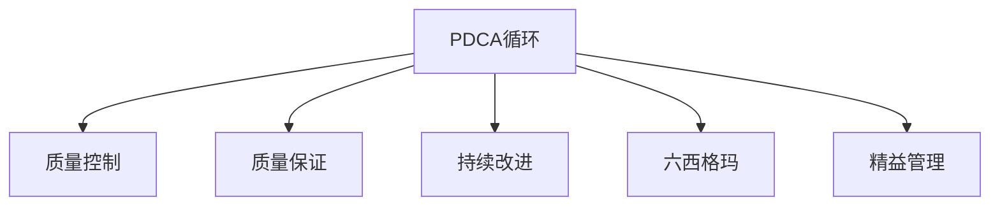

                 

# PDCA循环与持续改进管理

> 关键词：PDCA, 持续改进, 质量管理, 流程优化, 业务运营

## 1. 背景介绍

### 1.1 问题由来
在企业运营中，持续改进是确保产品质量和竞争力的关键。传统上，企业往往采用线性流程的方式来管理项目和业务流程，这种方法效率低下，且难以应对快速变化的市场需求。为了应对这些挑战，质量管理专家提出了一种更为灵活、高效的管理方法——PDCA循环（Plan-Do-Check-Act Cycle）。

PDCA循环是一种持续改进的流程方法，它通过不断重复计划、执行、检查和改进的步骤，实现业务流程的优化和质量的提升。该方法源于美国统计学家Shewhart提出的方法论，由戴明（W. Edwards Deming）在20世纪50年代推广开来。PDCA循环已成为现代质量管理的基础，广泛应用在制造业、服务业、软件开发等多个领域。

### 1.2 问题核心关键点
PDCA循环的核心理念是通过不断的迭代优化，实现业务流程的持续改进。其核心关键点包括：
1. 计划（Plan）：设定目标和计划，明确改进方向和行动方案。
2. 执行（Do）：按照计划执行，实施改进措施。
3. 检查（Check）：评估执行结果，分析问题和改进点。
4. 改进（Act）：总结经验教训，制定下一轮改进计划。

PDCA循环的核心在于其循环迭代的特点，通过不断的PDCA循环，业务流程不断优化，质量和效率不断提升。PDCA循环强调了在改进过程中不断学习和反思的重要性，为企业带来了持续进步的动力。

## 2. 核心概念与联系

### 2.1 核心概念概述

为更好地理解PDCA循环的工作原理，本节将介绍几个密切相关的核心概念：

- PDCA循环（Plan-Do-Check-Act Cycle）：持续改进的流程方法，通过不断重复PDCA四步，实现业务流程的优化和质量的提升。
- 质量控制（Quality Control）：通过设定质量标准、监控和评估质量过程，确保产品或服务达到预定质量水平。
- 质量保证（Quality Assurance）：通过系统化的管理方法，确保组织内的质量体系能够持续运行，达到质量目标。
- 持续改进（Continuous Improvement）：通过不断的改进和优化，不断提升产品和服务的质量。
- 六西格玛（Six Sigma）：以减少产品或服务缺陷率为目标的质量管理方法。
- 精益管理（Lean Management）：通过消除浪费，实现流程优化和资源高效利用。

这些核心概念之间的逻辑关系可以通过以下Mermaid流程图来展示：



这个流程图展示了一系列的持续改进方法，通过PDCA循环为核心，与质量控制、质量保证、持续改进、六西格玛和精益管理等方法相互补充，形成一个完整的质量管理体系。

## 3. 核心算法原理 & 具体操作步骤
### 3.1 算法原理概述

PDCA循环的原理在于通过不断的迭代，实现业务流程的持续改进。其核心在于四步循环：

1. **计划（Plan）**：设定目标和计划，明确改进方向和行动方案。
2. **执行（Do）**：按照计划执行，实施改进措施。
3. **检查（Check）**：评估执行结果，分析问题和改进点。
4. **改进（Act）**：总结经验教训，制定下一轮改进计划。

PDCA循环的核心思想是“不断试错，不断改进”，通过不断的PDCA循环，逐步逼近最优解决方案。该方法能够适应快速变化的市场需求，确保企业能够持续优化其业务流程。

### 3.2 算法步骤详解

PDCA循环的具体操作步骤如下：

#### 步骤1：计划（Plan）
- **目标设定**：明确改进目标，确保目标具体、可量化、可实现。
- **流程设计**：设计改进方案，包括步骤、责任人、时间表等。
- **资源准备**：准备所需的资源，如人力、资金、设备等。

#### 步骤2：执行（Do）
- **实施方案**：按照设计好的流程执行，确保每个步骤都按照计划进行。
- **记录过程**：详细记录执行过程中的每个步骤和关键数据。
- **问题反馈**：及时收集执行过程中的问题反馈，进行初步处理。

#### 步骤3：检查（Check）
- **结果评估**：对执行结果进行评估，检查是否达到了预期目标。
- **问题分析**：分析执行过程中的问题和偏差，找出根本原因。
- **数据收集**：收集相关数据，为后续改进提供依据。

#### 步骤4：改进（Act）
- **经验总结**：总结执行过程中的经验和教训，形成改进方案。
- **修正方案**：根据分析结果，修正改进方案，制定下一轮PDCA循环计划。
- **重新执行**：执行修正后的改进方案，进入下一轮PDCA循环。

通过不断的PDCA循环，企业能够逐步优化其业务流程，提高产品质量和效率。

### 3.3 算法优缺点

PDCA循环的优点包括：
1. **灵活性**：能够应对快速变化的市场需求，灵活调整改进方案。
2. **系统性**：通过PDCA循环，形成一个系统的质量管理体系。
3. **持续改进**：通过不断的PDCA循环，实现业务的持续优化。
4. **数据驱动**：通过收集和分析数据，确保改进方案的科学性和有效性。

PDCA循环的缺点包括：
1. **复杂性**：在大型组织中，PDCA循环可能变得复杂，管理成本较高。
2. **执行难度**：执行PDCA循环需要高水平的项目管理能力和执行力。
3. **资源需求**：需要大量的资源投入，包括人力、资金、设备等。
4. **时间成本**：PDCA循环的每个循环需要一定的时间，可能影响业务的即时性。

尽管存在这些局限性，但PDCA循环仍是现代质量管理的基础，广泛应用于各行各业，为持续改进提供了有力的方法论支持。

### 3.4 算法应用领域

PDCA循环在多个领域都有广泛的应用，具体包括：

- **制造业**：通过PDCA循环，优化生产流程，提高产品质量，降低生产成本。
- **服务业**：通过PDCA循环，提升客户服务质量，增强客户满意度。
- **软件开发**：通过PDCA循环，优化软件开发流程，提高软件质量和开发效率。
- **医疗健康**：通过PDCA循环，提升医疗服务质量，保障患者安全。
- **教育培训**：通过PDCA循环，提升教学质量，提高学生学习效果。
- **政府公共管理**：通过PDCA循环，优化公共服务流程，提升政府效率。

这些应用领域展示了PDCA循环的广泛适用性，证明了其作为持续改进方法的巨大价值。

## 4. 数学模型和公式 & 详细讲解 & 举例说明

### 4.1 数学模型构建

PDCA循环的数学模型主要涉及质量控制和统计分析等概念。假设企业有一个产品的质量标准 $Q_s$ 和当前的质量水平 $Q_c$，PDCA循环的数学模型可以表示为：

1. **目标设定**：
   - 设定的质量目标 $Q_t = Q_s$
2. **执行**：
   - 执行改进方案后的质量水平 $Q_e = Q_c + \Delta Q$
3. **检查**：
   - 检查结果 $Q_a = Q_e$
4. **改进**：
   - 修正后的质量水平 $Q_n = Q_a + \Delta Q_{act}$

其中，$\Delta Q$ 表示执行改进方案后的质量变化量，$\Delta Q_{act}$ 表示实际改进后的质量变化量。

### 4.2 公式推导过程

为了更好地理解PDCA循环的数学模型，我们可以通过以下步骤进行推导：

1. **目标设定**：
   - $Q_t = Q_s$
2. **执行**：
   - $Q_e = Q_c + \Delta Q$
   - $\Delta Q = k \cdot P$
     - $k$ 表示改进方案的效果系数，$P$ 表示改进方案的具体措施。
3. **检查**：
   - $Q_a = Q_e$
4. **改进**：
   - $Q_n = Q_a + \Delta Q_{act}$
   - $\Delta Q_{act} = k_{act} \cdot P_{act}$
     - $k_{act}$ 表示实际改进方案的效果系数，$P_{act}$ 表示实际改进方案的具体措施。

通过上述推导，我们可以看到PDCA循环的数学模型主要涉及目标设定、执行、检查和改进四个步骤，每个步骤都通过具体的数学公式描述。

### 4.3 案例分析与讲解

假设一个制造企业希望通过PDCA循环提高其产品的质量水平。具体步骤如下：

1. **目标设定**：企业希望将产品的质量水平提升至行业标准 $Q_s = 98\%$。
2. **执行**：企业决定通过优化生产流程、提高原材料质量等措施，设定改进方案 $P = 0.1$。
3. **检查**：在实施改进方案后，实际测量的产品质量水平为 $Q_e = 92\%$。
4. **改进**：根据实际结果，企业决定进一步优化改进方案，设定 $P_{act} = 0.15$。
5. **重新执行**：在新的改进方案下，再次测量产品质量水平，结果为 $Q_n = 97\%$。

通过上述PDCA循环，企业成功将产品质量水平提升至行业标准，展示了PDCA循环的实际应用效果。

## 5. 项目实践：代码实例和详细解释说明
### 5.1 开发环境搭建

在进行PDCA循环的实践时，我们需要准备相应的开发环境。以下是使用Python和Jupyter Notebook进行PDCA循环实践的开发环境配置流程：

1. 安装Anaconda：从官网下载并安装Anaconda，用于创建独立的Python环境。
2. 创建并激活虚拟环境：
```bash
conda create -n pdca-env python=3.8 
conda activate pdca-env
```
3. 安装必要的Python库：
```bash
conda install numpy pandas matplotlib jupyter notebook
```
4. 安装Jupyter Notebook：
```bash
conda install jupyterlab
```

完成上述步骤后，即可在`pdca-env`环境中开始PDCA循环的实践。

### 5.2 源代码详细实现

下面是使用Python实现PDCA循环的基本框架，以制造业的流程优化为例：

```python
import pandas as pd
import numpy as np

class PDCA:
    def __init__(self, Q_s, Q_c, P):
        self.Q_s = Q_s
        self.Q_c = Q_c
        self.P = P
        self.Q_e = self.Q_c + self.P
        self.Q_a = self.Q_e
        self.Q_n = self.Q_a
    
    def execute(self, P_act):
        self.Q_e = self.Q_c + P_act
        self.Q_a = self.Q_e
        self.Q_n = self.Q_a
        return self.Q_n
    
    def check(self, Q_s):
        self.Q_a = self.Q_e
        self.Q_n = self.Q_a
        if self.Q_n >= self.Q_s:
            return True
        else:
            return False
    
    def improve(self, P_act):
        self.Q_e = self.Q_c + P_act
        self.Q_a = self.Q_e
        self.Q_n = self.Q_a
        return self.Q_n
    
    def process(self):
        P_act = self.P
        while True:
            Q_s = 98 # 假设的行业标准
            self.Q_e = self.Q_c + P_act
            self.Q_a = self.Q_e
            self.Q_n = self.Q_a
            if self.check(Q_s):
                break
            else:
                P_act = self.P + 0.1 # 逐步增加改进措施
                self.Q_e = self.Q_c + P_act
                self.Q_a = self.Q_e
                self.Q_n = self.Q_a
        return self.Q_n
```

### 5.3 代码解读与分析

让我们再详细解读一下关键代码的实现细节：

**PDCA类**：
- `__init__`方法：初始化PDCA循环的参数，设定质量目标 $Q_s$、当前质量水平 $Q_c$、改进方案 $P$。
- `execute`方法：执行改进方案，根据执行结果更新质量水平。
- `check`方法：检查质量水平是否达到目标，如果达到则返回True，否则返回False。
- `improve`方法：根据检查结果调整改进方案，更新质量水平。
- `process`方法：实现PDCA循环的整个过程，循环执行直到质量水平达到目标。

**代码示例**：
- 在实际应用中，可以创建一个PDCA对象，调用 `process` 方法进行PDCA循环的实践。

## 6. 实际应用场景
### 6.1 制造业

制造业是PDCA循环的典型应用场景之一。在制造业中，PDCA循环被广泛应用于生产流程的优化和质量控制。具体来说，PDCA循环可以帮助制造企业实现以下几个目标：

- **降低生产成本**：通过持续改进，优化生产流程，减少浪费，降低生产成本。
- **提高产品质量**：通过质量控制和持续改进，提升产品质量，满足客户需求。
- **提升生产效率**：通过流程优化和资源配置，提高生产效率，缩短生产周期。

在实际应用中，制造企业可以通过以下步骤进行PDCA循环的实践：

1. **计划（Plan）**：
   - 设定生产目标，如降低生产成本、提高产品质量、提升生产效率。
   - 设计改进方案，如优化生产流程、改进设备、提高员工技能等。
   - 准备资源，如人力、资金、设备等。

2. **执行（Do）**：
   - 实施改进方案，如优化设备、调整生产工艺、培训员工等。
   - 记录生产过程中的关键数据，如生产时间、生产成本、产品质量等。
   - 收集问题反馈，如设备故障、生产异常等。

3. **检查（Check）**：
   - 评估生产结果，检查是否达到了预期目标。
   - 分析问题原因，找出改进点。
   - 收集相关数据，如生产效率、产品质量、生产成本等。

4. **改进（Act）**：
   - 总结经验教训，形成改进方案。
   - 修正改进方案，制定下一轮PDCA循环计划。
   - 重新执行改进方案，进入下一轮PDCA循环。

通过不断的PDCA循环，制造企业能够逐步优化其生产流程，提升产品质量和效率，降低生产成本，保持竞争优势。

### 6.2 软件开发

软件开发是PDCA循环的另一个重要应用场景。在软件开发中，PDCA循环被广泛应用于项目管理、代码优化和需求管理等方面。具体来说，PDCA循环可以帮助软件开发团队实现以下几个目标：

- **提高代码质量**：通过持续改进，优化代码结构，减少代码缺陷，提高代码质量。
- **加速开发进程**：通过流程优化和资源配置，加速软件开发进程，缩短开发周期。
- **增强软件可维护性**：通过持续改进，增强软件可维护性，降低维护成本。

在实际应用中，软件开发团队可以通过以下步骤进行PDCA循环的实践：

1. **计划（Plan）**：
   - 设定开发目标，如提高代码质量、加速开发进程、增强软件可维护性。
   - 设计改进方案，如优化开发流程、改进工具、提高团队技能等。
   - 准备资源，如人力、资金、开发工具等。

2. **执行（Do）**：
   - 实施改进方案，如优化开发流程、引入新工具、培训团队等。
   - 记录开发过程中的关键数据，如开发时间、代码质量、开发成本等。
   - 收集问题反馈，如代码缺陷、开发瓶颈等。

3. **检查（Check）**：
   - 评估开发结果，检查是否达到了预期目标。
   - 分析问题原因，找出改进点。
   - 收集相关数据，如开发效率、代码质量、开发成本等。

4. **改进（Act）**：
   - 总结经验教训，形成改进方案。
   - 修正改进方案，制定下一轮PDCA循环计划。
   - 重新执行改进方案，进入下一轮PDCA循环。

通过不断的PDCA循环，软件开发团队能够逐步优化其开发流程，提高代码质量，加速开发进程，增强软件可维护性，提升项目成功率。

### 6.3 政府公共管理

政府公共管理是PDCA循环的另一个重要应用场景。在政府公共管理中，PDCA循环被广泛应用于公共服务流程的优化和绩效管理等方面。具体来说，PDCA循环可以帮助政府实现以下几个目标：

- **提高服务质量**：通过持续改进，优化公共服务流程，提升服务质量。
- **增强政府效率**：通过流程优化和资源配置，增强政府效率，提高公共服务水平。
- **满足民众需求**：通过持续改进，满足民众需求，增强民众满意度。

在实际应用中，政府可以通过以下步骤进行PDCA循环的实践：

1. **计划（Plan）**：
   - 设定服务目标，如提高服务质量、增强政府效率、满足民众需求。
   - 设计改进方案，如优化服务流程、提高服务效率、增强民众参与等。
   - 准备资源，如人力、资金、技术等。

2. **执行（Do）**：
   - 实施改进方案，如优化服务流程、引入新技术、增强民众参与等。
   - 记录服务过程中的关键数据，如服务质量、服务效率、民众满意度等。
   - 收集问题反馈，如服务问题、民众投诉等。

3. **检查（Check）**：
   - 评估服务结果，检查是否达到了预期目标。
   - 分析问题原因，找出改进点。
   - 收集相关数据，如服务质量、服务效率、民众满意度等。

4. **改进（Act）**：
   - 总结经验教训，形成改进方案。
   - 修正改进方案，制定下一轮PDCA循环计划。
   - 重新执行改进方案，进入下一轮PDCA循环。

通过不断的PDCA循环，政府能够逐步优化其公共服务流程，提高服务质量，增强政府效率，满足民众需求，提升公共服务水平。

## 7. 工具和资源推荐
### 7.1 学习资源推荐

为了帮助开发者系统掌握PDCA循环的理论基础和实践技巧，这里推荐一些优质的学习资源：

1. **《PDCA循环与持续改进管理》书籍**：系统介绍PDCA循环的基本概念、理论基础和实际应用。
2. **Coursera《质量管理与持续改进》课程**：斯坦福大学开设的质量管理课程，涵盖PDCA循环的基本概念和实际应用。
3. **MindTools《PDCA循环》网站**：提供详细的PDCA循环操作步骤和案例分析。
4. **Six Sigma官方网站**：提供六西格玛方法和PDCA循环的详细介绍和实践指南。
5. **Lean Management官方网站**：提供精益管理方法和PDCA循环的详细介绍和实践指南。

通过学习这些资源，相信你一定能够快速掌握PDCA循环的理论基础和实践技巧，并在实际应用中取得良好的效果。

### 7.2 开发工具推荐

高效的开发离不开优秀的工具支持。以下是几款用于PDCA循环开发常用的工具：

1. **Microsoft Visio**：用于绘制PDCA循环流程图，帮助清晰地展示PDCA循环的步骤和关系。
2. **Excel**：用于记录和分析PDCA循环中的关键数据，帮助进行数据分析和改进。
3. **JIRA**：用于管理PDCA循环中的任务和进度，帮助进行项目管理。
4. **GitLab**：用于协作开发PDCA循环相关的代码和文档，帮助进行版本控制和代码管理。
5. **Tableau**：用于进行PDCA循环中的数据分析和可视化，帮助进行数据分析和决策支持。

合理利用这些工具，可以显著提升PDCA循环的开发效率，加快创新迭代的步伐。

### 7.3 相关论文推荐

PDCA循环的研究源于学界的持续研究。以下是几篇奠基性的相关论文，推荐阅读：

1. **PDCA循环的起源和发展**：介绍PDCA循环的历史背景和基本原理。
2. **PDCA循环在制造业中的应用**：探讨PDCA循环在制造业中的实际应用案例。
3. **PDCA循环在软件开发中的应用**：探讨PDCA循环在软件开发中的实际应用案例。
4. **PDCA循环在政府公共管理中的应用**：探讨PDCA循环在政府公共管理中的实际应用案例。

这些论文代表了大循环的演进历程，展示了PDCA循环在各个领域的广泛应用。通过学习这些前沿成果，可以帮助研究者把握学科前进方向，激发更多的创新灵感。

## 8. 总结：未来发展趋势与挑战
### 8.1 总结

本文对PDCA循环的概念和实践进行了全面系统的介绍。首先阐述了PDCA循环的基本概念和核心理念，明确了PDCA循环在持续改进中的重要价值。其次，从理论到实践，详细讲解了PDCA循环的数学模型和操作步骤，给出了PDCA循环实践的完整代码实例。同时，本文还广泛探讨了PDCA循环在制造业、软件开发、政府公共管理等多个领域的应用前景，展示了PDCA循环的广泛适用性。

通过本文的系统梳理，可以看到，PDCA循环作为持续改进的方法，具有广泛的适应性和实用价值。它不仅适用于制造业等传统行业，还能在软件开发、政府公共管理等新兴领域发挥重要作用。未来的PDCA循环将不断进化，与更多现代管理方法相结合，为企业的持续改进提供更强大的工具和方法论支持。

### 8.2 未来发展趋势

展望未来，PDCA循环将呈现以下几个发展趋势：

1. **智能化**：引入人工智能技术，如机器学习、深度学习等，优化PDCA循环的执行过程，提高改进效率。
2. **数字化**：借助大数据和云计算技术，实现PDCA循环的数字化管理，提高数据驱动决策能力。
3. **跨部门协同**：加强跨部门协作，实现PDCA循环的跨部门协同管理，提高组织效率。
4. **全球化**：在全球化背景下，引入国际标准和最佳实践，提升PDCA循环的全球适应性。
5. **持续优化**：通过持续优化和改进，实现PDCA循环的不断升级，适应快速变化的市场需求。

这些趋势将使PDCA循环更加智能化、数字化、协同化、全球化和持续优化，进一步提升PDCA循环的应用价值和实际效果。

### 8.3 面临的挑战

尽管PDCA循环具有广泛的适用性和实用价值，但在实施过程中仍面临诸多挑战：

1. **复杂性**：在大型组织中，PDCA循环可能变得复杂，管理成本较高。
2. **执行力**：PDCA循环的执行需要高水平的项目管理能力和执行力。
3. **资源需求**：需要大量的资源投入，包括人力、资金、设备等。
4. **时间成本**：PDCA循环的每个循环需要一定的时间，可能影响业务的即时性。
5. **数据依赖**：PDCA循环的改进效果依赖于准确的数据收集和分析。

尽管存在这些挑战，但通过科学的管理和有效的实施，PDCA循环仍然能够发挥其持续改进的作用，帮助企业实现持续进步。

### 8.4 研究展望

面对PDCA循环面临的挑战，未来的研究需要在以下几个方面寻求新的突破：

1. **数据驱动**：开发更加智能化的数据分析和可视化工具，提升PDCA循环的数据驱动决策能力。
2. **跨部门协同**：加强跨部门协作，建立协同管理的机制和平台，提高组织效率。
3. **持续优化**：开发持续优化的算法和工具，实现PDCA循环的自动化和智能化。
4. **全球化**：引入国际标准和最佳实践，提升PDCA循环的全球适应性。
5. **智能化**：结合人工智能技术，优化PDCA循环的执行过程，提高改进效率。

这些研究方向的探索，必将引领PDCA循环向更高层次发展，为企业的持续改进提供更强大的工具和方法论支持。面向未来，PDCA循环需要与其他现代管理方法相结合，共同推动企业的持续进步和创新发展。

## 9. 附录：常见问题与解答

**Q1：PDCA循环是否适用于所有行业？**

A: PDCA循环适用于大多数行业，特别是那些需要进行持续改进和优化的领域。但在某些特殊领域，如医疗、金融等，可能需要进行额外的改进和优化。

**Q2：PDCA循环的执行难度如何？**

A: PDCA循环的执行难度较大，需要高水平的项目管理能力和执行力。但通过科学的计划和执行，PDCA循环的改进效果显著，值得投入时间和资源。

**Q3：PDCA循环是否适合小型企业？**

A: PDCA循环对小型企业同样适用，可以从小规模项目开始，逐步扩展应用范围，提升企业的持续改进能力。

**Q4：PDCA循环的周期多长？**

A: PDCA循环的周期因企业规模和复杂度而异，通常建议每个循环周期为3-6个月，确保改进效果的可持续性。

**Q5：PDCA循环的改进效果如何衡量？**

A: PDCA循环的改进效果通常通过关键绩效指标（KPI）来衡量，如产品质量、生产效率、客户满意度等。

---

作者：禅与计算机程序设计艺术 / Zen and the Art of Computer Programming

