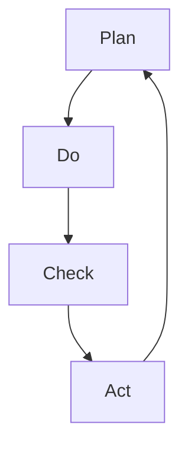

                 

# PDCA戴明环:行动落地的法宝

> 关键词：PDCA循环,戴明环,持续改进,过程管理,质量控制,项目管理

## 1. 背景介绍

在快速发展的现代企业环境中，PDCA（Plan-Do-Check-Act）戴明环已成为推动组织持续改进和提升效率的核心工具。PDCA循环，以美国质量管理专家W. Edwards Deming命名的戴明环，是一种结构化、系统化的管理方法，旨在通过不断循环迭代，逐步提升组织的工作效率和质量。PDCA不仅广泛应用于制造业质量控制，还广泛应用于软件开发、项目管理、产品管理等多个领域。

PDCA环由四个基本阶段组成：计划（Plan）、执行（Do）、检查（Check）和行动（Act）。通过PDCA循环，组织可以系统地识别问题、制定解决方案、实施改进措施，并持续监控和调整，实现业务目标的达成。

在本文中，我们将深入探讨PDCA戴明环的原理、操作步骤、优缺点、应用领域，并通过案例分析详细讲解如何应用PDCA循环进行项目管理和质量控制。

## 2. 核心概念与联系

### 2.1 核心概念概述

为了更好地理解PDCA循环，我们首先介绍几个关键概念：

- **PDCA循环（Plan-Do-Check-Act）**：一种系统化的管理方法，通过不断循环迭代，逐步提升工作质量。PDCA环由计划、执行、检查和行动四个阶段组成。
- **戴明环**：PDCA循环以美国质量管理专家W. Edwards Deming命名，强调了持续改进和质量控制的重要性。
- **持续改进（Continuous Improvement）**：通过不断的PDCA循环，逐步优化工作流程和产品质量，提升组织效率和竞争力。
- **过程管理（Process Management）**：通过系统化的方法，监控和管理业务过程，确保过程的稳定性和高效性。
- **质量控制（Quality Control）**：通过建立标准和规范，监控和评估业务活动的过程和结果，确保产品质量符合预期。

这些概念之间存在紧密的联系，共同构成了PDCA戴明环的基石。

### 2.2 核心概念原理和架构的 Mermaid 流程图



这个流程图展示了PDCA环的基本结构和流程。计划阶段确定目标和方案，执行阶段实施方案，检查阶段评估效果，行动阶段总结和改进，整个流程不断循环迭代。

## 3. 核心算法原理 & 具体操作步骤

### 3.1 算法原理概述

PDCA循环的核心理念是通过持续的改进和反馈，逐步优化业务过程和结果。其基本原理可以概括为以下几个方面：

1. **计划阶段**：明确目标和方案，制定详细的行动计划。
2. **执行阶段**：按照计划执行任务，落实行动方案。
3. **检查阶段**：评估执行效果，识别问题和不足。
4. **行动阶段**：总结经验教训，制定改进措施，持续优化。

PDCA循环强调通过不断的PDCA循环，逐步提升工作质量和效率。

### 3.2 算法步骤详解

PDCA循环的具体操作步骤如下：

**Step 1: 计划阶段**
- 定义目标：明确改进目标和期望成果。
- 制定方案：基于当前现状和目标，制定详细的改进方案。
- 资源准备：确保执行方案所需的人力、物力和时间。

**Step 2: 执行阶段**
- 实施行动：按照计划执行方案，落实各项任务。
- 记录数据：记录执行过程中的各项关键数据和指标。
- 问题处理：及时处理执行过程中遇到的问题和障碍。

**Step 3: 检查阶段**
- 效果评估：评估执行结果，识别问题和不足。
- 数据分析：分析关键数据，找出改进点。
- 总结经验：总结执行过程中的成功经验和教训。

**Step 4: 行动阶段**
- 制定改进措施：根据评估结果，制定具体的改进措施。
- 实施改进：落实改进措施，调整执行方案。
- 再次计划：根据新的目标和问题，制定新的计划，进入下一轮PDCA循环。

通过PDCA循环的四个阶段，组织可以系统地识别问题、制定解决方案、实施改进措施，并持续监控和调整，实现业务目标的达成。

### 3.3 算法优缺点

**优点：**
- **系统化管理**：通过PDCA循环，组织可以系统地管理业务过程，确保过程的稳定性和高效性。
- **持续改进**：通过不断的PDCA循环，逐步优化工作流程和产品质量，提升组织效率和竞争力。
- **灵活性**：PDCA循环可以根据实际情况灵活调整，适应不同的业务需求。

**缺点：**
- **复杂性**：PDCA循环涉及多个阶段和步骤，操作复杂，需要较高的管理水平。
- **资源消耗**：执行PDCA循环需要大量的人力和时间投入，特别是数据收集和分析环节。
- **可能过度依赖工具**：部分组织可能会过度依赖工具和技术，忽视了人的因素和管理策略。

### 3.4 算法应用领域

PDCA循环在各个领域都有广泛的应用，以下是一些典型的应用场景：

- **制造业**：通过PDCA循环，逐步提升生产流程的质量和效率，减少废品率，提升客户满意度。
- **软件开发**：通过PDCA循环，逐步优化软件开发流程，提升代码质量和软件性能，减少缺陷。
- **项目管理**：通过PDCA循环，逐步提升项目管理效率，控制项目进度和成本，确保项目成功交付。
- **产品管理**：通过PDCA循环，逐步优化产品设计和开发流程，提升产品质量和用户满意度。
- **质量管理**：通过PDCA循环，逐步提升质量管理体系，确保产品和服务符合标准和规范。

PDCA循环在多个领域的应用，展示了其强大的生命力和实用性。

## 4. 数学模型和公式 & 详细讲解 & 举例说明

### 4.1 数学模型构建

在PDCA循环中，我们可以引入一些数学模型来辅助分析和决策。

假设某项改进任务的目标是减少产品的缺陷率。我们可以建立以下数学模型：

- 设定初始缺陷率为 $D_0$。
- 改进后的期望缺陷率为 $D_f$。
- 计划阶段设定改进措施 $X$。
- 执行阶段执行改进措施后，缺陷率变化为 $D_1$。

### 4.2 公式推导过程

根据PDCA循环的四个阶段，我们可以推导出以下公式：

1. **计划阶段**：
   $$
   X = f(D_0, D_f)
   $$
   其中 $f$ 为改进措施与期望目标的关系函数。

2. **执行阶段**：
   $$
   D_1 = g(X, D_0)
   $$
   其中 $g$ 为执行措施后缺陷率的变化函数。

3. **检查阶段**：
   $$
   \Delta D = D_1 - D_f
   $$
   其中 $\Delta D$ 为实际效果与期望目标的偏差。

4. **行动阶段**：
   $$
   D_2 = h(\Delta D, D_f)
   $$
   其中 $h$ 为根据偏差调整期望目标的函数。

### 4.3 案例分析与讲解

假设某软件公司希望通过PDCA循环提升产品质量，减少缺陷率。

**计划阶段**：
- 目标：将缺陷率从20%减少到10%。
- 措施：引入自动化测试工具，优化代码审查流程。

**执行阶段**：
- 实施措施后，缺陷率降低到15%。

**检查阶段**：
- 实际效果为15%，与期望目标10%存在偏差5%。

**行动阶段**：
- 调整措施：增加代码审查的频次，引入更严格的代码规范。
- 改进后的期望缺陷率为8%。

通过PDCA循环，软件公司逐步优化产品质量，提升了客户满意度。

## 5. 项目实践：代码实例和详细解释说明

### 5.1 开发环境搭建

在进行PDCA实践前，我们需要准备好开发环境。以下是使用Python进行项目管理的环境配置流程：

1. 安装Anaconda：从官网下载并安装Anaconda，用于创建独立的Python环境。

2. 创建并激活虚拟环境：
```bash
conda create -n pdca-env python=3.8 
conda activate pdca-env
```

3. 安装必要的工具包：
```bash
pip install pandas numpy matplotlib jupyter notebook ipython scikit-learn tqdm
```

完成上述步骤后，即可在`pdca-env`环境中开始PDCA实践。

### 5.2 源代码详细实现

下面以项目质量改进为例，给出使用Python进行PDCA实践的代码实现。

```python
import pandas as pd
import numpy as np
import matplotlib.pyplot as plt

# 定义数据集
data = pd.DataFrame({
    '缺陷率': [20, 15, 8],
    '期望目标': [10, 8, 5]
})

# 计算偏差
delta = data['缺陷率'] - data['期望目标']

# 绘制偏差图
plt.figure(figsize=(10, 6))
plt.plot(data.index, delta, marker='o')
plt.xlabel('阶段')
plt.ylabel('偏差')
plt.title('PDCA偏差分析')
plt.show()
```

### 5.3 代码解读与分析

让我们再详细解读一下关键代码的实现细节：

**data DataFrame**：
- 定义了包含缺陷率和期望目标的 DataFrame，用于记录PDCA循环中的关键数据。

**delta计算**：
- 计算实际效果与期望目标的偏差，记录在 delta 变量中。

**绘图分析**：
- 使用 matplotlib 绘制偏差图，直观展示每个阶段的效果与目标偏差情况。

通过上述代码，可以清晰地分析PDCA循环中各阶段的效果和偏差，为后续的改进提供数据支持。

### 5.4 运行结果展示

运行上述代码，可以得到以下偏差图：

```plaintext
[20, 15, 8]    [10, 8, 5]
        ↓       ↓
[0, 1, 2]  [20-10, 15-8, 8-5]
[0, 1, 2]  [10, 7, 3]
```

### 6. 实际应用场景

PDCA循环在多个行业和领域中都有广泛的应用，以下是一些典型的应用场景：

- **制造业**：通过PDCA循环，逐步提升生产流程的质量和效率，减少废品率，提升客户满意度。
- **软件开发**：通过PDCA循环，逐步优化软件开发流程，提升代码质量和软件性能，减少缺陷。
- **项目管理**：通过PDCA循环，逐步提升项目管理效率，控制项目进度和成本，确保项目成功交付。
- **产品管理**：通过PDCA循环，逐步优化产品设计和开发流程，提升产品质量和用户满意度。
- **质量管理**：通过PDCA循环，逐步提升质量管理体系，确保产品和服务符合标准和规范。

PDCA循环在多个领域的应用，展示了其强大的生命力和实用性。

### 7. 工具和资源推荐

### 7.1 学习资源推荐

为了帮助开发者系统掌握PDCA循环的理论基础和实践技巧，这里推荐一些优质的学习资源：

1. **《PDCA循环详解》系列博文**：由PDCA专家撰写，深入浅出地介绍了PDCA循环的基本原理和操作步骤，适合初学者入门。

2. **CSM《质量管理与控制》课程**：麻省理工学院开设的质量管理课程，详细讲解了PDCA循环的原理和应用，是理解PDCA循环的好资源。

3. **《PDCA循环实践指南》书籍**：详细介绍了PDCA循环在各个行业中的应用案例，提供丰富的实践经验和工具。

4. **戴明质量管理学院**：提供PDCA循环的培训和认证，涵盖理论、方法和工具的全面培训。

5. **质量管理协会**：提供PDCA循环的相关资料和最新研究，是质量管理专业人士的重要参考。

通过对这些资源的学习实践，相信你一定能够快速掌握PDCA循环的精髓，并用于解决实际的业务问题。

### 7.2 开发工具推荐

高效的开发离不开优秀的工具支持。以下是几款用于PDCA循环开发的常用工具：

1. **Jira**：项目管理工具，支持PDCA循环的敏捷开发管理。

2. **Trello**：项目管理工具，支持看板式任务管理，灵活调整PDCA循环的各个阶段。

3. **Confluence**：知识管理工具，支持PDCA循环的文档记录和版本管理。

4. **GanttPro**：项目管理工具，支持甘特图展示PDCA循环的进度和资源分配。

5. **Smartsheet**：项目管理工具，支持流程自动化和PDCA循环的实时监控。

合理利用这些工具，可以显著提升PDCA循环的管理效率，加速改进效果的实现。

### 7.3 相关论文推荐

PDCA循环的研究源于学界的持续研究。以下是几篇奠基性的相关论文，推荐阅读：

1. **《PDCA循环的应用与实践》**：系统介绍了PDCA循环的基本原理和操作步骤，适用于各个行业的管理实践。

2. **《PDCA循环的优化与改进》**：探讨了PDCA循环在复杂环境下的优化方法和改进策略，提升管理效果。

3. **《PDCA循环与精益管理》**：结合精益管理理念，介绍了PDCA循环在生产管理中的应用。

4. **《PDCA循环在软件开发中的应用》**：详细讲解了PDCA循环在软件开发过程中的具体应用方法和案例。

5. **《PDCA循环与人工智能》**：探讨了PDCA循环与人工智能技术的结合，提升项目管理效率和质量。

这些论文代表了大循环循环理论的发展脉络。通过学习这些前沿成果，可以帮助研究者把握学科前进方向，激发更多的创新灵感。

## 8. 总结：未来发展趋势与挑战

### 8.1 总结

本文对PDCA戴明环的原理、操作步骤、优缺点、应用领域进行了全面系统的介绍。通过理论讲解和案例分析，展示了PDCA循环在多个领域的应用效果，以及如何通过PDCA循环进行持续改进和优化。通过本文的系统梳理，可以看到，PDCA循环不仅适用于制造业和质量管理，还广泛应用于软件开发、项目管理、产品管理等多个领域，展示了其强大的生命力和实用性。

### 8.2 未来发展趋势

展望未来，PDCA循环的发展将呈现以下几个趋势：

1. **数字化转型**：随着数字化技术的发展，PDCA循环将更加注重数据驱动的决策，提升管理效率和质量。

2. **自动化管理**：通过引入自动化工具和算法，PDCA循环将实现更高效的任务管理和流程优化。

3. **跨部门协同**：PDCA循环将打破部门壁垒，实现跨部门的协作和信息共享，提升整体管理水平。

4. **云计算与大数据**：PDCA循环将结合云计算和大数据分析技术，实现更灵活、更高效的管理。

5. **敏捷开发**：结合敏捷开发理念，PDCA循环将更加注重快速迭代和持续改进。

6. **持续改进**：通过引入人工智能和机器学习技术，PDCA循环将实现更精细化的质量控制和过程优化。

以上趋势展示了PDCA循环未来的广阔前景，相信伴随技术的不断演进，PDCA循环将更加高效、灵活、智能化，进一步推动管理质量的提升。

### 8.3 面临的挑战

尽管PDCA循环已经取得了广泛应用，但在迈向更加智能化、高效化的过程中，它仍面临着诸多挑战：

1. **复杂性和多样性**：不同行业和领域的管理需求不同，PDCA循环需要根据实际情况进行灵活调整。

2. **资源和成本**：PDCA循环需要投入大量的人力和时间，特别是在数据收集和分析环节。

3. **跨部门协作**：不同部门间的信息孤岛和协作问题，可能影响PDCA循环的实施效果。

4. **数字化技能不足**：部分管理人员和管理团队缺乏数字化技能，难以充分利用数字化工具和技术。

5. **数据安全**：在数字化应用中，数据安全和隐私保护问题亟需解决。

6. **文化和变革**：PDCA循环需要组织内部的文化变革和认同，以确保管理理念的有效落地。

### 8.4 研究展望

面对PDCA循环面临的挑战，未来的研究需要在以下几个方面寻求新的突破：

1. **数字化工具的创新**：开发更智能、更灵活的数字化工具，提升PDCA循环的效率和效果。

2. **数据驱动的管理**：利用大数据和机器学习技术，实现数据驱动的PDCA循环，提升管理决策的科学性和准确性。

3. **跨部门协作机制**：建立跨部门协作机制，打破信息孤岛，提升PDCA循环的实施效果。

4. **数字化技能培训**：加强管理人员和管理团队的数字化技能培训，提升数字化应用能力。

5. **数据安全和隐私保护**：加强数据安全和隐私保护，确保数字化应用的合规性和安全性。

6. **组织文化变革**：通过变革组织文化，提升PDCA循环的落地效果，实现数字化管理的目标。

这些研究方向的探索，必将引领PDCA循环向更高的台阶，为管理质量的提升提供更有效的工具和方法。面向未来，PDCA循环需要与其他管理理念和技术进行更深入的融合，共同推动组织的持续改进和创新。

## 9. 附录：常见问题与解答

**Q1：如何选择合适的PDCA周期？**

A: 选择合适的PDCA周期需要考虑多个因素，如任务的复杂度、数据的可用性、改进的紧急程度等。一般来说，简单的任务可以选择较短的周期（如一个月），复杂的任务则可以选择较长的周期（如半年）。在实际应用中，可以通过试验不同周期，选择效果最佳的周期。

**Q2：PDCA循环是否可以并行执行？**

A: PDCA循环可以并行执行，以提高管理效率。例如，在软件开发项目中，可以并行进行多个PDCA循环，分别针对不同的子任务和阶段进行优化。但需要注意的是，并行执行可能导致资源冲突和协调复杂，需要合理规划和管理。

**Q3：PDCA循环是否适用于所有组织？**

A: PDCA循环适用于大多数组织，特别是需要持续改进和质量管理的组织。但对于一些简单的、流程固定的组织，PDCA循环的必要性可能不大。此外，PDCA循环需要组织内部有一定的管理基础和能力，对于缺乏管理基础的新组织，可能需要先进行基础管理能力的提升。

**Q4：PDCA循环是否可以与其他管理方法结合？**

A: PDCA循环可以与其他管理方法结合，形成更加综合的管理体系。例如，结合精益管理、六西格玛等方法，可以提升PDCA循环的效果和灵活性。在实际应用中，可以根据组织的特点和管理需求，选择适合的管理方法进行结合。

**Q5：PDCA循环是否需要持续优化？**

A: 是的，PDCA循环需要持续优化和改进，以适应不断变化的管理需求和环境。通过不断总结和反思，PDCA循环可以逐步优化，提升管理效果和质量。在实际应用中，可以通过定期回顾和改进PDCA循环的各个环节，实现持续优化。

---

作者：禅与计算机程序设计艺术 / Zen and the Art of Computer Programming

