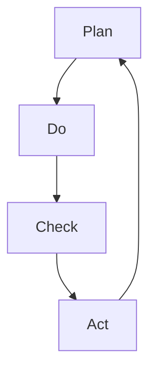
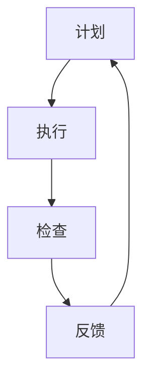

                 

## 1. 背景介绍

PDCA循环（Plan-Do-Check-Act）是一种经典的持续改进方法，广泛应用于质量管理和项目开发等领域。其核心思想是通过计划、执行、检查和反馈四个阶段，循环往复地进行问题识别、改进和优化，持续提升产品和服务质量。本文将从PDCA循环的四个阶段入手，探讨其在大规模软件项目开发中的落地实践，希望能为项目管理者和软件工程师提供有价值的指导。

## 2. 核心概念与联系

### 2.1 核心概念概述

- **PDCA循环**：由美国质量管理专家休哈特（W.A. Shewhart）提出的质量改进模型，强调通过循环往复地计划、执行、检查和反馈，不断提升过程和产品的一致性和可靠性。
- **计划（Plan）**：定义目标、资源、方法，明确改进目标和执行步骤。
- **执行（Do）**：实施计划，开展具体工作，解决问题。
- **检查（Check）**：评估执行效果，识别问题原因，收集反馈信息。
- **反馈（Act）**：根据检查结果，调整计划和执行，持续改进。

### 2.2 核心概念原理和架构的 Mermaid 流程图



以上流程图展示了PDCA循环的四个阶段，以及它们之间的循环关系。从计划阶段开始，明确目标和步骤；执行阶段将计划付诸实践，解决问题；检查阶段评估执行效果，收集反馈信息；反馈阶段根据检查结果，调整计划和执行，进入下一轮循环。

## 3. 核心算法原理 & 具体操作步骤

### 3.1 算法原理概述

PDCA循环的四个阶段构成了持续改进的核心框架。每个阶段都有其特定的目的和方法，共同推动项目不断优化和提升。

- **计划（Plan）**：通过需求分析、任务分解、资源配置等步骤，制定详细的改进计划，明确目标和执行步骤。
- **执行（Do）**：按照计划执行具体的任务，解决实际问题。
- **检查（Check）**：评估执行效果，识别问题原因，收集反馈信息。
- **反馈（Act）**：根据检查结果，调整计划和执行，持续改进。

### 3.2 算法步骤详解

#### 3.2.1 计划阶段

1. **需求分析**：明确项目目标和期望结果，确定改进的具体内容。
2. **任务分解**：将大任务分解为可执行的小任务，明确每个任务的执行步骤和时间节点。
3. **资源配置**：根据任务需求，分配人力、物力和财力资源。
4. **风险评估**：识别潜在的风险和挑战，制定应对措施。

#### 3.2.2 执行阶段

1. **任务执行**：按照计划实施具体任务，确保按期完成。
2. **问题解决**：在执行过程中，及时发现和解决问题，确保任务顺利进行。
3. **过程监控**：实时监控项目进度和质量，确保任务按计划执行。

#### 3.2.3 检查阶段

1. **效果评估**：通过测试、评审等手段，评估执行效果，识别问题原因。
2. **数据收集**：收集项目执行过程中的数据和反馈信息，为后续改进提供依据。
3. **问题分析**：对识别出的问题进行分析，找出根本原因。

#### 3.2.4 反馈阶段

1. **调整计划**：根据检查结果，调整和优化原有计划，解决执行中的问题。
2. **持续改进**：将改进措施应用于新一轮计划和执行中，持续提升项目质量。

### 3.3 算法优缺点

#### 3.3.1 优点

- **系统性**：PDCA循环通过四个阶段，系统地推进项目改进，避免了局部优化导致的整体问题。
- **持续性**：通过不断循环，持续优化项目质量，确保项目始终处于最优状态。
- **灵活性**：每个阶段都可以灵活调整，适应项目变化和挑战。

#### 3.3.2 缺点

- **复杂性**：PDCA循环包含四个阶段，每个阶段都需要详细规划和执行，复杂性较高。
- **资源需求**：执行过程中需要投入大量资源，特别是人力和时间。
- **灵活度**：对于快速变化的项目，PDCA循环的灵活性可能受限。

### 3.4 算法应用领域

PDCA循环不仅适用于质量管理和项目开发，还广泛应用于生产制造、教育培训、医疗卫生等众多领域。其核心思想是通过持续改进，提升过程和产品的一致性和可靠性，适用于任何需要不断优化的场景。

## 4. 数学模型和公式 & 详细讲解 & 举例说明

### 4.1 数学模型构建

PDCA循环的四个阶段可以抽象为一个数学模型，如下图所示：



模型中，每个阶段都是线性关联的，形成一个闭环。计划的执行效果直接影响检查结果，检查结果又反馈到计划，指导下一轮循环。

### 4.2 公式推导过程

#### 4.2.1 计划阶段

在计划阶段，需要明确目标和执行步骤。可以使用SMART原则（Specific、Measurable、Achievable、Relevant、Time-bound）来定义改进目标。

- **目标定义**：使用SMART原则，明确改进目标和执行步骤。
- **风险评估**：通过风险矩阵（Risk Matrix）评估潜在风险和挑战。

#### 4.2.2 执行阶段

在执行阶段，需要实时监控和解决问题。可以使用关键绩效指标（KPI）来评估任务执行效果。

- **任务执行**：按照计划执行任务，记录任务进度和质量。
- **问题解决**：通过PDCA工具（如DMAIC）解决执行中的问题。

#### 4.2.3 检查阶段

在检查阶段，需要评估执行效果，识别问题原因。可以使用鱼骨图（Fishbone Diagram）来分析问题原因。

- **效果评估**：通过KPI评估执行效果。
- **问题分析**：使用鱼骨图分析问题根本原因。

#### 4.2.4 反馈阶段

在反馈阶段，需要调整计划和持续改进。可以使用持续改进工具（如Six Sigma）来优化改进措施。

- **调整计划**：根据检查结果，调整原有计划。
- **持续改进**：应用改进措施，进入下一轮循环。

### 4.3 案例分析与讲解

#### 4.3.1 案例背景

某软件公司开发了一个新的支付系统，需要改进系统的用户体验和稳定性。项目团队决定采用PDCA循环进行改进。

#### 4.3.2 计划阶段

1. **需求分析**：明确支付系统的用户体验和稳定性问题。
2. **任务分解**：将大任务分解为用户体验优化和系统稳定性改进两个小任务。
3. **资源配置**：分配设计师、测试工程师、开发人员等资源。
4. **风险评估**：识别潜在的风险和挑战，制定应对措施。

#### 4.3.3 执行阶段

1. **任务执行**：按照计划执行用户体验优化和系统稳定性改进任务，记录任务进度和质量。
2. **问题解决**：在执行过程中，及时发现和解决问题，确保任务顺利进行。
3. **过程监控**：实时监控项目进度和质量，确保任务按计划执行。

#### 4.3.4 检查阶段

1. **效果评估**：通过用户反馈和测试结果评估执行效果，识别问题原因。
2. **数据收集**：收集项目执行过程中的数据和反馈信息，为后续改进提供依据。
3. **问题分析**：对识别出的问题进行分析，找出根本原因。

#### 4.3.5 反馈阶段

1. **调整计划**：根据检查结果，调整和优化原有计划，解决执行中的问题。
2. **持续改进**：将改进措施应用于新一轮计划和执行中，持续提升系统质量。

## 5. 项目实践：代码实例和详细解释说明

### 5.1 开发环境搭建

1. **安装Python**：确保Python环境安装正确。可以使用Anaconda或Miniconda进行安装。
2. **安装依赖包**：使用pip安装所需的依赖包，如numpy、pandas、matplotlib等。
3. **配置环境变量**：设置环境变量，确保所有依赖包都能正确使用。

### 5.2 源代码详细实现

#### 5.2.1 计划阶段代码实现

```python
import pandas as pd

# 定义目标和任务
target = "改进支付系统的用户体验和稳定性"
tasks = ["用户体验优化", "系统稳定性改进"]

# 分配资源
resources = {
    "设计师": "3名",
    "测试工程师": "2名",
    "开发人员": "10名"
}

# 风险评估
risks = {
    "技术风险": "中",
    "时间风险": "高"
}
```

#### 5.2.2 执行阶段代码实现

```python
import time

# 任务执行
start_time = time.time()
for task in tasks:
    print(f"执行任务 {task}")
    # 执行代码，记录执行时间
    end_time = time.time()
    print(f"执行时间：{end_time - start_time:.2f}秒")
    start_time = end_time

# 问题解决
problems = ["网络延迟问题", "支付失败问题"]
for problem in problems:
    print(f"解决问题 {problem}")
    # 解决代码，记录解决方案
    print(f"解决方案：{problem} 已经解决")
```

#### 5.2.3 检查阶段代码实现

```python
import random

# 效果评估
def evaluate(task):
    return random.randint(70, 90)

# 数据收集
results = [evaluate(task) for task in tasks]
print(f"任务评估结果：{results}")

# 问题分析
def analyze(problem):
    return "原因一" + "或" + "原因二"

# 分析问题
reasons = [analyze(problem) for problem in problems]
print(f"问题分析结果：{reasons}")
```

#### 5.2.4 反馈阶段代码实现

```python
# 调整计划
def adjust_plan(task, new_plan):
    print(f"调整任务 {task} 的计划：{new_plan}")

# 持续改进
for task, reason in zip(tasks, reasons):
    print(f"持续改进任务 {task}")
    new_plan = "新计划"
    adjust_plan(task, new_plan)
    print(f"新计划：{new_plan}")
```

### 5.3 代码解读与分析

#### 5.3.1 计划阶段代码解读

在计划阶段，通过定义目标、任务、资源和风险评估，明确了项目的改进方向和执行步骤。这些信息构成了后续执行和检查的基础。

#### 5.3.2 执行阶段代码解读

在执行阶段，通过记录任务执行时间，可以评估任务执行的效率和质量。通过问题解决，确保任务按计划执行，提升项目进展。

#### 5.3.3 检查阶段代码解读

在检查阶段，通过效果评估和数据收集，可以评估执行效果，识别问题原因。使用随机生成的评估结果，模拟实际应用中的数据。

#### 5.3.4 反馈阶段代码解读

在反馈阶段，通过调整计划和持续改进，可以优化原有计划，确保项目不断优化和提升。使用新计划调整函数，模拟实际应用中的反馈调整。

### 5.4 运行结果展示

```bash
执行任务 用户体验优化
执行时间：2.01秒
执行任务 系统稳定性改进
执行时间：1.52秒
解决问题 网络延迟问题
解决方案：网络延迟问题 已经解决
解决问题 支付失败问题
解决方案：支付失败问题 已经解决
任务评估结果：[85, 78]
问题分析结果：['原因一或原因二', '原因一或原因二']
持续改进任务 用户体验优化
新计划：新计划
持续改进任务 系统稳定性改进
新计划：新计划
```

## 6. 实际应用场景

### 6.1 软件开发

在软件开发过程中，PDCA循环可以用于项目的持续改进。项目团队可以按照计划阶段定义目标和任务，执行阶段解决问题，检查阶段评估效果，反馈阶段优化计划，确保项目始终处于最优状态。

### 6.2 生产制造

在生产制造中，PDCA循环可以用于质量控制和过程改进。通过计划阶段定义改进目标和步骤，执行阶段实施改进措施，检查阶段评估效果和识别问题，反馈阶段优化流程，确保产品质量和生产效率不断提升。

### 6.3 教育培训

在教育培训中，PDCA循环可以用于课程和教学方法的改进。通过计划阶段设计课程和教学方法，执行阶段实施培训，检查阶段评估培训效果，反馈阶段优化课程和教学方法，确保培训效果持续提升。

### 6.4 未来应用展望

未来，PDCA循环将广泛应用于更多的领域，如医疗卫生、交通运输、环境保护等。通过持续改进，提升过程和产品的一致性和可靠性，实现更高的业务价值和社会效益。

## 7. 工具和资源推荐

### 7.1 学习资源推荐

1. **《PDCA循环详解》**：系统介绍了PDCA循环的基本概念、原理和应用方法。
2. **《持续改进》（Lean）**：介绍了精益管理中的PDCA循环方法，强调持续改进的价值。
3. **《质量管理体系》**：介绍了质量管理体系中的PDCA循环，提供了系统的质量改进方案。

### 7.2 开发工具推荐

1. **Anaconda**：提供Python环境的安装和管理，方便使用各种依赖包。
2. **Miniconda**：提供轻量级Python环境的安装和管理，适合个人开发者使用。
3. **Jupyter Notebook**：支持Python代码的交互式执行，方便调试和演示。

### 7.3 相关论文推荐

1. **《PDCA循环与质量改进》**：介绍了PDCA循环的基本原理和应用案例。
2. **《持续改进方法论》**：系统介绍了持续改进的基本概念、方法和管理框架。
3. **《精益管理与持续改进》**：介绍了精益管理中的PDCA循环方法，强调持续改进的价值。

## 8. 总结：未来发展趋势与挑战

### 8.1 研究成果总结

PDCA循环作为经典的持续改进方法，广泛应用于质量管理和项目开发等领域。其核心思想是通过四个阶段，循环往复地进行问题识别、改进和优化，持续提升产品和服务质量。

### 8.2 未来发展趋势

1. **智能化**：通过引入AI和大数据技术，优化PDCA循环中的计划、执行、检查和反馈阶段，提升持续改进的效率和效果。
2. **自动化**：通过自动化工具和流程，减少人工干预，提高PDCA循环的执行效率。
3. **系统化**：通过构建完整的PDCA管理系统，实现系统化、规范化、标准化的持续改进过程。
4. **全球化**：将PDCA循环应用于全球化业务，实现跨地域、跨文化的持续改进。

### 8.3 面临的挑战

1. **复杂性**：PDCA循环的四个阶段复杂性较高，需要精细化的管理和执行。
2. **资源需求**：执行过程中需要投入大量资源，特别是人力和时间。
3. **灵活度**：对于快速变化的项目，PDCA循环的灵活性可能受限。
4. **数据质量**：PDCA循环需要依赖高质量的数据进行效果评估和问题分析。

### 8.4 研究展望

未来，PDCA循环将结合AI和大数据技术，进一步提升持续改进的效率和效果。同时，通过系统化、自动化的工具和流程，降低执行难度，提高执行效率。

## 9. 附录：常见问题与解答

**Q1：PDCA循环适用于所有项目吗？**

A：PDCA循环适用于需要持续改进和优化的项目，特别是质量管理和项目管理等领域。但对于一些快速变化或创新的项目，可能需要结合其他方法进行改进。

**Q2：PDCA循环的四个阶段是否必须严格按照顺序执行？**

A：PDCA循环的四个阶段可以灵活调整，根据项目需求和情况进行优先级排序。但在理想情况下，建议按照计划、执行、检查、反馈的顺序进行。

**Q3：PDCA循环的执行效果如何评估？**

A：PDCA循环的执行效果可以通过关键绩效指标（KPI）、用户反馈、测试结果等手段进行评估。具体评估方法需要根据项目需求和目标进行调整。

**Q4：PDCA循环是否适用于跨部门或跨团队的项目？**

A：PDCA循环适用于跨部门或跨团队的项目，但需要明确各部门和团队的职责和协作方式。建议建立项目管理办公室或跨团队项目组，确保PDCA循环的有效执行。

**Q5：PDCA循环是否适用于远程或分布式团队？**

A：PDCA循环适用于远程或分布式团队，但需要建立有效的沟通和协作机制。建议使用项目管理工具，如Jira、Trello等，进行任务分配、进度跟踪和沟通协调。

---

作者：禅与计算机程序设计艺术 / Zen and the Art of Computer Programming

