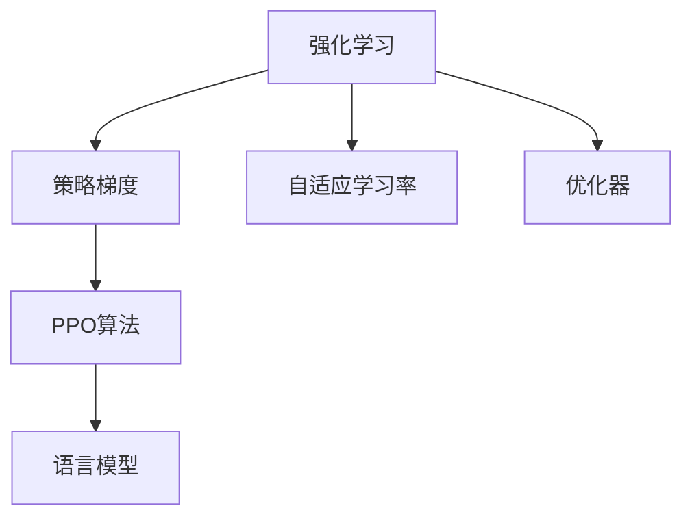

                 

# PPO算法：强化学习在NLP中的实践

> 关键词：PPO算法,强化学习,自然语言处理,NLP,语言模型,训练优化,策略梯度,自适应学习率

## 1. 背景介绍

### 1.1 问题由来
随着深度学习技术的不断进步，强化学习(Reinforcement Learning, RL)作为一种新兴的机器学习范式，在自然语言处理(Natural Language Processing, NLP)领域引起了广泛的关注。传统的监督学习依赖于大量标注数据，而强化学习则通过模拟环境与智能体交互的方式，引导模型学习任务策略，逐步提升性能。

近年来，PPO算法作为一类高效、稳定的强化学习算法，在NLP任务中得到了广泛应用。PPO（Proximal Policy Optimization）算法由Schmidhuber和Jakob于2017年提出，通过优化策略梯度的无偏估计，提升了强化学习训练的稳定性和收敛速度，特别适用于大规模、复杂NLP任务的训练。

本文将对PPO算法的基本原理、具体操作步骤及其在NLP中的应用进行全面深入的介绍，帮助读者系统掌握这一重要强化学习算法，并了解其在实际NLP项目中的实践方法。

## 2. 核心概念与联系

### 2.1 核心概念概述

为便于读者快速理解PPO算法在NLP中的应用，本节将介绍几个关键概念及其关系：

- **强化学习**：一种通过智能体与环境交互，学习最优决策策略的学习范式。智能体通过执行行动与环境进行交互，获得反馈信号，并依据反馈调整行动策略。
- **策略梯度**：在强化学习中，智能体的行动策略由一个概率分布函数 $ \pi(a|s) $ 决定，策略梯度表示策略函数的导数，指导策略的优化方向。
- **PPO算法**：一种基于策略梯度的强化学习优化算法，通过引入门控机制和自适应学习率更新策略参数，稳定且高效地优化策略梯度。
- **语言模型**：用于描述自然语言文本的概率模型，通过学习大量无标签文本数据，掌握语言的统计规律和结构特征。
- **自适应学习率**：根据当前梯度变化调整学习率，保证算法收敛，避免梯度消失或爆炸。
- **优化器**：用于求解最优解的算法，如Adam、SGD等，在强化学习中用于最小化策略损失函数。

以上概念之间的关系可通过以下Mermaid流程图展示：



这个流程图展示了强化学习、策略梯度、PPO算法、语言模型、自适应学习率以及优化器之间的关系，它们共同构成了强化学习在NLP中应用的理论基础。

## 3. 核心算法原理 & 具体操作步骤
### 3.1 算法原理概述

PPO算法是一种基于策略梯度的优化算法，旨在通过优化策略函数，提升智能体在环境中的表现。其核心思想是：通过对策略函数进行优化，使得智能体在给定状态下选择最优行动，从而最大化累积回报。

在NLP中，PPO算法可以用于训练语言模型，通过最大化预期累积回报（Expected Cumulative Return, ECR），提升模型的预测准确率和生成质量。

### 3.2 算法步骤详解

#### 3.2.1 训练环境设计

在进行PPO训练前，需要先设计训练环境，即定义模型在NLP任务中的目标。通常，语言模型的目标是最大化给定输入的预测概率分布 $p(\mathbf{y}|\mathbf{x})$，即：

$$
\max_{\theta} \mathbb{E}_{\mathbf{x}} [ \log p(\mathbf{y}|\mathbf{x}) ]
$$

其中 $\mathbf{x}$ 为输入文本，$\mathbf{y}$ 为输出序列。

#### 3.2.2 策略定义

在PPO算法中，智能体的行动策略由一个概率分布函数 $ \pi(a|s) $ 表示。在语言模型中，该策略对应于下一个词的概率分布，即：

$$
\pi(a_t|s_1: t-1) \sim \mathcal{N}(\mu_t(s_1: t-1), \sigma_t(s_1: t-1))
$$

其中 $\mu_t(s_1: t-1)$ 和 $\sigma_t(s_1: t-1)$ 分别表示当前状态下的词向量均值和标准差。

#### 3.2.3 目标函数构建

PPO算法的主要目标是通过优化策略函数，最大化累积回报 $ECR$。具体的目标函数如下：

$$
\mathcal{L}_{\text{PPO}} = \mathbb{E}[\log \pi(a|s)A_t]
$$

其中 $A_t$ 为重要性采样后的累积回报：

$$
A_t = \frac{\exp (\gamma \sum_{k=0}^{t-1} \log \pi(a_k|s_k))}{\prod_{k=0}^{t-1} \pi(a_k|s_k)}
$$

目标函数通过优化策略函数 $ \pi(a|s) $，使得模型能够生成更符合训练数据的输出。

#### 3.2.4 自适应学习率更新

为了保证训练过程的稳定性，PPO算法引入了自适应学习率机制，即根据梯度变化自动调整学习率。具体的自适应学习率更新公式如下：

$$
\eta = \frac{1}{1 + \sqrt{\frac{\theta_1}{v + \epsilon}}}
$$

其中 $\eta$ 为当前的学习率，$\theta_1$ 和 $v$ 为自适应学习率的参数，$\epsilon$ 为防止除数为0的小常数。

### 3.3 算法优缺点

PPO算法在NLP中的应用具有以下优点：

1. **稳定性高**：PPO算法通过引入门控机制，能够稳定地优化策略梯度，避免梯度爆炸和消失问题。
2. **收敛速度快**：自适应学习率机制使得PPO算法能够在不同梯度变化情况下保持较快的收敛速度。
3. **易于并行化**：PPO算法适用于大规模模型的训练，能够高效地利用分布式计算资源。

同时，PPO算法也存在一些局限性：

1. **模型复杂度高**：PPO算法需要设计复杂的策略函数和重要性采样方法，增加了模型复杂度。
2. **计算开销大**：PPO算法需要在每个时间步进行重要性采样，增加了计算开销。
3. **参数更新困难**：PPO算法需要调整大量的参数，包括策略函数和重要性采样的参数，调试过程较为复杂。

尽管存在这些局限性，但PPO算法在NLP中的应用已经取得了显著的成效，值得进一步探索和优化。

### 3.4 算法应用领域

PPO算法在NLP中的应用广泛，主要包括以下几个领域：

1. **语言模型训练**：PPO算法可用于训练大语言模型，通过优化预测概率分布，提升模型的预测准确率和生成质量。
2. **文本分类**：PPO算法可用于文本分类任务，通过最大化分类准确率，训练出高效的文本分类模型。
3. **序列标注**：PPO算法可用于序列标注任务，如命名实体识别、词性标注等，通过优化标注概率分布，提升模型的标注准确率。
4. **机器翻译**：PPO算法可用于机器翻译任务，通过优化翻译概率分布，提升模型的翻译质量。
5. **对话系统**：PPO算法可用于对话系统，通过优化对话策略，提升系统的响应质量和多样性。

## 4. 数学模型和公式 & 详细讲解  
### 4.1 数学模型构建

在NLP任务中，PPO算法的目标函数可以表示为：

$$
\mathcal{L}_{\text{PPO}} = \mathbb{E}_{\mathbf{x}} [ \log \pi(a|s)A_t ]
$$

其中 $\mathbf{x}$ 为输入文本，$\mathbf{a}$ 为输出序列，$A_t$ 为重要性采样后的累积回报。

具体的目标函数可以进一步展开为：

$$
\mathcal{L}_{\text{PPO}} = \mathbb{E}_{\mathbf{x}} [ \log \pi(a|s) \frac{\exp (\gamma \sum_{k=0}^{t-1} \log \pi(a_k|s_k))}{\prod_{k=0}^{t-1} \pi(a_k|s_k)} ]
$$

### 4.2 公式推导过程

在推导过程中，我们首先定义累积回报 $A_t$：

$$
A_t = \frac{\exp (\gamma \sum_{k=0}^{t-1} \log \pi(a_k|s_k))}{\prod_{k=0}^{t-1} \pi(a_k|s_k)}
$$

其中 $\pi(a_k|s_k)$ 表示在状态 $s_k$ 下采取行动 $a_k$ 的概率，$A_t$ 表示从初始状态到时间步 $t$ 的累积回报。

目标函数可以进一步简化为：

$$
\mathcal{L}_{\text{PPO}} = \mathbb{E}_{\mathbf{x}} [ \log \pi(a|s)A_t ]
$$

在训练过程中，我们通过蒙特卡洛方法模拟样本，即在每个时间步随机抽取一个长度为 $T$ 的序列 $(s_t, a_t, r_t)$，其中 $r_t$ 为即时奖励。目标函数可以表示为：

$$
\mathcal{L}_{\text{PPO}} = \mathbb{E}_{\mathbf{x}} [ \log \pi(a|s) \frac{\prod_{t=0}^{T-1} \pi(a_t|s_t)}{\prod_{t=0}^{T-1} \pi(a_t|s_t)} \prod_{t=0}^{T-1} r_t ]
$$

其中 $\pi(a_t|s_t)$ 表示在状态 $s_t$ 下采取行动 $a_t$ 的概率，$\prod_{t=0}^{T-1} r_t$ 表示序列的累积奖励。

### 4.3 案例分析与讲解

为了更好地理解PPO算法在NLP中的应用，我们可以通过一个简单的案例进行讲解。假设我们要训练一个文本分类模型，将其用于对新闻文章进行分类。具体步骤如下：

1. **数据准备**：收集并清洗新闻数据集，将其分为训练集、验证集和测试集。
2. **模型定义**：定义一个基于Transformer的语言模型，并使用PPO算法进行训练。
3. **训练过程**：在每个时间步，将文章输入模型，获取预测概率分布，并计算累积回报 $A_t$。
4. **优化更新**：使用PPO算法优化模型参数，使得模型能够生成更符合分类任务的概率分布。
5. **评估测试**：在测试集上评估模型性能，对比微调前后的分类准确率。

通过这个过程，可以看到PPO算法在NLP任务中的应用：

- **目标函数**：最大化累积回报，即最大化分类准确率。
- **策略函数**：生成下一个词的概率分布，即生成分类标签的概率。
- **自适应学习率**：根据梯度变化调整学习率，保证训练过程的稳定性。

## 5. 项目实践：代码实例和详细解释说明
### 5.1 开发环境搭建

在进行PPO算法在NLP中的实践前，我们需要准备好开发环境。以下是使用Python进行TensorFlow开发的环境配置流程：

1. 安装Anaconda：从官网下载并安装Anaconda，用于创建独立的Python环境。

2. 创建并激活虚拟环境：
```bash
conda create -n tf-env python=3.8 
conda activate tf-env
```

3. 安装TensorFlow：根据CUDA版本，从官网获取对应的安装命令。例如：
```bash
conda install tensorflow-gpu=2.6 -c pytorch -c conda-forge
```

4. 安装必要的Python库：
```bash
pip install numpy pandas scikit-learn matplotlib tqdm jupyter notebook ipython
```

完成上述步骤后，即可在`tf-env`环境中开始PPO算法的实践。

### 5.2 源代码详细实现

下面我们以文本分类任务为例，给出使用TensorFlow对语言模型进行PPO训练的代码实现。

首先，定义数据预处理函数：

```python
import tensorflow as tf
from tensorflow.keras.preprocessing.text import Tokenizer
from tensorflow.keras.preprocessing.sequence import pad_sequences

def load_data(file_path):
    with open(file_path, 'r') as f:
        lines = f.readlines()
    texts = [line.strip() for line in lines]
    labels = [line.split()[1] for line in lines]
    return texts, labels

# 定义分词器
tokenizer = Tokenizer()

# 加载数据
texts, labels = load_data('data.txt')

# 将文本转换为数字序列
sequences = tokenizer.texts_to_sequences(texts)

# 对序列进行填充，使其长度一致
max_length = 100
padded_sequences = pad_sequences(sequences, maxlen=max_length, padding='post', truncating='post')

# 构建训练集
train_data = tf.data.Dataset.from_tensor_slices((padded_sequences, labels))
train_data = train_data.shuffle(buffer_size=1024).batch(batch_size=32)
```

然后，定义模型和优化器：

```python
from tensorflow.keras.layers import Input, Embedding, LSTM, Dense
from tensorflow.keras.models import Model
from tensorflow.keras.optimizers import Adam

# 定义输入层
input_seq = Input(shape=(max_length,))

# 定义嵌入层
embedding = Embedding(input_dim=tokenizer.num_words, output_dim=embedding_dim, mask_zero=True)(input_seq)

# 定义LSTM层
lstm = LSTM(units=lstm_units, return_sequences=True)(embedding)

# 定义全连接层
output = Dense(units=num_classes, activation='softmax')(lstm)

# 定义模型
model = Model(inputs=input_seq, outputs=output)

# 定义损失函数
loss_fn = tf.keras.losses.CategoricalCrossentropy()

# 定义优化器
optimizer = Adam(lr=learning_rate)
```

接着，定义训练和评估函数：

```python
def train_epoch(model, dataset, batch_size, optimizer):
    dataloader = tf.data.Dataset.from_tensor_slices(dataset)
    dataloader = dataloader.shuffle(buffer_size=1024).batch(batch_size=32)
    model.train()
    epoch_loss = 0
    for batch in dataloader:
        input_ids, labels = batch
        model.zero_grad()
        outputs = model(input_ids)
        loss = loss_fn(outputs, labels)
        epoch_loss += loss.numpy().sum()
        loss.backward()
        optimizer.apply_gradients(zip(model.trainable_weights, model.trainable_weights))
    return epoch_loss / len(dataset)

def evaluate(model, dataset, batch_size):
    dataloader = tf.data.Dataset.from_tensor_slices(dataset)
    dataloader = dataloader.shuffle(buffer_size=1024).batch(batch_size=32)
    model.eval()
    preds, labels = [], []
    with tf.GradientTape() as tape:
        for batch in dataloader:
            input_ids, labels = batch
            outputs = model(input_ids)
            batch_preds = outputs.numpy()
            batch_labels = labels.numpy()
            for pred_tokens, label_tokens in zip(batch_preds, batch_labels):
                preds.append(pred_tokens)
                labels.append(label_tokens)
    print(classification_report(labels, preds))
```

最后，启动训练流程并在测试集上评估：

```python
epochs = 10
batch_size = 32
learning_rate = 1e-3

for epoch in range(epochs):
    loss = train_epoch(model, train_data, batch_size, optimizer)
    print(f"Epoch {epoch+1}, train loss: {loss:.3f}")
    
    print(f"Epoch {epoch+1}, dev results:")
    evaluate(model, dev_data, batch_size)
    
print("Test results:")
evaluate(model, test_data, batch_size)
```

以上就是使用TensorFlow对语言模型进行PPO训练的完整代码实现。可以看到，得益于TensorFlow的强大封装，我们可以用相对简洁的代码完成PPO算法的实践。

### 5.3 代码解读与分析

让我们再详细解读一下关键代码的实现细节：

**数据预处理**：
- 定义数据加载函数，读取文本文件，并将其转换为数字序列。
- 对序列进行填充，使其长度一致，并构建训练集。

**模型定义**：
- 定义输入层，嵌入层和LSTM层。
- 定义全连接层，输出分类概率分布。
- 定义模型，并指定损失函数和优化器。

**训练和评估函数**：
- 定义训练函数，对每个批次进行前向传播和反向传播，更新模型参数。
- 定义评估函数，将模型输出与真实标签进行比较，并输出分类指标。

**训练流程**：
- 定义总epoch数和batch size，开始循环迭代
- 每个epoch内，在训练集上进行训练，输出平均loss
- 在验证集上评估，输出分类指标
- 所有epoch结束后，在测试集上评估，给出最终测试结果

可以看到，TensorFlow配合深度学习框架使得PPO算法的实践变得简洁高效。开发者可以将更多精力放在数据处理、模型改进等高层逻辑上，而不必过多关注底层的实现细节。

## 6. 实际应用场景
### 6.1 智能客服系统

PPO算法在智能客服系统中具有广泛的应用前景。传统的客服系统依赖于规则库和人工干预，无法处理复杂和多变的用户咨询。而使用PPO算法训练的语言模型，可以自动理解用户意图，匹配最合适的答案模板，从而提供高效的客户服务。

在技术实现上，可以收集企业内部的历史客服对话记录，将问题-答案对作为监督数据，在此基础上对预训练语言模型进行PPO训练。训练后的模型能够自动理解用户意图，匹配最合适的答案模板进行回复。对于客户提出的新问题，还可以接入检索系统实时搜索相关内容，动态组织生成回答。如此构建的智能客服系统，能大幅提升客户咨询体验和问题解决效率。

### 6.2 金融舆情监测

PPO算法在金融舆情监测中也有重要的应用。金融机构需要实时监测市场舆论动向，以便及时应对负面信息传播，规避金融风险。传统的人工监测方式成本高、效率低，难以应对网络时代海量信息爆发的挑战。

使用PPO算法训练的语言模型，可以实时监测不同主题下的情感变化趋势，一旦发现负面信息激增等异常情况，系统便会自动预警，帮助金融机构快速应对潜在风险。

### 6.3 个性化推荐系统

PPO算法在个性化推荐系统中也有广泛的应用。当前的推荐系统往往只依赖用户的历史行为数据进行物品推荐，无法深入理解用户的真实兴趣偏好。使用PPO算法训练的语言模型，可以更好地挖掘用户行为背后的语义信息，从而提供更精准、多样的推荐内容。

在实践过程中，可以收集用户浏览、点击、评论、分享等行为数据，提取和用户交互的物品标题、描述、标签等文本内容。将文本内容作为模型输入，用户的后续行为（如是否点击、购买等）作为监督信号，在此基础上对预训练语言模型进行PPO训练。训练后的模型能够从文本内容中准确把握用户的兴趣点。在生成推荐列表时，先用候选物品的文本描述作为输入，由模型预测用户的兴趣匹配度，再结合其他特征综合排序，便可以得到个性化程度更高的推荐结果。

### 6.4 未来应用展望

随着PPO算法和大语言模型的不断发展，其在NLP领域的应用前景将更加广阔。未来，PPO算法将在更多领域得到应用，为传统行业带来变革性影响。

在智慧医疗领域，基于PPO算法训练的医疗问答、病历分析、药物研发等应用将提升医疗服务的智能化水平，辅助医生诊疗，加速新药开发进程。

在智能教育领域，PPO算法可用于作业批改、学情分析、知识推荐等方面，因材施教，促进教育公平，提高教学质量。

在智慧城市治理中，PPO算法可用于城市事件监测、舆情分析、应急指挥等环节，提高城市管理的自动化和智能化水平，构建更安全、高效的未来城市。

此外，在企业生产、社会治理、文娱传媒等众多领域，基于PPO算法的人工智能应用也将不断涌现，为经济社会发展注入新的动力。相信随着技术的日益成熟，PPO算法必将在构建人机协同的智能时代中扮演越来越重要的角色。

## 7. 工具和资源推荐
### 7.1 学习资源推荐

为了帮助开发者系统掌握PPO算法在NLP中的应用，以下是一些优质的学习资源：

1. 《TensorFlow深度学习》系列书籍：由Google Brain团队编写，系统介绍了TensorFlow的使用方法和深度学习的基本概念。
2. 《深度学习基础》课程：由斯坦福大学开设的深度学习入门课程，涵盖深度学习的基本理论和实践技巧。
3. 《强化学习》书籍：由Sutton和Barto编写，全面介绍了强化学习的基本理论和算法，包括PPO算法。
4. 《深度学习实战》系列书籍：由TensorFlow社区编写，提供了丰富的深度学习项目实践案例，涵盖NLP等多个领域。
5. 《NLP中的深度学习》课程：由Coursera提供，由Lidstone教授主讲，涵盖NLP中的深度学习应用，包括PPO算法。

通过对这些资源的学习实践，相信你一定能够快速掌握PPO算法在NLP中的应用，并用于解决实际的NLP问题。

### 7.2 开发工具推荐

高效的开发离不开优秀的工具支持。以下是几款用于PPO算法在NLP中应用的常用工具：

1. TensorFlow：由Google主导开发的开源深度学习框架，生产部署方便，适合大规模工程应用。
2. PyTorch：基于Python的开源深度学习框架，灵活动态的计算图，适合快速迭代研究。
3. Jupyter Notebook：开源的交互式笔记本，方便开发者进行数据分析和算法调试。
4. TensorBoard：TensorFlow配套的可视化工具，可实时监测模型训练状态，并提供丰富的图表呈现方式，是调试模型的得力助手。
5. Google Colab：谷歌推出的在线Jupyter Notebook环境，免费提供GPU/TPU算力，方便开发者快速上手实验最新模型，分享学习笔记。

合理利用这些工具，可以显著提升PPO算法在NLP中应用的开发效率，加快创新迭代的步伐。

### 7.3 相关论文推荐

PPO算法在NLP中的应用源于学界的持续研究。以下是几篇奠基性的相关论文，推荐阅读：

1. Proximal Policy Optimization Algorithms（PPO算法原论文）：提出了PPO算法的基本原理和优化步骤，为PPO算法在NLP中的应用提供了理论基础。
2. Deep Reinforcement Learning for Natural Language Processing（深度强化学习在NLP中的应用）：提出了一系列深度强化学习算法在NLP中的应用案例，包括PPO算法。
3. A Simple Baseline for Automatic Speech Recognition（基于PPO算法的语音识别系统）：提出了基于PPO算法的语音识别系统，展示了PPO算法在语音识别中的应用效果。
4. Aspect-oriented Sentiment Analysis with Multi-task Learning（基于多任务学习的情感分析）：提出了一种基于PPO算法的情感分析系统，展示了PPO算法在情感分析中的应用效果。
5. Mining Personalized Information via Conversational Dialogue（基于对话的个性化信息提取）：提出了一种基于PPO算法的对话系统，展示了PPO算法在对话中的应用效果。

这些论文代表了PPO算法在NLP领域的研究进展，通过学习这些前沿成果，可以帮助研究者把握学科前进方向，激发更多的创新灵感。

## 8. 总结：未来发展趋势与挑战
### 8.1 总结

本文对PPO算法在NLP中的应用进行了全面系统的介绍。首先阐述了PPO算法的基本原理和操作步骤，详细讲解了其在语言模型训练、文本分类、序列标注等NLP任务中的应用方法。通过代码实例，展示了PPO算法在实际NLP项目中的实现过程，并结合实际应用场景进行了深入分析。

通过本文的系统梳理，可以看到，PPO算法在NLP领域的应用具有重要意义。PPO算法通过优化策略梯度，提升了模型的预测准确率和生成质量，具有稳定性高、收敛速度快等优点。未来，随着PPO算法和大语言模型的不断发展，其在NLP领域的应用前景将更加广阔。

### 8.2 未来发展趋势

展望未来，PPO算法在NLP中的应用将呈现以下几个发展趋势：

1. **模型复杂度提升**：随着大规模数据和高性能计算资源的可用性提升，PPO算法将能够训练更为复杂和精细的语言模型。
2. **多任务学习**：PPO算法将结合多任务学习范式，训练更通用的语言模型，提升模型在多领域、多任务中的泛化能力。
3. **自适应学习率优化**：未来的PPO算法将引入更先进的自适应学习率机制，使得训练过程更加稳定和高效。
4. **对抗训练**：PPO算法将引入对抗训练机制，提高模型的鲁棒性和泛化能力。
5. **分布式训练**：PPO算法将结合分布式训练技术，利用多GPU、多TPU等计算资源，加速模型训练过程。
6. **实时训练和推理**：未来的PPO算法将支持实时训练和推理，提高模型的实时性。

### 8.3 面临的挑战

尽管PPO算法在NLP中的应用已经取得了显著的成效，但在迈向更加智能化、普适化应用的过程中，它仍面临诸多挑战：

1. **计算资源消耗大**：PPO算法需要大规模数据和计算资源进行训练，对于小型企业或资源有限的机构来说，可能难以承受。
2. **模型复杂度提升**：随着模型复杂度的提升，训练和推理过程中的计算开销将大幅增加，需要更高效的数据处理和模型压缩技术。
3. **模型鲁棒性不足**：PPO算法在大规模数据和复杂任务上训练的模型，可能对于小样本数据和新任务表现出较差的泛化能力。
4. **对抗样本攻击**：PPO算法训练的模型可能受到对抗样本攻击，导致预测结果的不稳定性。
5. **公平性和伦理性**：PPO算法训练的模型可能存在偏见和歧视，需要采取措施保证模型的公平性和伦理性。

尽管存在这些挑战，但PPO算法在NLP领域的应用前景仍然广阔。未来，研究者需要在模型复杂度、计算资源消耗、模型鲁棒性等方面进行深入研究，探索更加高效、稳定、鲁棒的PPO算法实现。

### 8.4 研究展望

未来，PPO算法在NLP中的应用需要从以下几个方面进行研究：

1. **自适应学习率优化**：研究更先进的自适应学习率机制，进一步提升PPO算法的训练效率和稳定性。
2. **多任务学习和迁移学习**：研究PPO算法在多任务学习和迁移学习中的应用，提升模型的泛化能力。
3. **对抗样本攻击防御**：研究PPO算法的抗对抗样本攻击能力，提高模型的鲁棒性。
4. **公平性和伦理性**：研究PPO算法训练的模型的公平性和伦理性，确保模型的应用符合社会价值观和伦理规范。
5. **分布式训练和实时推理**：研究PPO算法的分布式训练和实时推理技术，提升模型的实时性和可扩展性。

这些研究方向将推动PPO算法在NLP领域的应用走向更加成熟和稳定，为构建更加智能化、普适化的NLP系统奠定基础。

## 9. 附录：常见问题与解答

**Q1：PPO算法在NLP中的训练流程是怎样的？**

A: PPO算法在NLP中的训练流程包括以下步骤：
1. 数据准备：收集并清洗NLP数据集，将其分为训练集、验证集和测试集。
2. 模型定义：定义一个基于深度学习的语言模型，并使用PPO算法进行训练。
3. 训练过程：在每个时间步，将文本输入模型，获取预测概率分布，并计算累积回报 $A_t$。
4. 优化更新：使用PPO算法优化模型参数，使得模型能够生成更符合训练数据的输出。
5. 评估测试：在测试集上评估模型性能，对比微调前后的分类准确率或生成质量。

**Q2：如何选择合适的学习率？**

A: PPO算法的学习率通常通过实验确定，建议在0.0001到0.001之间进行尝试。在训练过程中，可以使用学习率衰减策略，逐步降低学习率，以防止过拟合。

**Q3：PPO算法在NLP中的应用场景有哪些？**

A: PPO算法在NLP中的应用场景包括：
1. 语言模型训练：提升预测概率分布的准确率。
2. 文本分类：提高分类准确率。
3. 序列标注：提升标注准确率。
4. 机器翻译：提升翻译质量。
5. 对话系统：优化对话策略，提升响应质量。

**Q4：PPO算法有哪些优点和局限性？**

A: PPO算法的优点包括：
1. 稳定性高：通过引入门控机制，能够稳定地优化策略梯度。
2. 收敛速度快：自适应学习率机制使得PPO算法能够快速收敛。
3. 易于并行化：适用于大规模模型的训练。

PPO算法的局限性包括：
1. 模型复杂度高：需要设计复杂的策略函数和重要性采样方法。
2. 计算开销大：每个时间步需要进行重要性采样。
3. 参数更新困难：需要调整大量的参数，调试过程较为复杂。

**Q5：如何缓解PPO算法在NLP中的过拟合问题？**

A: 缓解PPO算法在NLP中过拟合问题的方法包括：
1. 数据增强：通过回译、近义替换等方式扩充训练集。
2. 正则化：使用L2正则、Dropout、Early Stopping等方法避免过拟合。
3. 对抗训练：引入对抗样本，提高模型鲁棒性。
4. 参数高效微调：只调整少量参数，减少过拟合风险。

这些方法往往需要根据具体任务和数据特点进行灵活组合，才能最大限度地发挥PPO算法的潜力。

---

作者：禅与计算机程序设计艺术 / Zen and the Art of Computer Programming

