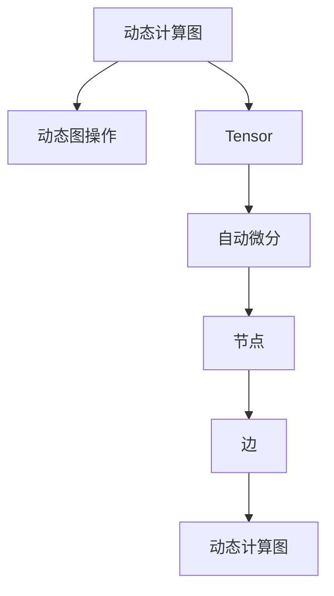

                 

# Pytorch 优势：动态计算图

## 1. 背景介绍

### 1.1 问题由来
近年来，深度学习技术得到了迅猛发展，广泛应用于图像识别、自然语言处理、语音识别等领域，并取得了显著成果。在这些技术背后，计算图技术扮演了重要角色，其中PyTorch作为计算图领域的佼佼者，以其动态计算图、模块化和易用性而备受瞩目。

### 1.2 问题核心关键点
深度学习模型的构建和训练依赖于高效的计算图（computational graph）。计算图是记录模型计算流程的一种图结构，它将模型中的变量、操作和数据流用节点和边的形式展现出来。传统的静态计算图（如TensorFlow等）在执行前需要一次性构建完整的计算图，这种方式灵活性较差，限制了模型的快速迭代和开发效率。

动态计算图（如PyTorch）则支持在执行过程中动态创建和修改计算图，极大地提升了深度学习的开发和调试效率。PyTorch的动态计算图是其核心优势，使得其成为深度学习领域的领军者。

### 1.3 问题研究意义
深度学习模型的构建和训练效率直接影响研究的进展和应用的速度。动态计算图技术在深度学习中的应用，对于提升模型的开发效率、加速模型训练、优化模型性能具有重要意义。

深入理解PyTorch的动态计算图原理和应用，可以帮助研究人员和开发者更好地掌握深度学习技术的底层实现，从而推动深度学习技术的不断进步和落地应用。

## 2. 核心概念与联系

### 2.1 核心概念概述

为更好地理解PyTorch的动态计算图，本节将介绍几个密切相关的核心概念：

- 动态计算图（Dynamic Computational Graph）：与静态计算图相对，动态计算图在执行时，允许动态添加、修改计算图中的节点和边。这种方式灵活性高，便于调试和迭代。
- 静态计算图（Static Computational Graph）：在执行前一次性构建完整的计算图，支持图优化和编译，但灵活性较差，适用于大规模生产部署。
- Tensor：PyTorch中的张量（Tensor）是动态计算图的基本单元，支持高效的数值计算和自动微分。
- 自动微分（Automatic Differentiation）：自动计算梯度的过程，基于链式法则，支持复杂的非线性函数求导。
- 动态图操作（Dynamic Graph Operation）：如插入节点、删除节点、修改边等，灵活调整计算图结构。

这些核心概念之间的逻辑关系可以通过以下Mermaid流程图来展示：



这个流程图展示出PyTorch的动态计算图的核心组件及其相互关系：

1. 动态计算图由节点和边构成。
2. Tensor作为计算图中的基本单元，支持高效的数值计算和自动微分。
3. 动态图操作可以在执行过程中动态修改计算图。
4. 自动微分基于链式法则，自动计算梯度。

这些概念共同构成了PyTorch的动态计算图系统，使得其具有灵活性、高效性和易用性等优势。

## 3. 核心算法原理 & 具体操作步骤
### 3.1 算法原理概述

PyTorch的动态计算图原理基于计算图的组合和重构，其核心思想是在执行过程中动态构建和修改计算图，从而支持高效的深度学习模型训练和推理。

动态计算图的过程可以概括为以下几个关键步骤：

1. **创建Tensor**：在计算图的构建和修改过程中，Tensor作为基本计算单元，支持高效的数值计算和自动微分。
2. **定义计算图**：通过Tensor之间的操作定义计算图，可以灵活地添加、删除和修改图中的节点和边。
3. **计算图优化**：动态计算图支持在执行过程中动态调整计算图结构，进行优化和编译。
4. **自动微分**：基于链式法则自动计算梯度，支持复杂非线性函数的求导。
5. **计算图执行**：在定义好计算图后，通过前向传播计算出模型输出，再通过反向传播计算梯度，进行模型参数的更新。

这些步骤共同构成了PyTorch的动态计算图技术，使得其在大规模深度学习模型训练和推理中具有独特优势。

### 3.2 算法步骤详解

PyTorch的动态计算图构建和执行过程主要包括以下几个关键步骤：

**Step 1: 创建Tensor**
- 使用`torch.tensor()`函数创建Tensor。
- 指定Tensor的形状和数据类型，如`torch.tensor(data, dtype=torch.float32)`。

**Step 2: 定义计算图**
- 使用Tensor之间的操作定义计算图。如加法、乘法等基本操作，`x + y`。
- 通过`torch.nn`模块定义神经网络层，如线性层、卷积层、循环层等，`nn.Linear()`。
- 动态图操作：在计算图中添加、删除节点和修改边，如`x = x + y`。

**Step 3: 计算图优化**
- 动态计算图在执行过程中，可以动态调整计算图结构，进行优化和编译。
- 可以使用`torch.no_grad()`禁用计算图，仅用于模型推理，不更新参数。

**Step 4: 自动微分**
- PyTorch支持自动计算梯度，自动计算函数中每个变量的导数，使用`torch.autograd`模块。
- 自动微分基于链式法则，计算函数中每个变量的导数。
- 可以通过`torch.autograd.backward()`计算梯度，反向传播更新模型参数。

**Step 5: 计算图执行**
- 通过前向传播计算模型输出。
- 使用反向传播计算梯度，更新模型参数。
- 可以使用`torch.optim`模块定义优化器，如SGD、Adam等。

### 3.3 算法优缺点

动态计算图在深度学习中的优势主要体现在以下几个方面：

**优点**：

1. **灵活性**：动态计算图支持动态创建和修改计算图，灵活性高，便于调试和迭代。
2. **易用性**：动态计算图的API简单直观，易于上手，可以极大提升开发效率。
3. **高效性**：动态计算图支持高效的数值计算和自动微分，优化和编译过程可以显著提升计算速度。
4. **灵活的模型定义**：动态计算图支持灵活的模型定义，可以定义复杂的神经网络结构和算法。

**缺点**：

1. **资源消耗高**：动态计算图在执行过程中需要频繁创建和修改计算图，资源消耗高，性能稍逊于静态计算图。
2. **优化难度大**：动态计算图的优化和编译过程复杂，需要更多的时间进行优化。

尽管存在这些缺点，动态计算图的优势依然显著，特别是在深度学习模型的开发和调试过程中，其灵活性和易用性成为不可替代的优势。

### 3.4 算法应用领域

动态计算图在深度学习中的应用非常广泛，以下是几个典型领域：

1. **计算机视觉**：用于图像识别、目标检测、语义分割等任务，支持灵活的神经网络结构设计。
2. **自然语言处理**：用于文本分类、语言生成、机器翻译等任务，支持动态图操作和自动微分。
3. **强化学习**：用于构建动态图结构，支持优化和编译，支持复杂的算法设计。
4. **语音识别**：用于语音转换、语音识别等任务，支持动态图操作和高效计算。
5. **推荐系统**：用于推荐算法设计，支持灵活的模型定义和高效的自动微分。

除了上述这些典型应用外，动态计算图还被广泛应用于生物信息学、医学影像、物理学等领域，展示了其在深度学习中的强大生命力和广泛应用前景。

## 4. 数学模型和公式 & 详细讲解
### 4.1 数学模型构建

动态计算图的应用场景广泛，本文以深度学习模型为例，介绍动态计算图的数学模型构建。

假设深度学习模型 $M$ 的输入为 $x$，输出为 $y$，模型的参数为 $\theta$。模型的损失函数为 $L(y, \hat{y})$，其中 $\hat{y}=M(x)$ 为模型预测结果。

定义模型 $M$ 的计算图，其节点表示操作，边表示数据流。假设计算图中有 $n$ 个节点和 $m$ 条边。则计算图的结构可以用有向无环图（DAG）表示。

### 4.2 公式推导过程

以一个简单的神经网络模型为例，介绍动态计算图的数学模型构建和推导。

假设神经网络模型 $M$ 包含 $l$ 个隐层，每个隐层有 $n$ 个神经元，输入层有 $m$ 个神经元。模型输出为：

$$
y = M(x) = \sigma(W_lx + b_l) = \sigma(W_2\sigma(W_1x + b_1) + b_2)
$$

其中 $\sigma$ 为激活函数，$W_l$ 和 $b_l$ 分别为第 $l$ 层的权重和偏置。

定义计算图 $G$，其中 $x$ 为输入，$y$ 为输出。计算图 $G$ 的结构如图 1 所示：


图 1: 计算图结构

对于动态计算图，模型的输出计算过程可以表示为：

$$
y = \sigma(W_2^* y_{l-1} + b_2^*)
$$

其中 $y_{l-1} = \sigma(W_l^* y_{l-2} + b_l^*)$，依次类推，直至 $y_1 = \sigma(W_1^* x + b_1^*)$。

定义计算图的边权值矩阵 $W_l$ 和偏置向量 $b_l$，其计算过程可以表示为：

$$
W_l = \left[
    \begin{array}{ccc}
        w_{1,1} & \cdots & w_{1,n} \\
        \vdots & \ddots & \vdots \\
        w_{n,1} & \cdots & w_{n,n} \\
    \end{array}
\right]
$$

$$
b_l = \left[
    \begin{array}{c}
        b_{1,l} \\
        \vdots \\
        b_{n,l} \\
    \end{array}
\right]
$$

### 4.3 案例分析与讲解

以一个简单的图像分类模型为例，展示动态计算图的构建和应用过程。

假设模型输入为 $28 \times 28$ 的图像，输出为 10 个类别的概率分布。使用卷积神经网络（CNN）进行图像分类，计算图如图 2 所示：


图 2: 图像分类计算图

计算图的节点包括卷积层、池化层、全连接层等。节点之间通过边进行数据流传递。每个节点的计算过程可以表示为：

$$
y_{conv} = \sigma(W_{conv}^* x + b_{conv}^*)
$$

其中 $x$ 为输入图像，$y_{conv}$ 为卷积层的输出，$W_{conv}$ 和 $b_{conv}$ 分别为卷积层和偏置向量。

通过定义好计算图后，可以使用动态计算图进行模型的训练和推理。训练过程中，前向传播计算输出，反向传播计算梯度，使用优化器更新模型参数。

## 5. 项目实践：代码实例和详细解释说明
### 5.1 开发环境搭建

在使用PyTorch进行深度学习开发前，需要先搭建好开发环境。以下是使用Python进行PyTorch开发的环境配置流程：

1. 安装Anaconda：从官网下载并安装Anaconda，用于创建独立的Python环境。

2. 创建并激活虚拟环境：
```bash
conda create -n pytorch-env python=3.8 
conda activate pytorch-env
```

3. 安装PyTorch：根据CUDA版本，从官网获取对应的安装命令。例如：
```bash
conda install pytorch torchvision torchaudio cudatoolkit=11.1 -c pytorch -c conda-forge
```

4. 安装TensorBoard：
```bash
pip install tensorboard
```

5. 安装Jupyter Notebook：
```bash
pip install jupyter notebook
```

完成上述步骤后，即可在`pytorch-env`环境中开始深度学习开发。

### 5.2 源代码详细实现

下面我们以一个简单的神经网络模型为例，展示使用PyTorch进行动态计算图的构建和训练。

首先，定义模型结构：

```python
import torch
import torch.nn as nn
import torch.optim as optim

# 定义一个简单的神经网络模型
class MyModel(nn.Module):
    def __init__(self):
        super(MyModel, self).__init__()
        self.fc1 = nn.Linear(784, 128)
        self.fc2 = nn.Linear(128, 64)
        self.fc3 = nn.Linear(64, 10)
    
    def forward(self, x):
        x = torch.relu(self.fc1(x))
        x = torch.relu(self.fc2(x))
        x = self.fc3(x)
        return x
```

然后，定义数据集和加载函数：

```python
from torchvision import datasets, transforms

# 定义数据集和加载函数
train_dataset = datasets.MNIST('data/', train=True, transform=transforms.ToTensor(), download=True)
test_dataset = datasets.MNIST('data/', train=False, transform=transforms.ToTensor(), download=True)

# 数据批处理
train_loader = torch.utils.data.DataLoader(train_dataset, batch_size=64, shuffle=True)
test_loader = torch.utils.data.DataLoader(test_dataset, batch_size=64, shuffle=False)
```

接着，定义训练和评估函数：

```python
def train(model, device, train_loader, optimizer, epoch):
    model.train()
    for batch_idx, (data, target) in enumerate(train_loader):
        data, target = data.to(device), target.to(device)
        optimizer.zero_grad()
        output = model(data)
        loss = nn.functional.cross_entropy(output, target)
        loss.backward()
        optimizer.step()
        if batch_idx % 100 == 0:
            print('Train Epoch: {} [{}/{} ({:.0f}%)]\tLoss: {:.6f}'.format(
                epoch, batch_idx * len(data), len(train_loader.dataset),
                100. * batch_idx / len(train_loader), loss.item()))

def test(model, device, test_loader):
    model.eval()
    test_loss = 0
    correct = 0
    with torch.no_grad():
        for data, target in test_loader:
            data, target = data.to(device), target.to(device)
            output = model(data)
            test_loss += nn.functional.cross_entropy(output, target, reduction='sum').item()
            pred = output.argmax(dim=1, keepdim=True)
            correct += pred.eq(target.view_as(pred)).sum().item()

    test_loss /= len(test_loader.dataset)
    print('\nTest set: Average loss: {:.4f}, Accuracy: {}/{} ({:.0f}%)\n'.format(
        test_loss, correct, len(test_loader.dataset),
        100. * correct / len(test_loader.dataset)))
```

最后，启动训练流程并在测试集上评估：

```python
device = torch.device("cuda" if torch.cuda.is_available() else "cpu")
model = MyModel().to(device)
optimizer = optim.SGD(model.parameters(), lr=0.001, momentum=0.5)

for epoch in range(1, 11):
    train(model, device, train_loader, optimizer, epoch)
    test(model, device, test_loader)
```

### 5.3 代码解读与分析

让我们再详细解读一下关键代码的实现细节：

**MyModel类**：
- 继承自`nn.Module`，定义神经网络结构。
- 包含三个线性层（全连接层），分别用于特征提取、特征映射和分类。

**数据集和加载函数**：
- 使用`torchvision.datasets.MNIST`加载MNIST手写数字数据集。
- 使用`transforms.ToTensor()`对数据进行预处理，转换为Tensor格式。
- 使用`torch.utils.data.DataLoader`对数据进行批处理和加载。

**train和test函数**：
- 使用`model.train()`和`model.eval()`切换模型训练和评估模式。
- 在训练模式下，使用前向传播计算输出，反向传播计算梯度，更新模型参数。
- 在评估模式下，仅进行前向传播计算输出，不更新模型参数。

**训练流程**：
- 定义总的epoch数和优化器，开始循环迭代
- 每个epoch内，先在训练集上训练，输出平均loss
- 在测试集上评估，输出分类指标
- 所有epoch结束后，在测试集上评估，给出最终测试结果

可以看到，PyTorch的动态计算图使得深度学习模型的开发和训练变得简单高效，便于快速迭代和优化。

## 6. 实际应用场景
### 6.1 图像识别

动态计算图在图像识别领域有广泛应用，可用于目标检测、语义分割等任务。例如，使用卷积神经网络（CNN）进行图像分类，通过动态图操作和自动微分，能够灵活地调整模型结构，提升模型性能。

在实际应用中，可以使用动态计算图进行模型的训练和推理，如在图像识别系统中实时处理摄像头传入的图像数据，输出分类结果。动态图的高效性和灵活性能够支持高效的模型训练和推理，提升系统的响应速度和准确性。

### 6.2 自然语言处理

动态计算图在自然语言处理领域也有重要应用，可用于语言模型、文本分类、机器翻译等任务。例如，使用循环神经网络（RNN）进行文本分类，通过动态图操作和自动微分，能够灵活地调整模型结构，提升模型性能。

在实际应用中，可以使用动态计算图进行模型的训练和推理，如在智能客服系统中实时处理用户输入的文本数据，输出相应的回答。动态图的易用性和高效性能够支持高效的模型训练和推理，提升系统的响应速度和准确性。

### 6.3 语音识别

动态计算图在语音识别领域也有广泛应用，可用于语音转换、语音识别等任务。例如，使用深度神经网络（DNN）进行语音识别，通过动态图操作和自动微分，能够灵活地调整模型结构，提升模型性能。

在实际应用中，可以使用动态计算图进行模型的训练和推理，如在智能音箱系统中实时处理用户的语音输入，输出相应的回答。动态图的易用性和高效性能够支持高效的模型训练和推理，提升系统的响应速度和准确性。

## 7. 工具和资源推荐
### 7.1 学习资源推荐

为了帮助开发者系统掌握PyTorch的动态计算图原理和应用，这里推荐一些优质的学习资源：

1. PyTorch官方文档：官方文档提供了完整的API介绍、教程和示例，是学习PyTorch的重要资源。

2. PyTorch课程：Coursera和Udacity等在线教育平台提供了丰富的PyTorch课程，涵盖从入门到高级的内容。

3. PyTorch官方博客：官方博客定期发布新技术、新应用，是了解PyTorch动态计算图发展的重要渠道。

4. PyTorch社区：PyTorch社区是开发者交流、分享、协作的重要平台，提供了丰富的学习资源和技术支持。

5. PyTorch深度学习与计算机视觉实践：这本书是PyTorch领域的经典之作，详细介绍了PyTorch动态计算图在深度学习中的应用。

通过对这些资源的学习实践，相信你一定能够快速掌握PyTorch动态计算图的精髓，并用于解决实际的深度学习问题。

### 7.2 开发工具推荐

高效的开发离不开优秀的工具支持。以下是几款用于PyTorch深度学习开发的常用工具：

1. PyTorch：基于Python的开源深度学习框架，灵活动态的计算图，适合快速迭代研究。

2. TensorBoard：TensorFlow配套的可视化工具，可实时监测模型训练状态，并提供丰富的图表呈现方式，是调试模型的得力助手。

3. Jupyter Notebook：免费的交互式编程环境，支持Python代码的在线编写和运行，便于开发者实时调试和测试。

4. VS Code：开源的轻量级编辑器，支持Python代码的智能提示、调试和测试，提供了丰富的插件和扩展。

5. PyTorch Lightning：基于PyTorch的模型训练框架，支持高效的模型训练和部署，适合大规模模型开发和优化。

合理利用这些工具，可以显著提升PyTorch深度学习开发的效率，加快创新迭代的步伐。

### 7.3 相关论文推荐

动态计算图在深度学习中的应用和发展，源于学界的持续研究。以下是几篇奠基性的相关论文，推荐阅读：

1. torch: A Deep Learning Research Platform - The Home of PyTorch：PyTorch的官方论文，介绍了PyTorch的动态计算图技术及其应用。

2. Learning Python: 5th Edition：这本书详细介绍了Python编程语言，包括动态计算图的实现和应用。

3. Deep Learning：这本书是深度学习领域的经典之作，涵盖深度学习模型的基本原理和应用。

4. PyTorch: An Overview and Experience：这篇论文详细介绍了PyTorch的技术特点和应用场景，是了解PyTorch动态计算图的重要资源。

这些论文代表了大规模深度学习模型和动态计算图的发展脉络。通过学习这些前沿成果，可以帮助研究者把握学科前进方向，激发更多的创新灵感。

## 8. 总结：未来发展趋势与挑战
### 8.1 总结

本文对PyTorch的动态计算图进行了全面系统的介绍。首先阐述了动态计算图的概念和原理，明确了其在深度学习模型训练和推理中的重要作用。其次，从原理到实践，详细讲解了动态计算图的数学模型和具体实现过程，给出了动态图操作的代码示例。同时，本文还广泛探讨了动态计算图在图像识别、自然语言处理、语音识别等领域的实际应用场景，展示了动态计算图在深度学习中的强大生命力和广泛应用前景。

通过本文的系统梳理，可以看到，动态计算图技术在深度学习中的应用，极大地提升了模型的开发效率和训练速度，使得深度学习模型的研究与实践更加高效和便捷。未来，伴随动态计算图的持续优化和迭代，相信深度学习技术将迎来更多的突破和创新。

### 8.2 未来发展趋势

动态计算图在深度学习中的应用前景广阔，未来可能呈现以下几个发展趋势：

1. **自动化模型构建**：自动化模型构建技术将进一步提升动态计算图的易用性和高效性，使得模型开发更加便捷和快速。

2. **分布式计算**：动态计算图的分布式计算技术将进一步提升大规模模型的训练和推理效率，支持更多的数据量和计算量。

3. **模型压缩和优化**：动态计算图的模型压缩和优化技术将进一步提升模型的计算效率和推理速度，使得模型在资源有限的环境下仍能高效运行。

4. **动态图和静态图的融合**：动态图和静态图技术的结合，将使得模型在生产环境中更加灵活和高效，支持多种部署场景。

5. **自适应计算图**：自适应计算图技术将进一步提升动态计算图的灵活性和动态性，支持更加复杂和高效的计算图结构。

这些趋势将推动动态计算图技术的不断演进，为深度学习模型的研究与应用带来新的突破和发展。

### 8.3 面临的挑战

尽管动态计算图技术在深度学习中的应用已经取得了显著进展，但在迈向更加智能化、普适化应用的过程中，仍然面临诸多挑战：

1. **资源消耗高**：动态计算图在执行过程中频繁创建和修改计算图，资源消耗高，性能稍逊于静态计算图。如何提升动态计算图的性能，是未来的一个重要研究方向。

2. **优化难度大**：动态计算图的优化和编译过程复杂，需要更多的时间进行优化。如何提升动态计算图的优化效率，是未来的一个重要研究方向。

3. **模型泛化性差**：动态计算图的灵活性高，但也容易受到数据分布的影响，泛化性较差。如何提升动态计算图的泛化能力，是未来的一个重要研究方向。

4. **模型复杂度高**：动态计算图支持的模型结构复杂，训练和推理过程也相对复杂。如何降低模型的复杂度，提升模型的训练和推理效率，是未来的一个重要研究方向。

5. **系统稳定性差**：动态计算图在执行过程中频繁修改计算图，容易导致系统的不稳定性。如何提升系统的稳定性和鲁棒性，是未来的一个重要研究方向。

6. **模型安全性差**：动态计算图在执行过程中容易受到攻击和篡改，模型安全性差。如何提升模型的安全性，保障模型免受攻击，是未来的一个重要研究方向。

这些挑战需要我们在未来的研究中不断探索和解决，才能使动态计算图技术在深度学习领域得到更广泛的应用。

### 8.4 研究展望

未来，动态计算图技术将在深度学习领域继续发挥重要作用，研究者可以从以下几个方向进行深入探索：

1. **自动化模型构建**：研究自动化模型构建技术，提高动态计算图的易用性和高效性。

2. **分布式计算**：研究分布式计算技术，提升大规模模型的训练和推理效率。

3. **模型压缩和优化**：研究模型压缩和优化技术，提升动态计算图的计算效率和推理速度。

4. **动态图和静态图的融合**：研究动态图和静态图技术的结合，支持多种部署场景。

5. **自适应计算图**：研究自适应计算图技术，提升动态计算图的灵活性和动态性。

6. **模型泛化性提升**：研究模型泛化性提升技术，提升动态计算图的泛化能力。

7. **模型复杂度降低**：研究模型复杂度降低技术，提升动态计算图的训练和推理效率。

8. **系统稳定性提升**：研究系统稳定性提升技术，保障动态计算图的稳定性和鲁棒性。

9. **模型安全性保障**：研究模型安全性保障技术，保障动态计算图的模型安全。

这些研究方向将推动动态计算图技术的不断演进，为深度学习模型的研究与应用带来新的突破和发展。面向未来，动态计算图技术还需要与其他人工智能技术进行更深入的融合，如知识表示、因果推理、强化学习等，多路径协同发力，共同推动深度学习技术的进步。

## 9. 附录：常见问题与解答

**Q1：动态计算图和静态计算图有什么区别？**

A: 动态计算图和静态计算图的主要区别在于计算图的构建和执行方式。静态计算图在执行前需要一次性构建完整的计算图，而动态计算图在执行过程中动态创建和修改计算图。动态计算图具有灵活性和易用性，但资源消耗高，性能稍逊于静态计算图。

**Q2：如何使用动态计算图进行模型训练和推理？**

A: 使用动态计算图进行模型训练和推理主要包括以下几个步骤：

1. 定义计算图：使用Tensor之间的操作定义计算图，可以灵活地添加、删除和修改计算图中的节点和边。
2. 前向传播计算输出：在定义好计算图后，使用前向传播计算模型输出。
3. 反向传播计算梯度：使用反向传播计算梯度，更新模型参数。
4. 优化器：定义优化器，如SGD、Adam等，更新模型参数。

**Q3：动态计算图的资源消耗高，如何优化？**

A: 动态计算图的资源消耗高是一个问题，但可以通过以下方法进行优化：

1. 使用混合精度训练：将浮点模型转为定点模型，压缩存储空间，提高计算效率。
2. 使用分布式计算：将模型分布式部署到多台机器上，提升训练和推理效率。
3. 使用自适应计算图：根据数据分布和模型结构，动态调整计算图结构，提升动态计算图的效率。

这些方法可以显著降低动态计算图的资源消耗，提高计算效率和推理速度。

**Q4：动态计算图如何支持灵活的模型定义？**

A: 动态计算图支持灵活的模型定义，可以通过Tensor之间的操作动态添加和修改计算图中的节点和边。例如，使用循环神经网络（RNN）进行文本分类，通过动态图操作和自动微分，能够灵活地调整模型结构，提升模型性能。

**Q5：动态计算图在实际应用中的优势有哪些？**

A: 动态计算图在实际应用中的优势主要体现在以下几个方面：

1. 灵活性高：动态计算图支持动态创建和修改计算图，灵活性高，便于调试和迭代。
2. 易用性高：动态计算图的API简单直观，易于上手，可以极大提升开发效率。
3. 高效性高：动态计算图支持高效的数值计算和自动微分，优化和编译过程可以显著提升计算速度。

这些优势使得动态计算图在深度学习模型的开发和训练中具有不可替代的优势。

---

作者：禅与计算机程序设计艺术 / Zen and the Art of Computer Programming

