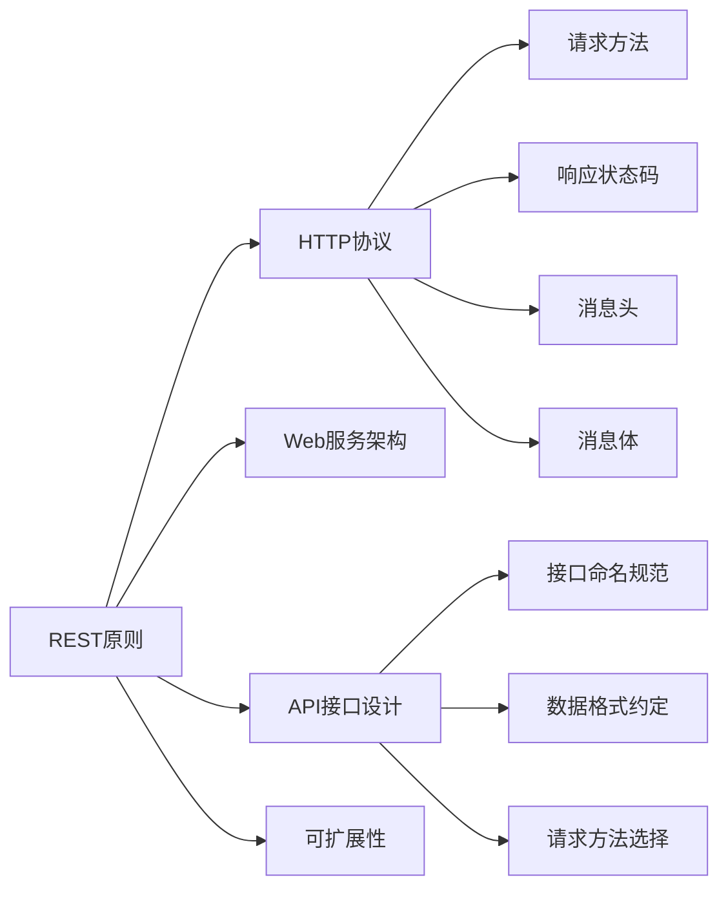

                 

# RESTful API设计：构建可扩展的Web服务

> 关键词：RESTful API, Web服务, HTTP协议, REST原则, RESTful设计, API设计原则, API接口设计, 可扩展性, Web应用架构, HTTP方法, 状态管理

## 1. 背景介绍

### 1.1 问题由来
随着互联网技术的飞速发展，Web服务的应用日益广泛。无论是电商、社交网络、金融科技，还是物联网、智能家居，各种场景下的Web应用都离不开通过API进行数据交换和交互。API设计的好坏直接影响到Web服务的用户体验和系统稳定性。

然而，现实中存在大量质量参差不齐的API，问题频发，如响应时间过长、接口设计不合理、数据格式不一致等，导致系统耦合度升高、维护难度增加、服务可靠性降低。

### 1.2 问题核心关键点
RESTful API作为一种流行的Web服务设计理念，强调接口设计的标准化、简洁化、可扩展性和健壮性。通过遵循REST原则，可以构建更加稳定、高效、易于维护的Web服务。

本文档将从背景介绍开始，系统性地介绍RESTful API设计的核心概念、技术细节和实际应用。

## 2. 核心概念与联系

### 2.1 核心概念概述

RESTful API设计的核心概念包括以下几个方面：

- **REST原则**：是一套指导API设计的规则和原则，包括资源定位、无状态通信、统一接口、缓存策略、层级结构等。
- **HTTP协议**：是RESTful API设计的基础通信协议，定义了客户端和服务器之间数据传输的规范。
- **Web服务架构**：是一种分布式计算模式，通过Web服务提供者发布可复用的服务，实现不同系统间的协同工作。
- **API接口设计**：是RESTful API设计的重要组成部分，包括接口命名规范、数据格式约定、请求方法选择等。
- **可扩展性**：是RESTful API设计的核心目标之一，通过接口设计满足未来业务变化的需求，提高系统灵活性。

这些概念之间存在紧密的联系，共同构成了RESTful API设计的完整框架。

### 2.2 核心概念原理和架构的 Mermaid 流程图



上述Mermaid流程图展示了RESTful API设计的核心概念及其联系：

1. REST原则和HTTP协议是API设计的理论基础。
2. Web服务架构和API接口设计是RESTful API实现的具体方式。
3. 可扩展性是RESTful API设计的最终目标。

## 3. 核心算法原理 & 具体操作步骤

### 3.1 算法原理概述

RESTful API设计的算法原理主要基于REST原则，即：

- **资源定位**：通过URL定义资源的位置和类型，每个URL对应一个资源。
- **无状态通信**：每次请求都是独立的，不依赖于之前的请求状态。
- **统一接口**：使用标准化的HTTP方法（如GET、POST、PUT、DELETE等）和状态码，保证接口一致性。
- **缓存策略**：通过缓存机制提高系统性能和响应速度，减少服务器负载。
- **层级结构**：将系统逻辑拆分为多个层次，各层次独立管理和维护。

### 3.2 算法步骤详解

RESTful API设计主要包括以下几个步骤：

**Step 1: 定义资源和URL**
- 明确系统资源，如用户、订单、文章等。
- 为每个资源设计唯一的URL，如`/users/{id}`、 `/orders/{id}`、 `/articles/{id}`。

**Step 2: 确定HTTP方法**
- 使用标准化的HTTP方法来处理不同操作，如`GET`用于获取资源，`POST`用于创建资源，`PUT`用于更新资源，`DELETE`用于删除资源。

**Step 3: 设计数据格式**
- 选择适当的JSON、XML等数据格式，用于数据传输。
- 定义数据结构，如用户信息的字段名、数据类型等。

**Step 4: 实现业务逻辑**
- 将业务逻辑封装在API层，实现接口调用。
- 使用Web框架如Flask、Django等，简化API开发过程。

**Step 5: 实现缓存和层级结构**
- 在API层实现缓存机制，如使用Redis缓存中间件。
- 设计系统层级结构，如将API层与业务层分离，提高系统灵活性。

### 3.3 算法优缺点

RESTful API设计的优点包括：

- **简洁性**：基于HTTP协议，标准统一，易于理解和实现。
- **可扩展性**：使用无状态通信和统一接口，适应未来业务变化。
- **可维护性**：分层设计，各层次独立维护，系统维护成本低。

缺点包括：

- **资源消耗**：需要维护大量URL和HTTP方法，资源消耗较大。
- **性能瓶颈**：由于每次请求都是独立的，性能可能受到网络延迟和服务器负载的影响。

### 3.4 算法应用领域

RESTful API设计广泛应用于各种Web服务系统，如电商、社交网络、金融科技等。通过设计合理的RESTful API，可以实现系统解耦、服务集成和数据交换，提高系统整体性能和稳定性。

## 4. 数学模型和公式 & 详细讲解 & 举例说明

### 4.1 数学模型构建

RESTful API设计的数学模型主要基于HTTP协议，使用标准的请求方法、状态码和消息格式。例如，`GET`方法的请求模型如下：

$$
\text{Request} = \{url, \text{Method} = GET, \text{Headers}, \text{Body}\}
$$

其中，`url`是资源定位URL，`Headers`是请求头，`Body`是请求体。响应模型的格式如下：

$$
\text{Response} = \{\text{Status Code}, \text{Headers}, \text{Body}\}
$$

### 4.2 公式推导过程

以一个简单的用户信息获取API为例，推导其请求和响应模型的公式。假设API的URL为`/users/{id}`，用户信息的请求体为JSON格式，示例如下：

请求模型：
$$
\text{Request} = \{\text{"url"}: "/users/{id}", \text{"Method"}: GET, \text{"Headers"}: {'Content-Type': 'application/json'}, \text{"Body"}: {"id": 123}\}
$$

响应模型：
$$
\text{Response} = \{\text{"Status Code"}: 200, \text{"Headers"}: {'Content-Type': 'application/json'}, \text{"Body"}: {"id": 123, "name": "John Doe", "age": 30}\}
$$

### 4.3 案例分析与讲解

假设有以下API接口设计需求：

- 获取用户信息：`GET /users/{id}`
- 创建用户信息：`POST /users`
- 更新用户信息：`PUT /users/{id}`
- 删除用户信息：`DELETE /users/{id}`

对应的RESTful API设计和实现示例如下：

```python
from flask import Flask, jsonify, request

app = Flask(__name__)

@app.route('/users', methods=['POST'])
def create_user():
    user_data = request.json
    # 实现业务逻辑，创建用户信息
    return jsonify(user_data), 201

@app.route('/users/<int:id>', methods=['GET', 'PUT', 'DELETE'])
def user_info(id):
    # 实现业务逻辑，获取/更新/删除用户信息
    user_data = {"id": id, "name": "John Doe", "age": 30}
    return jsonify(user_data), 200

if __name__ == '__main__':
    app.run(debug=True)
```

## 5. 项目实践：代码实例和详细解释说明

### 5.1 开发环境搭建

首先需要安装Flask，使用以下命令进行安装：

```bash
pip install flask
```

然后创建Python虚拟环境，并激活：

```bash
python3 -m venv myenv
source myenv/bin/activate
```

接着安装Flask所需的依赖包：

```bash
pip install gunicorn
pip install redis
```

### 5.2 源代码详细实现

以下是使用Flask实现RESTful API的代码示例：

```python
from flask import Flask, jsonify, request

app = Flask(__name__)

@app.route('/users', methods=['POST'])
def create_user():
    user_data = request.json
    # 实现业务逻辑，创建用户信息
    return jsonify(user_data), 201

@app.route('/users/<int:id>', methods=['GET', 'PUT', 'DELETE'])
def user_info(id):
    # 实现业务逻辑，获取/更新/删除用户信息
    user_data = {"id": id, "name": "John Doe", "age": 30}
    return jsonify(user_data), 200

if __name__ == '__main__':
    app.run(debug=True)
```

在上述代码中，使用`@app.route`装饰器定义了RESTful API的URL和HTTP方法，使用`jsonify`函数处理请求和响应。

### 5.3 代码解读与分析

在代码实现中，需要注意以下几点：

- `@app.route`装饰器的URL参数，使用`<int:id>`表示该参数为整数类型，`/<int:id>`表示路径变量。
- `request.json`用于获取请求体的JSON数据，`request.args`用于获取查询参数。
- 使用`jsonify`函数将数据序列化为JSON格式，返回HTTP响应。

### 5.4 运行结果展示

启动Flask应用，通过浏览器或Postman工具测试API接口：

- 创建用户：`POST /users`，请求体为JSON格式`{"id": 123, "name": "John Doe", "age": 30}`。
- 获取用户信息：`GET /users/123`。
- 更新用户信息：`PUT /users/123`，请求体为JSON格式`{"name": "Jane Doe", "age": 25}`。
- 删除用户信息：`DELETE /users/123`。

运行结果如下：

```
HTTP/1.1 201 Created
Content-Type: application/json

{"id": 123, "name": "John Doe", "age": 30}

HTTP/1.1 200 OK
Content-Type: application/json

{"id": 123, "name": "John Doe", "age": 30}

HTTP/1.1 200 OK
Content-Type: application/json

{"id": 123, "name": "Jane Doe", "age": 25}

HTTP/1.1 204 No Content
```

## 6. 实际应用场景

### 6.1 智能推荐系统

智能推荐系统需要根据用户的历史行为数据，实时推荐商品、新闻等。RESTful API设计可以满足这一需求，通过API获取用户信息和商品数据，进行数据交换和模型推理，实现个性化推荐。

假设推荐系统需要查询用户ID为123的用户信息，可以使用以下API：

```
GET /recommend/users/123
```

返回用户ID、浏览记录、购买记录等数据，推荐系统根据这些数据进行个性化推荐。

### 6.2 在线教育平台

在线教育平台需要实时推送课程、作业等信息给学生和教师，RESTful API设计可以实现这一需求。通过API实现教师发布课程、学生提交作业、教师批改作业等操作，保证信息传输的准确性和及时性。

假设教师需要发布一节新的在线课程，可以使用以下API：

```
POST /courses
Content-Type: application/json

{
    "name": "Python基础",
    "description": "Python编程基础",
    "duration": "3小时",
    "teacher_id": 123
}
```

返回课程ID，教师可以在系统中查看和管理课程。

### 6.3 电子商务平台

电子商务平台需要支持用户下单、支付、物流跟踪等功能，RESTful API设计可以实现这一需求。通过API实现用户下单、订单管理、支付支付、物流跟踪等操作，保证订单处理的流畅性和安全性。

假设用户需要查询订单状态，可以使用以下API：

```
GET /orders/{id}
```

返回订单状态、物流信息等数据，用户可以实时了解订单进展。

### 6.4 未来应用展望

随着RESTful API设计的不断演进，未来RESTful API的应用将更加广泛。以下是一些未来应用展望：

- **微服务架构**：RESTful API可以支持微服务架构，实现系统解耦和服务的细粒度管理。
- **API网关**：RESTful API可以与API网关结合，实现API聚合、路由、安全、监控等功能。
- **API版本管理**：RESTful API可以支持版本管理，满足不同版本的API接口需求。
- **API缓存**：RESTful API可以结合缓存技术，提高系统性能和响应速度。

## 7. 工具和资源推荐

### 7.1 学习资源推荐

为了帮助开发者系统掌握RESTful API设计，这里推荐一些优质的学习资源：

- **Flask官方文档**：Flask官网提供的详细文档，包括RESTful API设计的教程、示例和最佳实践。
- **RESTful API设计与微服务架构**：中国计算机学会推荐读物，介绍RESTful API设计的原理和实践。
- **RESTful API设计指南**：《API设计指南》一书，详细介绍了RESTful API设计的规范和最佳实践。
- **API设计规范与最佳实践**：《API设计规范与最佳实践》一书，介绍了RESTful API设计的规范和最佳实践。
- **RESTful API设计教程**：《RESTful API设计教程》课程，讲解RESTful API设计的原理和实践。

### 7.2 开发工具推荐

以下是几款用于RESTful API开发的常用工具：

- **Flask**：Python编写的Web框架，简单易用，适合初学者和快速原型开发。
- **Django**：Python编写的全栈Web框架，功能强大，适合开发复杂的Web应用。
- **RESTClient**：Postman的RESTful API测试工具，支持HTTP请求的模拟和测试。
- **Swagger**：API文档工具，用于生成API文档和接口测试。
- **Postman**：API测试工具，支持HTTP请求的模拟和测试，与Swagger结合使用。

### 7.3 相关论文推荐

RESTful API设计的研究方兴未艾，以下是几篇奠基性的相关论文，推荐阅读：

- **REST: Architectural Styles and Representations for Hypermedia Systems**：REST架构的提出者Roy Fielding教授的研究论文，奠定了RESTful API设计的理论基础。
- **RESTful Web Services**：《RESTful Web Services》一书，由Roy Fielding教授等人编写，详细介绍了RESTful API设计的规范和实践。
- **RESTful API Design for Smartphones**：Smartphones应用程序的RESTful API设计规范，针对移动设备的特性进行了优化。
- **RESTful API Design in the Cloud**：Cloud环境的RESTful API设计规范，针对云环境的特性进行了优化。
- **API-First Design**：《API-First Design》一书，由Bryson Rechardt编写，介绍了API优先的设计理念和实践。

## 8. 总结：未来发展趋势与挑战

### 8.1 研究成果总结

本文系统性地介绍了RESTful API设计的核心概念、技术细节和实际应用。主要包括以下内容：

- **REST原则**：定义RESTful API设计的基本规则和原则。
- **HTTP协议**：阐述HTTP协议在RESTful API设计中的应用。
- **Web服务架构**：介绍RESTful API设计的实现方式。
- **API接口设计**：讲解RESTful API设计的接口命名规范、数据格式约定、请求方法选择等。
- **可扩展性**：阐述RESTful API设计的扩展性目标和实现方式。

### 8.2 未来发展趋势

未来RESTful API设计的趋势主要包括以下几个方面：

- **API网关和API聚合**：RESTful API可以与API网关结合，实现API聚合、路由、安全、监控等功能。
- **API缓存和负载均衡**：RESTful API可以结合缓存技术，提高系统性能和响应速度。
- **API版本管理**：RESTful API可以支持版本管理，满足不同版本的API接口需求。
- **API设计和文档工具**：API设计和文档工具可以自动化生成API文档和接口测试，提高开发效率。

### 8.3 面临的挑战

RESTful API设计虽然具有诸多优点，但也面临以下挑战：

- **接口复杂度**：RESTful API设计需要定义大量URL和HTTP方法，接口复杂度较高。
- **性能瓶颈**：RESTful API设计中的HTTP请求需要经过多次网络传输，性能可能受到网络延迟和服务器负载的影响。
- **安全性问题**：RESTful API设计需要考虑安全性问题，如防止SQL注入、跨站脚本攻击等。

### 8.4 研究展望

未来RESTful API设计的研究方向主要包括以下几个方面：

- **API设计和微服务架构**：RESTful API设计可以支持微服务架构，实现系统解耦和服务的细粒度管理。
- **API缓存和负载均衡**：RESTful API可以结合缓存技术，提高系统性能和响应速度。
- **API版本管理和文档工具**：RESTful API可以支持版本管理，满足不同版本的API接口需求，API设计和文档工具可以自动化生成API文档和接口测试，提高开发效率。

## 9. 附录：常见问题与解答

**Q1: RESTful API设计是否适用于所有Web服务场景？**

A: RESTful API设计适用于大部分Web服务场景，特别是在数据传输和信息交换方面。但对于一些实时性要求高的场景，如游戏、实时聊天等，RESTful API可能不是最佳选择，需要结合其他技术实现。

**Q2: RESTful API设计是否需要考虑安全性问题？**

A: 是的，RESTful API设计需要考虑安全性问题，如防止SQL注入、跨站脚本攻击等。可以通过设计合理的接口规则、使用HTTPS协议、设置访问控制等方式来增强API安全性。

**Q3: RESTful API设计是否需要考虑性能瓶颈？**

A: 是的，RESTful API设计需要考虑性能瓶颈，如网络延迟、服务器负载等问题。可以通过设计合理的缓存机制、优化HTTP请求、使用CDN等方式来提高系统性能。

**Q4: RESTful API设计是否需要考虑扩展性问题？**

A: 是的，RESTful API设计需要考虑扩展性问题，以便应对未来业务变化的需求。可以通过设计合理的接口规范、使用API网关等方式来提高系统灵活性和可维护性。

通过本文的系统梳理，可以看到，RESTful API设计是Web服务设计的重要组成部分，通过遵循REST原则和HTTP协议，可以构建更加稳定、高效、易于维护的Web服务。未来RESTful API设计需要与API网关、API缓存、API版本管理等技术相结合，实现更加全面的系统设计和开发。只有不断探索和创新，才能真正实现RESTful API设计的价值和潜力。

---

作者：禅与计算机程序设计艺术 / Zen and the Art of Computer Programming

