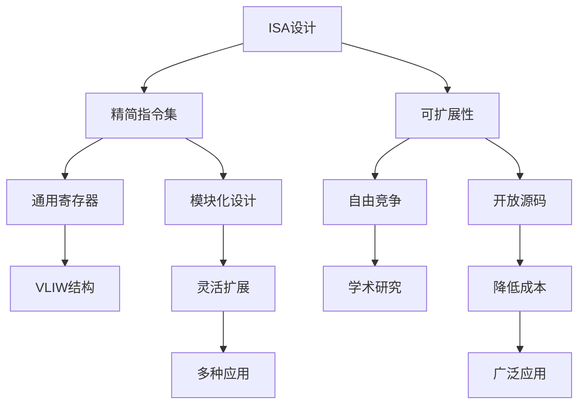

                 

# RISC-V 指令集架构：开源处理

## 1. 背景介绍

### 1.1 问题由来
随着处理器技术的快速发展，指令集架构（ISA）的重要性愈发凸显。主流架构如x86和ARM因其广泛的应用和良好的性能优化，成为工业界的主流选择。然而，x86和ARM的知识产权归特定公司所有，开发和应用受到一定限制。相比之下，开源指令集RISC-V在实现处理器自由竞争、促进学术研究、降低应用成本等方面具有显著优势，逐渐成为处理器架构发展的新方向。

### 1.2 问题核心关键点
RISC-V指令集架构的核心理念在于“简单、高效、可扩展”。它由加州大学伯克利分校在2010年提出，旨在提供一套高性能、低功耗、可定制的开放指令集。RISC-V的核心创新包括：
- 采用精简的指令集，降低设计和开发难度。
- 提供模块化和可扩展的设计，支持多种应用场景。
- 采用通用寄存器和VLIW（Very Long Instruction Word）结构，提高处理器的效率。

本文将详细介绍RISC-V指令集架构的设计原理、实现方法和应用领域，并探讨其在开源处理技术中的前沿进展和未来趋势。

## 2. 核心概念与联系

### 2.1 核心概念概述

RISC-V架构的核心理念在于“精简、灵活、开放”。其核心设计原则包括：
- 精简指令集：去除复杂指令，只保留最常用、最基本的操作。
- 模块化设计：采用模块化的设计理念，支持处理器功能的灵活扩展。
- 可扩展性：提供多种扩展方式，满足不同应用场景的需求。
- 开放源码：完全开源，任何人都可以自由使用和修改。

### 2.2 核心概念原理和架构的 Mermaid 流程图



## 3. 核心算法原理 & 具体操作步骤
### 3.1 算法原理概述

RISC-V指令集架构的设计基于如下原则：
- **精简指令集设计**：去除复杂指令，只保留常用基本操作。
- **VLIW架构**：采用非常长指令字（Very Long Instruction Word）结构，提高指令执行效率。
- **模块化设计**：指令集分为标准指令集和自定义扩展，支持灵活扩展。

### 3.2 算法步骤详解

1. **精简指令集设计**：
   RISC-V架构采用精简指令集，只保留最常用和基本的操作。这大大降低了设计的复杂性，也提高了指令的执行效率。
   - **整数指令集**：支持算术、逻辑、移位等基本操作。
   - **浮点指令集**：支持浮点运算、向量运算等操作。
   - **内存管理指令集**：支持虚拟内存、内存保护等高级操作。

2. **VLIW架构**：
   RISC-V架构采用VLIW结构，允许在一个指令周期内执行多个操作。这显著提高了指令的并行性和执行效率。
   - **多操作并行**：在一个时钟周期内执行多个操作，减少延迟。
   - **固定长度指令**：指令长度固定，提高编译效率。

3. **模块化设计**：
   RISC-V架构支持模块化设计，指令集分为标准指令集和自定义扩展。这使得处理器功能可以灵活扩展，满足不同应用场景的需求。
   - **标准指令集**：包括基础整数和浮点指令，支持通用处理器的基本功能。
   - **自定义扩展**：支持多种扩展，如I、M、E、C等。

### 3.3 算法优缺点

**优点**：
- **灵活扩展**：支持多种扩展，灵活适应不同应用场景。
- **低功耗**：精简指令集和VLIW结构降低功耗。
- **开放源码**：完全开源，降低应用成本。
- **高性能**：VLIW结构和多操作并行提高执行效率。

**缺点**：
- **生态系统不完善**：相比x86和ARM，RISC-V生态系统相对不完善，应用工具链和软件库较少。
- **硬件设计复杂**：模块化和可扩展设计增加了硬件设计的复杂性。

### 3.4 算法应用领域

RISC-V架构在多个应用领域表现出显著的优势：
- **嵌入式系统**：低功耗、高性能、可扩展的特点，使其成为物联网、智能穿戴等嵌入式系统的理想选择。
- **高性能计算**：VLIW结构和模块化设计支持高性能计算，适用于数据中心、人工智能等领域。
- **教育研究**：完全开源的特性，使其成为学术研究和教学的理想平台。
- **工业控制**：支持定制化扩展，满足不同工业控制场景的需求。

## 4. 数学模型和公式 & 详细讲解 & 举例说明

### 4.1 数学模型构建

RISC-V指令集架构的数学模型主要基于指令集的定义和操作。其核心数学模型包括：
- **指令集模型**：定义了指令集的基本结构和操作。
- **操作码模型**：定义了指令的操作码和功能。
- **寄存器模型**：定义了通用寄存器和专用寄存器的操作。

### 4.2 公式推导过程

以RISC-V架构中的整数加法指令为例，其指令格式为：
$$
\text{ADD} \quad R\text{D}, R\text{S}, R\text{T}
$$
其中，R\text{D}为结果寄存器，R\text{S}和R\text{T}为操作数寄存器。其执行过程可以表示为：
$$
\text{ADD}_{R\text{D}}(\text{R\text{S}}, \text{R\text{T}})
$$

### 4.3 案例分析与讲解

以下是一个简单的RISC-V指令集案例分析：
- **指令格式**：假设有一个加法指令，其格式为 $\text{ADD}$，其中 $\text{R\text{D}}$ 为结果寄存器，$\text{R\text{S}}$ 和 $\text{R\text{T}}$ 为操作数寄存器。
- **执行过程**：指令执行时，将 $\text{R\text{S}}$ 和 $\text{R\text{T}}$ 中的值相加，并将结果存入 $\text{R\text{D}}$ 寄存器。

## 5. 项目实践：代码实例和详细解释说明

### 5.1 开发环境搭建

1. **安装RISC-V工具链**：
   ```
   git clone https://github.com/riscv/riscv-isa-manual.git
   cd riscv-isa-manual
   make
   ```

2. **配置开发环境**：
   ```
   export RISCV_ROOT=$(pwd)
   export PATH=$PATH:$RISCV_ROOT/tools/riscv64-unknown-linux-gnu/bin
   ```

### 5.2 源代码详细实现

以下是一个简单的RISC-V汇编程序示例：

```assembly
.text
main:
    la  s0, s1   # Load immediate to s0
    add s1, s0, s2
    ret
.data
s0: .word 0
s1: .word 10
s2: .word 5
```

### 5.3 代码解读与分析

- **la指令**：Load Address，将立即数加载到寄存器中。
- **add指令**：Add，将两个寄存器的值相加。
- **ret指令**：Return，退出函数。

## 6. 实际应用场景

### 6.1 嵌入式系统

RISC-V架构的低功耗、高性能和可扩展性，使其成为物联网、智能穿戴等嵌入式系统的理想选择。嵌入式系统对功耗和成本有严格要求，RISC-V架构的精简指令集和低功耗设计，使其成为理想的选择。

### 6.2 高性能计算

RISC-V架构的VLIW结构和模块化设计，支持高性能计算。RISC-V架构的高执行效率和灵活扩展能力，使其适用于数据中心、人工智能等领域。

### 6.3 教育研究

RISC-V架构的完全开源特性，使其成为学术研究和教学的理想平台。学生和研究人员可以自由使用和修改RISC-V架构，进行教学和研究。

### 6.4 工业控制

RISC-V架构支持多种扩展，满足不同工业控制场景的需求。其模块化和可扩展设计，使得工业控制处理器可以根据具体需求进行定制化设计。

## 7. 工具和资源推荐

### 7.1 学习资源推荐

1. **RISC-V官方文档**：RISC-V架构的官方文档，包含详细的架构和指令集定义。
2. **RISC-V官方邮件列表**：RISC-V社区的邮件列表，可以获取最新的技术进展和讨论。
3. **RISC-V中国联盟**：RISC-V社区在中国的联盟，提供最新的技术资源和应用案例。

### 7.2 开发工具推荐

1. **QEMU**：开源的虚拟化工具，支持RISC-V架构的虚拟机模拟。
2. **Chisel**：用于硬件设计和验证的开源工具，支持RISC-V架构的硬件设计和验证。
3. **Virtuoso**：用于硬件设计的EDA工具，支持RISC-V架构的硬件设计。

### 7.3 相关论文推荐

1. **RISC-V: A New Instruction Set Architecture**：RISC-V架构的原始论文，详细介绍了RISC-V架构的设计理念和特点。
2. **RISC-V Instruction Set Architecture**：RISC-V架构的官方文档，详细介绍了RISC-V架构的指令集和操作。
3. **RISC-V Architecture Extensions**：RISC-V架构的扩展文档，详细介绍了RISC-V架构的扩展方式和功能。

## 8. 总结：未来发展趋势与挑战

### 8.1 研究成果总结

RISC-V架构自2010年提出以来，已经逐渐成为处理器架构发展的新方向。其精简指令集、VLIW结构和模块化设计，使其在嵌入式系统、高性能计算、教育研究、工业控制等领域表现出色。

### 8.2 未来发展趋势

1. **生态系统完善**：随着RISC-V生态系统的不断完善，更多的应用工具链和软件库将被开发出来，进一步推动RISC-V架构的应用。
2. **硬件性能提升**：随着硬件设计的不断进步，RISC-V架构的性能将进一步提升，支持更复杂和高性能的应用场景。
3. **开源社区活跃**：RISC-V架构的开源特性，将吸引更多开发者和研究人员的加入，推动RISC-V架构的持续发展。

### 8.3 面临的挑战

1. **生态系统不完善**：相比x86和ARM，RISC-V生态系统相对不完善，应用工具链和软件库较少。
2. **硬件设计复杂**：模块化和可扩展设计增加了硬件设计的复杂性。
3. **性能优化难度**：在支持低功耗和可扩展性的同时，如何保持高性能仍然是一个挑战。

### 8.4 研究展望

未来，RISC-V架构将会在以下几个方面取得新的进展：
1. **硬件优化**：进一步优化硬件设计，支持更高效和更复杂的应用场景。
2. **软件生态建设**：完善RISC-V架构的软件生态，支持更多的应用场景。
3. **国际合作**：加强与国际社会的合作，推动RISC-V架构的全球化发展。

## 9. 附录：常见问题与解答

### 常见问题

**Q1：RISC-V架构的优缺点有哪些？**

A: RISC-V架构的优点包括低功耗、高性能、可扩展和开放源码。缺点包括生态系统不完善和硬件设计复杂。

**Q2：RISC-V架构如何应用于高性能计算？**

A: RISC-V架构的VLIW结构和模块化设计，支持高性能计算。通过优化指令和硬件设计，可以在数据中心、人工智能等领域实现高性能计算。

**Q3：RISC-V架构的未来发展趋势是什么？**

A: RISC-V架构的未来发展趋势包括生态系统完善、硬件性能提升和开源社区活跃。

**Q4：RISC-V架构在嵌入式系统中的应用有哪些？**

A: RISC-V架构的低功耗和可扩展性，使其成为物联网、智能穿戴等嵌入式系统的理想选择。

---

作者：禅与计算机程序设计艺术 / Zen and the Art of Computer Programming

