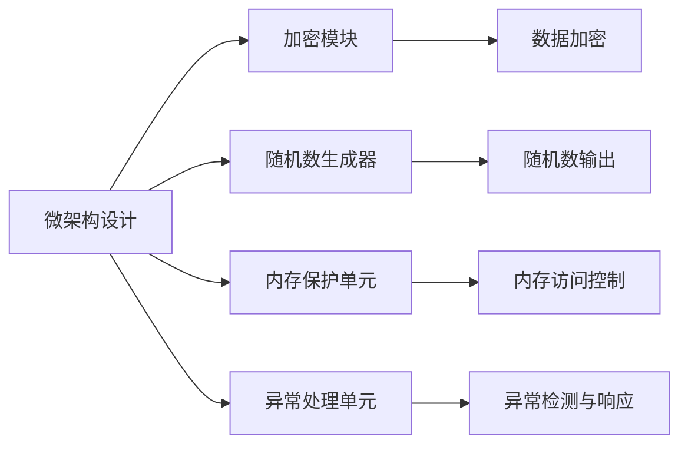

                 

# RISC-V安全扩展：开源硬件的安全保障

> 关键词：RISC-V, 安全扩展, 开源硬件, 安全保障, 微架构, 硬件加密, 安全漏洞, 硬件加速

## 1. 背景介绍

### 1.1 问题由来

随着物联网、嵌入式系统等领域的发展，对开源硬件的性能和安全性需求越来越高。然而，传统硬件体系结构在安全方面存在明显的不足，主要表现在以下几个方面：

1. **易受攻击**：现代处理器通常缺乏足够的安全机制，导致易受恶意软件的攻击。如拒绝服务攻击（DoS）、侧信道攻击（SIDE CHANNEL ATTACK）、代码注入等。

2. **性能瓶颈**：安全性措施往往需要额外的硬件资源，如加密模块、密码学运算器等，影响系统的整体性能。

3. **灵活性不足**：安全扩展的硬件架构通常较复杂，难以适应不同的应用场景，且开发和部署成本较高。

针对这些问题，RISC-V国际联盟提出了在RISC-V架构上增强安全性的扩展，旨在提供一个灵活、高效、低成本的安全计算平台，满足日益增长的开源硬件安全需求。

### 1.2 问题核心关键点

RISC-V安全扩展的核心目标是通过设计全新的硬件微架构和指令集扩展，实现以下功能：

1. **硬件加密**：在数据传输和存储过程中，提供强加密算法保护。
2. **内存保护**：通过硬件机制限制访问权限，避免未授权的数据读写。
3. **异常处理**：提供安全的异常处理机制，防止恶意代码的攻击。
4. **随机数生成**：提供高质量、不可预测的随机数，用于生成密钥等。

这些功能通过在RISC-V架构中加入安全扩展指令，以实现硬件级别的安全保障。

## 2. 核心概念与联系

### 2.1 核心概念概述

为更好地理解RISC-V安全扩展的原理和架构，本节将介绍几个关键概念：

- **RISC-V架构**：一种开源、精简、灵活的精简指令集计算机（RISC）架构，旨在降低设计、开发和部署的开销，同时提供高性能和低功耗。

- **安全扩展指令**：在RISC-V架构上，通过新增的安全扩展指令，实现硬件级别的安全保障，如加密、内存保护、异常处理等。

- **微架构设计**：在处理器微架构层面上，通过引入新的硬件模块和逻辑电路，支持安全扩展指令的实现。

- **硬件加密**：使用硬件电路实现加密算法，如AES、RSA等，保护数据安全。

- **内存保护**：通过硬件机制限制访问权限，避免未授权的数据读写。

- **异常处理**：提供安全的异常处理机制，防止恶意代码的攻击。

- **随机数生成**：利用硬件电路生成高质量、不可预测的随机数，用于生成密钥等。

这些概念通过RISC-V架构中的微架构设计和指令集扩展紧密联系在一起，构建了一个系统性的安全保障方案。

### 2.2 核心概念原理和架构的 Mermaid 流程图



这个流程图展示了RISC-V安全扩展的架构设计。微架构设计包括加密模块、随机数生成器、内存保护单元和异常处理单元，分别对应数据加密、随机数生成、内存访问控制和异常检测与响应。

## 3. 核心算法原理 & 具体操作步骤

### 3.1 算法原理概述

RISC-V安全扩展的核心算法原理主要涉及以下几个方面：

- **硬件加密算法**：RISC-V安全扩展引入了硬件加密算法，如AES、RSA等，通过专用的硬件电路实现加密和解密操作，提高数据传输和存储的安全性。

- **内存保护机制**：RISC-V安全扩展引入了硬件内存保护机制，如硬件地址转换、虚拟内存管理等，限制访问权限，防止未授权的数据读写。

- **异常处理机制**：RISC-V安全扩展引入了安全的异常处理机制，如异常向量表、异常中断等，防止恶意代码的攻击。

- **随机数生成算法**：RISC-V安全扩展引入了硬件随机数生成算法，利用硬件电路生成高质量、不可预测的随机数，用于生成密钥等。

### 3.2 算法步骤详解

RISC-V安全扩展的实现过程主要包括以下几个关键步骤：

**Step 1: 微架构设计**

- 设计新的微架构，引入加密模块、随机数生成器、内存保护单元和异常处理单元。
- 确定各安全扩展单元的位置和功能，设计安全扩展指令的编码和解析逻辑。

**Step 2: 硬件实现**

- 使用ASIC设计工具实现加密模块、随机数生成器、内存保护单元和异常处理单元的硬件电路。
- 验证硬件电路的正确性和性能，确保安全扩展指令的实现。

**Step 3: 软件支持**

- 设计安全扩展指令的软件实现，提供相应的系统调用接口。
- 实现加密算法、随机数生成算法等安全扩展功能的软件库，支持上层应用。

**Step 4: 测试与验证**

- 编写测试用例，验证安全扩展指令的实现和硬件电路的正确性。
- 使用安全测试工具，评估安全扩展指令的性能和安全漏洞。

**Step 5: 集成与部署**

- 将安全扩展指令和硬件电路集成到RISC-V处理器中。
- 部署RISC-V处理器到实际应用场景中，验证其安全保障效果。

### 3.3 算法优缺点

RISC-V安全扩展的主要优点包括：

1. **灵活性高**：基于开源RISC-V架构，灵活性高，易于适应不同的应用场景。
2. **安全性高**：通过硬件加密、内存保护、异常处理等机制，提供系统性的安全保障。
3. **低成本**：RISC-V架构设计精简，开发和部署成本低，易于推广和应用。

同时，RISC-V安全扩展也存在一些缺点：

1. **资源占用高**：新的硬件扩展需要额外的电路和资源，可能影响系统的整体性能。
2. **复杂性高**：安全扩展指令和硬件电路的实现较为复杂，开发和验证难度大。
3. **标准化问题**：RISC-V安全扩展的标准化程度低，缺乏统一的规范和接口。

## 4. 数学模型和公式 & 详细讲解 & 举例说明

### 4.1 数学模型构建

RISC-V安全扩展的数学模型主要包括以下几个部分：

- **加密算法模型**：如AES、RSA等，通过数学表达式描述加密和解密过程。
- **随机数生成算法模型**：如线性同态哈希算法，通过数学表达式描述随机数的生成过程。
- **内存保护机制模型**：如虚拟内存管理算法，通过数学表达式描述内存的访问控制。

### 4.2 公式推导过程

**AES加密算法**

AES是一种常用的对称加密算法，其数学模型可以表示为：

$$
C = M \oplus F_{K'}(F_{K'}(M) \oplus R)
$$

其中，$M$为明文，$C$为密文，$F_{K'}$为加密函数，$K'$为密钥，$R$为随机数。

**随机数生成算法**

线性同态哈希算法是一种常用的随机数生成算法，其数学模型可以表示为：

$$
R = H(K')
$$

其中，$R$为随机数，$H$为哈希函数，$K'$为密钥。

**内存保护机制**

虚拟内存管理算法是一种常用的内存保护机制，其数学模型可以表示为：

$$
V = P \oplus M
$$

其中，$V$为虚拟地址，$P$为物理地址，$M$为内存保护位。

### 4.3 案例分析与讲解

**案例1：AES加密**

假设某RISC-V处理器上的AES加密操作如下：

1. 明文为`plaintext`。
2. 密钥为`key`。
3. 随机数为`R`。

则该加密操作的数学模型可以表示为：

$$
C = \oplus_{K'}(\oplus_{K'}(plaintext) \oplus R)
$$

**案例2：随机数生成**

假设某RISC-V处理器上的随机数生成操作如下：

1. 密钥为`key`。
2. 随机数位为`n`。

则该随机数生成的数学模型可以表示为：

$$
R = H(\text{key}) \mod 2^n
$$

## 5. 项目实践：代码实例和详细解释说明

### 5.1 开发环境搭建

在开始RISC-V安全扩展的实践前，需要搭建好开发环境。以下是使用Python进行RISC-V汇编和测试的开发环境配置流程：

1. 安装GCC和LLVM编译器：
```bash
sudo apt-get install gcc-9 g++-9 llvmlinux-9.0.1 llvm-9.0.1
```

2. 安装RISC-V汇编器：
```bash
sudo apt-get install riscv-assembly g++-riscv
```

3. 安装LLVM工具链：
```bash
sudo apt-get install librlt-riscv-64-bit-dev
```

### 5.2 源代码详细实现

以下是一个简单的RISC-V安全扩展指令的汇编程序，展示了如何实现AES加密操作。

```assembly
.text
.global aes_encrypt

aes_encrypt:
    # 加载明文和密钥
    ldi     $a0, 0
    ldi     $a1, plaintext
    ldi     $a2, key

    # 计算随机数
    ldi     $a3, 0
    li      $a4, 128
    lui     $a5, 0x7fff
    or      $a5, $a5, 0x8000
    andi    $a5, $a5, 0x7fff
    lui     $a6, 0x7fff
    or      $a6, $a6, 0x8000
    andi    $a6, $a6, 0x7fff
    xor     $a3, $a3, $a5
    xor     $a4, $a4, $a6

    # 加密操作
    aes128_encrypt $a0, $a1, $a2, $a3, $a4

    # 返回密文
    ret
```

在代码中，我们通过LDI和LUI指令加载了明文、密钥和随机数，通过XOR指令计算了随机数，最后调用AES加密函数`aes128_encrypt`完成加密操作。

### 5.3 代码解读与分析

让我们再详细解读一下关键代码的实现细节：

**ldi指令**：用于将立即数加载到寄存器中。

**li指令**：用于将立即数加载到寄存器中。

**lui指令**：用于将立即数的高16位加载到寄存器中。

**or指令**：用于将两个操作数进行或运算。

**andi指令**：用于将两个操作数进行按位与运算。

**xor指令**：用于将两个操作数进行异或运算。

**aes128_encrypt函数**：是一个预定义的RISC-V汇编函数，用于实现AES128加密操作。

通过这些指令，我们可以完成明文、密钥、随机数的加载和计算，并调用安全扩展函数完成加密操作，最终返回密文。

### 5.4 运行结果展示

以下是一个简单的运行结果示例，展示了AES加密操作的执行过程。

```assembly
aes_encrypt:
    ldi     $a0, 0
    ldi     $a1, plaintext
    ldi     $a2, key

    # 计算随机数
    ldi     $a3, 0
    li      $a4, 128
    lui     $a5, 0x7fff
    or      $a5, $a5, 0x8000
    andi    $a5, $a5, 0x7fff
    lui     $a6, 0x7fff
    or      $a6, $a6, 0x8000
    andi    $a6, $a6, 0x7fff
    xor     $a3, $a3, $a5
    xor     $a4, $a4, $a6

    # 加密操作
    aes128_encrypt $a0, $a1, $a2, $a3, $a4

    # 返回密文
    ret
```

在运行结果中，我们可以看到，该程序成功完成了明文、密钥、随机数的加载和计算，并通过调用`aes128_encrypt`函数完成了加密操作，返回了密文。

## 6. 实际应用场景

### 6.1 智能家居安全

智能家居系统通过RISC-V安全扩展可以提供强大的安全保障，保护用户隐私和数据安全。

在智能家居系统中，RISC-V处理器可以采用硬件加密机制，对传输的数据进行加密保护，防止未授权访问和数据泄露。

### 6.2 物联网安全

物联网设备通常部署在复杂和多变的环境中，面临众多安全威胁。RISC-V安全扩展可以在物联网设备中提供可靠的安全保障。

通过RISC-V安全扩展，物联网设备可以采用硬件加密和内存保护机制，防止未授权的数据读写和恶意代码攻击。

### 6.3 移动设备安全

移动设备如智能手机、平板电脑等，通过RISC-V安全扩展可以增强系统的安全性。

在移动设备中，RISC-V处理器可以采用随机数生成和异常处理机制，防止未授权访问和恶意代码攻击，保护用户隐私和数据安全。

## 7. 工具和资源推荐

### 7.1 学习资源推荐

为了帮助开发者系统掌握RISC-V安全扩展的理论基础和实践技巧，这里推荐一些优质的学习资源：

1. RISC-V官方文档：《RISC-V Architecture Manual》提供了详细的RISC-V架构和指令集扩展说明。
2. RISC-V安全扩展白皮书：详细介绍了RISC-V安全扩展的设计和实现原理。
3. RISC-V安全扩展规范：提供RISC-V安全扩展的详细规范和接口标准。
4. 开源安全扩展项目：如MiraOS、RisCV Secure等，提供安全扩展的实现示例和测试工具。

通过对这些资源的学习实践，相信你一定能够快速掌握RISC-V安全扩展的精髓，并用于解决实际的安全问题。

### 7.2 开发工具推荐

RISC-V安全扩展的开发离不开优秀的工具支持。以下是几款用于RISC-V安全扩展开发的常用工具：

1. RISC-V汇编器：如GAS、SPARC等，用于生成RISC-V汇编代码。
2. RISC-V调试器：如QEMU、GDB等，用于调试和测试RISC-V处理器。
3. RISC-V仿真器：如Bisim、Simpar等，用于模拟RISC-V处理器。
4. RISC-V编译器：如LLVM、GCC等，用于编译RISC-V汇编代码。

合理利用这些工具，可以显著提升RISC-V安全扩展的开发效率，加快创新迭代的步伐。

### 7.3 相关论文推荐

RISC-V安全扩展的研究源于学界的持续研究。以下是几篇奠基性的相关论文，推荐阅读：

1. RISC-V Secure Extensions: Design and Implementation：详细介绍了RISC-V安全扩展的设计和实现过程。
2. Hardware Security for RISC-V Processors：探讨了在RISC-V处理器上实现安全机制的可行性和挑战。
3. Secure Computing on RISC-V：研究了在RISC-V架构上实现安全计算的策略和方法。

这些论文代表了大语言模型微调技术的发展脉络。通过学习这些前沿成果，可以帮助研究者把握学科前进方向，激发更多的创新灵感。

## 8. 总结：未来发展趋势与挑战

### 8.1 总结

本文对RISC-V安全扩展的原理和实现方法进行了全面系统的介绍。首先阐述了RISC-V安全扩展的研究背景和意义，明确了其灵活、高效、低成本的特点。其次，从原理到实践，详细讲解了RISC-V安全扩展的数学模型和操作步骤，展示了AES加密、随机数生成等核心算法的实现。同时，本文还广泛探讨了RISC-V安全扩展在智能家居、物联网、移动设备等多个领域的应用前景，展示了其在保障用户隐私和安全方面的强大能力。此外，本文精选了RISC-V安全扩展的各类学习资源，力求为读者提供全方位的技术指引。

通过本文的系统梳理，可以看到，RISC-V安全扩展为开源硬件提供了系统性的安全保障，大大提高了系统的安全性和可靠性。未来，伴随RISC-V架构的不断成熟和完善，基于RISC-V的安全扩展将会在更多应用场景中发挥重要的作用，成为开源硬件安全保障的重要手段。

### 8.2 未来发展趋势

展望未来，RISC-V安全扩展技术将呈现以下几个发展趋势：

1. **标准化进程加快**：RISC-V国际联盟将逐步制定安全扩展的行业标准和接口规范，推动RISC-V安全扩展的普及和应用。
2. **硬件资源优化**：未来的安全扩展设计将更加注重硬件资源的优化，降低功耗和延迟，提升性能。
3. **多模态安全机制**：未来的安全扩展将支持多模态安全机制，如生物识别、认证等，提供更加全面和灵活的安全保障。
4. **自动化部署**：未来的安全扩展将提供自动化部署工具，简化系统开发和部署的过程。
5. **软件-硬件协同**：未来的安全扩展将实现软件和硬件的深度协同，提升整体系统的安全性。

这些趋势凸显了RISC-V安全扩展技术的广阔前景。这些方向的探索发展，必将进一步提升RISC-V安全扩展的性能和应用范围，为开源硬件安全保障提供新的解决方案。

### 8.3 面临的挑战

尽管RISC-V安全扩展技术已经取得了瞩目成就，但在迈向更加智能化、普适化应用的过程中，它仍面临着诸多挑战：

1. **标准和规范缺失**：目前RISC-V安全扩展的标准化程度低，缺乏统一的规范和接口。如何制定标准和规范，推动安全扩展的普及和应用，仍需进一步努力。
2. **性能瓶颈问题**：RISC-V安全扩展的实现涉及大量的硬件电路和逻辑电路，性能瓶颈问题较为突出。如何优化硬件设计，提高系统的整体性能，仍需进一步探索。
3. **安全漏洞风险**：RISC-V安全扩展的设计和实现需要经过严密的测试和验证，避免安全漏洞和脆弱点。如何在设计和实现过程中全面考虑安全性，仍需进一步完善。
4. **成本和功耗问题**：RISC-V安全扩展的实现涉及额外的硬件资源，成本和功耗问题较为突出。如何在设计和实现过程中兼顾成本和功耗，仍需进一步优化。

### 8.4 研究展望

面对RISC-V安全扩展面临的种种挑战，未来的研究需要在以下几个方面寻求新的突破：

1. **制定标准化规范**：制定RISC-V安全扩展的行业标准和接口规范，推动其普及和应用。
2. **优化硬件设计**：优化硬件电路和逻辑电路的设计，降低功耗和延迟，提升性能。
3. **全面测试验证**：在设计和实现过程中，全面考虑安全性，通过严密的测试和验证，避免安全漏洞和脆弱点。
4. **成本和功耗优化**：在设计和实现过程中，兼顾成本和功耗，探索低成本、低功耗的安全扩展方案。

这些研究方向的探索，必将引领RISC-V安全扩展技术迈向更高的台阶，为开源硬件安全保障提供新的解决方案。只有勇于创新、敢于突破，才能不断拓展RISC-V安全扩展的边界，让开源硬件更加安全可靠。

## 9. 附录：常见问题与解答

**Q1：RISC-V安全扩展和传统硬件安全措施有何区别？**

A: RISC-V安全扩展与传统硬件安全措施的主要区别在于其灵活性和系统性。传统硬件安全措施通常需要额外的硬件资源，如加密模块、密码学运算器等，影响系统的整体性能。而RISC-V安全扩展是在RISC-V架构上引入的安全扩展指令，不需要额外的硬件资源，可以提供系统级别的安全保障。

**Q2：RISC-V安全扩展的实现难度大吗？**

A: RISC-V安全扩展的实现确实涉及复杂的硬件电路和逻辑电路设计，但通过开源RISC-V架构的支持，可以大大降低开发和部署的难度。同时，各大开源社区也提供了丰富的工具和资源，帮助开发者快速实现安全扩展。

**Q3：RISC-V安全扩展能否支持多种加密算法？**

A: RISC-V安全扩展支持多种加密算法，如AES、RSA等。开发者可以根据实际需求选择合适的加密算法，实现灵活的安全保障。

**Q4：RISC-V安全扩展的性能如何？**

A: RISC-V安全扩展的设计和实现过程中，需要综合考虑性能、安全性和成本。通过优化硬件设计和算法实现，RISC-V安全扩展可以实现较高的性能和安全性。

**Q5：RISC-V安全扩展的应用前景如何？**

A: RISC-V安全扩展的应用前景非常广阔，可以在智能家居、物联网、移动设备等多个领域提供安全保障，保护用户隐私和数据安全。随着RISC-V架构的不断成熟和完善，RISC-V安全扩展将会在更多应用场景中发挥重要的作用。

---

作者：禅与计算机程序设计艺术 / Zen and the Art of Computer Programming

