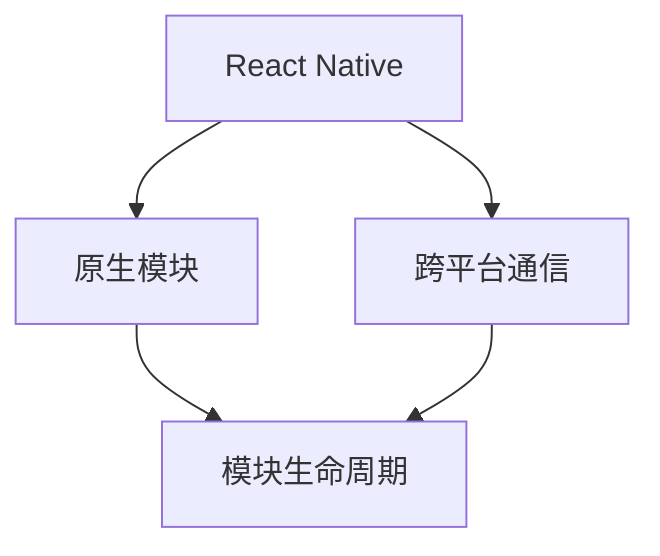

                 

# React Native原生模块开发

## 1. 背景介绍

### 1.1 问题由来

在React Native开发中，原生模块的开发和集成是实现跨平台功能的基础。原生模块提供了一层桥梁，使得React Native应用可以访问底层原生代码和API。在React Native生态系统中，原生模块的开发和集成至关重要，它不仅能够使应用访问设备的硬件特性，还能实现对第三方库的调用，从而提升应用的性能和用户体验。然而，原生模块的开发和集成是一个复杂而耗时的过程，需要开发者深入理解React Native架构、原生代码和跨平台通信机制。因此，本文将详细探讨React Native原生模块开发的核心概念、原理和实践技巧，帮助开发者快速上手并高效地实现跨平台功能。

### 1.2 问题核心关键点

React Native原生模块开发的核心关键点包括以下几个方面：

- **模块化设计**：通过模块化设计，将应用功能划分为不同的模块，每个模块负责特定的功能，使代码结构清晰，易于维护。
- **原生桥接**：原生桥接技术使得React Native应用能够访问原生API，实现跨平台功能的统一。
- **跨平台通信**：跨平台通信是原生模块开发的核心，需要通过不同平台之间的通信机制，实现数据和状态的同步。
- **模块生命周期**：原生模块有其生命周期，包括初始化、卸载等阶段，开发者需要合理管理模块的生命周期，以避免资源泄露。

本文将围绕这些关键点，深入探讨React Native原生模块开发的原理和实践技巧，帮助开发者掌握核心技术，实现高效、可靠的跨平台功能。

## 2. 核心概念与联系

### 2.1 核心概念概述

在探讨React Native原生模块开发之前，我们首先需要了解一些核心概念：

- **React Native**：由Facebook开发的一个开源框架，用于构建iOS和Android原生应用，采用组件化、声明式编程等技术，使得开发者能够使用JavaScript和React进行跨平台开发。
- **原生模块**：原生模块是React Native中的桥梁，使得JavaScript代码可以调用原生代码和API，实现跨平台功能。
- **跨平台通信**：跨平台通信是指React Native应用中的JavaScript代码与原生代码之间的数据交换和状态同步。
- **模块生命周期**：原生模块的初始化、卸载等生命周期阶段，需要开发者进行合理管理，以避免资源泄露和性能问题。

### 2.2 核心概念原理和架构的 Mermaid 流程图



## 3. 核心算法原理 & 具体操作步骤

### 3.1 算法原理概述

React Native原生模块开发的核心算法原理主要包括原生桥接、跨平台通信和模块生命周期管理。原生桥接技术使得React Native应用能够访问原生API，跨平台通信实现JavaScript代码与原生代码之间的数据交换，模块生命周期管理确保原生模块的合理使用和卸载。

### 3.2 算法步骤详解

#### 3.2.1 原生桥接

原生桥接是React Native原生模块开发的关键步骤。通过原生桥接，React Native应用能够访问原生API，实现跨平台功能。原生桥接主要包括以下几个步骤：

1. **创建原生模块**：在原生代码中创建原生模块，定义接口和回调函数，实现原生功能。
2. **编写桥接代码**：在React Native中编写桥接代码，实现JavaScript与原生代码的通信。
3. **实现模块导出**：将原生模块导出为React Native可用的格式，使其能够在JavaScript中使用。

#### 3.2.2 跨平台通信

跨平台通信是指React Native应用中的JavaScript代码与原生代码之间的数据交换和状态同步。跨平台通信主要通过JavaScript调用原生模块，实现数据交换。

1. **定义接口和回调函数**：在原生模块中定义接口和回调函数，用于处理数据和状态。
2. **实现数据交换**：在JavaScript中调用原生模块的接口和回调函数，实现数据交换和状态同步。
3. **处理数据和状态**：在原生模块中处理数据和状态，并在需要时调用回调函数返回结果。

#### 3.2.3 模块生命周期

原生模块的生命周期管理是React Native原生模块开发的重要部分。原生模块的生命周期包括初始化、调用和卸载等阶段，开发者需要合理管理模块的生命周期，以避免资源泄露和性能问题。

1. **初始化**：在React Native应用启动时，初始化原生模块，调用原生模块的初始化函数。
2. **调用**：在JavaScript中调用原生模块的接口，实现跨平台功能。
3. **卸载**：在React Native应用关闭或组件卸载时，调用原生模块的卸载函数，释放资源。

### 3.3 算法优缺点

#### 3.3.1 优点

React Native原生模块开发的主要优点包括：

1. **跨平台功能**：原生模块能够实现跨平台功能，使React Native应用能够访问原生API，提升应用性能和用户体验。
2. **代码复用**：通过原生模块，开发者可以复用原生代码，减少开发成本。
3. **性能优化**：原生模块的性能通常优于JavaScript代码，能够提升应用的整体性能。

#### 3.3.2 缺点

React Native原生模块开发的主要缺点包括：

1. **开发复杂**：原生模块的开发和集成是一个复杂而耗时的过程，需要开发者深入理解React Native架构、原生代码和跨平台通信机制。
2. **平台差异**：不同平台的原生代码可能存在差异，开发者需要分别编写和测试原生代码。
3. **维护困难**：原生模块的维护和更新相对复杂，需要开发者具备一定的技术储备。

### 3.4 算法应用领域

React Native原生模块开发在多个领域中得到了广泛应用，包括：

- **移动应用开发**：在iOS和Android平台上开发原生应用，通过原生模块实现跨平台功能。
- **游戏开发**：在游戏开发中，通过原生模块实现高性能渲染和物理引擎等核心功能。
- **智能设备开发**：在智能设备开发中，通过原生模块实现设备传感器和硬件特性访问。

## 4. 数学模型和公式 & 详细讲解 & 举例说明

### 4.1 数学模型构建

React Native原生模块开发的数学模型主要涉及原生桥接、跨平台通信和模块生命周期管理的各个环节。以下是一些常用的数学模型和公式：

#### 4.1.1 原生桥接

原生桥接主要涉及JavaScript代码和原生代码之间的数据交换，可以使用以下公式表示：

$$
\text{Bridge Communication} = \text{JavaScript Code} + \text{Native Code}
$$

#### 4.1.2 跨平台通信

跨平台通信主要涉及JavaScript代码和原生代码之间的数据交换和状态同步，可以使用以下公式表示：

$$
\text{Cross-Platform Communication} = \text{JavaScript Interface} + \text{Native Interface} + \text{Data Exchange}
$$

#### 4.1.3 模块生命周期

模块生命周期管理主要涉及原生模块的初始化、调用和卸载等阶段，可以使用以下公式表示：

$$
\text{Module Life Cycle} = \text{Initialization} + \text{Calling} + \text{Unloading}
$$

### 4.2 公式推导过程

#### 4.2.1 原生桥接

原生桥接的推导过程主要涉及JavaScript代码和原生代码的结合。以下是原生桥接的推导过程：

$$
\begin{aligned}
\text{JavaScript Code} &\rightarrow \text{Native Code} \\
\text{Native Code} &\rightarrow \text{Native Bridge} \\
\text{Native Bridge} &\rightarrow \text{JavaScript Code}
\end{aligned}
$$

#### 4.2.2 跨平台通信

跨平台通信的推导过程主要涉及JavaScript代码和原生代码之间的数据交换。以下是跨平台通信的推导过程：

$$
\begin{aligned}
\text{JavaScript Interface} &\rightarrow \text{Native Interface} \\
\text{Native Interface} &\rightarrow \text{Data Exchange} \\
\text{Data Exchange} &\rightarrow \text{JavaScript Interface}
\end{aligned}
$$

#### 4.2.3 模块生命周期

模块生命周期的推导过程主要涉及原生模块的初始化、调用和卸载等阶段。以下是模块生命周期的推导过程：

$$
\begin{aligned}
\text{React Native Application} &\rightarrow \text{Initialization} \\
\text{Initialization} &\rightarrow \text{Calling} \\
\text{Calling} &\rightarrow \text{Unloading} \\
\text{Unloading} &\rightarrow \text{React Native Application}
\end{aligned}
$$

### 4.3 案例分析与讲解

#### 4.3.1 案例分析

以下是一个简单的React Native原生模块开发案例：

1. **原生模块创建**：在iOS和Android平台分别创建原生模块，定义接口和回调函数。
2. **桥接代码编写**：在React Native中编写桥接代码，实现JavaScript与原生代码的通信。
3. **模块导出实现**：将原生模块导出为React Native可用的格式，使其能够在JavaScript中使用。

#### 4.3.2 案例讲解

以React Native中的`Image`组件为例，介绍如何通过原生模块实现图片加载和渲染功能。

1. **原生模块创建**：在iOS和Android平台分别创建原生模块，定义图片加载和渲染的接口和回调函数。
2. **桥接代码编写**：在React Native中编写桥接代码，实现JavaScript与原生代码的通信，调用原生模块的接口进行图片加载和渲染。
3. **模块导出实现**：将原生模块导出为React Native可用的格式，使其能够在JavaScript中使用，实现`Image`组件的跨平台功能。

## 5. 项目实践：代码实例和详细解释说明

### 5.1 开发环境搭建

要开始React Native原生模块开发，需要安装以下工具和环境：

1. **Node.js和npm**：React Native的开发依赖Node.js和npm，需要安装最新版本。
2. **React Native CLI**：React Native的开发工具，可以从官网下载并安装。
3. **Android Studio和Xcode**：在Android和iOS平台上开发原生模块，需要安装相应的IDE。

### 5.2 源代码详细实现

以下是一个简单的React Native原生模块开发代码实现：

#### 5.2.1 原生模块创建

在iOS和Android平台分别创建原生模块，定义接口和回调函数：

```objc
// iOS原生模块
@interface CustomModule : NSObject

- (void)loadCustomImage:(NSString *)imagePath completion:(void (^)(UIImage *image))completion;

@end

@implementation CustomModule

- (void)loadCustomImage:(NSString *)imagePath completion:(void (^)(UIImage *image))completion {
    // 加载并渲染图片
    UIImage *image = [UIImage imageNamed:imagePath];
    completion(image);
}

@end
```

#### 5.2.2 桥接代码编写

在React Native中编写桥接代码，实现JavaScript与原生代码的通信：

```javascript
// React Native桥接代码
const {NativeModules} = require('react-native');
const {NativeEventEmitter} = require('react-native');

const CustomModule = NativeModules.CustomModule;
const CustomModuleEvents = new NativeEventEmitter(CustomModule);

CustomModule.loadCustomImage = (imagePath, callback) => {
    CustomModuleEvents.emit('loadCustomImage', imagePath, callback);
};
```

#### 5.2.3 模块导出实现

将原生模块导出为React Native可用的格式，使其能够在JavaScript中使用：

```javascript
// React Native模块导出
exports.loadCustomImage = (imagePath, callback) => {
    CustomModule.loadCustomImage(imagePath, callback);
};
```

### 5.3 代码解读与分析

React Native原生模块开发的代码实现主要涉及原生模块创建、桥接代码编写和模块导出等步骤。开发者需要深入理解React Native架构和原生代码，才能实现跨平台功能。

1. **原生模块创建**：在原生平台创建原生模块，定义接口和回调函数，实现原生功能。
2. **桥接代码编写**：在React Native中编写桥接代码，实现JavaScript与原生代码的通信，调用原生模块的接口。
3. **模块导出实现**：将原生模块导出为React Native可用的格式，使其能够在JavaScript中使用。

### 5.4 运行结果展示

运行React Native原生模块开发的代码后，可以通过JavaScript代码调用原生模块的接口，实现跨平台功能。以下是一些运行结果展示：

```javascript
// React Native应用代码
import React, {Component} from 'react';
import {Image, Text, View} from 'react-native';
import CustomModule from './CustomModule';

class CustomImageComponent extends Component {
    state = {
        image: null,
    };

    componentDidMount() {
        CustomModule.loadCustomImage('customImage.png', (image) => {
            this.setState({image});
        });
    }

    render() {
        const {image} = this.state;
        return (
            <View>
                <Image source={image} />
                <Text>Image Loaded</Text>
            </View>
        );
    }
}

export default CustomImageComponent;
```

## 6. 实际应用场景

### 6.1 智能设备开发

React Native原生模块在智能设备开发中得到了广泛应用，例如在智能家居设备中，通过原生模块实现设备传感器和硬件特性的访问，提升设备的功能和用户体验。

### 6.2 移动应用开发

React Native原生模块在移动应用开发中得到了广泛应用，例如在电商应用中，通过原生模块实现高性能渲染和物理引擎等核心功能，提升应用的性能和用户体验。

### 6.3 游戏开发

React Native原生模块在游戏开发中得到了广泛应用，例如在游戏开发中，通过原生模块实现高性能渲染和物理引擎等核心功能，提升游戏的性能和用户体验。

### 6.4 未来应用展望

未来，React Native原生模块将会在更多的领域中得到应用，例如在虚拟现实和增强现实领域，通过原生模块实现虚拟环境中的图像和音效渲染，提升用户体验。

## 7. 工具和资源推荐

### 7.1 学习资源推荐

1. **React Native官方文档**：React Native官方文档提供了全面的API文档和开发指南，是开发者学习React Native原生模块开发的重要资源。
2. **《React Native官方教程》**：React Native官方教程提供了从入门到进阶的详细教程，帮助开发者快速上手React Native原生模块开发。
3. **《React Native跨平台开发实战》**：该书详细介绍了React Native原生模块开发的技术细节和实践经验，适合进阶开发者阅读。

### 7.2 开发工具推荐

1. **React Native CLI**：React Native的开发工具，提供了项目创建、编译、调试等功能，方便开发者进行开发和测试。
2. **Android Studio和Xcode**：在Android和iOS平台上开发原生模块，需要安装相应的IDE，提供代码编写、调试和测试功能。
3. **Visual Studio Code**：React Native的开发常用IDE，提供了丰富的插件和扩展，方便开发者进行开发和测试。

### 7.3 相关论文推荐

1. **《React Native: A Native Module Framework for Building Cross-Platform Mobile Applications》**：该论文详细介绍了React Native架构和原生模块开发技术，是开发者学习React Native原生模块开发的重要参考资料。
2. **《Native Modules in React Native: A Survey》**：该论文总结了React Native原生模块开发的技术和实践经验，提供了丰富的案例和参考代码。
3. **《React Native Bridging and Module Development》**：该论文介绍了React Native原生模块开发的技术细节和最佳实践，适合进阶开发者阅读。

## 8. 总结：未来发展趋势与挑战

### 8.1 研究成果总结

React Native原生模块开发技术在跨平台应用开发中具有重要地位。通过原生模块，开发者能够访问原生API，实现跨平台功能，提升应用性能和用户体验。同时，原生模块的开发和集成也是一个复杂而耗时的过程，需要开发者具备一定的技术储备。

### 8.2 未来发展趋势

React Native原生模块开发技术在未来的发展趋势包括：

1. **跨平台功能提升**：随着React Native版本的更新，原生模块的跨平台功能将不断提升，实现更高效、更便捷的开发。
2. **性能优化**：原生模块的性能将不断优化，提升应用的整体性能和用户体验。
3. **新特性支持**：原生模块将不断引入新特性，支持更多的跨平台功能和设备特性。

### 8.3 面临的挑战

React Native原生模块开发技术在未来的发展过程中，也面临一些挑战：

1. **开发复杂**：原生模块的开发和集成是一个复杂而耗时的过程，需要开发者具备一定的技术储备。
2. **平台差异**：不同平台的原生代码可能存在差异，开发者需要分别编写和测试原生代码。
3. **维护困难**：原生模块的维护和更新相对复杂，需要开发者具备一定的技术储备。

### 8.4 研究展望

React Native原生模块开发技术的未来研究展望包括：

1. **简化开发**：通过引入新特性和工具，简化原生模块的开发和集成，提升开发效率。
2. **性能优化**：优化原生模块的性能，提升应用的整体性能和用户体验。
3. **新特性支持**：引入新特性，支持更多的跨平台功能和设备特性，扩展原生模块的适用范围。

## 9. 附录：常见问题与解答

### Q1: 如何优化React Native原生模块的性能？

A: 优化React Native原生模块的性能，可以从以下几个方面入手：

1. **代码优化**：减少原生模块的代码量，优化代码结构和逻辑，提升性能。
2. **异步处理**：采用异步处理方式，减少阻塞，提升应用响应速度。
3. **资源管理**：合理管理资源，避免内存泄漏和资源浪费，提升应用性能。

### Q2: 如何调试React Native原生模块？

A: 调试React Native原生模块，可以从以下几个方面入手：

1. **日志输出**：在原生模块中添加日志输出，打印调试信息，定位问题。
2. **工具调试**：使用工具如Chrome DevTools进行调试，分析JavaScript代码和原生代码的运行状态。
3. **性能分析**：使用性能分析工具，如React Native Profiler，分析原生模块的性能瓶颈。

### Q3: 如何实现React Native原生模块的跨平台功能？

A: 实现React Native原生模块的跨平台功能，可以从以下几个方面入手：

1. **原生模块创建**：在原生平台创建原生模块，定义接口和回调函数，实现原生功能。
2. **桥接代码编写**：在React Native中编写桥接代码，实现JavaScript与原生代码的通信，调用原生模块的接口。
3. **模块导出实现**：将原生模块导出为React Native可用的格式，使其能够在JavaScript中使用。

通过以上步骤，开发者可以实现React Native原生模块的跨平台功能，提升应用性能和用户体验。

---

作者：禅与计算机程序设计艺术 / Zen and the Art of Computer Programming

