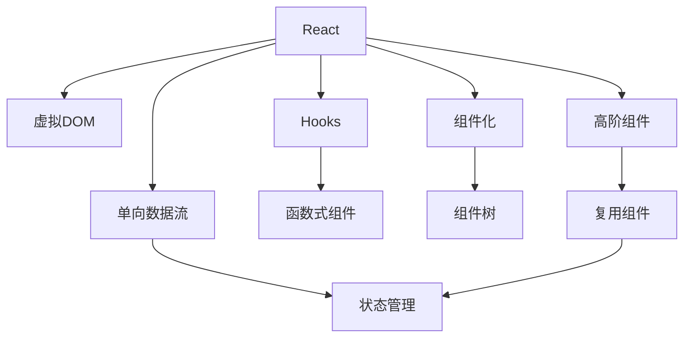

                 

# React 框架：构建动态用户界面

> 关键词：React, 虚拟DOM, 组件化, 单向数据流, Web应用

## 1. 背景介绍

### 1.1 问题由来
在现代Web应用的开发中，如何构建高效、灵活、可维护的用户界面，一直是前端开发者面临的主要挑战。传统基于DOM操作的方式，存在性能瓶颈、代码冗余、难以复用等问题，无法满足大规模、高并发的应用需求。

随着Web技术的不断发展，JavaScript框架和技术栈日益丰富，React等现代框架应运而生，极大地简化了Web应用开发流程，提升了用户体验。React通过虚拟DOM、组件化、单向数据流等核心技术，实现了高效的动态UI构建和维护，使得开发者可以更加专注于业务逻辑和用户体验的设计，大幅提高了开发效率和应用性能。

### 1.2 问题核心关键点
React的核心在于其对UI构建的抽象化处理，以及高效的动态数据更新机制。具体包括以下几个方面：

1. **虚拟DOM**：通过构建轻量级的虚拟DOM树，React在内存中实现对真实DOM的操作。相较于直接操作真实DOM，虚拟DOM能够减少不必要的页面重排，提高UI更新性能。
2. **组件化**：将复杂的UI拆分为多个组件，每个组件负责自身的部分UI渲染和状态管理，从而实现高内聚、低耦合的代码结构。
3. **单向数据流**：通过单向数据流机制，确保数据更新透明、可追踪，避免了多线程带来的复杂性和不可预测性。
4. **高阶组件和Hooks**：通过高阶组件和Hooks等技术，可以灵活地复用和组合组件，提高代码的灵活性和可维护性。

以上这些技术特性，使得React在构建复杂、动态的用户界面时具有无可比拟的优势，成为现代Web应用开发的主流选择。

## 2. 核心概念与联系

### 2.1 核心概念概述

为更好地理解React的框架原理和应用实践，本节将介绍几个密切相关的核心概念：

- **React**：由Facebook开发的一款流行的JavaScript库，用于构建用户界面。
- **虚拟DOM**：React中用来抽象真实DOM的轻量级对象，通过在内存中构建虚拟DOM树，实现高效的UI渲染和更新。
- **组件化**：将UI分解为多个独立的组件，每个组件负责自身的渲染和状态管理，从而实现高内聚、低耦合的代码结构。
- **单向数据流**：React中的数据流模型，通过单向数据传递，确保数据更新透明、可追踪。
- **高阶组件(HOC)**：一种函数式编程技术，用于复用和组合组件，提高代码的灵活性和可维护性。
- **Hooks**：React 16.8引入的新特性，使得函数式组件能够访问React状态和生命周期函数，实现类似类组件的功能。

这些核心概念之间的逻辑关系可以通过以下Mermaid流程图来展示：



这个流程图展示了一组React的核心概念及其之间的关联：

1. React通过虚拟DOM和组件化技术，实现高效的UI构建和渲染。
2. 单向数据流确保数据传递的透明性和可追踪性，避免多线程带来的复杂性。
3. 高阶组件和Hooks技术，使得函数式组件能够访问状态和生命周期，实现类组件的功能。
4. Hooks技术进一步增强了函数式组件的灵活性和可复用性。

这些概念共同构成了React的框架体系，使得开发者能够以更高效、更灵活的方式构建复杂的Web应用。

## 3. 核心算法原理 & 具体操作步骤
### 3.1 算法原理概述

React的核心算法原理主要包括以下几个方面：

1. **虚拟DOM的构建与更新**：通过构建虚拟DOM树，React在内存中实现对真实DOM的操作，减少页面重排，提升性能。
2. **组件的渲染与生命周期管理**：React组件负责自身的UI渲染和状态管理，通过生命周期函数进行全生命周期的管理。
3. **单向数据流机制**：通过单向数据传递，确保数据更新透明、可追踪，避免多线程带来的复杂性和不可预测性。
4. **高阶组件和Hooks**：用于复用和组合组件，提高代码的灵活性和可维护性。

### 3.2 算法步骤详解

React的开发流程通常包括以下几个关键步骤：

**Step 1: 搭建开发环境**
- 安装Node.js和React的依赖库，如create-react-app、React Router等。
- 创建新的React应用项目，设置项目的初始化配置。

**Step 2: 设计组件结构**
- 将UI拆分为独立的组件，每个组件负责自身的UI渲染和状态管理。
- 设计组件之间的数据流和交互逻辑，确保数据传递透明、可追踪。

**Step 3: 实现组件功能**
- 在组件中定义UI渲染逻辑，使用JSX语法书写UI。
- 定义组件的状态和生命周期函数，实现组件的功能和状态管理。
- 使用高阶组件和Hooks技术，复用和组合组件，提高代码的灵活性和可维护性。

**Step 4: 渲染组件**
- 将组件作为React应用的主体，通过ReactDOM.render方法将组件渲染到页面中。
- 监听组件的状态变化，触发UI更新。

**Step 5: 优化性能**
- 使用React DevTools工具，调试和优化组件的渲染和更新性能。
- 使用生命周期函数和useEffect Hook，优化组件的内存和渲染性能。

### 3.3 算法优缺点

React作为当前最流行的JavaScript框架之一，具有以下优点：

1. **高效性能**：通过虚拟DOM和单向数据流机制，React在UI渲染和数据更新方面具有高效的性能表现。
2. **组件化设计**：组件化设计使得React应用具有高内聚、低耦合的代码结构，便于维护和扩展。
3. **灵活复用**：通过高阶组件和Hooks技术，React使得函数式组件能够访问状态和生命周期，提高了代码的灵活性和可复用性。
4. **生态丰富**：React拥有庞大的社区和丰富的生态系统，提供了众多第三方库和工具，满足不同应用场景的需求。

然而，React也存在一些缺点：

1. **学习曲线陡峭**：React的学习曲线较陡，需要一定的JavaScript和前端开发基础。
2. **复杂状态管理**：对于复杂的应用场景，管理状态可能会变得复杂和难以维护。
3. **性能优化难度高**：虽然React在性能方面表现优异，但实际应用中仍需进行一些性能优化，如使用useMemo、useCallback等技术，避免不必要的组件渲染。
4. **静态页面构建**：React默认不适合构建静态页面，需要通过React Static Site Generator等工具进行优化。

尽管存在这些缺点，但就目前而言，React仍然是Web应用开发的主流选择。未来相关研究的重点在于如何进一步降低学习曲线，简化状态管理，提升性能优化能力，以及更好地支持静态页面构建等方向。

### 3.4 算法应用领域

React作为一款通用JavaScript框架，可以在多种Web应用场景中得到广泛应用，例如：

1. **单页应用(SPA)**：通过React Router等库，可以实现高效的单页路由和页面管理。
2. **移动应用**：通过React Native等技术，可以将React应用拓展到移动设备上。
3. **桌面应用**：通过Electron等技术，可以将React应用运行在Electron环境下，实现桌面应用开发。
4. **服务器端渲染(SSR)**：通过React Server Components等技术，可以实现服务器端渲染，提升SEO效果。
5. **Web组件化**：通过React库，可以实现Web组件化的开发，提升应用的模块化和复用性。

除了这些常见的应用场景外，React还被创新性地应用到更多领域中，如AR/VR、物联网、流媒体等，为Web技术的未来发展带来了新的可能性。

## 4. 数学模型和公式 & 详细讲解 & 举例说明
### 4.1 数学模型构建

React的核心数学模型主要涉及以下几个方面：

1. **虚拟DOM树**：虚拟DOM树由多个虚拟节点组成，每个节点表示真实DOM中的一个元素。通过构建虚拟DOM树，React在内存中实现对真实DOM的操作。

2. **状态管理**：React组件的状态由组件内部的状态变量管理，状态更新时通过setState方法触发UI更新。

3. **生命周期函数**：React组件有多个生命周期函数，用于组件的初始化、更新和销毁等全生命周期管理。

4. **单向数据流**：通过单向数据传递，React确保数据更新透明、可追踪，避免了多线程带来的复杂性和不可预测性。

### 4.2 公式推导过程

以下是React核心算法的数学公式推导：

**虚拟DOM树构建**：
设虚拟DOM树的根节点为 $V_{root}$，每个虚拟节点表示真实DOM中的元素，包括标签、属性、子节点等信息。则虚拟DOM树的构建过程可以表示为：

$$
V_{root} = \text{buildDOMTree}(DOM)
$$

其中 $DOM$ 表示真实DOM树， $\text{buildDOMTree}$ 为构建虚拟DOM树的函数。

**状态更新**：
设组件的状态变量为 $state$，状态更新过程可以表示为：

$$
state = \text{updateState}(state, newstate)
$$

其中 $newstate$ 为新的状态变量。

**生命周期函数**：
设组件的生命周期函数为 $\text{componentDidMount}$、$\text{componentDidUpdate}$ 等，生命周期函数执行过程可以表示为：

$$
componentDidX = \text{executeLifecycleFunction}()
$$

其中 $X$ 为生命周期函数名。

**单向数据流**：
设数据流为 $dataflow$，数据流传递过程可以表示为：

$$
dataflow = \text{forwardData}(parentdataflow)
$$

其中 $parentdataflow$ 为父组件传递过来的数据流。

### 4.3 案例分析与讲解

以一个简单的React组件为例，展示React的核心算法原理：

```javascript
import React, { useState, useEffect } from 'react';

function Counter() {
  const [count, setCount] = useState(0);

  useEffect(() => {
    document.title = `Count: ${count}`;
  }, [count]);

  return (
    <div>
      <p>Count: {count}</p>
      <button onClick={() => setCount(count + 1)}>
        Increment
      </button>
    </div>
  );
}

export default Counter;
```

在这个组件中，useState Hook用于管理组件的状态变量 $count$，setCount函数用于更新状态。useEffect Hook用于执行生命周期函数，更新页面标题。通过单向数据流机制，按钮点击事件触发状态更新，并重新渲染页面。

通过这个简单的案例，可以看出React的虚拟DOM树构建、状态管理、生命周期函数和单向数据流机制是如何协同工作，实现高效的UI构建和状态更新。

## 5. 项目实践：代码实例和详细解释说明
### 5.1 开发环境搭建

在进行React项目开发前，我们需要准备好开发环境。以下是使用create-react-app搭建React项目的步骤：

1. 安装Node.js和npm。
2. 安装create-react-app：
```bash
npm install -g create-react-app
```

3. 创建新的React项目：
```bash
create-react-app my-app
cd my-app
```

4. 安装依赖库：
```bash
npm install react-router-dom
```

5. 启动项目：
```bash
npm start
```

完成上述步骤后，即可在开发环境中部署React项目，开始开发。

### 5.2 源代码详细实现

下面我们以一个简单的单页应用(SPA)为例，展示React的开发流程：

1. 创建新的React应用项目：
```bash
create-react-app my-app
```

2. 安装React Router依赖：
```bash
npm install react-router-dom
```

3. 在App.js文件中定义路由：
```javascript
import React from 'react';
import { BrowserRouter as Router, Route, Switch } from 'react-router-dom';

function App() {
  return (
    <Router>
      <Switch>
        <Route path="/" exact component={Home} />
        <Route path="/about" component={About} />
        <Route path="/contact" component={Contact} />
      </Switch>
    </Router>
  );
}

export default App;
```

4. 定义各个组件的UI逻辑：
```javascript
import React from 'react';

function Home() {
  return (
    <div>
      <h1>Home</h1>
    </div>
  );
}

function About() {
  return (
    <div>
      <h1>About</h1>
    </div>
  );
}

function Contact() {
  return (
    <div>
      <h1>Contact</h1>
    </div>
  );
}

export default { Home, About, Contact };
```

5. 在App.js文件中渲染组件：
```javascript
import React from 'react';
import { BrowserRouter as Router, Route, Switch } from 'react-router-dom';
import { Home, About, Contact } from './components';

function App() {
  return (
    <Router>
      <Switch>
        <Route path="/" exact component={Home} />
        <Route path="/about" component={About} />
        <Route path="/contact" component={Contact} />
      </Switch>
    </Router>
  );
}

export default App;
```

6. 运行项目，访问http://localhost:3000/，可以看到页面会根据路由渲染相应的UI。

### 5.3 代码解读与分析

让我们再详细解读一下关键代码的实现细节：

**Route组件**：
- 定义路由路径和渲染组件。
- 使用exact属性确保路由匹配精确。

**App.js文件**：
- 使用BrowserRouter封装Router，方便路由配置。
- 使用Switch组件确保路由匹配优先级。
- 通过import导入各个组件，并传递给Route组件。

**组件定义**：
- 每个组件都是一个简单的函数组件，负责渲染UI。
- 使用<h1>标签定义组件的标题。

**路由配置**：
- 通过Route组件定义路由路径和组件。
- 使用exact属性确保路由匹配精确。

通过这个简单的案例，可以看出React的路由配置和组件渲染是如何协同工作，实现高效的单页应用开发。

### 5.4 运行结果展示

运行项目后，在浏览器中访问不同的路由路径，可以看到页面会根据路由渲染相应的UI。

```javascript
import React from 'react';
import { BrowserRouter as Router, Route, Switch } from 'react-router-dom';

function App() {
  return (
    <Router>
      <Switch>
        <Route path="/" exact component={Home} />
        <Route path="/about" component={About} />
        <Route path="/contact" component={Contact} />
      </Switch>
    </Router>
  );
}

export default App;
```

通过这个简单的案例，可以看出React的路由配置和组件渲染是如何协同工作，实现高效的单页应用开发。

## 6. 实际应用场景
### 6.1 智能客服系统

基于React的前端页面，可以实现智能客服系统的构建。智能客服系统可以帮助企业实现自动化客服，减少人力成本，提升客户满意度。

在技术实现上，可以收集企业内部的历史客服对话记录，将问题和最佳答复构建成监督数据，在此基础上对预训练模型进行微调。微调后的对话模型能够自动理解用户意图，匹配最合适的答案模板进行回复。对于客户提出的新问题，还可以接入检索系统实时搜索相关内容，动态组织生成回答。如此构建的智能客服系统，能大幅提升客户咨询体验和问题解决效率。

### 6.2 金融舆情监测

金融机构需要实时监测市场舆论动向，以便及时应对负面信息传播，规避金融风险。传统的人工监测方式成本高、效率低，难以应对网络时代海量信息爆发的挑战。基于React的前端页面，可以实现金融舆情监测的可视化界面，展示实时舆情变化。同时，可以通过微调模型对舆情数据进行情感分析，识别负面舆情，及时预警，帮助金融机构快速应对潜在风险。

### 6.3 个性化推荐系统

当前的推荐系统往往只依赖用户的历史行为数据进行物品推荐，无法深入理解用户的真实兴趣偏好。基于React的前端页面，可以实现个性化推荐系统的构建。通过微调模型对用户行为数据进行分析和建模，可以深入理解用户的兴趣偏好。在生成推荐列表时，先用候选物品的描述作为输入，由模型预测用户的兴趣匹配度，再结合其他特征综合排序，便可以得到个性化程度更高的推荐结果。

### 6.4 未来应用展望

随着React技术的不断发展和应用场景的拓展，其未来应用前景将更加广阔。

在智慧医疗领域，基于React的前端页面，可以构建智慧医疗应用，提供疾病诊疗、健康管理等服务，提升医疗服务的智能化水平。

在智能教育领域，基于React的前端页面，可以实现智能教育应用，提供个性化学习、智能辅导等服务，因材施教，促进教育公平，提高教学质量。

在智慧城市治理中，基于React的前端页面，可以实现智慧城市应用，提供智能交通、城市管理等服务，提高城市管理的自动化和智能化水平，构建更安全、高效的未来城市。

此外，在企业生产、社会治理、文娱传媒等众多领域，基于React的前端页面，可以构建各种智能应用，为传统行业数字化转型升级提供新的技术路径。相信随着React技术的日益成熟，其应用场景将不断拓展，为人类认知智能的进化带来深远影响。

## 7. 工具和资源推荐
### 7.1 学习资源推荐

为了帮助开发者系统掌握React的技术基础和应用实践，这里推荐一些优质的学习资源：

1. React官方文档：React的官方文档全面介绍了React的核心概念、开发流程和最佳实践，是学习React的最佳入门材料。
2. React入门教程：通过Bilibili、YouTube等平台上的React入门教程，可以快速上手React的基础知识和实战技巧。
3. React源码解析：通过阅读React源码，深入理解React的内部机制和算法原理，有助于提升开发能力和技术水平。
4. React实战项目：通过GitHub上的React实战项目，了解React在实际应用中的最佳实践和常见问题。
5. React社区讨论：通过React社区的讨论和交流，获取最新的技术动态和问题解决方案，与其他开发者共同成长。

通过对这些资源的学习实践，相信你一定能够快速掌握React的精髓，并用于解决实际的Web应用问题。

### 7.2 开发工具推荐

高效的开发离不开优秀的工具支持。以下是几款用于React开发常用的工具：

1. VS Code：一款轻量级的IDE，支持React的代码编辑和调试。
2. React Developer Tools：Chrome浏览器的React调试工具，可以实时查看虚拟DOM树和组件状态。
3. Prettier：一款代码格式化工具，自动修正代码风格，提升代码可读性。
4. ESLint：一款代码质量检查工具，帮助检测代码中的潜在问题。
5. Storybook：一款UI组件库的开发工具，用于快速构建和测试组件。

合理利用这些工具，可以显著提升React开发的效率和质量，加速创新迭代的步伐。

### 7.3 相关论文推荐

React作为一款流行的JavaScript框架，其技术发展源于学界的持续研究。以下是几篇奠基性的相关论文，推荐阅读：

1. React: A JavaScript Library for Building User Interfaces：介绍React的核心概念和开发流程。
2. Virtual DOM Simplifies UI Updates：介绍React虚拟DOM的原理和实现。
3. Building the Future of UI with React：介绍React的生态系统和应用场景。
4. Unmounting in React：介绍React组件的卸载机制。
5. Managing Your UI State with React：介绍React的状态管理机制。

这些论文代表了大React框架的技术发展脉络。通过学习这些前沿成果，可以帮助研究者把握学科前进方向，激发更多的创新灵感。

## 8. 总结：未来发展趋势与挑战
### 8.1 总结

本文对React框架进行了全面系统的介绍。首先阐述了React框架的背景和重要性，明确了虚拟DOM、组件化、单向数据流等核心技术在构建动态用户界面中的独特价值。其次，从原理到实践，详细讲解了React的数学模型和关键算法，给出了React应用开发的完整代码实例。同时，本文还广泛探讨了React框架在智能客服、金融舆情、个性化推荐等众多领域的应用前景，展示了React的巨大潜力。此外，本文精选了React框架的学习资源，力求为读者提供全方位的技术指引。

通过本文的系统梳理，可以看出，React框架通过虚拟DOM、组件化、单向数据流等核心技术，实现了高效的动态UI构建和维护，使得开发者可以更加专注于业务逻辑和用户体验的设计，大幅提高了开发效率和应用性能。React框架正迅速成为现代Web应用开发的主流选择，未来其应用场景将更加广泛，推动Web技术的发展进入新的阶段。

### 8.2 未来发展趋势

展望未来，React框架将呈现以下几个发展趋势：

1. **跨平台开发**：React Native和Electron等技术将进一步拓展React的应用范围，使得React能够实现跨平台、跨设备的UI构建和维护。
2. **组件化设计**：随着组件库和UI框架的不断发展，React的组件化设计将更加完善，组件复用和组合将更加灵活高效。
3. **性能优化**：React社区将继续关注性能优化问题，通过使用useMemo、useCallback等技术，提升组件的渲染和更新效率。
4. **生态系统完善**：React的生态系统将继续完善，更多的第三方库和工具将涌现，满足不同应用场景的需求。
5. **虚拟DOM优化**：通过虚拟DOM的优化，减少不必要的页面重排，提升UI渲染和更新性能。

这些趋势凸显了React框架的强大生命力和广泛应用前景，未来React框架必将在更多的Web应用场景中发挥重要作用。

### 8.3 面临的挑战

尽管React框架已经取得了瞩目成就，但在迈向更加智能化、普适化应用的过程中，它仍面临着诸多挑战：

1. **学习曲线陡峭**：React的学习曲线较陡，需要一定的JavaScript和前端开发基础，这可能会阻碍一部分开发者的学习。
2. **复杂状态管理**：对于复杂的应用场景，管理状态可能会变得复杂和难以维护。
3. **性能优化难度高**：虽然React在性能方面表现优异，但实际应用中仍需进行一些性能优化，如使用useMemo、useCallback等技术，避免不必要的组件渲染。
4. **静态页面构建**：React默认不适合构建静态页面，需要通过React Static Site Generator等工具进行优化。

尽管存在这些挑战，但通过社区和开发者的不懈努力，这些问题终将逐一得到解决，React框架必将在构建高效、灵活的Web应用中继续发挥重要作用。

### 8.4 研究展望

面对React框架所面临的挑战，未来的研究需要在以下几个方面寻求新的突破：

1. **简化学习曲线**：通过更加直观、易用的开发工具和教程，降低React的学习难度，吸引更多的开发者使用。
2. **简化状态管理**：开发更加高效的状态管理工具，如MobX、Redux等，简化React应用中的状态管理。
3. **提升性能优化能力**：通过优化useMemo、useCallback等技术，提升React应用的性能表现，提高用户体验。
4. **支持静态页面构建**：通过React Static Site Generator等工具，提升React应用的静态页面构建能力，提升SEO效果。

这些研究方向的探索，必将引领React框架技术迈向更高的台阶，为Web技术的发展带来新的突破。面向未来，React框架需要与其他Web技术进行更深入的融合，如Serverless、API Gateway等，多路径协同发力，共同推动Web技术的发展进入新的阶段。总之，React框架需要开发者根据具体应用场景，不断迭代和优化技术，方能得到理想的效果。

## 9. 附录：常见问题与解答

**Q1：React和Vue哪个更好？**

A: 这取决于具体应用场景和开发需求。React和Vue都是优秀的JavaScript框架，但React更侧重于构建动态UI，Vue则更侧重于构建稳定的数据驱动应用。React的学习曲线较陡，但社区生态和生态系统较为完善；Vue则更加易学易用，但生态系统相对较少。开发者可以根据项目需求和个人偏好选择合适的框架。

**Q2：React状态管理应该使用useReducer还是useState？**

A: useReducer更适合管理复杂的状态逻辑，而useState则更适合简单的状态管理。useReducer可以通过传递状态更新函数，实现复杂的状态更新逻辑，适用于组件间的复杂数据传递和状态管理；useState则更适合简单的状态管理，适用于组件内部的状态更新。

**Q3：React中的useEffect Hook如何避免内存泄漏？**

A: useEffect Hook可以通过设置依赖数组，确保在依赖项更新时重新执行effect。同时，在effect中使用setTimeout等技术，避免在组件卸载时触发effect。通过这些技术，可以有效避免内存泄漏问题。

**Q4：React中如何实现组件的懒加载？**

A: React社区推荐使用React Lazy和Suspense技术实现组件的懒加载。通过将组件代码分割为多个模块，并使用React Lazy加载，可以在需要时才执行组件，从而提升应用的性能。

通过这些问题的解答，可以看出React框架在实际应用中的一些常见问题和解决方法，希望这些解答能够帮助开发者更好地理解和应用React框架。

---

作者：禅与计算机程序设计艺术 / Zen and the Art of Computer Programming

