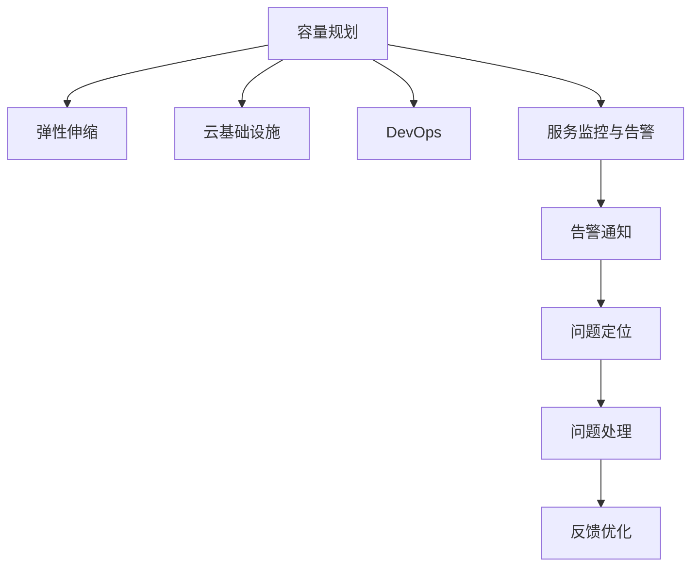

                 

# SRE容量规划与弹性伸缩

> 关键词：SRE, 容量规划, 弹性伸缩, 云基础设施, 性能优化, 资源管理, DevOps

## 1. 背景介绍

### 1.1 问题由来
随着互联网业务的迅猛发展，云基础设施和平台的服务规模持续扩大，为保证服务稳定可靠运行，同时控制成本，系统资源管理的重要性日益凸显。尤其对于互联网公司而言，用户访问量波动性大，如何有效规划系统容量，快速响应业务变化，确保系统稳定运行，成为了SRE（Site Reliability Engineering，站点可靠保障工程）领域的一个核心挑战。

### 1.2 问题核心关键点
容量规划与弹性伸缩是SRE在资源管理方面需要关注的两大核心问题。其中，容量规划是指在系统设计之初，依据业务规模、访问量和性能指标，确定系统的资源配置，确保系统的稳定性和可扩展性。弹性伸缩则是指根据系统实时负载的变化，动态调整资源配置，保持系统的高效运行。

### 1.3 问题研究意义
研究容量规划与弹性伸缩问题，对于提升云基础设施的利用率、优化系统性能、降低运营成本具有重要意义。通过科学合理的容量规划，可以避免资源浪费，提升系统稳定性和可用性。而弹性伸缩则可以在系统负载变化时，快速响应，避免服务质量下降和资源过度消耗。

## 2. 核心概念与联系

### 2.1 核心概念概述

为更好地理解容量规划与弹性伸缩，本节将介绍几个密切相关的核心概念：

- **容量规划（Capacity Planning）**：在系统设计阶段，依据业务需求和资源成本，确定系统的资源配置，包括CPU、内存、磁盘、网络带宽等，确保系统能够满足预期的业务需求。
- **弹性伸缩（Auto-scaling）**：根据系统负载的变化，动态调整资源配置，保持系统高效运行。常见的弹性伸缩技术包括垂直扩展、水平扩展、动态调整等。
- **云基础设施（Cloud Infrastructure）**：指云平台提供的各类资源和服务，如虚拟机、数据库、缓存、负载均衡器等，通过编程接口进行管理和配置。
- **DevOps（Development and Operations）**：一种软件开发模式，强调开发和运维的紧密合作，通过持续交付和持续集成，提升软件质量和交付速度。
- **服务监控与告警（Monitoring and Alerting）**：实时监控系统的性能指标，如CPU使用率、内存使用率、网络带宽、请求响应时间等，并根据设定的告警阈值，及时通知SRE团队，进行问题定位和处理。

这些核心概念之间的逻辑关系可以通过以下Mermaid流程图来展示：



这个流程图展示了一些关键概念之间的联系：

1. 容量规划为系统的设计提供资源配置的依据。
2. 弹性伸缩根据实际负载调整资源配置。
3. 云基础设施是资源配置和管理的基础。
4. DevOps模式提升了开发和运维的协作效率。
5. 服务监控与告警保障了系统的实时性能监控。
6. 告警通知、问题定位和处理反馈形成一个闭环，确保系统稳定运行。

这些概念共同构成了SRE在资源管理和系统运维中的核心工作内容。通过理解这些核心概念，我们可以更好地把握容量规划与弹性伸缩的理论基础和实践方法。

## 3. 核心算法原理 & 具体操作步骤

### 3.1 算法原理概述

容量规划与弹性伸缩的算法原理，本质上是对系统资源的管理与优化。其核心思想是：在系统设计阶段，依据业务需求和资源成本，确定系统的初始资源配置。随后，根据系统实时负载的变化，动态调整资源配置，保持系统高效运行。

具体来说，容量规划的算法包括以下几个步骤：

1. **需求分析**：根据业务需求，确定系统的预估访问量和性能指标，如并发用户数、请求响应时间等。
2. **资源配置**：根据需求分析结果，确定CPU、内存、磁盘、网络带宽等资源配置。
3. **性能测试**：在预定的资源配置下，进行性能测试，验证系统能否满足预期需求。
4. **优化调整**：根据性能测试结果，优化调整资源配置，确保系统稳定运行。

弹性伸缩的算法则分为以下几个关键步骤：

1. **监控指标**：实时监控系统的性能指标，如CPU使用率、内存使用率、网络带宽、请求响应时间等。
2. **自动调整**：根据设定的告警阈值，自动调整资源配置。
3. **伸缩策略**：选择垂直扩展、水平扩展、动态调整等伸缩策略。
4. **告警通知**：及时通知SRE团队，进行问题定位和处理。

### 3.2 算法步骤详解

#### 3.2.1 容量规划的具体步骤

1. **需求分析**
   - 收集业务数据，如网站访问量、用户活跃时间、并发用户数等，进行分析和预测。
   - 定义性能指标，如响应时间、吞吐量、错误率等，确保系统在预定资源配置下能够满足业务需求。
   - 分析历史数据，了解系统的流量波动规律，预测未来可能的峰值流量。

2. **资源配置**
   - 根据需求分析结果，初步确定CPU、内存、磁盘、网络带宽等资源配置。
   - 进行可行性评估，确保配置的资源能够满足业务需求，且不会造成资源浪费。
   - 考虑系统的冗余和容错能力，确保系统在高可用性方面的设计。

3. **性能测试**
   - 在初步配置的资源下，进行负载测试，模拟业务高峰期的访问量。
   - 监控系统性能指标，记录关键性能指标的变化情况，如响应时间、错误率等。
   - 分析测试结果，找出性能瓶颈，进行优化调整。

4. **优化调整**
   - 根据性能测试结果，优化调整资源配置，如增加CPU、内存、磁盘等。
   - 对系统进行重测试，确保优化后的配置能够满足业务需求。
   - 进行持续监控，确保系统在优化后的配置下，能够稳定运行。

#### 3.2.2 弹性伸缩的具体步骤

1. **监控指标**
   - 实时监控系统的性能指标，如CPU使用率、内存使用率、网络带宽、请求响应时间等。
   - 根据监控数据，判断系统是否处于负载高峰期。
   - 根据设定的告警阈值，自动触发告警通知。

2. **自动调整**
   - 根据告警通知，自动调整资源配置。
   - 根据系统的负载情况，选择垂直扩展、水平扩展等策略。
   - 在配置变更后，进行性能测试，确保调整后的配置能够满足业务需求。

3. **伸缩策略**
   - 垂直扩展：在现有服务器基础上，增加CPU、内存等硬件资源。适用于CPU或内存使用率较高的场景。
   - 水平扩展：添加新的服务器实例，分担现有服务器的负载。适用于访问量增长的场景。
   - 动态调整：根据实时负载的变化，动态调整资源配置，保持系统高效运行。

4. **告警通知**
   - 根据告警阈值，及时通知SRE团队。
   - 记录告警信息，便于后续的问题定位和处理。
   - 触发问题定位流程，快速定位并解决问题。

### 3.3 算法优缺点

容量规划与弹性伸缩的算法具有以下优点：

1. **成本优化**：通过科学合理的资源配置，避免资源浪费，降低运营成本。
2. **业务连续性**：通过弹性伸缩，快速响应业务变化，确保系统的高可用性和稳定性。
3. **性能提升**：通过优化资源配置，提升系统的性能指标，如响应时间、吞吐量等。
4. **自动化运维**：通过自动调整资源配置，减轻人工运维压力，提高运维效率。

同时，该算法也存在以下局限性：

1. **复杂性高**：容量规划与弹性伸缩涉及到多维度的资源配置和性能优化，复杂度较高。
2. **数据依赖性强**：需要大量历史和实时数据进行分析和预测，数据准确性直接影响算法效果。
3. **算法风险**：如果算法模型不合理或参数设置不当，可能导致资源配置不准确或过度配置。
4. **业务中断风险**：在资源调整过程中，可能发生业务中断，影响用户体验。

尽管存在这些局限性，但就目前而言，容量规划与弹性伸缩算法仍然是大规模系统资源管理的重要手段。未来相关研究的重点在于如何进一步降低算法的复杂性，提高数据处理的准确性，并优化资源调整策略，以提升系统的稳定性和效率。

### 3.4 算法应用领域

容量规划与弹性伸缩算法在多个领域得到广泛应用，以下是一些典型的应用场景：

1. **Web应用**：通过容量规划和弹性伸缩，保障网站的高可用性和高性能，如电商网站、社交平台、新闻门户等。
2. **移动应用**：根据用户访问量变化，动态调整服务器资源，保证应用的稳定性，如移动应用、游戏等。
3. **云服务**：利用云平台提供的弹性伸缩功能，快速响应业务变化，保障服务质量，如AWS、Google Cloud、阿里云等。
4. **大数据分析**：根据数据处理任务的变化，动态调整计算资源，确保数据处理的高效性和准确性，如Hadoop、Spark等。
5. **物联网**：根据设备访问量和数据流量的变化，动态调整网络资源，保障物联网设备的稳定连接，如智慧城市、智能家居等。

除了上述这些应用场景，容量规划与弹性伸缩算法在金融、医疗、交通等领域也有广泛的应用，为各类系统的稳定运行提供了有力保障。

## 4. 数学模型和公式 & 详细讲解 & 举例说明

### 4.1 数学模型构建

容量规划与弹性伸缩的数学模型，主要关注系统资源配置和负载变化的优化问题。我们以CPU资源配置为例，构建数学模型并进行公式推导。

假设系统的CPU需求为 $D(t)$，初始配置的CPU数量为 $C_0$，根据系统监控数据，CPU使用率 $U(t)$ 为 $U(t) = \frac{D(t)}{C_0}$。

### 4.2 公式推导过程

根据CPU使用率 $U(t)$，我们可以推导出以下数学模型：

1. **需求分析阶段**
   - 根据历史数据，拟合CPU需求模型 $D(t) = f(t)$。
   - 设定性能指标，如响应时间、错误率等，确保系统在预定资源配置下能够满足业务需求。

2. **资源配置阶段**
   - 初始配置的CPU数量为 $C_0$。
   - 根据需求分析结果，设定资源配置的优化目标函数 $F(C_0)$。

3. **性能测试阶段**
   - 在预定的资源配置下，进行性能测试，记录关键性能指标的变化情况，如响应时间、错误率等。
   - 根据性能测试结果，调整优化目标函数 $F(C_0)$。

4. **优化调整阶段**
   - 根据性能测试结果，优化调整CPU资源配置，如增加CPU、减少CPU等。
   - 进行持续监控，确保系统在优化后的配置下，能够稳定运行。

### 4.3 案例分析与讲解

假设某电商平台，每天的访问量为 $D(t)$，初始配置的CPU数量为 $C_0=4$。通过历史数据分析，我们得到CPU需求模型为 $D(t) = t^2$。

在需求分析阶段，我们设定性能指标为响应时间，要求在预定资源配置下，响应时间不超过3秒。

在资源配置阶段，我们设定优化目标函数为 $F(C_0) = \int_0^{T} \frac{D(t)}{C_0} dt$，其中 $T$ 为一天的时间。

在性能测试阶段，我们对系统进行负载测试，记录响应时间和错误率的变化情况。

在优化调整阶段，根据性能测试结果，我们发现当CPU数量为 $C_0=8$ 时，系统能够稳定运行，响应时间不超过3秒。

通过以上步骤，我们完成了一次容量规划与弹性伸缩的实践过程。

## 5. 项目实践：代码实例和详细解释说明

### 5.1 开发环境搭建

在进行容量规划与弹性伸缩实践前，我们需要准备好开发环境。以下是使用Python进行Python开发的环境配置流程：

1. 安装Anaconda：从官网下载并安装Anaconda，用于创建独立的Python环境。

2. 创建并激活虚拟环境：
```bash
conda create -n pythonsenv python=3.8 
conda activate pythonsenv
```

3. 安装必要的Python包：
```bash
pip install numpy pandas scikit-learn
```

4. 安装监控工具：
```bash
pip install prometheus-client
```

5. 安装弹性伸缩工具：
```bash
pip install autoscaling-adapter
```

完成上述步骤后，即可在`pythonsenv`环境中开始项目实践。

### 5.2 源代码详细实现

下面我们以Web应用为例，给出使用Python进行容量规划与弹性伸缩的代码实现。

首先，定义Web应用的系统监控类：

```python
from prometheus_client import Gauge, Histogram
from autoscaling_adapter import Scaler, ScalerType

class WebAppMonitor:
    def __init__(self, metrics_prefix):
        self.gauge_cpu = Gauge(f'{metrics_prefix}_cpu_usage', 'CPU使用率')
        self.histogram_response_time = Histogram(f'{metrics_prefix}_response_time', '响应时间分布')
        self.scaler = Scaler('CPU', ScalerType.SPECIFIC_VALUE, 'CPU')
    
    def update(self, current_cpu, current_response_time):
        self.gauge_cpu.set(current_cpu)
        self.histogram_response_time.observe(current_response_time)
        self.scaler.scale(current_cpu, 'CPU')
```

然后，定义容量规划与弹性伸缩的算法类：

```python
class WebAppCapacityPlanner:
    def __init__(self, demand_func, capacity_func, metrics_prefix):
        self.demand_func = demand_func
        self.capacity_func = capacity_func
        self.metrics_prefix = metrics_prefix
        self.monitor = WebAppMonitor(metrics_prefix)
    
    def plan(self, current_cpu):
        demand = self.demand_func()
        target_cpu = self.capacity_func(demand)
        self.monitor.update(current_cpu, demand)
        return target_cpu
    
    def scale(self, current_cpu, target_cpu):
        self.monitor.scaler.scale(target_cpu, 'CPU')
        self.monitor.update(current_cpu, demand)
```

最后，启动容量规划与弹性伸缩的流程：

```python
from datetime import timedelta

def load_demand():
    # 根据历史数据，拟合CPU需求模型
    # 返回每天的CPU需求量
    pass

def get_capacity(demand):
    # 根据需求，计算初始配置的CPU数量
    # 返回目标CPU数量
    pass

def main():
    metrics_prefix = 'webapp_metrics'
    planner = WebAppCapacityPlanner(load_demand, get_capacity, metrics_prefix)
    
    while True:
        current_cpu = # 获取当前CPU使用率
        target_cpu = planner.plan(current_cpu)
        planner.scale(current_cpu, target_cpu)
        # 等待一段时间，重新计算需求
        time.sleep(timedelta(minutes=1))
        
if __name__ == '__main__':
    main()
```

以上就是使用Python进行Web应用容量规划与弹性伸缩的完整代码实现。可以看到，通过Python的监控和弹性伸缩工具，可以简单高效地实现容量规划与弹性伸缩功能。

### 5.3 代码解读与分析

让我们再详细解读一下关键代码的实现细节：

**WebAppMonitor类**：
- `__init__`方法：初始化CPU使用率、响应时间分布、弹性伸缩器的Gauge和Histogram，以及初始的CPU值。
- `update`方法：实时更新CPU使用率和响应时间分布，并根据CPU使用率调整弹性伸缩器的值。

**WebAppCapacityPlanner类**：
- `__init__`方法：初始化需求函数、容量函数和监控对象。
- `plan`方法：根据需求函数和容量函数，计算目标CPU数量，更新监控对象的CPU使用率和响应时间分布。
- `scale`方法：根据目标CPU数量，调整弹性伸缩器的值，并更新监控对象的CPU使用率和响应时间分布。

**主程序main**：
- 获取当前CPU使用率，并调用`plan`方法进行容量规划。
- 调用`scale`方法进行弹性伸缩。
- 等待一段时间，重新计算需求。

可以看到，通过Python的监控和弹性伸缩工具，可以简单高效地实现容量规划与弹性伸缩功能。开发者可以根据具体业务需求，对代码进行进一步优化和调整。

当然，工业级的系统实现还需考虑更多因素，如监控数据采集、告警策略、伸缩策略等。但核心的容量规划与弹性伸缩算法基本与此类似。

## 6. 实际应用场景

### 6.1 智能客服系统

基于容量规划与弹性伸缩的智能客服系统，可以确保系统在高峰期的稳定运行，同时避免资源浪费。智能客服系统通常需要处理大量并发请求，流量波动性较大，通过容量规划与弹性伸缩，可以确保系统在高峰期能够快速响应，同时避免在低峰期浪费资源。

在技术实现上，可以收集历史客服数据，预测高峰期的访问量和请求量。在需求分析阶段，根据预测结果，设定CPU、内存等资源配置。在性能测试阶段，对系统进行负载测试，记录响应时间和错误率。在优化调整阶段，根据测试结果，动态调整资源配置。如此构建的智能客服系统，能大幅提升客户咨询体验和问题解决效率。

### 6.2 电子商务平台

电子商务平台需要处理大量并发访问和订单处理，容量规划与弹性伸缩能够保障系统在高并发和订单高峰期的稳定运行。在需求分析阶段，根据历史订单数据，预测订单处理量。在资源配置阶段，设定CPU、内存等资源配置。在性能测试阶段，对系统进行负载测试，记录响应时间和错误率。在优化调整阶段，根据测试结果，动态调整资源配置。如此构建的电子商务平台，能确保系统在高峰期的稳定运行，提升用户体验和平台竞争力。

### 6.3 在线教育平台

在线教育平台需要实时处理大量用户请求，容量规划与弹性伸缩能够保障系统在高峰期的稳定运行。在需求分析阶段，根据历史用户访问数据，预测高峰期的访问量。在资源配置阶段，设定CPU、内存等资源配置。在性能测试阶段，对系统进行负载测试，记录响应时间和错误率。在优化调整阶段，根据测试结果，动态调整资源配置。如此构建的在线教育平台，能确保系统在高峰期的稳定运行，提升用户学习体验和平台口碑。

### 6.4 未来应用展望

随着云计算和DevOps技术的发展，容量规划与弹性伸缩将在更多领域得到应用，为各类系统的稳定运行提供有力保障。

在智慧医疗领域，基于容量规划与弹性伸缩的医疗监控系统，可以实时监控患者数据，保障系统的高可用性和稳定性。

在智能制造领域，基于容量规划与弹性伸缩的工业互联网平台，可以实时监控设备状态，保障生产线的稳定运行。

在智慧城市领域，基于容量规划与弹性伸缩的城市管理平台，可以实时监控交通流量，保障城市交通的稳定运行。

此外，在金融、能源、交通等领域，基于容量规划与弹性伸缩的系统也有广泛的应用前景，为各类系统的稳定运行提供有力保障。相信随着技术的不断发展，容量规划与弹性伸缩将得到更广泛的应用，进一步提升系统的稳定性和效率。

## 7. 工具和资源推荐
### 7.1 学习资源推荐

为了帮助开发者系统掌握容量规划与弹性伸缩的理论基础和实践技巧，这里推荐一些优质的学习资源：

1. 《云基础设施管理》系列博文：由大模型技术专家撰写，深入浅出地介绍了云基础设施的规划与管理。

2. 《DevOps实践指南》课程：由AWS官方提供，介绍了DevOps的核心理念和最佳实践，帮助开发者提高开发和运维的协作效率。

3. 《云架构设计》书籍：深入介绍了云架构的设计原则和最佳实践，帮助开发者构建可扩展、高可靠的系统。

4. 《云监控与告警》书籍：介绍了云监控与告警的核心技术和实践方法，帮助开发者实现系统的实时监控与告警。

5. 《云弹性伸缩》技术白皮书：介绍了云弹性伸缩的核心技术与实践方法，帮助开发者实现系统的自动伸缩。

通过对这些资源的学习实践，相信你一定能够快速掌握容量规划与弹性伸缩的精髓，并用于解决实际的业务问题。

### 7.2 开发工具推荐

高效的开发离不开优秀的工具支持。以下是几款用于容量规划与弹性伸缩开发的常用工具：

1. Ansible：基于Python的自动化运维工具，可以自动化执行配置和监控任务，提升运维效率。

2. Terraform：基于HCL的云基础设施管理工具，可以自动化部署和管理云资源，提升资源配置的灵活性和可扩展性。

3. Prometheus：开源的监控工具，可以实时采集和处理系统指标，帮助开发者监控系统的性能。

4. Grafana：开源的仪表盘工具，可以可视化和展示监控数据，帮助开发者进行问题定位和优化。

5. Alertmanager：开源的告警管理工具，可以根据监控数据生成告警，帮助开发者快速响应问题。

6. Kubernetes：开源的容器编排工具，可以自动化管理容器的部署和伸缩，提升系统的可扩展性和稳定性。

合理利用这些工具，可以显著提升容量规划与弹性伸缩任务的开发效率，加快创新迭代的步伐。

### 7.3 相关论文推荐

容量规划与弹性伸缩技术的发展源于学界的持续研究。以下是几篇奠基性的相关论文，推荐阅读：

1. 《Cloud Computing: Concepts, Technology, and Architecture》：介绍了云基础设施的核心概念和架构设计，是研究云基础设施管理的经典教材。

2. 《Google Borg: An Efficient Cluster Resource Manager for Large-Scale Machine Learning》：介绍了Google Borg资源管理系统的核心架构和设计思想，是研究云资源管理的经典论文。

3. 《Hadoop: The Underlying System for Google File System》：介绍了Hadoop的核心架构和设计思想，是研究大数据平台管理的经典论文。

4. 《Kubernetes: Container Orchestration》：介绍了Kubernetes的核心架构和设计思想，是研究容器编排管理的经典论文。

5. 《Automating Inference Elasticity in Neural Network Services》：介绍了基于神经网络的服务自动伸缩技术，是研究弹性伸缩的经典论文。

这些论文代表了大容量规划与弹性伸缩技术的发展脉络。通过学习这些前沿成果，可以帮助研究者把握学科前进方向，激发更多的创新灵感。

## 8. 总结：未来发展趋势与挑战

### 8.1 总结

本文对容量规划与弹性伸缩问题进行了全面系统的介绍。首先阐述了容量规划与弹性伸缩的研究背景和意义，明确了资源管理的重要性。其次，从原理到实践，详细讲解了容量规划与弹性伸缩的数学模型和关键步骤，给出了容量规划与弹性伸缩任务开发的完整代码实例。同时，本文还广泛探讨了容量规划与弹性伸缩在多个领域的应用前景，展示了其广阔的应用前景。此外，本文精选了容量规划与弹性伸缩技术的各类学习资源，力求为读者提供全方位的技术指引。

通过本文的系统梳理，可以看到，容量规划与弹性伸缩技术是云基础设施管理的重要手段，通过科学合理的资源配置和动态调整，可以提升系统的稳定性和效率。未来，随着云计算和DevOps技术的发展，容量规划与弹性伸缩技术将在更多领域得到应用，为各类系统的稳定运行提供有力保障。

### 8.2 未来发展趋势

展望未来，容量规划与弹性伸缩技术将呈现以下几个发展趋势：

1. **智能资源管理**：利用人工智能技术，优化资源配置和动态调整策略，提升系统的智能性和自适应性。
2. **多云管理**：支持跨云平台资源的管理和优化，提升资源配置的灵活性和可扩展性。
3. **自动化运维**：通过自动化运维工具，提升资源配置和管理效率，减轻人工运维压力。
4. **混合云架构**：结合公有云和私有云的优势，构建混合云架构，提升系统的稳定性和安全性。
5. **DevOps与容量管理**：通过DevOps理念，提升开发和运维的协作效率，实现持续交付和持续集成，提升系统的稳定性和可扩展性。

以上趋势凸显了容量规划与弹性伸缩技术的广阔前景。这些方向的探索发展，必将进一步提升云基础设施的利用率、优化系统性能、降低运营成本，为各类系统的高效稳定运行提供有力保障。

### 8.3 面临的挑战

尽管容量规划与弹性伸缩技术已经取得了显著进展，但在实现高效、稳定、低成本的系统管理过程中，仍然面临诸多挑战：

1. **资源管理复杂性高**：资源配置和动态调整涉及到多维度的优化，复杂度较高。
2. **数据依赖性强**：需要大量历史和实时数据进行分析和预测，数据准确性直接影响算法效果。
3. **算法风险**：如果算法模型不合理或参数设置不当，可能导致资源配置不准确或过度配置。
4. **业务中断风险**：在资源调整过程中，可能发生业务中断，影响用户体验。

尽管存在这些挑战，但就目前而言，容量规划与弹性伸缩算法仍然是大规模系统资源管理的重要手段。未来相关研究的重点在于如何进一步降低算法的复杂性，提高数据处理的准确性，并优化资源调整策略，以提升系统的稳定性和效率。

### 8.4 研究展望

面对容量规划与弹性伸缩所面临的种种挑战，未来的研究需要在以下几个方面寻求新的突破：

1. **智能化资源管理**：通过引入人工智能技术，优化资源配置和动态调整策略，提升系统的智能性和自适应性。
2. **多云管理**：支持跨云平台资源的管理和优化，提升资源配置的灵活性和可扩展性。
3. **自动化运维**：通过自动化运维工具，提升资源配置和管理效率，减轻人工运维压力。
4. **混合云架构**：结合公有云和私有云的优势，构建混合云架构，提升系统的稳定性和安全性。
5. **DevOps与容量管理**：通过DevOps理念，提升开发和运维的协作效率，实现持续交付和持续集成，提升系统的稳定性和可扩展性。

这些研究方向的探索，必将引领容量规划与弹性伸缩技术迈向更高的台阶，为构建安全、可靠、可扩展的云基础设施提供有力支持。面向未来，容量规划与弹性伸缩技术还需要与其他人工智能技术进行更深入的融合，如知识表示、因果推理、强化学习等，多路径协同发力，共同推动云基础设施的进步。只有勇于创新、敢于突破，才能不断拓展资源管理的边界，让云基础设施更好地服务于各行各业。

## 9. 附录：常见问题与解答

**Q1：如何选择合适的弹性伸缩策略？**

A: 选择合适的弹性伸缩策略需要根据系统的负载特点进行评估。常见的伸缩策略包括垂直扩展、水平扩展和动态调整。垂直扩展适用于CPU或内存使用率较高的场景，水平扩展适用于访问量增长的场景，动态调整适用于负载波动较大的场景。

**Q2：如何避免资源浪费？**

A: 避免资源浪费的关键在于科学合理的资源配置和动态调整。在需求分析阶段，根据业务需求和历史数据，设定合理的资源配置。在弹性伸缩阶段，根据实际负载的变化，动态调整资源配置。同时，进行持续监控和优化，避免资源过度配置或配置不足。

**Q3：弹性伸缩是否会影响业务连续性？**

A: 弹性伸缩可能会在资源调整过程中影响业务连续性，因此需要制定详细的伸缩策略，避免大规模的业务中断。可以通过设置告警阈值，提前通知SRE团队，进行问题定位和处理，确保业务连续性。

**Q4：如何在不同云平台之间进行资源管理？**

A: 不同云平台之间的资源管理需要借助跨云管理工具，如Terraform、CloudFormation等。通过这些工具，可以实现云平台之间的资源同步和优化，提升资源配置的灵活性和可扩展性。

**Q5：如何提高弹性伸缩的效率？**

A: 提高弹性伸缩效率的关键在于优化伸缩策略和监控指标。可以根据负载波动规律，设置合理的伸缩策略和告警阈值。同时，利用高性能监控工具，实时采集和分析系统指标，快速响应负载变化，实现高效伸缩。

这些问题的解答，可以为开发者提供更加详细的容量规划与弹性伸缩实践指南，帮助他们更好地应对实际业务挑战。

---

作者：禅与计算机程序设计艺术 / Zen and the Art of Computer Programming

