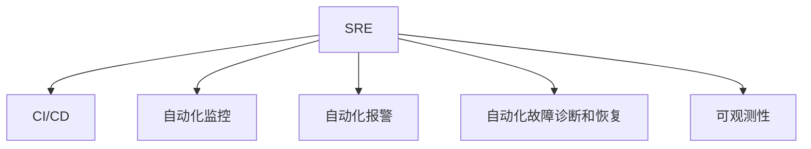

                 

# SRE自动化运维最佳实践

## 1. 背景介绍

### 1.1 问题由来

随着互联网技术的飞速发展，现代企业越来越依赖于复杂的软件系统来支撑其业务。然而，这些系统的规模和复杂性日益增加，运维管理也变得越来越困难。传统的运维方式已经无法满足现代企业的需求，自动化运维成为了提升运维效率和质量的关键手段。

在过去的十年中，站点可靠性工程（Site Reliability Engineering, SRE）成为运维领域的革新力量，它强调使用工程手段来提升系统可用性，同时减少人为错误。自动化是SRE的核心实践之一，通过自动化运维流程，可以大幅提升运维效率，减少人为错误，优化资源配置，保障系统稳定运行。

### 1.2 问题核心关键点

自动化运维的关键在于实现从人工干预到系统自动执行的转变。其核心技术包括持续集成与持续部署（CI/CD）、自动化监控、自动化报警、自动化故障诊断和恢复等。这些技术能够大大降低运维成本，提高系统的可用性和稳定性。

然而，自动化运维也面临一些挑战，如自动化工具的选型、运维流程的标准化、运维团队的技能提升等。如何在自动化运维的道路上不断探索和创新，寻找最佳的实践方案，成为了SRE领域的热门话题。

### 1.3 问题研究意义

自动化运维在提升系统可靠性和运维效率方面具有重要意义：

- 提升运维效率。自动化工具能够24小时不间断地监控系统状态，及时发现和处理故障，大大降低了人工监控的工作量。
- 提高系统可用性。通过自动化手段，可以快速修复故障，减少系统停机时间，提升用户体验。
- 降低运维成本。自动化减少了人工干预，减少了人为错误，同时通过优化资源配置，节省了资源使用成本。
- 保障系统稳定。自动化运维能够及时响应安全威胁，提升系统安全性，保障企业数据的安全。

## 2. 核心概念与联系

### 2.1 核心概念概述

为更好地理解自动化运维的最佳实践，本节将介绍几个关键概念：

- 站点可靠性工程（SRE）：强调使用工程手段来提升系统可用性，同时减少人为错误。
- 持续集成与持续部署（CI/CD）：一种将开发、测试、部署、监控等环节自动化的方法，加快软件迭代速度，提高系统质量。
- 自动化监控：通过自动化工具对系统进行实时监控，及时发现并响应异常，保证系统稳定运行。
- 自动化报警：基于监控数据，自动触发报警，及时通知运维团队，避免问题扩大化。
- 自动化故障诊断和恢复：通过自动化手段诊断故障原因，快速修复系统，减少故障影响。
- 可观测性（Observability）：提供系统运行的全景视图，包括日志、指标、分布式追踪等，帮助运维团队全面理解系统状态。

这些概念之间的逻辑关系可以通过以下Mermaid流程图来展示：



这个流程图展示了SRE的各个核心概念及其之间的关系：

1. SRE通过工程手段提升系统可用性。
2. CI/CD贯穿整个开发周期，提升软件迭代速度和质量。
3. 自动化监控实时监控系统状态，及时发现异常。
4. 自动化报警及时通知运维团队，避免问题扩大。
5. 自动化故障诊断和恢复快速定位和修复故障。
6. 可观测性提供系统运行全景视图，帮助全面理解系统状态。

这些概念共同构成了SRE的核心实践框架，通过综合应用这些技术手段，可以大幅提升系统的可靠性和运维效率。

## 3. 核心算法原理 & 具体操作步骤

### 3.1 算法原理概述

自动化运维的算法原理主要围绕着以下几个方面：

- 自动化流水线：通过CI/CD实现自动化构建、测试、部署、监控流程，提升软件迭代速度和质量。
- 监控与报警：通过自动化监控工具实时监控系统状态，基于预设阈值触发报警，通知运维团队。
- 故障诊断与恢复：通过自动化工具诊断故障原因，自动执行修复操作，减少故障影响。
- 可观测性：通过收集日志、指标、分布式追踪等数据，提供系统运行全景视图，帮助运维团队全面理解系统状态。

这些原理构成了自动化运维的核心技术框架，通过高效的工具和流程设计，可以实现系统的高可用性和稳定性。

### 3.2 算法步骤详解

基于SRE的自动化运维，其具体操作步骤包括：

1. **需求分析**：明确业务需求，设计系统架构，确定自动化运维的范围和目标。
2. **工具选型**：选择合适的CI/CD、自动化监控、报警、故障诊断和恢复工具。
3. **流程设计**：设计自动化运维流程，包括构建、测试、部署、监控、报警、故障诊断和恢复等环节。
4. **配置与实施**：配置自动化工具，实现自动化流程，并进行全面的测试和验证。
5. **运维监控与优化**：持续监控自动化流程的运行状态，收集反馈数据，进行优化和改进。

### 3.3 算法优缺点

自动化运维在提升系统可靠性和运维效率方面具有显著优势，但也存在一些缺点：

#### 优点：

1. **提升效率**：自动化流程减少了人工干预，提高了系统运行效率。
2. **提高准确性**：自动化工具能够避免人为错误，提高操作准确性。
3. **优化资源配置**：自动化工具可以实时监控资源使用情况，优化资源配置。
4. **快速响应故障**：自动化工具能够快速定位和修复故障，减少故障影响。

#### 缺点：

1. **初期投入高**：自动化运维工具的选型和配置需要投入较多的人力和时间。
2. **复杂度增加**：自动化流程的引入可能增加系统的复杂度，需要额外维护和监控。
3. **依赖工具**：自动化运维依赖于特定的工具和技术栈，可能存在兼容性问题。

### 3.4 算法应用领域

自动化运维在各个行业都有广泛的应用，例如：

- **互联网**：网站、应用、微服务的自动化部署和监控。
- **金融**：交易系统、支付系统的自动化运维。
- **电信**：网络设备、云服务的自动化运维。
- **医疗**：医院信息系统的自动化运维。
- **制造**：工业互联网、智能制造系统的自动化运维。
- **教育**：在线教育平台的自动化运维。
- **政府**：电子政务系统的自动化运维。

自动化运维已经成为现代企业提升运维效率和质量的重要手段，适用于各个行业和领域。

## 4. 数学模型和公式 & 详细讲解 & 举例说明

### 4.1 数学模型构建

自动化运维的数学模型主要包括以下几个方面：

- **系统可用性模型**：通过监控系统指标，计算系统的平均可用时间（MTA）、不可用时间（DTA）、平均故障间隔时间（MTBF）等。
- **故障诊断模型**：通过收集日志、指标、分布式追踪等数据，使用机器学习算法（如决策树、神经网络等）进行故障诊断。
- **资源优化模型**：通过监控资源使用情况，使用优化算法（如遗传算法、模拟退火等）进行资源配置优化。

### 4.2 公式推导过程

以系统可用性模型为例，其数学公式如下：

$$
MTA = \frac{U}{D+U}
$$

其中，$U$表示系统可用时间，$D$表示系统不可用时间。

系统可用性模型通过监控系统的运行状态，计算出系统在一段时间内的平均可用时间，帮助评估系统的可靠性和稳定性。

### 4.3 案例分析与讲解

以下是一个自动化运维的实际案例：

某电商网站采用CI/CD流程，通过Jenkins自动化构建、测试和部署。在部署过程中，自动触发监控报警，通过Prometheus实时监控系统指标。如果系统指标超过预设阈值，自动触发报警，并通过Slack通知运维团队。在出现故障时，自动执行故障诊断和修复操作，通过Kubernetes集群进行容器重启和扩展。同时，收集日志、指标和分布式追踪数据，通过ELK Stack进行可视化分析，帮助运维团队全面理解系统状态。

## 5. 项目实践：代码实例和详细解释说明

### 5.1 开发环境搭建

要进行自动化运维的实践，首先需要搭建好开发环境。以下是使用Python进行Kubernetes自动化运维环境的配置流程：

1. 安装Docker：
```bash
sudo apt update
sudo apt install docker.io
sudo systemctl enable docker
sudo systemctl start docker
```

2. 安装Kubernetes：
```bash
sudo apt install apt-transport-https ca-certificates curl gnupg-agent software-properties-common
curl -fsSL https://download.docker.com/linux/debian/gpg | sudo gpg --dearmor -o /usr/share/keyrings/docker-archive-keyring.gpg
echo "deb [arch=$(dpkg --print-architecture) signed-by=/usr/share/keyrings/docker-archive-keyring.gpg] https://download.docker.com/linux/debian $(lsb_release -cs) stable" | sudo tee /etc/apt/sources.list.d/docker.list > /dev/null
sudo apt-get update
sudo apt-get install docker-ce docker-ce-cli containerd.io
```

3. 安装Kubernetes和Minikube：
```bash
sudo apt-get install kubelet kubeadm kubectl
```

4. 安装Minikube：
```bash
mkdir -p $HOME/.minikube
minikube start
```

### 5.2 源代码详细实现

以下是一个使用Kubernetes进行容器自动化部署和监控的Python脚本实现：

```python
from kubernetes import client, config

# 加载Kubernetes配置
config.load_kube_config()

# 创建Kubernetes客户端
v1 = client.CoreV1Api()

# 创建Pod对象
pod = client.V1Pod(
    metadata=client.V1ObjectMeta(name='hello-world', labels={'hello': 'world'}),
    spec=client.V1PodSpec(
        containers=[client.V1Container(
            name='hello-world',
            image='hello-world:latest',
            ports=[client.V1ContainerPort(container_port=80)]
        )]
    )
)

# 创建Pod对象
v1.create_namespaced_pod(namespace='default', body=pod)
```

### 5.3 代码解读与分析

让我们再详细解读一下关键代码的实现细节：

**配置文件和客户端**：
- `config.load_kube_config()`：加载Kubernetes配置文件，建立客户端与Kubernetes集群之间的连接。
- `client.CoreV1Api()`：创建Kubernetes CoreV1API客户端，用于管理Pod对象。

**Pod对象创建**：
- `client.V1Pod()`：定义Pod对象的基本信息，包括元数据和spec。
- `client.V1PodSpec()`：定义Pod的spec部分，包括容器定义和端口映射。
- `client.V1Container()`：定义容器对象，包括容器名称、镜像和端口映射。
- `v1.create_namespaced_pod()`：创建Pod对象，将其部署到Kubernetes集群中。

通过上述代码，我们实现了使用Kubernetes进行容器自动化部署的基本流程。当然，在实际应用中，还需要进一步扩展和优化，如引入自动化监控、报警、故障诊断和恢复等功能，以满足全面的自动化运维需求。

## 6. 实际应用场景

### 6.1 持续集成与持续部署（CI/CD）

CI/CD流程是自动化运维的核心，通过自动化流水线实现从代码提交到部署的快速迭代。以下是一个基于Jenkins的CI/CD实践：

1. **代码提交**：开发人员通过Git推送代码到仓库。
2. **自动化测试**：通过Jenkins触发自动化测试脚本，进行单元测试、集成测试和端到端测试。
3. **自动化构建**：通过Jenkins触发自动化构建流程，生成可部署的镜像。
4. **自动化部署**：通过Jenkins触发自动化部署流程，将镜像部署到Kubernetes集群中。
5. **自动化监控和报警**：通过Prometheus实时监控系统指标，自动触发报警，通知运维团队。

通过CI/CD流程，开发和运维团队可以实现无缝衔接，快速迭代软件，提升系统质量和稳定性。

### 6.2 自动化监控

自动化监控是自动化运维的重要组成部分，通过实时监控系统状态，及时发现和响应异常。以下是一个基于Prometheus和Grafana的监控实践：

1. **数据采集**：通过Prometheus采集系统指标，如CPU使用率、内存使用率、网络流量等。
2. **数据存储**：将采集到的数据存储在Prometheus数据库中。
3. **数据可视化**：通过Grafana对监控数据进行可视化展示，帮助运维团队直观理解系统状态。
4. **自动报警**：基于预设阈值，自动触发报警，通知运维团队。

通过自动化监控，运维团队可以实时了解系统状态，及时响应异常，保障系统稳定运行。

### 6.3 自动化报警

自动化报警是自动化运维的关键环节，通过实时监控系统状态，及时通知运维团队，避免问题扩大化。以下是一个基于Slack的报警实践：

1. **数据采集**：通过Prometheus采集系统指标，如CPU使用率、内存使用率、网络流量等。
2. **数据存储**：将采集到的数据存储在Prometheus数据库中。
3. **报警配置**：配置报警规则，根据预设阈值触发报警。
4. **报警通知**：通过Slack推送报警信息，通知运维团队。

通过自动化报警，运维团队可以及时响应系统异常，避免问题扩大化，保障系统稳定运行。

### 6.4 自动化故障诊断和恢复

自动化故障诊断和恢复是自动化运维的重要手段，通过自动化工具诊断故障原因，快速修复系统。以下是一个基于ELK Stack的故障诊断和恢复实践：

1. **数据采集**：通过ELK Stack收集日志、指标和分布式追踪数据。
2. **数据分析**：使用Kibana进行数据可视化分析，帮助运维团队快速定位故障原因。
3. **故障诊断**：基于数据分析结果，使用机器学习算法进行故障诊断。
4. **自动修复**：通过Kubernetes集群自动执行修复操作，如容器重启和扩展。

通过自动化故障诊断和恢复，运维团队可以快速定位和修复故障，保障系统稳定运行。

## 7. 工具和资源推荐

### 7.1 学习资源推荐

为了帮助开发者系统掌握自动化运维的理论基础和实践技巧，这里推荐一些优质的学习资源：

1. **Kubernetes官方文档**：提供了全面的Kubernetes使用指南和API文档，是学习自动化运维的必备资源。
2. **Docker官方文档**：提供了Docker使用指南和API文档，帮助理解容器化技术。
3. **Prometheus官方文档**：提供了Prometheus使用指南和API文档，帮助理解自动化监控技术。
4. **Grafana官方文档**：提供了Grafana使用指南和API文档，帮助理解数据可视化技术。
5. **ELK Stack官方文档**：提供了ELK Stack使用指南和API文档，帮助理解日志采集和分析技术。
6. **《Kubernetes权威指南》书籍**：介绍了Kubernetes的全面使用和实践方法，适合深入学习。

通过对这些资源的学习实践，相信你一定能够快速掌握自动化运维的精髓，并用于解决实际的运维问题。

### 7.2 开发工具推荐

高效的开发离不开优秀的工具支持。以下是几款用于自动化运维开发的常用工具：

1. **Jenkins**：开源的自动化构建和持续集成工具，支持多种构建和测试插件。
2. **Prometheus**：开源的自动化监控工具，支持高可用性和多维度数据采集。
3. **Grafana**：开源的数据可视化工具，支持丰富的图表和仪表盘。
4. **ELK Stack**：开源的日志采集和分析工具，支持实时数据流处理。
5. **Kubernetes**：开源的容器编排工具，支持弹性扩展和负载均衡。
6. **Kubectl**：Kubernetes命令行工具，方便进行容器管理和运维。

合理利用这些工具，可以显著提升自动化运维任务的开发效率，加快创新迭代的步伐。

### 7.3 相关论文推荐

自动化运维技术的发展源于学界的持续研究。以下是几篇奠基性的相关论文，推荐阅读：

1. **《Kubernetes: Declaring declarative dependencies for reliable container deployment》**：Kubernetes项目组的论文，介绍了Kubernetes的设计思路和核心功能。
2. **《Prometheus: A system for hardware-agnostic monitoring of time series》**：Prometheus项目组的论文，介绍了Prometheus的数据采集和存储机制。
3. **《GraphQL: A query language for your API》**：Grafana项目组的论文，介绍了GraphQL的使用方法和最佳实践。
4. **《Elasticsearch: A Distributed Real-Time Search and Analytics Engine》**：Elasticsearch项目组的论文，介绍了Elasticsearch的核心功能和应用场景。
5. **《Kubernetes: Ten years on: Challenges and future directions》**：Kubernetes项目组的论文，介绍了Kubernetes的发展历程和未来方向。

这些论文代表了大规模自动化运维技术的发展脉络。通过学习这些前沿成果，可以帮助研究者把握学科前进方向，激发更多的创新灵感。

## 8. 总结：未来发展趋势与挑战

### 8.1 总结

本文对自动化运维的最佳实践进行了全面系统的介绍。首先阐述了SRE的核心思想和自动化运维的必要性，明确了自动化运维在提升系统可靠性和运维效率方面的重要价值。其次，从原理到实践，详细讲解了自动化运维的数学模型和具体操作步骤，给出了自动化运维任务开发的完整代码实例。同时，本文还广泛探讨了自动化运维技术在各个行业领域的应用前景，展示了自动化运维范式的巨大潜力。

通过本文的系统梳理，可以看到，自动化运维在提升系统可靠性和运维效率方面具有重要意义。自动化运维通过将传统的运维流程自动化，大大降低了运维成本，提升了系统的可用性和稳定性。未来，伴随自动化运维技术的不断演进，必将进一步推动运维领域的智能化和自动化，为现代企业带来更高的效率和价值。

### 8.2 未来发展趋势

展望未来，自动化运维技术将呈现以下几个发展趋势：

1. **智能化运维**：通过引入AI技术，提升运维决策的智能化水平，自动分析和解决复杂问题。
2. **无代码运维**：通过低代码/无代码工具，降低运维团队的开发难度，提升运维效率。
3. **自动化运维集成**：将自动化运维与其他技术栈进行集成，如DevOps、AIOps等，构建更加全面的运维平台。
4. **多云运维**：支持跨云平台的管理和运维，实现资源的高效利用和弹性扩展。
5. **自动化运维标准化**：通过行业标准和最佳实践，提升自动化运维的规范性和可靠性。
6. **自动监控和报警**：通过自动化监控和报警系统，及时响应系统异常，保障系统稳定运行。
7. **可视化运维**：通过可视化工具，全面展示系统运行状态，提升运维团队的决策效率。

这些趋势凸显了自动化运维技术的广阔前景。这些方向的探索发展，必将进一步提升自动化运维的效果和价值，为现代企业带来更高的效率和价值。

### 8.3 面临的挑战

尽管自动化运维技术已经取得了瞩目成就，但在迈向更加智能化、普适化应用的过程中，它仍面临诸多挑战：

1. **工具选择和整合**：自动化运维依赖于多种工具和技术栈，选择合适的工具并进行高效整合，是运维团队的常见挑战。
2. **数据治理和规范**：自动化运维需要大量的数据输入，如何治理和规范数据质量，是运维团队的重要任务。
3. **运维团队技能**：自动化运维需要运维团队具备更高的技术水平和开发能力，如何提升团队技能，是运维团队需要面对的挑战。
4. **系统复杂度**：自动化运维需要管理大量复杂系统和依赖关系，如何维护系统稳定性和可扩展性，是运维团队的重大挑战。
5. **资源消耗**：自动化运维需要消耗大量计算和存储资源，如何优化资源使用，是运维团队的常见挑战。

正视自动化运维面临的这些挑战，积极应对并寻求突破，将是大规模自动化运维走向成熟的必由之路。相信随着学界和产业界的共同努力，这些挑战终将一一被克服，自动化运维必将在构建人机协同的智能时代中扮演越来越重要的角色。

### 8.4 研究展望

面向未来，自动化运维技术的进一步发展需要在以下几个方面寻求新的突破：

1. **智能化运维**：通过引入AI技术，提升运维决策的智能化水平，自动分析和解决复杂问题。
2. **低代码运维**：通过低代码/无代码工具，降低运维团队的开发难度，提升运维效率。
3. **自动化运维集成**：将自动化运维与其他技术栈进行集成，如DevOps、AIOps等，构建更加全面的运维平台。
4. **多云运维**：支持跨云平台的管理和运维，实现资源的高效利用和弹性扩展。
5. **自动化运维标准化**：通过行业标准和最佳实践，提升自动化运维的规范性和可靠性。
6. **自动监控和报警**：通过自动化监控和报警系统，及时响应系统异常，保障系统稳定运行。
7. **可视化运维**：通过可视化工具，全面展示系统运行状态，提升运维团队的决策效率。

这些方向的研究探索，必将引领自动化运维技术迈向更高的台阶，为构建高效、稳定、智能的自动化运维平台铺平道路。

## 9. 附录：常见问题与解答

**Q1：自动化运维是否适用于所有系统？**

A: 自动化运维在大多数系统中都能取得不错的效果，特别是对于复杂系统和微服务架构。但对于一些需要高度人工干预的系统，如机器人和物联网设备，可能不完全适用。

**Q2：如何选择合适的自动化运维工具？**

A: 选择合适的自动化运维工具需要考虑系统的规模、复杂度、资源配置等因素。常见的工具包括CI/CD（如Jenkins、GitLab CI/CD）、容器管理（如Docker、Kubernetes）、监控报警（如Prometheus、Grafana）等。可以通过技术调研和试用，选择最适合自己系统的工具。

**Q3：自动化运维是否需要人工干预？**

A: 自动化运维并非完全无需人工干预，人工干预在系统故障诊断和修复、新功能部署、异常监控等方面仍具有重要作用。自动化运维是提升运维效率的工具，并非完全替代人工运维。

**Q4：自动化运维的初期投入是否很高？**

A: 自动化运维的初期投入确实较高，需要选择合适的工具和配置，并进行全面的测试和验证。但长期来看，自动化运维能够大幅提升系统可靠性和运维效率，节省大量人力和成本。

**Q5：自动化运维是否容易忽视安全性？**

A: 自动化运维需要特别注意安全性，避免自动化流程引入安全漏洞。可以通过自动化安全检测工具，如SAST、DAST、DevSecOps等，保障系统安全性。

---

作者：禅与计算机程序设计艺术 / Zen and the Art of Computer Programming

