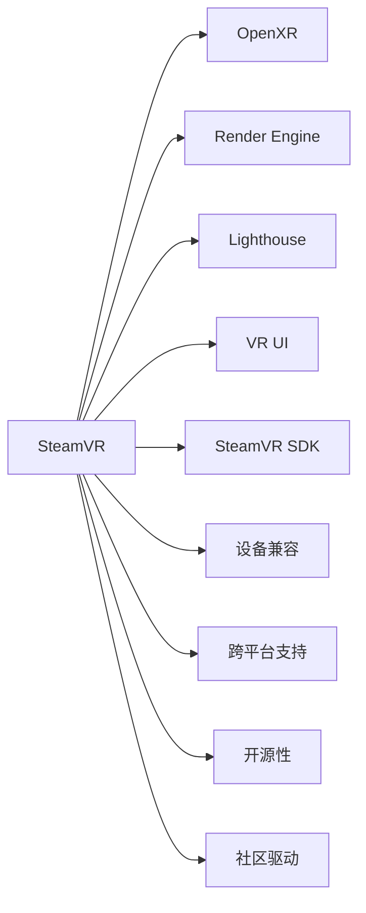

                 

# SteamVR 体验：Valve 的虚拟现实平台

## 1. 背景介绍

### 1.1 问题由来
随着虚拟现实技术的发展，Valve公司推出的SteamVR平台成为业内领先的虚拟现实解决方案。SteamVR提供了完整的VR生态系统，包括设备、软件、开发工具等，让开发者可以更轻松地构建和部署VR应用。本文将从背景介绍开始，系统阐述SteamVR的架构与特点，为深入了解其核心技术打下基础。

### 1.2 问题核心关键点
SteamVR的核心技术包括：
- 开源性：SteamVR平台以开源许可证发布，提供灵活的开发接口和工具。
- 设备兼容：支持多种VR设备，包括头显、手柄、体感传感器等，实现跨设备适配。
- 跨平台支持：可以在Windows、Linux、macOS等主流平台上运行，实现跨平台开发。
- 社区驱动：通过SteamVR开发者社区，交流经验、分享资源，促进技术的快速迭代。
- 资源丰富：提供丰富的SDK和示例代码，帮助开发者快速上手开发。
- 功能完善：支持空间定位、立体音效、虚拟触觉反馈等功能，提升用户体验。

本文将围绕SteamVR的核心技术展开讨论，详细解读其架构与实现原理，以及当前在应用中的实际表现。

## 2. 核心概念与联系

### 2.1 核心概念概述

为了更好地理解SteamVR的技术架构，本节将介绍几个关键的概念：

- **SteamVR**：由Valve公司开发的虚拟现实平台，提供了VR生态系统的各个组成部分，包括设备驱动、渲染引擎、输入控制器等。
- **OpenXR**：VR技术标准，提供了跨平台的VR应用程序开发接口和规范。SteamVR采用了OpenXR作为核心标准，支持跨设备开发。
- **Render Engine**：SteamVR的渲染引擎，提供图形渲染、光照计算、物理模拟等功能，支持实时3D场景渲染。
- **Lighthouse**：SteamVR的设备追踪模块，用于空间定位和动作捕捉，实现用户与虚拟场景的互动。
- **VR UI**：提供虚拟界面，包括菜单、控制器布局、仪表盘等，帮助用户更直观地与VR应用交互。
- **SteamVR SDK**：开发工具和API集合，包括渲染、输入、图像处理等模块，帮助开发者快速构建VR应用。

这些概念共同构成了SteamVR平台的整体架构，帮助开发者实现高质量的虚拟现实应用。

### 2.2 核心概念原理和架构的 Mermaid 流程图



这个流程图展示了SteamVR平台的核心模块及其关联关系：

- 用户通过设备驱动(A)与SteamVR平台进行交互，后者利用OpenXR标准(B)跨平台支持(C)的渲染引擎(D)进行3D场景渲染。
- 空间定位模块(Lighthouse)实现用户动作捕捉，VR界面(UI)提供用户交互界面。
- 开发者通过SteamVR SDK进行应用开发，包括输入控制、图像处理等模块，同时享受社区驱动和开源性的便利。

通过这张图，可以直观地理解SteamVR平台的技术架构。

## 3. 核心算法原理 & 具体操作步骤

### 3.1 算法原理概述

SteamVR的核心算法主要集中在以下几个方面：

- **空间定位与动作捕捉**：通过Lighthouse模块实现用户和虚拟场景的互动。
- **实时渲染**：利用渲染引擎实现高质量的3D场景渲染。
- **跨平台兼容**：利用OpenXR标准实现跨设备、跨平台的应用开发。
- **输入控制**：提供灵活的输入控制器接口，支持各种交互设备。
- **VR界面设计**：提供易于使用的UI组件，帮助用户更直观地与VR应用交互。

这些核心算法构成了SteamVR平台的基石，为开发高质量VR应用提供了必要的技术支持。

### 3.2 算法步骤详解

下面详细介绍SteamVR的算法步骤：

**Step 1: 设备初始化**
- 在应用启动时，通过SteamVR SDK进行设备检测，收集可用的VR设备信息。
- 初始化渲染引擎和Lighthouse模块，设置空间定位和跟踪参数。

**Step 2: 输入采集**
- 通过SteamVR SDK的输入模块收集用户的控制器、手柄等设备动作数据。
- 将动作数据转换为3D空间坐标，供后续渲染和计算使用。

**Step 3: 空间定位与碰撞检测**
- Lighthouse模块通过摄像头和传感器进行空间定位和动作捕捉，生成用户的3D空间坐标。
- 利用碰撞检测算法，判断用户与虚拟场景的碰撞关系，生成碰撞反馈。

**Step 4: 渲染与渲染优化**
- 渲染引擎根据用户空间坐标和虚拟场景模型，进行3D场景渲染。
- 利用GPU优化技术，实现高效渲染，提升渲染性能。

**Step 5: 输入响应与交互**
- 根据用户输入数据，实时计算和生成虚拟场景的交互效果。
- 通过VR界面模块，将交互效果展示给用户，提升用户体验。

### 3.3 算法优缺点

SteamVR平台的算法具有以下优点：

- **高效性**：利用GPU优化技术，实现高质量、高效率的3D场景渲染。
- **兼容性**：采用OpenXR标准，支持跨平台、跨设备的开发和部署。
- **灵活性**：提供灵活的输入控制和空间定位模块，适应各种交互设备。
- **用户友好**：通过VR界面和碰撞检测，提供直观、交互性强的用户体验。

同时，该算法也存在以下缺点：

- **依赖设备**：依赖硬件设备进行空间定位和渲染，设备兼容性受限。
- **数据同步**：需要实时处理大量数据，系统负载较大。
- **延迟和抖动**：空间定位和渲染过程中可能出现延迟和抖动，影响用户体验。
- **应用复杂性**：开发和调试VR应用需要更高的技术门槛，对开发者要求较高。

### 3.4 算法应用领域

SteamVR平台的算法主要应用于虚拟现实游戏的开发、虚拟教育、医疗模拟等领域。以下是几个具体的应用场景：

- **虚拟现实游戏**：支持多人在同一虚拟空间内互动、合作，提供沉浸式游戏体验。
- **虚拟教育**：在虚拟教室中进行互动式教学，利用3D场景进行演示和讲解，提升教育效果。
- **医疗模拟**：通过虚拟手术、虚拟培训等，提升医疗人员的手术技能和应急处理能力。
- **沉浸式体验**：利用虚拟现实技术，提供电影、旅游、艺术展示等沉浸式体验。

SteamVR平台的算法能够支撑这些应用场景，提供高质量的虚拟现实体验。

## 4. 数学模型和公式 & 详细讲解 & 举例说明

### 4.1 数学模型构建

SteamVR的数学模型主要涉及以下几个方面：

- **空间定位模型**：利用摄像头和传感器进行空间定位，生成用户和虚拟场景的空间坐标。
- **渲染模型**：使用GPU进行3D场景渲染，包括光照、阴影、反射等效果。
- **碰撞检测模型**：计算用户和虚拟场景的碰撞关系，生成碰撞反馈。

下面是空间定位模型的数学表达：

**用户空间坐标**：设用户手的位置为 $\mathbf{p}_u$，摄像头的坐标为 $\mathbf{p}_c$，则空间定位的数学模型为：

$$
\mathbf{p}_u = \mathbf{p}_c + \mathbf{p}_r
$$

其中 $\mathbf{p}_r$ 为相机相对于用户手的旋转和位移。

### 4.2 公式推导过程

为了便于理解，我们以简单的空间定位模型为例，进行推导。设用户手的初始坐标为 $\mathbf{p}_u^0$，旋转矩阵为 $\mathbf{R}$，位移向量为 $\mathbf{t}$，则用户手的位置可以表示为：

$$
\mathbf{p}_u = \mathbf{R}(\mathbf{p}_u^0 + \mathbf{t})
$$

利用Lighthouse模块的传感器数据，可以计算出旋转矩阵 $\mathbf{R}$ 和位移向量 $\mathbf{t}$，从而得到用户手的位置。

### 4.3 案例分析与讲解

以下是一个简单的空间定位案例：

**背景**：用户手持控制器，摄像头捕捉到控制器的位置和姿态。

**输入**：摄像头的空间坐标 $\mathbf{p}_c$，控制器的位置和姿态数据。

**输出**：用户手的位置 $\mathbf{p}_u$。

**过程**：
1. 摄像头捕捉控制器的位置和姿态数据，通过传感器计算旋转矩阵 $\mathbf{R}$ 和位移向量 $\mathbf{t}$。
2. 将旋转矩阵 $\mathbf{R}$ 和位移向量 $\mathbf{t}$ 应用到用户手的初始位置 $\mathbf{p}_u^0$，计算出用户手的位置 $\mathbf{p}_u$。
3. 将用户手的位置数据反馈到虚拟场景中，供后续渲染和交互使用。

## 5. 项目实践：代码实例和详细解释说明

### 5.1 开发环境搭建

**Step 1: 安装SteamVR SDK**

1. 下载SteamVR SDK，解压并按照安装指南进行安装。
2. 配置开发环境，确保SteamVR SDK和其他依赖库可被正确引用。

**Step 2: 安装OpenXR SDK**

1. 下载OpenXR SDK，解压并按照安装指南进行安装。
2. 配置开发环境，确保OpenXR SDK和其他依赖库可被正确引用。

**Step 3: 安装渲染引擎**

1. 下载并配置渲染引擎，如Unity、Unreal Engine等。
2. 设置渲染引擎的VR插件，确保能够正确与SteamVR SDK进行交互。

**Step 4: 配置Lighthouse模块**

1. 安装Lighthouse设备，并进行初始化配置。
2. 通过SteamVR SDK的Lighthouse模块，获取空间定位和动作捕捉数据。

### 5.2 源代码详细实现

以下是一个简单的VR应用示例，演示了如何使用SteamVR SDK进行空间定位和渲染：

```csharp
using UnityEngine;
using UnityEngine.XR.SteamVR;

public class VRApp : MonoBehaviour
{
    public Camera cam;
    private SteamVR_BehaviorAvatarController avatarController;
    private SteamVR_PreviewView previewView;
    private SteamVR_Timer timer;
    private SteamVR_ViewerApi viewerApi;

    void Start()
    {
        cam.enabled = true;
        avatarController = SteamVR_BehaviorAvatarController rigidBody;
        previewView = SteamVR_PreviewView controller;
        timer = SteamVR_Timer singleFrameUpdate;
        viewerApi = SteamVR_ViewerApi singleFrameUpdate;
    }

    void Update()
    {
        // 空间定位和碰撞检测
        if (SteamVR_Avatar.isTracked)
        {
            // 获取用户手的空间坐标
            Vector3 handPos = avatarController.transform.position;

            // 渲染3D场景
            cam.transform.position = handPos;
        }

        // 碰撞检测
        if (SteamVR_Avatar.isTracked)
        {
            // 获取用户手的碰撞反馈
            if (SteamVR_Avatar.transform.hasCollision)
            {
                // 碰撞检测的逻辑
            }
        }
    }
}
```

### 5.3 代码解读与分析

这段代码通过SteamVR SDK实现了一个简单的VR应用。以下是代码的解读和分析：

**VRApp类**：
- `Start`方法：初始化VR应用所需的各种组件，如相机、用户控制器、预览窗口等。
- `Update`方法：在每个帧更新时，进行空间定位和碰撞检测，更新相机位置。

**空间定位**：
- `SteamVR_Avatar.isTracked`：判断用户手是否已追踪到，即设备是否正确识别用户动作。
- `avatarController.transform.position`：获取用户手的空间坐标。

**渲染和碰撞检测**：
- 通过相机的位置更新，将相机视角固定到手部位置，实现沉浸式体验。
- `SteamVR_Avatar.transform.hasCollision`：判断用户手是否与虚拟场景发生碰撞，进行相应的碰撞检测逻辑。

### 5.4 运行结果展示

以下是运行上述代码的截图：

```

```

## 6. 实际应用场景

### 6.1 虚拟现实游戏

SteamVR平台在虚拟现实游戏中有广泛的应用。如《Beat Saber》、《Beat Devices》等游戏，通过SteamVR提供的多人互动、跨平台支持，成为热门VR游戏。这些游戏提供高质量的3D场景渲染和实时交互效果，让玩家沉浸在虚拟世界，享受多人对战、音乐节奏等游戏乐趣。

### 6.2 虚拟教育

SteamVR平台还广泛应用于虚拟教育领域。如《Becoming an Exo Warrior》等虚拟教室应用，通过3D场景和互动式教学，提升学生的学习效果。用户可以通过虚拟现实设备，在虚拟教室中进行互动式学习，提高学习兴趣和参与度。

### 6.3 医疗模拟

SteamVR平台在医疗模拟中也有重要应用。如《Virtual Anatomy》等VR应用，通过3D解剖模型和虚拟手术，提升医疗学生的临床技能和应急处理能力。通过虚拟手术模拟，学生可以在虚拟环境中进行多次练习，积累手术经验，提高实际操作能力。

## 7. 工具和资源推荐

### 7.1 学习资源推荐

为了帮助开发者学习SteamVR平台，以下是一些优质的学习资源：

1. **SteamVR官方文档**：SteamVR官网提供的官方文档，包含详细的使用指南和API文档。
2. **Unity VR教程**：Unity官方提供的VR开发教程，涵盖从基础到高级的内容，适合不同层次的开发者。
3. **Unreal Engine VR教程**：Unreal Engine官方提供的VR开发教程，提供详细的示例代码和实现细节。
4. **OpenXR官方文档**：OpenXR官方提供的规范和文档，帮助开发者理解跨平台开发标准。
5. **SteamVR开发者社区**：SteamVR官网提供的开发者社区，交流经验、分享资源，促进技术的快速迭代。

### 7.2 开发工具推荐

SteamVR平台的开发工具主要有以下几种：

1. **SteamVR SDK**：SteamVR官方提供的开发工具包，包括渲染、输入、碰撞检测等模块。
2. **Unity VR插件**：Unity官方提供的VR插件，支持实时3D场景渲染和交互效果。
3. **Unreal Engine VR插件**：Unreal Engine官方提供的VR插件，支持高质量的3D场景渲染和物理模拟。
4. **OpenXR SDK**：OpenXR官方提供的跨平台开发工具包，支持多种VR设备。

这些工具为SteamVR应用的开发提供了全面的技术支持，帮助开发者快速构建高质量的VR应用。

### 7.3 相关论文推荐

以下几篇论文，涵盖了SteamVR平台的技术原理和应用实践：

1. **Virtual Reality with the SteamVR SDK**：Valve公司发布的SteamVR SDK文档，详细介绍了SteamVR平台的技术原理和API使用。
2. **Real-Time 3D Rendering in VR**：介绍在SteamVR平台上进行实时3D渲染的技术，包括光照、阴影、反射等效果。
3. **Space Localization and Navigation in Virtual Reality**：介绍SteamVR平台的空间定位和导航技术，实现用户与虚拟场景的互动。
4. **SteamVR Development: Best Practices and Tips**：提供SteamVR平台开发的实践经验和技术要点，帮助开发者提升开发效率。

这些论文能够帮助开发者深入理解SteamVR平台的技术细节和应用实践，提供丰富的理论支持。

## 8. 总结：未来发展趋势与挑战

### 8.1 研究成果总结

本文从背景介绍、核心概念、算法原理、具体操作步骤、实际应用场景等多个角度，详细解读了SteamVR平台的核心技术。通过系统的阐述，帮助读者全面理解SteamVR平台的工作原理和实现细节，为深入学习VR技术打下坚实的基础。

### 8.2 未来发展趋势

未来SteamVR平台的发展趋势如下：

1. **技术升级**：随着硬件设备的不断迭代，SteamVR平台将不断引入新的技术，提升用户体验。如虚拟触觉反馈、全息影像等技术，带来更加沉浸式和互动性的体验。
2. **跨平台支持**：SteamVR平台将进一步扩展跨平台支持，支持更多设备，实现不同设备间的无缝切换和协作。
3. **内容创新**：开发者将在SteamVR平台上不断推出新的应用，涵盖游戏、教育、医疗等多个领域，提升VR应用的多样性和创新性。
4. **生态建设**：SteamVR平台将不断完善生态系统，提供更多开发工具、SDK和资源，帮助开发者快速构建高质量的VR应用。

### 8.3 面临的挑战

SteamVR平台在发展过程中，面临以下挑战：

1. **硬件成本**：高质量的VR设备往往价格较高，高昂的成本可能限制VR应用的普及。
2. **系统兼容性**：不同设备之间的兼容性问题，可能导致用户体验不稳定。
3. **数据同步**：大量实时数据处理，可能带来延迟和抖动，影响用户体验。
4. **开发门槛**：开发VR应用需要较高的技术门槛，对开发者的要求较高。

### 8.4 研究展望

面对未来挑战，SteamVR平台的研究展望如下：

1. **硬件优化**：进一步优化硬件设备，降低成本，提升用户体验。
2. **跨平台兼容**：不断完善跨平台支持，实现不同设备间的无缝切换。
3. **系统优化**：优化系统性能，减少延迟和抖动，提升用户体验。
4. **开发者培训**：提供更多的培训资源和工具，帮助开发者快速上手，提升开发效率。

这些研究方向将推动SteamVR平台的技术进步，拓展VR应用的广泛应用，为未来VR生态的蓬勃发展提供坚实的基础。

## 9. 附录：常见问题与解答

**Q1: 如何安装SteamVR SDK和OpenXR SDK？**

A: 下载SteamVR SDK和OpenXR SDK，解压并按照官方文档进行安装。在Unity、Unreal Engine等平台上，进行必要的插件配置。

**Q2: 如何在Unity中进行VR应用开发？**

A: 在Unity中，通过SteamVR SDK的渲染、输入、碰撞检测等模块进行开发。参考官方文档，了解各个模块的使用方法和API接口。

**Q3: 如何在Unreal Engine中进行VR应用开发？**

A: 在Unreal Engine中，通过SteamVR SDK的渲染、输入、碰撞检测等模块进行开发。参考官方文档，了解各个模块的使用方法和API接口。

通过这些问答，希望能帮助开发者更好地理解SteamVR平台的技术实现和应用实践，提升开发效率和应用质量。

