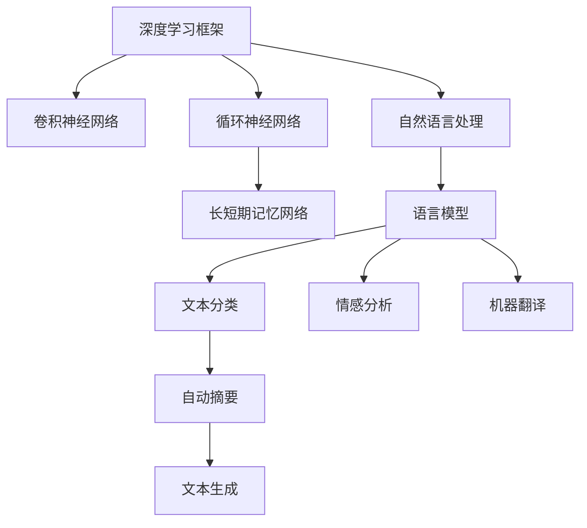

                 

# TensorFlow 应用：图像和自然语言处理

## 1. 背景介绍

### 1.1 问题由来
随着深度学习技术的发展，深度学习框架如TensorFlow已经成为了实现复杂模型、高效计算的重要工具。它在图像处理和自然语言处理(NLP)等领域的应用，大幅提升了计算机视觉和自然语言处理任务的性能。

### 1.2 问题核心关键点
TensorFlow的核心优势在于其灵活的计算图和强大的分布式训练能力，使得大模型的训练和推理变得高效可控。目前，TensorFlow已经在图像分类、目标检测、图像生成、语言模型、文本分类、情感分析等众多NLP任务中得到了广泛的应用。

### 1.3 问题研究意义
TensorFlow框架为图像和自然语言处理任务的实现提供了高效可靠的解决方案，加速了深度学习技术的普及和应用。在实践中，理解和应用TensorFlow框架，可以极大地提升工作效率，推动人工智能技术的落地和产业化进程。

## 2. 核心概念与联系

### 2.1 核心概念概述

为更好地理解TensorFlow在图像和NLP处理中的应用，本节将介绍几个关键概念：

- 深度学习框架：如TensorFlow、PyTorch等，提供了高效、可扩展的深度学习模型构建和训练平台。
- 卷积神经网络(CNN)：专用于图像处理任务的一类深度神经网络，通过卷积操作提取图像特征。
- 循环神经网络(RNN)：专用于序列数据处理的深度神经网络，通过时间步传递状态信息，适用于NLP任务。
- 长短期记忆网络(LSTM)：RNN的一种改进形式，能够记忆长期依赖关系，广泛应用于序列模型。
- 自然语言处理(NLP)：涉及文本处理、语音处理、机器翻译、情感分析等任务的技术，核心是处理文本数据的序列特征。
- 语言模型：预测给定文本序列的概率分布，用于构建文本生成、自动摘要、文本分类等任务。

这些概念之间通过计算图、自动微分、分布式训练等机制，紧密联系，共同构成了深度学习模型的核心技术体系。

### 2.2 核心概念原理和架构的 Mermaid 流程图(Mermaid 流程节点中不要有括号、逗号等特殊字符)



## 3. 核心算法原理 & 具体操作步骤

### 3.1 算法原理概述

TensorFlow框架的核心算法原理是计算图和自动微分，这些机制为复杂模型的高效构建和训练提供了基础。通过定义计算图描述模型结构，TensorFlow能够自动推导和计算梯度，实现高效的反向传播算法，优化模型参数。

TensorFlow在图像处理和NLP任务中的应用，主要依赖于以下算法和机制：

- 卷积神经网络(CNN)：用于提取图像特征，通过多层卷积和池化操作，逐步抽象图像的高级特征。
- 循环神经网络(RNN)和长短期记忆网络(LSTM)：用于处理序列数据，通过时间步传递状态信息，捕捉序列依赖关系。
- 自编码器(Autoencoder)和生成对抗网络(GAN)：用于生成新的图像或文本，通过生成模型和判别模型的对抗训练，提高生成质量。
- 语言模型和Transformer模型：用于自然语言处理任务，通过概率分布预测文本序列，捕捉语言的上下文信息。

### 3.2 算法步骤详解

TensorFlow框架在图像和NLP处理中的应用，主要涉及以下几个步骤：

**Step 1: 模型定义与编译**

- 使用TensorFlow的Keras API定义模型的结构，如卷积层、池化层、全连接层、循环层等。
- 设置模型的优化器、损失函数、评估指标等，进行模型编译。

**Step 2: 数据预处理**

- 加载和预处理图像或文本数据，如归一化、数据增强、分批次加载等。
- 使用TensorFlow的Dataset API和tf.data模块，对数据进行高效批处理和预加载。

**Step 3: 模型训练**

- 定义训练循环，使用TensorFlow的fit方法进行模型训练。
- 通过在每个训练轮次中前向传播计算损失函数，反向传播计算梯度，更新模型参数。
- 使用TensorBoard进行模型训练监控和日志记录。

**Step 4: 模型评估**

- 在验证集或测试集上评估模型性能，如准确率、召回率、F1分数等。
- 使用TensorFlow的evaluate方法计算模型在测试集上的指标。

**Step 5: 模型导出和部署**

- 将训练好的模型导出为 SavedModel 或 tf.keras.Model 格式，便于部署和应用。
- 使用TensorFlow Serving或TensorFlow Lite等工具进行模型部署和推理。

### 3.3 算法优缺点

TensorFlow框架在图像和NLP处理中的应用具有以下优点：

- 强大的计算图和自动微分机制，便于构建复杂模型。
- 丰富的API和工具支持，如Keras API、tf.data模块、TensorBoard等，方便开发者快速上手。
- 强大的分布式训练能力，支持GPU/TPU等高性能硬件，提升训练效率。
- 良好的社区支持和生态系统，开发者可以充分利用开源资源和社区讨论。

同时，该框架也存在一些局限性：

- 学习曲线较陡峭，需要开发者对深度学习原理有较深的理解。
- 性能优化空间较大，需要开发者在模型结构和超参数等方面不断调优。
- 动态计算图可能导致内存占用较高，需要合理管理内存资源。
- 模型导出和部署过程复杂，需要开发者熟悉TensorFlow Serving、TensorFlow Lite等工具的使用。

尽管存在这些局限性，但TensorFlow凭借其强大的计算能力和灵活的开发方式，已经成为深度学习领域的主流框架之一。

### 3.4 算法应用领域

TensorFlow框架在图像处理和NLP处理中的应用非常广泛，涵盖以下领域：

- 计算机视觉：如图像分类、目标检测、图像分割、人脸识别等。
- 自然语言处理：如语言模型、情感分析、机器翻译、自动摘要等。
- 语音处理：如语音识别、语音合成、情感识别等。
- 推荐系统：如用户行为预测、个性化推荐等。
- 医学影像分析：如疾病诊断、影像分割等。
- 金融分析：如信用评分、风险预测等。

此外，TensorFlow还被广泛应用于自动驾驶、工业检测、智能监控、游戏开发等多个领域，展示了其在深度学习领域的多样性和广泛性。

## 4. 数学模型和公式 & 详细讲解 & 举例说明

### 4.1 数学模型构建

TensorFlow框架在图像和NLP处理中的应用，通常涉及以下数学模型：

- 卷积神经网络(CNN)：
$$
y = W*x + b
$$
其中 $W$ 为卷积核，$x$ 为输入图像，$b$ 为偏置项。

- 循环神经网络(RNN)和长短期记忆网络(LSTM)：
$$
h_t = f_t(h_{t-1}, x_t)
$$
其中 $f_t$ 为时间步函数，$h_t$ 为当前时间步的状态，$x_t$ 为当前时间步的输入。

- 自编码器(Autoencoder)：
$$
\hat{x} = D(E(x))
$$
其中 $E$ 为编码器，$D$ 为解码器，$x$ 为输入，$\hat{x}$ 为重构结果。

- 生成对抗网络(GAN)：
$$
\begin{aligned}
&G_{\theta_G}(z) = x \\
&D_{\theta_D}(x) = p(x)
\end{aligned}
$$
其中 $G_{\theta_G}$ 为生成器，$D_{\theta_D}$ 为判别器，$z$ 为噪声向量，$x$ 为生成结果。

- 语言模型：
$$
p(x_1, x_2, ..., x_n) = \prod_{i=1}^n p(x_i | x_{<i})
$$
其中 $x_1, x_2, ..., x_n$ 为文本序列，$p(x_i | x_{<i})$ 为给定前文 $x_{<i}$ 条件下 $x_i$ 的条件概率。

### 4.2 公式推导过程

以下是几个关键模型的公式推导：

**卷积神经网络(CNN)**

卷积神经网络通过卷积操作提取图像特征，其计算公式为：
$$
y = W*x + b
$$
其中 $W$ 为卷积核，$x$ 为输入图像，$b$ 为偏置项。

**循环神经网络(RNN)**

循环神经网络通过时间步传递状态信息，计算公式为：
$$
h_t = f_t(h_{t-1}, x_t)
$$
其中 $f_t$ 为时间步函数，$h_t$ 为当前时间步的状态，$x_t$ 为当前时间步的输入。

**自编码器(Autoencoder)**

自编码器通过编码和解码过程实现数据的重构，其计算公式为：
$$
\hat{x} = D(E(x))
$$
其中 $E$ 为编码器，$D$ 为解码器，$x$ 为输入，$\hat{x}$ 为重构结果。

**生成对抗网络(GAN)**

生成对抗网络通过生成器和判别器的对抗训练，生成高质量的样本，其计算公式为：
$$
\begin{aligned}
&G_{\theta_G}(z) = x \\
&D_{\theta_D}(x) = p(x)
\end{aligned}
$$
其中 $G_{\theta_G}$ 为生成器，$D_{\theta_D}$ 为判别器，$z$ 为噪声向量，$x$ 为生成结果。

**语言模型**

语言模型通过概率模型预测文本序列，其计算公式为：
$$
p(x_1, x_2, ..., x_n) = \prod_{i=1}^n p(x_i | x_{<i})
$$
其中 $x_1, x_2, ..., x_n$ 为文本序列，$p(x_i | x_{<i})$ 为给定前文 $x_{<i}$ 条件下 $x_i$ 的条件概率。

### 4.3 案例分析与讲解

以下通过一个简单的图像分类任务的例子，展示TensorFlow框架的使用。

**案例背景**

假设有一组猫和狗的图像数据，需要构建一个卷积神经网络对图像进行分类。

**代码实现**

```python
import tensorflow as tf
from tensorflow.keras import layers

# 定义模型结构
model = tf.keras.Sequential([
    layers.Conv2D(32, (3,3), activation='relu', input_shape=(64,64,3)),
    layers.MaxPooling2D((2,2)),
    layers.Conv2D(64, (3,3), activation='relu'),
    layers.MaxPooling2D((2,2)),
    layers.Flatten(),
    layers.Dense(64, activation='relu'),
    layers.Dense(2, activation='softmax')
])

# 编译模型
model.compile(optimizer='adam', loss='categorical_crossentropy', metrics=['accuracy'])

# 训练模型
model.fit(train_images, train_labels, epochs=10, validation_data=(val_images, val_labels))

# 评估模型
test_loss, test_acc = model.evaluate(test_images, test_labels)
print('Test accuracy:', test_acc)
```

**代码解读与分析**

上述代码中，首先定义了一个卷积神经网络模型，包含卷积层、池化层、全连接层等。然后编译模型，使用Adam优化器和交叉熵损失函数，训练10个epoch。最后评估模型在测试集上的性能，并输出测试准确率。

## 5. 项目实践：代码实例和详细解释说明

### 5.1 开发环境搭建

在使用TensorFlow进行图像和NLP处理的项目开发中，需要先搭建好开发环境。以下是基于Python的TensorFlow开发环境的配置流程：

1. 安装Anaconda：从官网下载并安装Anaconda，用于创建独立的Python环境。

2. 创建并激活虚拟环境：
```bash
conda create -n tensorflow-env python=3.8 
conda activate tensorflow-env
```

3. 安装TensorFlow：根据CUDA版本，从官网获取对应的安装命令。例如：
```bash
conda install tensorflow -c conda-forge
```

4. 安装TensorBoard：用于可视化模型训练过程，记录和显示训练数据和图表。
```bash
pip install tensorboard
```

5. 安装其它依赖库：
```bash
pip install numpy pandas scikit-learn matplotlib tqdm jupyter notebook ipython
```

完成上述步骤后，即可在`tensorflow-env`环境中开始TensorFlow开发。

### 5.2 源代码详细实现

以下是使用TensorFlow进行图像分类任务的完整代码实现：

```python
import tensorflow as tf
from tensorflow.keras import layers, datasets

# 加载数据集
(train_images, train_labels), (val_images, val_labels), (test_images, test_labels) = datasets.cifar10.load_data()

# 数据预处理
train_images = train_images / 255.0
val_images = val_images / 255.0
test_images = test_images / 255.0

# 定义模型结构
model = tf.keras.Sequential([
    layers.Conv2D(32, (3,3), activation='relu', input_shape=(32,32,3)),
    layers.MaxPooling2D((2,2)),
    layers.Conv2D(64, (3,3), activation='relu'),
    layers.MaxPooling2D((2,2)),
    layers.Flatten(),
    layers.Dense(64, activation='relu'),
    layers.Dense(10, activation='softmax')
])

# 编译模型
model.compile(optimizer='adam', loss='sparse_categorical_crossentropy', metrics=['accuracy'])

# 训练模型
model.fit(train_images, train_labels, epochs=10, validation_data=(val_images, val_labels))

# 评估模型
test_loss, test_acc = model.evaluate(test_images, test_labels)
print('Test accuracy:', test_acc)
```

**代码解读与分析**

上述代码中，首先加载CIFAR-10数据集，进行数据预处理。然后定义一个简单的卷积神经网络模型，包含卷积层、池化层、全连接层等。接着编译模型，使用Adam优化器和交叉熵损失函数，训练10个epoch。最后评估模型在测试集上的性能，并输出测试准确率。

## 6. 实际应用场景

### 6.1 计算机视觉

计算机视觉是TensorFlow应用的重要领域之一，主要包括图像分类、目标检测、图像分割、人脸识别等任务。例如，Google的Inception网络、ResNet网络等在图像分类任务上取得了很好的效果。

### 6.2 自然语言处理

自然语言处理是TensorFlow应用的另一个重要领域，主要包括语言模型、情感分析、机器翻译、自动摘要等任务。例如，OpenAI的GPT-2、BERT等在大规模文本处理上表现出色。

### 6.3 语音处理

语音处理也是TensorFlow应用的重要领域，主要包括语音识别、语音合成、情感识别等任务。例如，TensorFlow的SpeechCommands项目可以实现对各种语音命令的识别。

### 6.4 推荐系统

推荐系统也是TensorFlow应用的重要领域，主要包括用户行为预测、个性化推荐等任务。例如，TensorFlow的推荐系统库可以用于构建推荐模型，提升用户体验。

### 6.5 金融分析

金融分析也是TensorFlow应用的重要领域，主要包括信用评分、风险预测等任务。例如，TensorFlow的RiskHub项目可以实现对金融风险的预测和管理。

## 7. 工具和资源推荐

### 7.1 学习资源推荐

为了帮助开发者系统掌握TensorFlow的应用，这里推荐一些优质的学习资源：

1. TensorFlow官方文档：TensorFlow官方提供的文档，包含详细的API使用说明和示例代码。
2. TensorFlow教程：Google提供的TensorFlow教程，涵盖从入门到进阶的各个阶段。
3. TensorFlow实战：《TensorFlow实战》一书，详细介绍TensorFlow的应用场景和实战案例。
4. TensorFlow中文社区：TensorFlow中文社区提供丰富的学习资料和讨论平台，促进开发者交流。
5. Kaggle竞赛：Kaggle上的各种图像分类、NLP等竞赛，通过实践提升技能。

通过对这些资源的学习实践，相信你一定能够快速掌握TensorFlow的应用，并用于解决实际的图像和NLP问题。

### 7.2 开发工具推荐

TensorFlow提供了丰富的API和工具，便于开发和部署深度学习模型。以下是几款常用的开发工具：

1. Jupyter Notebook：交互式的开发环境，支持代码执行和结果展示。
2. TensorBoard：可视化工具，可以实时监测模型训练状态，记录训练日志和图表。
3. TensorFlow Serving：模型部署工具，支持快速部署和调用模型。
4. TensorFlow Lite：轻量级模型部署工具，支持移动端和嵌入式设备。

这些工具的使用，可以大大提升TensorFlow模型开发的效率和质量。

### 7.3 相关论文推荐

TensorFlow作为深度学习领域的领先框架，相关的学术论文非常丰富。以下是几篇重要的论文，推荐阅读：

1. ImageNet Classification with Deep Convolutional Neural Networks：AlexNet论文，首次展示了卷积神经网络在图像分类任务上的强大性能。
2. Deep Residual Learning for Image Recognition：ResNet论文，提出了残差网络结构，提高了深度神经网络的训练效率和精度。
3. Attention is All You Need：Transformer论文，提出了Transformer结构，开创了NLP领域的预训练大模型时代。
4. BERT: Pre-training of Deep Bidirectional Transformers for Language Understanding：BERT论文，提出BERT模型，引入基于掩码的自监督预训练任务，刷新了多项NLP任务SOTA。

这些论文代表了大规模深度学习模型的发展脉络，展示了TensorFlow框架在图像和NLP任务中的应用潜力。

## 8. 总结：未来发展趋势与挑战

### 8.1 总结

本文对TensorFlow在图像和自然语言处理中的应用进行了全面系统的介绍。首先阐述了TensorFlow框架的优势和适用范围，明确了其在深度学习领域的核心地位。其次，从原理到实践，详细讲解了TensorFlow的应用流程，包括模型定义、数据预处理、模型训练、模型评估等步骤。最后，本文探讨了TensorFlow在实际应用中的多种场景和未来发展趋势，展示了其广泛的适用性和应用潜力。

通过本文的系统梳理，可以看到，TensorFlow框架在图像和NLP处理中具有强大的计算能力和灵活的开发方式，已经成为深度学习领域的重要工具。未来，随着深度学习技术的不断进步，TensorFlow将在更多领域发挥重要作用，进一步推动人工智能技术的落地和产业化进程。

### 8.2 未来发展趋势

展望未来，TensorFlow框架的发展趋势如下：

1. 更好的计算图优化：通过自动图重写、静态图计算等技术，进一步提升TensorFlow的计算性能。
2. 更丰富的API支持：推出新的API，如TensorFlow.js、TensorFlow Lite等，支持更多设备和平台。
3. 更高效的分布式训练：改进分布式训练机制，支持更多硬件和网络环境。
4. 更强大的自动化工具：引入自动化工具，如TensorFlow AutoML、TensorFlow Extended等，帮助开发者快速构建模型。
5. 更广泛的社区支持：加强社区建设，提升开源项目的活跃度和贡献度。
6. 更强的生态系统：与更多开源项目、应用场景进行整合，提升TensorFlow的实用性和普及度。

以上趋势展示了TensorFlow框架未来的发展方向，必将进一步推动深度学习技术的发展和应用。

### 8.3 面临的挑战

尽管TensorFlow框架具有强大的计算能力和灵活的开发方式，但在实际应用中也面临一些挑战：

1. 学习曲线较陡峭：深度学习原理和TensorFlow API的学习需要一定的背景知识，初学者可能难以上手。
2. 性能优化空间较大：需要开发者在模型结构和超参数等方面不断调优，才能获得最佳性能。
3. 动态计算图可能导致内存占用较高：需要合理管理内存资源，避免内存溢出。
4. 模型导出和部署过程复杂：需要开发者熟悉TensorFlow Serving、TensorFlow Lite等工具的使用。

尽管存在这些挑战，但TensorFlow凭借其强大的计算能力和灵活的开发方式，已经成为深度学习领域的主流框架之一。

### 8.4 研究展望

面对TensorFlow框架在实际应用中面临的挑战，未来的研究需要在以下几个方面寻求新的突破：

1. 开发更加用户友好的API和工具：引入更多的自动化和智能化功能，降低开发门槛。
2. 提升模型训练和推理的效率：优化计算图和自动微分机制，提升模型的训练和推理速度。
3. 改进分布式训练和分布式优化：改进分布式训练和分布式优化算法，提升模型的并行训练能力。
4. 引入更多的深度学习新方法：引入新的深度学习算法和模型，提升TensorFlow的适用性和实用性。
5. 强化TensorFlow社区和生态系统：加强社区建设，提升开源项目的活跃度和贡献度，推动TensorFlow的普及和应用。

这些研究方向的探索，必将推动TensorFlow框架的不断进步，为深度学习技术的落地和产业化进程提供更加强大的工具支持。总之，TensorFlow框架将在未来继续发挥其重要的作用，为深度学习技术的广泛应用提供坚实的基础。

## 9. 附录：常见问题与解答

**Q1：TensorFlow框架是否只适用于图像处理？**

A: TensorFlow框架不仅适用于图像处理，还广泛用于自然语言处理、语音处理、推荐系统、金融分析等多个领域。TensorFlow提供了丰富的API和工具支持，可以应用于各种深度学习任务。

**Q2：TensorFlow框架是否适合大模型训练？**

A: TensorFlow框架非常适合大模型训练，支持分布式计算和动态图优化。通过TensorFlow的分布式训练机制，可以在GPU/TPU等高性能硬件上进行高效训练。同时，TensorFlow的动态计算图优化技术，可以大大提升模型的训练效率。

**Q3：TensorFlow框架在部署过程中需要注意哪些问题？**

A: TensorFlow框架在部署过程中需要注意以下问题：

1. 模型压缩和优化：使用TensorFlow Lite等工具，对模型进行压缩和优化，减小模型尺寸，提升推理速度。
2. 模型版本管理：使用TensorFlow Serving等工具，管理不同版本的模型，方便切换和更新。
3. 模型性能优化：优化模型结构，调整超参数，提升模型推理速度和准确率。
4. 模型安全性和隐私保护：使用数据脱敏和访问鉴权等措施，保障模型和数据的安全性。

通过合理管理这些问题，可以确保TensorFlow模型在实际应用中具有良好的性能和安全性。

**Q4：TensorFlow框架在实际应用中如何提升模型性能？**

A: 在TensorFlow框架中，提升模型性能需要从多个方面入手：

1. 优化模型结构：使用更好的网络结构，如ResNet、Inception等，提升模型的表达能力和泛化能力。
2. 调整超参数：通过调整学习率、批大小、正则化系数等超参数，找到最优的模型训练方案。
3. 引入自动化工具：使用TensorFlow AutoML等自动化工具，快速构建和优化模型。
4. 引入更多的数据：使用更多的数据进行训练，提升模型的泛化能力和鲁棒性。
5. 引入预训练模型：使用预训练模型进行迁移学习，提高模型的初始化效果。

通过以上措施，可以显著提升TensorFlow模型在实际应用中的性能。

**Q5：TensorFlow框架在实际应用中如何处理过拟合问题？**

A: 在TensorFlow框架中，处理过拟合问题需要从多个方面入手：

1. 使用正则化技术：使用L2正则、Dropout、早停等技术，防止模型过拟合。
2. 增加数据量：使用数据增强技术，如旋转、翻转、缩放等，增加数据量，提升模型的泛化能力。
3. 引入对抗样本：使用对抗样本，提升模型的鲁棒性和泛化能力。
4. 引入参数高效微调技术：使用参数高效微调技术，如Adapter、LoRA等，减少过拟合风险。
5. 引入模型集成技术：使用模型集成技术，如Bagging、Boosting等，提升模型的泛化能力和鲁棒性。

通过以上措施，可以显著提升TensorFlow模型在实际应用中的泛化能力和鲁棒性。

---

作者：禅与计算机程序设计艺术 / Zen and the Art of Computer Programming

