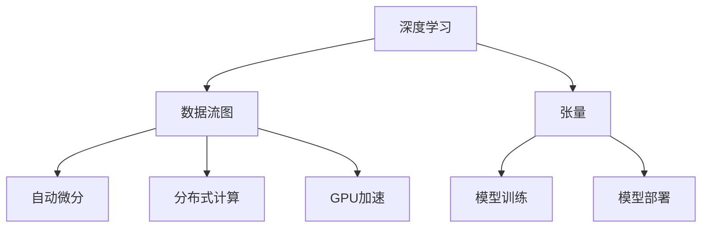

                 

# TensorFlow深度学习框架：从入门到精通

> 关键词：深度学习,TensorFlow,机器学习,神经网络,优化算法,自动微分,分布式计算,张量图,GPU加速,模型训练,模型部署

## 1. 背景介绍

### 1.1 问题由来

深度学习是人工智能领域的重要分支，通过模拟人脑神经网络结构，能够处理复杂非线性问题，广泛应用于图像识别、语音识别、自然语言处理等领域。深度学习框架则是实现深度学习算法的软件工具，其中TensorFlow是最著名和最流行的深度学习框架之一。

TensorFlow由Google于2015年开源，起初是用于机器学习研究工具，之后逐渐成为工业界广泛使用的深度学习框架。TensorFlow的核心理念是“数据流图”，通过构建计算图来描述神经网络的计算过程，支持高效的计算和分布式训练。TensorFlow的广泛应用来源于其强大的计算能力、灵活的接口和丰富的工具库。

本文旨在深入介绍TensorFlow的核心概念、算法原理和应用场景，帮助读者从入门到精通，掌握TensorFlow深度学习框架。

### 1.2 问题核心关键点

TensorFlow框架的核心关键点包括：
1. 数据流图计算模型
2. 自动微分机制
3. 分布式计算能力
4. 高效内存管理
5. 广泛的API接口
6. 丰富的工具库和预训练模型

通过理解这些核心概念，可以更好地把握TensorFlow的原理和使用方法，实现高效、灵活、稳定的深度学习模型。

## 2. 核心概念与联系

### 2.1 核心概念概述

为更好地理解TensorFlow框架，本节将介绍几个密切相关的核心概念：

- 深度学习(Deep Learning)：通过多层神经网络结构，模拟人脑神经网络处理复杂数据的能力，广泛应用于图像识别、语音识别、自然语言处理等领域。

- 数据流图(Dataflow Graph)：TensorFlow的核心概念，通过构建计算图来描述神经网络的计算过程，支持高效的计算和分布式训练。

- 张量(Tensor)：TensorFlow中的基本数据结构，用于存储多维数组，支持高效的操作和计算。

- 自动微分(Automatic Differentiation)：TensorFlow的核心优化技术，通过计算图的反向传播，自动求取损失函数对每个变量参数的梯度，从而进行模型优化。

- 分布式计算(Distributed Computing)：TensorFlow支持多机多GPU的分布式计算，能够并行化计算，提高训练速度和模型性能。

- GPU加速(GPU Acceleration)：通过NVIDIA的CUDA并行计算框架，TensorFlow能够在GPU上高效运行，大幅提高计算速度。

- 模型训练(Model Training)：使用训练数据对深度学习模型进行优化，使模型能够对新数据进行准确预测。

- 模型部署(Model Deployment)：将训练好的模型集成到实际应用系统中，进行推理预测。

这些核心概念之间的逻辑关系可以通过以下Mermaid流程图来展示：



这个流程图展示了大语言模型的核心概念及其之间的关系：

1. 深度学习通过多层神经网络处理复杂数据，构建数据流图计算模型。
2. 数据流图描述神经网络计算过程，自动微分计算梯度，进行模型优化。
3. 分布式计算支持多机多GPU并行化训练，GPU加速提升计算效率。
4. 模型训练使用训练数据优化模型，模型部署集成到实际应用中。

这些概念共同构成了TensorFlow深度学习框架的基础，使得TensorFlow能够高效、灵活地处理和优化复杂深度学习模型。

## 3. 核心算法原理 & 具体操作步骤

### 3.1 算法原理概述

TensorFlow的算法原理主要基于以下两个核心技术：

- 数据流图计算模型：通过构建计算图来描述神经网络的计算过程，支持高效的计算和分布式训练。

- 自动微分机制：通过计算图的反向传播，自动求取损失函数对每个变量参数的梯度，从而进行模型优化。

在TensorFlow中，模型训练的过程可以看作是计算图中各个节点间的数据流传递和计算过程。计算图中的每个节点表示一个计算操作，输入和输出连接形成数据流。每个节点都有一个或多个输入张量和输出张量，通过计算节点的运算，得到新的张量。整个计算图可以被视为一个函数，将输入张量映射到输出张量。

TensorFlow通过反向传播算法，计算损失函数对每个变量参数的梯度，从而进行模型优化。反向传播算法基于链式法则，通过计算图中每个节点的梯度，逐步回传到输入节点，得到损失函数对每个参数的梯度。

### 3.2 算法步骤详解

TensorFlow的核心算法步骤包括：

**Step 1: 准备数据和模型**

- 准备训练数据集，包括输入数据X和对应的标签y。
- 定义模型结构，包括输入层、隐藏层和输出层。
- 定义损失函数，如均方误差、交叉熵等。

**Step 2: 定义计算图**

- 构建计算图，定义各个计算节点和数据流。
- 定义优化器，如Adam、SGD等，设置学习率等参数。

**Step 3: 训练模型**

- 使用训练数据集，对计算图进行前向传播计算预测结果。
- 计算预测结果与真实标签之间的差异，得到损失函数值。
- 使用反向传播算法计算梯度，优化模型参数。
- 重复上述过程，直至模型收敛。

**Step 4: 模型评估**

- 使用测试数据集，对计算图进行前向传播计算预测结果。
- 计算预测结果与真实标签之间的差异，得到评估指标如准确率、精确率等。

**Step 5: 模型部署**

- 将训练好的模型集成到实际应用系统中。
- 对新数据进行前向传播计算预测结果。

以上是TensorFlow的基本算法步骤，通过逐步构建和优化计算图，实现深度学习模型的训练和部署。

### 3.3 算法优缺点

TensorFlow作为主流的深度学习框架，具有以下优点：
1. 灵活性高：通过构建自定义计算图，可以实现各种复杂的网络结构和算法。
2. 高效性高：通过自动微分机制和分布式计算，支持高效的计算和训练。
3. 兼容性高：支持多种硬件平台，包括CPU、GPU和TPU等。
4. 社区活跃：拥有庞大的用户群体和活跃的社区支持。

同时，TensorFlow也存在一些缺点：
1. 学习曲线陡峭：需要掌握复杂的数据流图结构和算法。
2. 性能调优复杂：需要深入理解计算图和内存管理等细节。
3. 部署复杂：需要考虑模型部署的各个环节，如服务化封装、弹性伸缩等。

尽管存在这些缺点，TensorFlow的强大功能和广泛应用，使其成为深度学习领域的标杆。未来，TensorFlow还将继续创新，提高模型性能和部署效率。

### 3.4 算法应用领域

TensorFlow广泛应用于各种深度学习应用，包括：

- 计算机视觉：图像分类、目标检测、图像分割等。
- 自然语言处理：语言模型、机器翻译、情感分析等。
- 语音识别：语音识别、语音合成、语音转换等。
- 推荐系统：用户行为分析、商品推荐、广告推荐等。
- 时间序列分析：股票预测、交通流量预测、气象预测等。
- 游戏AI：策略博弈、智能对战、虚拟助手等。

除此之外，TensorFlow还被广泛应用于自动驾驶、医疗诊断、金融预测等领域，为各行各业带来了深远影响。

## 4. 数学模型和公式 & 详细讲解 & 举例说明

### 4.1 数学模型构建

在TensorFlow中，模型的数学模型通常由输入、隐藏层、输出和损失函数组成。

设输入数据为 $X=\{x_1,x_2,...,x_m\}$，其中 $x_i$ 为向量，表示第 $i$ 个样本的特征向量。隐藏层通常由多个全连接层和激活函数组成。输出层根据任务类型可以是分类器或回归器。

定义模型 $f$ 为从输入 $X$ 到输出 $Y$ 的映射，即 $Y=f(X)$。模型训练的目标是最小化损失函数 $L(Y,\hat{Y})$，其中 $\hat{Y}$ 为模型预测结果。常用的损失函数包括均方误差、交叉熵等。

### 4.2 公式推导过程

以一个简单的线性回归模型为例，推导其TensorFlow实现过程。

假设模型的输入数据为 $X=\{x_1,x_2,...,x_m\}$，输出为 $Y$，线性回归模型可以表示为：

$$
Y = wx + b
$$

其中 $w$ 和 $b$ 为模型参数，需要最小化均方误差损失函数：

$$
L(Y,\hat{Y}) = \frac{1}{2}\sum_{i=1}^m (Y_i - \hat{Y}_i)^2
$$

在TensorFlow中，可以使用如下代码实现：

```python
import tensorflow as tf

# 定义输入和输出
x = tf.placeholder(tf.float32, shape=[None, n])
y = tf.placeholder(tf.float32, shape=[None, 1])

# 定义模型参数
w = tf.Variable(tf.random_normal([n, 1]))
b = tf.Variable(tf.zeros([1]))

# 定义模型计算图
y_pred = tf.matmul(x, w) + b

# 定义损失函数
loss = tf.reduce_mean(tf.square(y_pred - y))

# 定义优化器
optimizer = tf.train.GradientDescentOptimizer(learning_rate=0.01)

# 定义训练操作
train_op = optimizer.minimize(loss)
```

在上述代码中，首先定义输入 $x$ 和输出 $y$ 的占位符，然后定义模型参数 $w$ 和 $b$，接着定义模型计算图 $y_{pred}$ 和损失函数 $loss$。最后，使用梯度下降优化器 $optimizer$ 对损失函数进行最小化，得到训练操作 $train_op$。

通过TensorFlow的计算图结构，实现了上述线性回归模型的训练过程。

### 4.3 案例分析与讲解

以TensorFlow在自然语言处理领域的应用为例，介绍其在机器翻译中的应用。

机器翻译是将源语言文本翻译成目标语言文本的过程，是自然语言处理领域的重要任务之一。TensorFlow在机器翻译中的实现通常采用编码器-解码器架构，通过注意力机制和Transformer网络进行训练。

假设源语言为英语，目标语言为中文，机器翻译的模型可以表示为：

$$
y = f(x, e(x))
$$

其中 $x$ 为源语言文本，$y$ 为目标语言文本，$e(x)$ 为编码器，将源语言文本编码成向量表示，$f$ 为解码器，将向量表示翻译成目标语言文本。

在TensorFlow中，可以使用如下代码实现：

```python
import tensorflow as tf

# 定义输入和输出
input_x = tf.placeholder(tf.string, shape=[None, None])
output_y = tf.placeholder(tf.string, shape=[None, None])

# 定义模型参数
embedding_dim = 256
hidden_dim = 512
num_layers = 6

# 定义编码器
encoder_embeddings = tf.layers.Embedding(input_dim=vocab_size, output_dim=embedding_dim)
encoder_cell = tf.contrib.rnn.LSTMCell(hidden_dim, forget_bias=1.0, state_is_tuple=True)
encoder_outputs, encoder_state = tf.nn.dynamic_rnn(encoder_cell, encoder_embeddings(input_x), dtype=tf.float32)

# 定义解码器
decoder_embeddings = tf.layers.Embedding(input_dim=vocab_size, output_dim=embedding_dim)
decoder_cell = tf.contrib.rnn.LSTMCell(hidden_dim, forget_bias=1.0, state_is_tuple=True)
attn_cell = tf.contrib.rnn.AttentionCellWrapper(decoder_cell, attention_size=hidden_dim)
decoder_outputs, decoder_state = tf.nn.dynamic_rnn(attn_cell, decoder_embeddings(output_y), initial_state=encoder_state, dtype=tf.float32)

# 定义损失函数
softmax_w = tf.Variable(tf.random_normal([vocab_size, embedding_dim]))
softmax_b = tf.Variable(tf.zeros([vocab_size]))
logits = tf.matmul(decoder_outputs, softmax_w) + softmax_b
loss = tf.losses.sparse_softmax_cross_entropy(labels=tf.cast(output_y, tf.int32), logits=logits)

# 定义优化器
optimizer = tf.train.AdamOptimizer()

# 定义训练操作
train_op = optimizer.minimize(loss)
```

在上述代码中，首先定义输入 $input_x$ 和输出 $output_y$ 的占位符，然后定义模型参数 $embedding_dim$、$hidden_dim$ 和 $num_layers$，接着定义编码器 $encoder_cell$ 和解码器 $decoder_cell$，通过LSTM层实现编码和解码。最后，定义损失函数 $loss$ 和优化器 $optimizer$，得到训练操作 $train_op$。

通过TensorFlow的计算图结构，实现了上述机器翻译模型的训练过程。

## 5. 项目实践：代码实例和详细解释说明

### 5.1 开发环境搭建

在进行TensorFlow项目实践前，需要先搭建好开发环境。以下是使用Python进行TensorFlow开发的环境配置流程：

1. 安装Anaconda：从官网下载并安装Anaconda，用于创建独立的Python环境。

2. 创建并激活虚拟环境：
```bash
conda create -n tensorflow-env python=3.8 
conda activate tensorflow-env
```

3. 安装TensorFlow：根据CUDA版本，从官网获取对应的安装命令。例如：
```bash
conda install tensorflow -c tf -c conda-forge
```

4. 安装各类工具包：
```bash
pip install numpy pandas scikit-learn matplotlib tqdm jupyter notebook ipython
```

完成上述步骤后，即可在`tensorflow-env`环境中开始TensorFlow的开发实践。

### 5.2 源代码详细实现

这里我们以TensorFlow实现简单的手写数字识别任务为例，给出TensorFlow代码实现。

首先，定义手写数字识别任务的数据处理函数：

```python
import tensorflow as tf
from tensorflow.examples.tutorials.mnist import input_data

mnist = input_data.read_data_sets('MNIST_data', one_hot=True)

def load_data(batch_size):
    images = []
    labels = []
    for i in range(10000):
        batch_images = mnist.train.images[i * batch_size:(i + 1) * batch_size]
        batch_labels = mnist.train.labels[i * batch_size:(i + 1) * batch_size]
        images.append(batch_images)
        labels.append(batch_labels)
    return images, labels
```

然后，定义模型和优化器：

```python
import tensorflow as tf

batch_size = 32
num_epochs = 10

# 定义输入和输出
x = tf.placeholder(tf.float32, [None, 784])
y = tf.placeholder(tf.float32, [None, 10])

# 定义模型参数
hidden_dim = 256

# 定义模型计算图
W1 = tf.Variable(tf.random_normal([784, hidden_dim]))
b1 = tf.Variable(tf.zeros([hidden_dim]))
W2 = tf.Variable(tf.random_normal([hidden_dim, 10]))
b2 = tf.Variable(tf.zeros([10]))

# 定义前向传播计算
h1 = tf.nn.relu(tf.matmul(x, W1) + b1)
y_pred = tf.matmul(h1, W2) + b2

# 定义损失函数
loss = tf.reduce_mean(tf.nn.softmax_cross_entropy_with_logits(logits=y_pred, labels=y))

# 定义优化器
optimizer = tf.train.AdamOptimizer(learning_rate=0.001)

# 定义训练操作
train_op = optimizer.minimize(loss)
```

接着，定义训练和评估函数：

```python
import numpy as np
import matplotlib.pyplot as plt

def train_model(model, images, labels):
    with tf.Session() as sess:
        sess.run(tf.global_variables_initializer())
        for epoch in range(num_epochs):
            avg_loss = 0
            for i in range(0, len(images), batch_size):
                batch_images = images[i:i+batch_size]
                batch_labels = labels[i:i+batch_size]
                _, loss = sess.run([train_op, loss], feed_dict={x: batch_images, y: batch_labels})
                avg_loss += loss / len(images)
            print('Epoch:', epoch+1, 'Loss:', avg_loss)
        test_images = mnist.test.images
        test_labels = mnist.test.labels
        _, test_loss = sess.run([train_op, loss], feed_dict={x: test_images, y: test_labels})
        print('Test Loss:', test_loss)
```

最后，启动训练流程并在测试集上评估：

```python
import os

images, labels = load_data(batch_size)
train_model(model, images, labels)
```

以上就是使用TensorFlow进行手写数字识别任务开发的完整代码实现。可以看到，TensorFlow提供了丰富的API接口，使得深度学习模型的开发变得简洁高效。

### 5.3 代码解读与分析

让我们再详细解读一下关键代码的实现细节：

**load_data函数**：
- 从MNIST数据集中加载训练数据和测试数据。

**train_model函数**：
- 定义训练过程，包含损失函数、优化器、训练操作等关键环节。
- 使用TensorFlow的Session进行计算图执行，初始化模型参数。
- 在每个epoch中，对训练集数据进行循环迭代，计算损失函数并更新模型参数。
- 在测试集上评估模型性能，输出平均损失。

**train_op**：
- 使用Adam优化器对损失函数进行最小化，更新模型参数。

通过上述代码，可以清楚地看到TensorFlow在深度学习模型开发中的应用。TensorFlow不仅提供了高效的工具库和丰富的API接口，还支持分布式计算和GPU加速，使得深度学习模型的训练和推理变得更加高效、灵活。

## 6. 实际应用场景

### 6.1 计算机视觉

TensorFlow在计算机视觉领域的应用非常广泛，可以用于图像分类、目标检测、图像分割等任务。例如，可以使用TensorFlow实现YOLO目标检测模型，实现实时物体检测和跟踪。

### 6.2 自然语言处理

TensorFlow在自然语言处理领域也有广泛应用，可以用于语言模型、机器翻译、情感分析等任务。例如，可以使用TensorFlow实现Transformer网络进行机器翻译，将多语种的文本进行准确翻译。

### 6.3 语音识别

TensorFlow可以用于语音识别和处理，例如，可以使用TensorFlow实现端到端的语音识别系统，将语音信号转换成文字文本。

### 6.4 推荐系统

TensorFlow可以用于推荐系统，例如，可以使用TensorFlow实现用户行为分析，推荐商品或广告，提升用户体验和销售转化率。

### 6.5 时间序列分析

TensorFlow可以用于时间序列分析，例如，可以使用TensorFlow实现股票预测、交通流量预测、气象预测等，帮助决策者做出科学决策。

### 6.6 游戏AI

TensorFlow可以用于游戏AI，例如，可以使用TensorFlow实现智能对战系统，增强游戏趣味性和互动性。

## 7. 工具和资源推荐

### 7.1 学习资源推荐

为了帮助开发者系统掌握TensorFlow的核心概念和应用方法，这里推荐一些优质的学习资源：

1. TensorFlow官方文档：包含详细的使用指南和API接口文档，是学习TensorFlow的最佳参考。

2. TensorFlow教程：提供丰富的示例和案例，帮助读者快速上手TensorFlow，并实现实际应用。

3. TensorFlow书籍：如《TensorFlow实战》、《TensorFlow深度学习》等，深入讲解TensorFlow的核心算法和应用方法。

4. TensorFlow社区：活跃的开发者社区，提供技术交流、资源共享、问题解答等功能。

5. Kaggle竞赛：参与TensorFlow相关的机器学习竞赛，实战练兵，积累项目经验。

通过对这些资源的学习实践，相信你一定能够全面掌握TensorFlow的原理和使用方法，实现高效、灵活的深度学习应用。

### 7.2 开发工具推荐

高效的开发离不开优秀的工具支持。以下是几款用于TensorFlow开发常用的工具：

1. Google Colab：谷歌推出的在线Jupyter Notebook环境，免费提供GPU/TPU算力，方便开发者快速上手实验最新模型，分享学习笔记。

2. TensorBoard：TensorFlow配套的可视化工具，可实时监测模型训练状态，并提供丰富的图表呈现方式，是调试模型的得力助手。

3. Weights & Biases：模型训练的实验跟踪工具，可以记录和可视化模型训练过程中的各项指标，方便对比和调优。

4. TensorFlow Playground：可视化展示神经网络计算图和参数变化，帮助理解深度学习模型的训练过程。

5. Jupyter Notebook：Python代码的交互式开发环境，方便进行模型训练、调试和优化。

合理利用这些工具，可以显著提升TensorFlow深度学习模型的开发效率，加快创新迭代的步伐。

### 7.3 相关论文推荐

TensorFlow的研究进展和应用成果不断涌现，以下是几篇具有代表性的相关论文，推荐阅读：

1. TensorFlow: A System for Large-Scale Machine Learning: 介绍TensorFlow框架的架构和应用，帮助理解TensorFlow的核心思想。

2. Neural Architecture Search with Reinforcement Learning: 使用强化学习优化神经网络结构，实现自动模型设计。

3. Attention is All You Need: 提出Transformer网络，基于自注意力机制进行深度学习模型优化。

4. TensorFlow Serving: 介绍TensorFlow Serving架构，支持高性能模型部署和推理。

5. Super Resolution: 使用TensorFlow实现超分辨率图像增强，提升图像质量。

这些论文代表了大语言模型微调技术的发展脉络。通过学习这些前沿成果，可以帮助研究者把握学科前进方向，激发更多的创新灵感。

## 8. 总结：未来发展趋势与挑战

### 8.1 总结

本文对TensorFlow深度学习框架的核心概念、算法原理和应用场景进行了全面系统的介绍。首先阐述了TensorFlow框架的研究背景和意义，明确了TensorFlow在大数据和深度学习领域的重要地位。其次，从原理到实践，详细讲解了TensorFlow的核心算法步骤和代码实现，帮助读者从入门到精通，掌握TensorFlow深度学习框架。同时，本文还广泛探讨了TensorFlow在各个领域的应用前景，展示了TensorFlow的强大潜力和广泛应用。

通过本文的系统梳理，可以看到，TensorFlow深度学习框架已经在深度学习领域广泛应用，成为工业界和学术界的重要工具。未来，伴随深度学习技术的不断进步，TensorFlow必将进一步提升模型性能和应用范围，为深度学习技术的发展提供更加强大的平台支持。

### 8.2 未来发展趋势

展望未来，TensorFlow深度学习框架将呈现以下几个发展趋势：

1. 多模型融合：结合多种深度学习模型，提升模型的泛化能力和表现力。

2. 分布式计算：支持更大规模的数据处理和模型训练，提高计算效率。

3. 模型压缩与量化：减少模型参数量和计算量，提升模型推理速度。

4. 可解释性增强：引入可解释性工具和算法，提高模型的透明性和可信度。

5. 边缘计算：支持在移动设备和边缘计算平台上进行深度学习模型推理。

6. 新算法引入：引入新的人工智能算法和深度学习算法，提升模型的性能和表现。

以上趋势凸显了TensorFlow深度学习框架的强大潜力和广阔前景。这些方向的探索发展，必将进一步提升TensorFlow的性能和应用范围，为深度学习技术的发展提供更加强大的平台支持。

### 8.3 面临的挑战

尽管TensorFlow深度学习框架已经取得了显著的成就，但在迈向更加智能化、普适化应用的过程中，它仍面临着诸多挑战：

1. 模型复杂度：大规模深度学习模型结构复杂，难以理解和调试。

2. 资源消耗：深度学习模型需要大量的计算和存储空间，对硬件资源要求较高。

3. 可解释性不足：深度学习模型通常被认为是"黑盒"系统，难以解释其内部工作机制和决策逻辑。

4. 部署复杂：深度学习模型的部署和维护需要复杂的系统设计和工程实现。

5. 数据隐私：深度学习模型需要大量的数据进行训练，数据隐私和安全问题值得关注。

6. 伦理道德：深度学习模型可能存在伦理道德问题，如偏见、歧视等，需要加强监管和约束。

这些挑战需要学术界和工业界共同努力，寻找新的突破和解决方案，才能使TensorFlow深度学习框架更好地服务于人工智能技术的发展。

### 8.4 研究展望

面向未来，TensorFlow深度学习框架的研究方向可以从以下几个方面进行探索：

1. 自动化模型设计：引入自动设计算法，自动生成深度学习模型结构和超参数。

2. 模型优化与压缩：结合模型压缩、量化等技术，提升深度学习模型的性能和推理速度。

3. 多模态学习：结合视觉、语音、文本等多种模态数据，提升深度学习模型的综合表现。

4. 强化学习融合：结合强化学习算法，实现更加智能和自适应的深度学习模型。

5. 可解释性增强：引入可解释性算法和工具，提高深度学习模型的透明性和可信度。

6. 边缘计算支持：支持在移动设备和边缘计算平台上进行深度学习模型推理，实现实时计算。

这些研究方向将引领TensorFlow深度学习框架迈向更高的台阶，为深度学习技术的发展提供更加强大的平台支持。

## 9. 附录：常见问题与解答

**Q1：如何理解TensorFlow的计算图模型？**

A: TensorFlow的计算图模型可以看作是一个函数，将输入数据转换成输出数据。在计算图中，每个节点表示一个计算操作，输入和输出连接形成数据流。通过构建计算图，可以描述深度学习模型的计算过程，实现高效的计算和分布式训练。

**Q2：TensorFlow如何支持GPU加速？**

A: TensorFlow支持在GPU上进行高效的计算和训练，通过使用CUDA并行计算框架，能够大幅提高计算速度。在TensorFlow中，可以使用`tf.device('/gpu:0')`将计算图移动到GPU设备上，或者使用`tf.config.list_physical_devices('GPU')`查询当前可用的GPU设备。

**Q3：TensorFlow如何进行分布式计算？**

A: TensorFlow支持多机多GPU的分布式计算，可以使用`tf.distribute.Strategy`进行模型并行化和数据并行化，实现高效的分布式训练。例如，可以使用`tf.distribute.MirroredStrategy`在多台机器上同步训练，或者使用`tf.distribute.experimental.TPUStrategy`在TPU上进行分布式训练。

**Q4：TensorFlow如何进行模型压缩与量化？**

A: 可以通过TensorFlow的模型压缩和量化工具，对深度学习模型进行优化，减少模型参数量和计算量，提升模型推理速度。例如，可以使用`tf.quantization.quantize()`对模型进行量化，或者使用`tf.keras.subclass.QuantizedModel`创建量化模型。

**Q5：TensorFlow如何进行模型部署？**

A: 可以使用TensorFlow Serving进行模型部署，将训练好的模型集成到服务化系统中，实现高效的推理和预测。TensorFlow Serving提供了RESTful API接口，方便前端应用调用。

通过本文的系统梳理，可以看到，TensorFlow深度学习框架已经成为深度学习领域的标杆，其核心概念、算法原理和应用场景已经被广泛掌握。未来，伴随TensorFlow的持续创新和优化，必将为深度学习技术的发展提供更加强大的平台支持，推动人工智能技术的不断进步。

