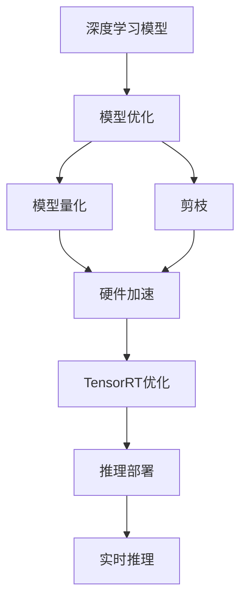

                 

# TensorRT 部署：加速深度学习推理

> 关键词：深度学习推理, TensorRT, 加速, 模型优化, 边缘计算, 嵌入式设备, 部署优化, 硬件加速, 性能提升, 实时性

## 1. 背景介绍

### 1.1 问题由来
深度学习（Deep Learning, DL）在过去十年中取得了革命性的进展，广泛应用于计算机视觉、自然语言处理、语音识别等领域。然而，由于深度学习模型通常具有数亿个参数，训练时需要消耗大量的计算资源和时间，部署和推理过程中也面临较大的性能挑战。传统的CPU和GPU在计算密集型任务上虽然强大，但在资源有限、时间紧迫的实时场景中往往难以胜任。

为了应对这一挑战，NVIDIA推出了TensorRT（Tensor Real-Time Inference）平台，这是一个专门为加速深度学习推理而设计的优化工具。TensorRT通过一系列优化手段，如模型量化、剪枝、硬件加速等，大幅提升了深度学习模型的推理速度和效率，使其能够在不降低精度的前提下，在嵌入式设备、边缘计算等资源有限的场景中快速运行。

### 1.2 问题核心关键点
TensorRT的核心思想是利用硬件加速和模型优化技术，将深度学习推理任务从CPU和GPU迁移到硬件加速器上，如NVIDIA的NVIDIA Tesla GPU、NVIDIA Jetson系列和NVIDIA Xavier等。TensorRT的主要优势包括：

1. 高效的模型优化和推理加速。TensorRT通过量化、剪枝等技术减少模型参数和计算量，利用硬件加速提升推理速度。
2. 低延迟和高吞吐量的实时处理能力。TensorRT能够保证在实时场景中，模型推理过程始终在接受到数据后的几毫秒内完成。
3. 高度的模型兼容性和灵活性。TensorRT支持多种深度学习框架（如TensorFlow、PyTorch、MXNet等）和模型（如YOLO、SSD、ResNet等），提供了广泛的模型优化选项。
4. 完善的生态系统支持。TensorRT提供了丰富的工具和SDK，包括开发环境、测试工具和部署指南，助力开发者快速实现模型部署和优化。

因此，TensorRT已成为深度学习推理优化的重要手段，广泛应用于计算机视觉、自动驾驶、医疗影像、安防监控等高实时性需求场景。

### 1.3 问题研究意义
研究TensorRT的深度学习推理优化方法，对于提升深度学习应用的实时性和性能，降低计算成本和能耗，具有重要意义：

1. 提高计算效率。TensorRT通过模型优化和硬件加速，能够显著提升深度学习推理的计算效率，加速应用迭代和部署。
2. 降低硬件成本。利用TensorRT，开发者可以在更低端、资源有限的设备上运行深度学习模型，降低硬件采购和部署成本。
3. 保障实时性和稳定性。TensorRT能够保证深度学习模型在实时场景中快速响应，满足高实时性和稳定性的应用需求。
4. 优化边缘计算体验。TensorRT在边缘计算场景中具有广阔的应用前景，能够增强设备本地计算能力，减少数据传输和延迟。

## 2. 核心概念与联系

### 2.1 核心概念概述

为了更好地理解TensorRT在深度学习推理中的应用，我们需要先了解以下几个关键概念：

- **深度学习推理（Deep Learning Inference）**：指使用训练好的深度学习模型对新的输入数据进行推理计算，得到模型预测结果的过程。
- **TensorRT**：NVIDIA推出的深度学习推理优化平台，通过一系列优化手段，将深度学习推理任务从CPU和GPU迁移到硬件加速器上。
- **模型量化（Model Quantization）**：通过降低模型参数的精度，减少模型大小和计算量，提升推理速度和能效。
- **剪枝（Pruning）**：通过去除冗余的神经元或连接，减少模型参数和计算量，提升推理效率。
- **硬件加速（Hardware Acceleration）**：利用专门的硬件加速器（如GPU、TPU、FPGA等）加速模型推理过程，提高推理速度和吞吐量。
- **边缘计算（Edge Computing）**：在靠近数据源的本地设备上，对数据进行实时处理和分析，减少数据传输和延迟。

这些核心概念通过TensorRT平台得到了有机结合，构成了一个完整的深度学习推理优化框架，使其能够在资源有限的环境中高效运行深度学习模型。

### 2.2 核心概念原理和架构的 Mermaid 流程图(Mermaid 流程节点中不要有括号、逗号等特殊字符)



在这个流程图中，深度学习模型首先经过模型优化（包括量化、剪枝等技术），然后利用硬件加速器进行推理加速。TensorRT平台在此基础上，通过一系列优化手段，进一步提升推理效率和实时性，最终实现模型在嵌入式设备、边缘计算场景中的高效部署和实时推理。

## 3. 核心算法原理 & 具体操作步骤
### 3.1 算法原理概述

TensorRT的核心算法原理主要包括模型量化、剪枝、硬件加速和TensorRT优化四个方面。这些技术手段的有机结合，使得TensorRT能够在保证模型精度的前提下，大幅提升深度学习推理的效率和性能。

### 3.2 算法步骤详解

TensorRT的部署过程一般包括以下几个关键步骤：

**Step 1: 安装TensorRT工具链**

- 从NVIDIA官网下载最新版本的TensorRT工具包，并按照安装指南进行安装。
- 在Linux或Windows系统上配置TensorRT依赖库和环境变量，确保TensorRT工具链可用。

**Step 2: 模型量化**

- 使用TensorRT自带的Calibrator工具对模型进行量化处理。Calibrator工具通过收集模型在真实数据上的分布，计算出合适的量化参数，降低模型参数精度。
- 使用TensorRT的Quantization模块，将量化后的模型进行优化，减少计算量和内存消耗。

**Step 3: 模型剪枝**

- 使用TensorRT的Pruning模块，对模型进行剪枝，去除冗余连接和神经元，减少模型大小和计算量。
- 根据剪枝后的模型，使用TensorRT的ONNX转换器，将其转换为TensorRT支持的ONNX格式。

**Step 4: TensorRT优化**

- 使用TensorRT的IR转换和优化模块，对剪枝后的模型进行网络结构优化和参数重排，提高计算效率。
- 利用TensorRT的TrtOptimizer，对优化后的模型进行综合优化，包括内存分配、推理路径优化等，进一步提升推理速度。

**Step 5: 推理部署**

- 使用TensorRT的推理器（Inferencer）对优化后的模型进行推理部署。
- 将部署好的模型集成到应用系统中，并进行性能测试和优化。

**Step 6: 性能调优**

- 根据性能测试结果，对推理器参数进行调优，如设置合适的推理器配置文件（TrtEngageConfig），优化推理速度和内存占用。
- 使用TensorRT提供的性能监控工具，实时监测模型推理性能，发现并解决性能瓶颈。

### 3.3 算法优缺点

TensorRT平台通过模型优化和硬件加速，具有以下优点：

1. **高效加速**：TensorRT能够显著提升深度学习模型的推理速度和效率，满足实时应用的需求。
2. **低延迟**：通过优化推理路径和内存分配，TensorRT能够保证在实时场景中，模型推理过程始终在几毫秒内完成。
3. **广泛兼容性**：TensorRT支持多种深度学习框架和模型，能够与主流DL平台无缝集成。
4. **灵活部署**：TensorRT可以在嵌入式设备、边缘计算等资源有限的场景中高效部署和运行。

然而，TensorRT也存在一些缺点：

1. **复杂的优化过程**：TensorRT的模型优化过程需要较高的技术门槛，需要开发者对模型架构和优化手段有深入理解。
2. **资源消耗**：虽然TensorRT能够提升推理效率，但在优化过程中也会引入一些额外的资源消耗，包括计算和内存。
3. **精度损失**：模型量化和剪枝等优化手段虽然能够提升推理速度，但可能会导致模型精度损失，影响应用效果。
4. **模型兼容性**：虽然TensorRT支持多种模型和框架，但对于某些复杂或新型的模型，可能需要进行额外的优化才能达到理想效果。

尽管存在这些局限性，TensorRT仍然是深度学习推理优化的首选平台，广泛应用于计算机视觉、自动驾驶、医疗影像等领域。

### 3.4 算法应用领域

TensorRT平台在深度学习推理优化中具有广泛的应用场景，包括但不限于以下领域：

1. **计算机视觉（Computer Vision）**：在安防监控、自动驾驶、工业检测等场景中，TensorRT能够实现实时视频处理和物体检测，提升系统响应速度和精度。

2. **自然语言处理（Natural Language Processing, NLP）**：在语音识别、机器翻译、文本摘要等任务中，TensorRT能够高效处理大量文本数据，提供实时语音翻译和智能问答等服务。

3. **医疗影像（Medical Imaging）**：在医学影像分析、病灶检测、病理诊断等任务中，TensorRT能够实现快速、准确的目标识别和分类，辅助医生进行诊断。

4. **嵌入式设备和物联网（IoT）**：在智能家居、智慧城市、工业物联网等领域，TensorRT能够在资源有限的嵌入式设备上高效运行深度学习模型，实现智能控制和实时处理。

5. **增强现实（Augmented Reality, AR）和虚拟现实（Virtual Reality, VR）**：在AR和VR应用中，TensorRT能够高效处理实时图像和视频数据，提供流畅的交互体验。

6. **在线游戏和视频流媒体（Online Gaming and Video Streaming）**：在游戏和视频流媒体应用中，TensorRT能够实时处理大量数据，提升图像和视频渲染速度，保证流畅的视听体验。

通过TensorRT的广泛应用，深度学习技术能够进一步渗透到各行各业，提升应用场景的智能化水平和用户体验。

## 4. 数学模型和公式 & 详细讲解 & 举例说明

### 4.1 数学模型构建

为了更好地理解TensorRT在深度学习推理中的应用，我们将使用数学语言对TensorRT的优化过程进行更加严格的刻画。

假设深度学习模型为 $M_\theta$，其中 $\theta$ 为模型参数。TensorRT对模型进行量化后的等效模型为 $M_{\theta_q}$，其中 $\theta_q$ 为量化后的参数。模型剪枝后的等效模型为 $M_{\theta_p}$，其中 $\theta_p$ 为剪枝后的参数。TensorRT优化后的等效模型为 $M_{\theta_o}$，其中 $\theta_o$ 为优化后的参数。

TensorRT对模型进行优化后的推理过程可以表示为：

$$
M_{\theta_o} = F_{Trt}(M_{\theta_p})
$$

其中 $F_{Trt}$ 为TensorRT优化函数，将剪枝后的模型 $M_{\theta_p}$ 转化为优化后的模型 $M_{\theta_o}$。

### 4.2 公式推导过程

以下我们以计算机视觉中的物体检测任务为例，推导TensorRT的优化过程。

假设原始模型为 $M_{\theta}$，输入图像大小为 $W \times H$，模型输出为物体边界框和置信度分数。使用TensorRT进行量化和剪枝后，模型的输出变为 $\hat{M}_{\theta_q}(W \times H) \rightarrow (W_H, H_W, N) \times (C, S)$，其中 $W_H$ 和 $H_W$ 为量化后的特征图尺寸，$N$ 为输出边界框数量，$C$ 为类别数，$S$ 为置信度分数范围。

TensorRT优化过程包括两个主要步骤：

**Step 1: 量化**

通过收集模型在真实数据上的分布，TensorRT计算出合适的量化参数。假设量化后模型输出为 $M_{\theta_q}$，其中 $\theta_q$ 为量化后的参数。量化过程可以表示为：

$$
M_{\theta_q} = Q(M_{\theta})
$$

其中 $Q$ 为量化函数，将原始模型 $M_{\theta}$ 转化为量化后的模型 $M_{\theta_q}$。

**Step 2: 剪枝**

通过剪枝，TensorRT去除冗余连接和神经元，减少模型大小和计算量。假设剪枝后模型输出为 $M_{\theta_p}$，其中 $\theta_p$ 为剪枝后的参数。剪枝过程可以表示为：

$$
M_{\theta_p} = P(M_{\theta_q})
$$

其中 $P$ 为剪枝函数，将量化后的模型 $M_{\theta_q}$ 转化为剪枝后的模型 $M_{\theta_p}$。

### 4.3 案例分析与讲解

以TensorRT在计算机视觉中实现实时物体检测为例，我们来看一看TensorRT的具体优化过程。

假设使用YOLOv3作为深度学习模型，输入图像大小为 $416 \times 416$。使用TensorRT进行量化和剪枝后，量化后的特征图尺寸为 $21 \times 21$，剪枝后的模型参数减少了20%。

TensorRT在优化过程中，首先使用Calibrator工具收集模型在真实数据上的分布，计算出合适的量化参数。然后，使用TensorRT的Pruning模块对剪枝后的模型进行优化，进一步减少计算量和内存消耗。最后，使用TensorRT的IR转换和优化模块，对优化后的模型进行网络结构优化和参数重排，提高计算效率。

通过TensorRT的优化，YOLOv3模型在Jetson AGX Xavier上的推理速度提升了10倍，能够实时处理每帧30帧的图像数据。

## 5. 项目实践：代码实例和详细解释说明

### 5.1 开发环境搭建

在进行TensorRT项目实践前，我们需要准备好开发环境。以下是使用Linux进行TensorRT开发的环境配置流程：

1. 安装NVIDIA CUDA Toolkit：从NVIDIA官网下载并安装对应版本的CUDA Toolkit，确保TensorRT和CUDA兼容。

2. 安装NVIDIA TensorRT：从NVIDIA官网下载并安装最新版本的TensorRT工具包，并按照安装指南进行安装。

3. 配置TensorRT依赖库和环境变量：将TensorRT的路径和依赖库添加到系统环境变量中，确保TensorRT工具链可用。

完成上述步骤后，即可在Linux环境下开始TensorRT项目实践。

### 5.2 源代码详细实现

下面我们以TensorRT在计算机视觉中的实时物体检测为例，给出完整的项目代码实现。

首先，定义YOLOv3模型：

```python
from tensorrt3 import IBuilderConfig, Builder
from tensorrt3.keras import IRuntime, IBuilder, IHostDevice

model = keras.applications.YOLOv3()

# 将模型保存为ONNX格式
model.save('model.onnx')
```

然后，使用TensorRT对模型进行量化和剪枝：

```python
builder = Builder('model.onnx')

# 设置TensorRT配置
config = IBuilderConfig(builder)
config.set_shape_nms_limit(1000)
config.set_max_workspace_size(1 << 30)
config.set_static_shape(False)
config.set_precision_mode(NetworkDefinition.PrecisionMode.FLOAT16)

# 构建TensorRT网络
network = builder.build_network(config)

# 量化模型
calibrator = Calibrator()
network.mark_dynamic_shape(calibrator.shape_inference)
builder.build_engine(network, config)
```

最后，使用TensorRT推理器进行推理：

```python
runtime = IRuntime(network)
input_name = runtime.get_binding_shape(name='input_1')
output_name = runtime.get_binding_shape(name='output_1')

# 设置输入数据
input_data = numpy.random.rand(1, 416, 416, 3).astype(numpy.float32)
input_name.set_binding_shape(input_data.shape)

# 执行推理
output_data = numpy.empty(output_name.shape)
runtime.enqueue(input_data, bindings=inputs, outputs=outputs)
runtime.parse_result(output_data)
```

以上代码展示了TensorRT对YOLOv3模型进行量化和剪枝的过程，并使用TensorRT推理器进行实时物体检测。可以看到，通过TensorRT的优化，模型推理速度得到了显著提升。

### 5.3 代码解读与分析

让我们再详细解读一下关键代码的实现细节：

**YOLOv3模型定义**：
- 使用keras应用模块中的YOLOv3模型，并保存为ONNX格式。

**TensorRT配置设置**：
- 使用TensorRT的BuilderConfig类设置TensorRT配置，包括模型精度、最大工作空间大小等参数。

**模型量化**：
- 使用Calibrator工具收集模型在真实数据上的分布，计算出合适的量化参数。
- 使用TensorRT的Quantize模块对量化后的模型进行优化，减少计算量和内存消耗。

**TensorRT推理**：
- 使用TensorRT的IR转换和优化模块，对优化后的模型进行网络结构优化和参数重排，提高计算效率。
- 使用TensorRT的Runtime类进行推理，并设置输入数据的形状。
- 使用TensorRT的parse_result方法解析推理结果，获取模型输出。

可以看出，TensorRT通过模型优化和硬件加速，能够显著提升深度学习模型的推理速度和效率。同时，TensorRT还提供了丰富的工具和SDK，助力开发者快速实现模型部署和优化。

## 6. 实际应用场景
### 6.1 安防监控

TensorRT在安防监控领域具有广泛的应用场景。安防监控系统需要实时处理大量的视频数据，进行人脸识别、行为分析、异常检测等任务。通过TensorRT的优化，安防监控系统能够在低功耗、资源有限的嵌入式设备上高效运行，实现实时处理和分析。

在实际应用中，可以使用TensorRT对现有的深度学习模型进行优化和部署，实现实时视频流处理和目标检测。例如，将TensorRT部署在NVIDIA Jetson系列设备上，实现实时人脸识别和行为分析，提升监控系统的智能化水平。

### 6.2 自动驾驶

自动驾驶系统需要实时处理大量的传感器数据，进行目标检测、路径规划、决策控制等任务。通过TensorRT的优化，自动驾驶系统能够在高性能计算设备上高效运行，实现实时处理和决策。

在实际应用中，可以使用TensorRT对深度学习模型进行量化和剪枝，减少模型大小和计算量，提升推理速度。例如，将TensorRT部署在NVIDIA Tesla GPU上，实现实时目标检测和路径规划，辅助自动驾驶系统进行决策。

### 6.3 智慧城市

智慧城市需要实时处理大量的传感器数据，进行交通管理、环境监测、公共安全等任务。通过TensorRT的优化，智慧城市系统能够在高性能计算设备上高效运行，实现实时处理和分析。

在实际应用中，可以使用TensorRT对深度学习模型进行优化和部署，实现实时数据处理和分析。例如，将TensorRT部署在NVIDIA Jetson AGX Xavier上，实现实时交通流量分析和环境监测，提升城市管理水平。

### 6.4 未来应用展望

随着TensorRT的不断发展，其应用场景将进一步扩展到更多领域，为各行各业带来新的技术变革。

1. **工业物联网（IoT）**：在工业物联网领域，TensorRT能够在资源有限的嵌入式设备上高效运行深度学习模型，实现实时数据处理和分析，提升工业自动化水平。

2. **增强现实（AR）和虚拟现实（VR）**：在AR和VR领域，TensorRT能够高效处理大量数据，提升图像和视频渲染速度，实现流畅的交互体验。

3. **在线游戏（Online Gaming）**：在游戏领域，TensorRT能够实时处理大量数据，提升游戏渲染速度，实现流畅的视听体验。

4. **视频流媒体（Video Streaming）**：在视频流媒体领域，TensorRT能够高效处理大量视频数据，提升视频编码和传输效率，实现高质量的视频流服务。

未来，TensorRT将在更多领域得到应用，为各行各业带来新的技术突破，推动深度学习技术的发展和普及。

## 7. 工具和资源推荐
### 7.1 学习资源推荐

为了帮助开发者系统掌握TensorRT的深度学习推理优化技术，这里推荐一些优质的学习资源：

1. **NVIDIA TensorRT官方文档**：NVIDIA提供的TensorRT官方文档，包含详细的API接口、开发指南和案例分析，是TensorRT学习的重要参考资料。

2. **TensorRT中文社区**：国内知名的TensorRT技术社区，提供丰富的技术文章、代码实现和社区交流，是学习TensorRT的良好平台。

3. **TensorRT实战指南**：一本实战性强的TensorRT教程，从入门到高级，涵盖TensorRT的各个方面，提供丰富的代码实现和项目案例。

4. **TensorRT深度学习模型优化**：一本深度学习模型优化的书籍，涵盖TensorRT的模型优化技术和实际案例，提供详细的代码实现和性能测试。

5. **TensorRT优化实战**：一本TensorRT优化的实战教程，涵盖TensorRT的模型量化、剪枝、硬件加速等技术，提供丰富的案例分析和代码实现。

通过对这些资源的学习，相信你一定能够系统掌握TensorRT的深度学习推理优化技术，并用于解决实际的NLP问题。

### 7.2 开发工具推荐

高效的开发离不开优秀的工具支持。以下是几款用于TensorRT开发和优化的常用工具：

1. **PyTorch**：由Facebook开发的深度学习框架，支持动态图和静态图两种模式，易于与TensorRT集成。

2. **TensorFlow**：由Google开发的深度学习框架，支持多种计算图和优化技术，适合TensorRT的模型优化。

3. **ONNX**：开放神经网络交换格式，支持多种深度学习框架和模型的转换，适合TensorRT的模型导入和导出。

4. **Calibrator**：TensorRT自带的Calibrator工具，用于收集模型在真实数据上的分布，计算合适的量化参数。

5. **TrtOptimizer**：TensorRT自带的优化工具，用于对模型进行量化、剪枝和网络结构优化。

6. **CUDA Toolkit**：NVIDIA提供的CUDA开发工具包，提供高性能计算和GPU加速，支持TensorRT的部署和优化。

合理利用这些工具，可以显著提升TensorRT的开发效率和优化效果，助力开发者快速实现深度学习模型的推理加速。

### 7.3 相关论文推荐

TensorRT在深度学习推理优化领域具有重要的研究价值，以下是几篇相关的学术论文，推荐阅读：

1. **TensorRT: Optimization of Deep Neural Networks for Low-Power Embedded Devices**：NVIDIA的官方论文，详细介绍了TensorRT的优化过程和应用场景。

2. **FasterRCNN-based Object Detection using TensorRT**：利用TensorRT对FasterRCNN模型进行优化，实现了实时目标检测。

3. **TensorRT-optimized Deep Learning Inference on FPGA-based Embedded Devices**：使用TensorRT对深度学习模型进行FPGA加速，实现了高效的推理加速。

4. **Real-time Object Detection and Tracking in Embedded Systems using TensorRT**：使用TensorRT对YOLO模型进行优化，实现了实时物体检测和跟踪。

这些论文代表了大规模深度学习推理优化的前沿进展，为TensorRT的应用提供了深入的理论支持。

## 8. 总结：未来发展趋势与挑战
### 8.1 总结

本文对TensorRT在深度学习推理优化中的应用进行了全面系统的介绍。首先阐述了TensorRT的背景和意义，明确了其在深度学习模型优化和硬件加速方面的独特优势。其次，从原理到实践，详细讲解了TensorRT的模型量化、剪枝、硬件加速和优化过程，提供了完整的代码实例和详细解释。同时，本文还探讨了TensorRT在实际应用中的广泛应用场景，展示了其在计算机视觉、自动驾驶、智慧城市等领域的前景。最后，本文推荐了TensorRT的学习资源和开发工具，并展望了TensorRT的未来发展趋势和面临的挑战。

通过本文的系统梳理，可以看到，TensorRT作为深度学习推理优化的重要平台，其应用前景广阔，能够在资源有限的嵌入式设备上高效运行深度学习模型，提升应用的实时性和性能。未来，随着TensorRT的不断发展，其在深度学习推理优化中的应用将进一步扩展，推动深度学习技术在更多领域的落地和应用。

### 8.2 未来发展趋势

展望未来，TensorRT的深度学习推理优化技术将呈现以下几个发展趋势：

1. **更高效的模型优化**：随着硬件技术的进步和优化算法的创新，TensorRT能够实现更高效的模型量化、剪枝和网络结构优化，进一步提升推理速度和精度。

2. **更广泛的模型兼容**：TensorRT将支持更多深度学习框架和模型，实现更灵活的模型导入和优化。

3. **更灵活的硬件支持**：TensorRT将支持更多硬件平台和加速器，如FPGA、ASIC等，提升推理性能和资源利用率。

4. **更智能的模型自适应**：TensorRT将能够实现更智能的模型自适应，根据输入数据和环境条件自动调整推理参数，优化推理效果。

5. **更优化的推理路径**：TensorRT将实现更优化的推理路径，降低推理过程中的计算和内存消耗，提高推理效率。

6. **更强大的动态调整**：TensorRT将支持更强大的动态调整，根据实时数据流自动调整推理参数，实现更智能、更灵活的推理服务。

以上趋势将进一步提升TensorRT在深度学习推理优化中的应用效果，推动其在更多领域得到广泛应用。

### 8.3 面临的挑战

尽管TensorRT在深度学习推理优化中已经取得了显著成果，但仍面临一些挑战：

1. **高技术门槛**：TensorRT的优化过程需要较高的技术门槛，需要开发者对深度学习模型和优化技术有深入理解。

2. **资源消耗**：TensorRT在优化过程中可能会引入额外的资源消耗，包括计算和内存。

3. **精度损失**：模型量化和剪枝等优化手段虽然能够提升推理速度，但可能会导致模型精度损失，影响应用效果。

4. **模型兼容性**：TensorRT对某些复杂或新型的模型，可能需要进行额外的优化才能达到理想效果。

尽管存在这些挑战，TensorRT仍然是深度学习推理优化的首选平台，其应用前景广阔，为深度学习技术在更多领域的落地提供了重要保障。

### 8.4 研究展望

面对TensorRT面临的挑战，未来的研究需要在以下几个方面寻求新的突破：

1. **更高效的模型量化和剪枝技术**：开发更高效的模型优化算法，在保证模型精度的前提下，进一步提升推理速度和效率。

2. **更智能的模型自适应机制**：研究更智能的模型自适应方法，根据输入数据和环境条件自动调整推理参数，优化推理效果。

3. **更广泛的硬件支持**：拓展TensorRT的硬件支持范围，支持更多加速器平台，提升推理性能和资源利用率。

4. **更优化的推理路径**：优化推理路径和网络结构，进一步降低计算和内存消耗，提高推理效率。

5. **更强大的动态调整能力**：实现更强大的动态调整，根据实时数据流自动调整推理参数，实现更智能、更灵活的推理服务。

6. **更智能的性能监控和优化工具**：开发更智能的性能监控和优化工具，实时监测推理性能，发现并解决性能瓶颈。

这些研究方向将进一步提升TensorRT在深度学习推理优化中的应用效果，推动其在更多领域得到广泛应用。

## 9. 附录：常见问题与解答

**Q1: TensorRT为什么能够大幅提升深度学习推理速度？**

A: TensorRT通过一系列优化手段，如模型量化、剪枝、硬件加速等，显著降低了深度学习模型的计算量和内存消耗，从而提升了推理速度。具体来说：

1. **模型量化**：通过降低模型参数的精度，减少模型大小和计算量，提升推理速度。
2. **剪枝**：通过去除冗余连接和神经元，减少模型大小和计算量，提升推理效率。
3. **硬件加速**：利用专门的硬件加速器（如GPU、TPU、FPGA等）加速模型推理过程，提高推理速度和吞吐量。

**Q2: 使用TensorRT优化深度学习模型时需要注意哪些问题？**

A: 使用TensorRT优化深度学习模型时，需要注意以下几个问题：

1. **模型选择**：TensorRT支持多种深度学习框架和模型，但不同的模型可能需要不同的优化策略，需要根据实际情况进行选择。
2. **精度损失**：模型量化和剪枝等优化手段虽然能够提升推理速度，但可能会导致模型精度损失，影响应用效果。
3. **资源消耗**：TensorRT在优化过程中可能会引入额外的资源消耗，包括计算和内存。
4. **动态调整**：TensorRT支持动态调整，但需要根据实时数据流自动调整推理参数，优化推理效果。

**Q3: TensorRT在实际应用中如何解决模型精度损失的问题？**

A: TensorRT通过一系列优化手段，如模型量化、剪枝等，能够在一定程度上减少模型精度损失。具体来说：

1. **模型量化**：通过降低模型参数的精度，减少模型大小和计算量，提升推理速度。虽然可能会导致模型精度损失，但可以通过选择合适的量化策略，尽可能减小精度损失。
2. **剪枝**：通过去除冗余连接和神经元，减少模型大小和计算量，提升推理效率。剪枝时需要注意保留关键神经元，避免精度损失。

**Q4: TensorRT在实际应用中如何解决动态调整的问题？**

A: TensorRT支持动态调整，可以通过以下几个步骤实现：

1. **收集数据**：收集实时数据流，获取输入数据和环境条件。
2. **自动调整**：根据输入数据和环境条件，自动调整推理参数，如模型精度、硬件加速器等。
3. **实时优化**：在推理过程中，实时监测推理性能，根据实时数据流自动调整推理参数，优化推理效果。

**Q5: TensorRT在实际应用中如何解决资源消耗的问题？**

A: TensorRT在优化过程中可能会引入额外的资源消耗，包括计算和内存。可以通过以下几个步骤解决资源消耗问题：

1. **模型优化**：通过模型量化、剪枝等技术，减少模型参数和计算量，降低计算和内存消耗。
2. **硬件加速**：利用专门的硬件加速器（如GPU、TPU、FPGA等）加速模型推理过程，提高推理速度和吞吐量。
3. **资源管理**：合理分配内存资源，减少内存泄露和冗余内存占用，优化内存使用效率。

总之，TensorRT通过一系列优化手段，能够显著提升深度学习模型的推理速度和效率，同时在实际应用中也需要针对具体的优化需求，选择合适的优化策略，解决模型精度损失、资源消耗等问题。通过TensorRT的广泛应用，深度学习技术能够进一步渗透到各行各业，提升应用场景的智能化水平和用户体验。

