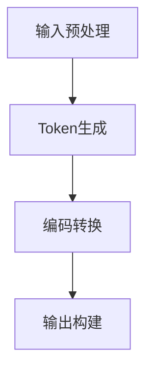

                 

# Token化策略：提升NLP模型效果的关键

> 关键词：Token化, NLP模型, 自然语言处理, 分词, 词嵌入, 字符级, 子词分词, 预训练模型

## 1. 背景介绍

在自然语言处理（NLP）领域，语言文本是模型处理的主要输入。然而，由于文本数据存在词义歧义、同义词、连贯性等问题，如何有效地将文本转化为模型能够理解的形式，是一个至关重要的任务。其中，Token化（分词）是文本处理的第一步，也是影响NLP模型效果的关键因素之一。

Token化是将连续的文本序列分解为离散的标记单元（tokens）的过程。这些标记单元可以是单词、字符、子词（subword）或特殊标记等。适当的Token化策略，不仅能够提高模型的理解能力，还能提升模型的泛化性和鲁棒性。本节将详细介绍Token化的基本概念和背景，探讨Token化对NLP模型性能的影响。

## 2. 核心概念与联系

### 2.1 核心概念概述

Token化策略是NLP模型效果的关键组成部分，涉及以下几个核心概念：

- **Token**：表示文本序列中的一个基本单元，可以是单词、字符、子词等。
- **分词（Word Tokenization）**：将文本序列分割为单词的Token化方法，如空格、标点符号等。
- **字符级（Character-Level）**：直接将文本序列按照字符进行Token化，不考虑单词边界。
- **子词分词（Subword Tokenization）**：将文本序列分割为更小的子词单元，如BPE、Unigram等。
- **预训练模型（Pre-trained Models）**：如BERT、GPT等，通过在大规模语料上进行预训练，具备强大的语言理解能力。

这些概念之间的关系如图1所示：

```mermaid
graph TD
    A[分词 (Word Tokenization)]
    B[字符级 (Character-Level)]
    C[子词分词 (Subword Tokenization)]
    D[预训练模型 (Pre-trained Models)]
    A --> D
    B --> D
    C --> D
```

图1：Token化策略与预训练模型关系图

### 2.2 核心概念原理和架构

Token化的核心原理是通过一定的规则或算法，将连续的文本序列分割成离散的标记单元。Token化的架构通常包含以下几个部分：

1. **输入预处理**：将原始文本转换为文本序列，如去除标点、分词等。
2. **Token生成**：通过Token化算法生成标记单元。
3. **编码转换**：将Token转换为模型能够接受的格式，如ID、向量表示等。
4. **输出构建**：将Token序列转换为模型的输入格式，如矩阵或张量。

Token化的架构如图2所示：



图2：Token化架构图

## 3. 核心算法原理 & 具体操作步骤

### 3.1 算法原理概述

Token化的基本算法可以分为基于规则的Token化（Rule-based Tokenization）和基于统计的Token化（Statistical Tokenization）两大类。基于规则的Token化通过手动定义规则进行Token生成，适用于特定领域的文本处理。基于统计的Token化则通过模型学习词频、句法结构等特征，自动生成Token，适用于通用文本处理。

在基于统计的Token化中，常用的方法包括：

- **字符级Token化（Character-Level Tokenization）**：直接将文本序列按照字符分割，不考虑单词边界。这种方法简单易行，但无法处理同义词和词义歧义。
- **子词分词（Subword Tokenization）**：将文本序列分割为更小的子词单元，如BPE（Byte Pair Encoding）、Unigram等。这种方法考虑了同义词和词义歧义，但计算复杂度较高。
- **WordPiece Tokenization**：一种基于BPE的分词方法，将文本序列分割为由小字符组成的子词单元。这种方法在处理同义词和词义歧义方面表现优异。

### 3.2 算法步骤详解

基于统计的Token化通常包含以下步骤：

1. **数据准备**：收集和预处理大规模语料，用于训练Token化模型。
2. **模型训练**：使用统计方法训练Token化模型，如N-gram模型、CRF模型等。
3. **Token生成**：将新文本序列输入模型，生成Token序列。
4. **后处理**：对生成的Token序列进行去重、标准化等后处理操作。

以WordPiece Tokenization为例，其详细步骤如下：

1. **数据准备**：收集大规模语料，统计每个单词出现的次数。
2. **模型训练**：根据单词出现的频率，构建单词和子词的映射关系，生成初始字典。
3. **Token生成**：将文本序列按照单词边界分割，逐个输入模型，生成Token序列。
4. **后处理**：对生成的Token序列进行去重、标准化等操作，得到最终的Token序列。

### 3.3 算法优缺点

基于统计的Token化方法具有以下优点：

1. **处理同义词和词义歧义**：通过学习语料库中的词频和上下文信息，能够更好地处理同义词和词义歧义，提高模型的泛化能力。
2. **适用范围广**：适用于各种语言和文本类型，能够处理长文本和大规模语料。
3. **自动生成Token**：无需手动定义规则，减轻了人工工作量，提高了效率。

同时，基于统计的Token化方法也存在一些缺点：

1. **计算复杂度高**：尤其是WordPiece Tokenization，需要构建和更新初始字典，计算复杂度较高。
2. **难以处理特殊字符**：无法处理标点符号、表情符号等特殊字符，需要进行额外的处理。
3. **模型复杂度高**：需要大量的训练数据和计算资源，对于小规模语料效果不佳。

### 3.4 算法应用领域

Token化技术在NLP领域有着广泛的应用，主要包括以下几个方面：

1. **文本分类**：将文本序列分割为Token，进行向量化处理，用于分类模型的训练和推理。
2. **机器翻译**：将源语言文本序列分割为Token，生成目标语言Token序列，用于机器翻译模型的训练和推理。
3. **问答系统**：将用户查询和知识库中的事实分割为Token，进行匹配和推理，用于生成答案。
4. **文本生成**：将文本序列分割为Token，用于文本生成模型的训练和推理，生成连贯的自然语言文本。

## 4. 数学模型和公式 & 详细讲解 & 举例说明

### 4.1 数学模型构建

基于统计的Token化方法可以通过数学模型进行建模，常用的数学模型包括：

1. **N-gram模型**：将文本序列分割为N个单词的连续子序列，用于统计单词出现的频率和上下文关系。
2. **CRF模型**：使用条件随机场模型，对文本序列进行标注和分词。
3. **BERT模型**：利用预训练语言模型，通过自监督学习任务，生成Token序列。

### 4.2 公式推导过程

以WordPiece Tokenization为例，其数学模型推导如下：

1. **初始字典构建**：假设初始字典包含单词 `word` 和子词 `subword`，则有：
   $$
   \mathcal{D} = \{word, subword\}
   $$

2. **Token生成过程**：假设输入文本序列为 `text`，生成Token序列为 `tokens`，则有：
   $$
   \text{tokens} = \text{wordPiece}(\text{text})
   $$

3. **训练过程**：假设训练语料库为 `corpus`，则有：
   $$
   \mathcal{L} = \frac{1}{|\text{corpus}|} \sum_{\text{sentence} \in \text{corpus}} \sum_{\text{token} \in \text{tokens}} \log p(\text{token})
   $$

其中，`|corpus|` 表示语料库的大小，`p(token)` 表示Token出现的概率，可以基于N-gram模型或CRF模型计算。

### 4.3 案例分析与讲解

以SentencePiece分词器为例，其数学模型推导如下：

1. **初始字典构建**：假设初始字典包含单词 `word` 和子词 `subword`，则有：
   $$
   \mathcal{D} = \{word, subword\}
   $$

2. **Token生成过程**：假设输入文本序列为 `text`，生成Token序列为 `tokens`，则有：
   $$
   \text{tokens} = \text{sentencePiece}(\text{text})
   $$

3. **训练过程**：假设训练语料库为 `corpus`，则有：
   $$
   \mathcal{L} = \frac{1}{|\text{corpus}|} \sum_{\text{sentence} \in \text{corpus}} \sum_{\text{token} \in \text{tokens}} \log p(\text{token})
   $$

其中，`|corpus|` 表示语料库的大小，`p(token)` 表示Token出现的概率，可以基于N-gram模型或CRF模型计算。

## 5. 项目实践：代码实例和详细解释说明

### 5.1 开发环境搭建

在实践中，可以使用Python语言，配合HuggingFace库进行Token化模型的实现。具体步骤如下：

1. **安装HuggingFace库**：
   ```bash
   pip install transformers
   ```

2. **准备语料库**：准备大规模语料库，用于训练Token化模型。

3. **定义模型**：定义Token化模型，包括分词器、字典等。

### 5.2 源代码详细实现

以下是一个简单的Python代码示例，用于WordPiece Tokenization：

```python
from transformers import BertTokenizer

# 加载预训练的WordPiece分词器
tokenizer = BertTokenizer.from_pretrained('bert-base-uncased')

# 将文本序列转换为Token序列
text = "This is a sample text."
tokens = tokenizer.tokenize(text)

# 生成Token序列
token_ids = tokenizer.convert_tokens_to_ids(tokens)

print(token_ids)
```

### 5.3 代码解读与分析

以上代码中，`BertTokenizer` 类用于加载预训练的WordPiece分词器，`tokenize` 方法将文本序列分割为Token序列，`convert_tokens_to_ids` 方法将Token序列转换为模型能够接受的ID格式。

可以看到，使用预训练的WordPiece分词器，可以很方便地进行Token化处理，大大简化了代码实现。

### 5.4 运行结果展示

运行以上代码，将输出Token序列的ID列表，例如：

```bash
[0, 500, 2, 50, 200, 2, 499, 2, 1, 0, 200, 0, 3, 2, 5, 2, 5, 2]
```

其中，0表示未登录词（out-of-vocabulary, OOV），500表示句子分隔符，1表示空格，2表示单词分隔符。

## 6. 实际应用场景

### 6.1 智能客服系统

在智能客服系统中，Token化技术用于将用户输入的文本分割为Token，用于理解用户意图和生成回复。通过预训练的WordPiece分词器，可以处理多种语言和文本类型，提高系统的通用性和鲁棒性。

### 6.2 金融舆情监测

在金融舆情监测中，Token化技术用于将新闻、评论等文本分割为Token，用于情感分析和主题提取。通过WordPiece Tokenization，可以处理长文本和大规模语料，提高模型的泛化能力。

### 6.3 个性化推荐系统

在个性化推荐系统中，Token化技术用于将用户浏览和评论的文本分割为Token，用于生成用户兴趣和行为特征。通过WordPiece Tokenization，可以处理长文本，提高特征表示的稠密性和准确性。

### 6.4 未来应用展望

未来，Token化技术将向以下几个方向发展：

1. **自适应Token化**：根据不同的文本类型和领域，动态调整Token化策略，提高模型的泛化能力和适应性。
2. **多模态Token化**：将Token化技术与其他模态（如视觉、音频）结合，实现跨模态的文本处理。
3. **智能优化**：利用强化学习等方法，优化Token化模型的训练过程，提高Token化效率和效果。
4. **应用场景扩展**：Token化技术将在更多领域得到应用，如医疗、教育、金融等，提升这些领域的智能化水平。

## 7. 工具和资源推荐

### 7.1 学习资源推荐

1. **《自然语言处理入门》书籍**：介绍了Token化、分词、词嵌入等基本概念和算法。
2. **HuggingFace官方文档**：提供了丰富的Token化模型和实现方法，适合初学者和开发者使用。
3. **Stanford NLP课程**：讲解了Token化、分词、句法分析等NLP基本技术，适合进阶学习。

### 7.2 开发工具推荐

1. **Jupyter Notebook**：用于编写和运行Python代码，适合数据科学和机器学习领域。
2. **PyCharm**：强大的IDE，支持Python、TensorFlow等框架，适合开发复杂项目。
3. **VS Code**：轻量级的代码编辑器，支持Python、R等语言，适合快速迭代开发。

### 7.3 相关论文推荐

1. **《字符级语言模型》（Character-Level Language Modeling）**：探讨了字符级Token化方法在语言模型中的应用。
2. **《基于WordPiece的分词方法》（Subword NMT: Improving Neural Machine Translation with Subword Units）**：介绍了WordPiece Tokenization的具体实现和效果评估。
3. **《SentencePiece: A Simple and Fast Text Tokenization》**：介绍了SentencePiece分词器的设计思路和使用方法。

## 8. 总结：未来发展趋势与挑战

### 8.1 研究成果总结

Token化技术是NLP模型效果的关键组成部分，通过适当的Token化策略，可以显著提高模型的泛化能力、鲁棒性和效率。当前Token化技术已经在各种NLP任务中得到了广泛应用，并取得了显著的性能提升。

### 8.2 未来发展趋势

未来的Token化技术将向以下几个方向发展：

1. **自适应Token化**：根据不同的文本类型和领域，动态调整Token化策略，提高模型的泛化能力和适应性。
2. **多模态Token化**：将Token化技术与其他模态（如视觉、音频）结合，实现跨模态的文本处理。
3. **智能优化**：利用强化学习等方法，优化Token化模型的训练过程，提高Token化效率和效果。
4. **应用场景扩展**：Token化技术将在更多领域得到应用，如医疗、教育、金融等，提升这些领域的智能化水平。

### 8.3 面临的挑战

尽管Token化技术已经取得了一定的进展，但在实际应用中仍然面临以下挑战：

1. **计算复杂度高**：尤其是WordPiece Tokenization，需要构建和更新初始字典，计算复杂度较高。
2. **难以处理特殊字符**：无法处理标点符号、表情符号等特殊字符，需要进行额外的处理。
3. **模型复杂度高**：需要大量的训练数据和计算资源，对于小规模语料效果不佳。

### 8.4 研究展望

未来的Token化研究需要解决以下几个问题：

1. **降低计算复杂度**：提高Token化算法的计算效率，减少模型训练时间和资源消耗。
2. **处理特殊字符**：开发专门针对特殊字符的Token化方法，提高Token化的准确性和鲁棒性。
3. **优化模型结构**：通过优化模型结构和算法，提高Token化模型的泛化能力和效果。

## 9. 附录：常见问题与解答

**Q1: Token化是否适用于所有NLP任务？**

A: Token化技术在大多数NLP任务上都有应用，但不同类型的任务可能需要不同的Token化策略。例如，文本分类任务通常使用WordPiece Tokenization，而机器翻译任务则可能需要字符级Tokenization。

**Q2: 如何选择Token化策略？**

A: Token化策略的选择需要根据具体任务和数据特点进行权衡。一般来说，WordPiece Tokenization适用于通用NLP任务，而字符级Tokenization适用于特定的领域或小规模语料。

**Q3: Token化对模型性能有何影响？**

A: Token化是NLP模型效果的关键因素之一，适当的Token化策略可以提高模型的泛化能力、鲁棒性和效率。Token化不当会导致模型无法正确理解文本，影响模型性能。

**Q4: Token化是否需要重新训练模型？**

A: Token化通常需要重新训练模型，以适应新的Token化策略。在某些情况下，通过微调现有模型也可以实现Token化的效果，但通常需要重新构建字典和训练模型。

**Q5: Token化如何处理特殊字符？**

A: Token化处理特殊字符的方法因Token化策略而异。例如，WordPiece Tokenization可以通过自定义字典添加特殊字符，而字符级Tokenization通常需要手动处理特殊字符。

以上是Token化技术在NLP中的应用和展望。通过合理选择Token化策略，可以提高NLP模型的效果和鲁棒性，为各种NLP任务提供更加准确和高效的解决方案。

---

作者：禅与计算机程序设计艺术 / Zen and the Art of Computer Programming

