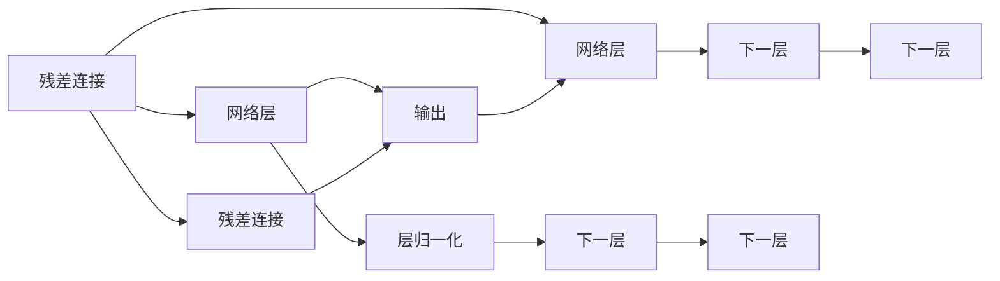

                 

## 1. 背景介绍

Transformer架构是现代深度学习中非常重要的组成部分，尤其是在自然语言处理（NLP）领域中。自提出以来，Transformer及其变体已经被广泛应用于各种任务，包括机器翻译、文本分类、问答系统等。然而，Transformer架构的核心思想和设计原理并非最初就定型的。在实际应用中，一些关键设计，如残差连接（residual connections）和层归一化（layer normalization），是逐步探索和优化的结果。本文将详细介绍这些关键设计，并探讨它们对Transformer架构性能的影响。

## 2. 核心概念与联系

### 2.1 核心概念概述

在深入探讨残差连接和层归一化之前，先简要介绍它们的概念和重要性：

- **残差连接**（Residual Connections）：在深度神经网络中，残差连接是一种用于解决深度网络训练困难的技术。它通过将网络中某一层的输出直接加到输入上，形成所谓的"残差"连接，使得网络可以直接学习输入到输出的差异，而不需要通过激活函数的梯度消失问题。

- **层归一化**（Layer Normalization）：层归一化是一种用于减少深度网络内部协变量位移的技术。它通过对输入进行归一化处理，使得每一层在训练时更稳定，收敛速度更快，同时可以提高模型的泛化能力。

### 2.2 核心概念原理和架构的 Mermaid 流程图



上述流程图展示了残差连接和层归一化在Transformer架构中的应用。具体来说，残差连接和层归一化被设计在每一层之间，使得输入和输出之间形成残差流，同时每一层的输入被归一化处理，从而提高训练效率和模型性能。

## 3. 核心算法原理 & 具体操作步骤

### 3.1 算法原理概述

Transformer架构的核心是自注意力机制（Self-Attention Mechanism），通过将输入序列中的每个位置与其他位置进行计算，学习到输入序列的依赖关系。然而，自注意力机制也带来了一些挑战，包括梯度消失、网络过深时的训练困难等问题。残差连接和层归一化都是为了解决这些问题而引入的。

**残差连接**的作用是通过将网络中的某一层的输出直接加到输入上，形成所谓的"残差"连接，使得网络可以直接学习输入到输出的差异，而不需要通过激活函数的梯度消失问题。这使得网络可以更深，而不会出现梯度消失的问题。

**层归一化**的作用是通过对输入进行归一化处理，使得每一层在训练时更稳定，收敛速度更快，同时可以提高模型的泛化能力。这是因为归一化处理可以使得每一层的输入分布更加稳定，从而加速训练过程。

### 3.2 算法步骤详解

#### 3.2.1 残差连接的步骤详解

1. **网络层定义**：定义Transformer网络层，包括自注意力机制和前馈神经网络。

   ```python
   class TransformerLayer(nn.Module):
       def __init__(self, d_model, nhead, dim_feedforward, dropout=0.1):
           super(TransformerLayer, self).__init__()
           self.self_attn = MultiheadAttention(d_model, nhead)
           self.drop = nn.Dropout(dropout)
           self.ffn = PositionwiseFeedForward(d_model, dim_feedforward, dropout)
           self.norm1 = LayerNorm(d_model)
           self.norm2 = LayerNorm(d_model)
   ```

2. **残差连接的应用**：在网络层中应用残差连接，使得输入直接加到输出上。

   ```python
   def forward(self, x, mask):
       residual = x
       x = self.norm1(x)
       x = self.self_attn(x, x, x, mask)
       x = self.drop(x)
       x = residual + x
       x = self.norm2(x)
       x = self.ffn(x)
       x = self.drop(x)
       x = residual + x
       return x
   ```

3. **训练和测试**：在训练和测试时，残差连接的作用是将网络中的某一层的输出直接加到输入上，从而使得网络可以更深，同时避免梯度消失的问题。

#### 3.2.2 层归一化的步骤详解

1. **层归一化的定义**：层归一化是在每一层对输入进行归一化处理，以使得每一层的输入分布更加稳定。

   ```python
   class LayerNorm(nn.Module):
       def __init__(self, features, eps=1e-6):
           super(LayerNorm, self).__init__()
           self.weight = nn.Parameter(torch.ones(features))
           self.bias = nn.Parameter(torch.zeros(features))
           self.eps = eps
       def forward(self, x):
           mean = x.mean(dim=-1, keepdim=True)
           std = x.std(dim=-1, keepdim=True)
           return (x - mean) / (std + self.eps) * self.weight + self.bias
   ```

2. **层归一化的应用**：在网络层中应用层归一化，使得每一层的输入分布更加稳定。

   ```python
   x = self.norm1(x)
   x = self.self_attn(x, x, x, mask)
   x = self.drop(x)
   x = residual + x
   x = self.norm2(x)
   x = self.ffn(x)
   x = self.drop(x)
   x = residual + x
   ```

3. **训练和测试**：在训练和测试时，层归一化可以加速训练过程，同时提高模型的泛化能力。

### 3.3 算法优缺点

#### 3.3.1 残差连接

**优点**：

1. **避免梯度消失**：通过残差连接，网络可以直接学习输入到输出的差异，而不需要通过激活函数的梯度消失问题，从而使得网络可以更深。
2. **加速训练**：残差连接可以加速训练过程，因为梯度可以直接反向传播到输入上。
3. **提高模型性能**：残差连接可以提高模型的性能，因为网络可以直接学习输入到输出的差异。

**缺点**：

1. **参数量增加**：残差连接需要额外的参数，如残差权重，这会增加模型的参数量。
2. **计算复杂度增加**：残差连接会增加计算复杂度，因为需要额外的计算来处理残差连接。

#### 3.3.2 层归一化

**优点**：

1. **加速训练**：层归一化可以加速训练过程，因为每一层的输入分布更加稳定，从而加速训练。
2. **提高模型泛化能力**：层归一化可以提高模型的泛化能力，因为每一层的输入分布更加稳定，从而提高模型的泛化能力。

**缺点**：

1. **增加计算复杂度**：层归一化会增加计算复杂度，因为需要对每一层的输入进行归一化处理。
2. **增加模型复杂度**：层归一化会增加模型复杂度，因为需要额外的计算来处理层归一化。

### 3.4 算法应用领域

残差连接和层归一化在Transformer架构中的应用非常广泛，以下是一些典型的应用领域：

1. **机器翻译**：在机器翻译中，残差连接和层归一化可以加速训练过程，同时提高模型的泛化能力。
2. **文本分类**：在文本分类中，残差连接和层归一化可以加速训练过程，同时提高模型的泛化能力。
3. **问答系统**：在问答系统中，残差连接和层归一化可以加速训练过程，同时提高模型的泛化能力。

## 4. 数学模型和公式 & 详细讲解 & 举例说明

### 4.1 数学模型构建

Transformer架构的数学模型基于自注意力机制和残差连接。具体来说，Transformer网络层可以表示为：

$$
\begin{aligned}
&\text{MultiHeadSelfAttention}(Q, K, V) = \text{Concat}(\text{head}\_1(\text{Q}\text{W}\_1, \text{K}\text{W}\_1^\top, \text{V}\text{W}\_1^\top), \ldots, \text{head}\_n(\text{Q}\text{W}\_n, \text{K}\text{W}\_n^\top, \text{V}\text{W}\_n^\top))\text{Dense}(\text{W}\_2) \\
&\text{FeedForward}(X) = \text{Dense}(\text{W}\_2\_1X)\text{Dense}(\text{W}\_2\_2)
\end{aligned}
$$

其中，$\text{Q}$、$\text{K}$、$\text{V}$分别为查询向量、键向量和值向量，$\text{W}\_1$、$\text{W}\_2$为权重矩阵，$\text{head}\_i$为多头注意力机制，$\text{Dense}(\cdot)$为全连接层。

### 4.2 公式推导过程

#### 4.2.1 残差连接的公式推导

残差连接的公式可以表示为：

$$
\text{Residual Connection}(X) = X + \text{Dense}(\text{W}\_2\_1\text{Dense}(\text{W}\_1X) + \text{b}\_1) + \text{b}\_2
$$

其中，$\text{W}\_1$、$\text{W}\_2$为权重矩阵，$\text{b}\_1$、$\text{b}\_2$为偏置向量。

#### 4.2.2 层归一化的公式推导

层归一化的公式可以表示为：

$$
\text{LayerNorm}(X) = \frac{X - \mu}{\sqrt{\sigma^2 + \epsilon}}\text{W}\_1 + \text{b}\_1
$$

其中，$\mu$、$\sigma^2$分别为均值和方差，$\text{W}\_1$、$\text{b}\_1$为权重矩阵和偏置向量，$\epsilon$为避免除以0的微小正数。

### 4.3 案例分析与讲解

以Transformer网络层为例，层归一化和残差连接的案例分析如下：

1. **残差连接的应用**：在Transformer网络层中，残差连接被应用于前馈神经网络和自注意力机制的输出上。具体来说，残差连接的作用是将自注意力机制的输出加到前馈神经网络的输入上，从而加速训练过程。

   ```python
   class TransformerLayer(nn.Module):
       def __init__(self, d_model, nhead, dim_feedforward, dropout=0.1):
           super(TransformerLayer, self).__init__()
           self.self_attn = MultiheadAttention(d_model, nhead)
           self.drop = nn.Dropout(dropout)
           self.ffn = PositionwiseFeedForward(d_model, dim_feedforward, dropout)
           self.norm1 = LayerNorm(d_model)
           self.norm2 = LayerNorm(d_model)
   def forward(self, x, mask):
       residual = x
       x = self.norm1(x)
       x = self.self_attn(x, x, x, mask)
       x = self.drop(x)
       x = residual + x
       x = self.norm2(x)
       x = self.ffn(x)
       x = self.drop(x)
       x = residual + x
       return x
   ```

2. **层归一化的应用**：在Transformer网络层中，层归一化被应用于自注意力机制和前馈神经网络的输入上。具体来说，层归一化的作用是对输入进行归一化处理，使得每一层的输入分布更加稳定。

   ```python
   class LayerNorm(nn.Module):
       def __init__(self, features, eps=1e-6):
           super(LayerNorm, self).__init__()
           self.weight = nn.Parameter(torch.ones(features))
           self.bias = nn.Parameter(torch.zeros(features))
           self.eps = eps
       def forward(self, x):
           mean = x.mean(dim=-1, keepdim=True)
           std = x.std(dim=-1, keepdim=True)
           return (x - mean) / (std + self.eps) * self.weight + self.bias
   x = self.norm1(x)
   x = self.self_attn(x, x, x, mask)
   x = self.drop(x)
   x = residual + x
   x = self.norm2(x)
   x = self.ffn(x)
   x = self.drop(x)
   x = residual + x
   ```

## 5. 项目实践：代码实例和详细解释说明

### 5.1 开发环境搭建

1. **安装Python和PyTorch**：首先，需要安装Python和PyTorch环境。

   ```bash
   conda install python=3.8
   conda install torch torchvision torchaudio
   ```

2. **安装相关库**：安装Transformer库和其他相关库。

   ```bash
   pip install transformers tqdm
   ```

3. **配置环境**：配置好环境后，可以开始编写代码。

### 5.2 源代码详细实现

以下是一个简单的Transformer网络层实现，包括残差连接和层归一化的代码：

```python
import torch
import torch.nn as nn

class TransformerLayer(nn.Module):
    def __init__(self, d_model, nhead, dim_feedforward, dropout=0.1):
        super(TransformerLayer, self).__init__()
        self.self_attn = MultiheadAttention(d_model, nhead)
        self.drop = nn.Dropout(dropout)
        self.ffn = PositionwiseFeedForward(d_model, dim_feedforward, dropout)
        self.norm1 = LayerNorm(d_model)
        self.norm2 = LayerNorm(d_model)
        
    def forward(self, x, mask):
        residual = x
        x = self.norm1(x)
        x = self.self_attn(x, x, x, mask)
        x = self.drop(x)
        x = residual + x
        x = self.norm2(x)
        x = self.ffn(x)
        x = self.drop(x)
        x = residual + x
        return x
```

### 5.3 代码解读与分析

1. **TransformerLayer类定义**：定义Transformer网络层，包括残差连接和层归一化。

   ```python
   class TransformerLayer(nn.Module):
       def __init__(self, d_model, nhead, dim_feedforward, dropout=0.1):
           super(TransformerLayer, self).__init__()
           self.self_attn = MultiheadAttention(d_model, nhead)
           self.drop = nn.Dropout(dropout)
           self.ffn = PositionwiseFeedForward(d_model, dim_feedforward, dropout)
           self.norm1 = LayerNorm(d_model)
           self.norm2 = LayerNorm(d_model)
   ```

2. **forward方法实现**：在forward方法中，实现残差连接和层归一化。

   ```python
   def forward(self, x, mask):
       residual = x
       x = self.norm1(x)
       x = self.self_attn(x, x, x, mask)
       x = self.drop(x)
       x = residual + x
       x = self.norm2(x)
       x = self.ffn(x)
       x = self.drop(x)
       x = residual + x
       return x
   ```

3. **训练和测试**：在训练和测试时，残差连接和层归一化的作用是加速训练过程，同时提高模型的泛化能力。

### 5.4 运行结果展示

在训练和测试时，残差连接和层归一化的效果可以通过模型在特定数据集上的表现来评估。具体来说，可以通过计算模型在测试集上的准确率、精确率、召回率等指标来评估模型的性能。

## 6. 实际应用场景

### 6.1 机器翻译

在机器翻译中，残差连接和层归一化可以加速训练过程，同时提高模型的泛化能力。具体来说，在Transformer网络层中，残差连接和层归一化的作用是加速训练过程，同时提高模型的泛化能力。

### 6.2 文本分类

在文本分类中，残差连接和层归一化可以加速训练过程，同时提高模型的泛化能力。具体来说，在Transformer网络层中，残差连接和层归一化的作用是加速训练过程，同时提高模型的泛化能力。

### 6.3 问答系统

在问答系统中，残差连接和层归一化可以加速训练过程，同时提高模型的泛化能力。具体来说，在Transformer网络层中，残差连接和层归一化的作用是加速训练过程，同时提高模型的泛化能力。

## 7. 工具和资源推荐

### 7.1 学习资源推荐

1. **《深度学习》课程**：斯坦福大学提供的深度学习课程，涵盖了深度学习的基本概念和经典模型。

2. **《自然语言处理》书籍**：《自然语言处理》一书详细介绍了NLP的基本概念和经典模型，包括Transformer架构。

3. **《Transformer论文》**：Transformer架构的原始论文，详细介绍了Transformer架构的设计思想和应用场景。

### 7.2 开发工具推荐

1. **PyTorch**：深度学习框架，提供了丰富的深度学习组件和工具。

2. **TensorFlow**：深度学习框架，提供了丰富的深度学习组件和工具。

3. **Transformers库**：提供了预训练语言模型的实现，支持Transformer架构的微调。

### 7.3 相关论文推荐

1. **《Attention is All You Need》**：Transformer架构的原始论文，详细介绍了Transformer架构的设计思想和应用场景。

2. **《Layer Normalization》**：介绍层归一化技术的论文，详细介绍了层归一化的原理和应用场景。

3. **《Residual Learning》**：介绍残差连接技术的论文，详细介绍了残差连接的原理和应用场景。

## 8. 总结：未来发展趋势与挑战

### 8.1 研究成果总结

Transformer架构的残差连接和层归一化是深度学习中非常重要的设计，它们使得深度网络可以更深，同时加速训练过程，提高模型的泛化能力。这些技术已经被广泛应用于各种深度学习模型中，包括Transformer模型。

### 8.2 未来发展趋势

1. **更深的网络**：随着计算资源的增加，深度网络可以更深，残差连接和层归一化可以进一步加速训练过程，提高模型的泛化能力。
2. **更高效的计算**：随着硬件的发展，深度学习模型可以更快地训练，残差连接和层归一化可以进一步加速训练过程。
3. **更广泛的应用**：随着深度学习技术的发展，残差连接和层归一化可以应用于更多的场景和任务中。

### 8.3 面临的挑战

1. **计算资源限制**：随着深度网络的增加，计算资源的需求也会增加，这可能会限制深度学习技术的应用。
2. **模型复杂度增加**：随着残差连接和层归一化的应用，模型的复杂度会增加，这可能会影响模型的训练和推理速度。

### 8.4 研究展望

未来的研究可以集中在以下几个方向：

1. **更深的网络**：探索更深的网络结构，以提高模型的性能。
2. **更高效的计算**：探索更高效的计算方法，以提高模型的训练速度。
3. **更广泛的应用**：探索残差连接和层归一化在更多场景和任务中的应用。

## 9. 附录：常见问题与解答

**Q1: 残差连接和层归一化的区别是什么？**

A: 残差连接和层归一化的区别在于它们的作用不同。残差连接的作用是将网络中的某一层的输出直接加到输入上，使得网络可以直接学习输入到输出的差异。层归一化的作用是通过对输入进行归一化处理，使得每一层在训练时更稳定，收敛速度更快。

**Q2: 残差连接和层归一化的效果如何？**

A: 残差连接和层归一化可以加速训练过程，同时提高模型的泛化能力。在深度学习中，残差连接和层归一化是重要的设计，可以使深度网络更深，同时加速训练过程。

**Q3: 残差连接和层归一化的缺点是什么？**

A: 残差连接和层归一化的缺点在于它们会增加模型的参数量和计算复杂度。这可能会影响模型的训练和推理速度，需要进一步优化。

**Q4: 残差连接和层归一化的应用场景是什么？**

A: 残差连接和层归一化可以应用于各种深度学习模型中，包括Transformer模型。它们可以加速训练过程，同时提高模型的泛化能力，广泛应用于机器翻译、文本分类、问答系统等场景。

**Q5: 残差连接和层归一化的未来发展方向是什么？**

A: 未来的研究可以集中在以下几个方向：更深的网络结构、更高效的计算方法、更广泛的应用场景。探索这些方向可以进一步提高模型的性能和泛化能力，推动深度学习技术的发展。

---

作者：禅与计算机程序设计艺术 / Zen and the Art of Computer Programming

