                 

# Transformer架构：residual连接、层归一化和GPT-2模型解析

## 1. 背景介绍

Transformer架构是深度学习领域的一项重要突破，其成功推动了自然语言处理(NLP)、计算机视觉(CV)等诸多领域的技术发展。自其问世以来，Transformer及其变体模型（如BERT、GPT-2等）已成为NLP任务中的标准模型。

Transformer架构的提出主要基于两个核心思想：自注意力机制和残差连接。自注意力机制使得模型能够自动学习输入序列的语义关系，而残差连接则解决了梯度消失问题，提高了模型训练效率。

## 2. 核心概念与联系

### 2.1 核心概念概述

- **自注意力机制**：允许模型在计算输入序列中每个位置与其他位置的关系时，不需要先显式计算其他位置的信息。

- **残差连接**：使用输入序列的直接映射来跳过部分网络层，缓解梯度消失问题。

- **层归一化(Layer Normalization)**：对每个样本在每个层中的每个位置进行归一化处理，使模型更稳定，收敛更快。

- **位置编码(Positional Encoding)**：在自注意力机制中，由于模型无法直接获取输入序列中的位置信息，需要使用位置编码来指示每个位置的相对位置关系。

- **GPT-2模型**：GPT-2（Generative Pre-trained Transformer 2）是OpenAI提出的基于Transformer架构的预训练语言模型，通过在大规模无标签文本上预训练，学习通用语言表示。

这些核心概念通过Transformer架构进行了巧妙的结合，使得模型能够高效地进行序列数据的处理和生成。

### 2.2 核心概念原理和架构的 Mermaid 流程图

```mermaid
graph LR
    A[输入序列] --> B[编码器]
    B --> C[多头自注意力层]
    C --> D[前馈神经网络]
    D --> E[编码器层]
    E --> F[层归一化]
    F --> G[残差连接]
    G --> H[解码器]
    H --> I[解码器层]
    I --> J[多头自注意力层]
    J --> K[前馈神经网络]
    K --> L[解码器层]
    L --> M[层归一化]
    M --> N[残差连接]
    N --> O[输出]
```



## 3. 核心算法原理 & 具体操作步骤

### 3.1 算法原理概述

Transformer架构的核心在于自注意力机制和残差连接。在自注意力机制中，模型通过计算输入序列中每个位置与其他位置的相关性，自动学习输入的语义关系。残差连接则允许模型直接跳过部分网络层，缓解梯度消失问题。层归一化通过对每个样本在每个层中的每个位置进行归一化处理，使模型更稳定，收敛更快。

GPT-2模型是Transformer架构的一个典型应用，其通过在大规模无标签文本上预训练，学习通用语言表示。预训练后的GPT-2模型可以在下游NLP任务上进行微调，获得优异的性能。

### 3.2 算法步骤详解

#### 3.2.1 自注意力机制

Transformer的自注意力机制计算分为三个步骤：

1. **缩放点积注意力**：首先对输入序列中每个位置进行编码，得到三个向量：查询向量$q_i$、键向量$k_i$和值向量$v_i$。查询向量$q_i$和键向量$k_i$进行点积，得到注意力得分，再通过softmax函数计算注意力权重。

2. **计算加权和**：将注意力权重与值向量$v_i$进行加权求和，得到每个位置的相关信息。

3. **残差连接和层归一化**：将相关信息与原始输入进行残差连接，并经过层归一化处理，得到最终输出。

#### 3.2.2 残差连接

残差连接允许模型直接跳过部分网络层，缓解梯度消失问题。其计算方式如下：

$$
x_i = x_i + \text{MLP}(x_i)
$$

其中$x_i$为输入序列中第$i$个位置的表示，$\text{MLP}$为多层感知器。

#### 3.2.3 层归一化

层归一化通过对每个样本在每个层中的每个位置进行归一化处理，使模型更稳定，收敛更快。其计算方式如下：

$$
y_i = \frac{x_i - \mu}{\sigma} + \mu
$$

其中$\mu$和$\sigma$分别为每个位置的均值和标准差。

### 3.3 算法优缺点

#### 3.3.1 优点

- **高效计算**：自注意力机制和残差连接使得模型能够并行计算，加速了计算过程。

- **稳定收敛**：层归一化使模型更稳定，收敛更快，避免了梯度消失问题。

- **广泛应用**：Transformer架构不仅在NLP领域取得了成功，还被应用于CV、音频处理等领域。

#### 3.3.2 缺点

- **计算复杂度高**：自注意力机制的计算复杂度较高，需要使用大规模GPU进行训练。

- **参数量较大**：Transformer模型参数量较大，需要较长的训练时间和较多的存储空间。

- **结构复杂**：模型结构复杂，需要进行详细的参数调整和优化。

### 3.4 算法应用领域

Transformer架构主要应用于序列数据处理和生成任务，如NLP任务中的机器翻译、文本生成、问答系统等。GPT-2模型在这些任务上取得了显著的效果，并被广泛应用于文本生成、对话系统、智能客服等领域。

## 4. 数学模型和公式 & 详细讲解

### 4.1 数学模型构建

Transformer模型的数学模型可以分为编码器和解码器两部分，如下所示：

- **编码器**：
$$
\begin{aligned}
&\text{Encoder} = \text{Layer}_n \times n\\
&\text{Layer}_i = \text{MLP} + \text{Attention} + \text{Layer Normalization}
\end{aligned}
$$

- **解码器**：
$$
\begin{aligned}
&\text{Decoder} = \text{Layer}_n \times n\\
&\text{Layer}_i = \text{MLP} + \text{Attention} + \text{Layer Normalization}
\end{aligned}
$$

其中$MLP$为多层感知器，$\text{Attention}$为自注意力机制，$\text{Layer Normalization}$为层归一化。

### 4.2 公式推导过程

#### 4.2.1 自注意力机制

以Transformer的自注意力机制为例，进行公式推导。

假设输入序列为$x_1,\ldots,x_n$，每个位置的向量表示为$x_i \in \mathbb{R}^d$。首先对输入序列进行编码，得到三个向量：查询向量$q_i$、键向量$k_i$和值向量$v_i$。查询向量$q_i$和键向量$k_i$进行点积，得到注意力得分：

$$
s_i = q_i \cdot k_i
$$

然后通过softmax函数计算注意力权重：

$$
a_i = \frac{\exp(s_i)}{\sum_{j=1}^n \exp(s_j)}
$$

将注意力权重与值向量$v_i$进行加权求和，得到每个位置的相关信息：

$$
z_i = \sum_{j=1}^n a_j v_j
$$

最终输出为残差连接和层归一化的结果：

$$
x_i = \text{LayerNormalization}(x_i + z_i)
$$

#### 4.2.2 残差连接和层归一化

残差连接和层归一化的计算过程如下：

$$
y_i = \text{LayerNormalization}(x_i + \text{MLP}(x_i))
$$

其中$\text{MLP}$为多层感知器，$\text{LayerNormalization}$为层归一化。

### 4.3 案例分析与讲解

以机器翻译任务为例，分析Transformer模型的计算过程。

假设输入序列为英语句子“I like apples”，输出序列为法语句子“J aime des pommes”。首先对输入序列进行编码，得到三个向量：查询向量$q_i$、键向量$k_i$和值向量$v_i$。通过自注意力机制计算每个位置的注意力权重和相关信息，得到编码器的输出。然后解码器以相同的步骤进行计算，最终得到翻译结果。

## 5. 项目实践：代码实例和详细解释说明

### 5.1 开发环境搭建

为了实现Transformer模型，首先需要搭建好开发环境。以下是使用Python和PyTorch搭建环境的步骤：

1. 安装Anaconda：从官网下载并安装Anaconda，用于创建独立的Python环境。

2. 创建并激活虚拟环境：
```bash
conda create -n pytorch-env python=3.8 
conda activate pytorch-env
```

3. 安装PyTorch：根据CUDA版本，从官网获取对应的安装命令。例如：
```bash
conda install pytorch torchvision torchaudio cudatoolkit=11.1 -c pytorch -c conda-forge
```

4. 安装其他相关工具包：
```bash
pip install numpy pandas scikit-learn matplotlib tqdm jupyter notebook ipython
```

### 5.2 源代码详细实现

以下是使用PyTorch实现Transformer模型的代码示例。

```python
import torch
import torch.nn as nn
import torch.nn.functional as F

class SelfAttention(nn.Module):
    def __init__(self, in_dim, out_dim, attn_heads):
        super(SelfAttention, self).__init__()
        self.in_dim = in_dim
        self.out_dim = out_dim
        self.attn_heads = attn_heads
        self.attn_dropout = nn.Dropout(0.1)
        self.ffn_dropout = nn.Dropout(0.1)
        self.ffn_activation = nn.ReLU()
        
        self.WQ = nn.Linear(in_dim, in_dim)
        self.WK = nn.Linear(in_dim, in_dim)
        self.WV = nn.Linear(in_dim, out_dim)
        self.WO = nn.Linear(out_dim, out_dim)

    def forward(self, x):
        batch_size = x.size(0)
        Q = self.WQ(x).view(batch_size, -1, self.attn_heads, self.in_dim // self.attn_heads).permute(0, 2, 1, 3).contiguous()
        K = self.WK(x).view(batch_size, -1, self.attn_heads, self.in_dim // self.attn_heads).permute(0, 2, 1, 3).contiguous()
        V = self.WV(x).view(batch_size, -1, self.attn_heads, self.out_dim // self.attn_heads).permute(0, 2, 1, 3).contiguous()
        Q = Q / torch.sqrt(torch.tensor(self.in_dim) // self.attn_heads)
        attention_scores = torch.matmul(Q, K.transpose(1, 2))
        attention_probs = nn.functional.softmax(attention_scores, dim=-1)
        context_layer = torch.matmul(attention_probs, V)
        context_layer = context_layer.permute(0, 2, 1, 3).contiguous().view(batch_size, -1, self.out_dim)
        attention_output = self.WO(context_layer) + x
        attention_output = self.ffn_activation(attention_output)
        attention_output = self.ffn_dropout(attention_output)
        attention_output = self.attn_dropout(attention_output)
        return attention_output

class TransformerEncoder(nn.Module):
    def __init__(self, in_dim, out_dim, n_layers, attn_heads, dropout):
        super(TransformerEncoder, self).__init__()
        self.layers = nn.ModuleList([SelfAttention(in_dim, out_dim, attn_heads) for _ in range(n_layers)])
        self.final_layer = nn.Linear(in_dim, out_dim)
        self.final_dropout = nn.Dropout(dropout)
        self.layer_norm = nn.LayerNorm(out_dim)
        
    def forward(self, x):
        for layer in self.layers:
            x = layer(x)
            x = self.layer_norm(x)
        x = self.final_layer(x)
        x = self.final_dropout(x)
        return x

class TransformerDecoder(nn.Module):
    def __init__(self, in_dim, out_dim, n_layers, attn_heads, dropout):
        super(TransformerDecoder, self).__init__()
        self.layers = nn.ModuleList([SelfAttention(in_dim, out_dim, attn_heads) for _ in range(n_layers)])
        self.final_layer = nn.Linear(in_dim, out_dim)
        self.final_dropout = nn.Dropout(dropout)
        self.layer_norm = nn.LayerNorm(out_dim)
        self.GD = nn.Linear(in_dim, out_dim)
        self.BD = nn.Linear(out_dim, out_dim)
        self.d_self_attn = nn.Linear(in_dim, out_dim)
        self.d_attention = nn.Linear(in_dim, out_dim)
        self.d_ff = nn.Linear(in_dim, out_dim)
        
    def forward(self, x, encoder_outputs):
        for layer in self.layers:
            x = layer(x, encoder_outputs)
            x = self.layer_norm(x)
        x = self.final_layer(x)
        x = self.final_dropout(x)
        return x

class Transformer(nn.Module):
    def __init__(self, input_dim, output_dim, n_layers, attn_heads, dropout):
        super(Transformer, self).__init__()
        self.encoder = TransformerEncoder(input_dim, output_dim, n_layers, attn_heads, dropout)
        self.decoder = TransformerDecoder(output_dim, output_dim, n_layers, attn_heads, dropout)
        self.final_layer = nn.Linear(output_dim, output_dim)
        self.final_dropout = nn.Dropout(dropout)
        self.layer_norm = nn.LayerNorm(output_dim)
        
    def forward(self, x, encoder_outputs):
        x = self.encoder(x)
        x = self.decoder(x, encoder_outputs)
        x = self.final_layer(x)
        x = self.final_dropout(x)
        x = self.layer_norm(x)
        return x
```

### 5.3 代码解读与分析

以下是代码中每个关键部分的解读：

- **SelfAttention模块**：该模块实现了Transformer的自注意力机制。通过三个线性层计算查询向量、键向量和值向量，再进行点积和softmax，得到注意力权重和相关信息。

- **TransformerEncoder和TransformerDecoder模块**：这两个模块分别实现了Transformer的编码器和解码器。其中，TransformerEncoder包含多个SelfAttention层，TransformerDecoder包含多个SelfAttention层和解码器层。

- **Transformer类**：该类实现了完整的Transformer模型。包括编码器、解码器和输出层，以及层归一化、残差连接等操作。

### 5.4 运行结果展示

```python
# 运行代码，输入英文句子，输出法语句子
text = "I like apples"
tokenizer = transformers.BertTokenizer.from_pretrained('bert-base-uncased')
inputs = tokenizer.encode(text, return_tensors='pt')
outputs = model(inputs)
decoded_text = tokenizer.decode(outputs[0], skip_special_tokens=True)
print(decoded_text)
```

## 6. 实际应用场景

### 6.1 智能客服系统

智能客服系统可以利用Transformer模型进行文本分类和生成，实现自动回复客户咨询。该模型可以学习到大量的客服对话数据，自动理解客户意图和生成合适的回答，提高服务效率和客户满意度。

### 6.2 机器翻译

Transformer模型在机器翻译任务上取得了突破性进展。通过在大规模无标签文本上进行预训练，模型能够自动学习不同语言之间的语义关系，从而实现高效、准确的机器翻译。

### 6.3 文本生成

Transformer模型在文本生成任务上也表现出色。通过在预训练模型上进行微调，模型可以生成自然流畅的文本，应用于写作辅助、聊天机器人等领域。

### 6.4 未来应用展望

未来，Transformer模型将更广泛地应用于各种NLP任务，如问答系统、命名实体识别、信息抽取等。同时，结合生成对抗网络、知识图谱等技术，模型将进一步提升对复杂问题的理解和生成能力。

## 7. 工具和资源推荐

### 7.1 学习资源推荐

- **《深度学习》课程**：斯坦福大学开设的NLP课程，详细介绍了深度学习在NLP中的应用，包括Transformer模型。

- **《Transformer from Zero to Hero》**：一篇系统介绍Transformer模型的博客，适合初学者入门。

- **《Attention Is All You Need》论文**：Transformer原论文，详细描述了自注意力机制的原理和实现。

### 7.2 开发工具推荐

- **PyTorch**：深度学习框架，支持动态图和静态图，适合研究和实验。

- **TensorFlow**：深度学习框架，支持分布式训练和生产部署。

- **Transformers库**：HuggingFace开发的NLP工具库，封装了多种Transformer模型，便于微调和使用。

### 7.3 相关论文推荐

- **《Attention Is All You Need》**：Transformer原论文，详细描述了自注意力机制的原理和实现。

- **《BERT: Pre-training of Deep Bidirectional Transformers for Language Understanding》**：BERT模型，提出了一种基于掩码的自监督预训练方法，在NLP任务上取得了优异的效果。

- **《GPT-2: Language Models are Unsupervised Multitask Learners》**：GPT-2模型，展示了大规模语言模型的强大zero-shot学习能力。

## 8. 总结：未来发展趋势与挑战

### 8.1 研究成果总结

Transformer架构在自然语言处理领域取得了巨大的成功，其自注意力机制和残差连接使得模型能够高效地处理序列数据。GPT-2模型在预训练和微调技术上的突破，进一步提升了Transformer模型的性能。

### 8.2 未来发展趋势

- **模型规模增大**：随着计算能力的提升，未来Transformer模型的规模将进一步增大，以容纳更丰富的语言知识。

- **自注意力机制优化**：自注意力机制的优化是未来研究的重要方向。如使用稀疏自注意力、自适应自注意力等技术，提升模型效率和效果。

- **迁移学习**：基于Transformer模型的迁移学习技术将进一步发展，使得模型能够更好地适应新任务和新数据。

- **跨模态融合**：Transformer模型与其他模态的融合，如视觉、语音等，将进一步提升其在多模态领域的性能。

### 8.3 面临的挑战

- **计算资源瓶颈**：Transformer模型计算复杂度高，需要大规模GPU进行训练。如何提高模型训练效率和降低计算成本，是一个重要的挑战。

- **模型泛化能力**：模型在特定领域的泛化能力有待提升。如何构建更加通用的语言模型，适应更广泛的任务和数据，是未来的研究方向。

- **参数量过大**：Transformer模型参数量较大，如何减少模型参数，提升模型压缩效率，也是一个重要的研究方向。

### 8.4 研究展望

- **稀疏自注意力**：使用稀疏的自注意力机制，减少计算量，提高模型效率。

- **自适应自注意力**：根据不同任务的复杂度，动态调整自注意力机制的参数，提升模型性能。

- **跨模态融合**：将Transformer模型与其他模态进行融合，提升其在多模态领域的性能。

- **迁移学习**：基于Transformer模型的迁移学习技术将进一步发展，使得模型能够更好地适应新任务和新数据。

总之，Transformer架构在自然语言处理领域已经取得了巨大的成功，未来仍有广阔的研究空间和应用前景。研究者需要不断探索新的优化技术，解决计算资源瓶颈，提升模型泛化能力，推动Transformer模型在更多领域的应用。

## 9. 附录：常见问题与解答

**Q1: Transformer架构的优缺点是什么？**

**A1:** Transformer架构的优点包括：
- **高效计算**：自注意力机制和残差连接使得模型能够并行计算，加速了计算过程。
- **稳定收敛**：层归一化使模型更稳定，收敛更快，避免了梯度消失问题。
- **广泛应用**：Transformer架构不仅在NLP领域取得了成功，还被应用于CV、音频处理等领域。

Transformer架构的缺点包括：
- **计算复杂度高**：自注意力机制的计算复杂度较高，需要使用大规模GPU进行训练。
- **参数量较大**：Transformer模型参数量较大，需要较长的训练时间和较多的存储空间。
- **结构复杂**：模型结构复杂，需要进行详细的参数调整和优化。

**Q2: 如何训练Transformer模型？**

**A2:** 训练Transformer模型需要以下步骤：
1. 数据预处理：对输入序列进行编码，得到查询向量、键向量和值向量。
2. 自注意力计算：通过点积和softmax计算注意力权重，得到每个位置的相关信息。
3. 残差连接和层归一化：将相关信息与原始输入进行残差连接，并经过层归一化处理。
4. 前馈神经网络：对输出进行多层感知器计算。
5. 重复步骤2-4，进行多层的计算。
6. 输出结果：通过多层计算得到最终的输出结果。

**Q3: 什么是层归一化？**

**A3:** 层归一化通过对每个样本在每个层中的每个位置进行归一化处理，使模型更稳定，收敛更快。其计算方式为：

$$
y_i = \frac{x_i - \mu}{\sigma} + \mu
$$

其中$\mu$和$\sigma$分别为每个位置的均值和标准差。

**Q4: Transformer模型在机器翻译任务中的应用**

**A4:** Transformer模型在机器翻译任务中的应用主要体现在以下几个方面：
1. 自注意力机制使得模型能够自动学习输入序列中每个位置与其他位置的关系，学习不同语言之间的语义关系。
2. 残差连接和层归一化使得模型更稳定，收敛更快。
3. 多层计算可以使得模型能够捕捉更复杂的语言结构和语义关系。
4. 通过在预训练模型上进行微调，模型可以适应不同的机器翻译任务，提升翻译效果。

**Q5: 如何优化Transformer模型的性能？**

**A5:** 优化Transformer模型性能的方法包括：
1. 数据增强：通过回译、近义替换等方式扩充训练集。
2. 正则化：使用L2正则、Dropout等避免过拟合。
3. 对抗训练：引入对抗样本，提高模型鲁棒性。
4. 层归一化：对每个样本在每个层中的每个位置进行归一化处理。
5. 残差连接：使用输入序列的直接映射来跳过部分网络层，缓解梯度消失问题。

**Q6: 什么是自注意力机制？**

**A6:** 自注意力机制允许模型在计算输入序列中每个位置与其他位置的关系时，不需要先显式计算其他位置的信息。其计算方式为：
1. 对输入序列中每个位置进行编码，得到查询向量$q_i$、键向量$k_i$和值向量$v_i$。
2. 查询向量$q_i$和键向量$k_i$进行点积，得到注意力得分。
3. 通过softmax函数计算注意力权重。
4. 将注意力权重与值向量$v_i$进行加权求和，得到每个位置的相关信息。

---

作者：禅与计算机程序设计艺术 / Zen and the Art of Computer Programming

