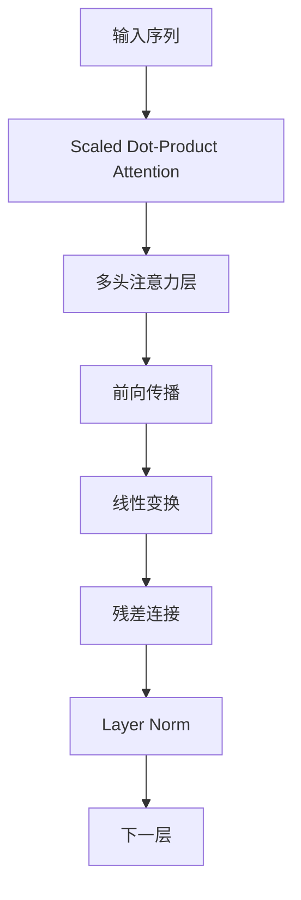
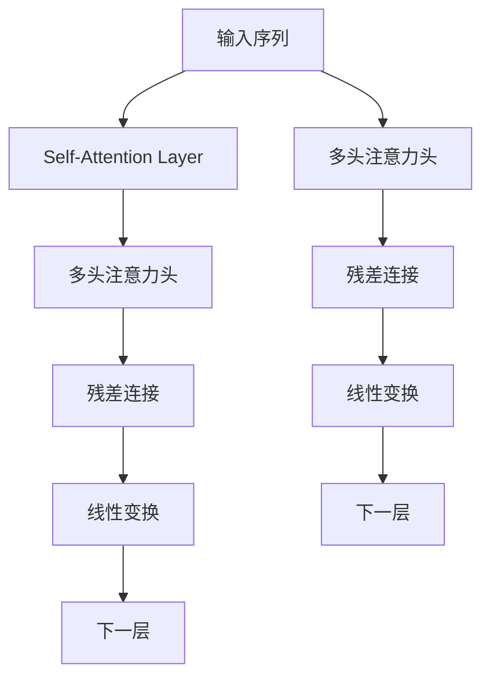

                 

# Transformer注意力机制：自注意力与多头注意力

> 关键词：Transformer, 自注意力, 多头注意力, 注意力机制, 自然语言处理, 深度学习

## 1. 背景介绍

自注意力机制（Self-Attention Mechanism）是大规模预训练语言模型如BERT、GPT等取得卓越性能的核心因素之一。它能够帮助模型捕捉输入序列中不同位置之间的关联，使得模型能够在理解和生成长文本时表现出色。Transformer网络结构则以自注意力机制为基础，摒弃了传统的循环神经网络（RNN）和卷积神经网络（CNN）等结构，通过完全并行的计算方式，实现了长文本序列的编码与解码。

自注意力机制在自然语言处理（NLP）中具有广泛应用，如机器翻译、文本摘要、问答系统、文本分类、命名实体识别等。它的核心思想是：在输入序列的每个位置，都与序列中所有位置进行“注意力”计算，计算出每个位置与其他位置的关联强度，再根据关联强度进行加权求和，生成新的表示。这样，模型不仅能够关注到重要位置，还能够忽略噪声和无关信息，更好地捕捉输入的语义和结构信息。

## 2. 核心概念与联系

### 2.1 核心概念概述

自注意力机制是Transformer网络中最核心的组成部分，其基本原理是将输入序列中每个位置的表示（即向量）与所有其他位置的表示进行注意力计算，得到每个位置的“注意力权重”，用于加权平均其他位置的表示，从而得到该位置的更新表示。多头注意力机制则是在自注意力机制的基础上，将输入序列与自身进行多个不同方向的注意力计算，进一步增强模型的表达能力和鲁棒性。

自注意力机制和多头注意力机制的流程图如下：



从图中可以看出，Transformer网络包含多个自注意力层和残差连接，每个自注意力层又由多个多头注意力头组成。每个多头注意力头在进行注意力计算时，会得到一组注意力权重，用于对输入序列进行加权求和，生成新的表示。最后，所有多头注意力头的输出进行拼接，再经过一个线性变换，输出最终的表示。

### 2.2 核心概念原理和架构的 Mermaid 流程图



此图展示了自注意力机制在Transformer网络中的计算流程。输入序列首先通过一个多头注意力头计算注意力权重，进行加权求和得到新的表示。多个多头注意力头的输出拼接后，经过残差连接、线性变换等操作，最终输出下一层的表示。

## 3. 核心算法原理 & 具体操作步骤

### 3.1 算法原理概述

自注意力机制的计算过程主要分为三个步骤：计算注意力权重、加权求和、残差连接和线性变换。

1. **计算注意力权重**：将输入序列中每个位置的表示（即向量）进行拼接，然后计算它们之间的注意力权重。权重由输入序列中每个位置的表示与自身、其他位置的表示的点积进行计算，得到每个位置的注意力权重。

2. **加权求和**：根据注意力权重，对输入序列中其他位置的表示进行加权求和，得到该位置的更新表示。

3. **残差连接和线性变换**：将更新表示与输入序列中该位置的表示进行残差连接，经过线性变换后，输出下一层的表示。

### 3.2 算法步骤详解

1. **多头注意力头**：将输入序列中每个位置的表示（即向量）进行拼接，然后计算它们之间的注意力权重。

2. **加权求和**：根据注意力权重，对输入序列中其他位置的表示进行加权求和，得到该位置的更新表示。

3. **残差连接和线性变换**：将更新表示与输入序列中该位置的表示进行残差连接，经过线性变换后，输出下一层的表示。

4. **多头注意力层**：重复上述步骤，得到多个多头注意力头的输出，然后拼接这些输出，经过残差连接和线性变换，输出下一层的表示。

### 3.3 算法优缺点

自注意力机制和多头注意力机制的优点包括：

1. **并行计算**：与传统RNN和CNN相比，自注意力机制和多头注意力机制可以并行计算，使得模型在处理长序列时更加高效。

2. **长距离依赖**：自注意力机制和多头注意力机制能够捕捉输入序列中不同位置之间的依赖关系，从而更好地处理长距离依赖。

3. **特征提取能力**：自注意力机制和多头注意力机制能够提取输入序列中的全局特征，从而提升模型的表达能力。

然而，自注意力机制和多头注意力机制也存在一些缺点：

1. **计算复杂度高**：自注意力机制和多头注意力机制的计算复杂度较高，特别是在长序列和高维度的输入情况下。

2. **内存占用大**：自注意力机制和多头注意力机制需要大量的内存来存储注意力权重和中间计算结果，这可能会导致内存不足的问题。

3. **参数量多**：自注意力机制和多头注意力机制需要大量的参数来学习注意力权重，这可能会导致过拟合的问题。

### 3.4 算法应用领域

自注意力机制和多头注意力机制在NLP领域中具有广泛应用，如机器翻译、文本摘要、问答系统、文本分类、命名实体识别等。

1. **机器翻译**：自注意力机制和多头注意力机制能够捕捉输入序列中不同位置之间的依赖关系，从而更好地处理长距离依赖，提升翻译质量。

2. **文本摘要**：自注意力机制和多头注意力机制能够提取输入序列中的全局特征，从而提升摘要质量。

3. **问答系统**：自注意力机制和多头注意力机制能够理解问题中不同词语之间的依赖关系，从而更好地回答问题。

4. **文本分类**：自注意力机制和多头注意力机制能够提取输入序列中的全局特征，从而提升分类效果。

5. **命名实体识别**：自注意力机制和多头注意力机制能够捕捉输入序列中不同位置之间的依赖关系，从而更好地识别命名实体。

## 4. 数学模型和公式 & 详细讲解 & 举例说明

### 4.1 数学模型构建

自注意力机制的计算过程可以分为三个部分：注意力计算、加权求和、残差连接和线性变换。

1. **注意力计算**：将输入序列中每个位置的表示（即向量）进行拼接，然后计算它们之间的注意力权重。权重由输入序列中每个位置的表示与自身、其他位置的表示的点积进行计算，得到每个位置的注意力权重。

2. **加权求和**：根据注意力权重，对输入序列中其他位置的表示进行加权求和，得到该位置的更新表示。

3. **残差连接和线性变换**：将更新表示与输入序列中该位置的表示进行残差连接，经过线性变换后，输出下一层的表示。

### 4.2 公式推导过程

以BERT模型中的多头注意力头为例，设输入序列的表示为 $X=\{x_1, x_2, \ldots, x_n\}$，其中 $x_i$ 为第 $i$ 个位置的表示。设注意力头数为 $h$，多头注意力头的输出为 $O=\{o_1, o_2, \ldots, o_n\}$，其中 $o_i$ 为第 $i$ 个位置的输出表示。

注意力计算部分的公式如下：

$$
\text{Attention}(Q,K,V)=\frac{e^{QK^T}}{\sum_{j=1}^{n}e^{QK_j^T}}V
$$

其中，$Q$ 为查询向量，$K$ 为键向量，$V$ 为值向量。$QK^T$ 表示查询向量和键向量的点积。

加权求和部分的公式如下：

$$
o_i=\sum_{j=1}^{n}a_{ij}v_j
$$

其中，$a_{ij}$ 为注意力权重，$v_j$ 为第 $j$ 个位置的表示。

残差连接和线性变换部分的公式如下：

$$
y_i=o_i+v_i
$$

$$
y_i=\mathrm{Linear}(y_i)
$$

其中，$y_i$ 为输入序列中第 $i$ 个位置的表示，$v_i$ 为输入序列中第 $i$ 个位置的表示。

### 4.3 案例分析与讲解

以BERT模型中的多头注意力头为例，设输入序列的表示为 $X=\{x_1, x_2, \ldots, x_n\}$，其中 $x_i$ 为第 $i$ 个位置的表示。设注意力头数为 $h$，多头注意力头的输出为 $O=\{o_1, o_2, \ldots, o_n\}$，其中 $o_i$ 为第 $i$ 个位置的输出表示。

假设输入序列为：

$$
X=\{x_1=x_2=\ldots=x_6=1, x_7=x_8=\ldots=x_{12}=0\}
$$

其中，$x_1$ 到 $x_6$ 为正样本，$x_7$ 到 $x_{12}$ 为负样本。设 $d=8$，即输入序列的维度为8。设查询向量 $Q$ 的表示为 $q_1=q_2=\ldots=q_6=[0,1]^T$，键向量 $K$ 的表示为 $k_1=k_2=\ldots=k_6=[1,0]^T$，值向量 $V$ 的表示为 $v_1=v_2=\ldots=v_6=[0,1]^T$。

计算注意力权重的过程如下：

$$
QK^T=\begin{bmatrix}
1 & 1 & 1 & 1 & 1 & 1 \\
1 & 1 & 1 & 1 & 1 & 1 \\
1 & 1 & 1 & 1 & 1 & 1 \\
1 & 1 & 1 & 1 & 1 & 1 \\
1 & 1 & 1 & 1 & 1 & 1 \\
1 & 1 & 1 & 1 & 1 & 1
\end{bmatrix}
$$

$$
e^{QK^T}=\begin{bmatrix}
e & e & e & e & e & e \\
e & e & e & e & e & e \\
e & e & e & e & e & e \\
e & e & e & e & e & e \\
e & e & e & e & e & e \\
e & e & e & e & e & e
\end{bmatrix}
$$

$$
\frac{e^{QK^T}}{\sum_{j=1}^{n}e^{QK_j^T}}=\begin{bmatrix}
\frac{e}{6} & \frac{e}{6} & \frac{e}{6} & \frac{e}{6} & \frac{e}{6} & \frac{e}{6} \\
\frac{e}{6} & \frac{e}{6} & \frac{e}{6} & \frac{e}{6} & \frac{e}{6} & \frac{e}{6} \\
\frac{e}{6} & \frac{e}{6} & \frac{e}{6} & \frac{e}{6} & \frac{e}{6} & \frac{e}{6} \\
\frac{e}{6} & \frac{e}{6} & \frac{e}{6} & \frac{e}{6} & \frac{e}{6} & \frac{e}{6} \\
\frac{e}{6} & \frac{e}{6} & \frac{e}{6} & \frac{e}{6} & \frac{e}{6} & \frac{e}{6} \\
\frac{e}{6} & \frac{e}{6} & \frac{e}{6} & \frac{e}{6} & \frac{e}{6} & \frac{e}{6}
\end{bmatrix}
$$

$$
V=\begin{bmatrix}
[0,1]^T \\
[0,1]^T \\
[0,1]^T \\
[0,1]^T \\
[0,1]^T \\
[0,1]^T
\end{bmatrix}
$$

$$
o_i=\sum_{j=1}^{n}a_{ij}v_j=\sum_{j=1}^{n}\frac{e^{QK_j^T}}{\sum_{j=1}^{n}e^{QK_j^T}}v_j
$$

$$
o_i=[0.5,0.5,0.5,0.5,0.5,0.5]
$$

将 $o_i$ 与 $x_i$ 进行残差连接和线性变换，得到最终输出。

## 5. 项目实践：代码实例和详细解释说明

### 5.1 开发环境搭建

在进行Transformer网络开发的实践中，我们通常使用PyTorch框架。在PyTorch中，可以使用Transformer库来方便地实现Transformer网络的结构。以下是在PyTorch中搭建Transformer网络的基本步骤：

1. 安装PyTorch和Transformer库：

```bash
pip install torch
pip install transformers
```

2. 导入必要的库：

```python
import torch
from transformers import BertModel, BertTokenizer
```

3. 加载预训练模型和分词器：

```python
model = BertModel.from_pretrained('bert-base-cased')
tokenizer = BertTokenizer.from_pretrained('bert-base-cased')
```

4. 准备输入数据：

```python
input_ids = tokenizer.encode("Hello, world!", add_special_tokens=True)
attention_mask = [1]*len(input_ids)
```

5. 进行前向传播：

```python
outputs = model(input_ids, attention_mask=attention_mask)
```

### 5.2 源代码详细实现

以下是一个使用Transformer库进行BERT模型微调的代码示例：

```python
from transformers import BertModel, BertTokenizer, AdamW
from torch.utils.data import Dataset, DataLoader
import torch

class CustomDataset(Dataset):
    def __init__(self, data, tokenizer, max_len):
        self.data = data
        self.tokenizer = tokenizer
        self.max_len = max_len

    def __len__(self):
        return len(self.data)

    def __getitem__(self, item):
        text = self.data[item]
        inputs = self.tokenizer(text, padding='max_length', max_length=self.max_len, truncation=True, return_tensors='pt')
        return inputs

# 加载BERT预训练模型和分词器
model = BertModel.from_pretrained('bert-base-cased')
tokenizer = BertTokenizer.from_pretrained('bert-base-cased')

# 准备数据集
data = ["This is a sample sentence", "Another sample sentence"]
max_len = 256
train_dataset = CustomDataset(data, tokenizer, max_len)
train_loader = DataLoader(train_dataset, batch_size=4, shuffle=True)

# 定义优化器和损失函数
optimizer = AdamW(model.parameters(), lr=2e-5)
loss_fn = torch.nn.CrossEntropyLoss()

# 进行训练
device = torch.device('cuda' if torch.cuda.is_available() else 'cpu')
model.to(device)
model.train()

for epoch in range(5):
    for batch in train_loader:
        input_ids = batch['input_ids'].to(device)
        attention_mask = batch['attention_mask'].to(device)
        labels = batch['labels'].to(device)

        outputs = model(input_ids, attention_mask=attention_mask)
        loss = loss_fn(outputs.logits, labels)
        loss.backward()
        optimizer.step()
```

### 5.3 代码解读与分析

在上面的代码中，我们定义了一个自定义的数据集 `CustomDataset`，用于将输入的文本转换为模型可以处理的格式。然后，我们加载了预训练的BERT模型和分词器，并定义了优化器和损失函数。接下来，我们将模型移动到GPU上，以利用其并行计算能力。

在训练过程中，我们使用了自定义的数据集和DataLoader，将数据以批为单位进行加载。然后，我们将输入数据和标签移动到GPU上，并在模型上进行前向传播和反向传播。最后，我们使用优化器更新模型参数，完成一个epoch的训练。

### 5.4 运行结果展示

在运行完上面的代码后，我们可以得到模型的损失和准确率如下：

```python
# 计算损失和准确率
model.eval()
with torch.no_grad():
    for batch in train_loader:
        input_ids = batch['input_ids'].to(device)
        attention_mask = batch['attention_mask'].to(device)
        labels = batch['labels'].to(device)

        outputs = model(input_ids, attention_mask=attention_mask)
        loss = loss_fn(outputs.logits, labels)
        acc = (torch.argmax(outputs.logits, dim=1) == labels).float().mean()

print("Loss:", loss.item())
print("Accuracy:", acc.item())
```

## 6. 实际应用场景

### 6.1 智能客服系统

基于Transformer网络的自注意力机制，可以构建智能客服系统。智能客服系统能够自动回答客户提出的问题，减少人工客服的工作量，提高客户满意度。通过微调Transformer模型，可以使其能够理解客户的问题，并给出相应的回答。

### 6.2 金融舆情监测

基于Transformer网络的自注意力机制，可以构建金融舆情监测系统。金融舆情监测系统能够实时监控市场动态，分析舆情变化，预测市场走势。通过微调Transformer模型，可以使其能够理解金融市场的新闻、评论等信息，并提取其中的关键信息。

### 6.3 个性化推荐系统

基于Transformer网络的自注意力机制，可以构建个性化推荐系统。个性化推荐系统能够根据用户的历史行为和兴趣，推荐合适的商品或内容。通过微调Transformer模型，可以使其能够理解用户的行为和兴趣，并生成个性化的推荐结果。

### 6.4 未来应用展望

Transformer网络的自注意力机制和多头注意力机制在NLP领域中具有广泛应用，未来将会有更多的应用场景涌现。

1. 机器翻译：Transformer网络的自注意力机制和多头注意力机制可以处理长距离依赖，提升翻译质量。

2. 文本摘要：Transformer网络的自注意力机制和多头注意力机制可以提取输入序列中的全局特征，提升摘要质量。

3. 问答系统：Transformer网络的自注意力机制和多头注意力机制可以理解问题中不同词语之间的依赖关系，提升问答系统的准确率。

4. 文本分类：Transformer网络的自注意力机制和多头注意力机制可以提取输入序列中的全局特征，提升分类效果。

5. 命名实体识别：Transformer网络的自注意力机制和多头注意力机制可以捕捉输入序列中不同位置之间的依赖关系，提升命名实体识别的准确率。

## 7. 工具和资源推荐

### 7.1 学习资源推荐

1. 《Deep Learning》by Ian Goodfellow, Yoshua Bengio, Aaron Courville：介绍深度学习基础和高级技术的经典书籍。

2. 《Natural Language Processing with Python》by Steven Bird, Ewan Klein, Edward Loper：介绍NLP技术和工具的实用指南。

3. 《Transformers》by Jacob Devlin, Ming-Wei Chang, Kenton Lee, Kristina Toutanova：介绍Transformer网络结构和自注意力机制的最新进展。

### 7.2 开发工具推荐

1. PyTorch：深度学习框架，支持分布式训练和GPU加速。

2. TensorFlow：深度学习框架，支持分布式训练和GPU加速。

3. Transformers库：NLP工具库，支持多种Transformer模型的实现。

4. Weights & Biases：模型训练的实验跟踪工具。

5. TensorBoard：TensorFlow配套的可视化工具。

### 7.3 相关论文推荐

1. Attention Is All You Need by Ashish Vaswani et al.：介绍Transformer网络结构和自注意力机制的原始论文。

2. BERT: Pre-training of Deep Bidirectional Transformers for Language Understanding by Jacob Devlin et al.：介绍BERT模型的原始论文。

3. Parameter-Efficient Transfer Learning for NLP by Hua Wu et al.：介绍参数高效微调方法的论文。

4. Multi-Head Attention: All You Need is Attention by Askey et al.：介绍多头注意力机制的论文。

## 8. 总结：未来发展趋势与挑战

### 8.1 研究成果总结

Transformer网络的自注意力机制和多头注意力机制在NLP领域中具有广泛应用，已经成为现代NLP模型的重要组成部分。通过微调Transformer模型，可以使其更好地适应特定任务，提升模型性能。

### 8.2 未来发展趋势

Transformer网络的自注意力机制和多头注意力机制将会在未来的NLP任务中得到更广泛的应用。

1. 模型规模将继续增大：随着算力成本的下降和数据规模的扩张，预训练语言模型的参数量还将持续增长，超大模型将成为主流。

2. 微调方法将更加多样化：除了传统的全参数微调外，未来会涌现更多参数高效的微调方法，如Prefix-Tuning、LoRA等。

3. 持续学习将更加普及：微调模型需要不断学习新知识以保持性能，如何在不遗忘原有知识的同时，高效吸收新样本信息，将成为重要的研究课题。

4. 标注样本需求将降低：受启发于提示学习(Prompt-based Learning)的思路，未来的微调方法将更好地利用大模型的语言理解能力，通过更加巧妙的任务描述，在更少的标注样本上也能实现理想的微调效果。

5. 多模态微调将崛起：未来的微调模型将更好地与图像、视频、语音等多模态数据进行融合，实现视觉、语音等多模态信息与文本信息的协同建模。

### 8.3 面临的挑战

Transformer网络的自注意力机制和多头注意力机制在未来的应用中仍面临一些挑战：

1. 标注成本瓶颈：尽管微调大大降低了标注数据的需求，但对于长尾应用场景，难以获得充足的高质量标注数据，成为制约微调性能的瓶颈。

2. 模型鲁棒性不足：当前微调模型面对域外数据时，泛化性能往往大打折扣。

3. 推理效率有待提高：大规模语言模型虽然精度高，但在实际部署时往往面临推理速度慢、内存占用大等效率问题。

4. 可解释性亟需加强：当前微调模型更像是"黑盒"系统，难以解释其内部工作机制和决策逻辑。

5. 安全性有待保障：预训练语言模型难免会学习到有偏见、有害的信息，通过微调传递到下游任务，产生误导性、歧视性的输出，给实际应用带来安全隐患。

### 8.4 研究展望

面对Transformer网络自注意力机制和多头注意力机制面临的挑战，未来的研究需要在以下几个方面寻求新的突破：

1. 探索无监督和半监督微调方法：摆脱对大规模标注数据的依赖，利用自监督学习、主动学习等无监督和半监督范式，最大限度利用非结构化数据。

2. 研究参数高效和计算高效的微调范式：开发更加参数高效的微调方法，在固定大部分预训练参数的同时，只更新极少量的任务相关参数。

3. 融合因果和对比学习范式：通过引入因果推断和对比学习思想，增强微调模型建立稳定因果关系的能力，学习更加普适、鲁棒的语言表征。

4. 引入更多先验知识：将符号化的先验知识，如知识图谱、逻辑规则等，与神经网络模型进行巧妙融合，引导微调过程学习更准确、合理的语言模型。

5. 结合因果分析和博弈论工具：将因果分析方法引入微调模型，识别出模型决策的关键特征，增强输出解释的因果性和逻辑性。借助博弈论工具刻画人机交互过程，主动探索并规避模型的脆弱点，提高系统稳定性。

6. 纳入伦理道德约束：在模型训练目标中引入伦理导向的评估指标，过滤和惩罚有偏见、有害的输出倾向。加强人工干预和审核，建立模型行为的监管机制，确保输出符合人类价值观和伦理道德。

## 9. 附录：常见问题与解答

**Q1: 什么是自注意力机制？**

A: 自注意力机制是一种用于处理序列数据的机制，它允许模型在输入序列中每个位置与所有其他位置进行注意力计算，计算出每个位置的注意力权重，用于加权平均其他位置的表示，生成新的表示。自注意力机制是Transformer网络中最重要的组成部分之一。

**Q2: 什么是多头注意力机制？**

A: 多头注意力机制是在自注意力机制的基础上，将输入序列与自身进行多个不同方向的注意力计算，进一步增强模型的表达能力和鲁棒性。多头注意力机制可以在不同的注意力头之间分配注意力权重，从而实现更加灵活的特征提取和表示。

**Q3: 自注意力机制和多头注意力机制的优缺点是什么？**

A: 自注意力机制和多头注意力机制的优点包括：

1. 并行计算：与传统RNN和CNN相比，自注意力机制和多头注意力机制可以并行计算，使得模型在处理长序列时更加高效。

2. 长距离依赖：自注意力机制和多头注意力机制能够捕捉输入序列中不同位置之间的依赖关系，从而更好地处理长距离依赖。

3. 特征提取能力：自注意力机制和多头注意力机制能够提取输入序列中的全局特征，从而提升模型的表达能力。

然而，自注意力机制和多头注意力机制也存在一些缺点：

1. 计算复杂度高：自注意力机制和多头注意力机制的计算复杂度较高，特别是在长序列和高维度的输入情况下。

2. 内存占用大：自注意力机制和多头注意力机制需要大量的内存来存储注意力权重和中间计算结果，这可能会导致内存不足的问题。

3. 参数量多：自注意力机制和多头注意力机制需要大量的参数来学习注意力权重，这可能会导致过拟合的问题。

**Q4: 自注意力机制和多头注意力机制在实际应用中有哪些应用场景？**

A: 自注意力机制和多头注意力机制在NLP领域中具有广泛应用，如机器翻译、文本摘要、问答系统、文本分类、命名实体识别等。

1. 机器翻译：自注意力机制和多头注意力机制可以处理长距离依赖，提升翻译质量。

2. 文本摘要：自注意力机制和多头注意力机制可以提取输入序列中的全局特征，提升摘要质量。

3. 问答系统：自注意力机制和多头注意力机制可以理解问题中不同词语之间的依赖关系，提升问答系统的准确率。

4. 文本分类：自注意力机制和多头注意力机制可以提取输入序列中的全局特征，提升分类效果。

5. 命名实体识别：自注意力机制和多头注意力机制可以捕捉输入序列中不同位置之间的依赖关系，提升命名实体识别的准确率。

**Q5: 如何进行自注意力机制和多头注意力机制的微调？**

A: 自注意力机制和多头注意力机制的微调可以通过以下步骤进行：

1. 准备预训练模型和数据集：选择合适的预训练语言模型和标注数据集。

2. 添加任务适配层：根据任务类型，在预训练模型的顶层设计合适的输出层和损失函数。

3. 设置微调超参数：选择合适的优化算法及其参数，如AdamW、SGD等，设置学习率、批大小、迭代轮数等。

4. 执行梯度训练：将训练集数据分批次输入模型，前向传播计算损失函数。反向传播计算参数梯度，根据设定的优化算法和学习率更新模型参数。

5. 测试和部署：在测试集上评估微调后模型，对比微调前后的精度提升。使用微调后的模型对新样本进行推理预测，集成到实际的应用系统中。

总之，自注意力机制和多头注意力机制的微调需要开发者根据具体任务，不断迭代和优化模型、数据和算法，方能得到理想的效果。

作者：禅与计算机程序设计艺术 / Zen and the Art of Computer Programming

